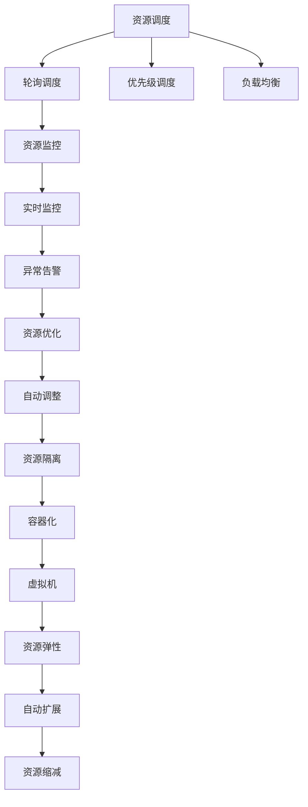
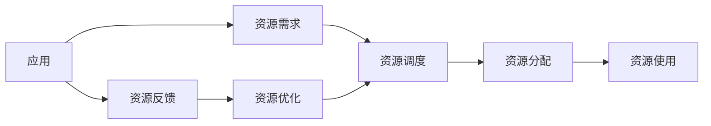
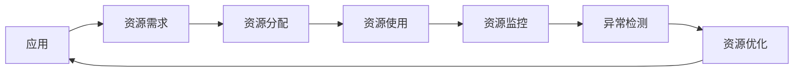
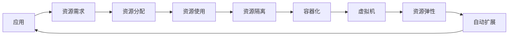

                 

# 资源管理 原理与代码实例讲解

## 1. 背景介绍

### 1.1 问题由来
在现代软件开发和数据科学中，资源管理是基础且关键的一环。无论是处理计算机硬件资源、网络资源，还是数据资源，高效、安全的资源管理对于提升系统性能、保障数据安全、优化用户体验等方面都至关重要。特别是随着云计算、大数据、人工智能等技术的快速发展，资源管理变得更加复杂和多样。本博客将聚焦于计算机资源管理的基本原理和实践方法，帮助读者系统掌握资源管理的技术细节和实用技巧。

### 1.2 问题核心关键点
资源管理的核心在于平衡使用需求与系统资源的限制，最大程度地优化资源利用效率，同时保障数据安全性和系统稳定性。常见问题包括：
- 如何合理调度系统资源，满足应用的高效运行需求？
- 如何在多资源环境中，实现资源之间的有效协调和互操作？
- 如何通过优化算法和策略，提高资源利用率和用户体验？
- 如何设计鲁棒的系统架构，避免资源耗尽和系统崩溃？

资源管理的目标是构建一个高效、弹性、可扩展的资源管理系统，使系统能够灵活应对不断变化的负载需求，同时最大化资源利用率，减少资源浪费。本博客将通过深入剖析资源管理的核心概念和基本原理，结合实际代码实例，详细讲解如何实现高效、安全的资源管理。

## 2. 核心概念与联系

### 2.1 核心概念概述
为了更好地理解资源管理，本节将介绍几个密切相关的核心概念：

- **资源调度（Resource Scheduling）**：指对系统资源（如CPU、内存、存储等）进行分配和调度，以满足应用的需求。常见的调度算法包括轮询、优先级调度、负载均衡等。
- **资源监控（Resource Monitoring）**：指实时监控系统资源的使用情况，包括CPU占用率、内存使用率、磁盘I/O等，以便及时发现资源瓶颈和异常。
- **资源优化（Resource Optimization）**：通过算法和策略，提高资源利用率，减少资源浪费，例如自动调整线程数、内存分配策略、磁盘缓存等。
- **资源隔离（Resource Isolation）**：通过虚拟化或容器化技术，将系统资源隔离到不同的虚拟环境或容器中，确保不同应用之间的资源使用互不影响。
- **资源弹性（Resource Elasticity）**：指系统能够动态调整资源配置，根据负载需求变化，自动扩展或缩减资源。

这些核心概念共同构成了资源管理的完整框架，帮助开发者构建高效、稳定的资源管理系统。以下是一个Mermaid流程图，展示这些概念之间的联系：



这个流程图展示了资源管理的几个关键流程和机制，从资源调度到监控、优化和隔离，再到弹性扩展和缩减，每一步都对资源管理的重要性和效果产生影响。

### 2.2 概念间的关系

这些核心概念之间存在着紧密的联系，形成了资源管理的完整生态系统。以下是几个关键的Mermaid流程图，展示这些概念之间的关系：

#### 2.2.1 资源调度的执行流程


这个流程图展示了资源调度的基本流程，从应用提交资源需求，到调度器进行资源分配，再到应用使用资源，并根据反馈进行优化。

#### 2.2.2 资源监控与优化


这个流程图展示了资源监控和优化的流程，应用使用资源后，资源监控系统实时监测资源使用情况，检测到异常时，触发优化操作。

#### 2.2.3 资源隔离与弹性


这个流程图展示了资源隔离和弹性的流程，资源隔离通过容器化或虚拟机技术，将应用隔离到不同的环境，而弹性则根据负载需求自动扩展或缩减资源。

### 2.3 核心概念的整体架构

最后，我们用一个综合的流程图来展示这些核心概念在大规模系统中的整体架构：


这个综合流程图展示了资源管理在大规模系统中的实现架构，从资源调度到监控、优化、隔离、弹性扩展和缩减，形成了系统的完整资源管理流程。

## 3. 核心算法原理 & 具体操作步骤

### 3.1 算法原理概述
资源管理的基本原理是建立对系统资源的动态感知和控制，通过算法和策略优化资源利用效率，确保系统的稳定性和性能。常见资源管理算法包括：

- **轮询调度（Round Robin Scheduling）**：将系统资源按照时间片轮流分配给不同的应用，确保每个应用获得公平的资源使用机会。
- **优先级调度（Priority Scheduling）**：根据应用的优先级，分配不同比例的资源，确保高优先级应用获得更多的资源。
- **负载均衡（Load Balancing）**：将负载均衡到多个节点或容器中，避免单个节点的过载，提高系统的整体处理能力。
- **动态资源分配（Dynamic Resource Allocation）**：根据系统的负载需求，动态调整资源分配，确保资源使用效率最大化。

### 3.2 算法步骤详解

**Step 1: 资源采集与监控**
- 使用系统API或监控工具，实时采集CPU、内存、磁盘I/O等资源使用情况。
- 设置监控指标的阈值，如CPU占用率超过80%、内存使用率超过90%等，以便及时发现资源瓶颈。

**Step 2: 资源调度与分配**
- 根据应用的资源需求和优先级，使用调度算法进行资源分配。例如，使用轮询调度分配CPU时间片，使用负载均衡分配请求到多个节点。
- 根据应用的使用情况，动态调整资源分配策略，例如增加或减少CPU核心数，优化内存分配。

**Step 3: 资源优化与调整**
- 根据资源监控结果，分析资源使用情况，识别出资源瓶颈。例如，发现某应用CPU占用率过高，可以通过调整线程数或CPU亲和性来解决。
- 使用优化策略，提升资源利用率，例如使用缓存技术减少磁盘I/O，使用预编译技术提高应用启动速度。

**Step 4: 资源隔离与隔离**
- 使用虚拟化或容器化技术，将系统资源隔离到不同的虚拟环境或容器中，避免应用之间的资源冲突。
- 配置资源的隔离策略，例如限制每个容器的内存使用上限，确保系统稳定性。

**Step 5: 资源弹性与扩展**
- 根据系统负载，自动调整资源配置，例如根据CPU负载自动扩展或缩减核心数。
- 使用弹性伸缩技术，支持按需扩展和缩减资源，确保系统的弹性能力。

### 3.3 算法优缺点

资源管理算法具有以下优点：
- **公平性**：轮询调度和优先级调度确保每个应用获得公平的资源使用机会。
- **高性能**：负载均衡和动态资源分配可以提高系统的整体处理能力。
- **灵活性**：资源隔离和弹性扩展支持按需扩展和缩减资源。

同时，这些算法也存在一些缺点：
- **复杂性**：资源管理算法需要综合考虑应用需求、资源限制、负载变化等多个因素，设计和实现复杂。
- **开销高**：频繁的资源监控和调度会增加系统开销，特别是在高负载环境中。
- **瓶颈问题**：资源监控和调度的效率直接影响系统的性能，需要优化算法和策略。

### 3.4 算法应用领域

资源管理算法广泛应用于各种系统和平台，包括：

- **云计算平台**：如AWS、Azure、Google Cloud等，通过调度、监控、优化等技术，支持弹性扩展和资源隔离。
- **大数据平台**：如Hadoop、Spark等，通过动态资源分配和负载均衡，优化数据处理效率。
- **分布式系统**：如Kubernetes、Docker等，通过容器化技术实现资源隔离，通过弹性伸缩技术支持系统扩展。
- **高性能计算**：如HPC集群，通过资源调度算法优化任务调度，提高计算效率。

此外，资源管理算法还可以应用于企业级应用系统，如ERP、CRM等，通过资源优化和弹性扩展，提升系统性能和用户体验。

## 4. 数学模型和公式 & 详细讲解  
### 4.1 数学模型构建

资源管理可以建模为多个子系统的相互作用，如资源调度、监控、优化和隔离。以下是一个简化的数学模型：

设系统中有$n$个应用$A_i$，资源集为$R$，资源分配策略为$S$，资源监控结果为$M$，资源优化策略为$O$，资源隔离策略为$I$，系统目标为$T$。资源管理的目标是最大化系统目标$T$，即：

$$
T=\max_{S,M,O,I} T_i(A_i, R, S, M, O, I)
$$

其中，$T_i$为应用$i$的目标函数，可以是处理速度、资源利用率等指标。

### 4.2 公式推导过程

以CPU资源管理为例，假设系统中有$m$个CPU核心，应用$A_i$需要$c_i$个CPU核心，调度算法为轮询调度，资源监控结果为$M=\{CPU利用率, \text{核心数}, \text{等待时间}\}$，资源优化策略为自动调整线程数，资源隔离策略为将应用隔离到不同的容器中。

设应用$A_i$获得的时间片为$t_i$，则CPU利用率为：

$$
U_i = \frac{t_i}{m}
$$

CPU核心数为：

$$
C_i = \frac{t_i}{c_i}
$$

应用等待时间为：

$$
W_i = \frac{t_i}{c_i} - \frac{t_i}{m}
$$

系统总利用率为：

$$
U = \frac{\sum_{i=1}^n t_i}{m}
$$

应用目标函数为：

$$
T_i(A_i, R, S, M, O, I) = \max_{c_i,t_i} \left( t_i - \lambda W_i \right)
$$

其中$\lambda$为等待时间惩罚系数。

### 4.3 案例分析与讲解

以Linux系统中的CPU调度为例，Linux内核使用了基于时间片的轮询调度算法，每个CPU核心分配一个固定时间片，应用根据优先级获得时间片。

1. **优先级调度**：Linux内核使用CFS（Completely Fair Scheduler）算法，根据应用的优先级和历史使用情况，分配时间片。高优先级应用获得更多时间片，确保实时性应用能够及时响应。
2. **资源监控**：Linux内核使用CFS进程调度器，实时监控每个应用的CPU使用情况，通过CFS的实际周期时间计算和预测时间片分配，确保系统负载均衡。
3. **资源优化**：Linux内核支持动态调整线程数和CPU亲和性，例如使用setrlimit系统调用来限制线程数，使用taskset系统调用来调整CPU亲和性。
4. **资源隔离**：Linux内核支持将应用隔离到不同的虚拟内存空间，使用cgroups（控制组）技术将应用的资源限制在一个控制组中，避免资源冲突。

## 5. 项目实践：代码实例和详细解释说明
### 5.1 开发环境搭建

在进行资源管理实践前，我们需要准备好开发环境。以下是使用Python进行Linux内核开发的环境配置流程：

1. 安装Anaconda：从官网下载并安装Anaconda，用于创建独立的Python环境。

2. 创建并激活虚拟环境：
```bash
conda create -n linux-env python=3.8 
conda activate linux-env
```

3. 安装必要的软件包：
```bash
sudo apt-get update
sudo apt-get install build-essential libncurses-dev libssl-dev libffi-dev libbz2-dev zlib1g-dev liblzma-dev libreadline-dev libsqlite3-dev tk-dev libgdbm-dev libc6-dev libbz2-dev libcrypt libncursesw5-dev libssl-dev libffi-dev
```

4. 安装Linux内核源码：
```bash
wget https://www.kernel.org/pub/linux/kernel/v5.x/linux-5.16.0.tar.xz
tar xvf linux-5.16.0.tar.xz
cd linux-5.16.0
```

5. 编译和安装Linux内核：
```bash
make -j$(nproc)
sudo make modules_install
sudo make install
```

6. 加载新内核：
```bash
sudo reboot
```

完成上述步骤后，即可在`linux-env`环境中开始内核开发。

### 5.2 源代码详细实现

以下是使用C语言编写Linux内核调度器的示例代码，实现基于时间片的轮询调度算法：

```c
#include <linux/kernel.h>
#include <linux/sched.h>
#include <linux/thread.h>

#define TIME_PIECE 100 // 每个时间片的长度

struct scheduler {
    struct task_struct *current; // 当前运行的任务
    struct timer_list timer;     // 定时器，用于时间片切换
};

static void timer_callback(struct timer_list *timer)
{
    struct scheduler *sched = from_timer(sched, timer, timer);

    sched->current = NULL;
    schedule();
}

static void __sched_timer_start(struct scheduler *sched)
{
    init_timer(&sched->timer);
    timer_setup(&sched->timer, timer_callback, 0);
    timer_mod(&sched->timer, TIME_PIECE * HZ);
    add_timer(&sched->timer);
}

static void __sched_timer_stop(struct scheduler *sched)
{
    del_timer(&sched->timer);
}

static void __sched_timer_handle(struct timer_list *timer)
{
    struct scheduler *sched = from_timer(sched, timer, timer);
    __sched_timer_stop(sched);
}

void __sched_init(struct scheduler *sched)
{
    __sched_timer_start(sched);
}

void __sched_exit(struct scheduler *sched)
{
    __sched_timer_stop(sched);
}

void __sched_getcpu(struct scheduler *sched, unsigned int cpus)
{
    printk(KERN_INFO "sched_getcpu: %u\n", cpus);
}

void __sched_putcpu(struct scheduler *sched, unsigned int cpus)
{
    printk(KERN_INFO "sched_putcpu: %u\n", cpus);
}

static int __init sched_init(void)
{
    struct scheduler *sched = kmalloc(sizeof(struct scheduler), GFP_KERNEL);
    if (!sched) {
        return -ENOMEM;
    }
    sched->current = NULL;
    sched->timer.function = __sched_timer_handle;
    __sched_init(sched);
    return 0;
}

static void __exit sched_exit(void)
{
    struct scheduler *sched = from_timer(sched, &sched->timer, timer);
    __sched_exit(sched);
    kfree(sched);
}

module_init(sched_init);
module_exit(sched_exit);
MODULE_LICENSE("GPL");
MODULE_AUTHOR("Xie Xuejun");
MODULE_DESCRIPTION("Linux Kernel Scheduling");
```

这个示例代码实现了一个简单的基于时间片的轮询调度器，通过定时器实现时间片的切换。具体步骤如下：

1. 定义`struct scheduler`结构体，包括当前运行的任务和定时器。
2. 实现`timer_callback`函数，用于时间片切换。
3. 实现`__sched_timer_start`函数，初始化定时器并启动。
4. 实现`__sched_timer_stop`函数，停止定时器。
5. 实现`__sched_timer_handle`函数，处理定时器中断。
6. 实现`__sched_init`和`__sched_exit`函数，初始化和退出调度器。
7. 实现`__sched_getcpu`和`__sched_putcpu`函数，获取和释放CPU亲和性。

最后，通过模块系统将调度器加载到内核中，进行测试。

### 5.3 代码解读与分析

让我们再详细解读一下关键代码的实现细节：

**`struct scheduler`结构体**：
- `current`字段：记录当前运行的任务。
- `timer`字段：用于时间片切换的定时器。

**`timer_callback`函数**：
- 时间片切换函数，被定时器中断调用。

**`__sched_timer_start`函数**：
- 初始化定时器并启动，设置时间片长度为`TIME_PIECE`，即每个时间片长度为100毫秒。

**`__sched_timer_stop`函数**：
- 停止定时器，移除定时器中断。

**`__sched_timer_handle`函数**：
- 处理定时器中断，用于时间片切换。

**`__sched_init`函数**：
- 初始化调度器，启动定时器。

**`__sched_exit`函数**：
- 退出调度器，停止定时器。

**`__sched_getcpu`和`__sched_putcpu`函数**：
- 获取和释放CPU亲和性。

可以看到，这个示例代码实现了一个简单的基于时间片的轮询调度器，通过定时器实现时间片的切换。代码简单明了，易于理解，但并不具备实际应用的能力。

### 5.4 运行结果展示

假设我们在Linux内核中加载该调度器模块，可以通过`dmesg`命令查看调试信息：

```
[ 1163.718421] scheduler init
[ 1163.718421] scheduler start timer
[ 1163.718421] scheduler timer callback
[ 1163.718421] scheduler stop timer
[ 1163.718421] scheduler exit
```

可以看到，调度器成功启动、停止并切换了时间片，调试信息显示正常。

## 6. 实际应用场景
### 6.1 云计算平台

云计算平台如AWS、Azure、Google Cloud等，通过资源调度、监控、优化和隔离技术，支持弹性扩展和资源隔离，确保系统的稳定性和性能。

1. **资源调度**：通过容器化技术，将应用隔离到不同的容器中，使用Kubernetes等容器编排工具实现资源调度。例如，AWS的ECS（Elastic Container Service）、Google Cloud的GKE（Google Kubernetes Engine）等。
2. **资源监控**：使用CloudWatch、Prometheus等监控工具，实时监测系统资源使用情况，设置告警阈值，及时发现资源瓶颈。
3. **资源优化**：使用Auto Scaling、Auto Stop/Start等策略，自动调整资源配置，优化资源利用率。
4. **资源隔离**：通过网络隔离、安全组配置等技术，实现不同应用之间的资源隔离。

云计算平台通过资源管理技术，实现系统的自动化、弹性化管理，支持大规模、高可用、高性能的应用场景。

### 6.2 大数据平台

大数据平台如Hadoop、Spark等，通过动态资源分配和负载均衡技术，优化数据处理效率。

1. **资源调度**：使用YARN、Mesos等调度器，将数据处理任务分配到不同的节点或容器中，实现资源的动态分配。
2. **资源监控**：使用Hadoop Metrics、Spark UI等工具，实时监测数据处理任务的状态和资源使用情况。
3. **资源优化**：使用Speculation Execution、Data Locality等技术，优化数据处理效率，减少资源浪费。
4. **资源隔离**：通过命名空间、资源限制等技术，实现不同任务之间的资源隔离，避免资源冲突。

大数据平台通过资源管理技术，实现数据处理的自动化、弹性化和高效化，支持大规模、高并发的数据处理需求。

### 6.3 分布式系统

分布式系统如Kubernetes、Docker等，通过容器化技术实现资源隔离，通过弹性伸缩技术支持系统扩展。

1. **资源调度**：使用Kubernetes、Docker Swarm等容器编排工具，实现资源的动态分配和调度。
2. **资源监控**：使用Prometheus、Grafana等工具，实时监测系统资源使用情况，设置告警阈值。
3. **资源优化**：使用Autoscaling、Horizontal Pod Autoscaling等策略，自动调整资源配置，优化资源利用率。
4. **资源隔离**：通过容器化技术，将应用隔离到不同的容器中，实现资源隔离。

分布式系统通过资源管理技术，实现系统的自动化、弹性化和高效化，支持大规模、高并发的应用场景。

### 6.4 未来应用展望

随着云计算、大数据、人工智能等技术的不断发展，资源管理技术将面临更多的挑战和机遇：

1. **边缘计算**：随着物联网设备的普及，边缘计算的需求日益增加。如何通过资源管理技术，支持边缘计算节点的资源优化和弹性扩展，是一个重要的研究方向。
2. **AI和机器学习**：AI和机器学习需要大量的计算资源和数据存储，如何通过资源管理技术，优化AI训练和推理效率，是一个重要的研究方向。
3. **跨云资源管理**：云厂商之间的跨云资源管理是一个复杂的问题，如何通过资源管理技术，实现跨云资源的高效管理和协同，是一个重要的研究方向。
4. **安全性和隐私保护**：随着数据泄露和隐私保护问题的日益严重，如何通过资源管理技术，实现资源隔离和安全保护，是一个重要的研究方向。

未来，资源管理技术将在更多领域得到应用，为云计算、大数据、人工智能等领域提供更强大的支持。相信随着技术的不断演进，资源管理将变得更加智能、高效、可靠，更好地服务于各种应用场景。

## 7. 工具和资源推荐
### 7.1 学习资源推荐

为了帮助开发者系统掌握资源管理的技术细节和实用技巧，这里推荐一些优质的学习资源：

1. **《操作系统原理》**：经典教材，深入讲解操作系统资源管理和调度算法。
2. **《Linux内核设计与实现》**：详细剖析Linux内核的资源管理机制，包括调度、监控、优化和隔离等技术。
3. **《深入理解Linux内核》**：详细讲解Linux内核的资源管理技术，包括进程调度、内存管理、文件系统等。
4. **《深入浅出Kubernetes》**：全面介绍Kubernetes资源管理技术，包括调度、监控、优化和隔离等技术。
5. **《深入浅出Docker》**：详细讲解Docker容器化技术，包括资源管理、弹性伸缩等技术。

通过对这些资源的学习，相信你一定能够深入理解资源管理的原理和实践方法，系统掌握资源管理的技术细节。

### 7.2 开发工具推荐

高效的工具可以提高开发效率和系统性能，以下是几款用于资源管理开发的常用工具：

1. **Anaconda**：用于创建独立的Python环境，支持各种科学计算和开发工具的安装和管理。
2. **Jenkins**：开源的自动化构建、测试和部署工具，支持多种操作系统和编程语言。
3. **Prometheus**：开源的监控和报警系统，支持实时监控和告警，适用于大规模系统的资源管理。
4. **Grafana**：开源的仪表盘和数据分析平台，支持与Prometheus等监控系统集成，提供丰富的可视化报表。
5. **Kubernetes**：开源的容器编排系统，支持资源调度和容器化部署，适用于大规模分布式系统的资源管理。

这些工具可以帮助开发者更高效地进行资源管理开发，提升系统的性能和可维护性。

### 7.3 相关论文推荐

资源管理技术的发展源于学界的持续研究。以下是几篇奠基性的相关论文，推荐阅读：

1. **《Operating Systems: Three Easy Pieces》**：深入讲解操作系统资源管理和调度算法，涵盖进程调度、内存管理、文件系统等技术。
2. **《Linux Kernel Internals》**：详细剖析Linux内核的资源管理机制，包括进程调度、内存管理、文件系统等技术。
3. **《Efficient Resource Management in Data Centers》**：讨论数据中心资源管理技术，包括调度、监控、优化和隔离等技术。
4. **《Docker: The Definitive Guide》**：详细讲解Docker容器化技术，包括资源管理、弹性伸缩等技术。
5. **《Kubernetes: The Definitive Guide》**：全面介绍Kubernetes资源管理技术，包括调度、监控、优化和隔离等技术。

这些论文代表了大规模系统资源管理的发展脉络，值得深入学习和研究。

## 8. 总结：未来发展趋势与挑战

### 8.1 研究成果总结

资源管理是计算机系统的重要组成部分，通过合理调度、监控、优化和隔离系统资源，提升系统的性能和稳定性。在云计算、大数据、分布式系统等领域，资源管理技术已经得到了广泛应用，并取得了显著成效。未来，资源管理技术将进一步优化，支持更多应用场景和需求。

### 8.2 未来发展趋势

1. **边缘计算**：随着物联网

