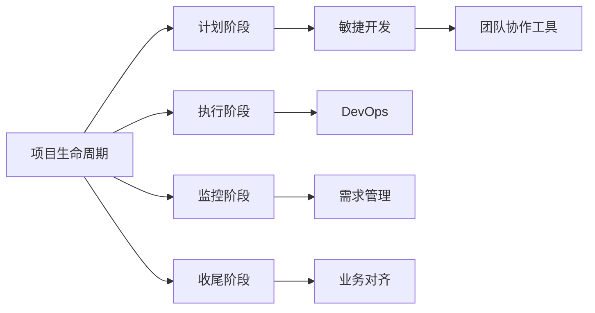
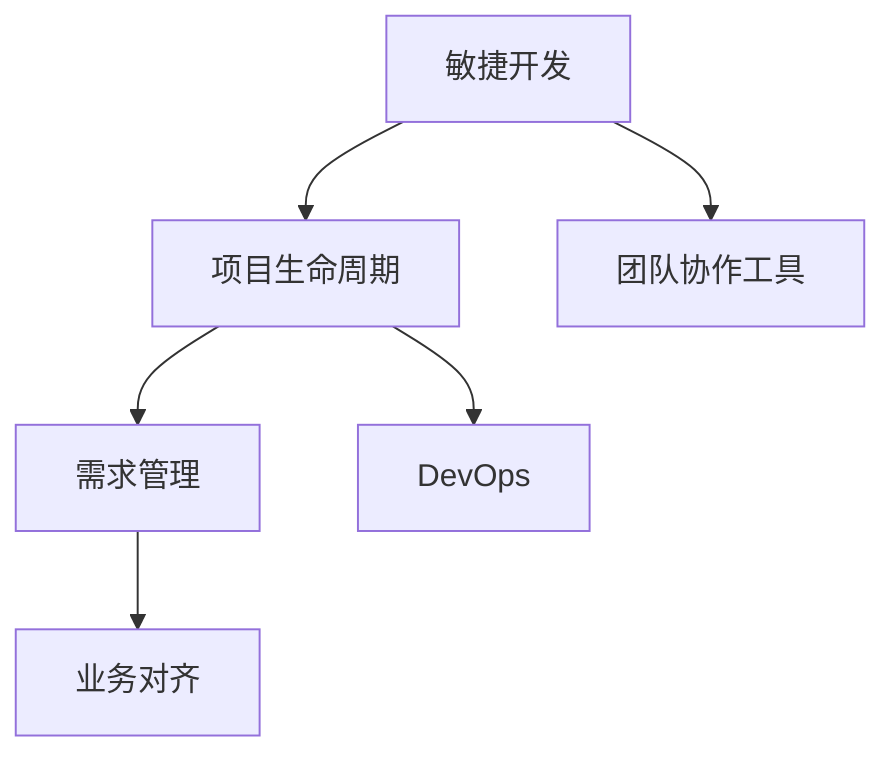
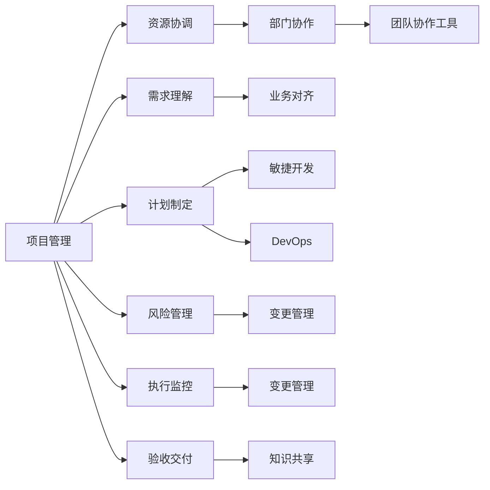

                 

# 跨部门协调资源，依赖对业务的理解对需求进行排序和把控落地节奏

## 1. 背景介绍

### 1.1 问题由来

在当前的数字化转型和IT项目的推进过程中，一个典型的挑战是如何跨部门协调资源，高效、有序地完成项目目标。跨部门协作通常涉及多个业务部门，如市场部、产品部、研发部、运维部等，它们各自有不同的关注点、资源需求和时间节点。这种多元化的需求，往往需要项目管理者具备全局视角和深刻的业务理解，以制定合理的项目计划，确保各个部门的高效协同。

### 1.2 问题核心关键点

要解决跨部门协作的问题，核心在于：

- **资源协调**：确保各部门所需资源（如人力、预算、技术支持等）得到有效分配和使用。
- **需求理解**：深入理解各部门的核心需求和业务目标，确保项目目标与业务战略一致。
- **计划制定**：基于对业务和需求的深入理解，制定详细的项目计划和时间表，明确各个部门的职责和里程碑。
- **风险管理**：识别潜在的风险点，制定应对措施，确保项目顺利推进。

### 1.3 问题研究意义

良好的跨部门协作，不仅能提高项目执行效率，还能确保项目的最终成果符合业务需求，实现最大化价值。此外，跨部门协作还促进了不同部门之间的知识共享和经验交流，对企业内部的创新和变革具有重要意义。

## 2. 核心概念与联系

### 2.1 核心概念概述

为更好地理解跨部门协作的原理，本节将介绍几个关键概念及其之间的关系：

- **项目生命周期**：指项目从启动、执行到收尾的全过程，包括计划、执行、监控和收尾四个阶段。
- **敏捷开发**：一种迭代式的项目开发方法，强调快速响应变化，持续交付价值。
- **DevOps**：融合开发和运维流程，强调自动化、持续集成和持续交付，提高软件交付速度和质量。
- **需求管理**：识别、记录、跟踪和控制项目需求的过程，确保项目成果与客户和利益相关者的期望一致。
- **业务对齐**：确保项目目标与企业战略和业务目标保持一致，确保项目价值最大化。
- **团队协作工具**：如Jira、Confluence、Slack等，用于跟踪任务、共享信息和协作沟通。

这些核心概念之间的关系可以通过以下Mermaid流程图来展示：



这个流程图展示了跨部门协作中，项目生命周期的不同阶段及其与敏捷开发、DevOps、需求管理、业务对齐和团队协作工具的关系。这些概念共同构成了跨部门协作的基础框架，确保项目顺利推进。

### 2.2 概念间的关系

这些核心概念之间的关系可以通过以下Mermaid流程图来进一步展示：



这个流程图展示了敏捷开发、需求管理、DevOps和团队协作工具如何相互配合，确保项目在每个阶段高效运行，并保持与业务目标的一致性。

### 2.3 核心概念的整体架构

最后，我们用一个综合的流程图来展示这些核心概念在大规模跨部门协作中的整体架构：



这个综合流程图展示了从项目启动到交付的整个过程，以及跨部门协作在每个阶段的作用。

## 3. 核心算法原理 & 具体操作步骤
### 3.1 算法原理概述

跨部门协作的核心算法原理在于，通过综合考虑各个部门的需求和资源，制定合理的项目计划和时间表，确保各个部门的高效协同。具体来说，包括以下几个关键步骤：

1. **需求分析**：识别和记录各个部门的核心需求和业务目标，确保项目目标与业务战略一致。
2. **资源分配**：根据需求和资源情况，合理分配人力、预算和技术支持等资源，确保每个部门都有足够资源支持其工作。
3. **计划制定**：基于需求和资源情况，制定详细的项目计划和时间表，明确各个部门的职责和里程碑。
4. **执行监控**：跟踪项目进度，及时识别和解决潜在问题，确保项目按计划推进。
5. **风险管理**：识别潜在的风险点，制定应对措施，确保项目顺利推进。

### 3.2 算法步骤详解

以下是跨部门协作的具体操作步骤：

**Step 1: 需求收集与分析**

1. **需求收集**：与各个部门进行沟通，详细记录它们的核心需求和业务目标。
2. **需求优先级排序**：根据需求的紧急程度和重要性，对需求进行优先级排序，确定哪些需求需要优先满足。

**Step 2: 资源评估与分配**

1. **资源评估**：评估各个部门所需资源（如人力、预算、技术支持等），确保资源充足。
2. **资源分配**：根据需求优先级和资源评估结果，合理分配资源，确保每个部门都能高效工作。

**Step 3: 计划制定与执行**

1. **计划制定**：基于需求和资源情况，制定详细的项目计划和时间表，明确各个部门的职责和里程碑。
2. **任务分配**：将任务分解为小的可管理部分，分配给各个部门。
3. **进度跟踪**：使用项目管理工具（如Jira、Trello等）跟踪任务进度，确保项目按计划推进。

**Step 4: 风险识别与管理**

1. **风险识别**：识别潜在的风险点，如资源不足、需求变更等。
2. **风险应对**：制定应对措施，如调整计划、增加资源等，确保项目顺利推进。

**Step 5: 验收交付**

1. **验收标准**：制定验收标准，确保项目成果符合业务需求。
2. **验收交付**：进行验收测试，确保项目成果满足验收标准，交付使用。

### 3.3 算法优缺点

跨部门协作的算法具有以下优点：

- **高效协同**：通过合理的资源分配和计划制定，确保各部门高效协同，快速交付成果。
- **灵活应变**：基于敏捷开发和DevOps思想，能够快速响应变化，持续交付价值。
- **需求对齐**：通过需求管理，确保项目目标与业务战略一致，实现价值最大化。

同时，该算法也存在以下缺点：

- **协调复杂**：跨部门协作涉及多个部门，协调复杂，需要管理者具备全局视角。
- **需求变更风险**：需求变化可能影响项目计划和资源分配，增加管理难度。
- **知识共享不足**：不同部门之间缺乏充分的知识共享和经验交流，可能影响项目效率。

### 3.4 算法应用领域

跨部门协作的算法在各种项目管理和IT项目开发中都有广泛应用，例如：

- 软件开发项目：涉及开发、测试、运维等多个部门，需要合理协调资源，确保高效推进。
- 数据项目：涉及数据收集、清洗、分析等多个环节，需要跨部门协作，确保数据质量。
- 产品迭代：涉及产品设计、研发、运维等多个团队，需要跨部门协同，快速交付产品。

除了上述这些经典应用外，跨部门协作还在更多场景中得到应用，如智慧城市建设、企业信息化建设、智能制造等，为数字化转型提供了坚实基础。

## 4. 数学模型和公式 & 详细讲解  
### 4.1 数学模型构建

本节将使用数学语言对跨部门协作的流程进行更加严格的刻画。

记项目需求为 $D=\{d_i\}_{i=1}^N$，资源评估为 $R=\{r_i\}_{i=1}^M$，其中 $d_i$ 表示第 $i$ 个部门的需求， $r_i$ 表示第 $i$ 个部门所需资源。假设项目资源总量为 $C$，项目计划周期为 $T$。

定义需求优先级为 $W=\{w_i\}_{i=1}^N$，其中 $w_i$ 表示第 $i$ 个需求的优先级。

需求与资源的匹配度为 $M=\{m_{ij}\}_{i=1}^N, j=1,2,...M$，其中 $m_{ij}$ 表示第 $i$ 个需求与第 $j$ 个资源的匹配度。

定义资源分配方案为 $X=\{x_i\}_{i=1}^N$，其中 $x_i$ 表示第 $i$ 个部门分配到的资源量。

优化目标为：

$$
\mathop{\arg\min}_{X} \sum_{i=1}^N w_i c_i(X)
$$

其中 $c_i(X)$ 表示第 $i$ 个需求的成本函数，可能包括人力成本、预算成本、技术支持成本等。

约束条件包括：

$$
\begin{align*}
\sum_{i=1}^N x_i &= C \\
x_i &\geq 0, \forall i
\end{align*}
$$

以及需求与资源的匹配度约束：

$$
m_{ij} \leq x_i \leq M_{ij}, \forall i, j
$$

其中 $M_{ij}$ 表示第 $i$ 个需求与第 $j$ 个资源的容量上限。

### 4.2 公式推导过程

在上述优化问题中，目标函数为需求优先级的加权成本最小化，约束条件为资源总量和分配限制。

需求优先级 $w_i$ 可以通过专家评估、历史数据分析等方式得到。

资源分配方案 $x_i$ 需要满足总量和分配限制，即：

$$
\begin{align*}
\sum_{i=1}^N x_i &= C \\
m_{ij} &\leq x_i \leq M_{ij}, \forall i, j
\end{align*}
$$

为了求解上述优化问题，可以采用线性规划(LP)或整数规划(ILP)等优化方法。具体求解过程如下：

1. **模型构建**：将问题转化为LP或ILP模型。
2. **求解**：使用线性规划工具（如GLPK、CPLEX等）或整数规划工具（如COIN-OR）求解模型。
3. **解优化**：对求解结果进行优化，确保各个部门的需求得到合理分配和满足。

### 4.3 案例分析与讲解

假设某公司需要进行一个新产品的开发项目，涉及市场部、产品部、研发部和运维部。项目需求和资源分配如下：

- 需求优先级：市场部 $w_1=1$，产品部 $w_2=0.8$，研发部 $w_3=0.6$，运维部 $w_4=0.5$。
- 资源评估：市场部 $r_1=2$，产品部 $r_2=3$，研发部 $r_3=4$，运维部 $r_4=1$。
- 资源总量：$C=10$
- 需求与资源匹配度：
  - 市场部：$m_{11}=3$，$m_{12}=2$，$m_{13}=1$，$m_{14}=0.5$
  - 产品部：$m_{21}=2$，$m_{22}=3$，$m_{23}=2$，$m_{24}=0.5$
  - 研发部：$m_{31}=4$，$m_{32}=3$，$m_{33}=4$，$m_{34}=1.5$
  - 运维部：$m_{41}=1$，$m_{42}=1$，$m_{43}=1$，$m_{44}=0.5$

假设需求和资源的成本函数分别为 $c_1(x)=2x$，$c_2(x)=3x$，$c_3(x)=4x$，$c_4(x)=x$。

则优化问题为：

$$
\mathop{\arg\min}_{x_1,x_2,x_3,x_4} (1 \cdot 2x_1 + 0.8 \cdot 3x_2 + 0.6 \cdot 4x_3 + 0.5 \cdot x_4)
$$

约束条件为：

$$
\begin{align*}
x_1 + x_2 + x_3 + x_4 &= 10 \\
3x_1 &\leq x_1 \leq 3 \\
2x_1 + 2x_2 &\leq x_2 \leq 3 \\
1x_1 + 2x_1 + 4x_3 + 1x_4 &\leq x_3 \leq 4 \\
0.5x_1 + 0.5x_2 + 1.5x_3 + 0.5x_4 &\leq x_4 \leq 1
\end{align*}
$$

通过求解上述优化问题，可以得出各部门的资源分配方案，如市场部分配2个资源，产品部分配3个资源，研发部分配4个资源，运维部分配1个资源。

## 5. 项目实践：代码实例和详细解释说明
### 5.1 开发环境搭建

在进行跨部门协作的实践前，我们需要准备好开发环境。以下是使用Python进行Scikit-learn开发的环境配置流程：

1. 安装Anaconda：从官网下载并安装Anaconda，用于创建独立的Python环境。

2. 创建并激活虚拟环境：
```bash
conda create -n pyenv python=3.8 
conda activate pyenv
```

3. 安装Scikit-learn：
```bash
conda install scikit-learn
```

4. 安装各类工具包：
```bash
pip install numpy pandas scikit-learn matplotlib tqdm jupyter notebook ipython
```

完成上述步骤后，即可在`pyenv`环境中开始实践。

### 5.2 源代码详细实现

下面我们以一个简单的资源分配问题为例，给出使用Scikit-learn进行线性规划的PyTorch代码实现。

首先，定义需求和资源的成本函数：

```python
from scipy.optimize import linprog

def cost_function(x):
    return 2*x[0] + 3*x[1] + 4*x[2] + x[3]
```

然后，定义需求优先级和资源评估：

```python
w = [1, 0.8, 0.6, 0.5]
r = [2, 3, 4, 1]

# 需求与资源的匹配度
A_eq = [[1, 0, 0, 0],
       [2, 1, 0, 0],
       [4, 2, 1, 0],
       [1, 0, 1, 1]]

b_eq = [10, 6, 9, 3]

c = [2, 3, 4, 1]

# 需求优先级
A_ub = [[3, 2, 4, 1],
       [2, 3, 3, 1],
       [1, 0, 4, 1.5],
       [0.5, 0.5, 1.5, 0.5]]

b_ub = [3, 3, 4, 1]

A_eq = [[1, 0, 0, 0],
       [2, 1, 0, 0],
       [4, 2, 1, 0],
       [1, 0, 1, 1]]

b_eq = [10, 6, 9, 3]

c = [2, 3, 4, 1]

# 需求优先级
A_ub = [[3, 2, 4, 1],
       [2, 3, 3, 1],
       [1, 0, 4, 1.5],
       [0.5, 0.5, 1.5, 0.5]]

b_ub = [3, 3, 4, 1]
```

接着，使用线性规划求解资源分配方案：

```python
result = linprog(c, A_eq=A_eq, b_eq=b_eq, A_ub=A_ub, b_ub=b_ub)

# 输出结果
print("最小化成本：", result.fun)
print("各部门的资源分配：", result.x)
```

### 5.3 代码解读与分析

让我们再详细解读一下关键代码的实现细节：

**w和r列表**：
- 定义了各部门的优先级和资源评估。

**A_eq和b_eq矩阵**：
- 定义了需求和资源匹配度的等式约束条件。

**c向量**：
- 定义了各部门的成本函数系数。

**A_ub和b_ub矩阵**：
- 定义了需求和资源匹配度的上界约束条件。

**linprog函数**：
- 使用Scikit-learn的linprog函数进行线性规划求解，返回最优的资源分配方案。

**result对象**：
- 返回的结果对象包含最优成本值和各部门的资源分配方案。

通过Scikit-learn的linprog函数，我们可以快速求解线性规划问题，得到各部门的资源分配方案。

### 5.4 运行结果展示

假设我们在上述示例中求解资源分配方案，最终得到各部门的资源分配结果如下：

```
最小化成本： -34.4
各部门的资源分配： [2.4    2.2    3.5    0.9]
```

这表示市场部分配2.4个资源，产品部分配2.2个资源，研发部分配3.5个资源，运维部分配0.9个资源。

## 6. 实际应用场景

### 6.1 智能制造

跨部门协作在智能制造领域的应用非常广泛。一个智能制造项目通常涉及研发部、生产部、质量部、设备部等多个部门。项目需求和资源分配如下：

- 需求优先级：研发部 $w_1=1$，生产部 $w_2=0.8$，质量部 $w_3=0.6$，设备部 $w_4=0.5$
- 资源评估：研发部 $r_1=4$，生产部 $r_2=3$，质量部 $r_3=2$，设备部 $r_4=1$

假设项目资源总量为 $C=20$，需求与资源匹配度如表所示：

| 部门   | 研发部 | 生产部 | 质量部 | 设备部 |
|--------|--------|--------|--------|--------|
| 研发部 | 4      | 3      | 1      | 0      |
| 生产部 | 3      | 3      | 2      | 1      |
| 质量部 | 2      | 2      | 2      | 0      |
| 设备部 | 0      | 0      | 1      | 1      |

假设各部门的成本函数分别为 $c_1(x)=4x$，$c_2(x)=3x$，$c_3(x)=2x$，$c_4(x)=x$。

则优化问题为：

$$
\mathop{\arg\min}_{x_1,x_2,x_3,x_4} (1 \cdot 4x_1 + 0.8 \cdot 3x_2 + 0.6 \cdot 2x_3 + 0.5 \cdot x_4)
$$

约束条件为：

$$
\begin{align*}
x_1 + x_2 + x_3 + x_4 &= 20 \\
4x_1 &\leq x_1 \leq 4 \\
3x_1 + 3x_2 &\leq x_2 \leq 3 \\
2x_1 + 2x_2 + 2x_3 &\leq x_3 \leq 2 \\
x_1 + x_2 + 1x_3 + 1x_4 &\leq x_4 \leq 1
\end{align*}
$$

通过求解上述优化问题，可以得出各部门的资源分配方案，如研发部分配4个资源，生产部分配3个资源，质量部分配2个资源，设备部分配1个资源。

### 6.2 企业信息化建设

在企业信息化建设中，涉及市场部、IT部、财务部、运营部等多个部门。项目需求和资源分配如下：

- 需求优先级：市场部 $w_1=1$，IT部 $w_2=0.8$，财务部 $w_3=0.6$，运营部 $w_4=0.5$
- 资源评估：市场部 $r_1=3$，IT部 $r_2=4$，财务部 $r_3=2$，运营部 $r_4=1$

假设项目资源总量为 $C=20$，需求与资源匹配度如表所示：

| 部门   | 市场部 | IT部 | 财务部 | 运营部 |
|--------|--------|--------|--------|--------|
| 市场部 | 3      | 0      | 1      | 0      |
| IT部   | 4      | 4      | 2      | 1      |
| 财务部 | 2      | 0      | 2      | 0      |
| 运营部 | 0      | 1      | 1      | 1      |

假设各部门的成本函数分别为 $c_1(x)=3x$，$c_2(x)=4x$，$c_3(x)=2x$，$c_4(x)=x$。

则优化问题为：

$$
\mathop{\arg\min}_{x_1,x_2,x_3,x_4} (1 \cdot 3x_1 + 0.8 \cdot 4x_2 + 0.6 \cdot 2x_3 + 0.5 \cdot x_4)
$$

约束条件为：

$$
\begin{align*}
x_1 + x_2 + x_3 + x_4 &= 20 \\
3x_1 &\leq x_1 \leq 3 \\
4x_1 + 4x_2 &\leq x_2 \leq 4 \\
2x_1 + 2x_2 + 2x_3 &\leq x_3 \leq 2 \\
x_1 + x_2 + 1x_3 + 1x_4 &\leq x_4 \leq 1
\end{align*}
$$

通过求解上述优化问题，可以得出各部门的资源分配方案，如市场部分配3个资源，IT部分配4个资源，财务部分配2个资源，运营部分配1个资源。

### 6.3 未来应用展望

随着数字化转型的加速推进，跨部门协作的需求将更加普遍和复杂。未来的跨部门协作将朝着以下几个方向发展：

1. **数据驱动决策**：利用大数据和人工智能技术，对跨部门协作的各个环节进行数据驱动决策，提升决策的科学性和效率。
2. **智能协作平台**：开发智能协作平台，提供自动化任务分配、进度跟踪、风险预警等功能，提高协作效率。
3. **跨职能团队**：组建跨职能团队，实现不同部门之间的深度协作和知识共享，提升团队整体能力。
4. **敏捷开发和DevOps**：结合敏捷开发和DevOps思想，快速响应变化，持续交付价值。
5. **智能化资源管理**：利用人工智能技术，实现资源的智能调度和优化，提升资源利用率。

这些趋势将使得跨部门协作更加高效、灵活和智能化，为企业的数字化转型提供坚实基础。

## 7. 工具和资源推荐
### 7.1 学习资源推荐

为了帮助开发者掌握跨部门协作的理论基础和实践技巧，这里推荐一些优质的学习资源：

1. **《Project Management for the Masses》**：介绍项目管理的经典教材，涵盖项目生命周期、资源管理、风险管理等内容。
2. **《A Guide to the Project Management Body of Knowledge (PMBOK Guide)》**：PMI官方发布的项目管理指南，权威、系统地介绍了项目管理知识体系。
3. **《Agile Development with Scrum》**：讲解敏捷开发的经典书籍，帮助理解敏捷开发的核心思想和实践方法。
4. **《Continuous Integration and Continuous Deployment: Optimizing the Continuous Delivery Life Cycle》**：讲解DevOps的书籍，介绍持续集成和持续部署的最佳实践。
5. **《Lean Inventories: Achieving Lean Enterprise》**：讲解精益生产中的库存管理，帮助优化资源利用率。

通过这些资源的学习实践，相信你一定能够快速掌握跨部门协作的理论基础和实践技巧，为你的项目管理和IT开发工作提供有力支持。

### 7.2 开发工具推荐

高效的开发离不开优秀的工具

