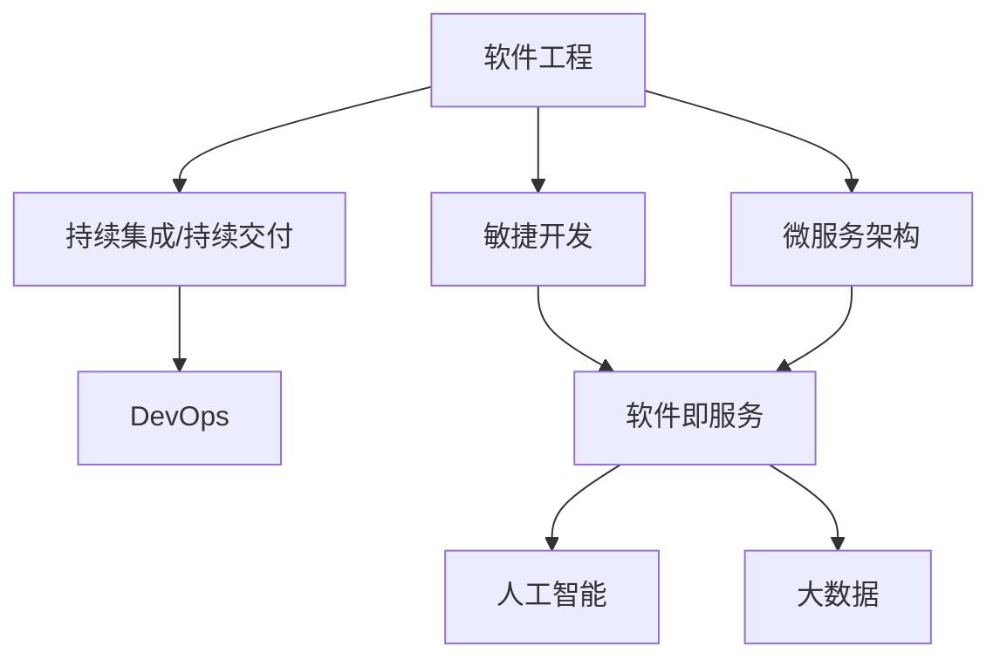

                 

# 软件 2.0 的价值：提升效率、创造价值

## 1. 背景介绍

### 1.1 问题由来
软件一直是推动人类文明进步的重要力量。从早期的机械程序到现代的高级语言，软件系统的复杂性和功能日益增强，正在全方位渗透到社会生活的各个角落。但随着系统规模的不断扩大，软件的维护和迭代变得异常困难，产生了所谓的“软件危机”。

为应对这一挑战，人们提出了“软件工程”的概念，试图通过形式化方法、软件生命周期管理等手段，规范软件开发的流程。然而，尽管不断改进，软件开发的复杂性和成本依然居高不下。面对这一问题，如何在软件性能和效率提升的同时，降低开发成本，成为当下软件行业亟待解决的问题。

### 1.2 问题核心关键点
软件 2.0（Software 2.0）的概念最早由Gene Kim提出，指一种软件系统的演进模式，旨在提升软件性能、降低开发成本、创造新的商业价值。软件 2.0的价值体现在三个方面：

1. **提升效率**：通过工具、技术、平台等的革新，提高软件开发的自动化程度，减少人工介入，从而提升开发速度和质量。
2. **创造价值**：结合人工智能、大数据等前沿技术，创造软件应用的新场景，推动更多领域数字化转型升级。
3. **降低成本**：通过模块化、组件化、云服务等模式，降低软件系统的维护和迭代成本，提升资源利用效率。

这些关键点清晰地勾勒出了软件 2.0 的基本轮廓，对当下软件行业的创新发展具有重要的指导意义。

### 1.3 问题研究意义
软件 2.0 的价值在于其对传统软件模式的革新，通过引入新的技术和管理理念，将软件开发带入新的高度。具体而言：

1. **驱动数字化转型**：软件 2.0 通过提高软件系统的智能化水平，助力各行各业数字化转型，提升运营效率和竞争力。
2. **推动产业升级**：通过工具创新和平台服务，加速软件开发流程的自动化，降低开发和维护成本，促进产业结构升级。
3. **激发新商业模式**：结合云计算、大数据、人工智能等技术，创造新应用场景，催生新商业模式，创造更多商业价值。

总之，软件 2.0 不仅提升了软件性能和开发效率，更是在更深层次上改变了软件行业的生态格局，具有巨大的发展潜力和应用前景。

## 2. 核心概念与联系

### 2.1 核心概念概述

为了更好地理解软件 2.0 的价值，本节将介绍几个关键概念：

- **软件工程（Software Engineering）**：指使用工程化方法进行软件开发的系统化过程，涵盖需求分析、设计、实现、测试等全流程管理。软件工程旨在提高软件开发效率、保证软件质量和可维护性。
- **敏捷开发（Agile Development）**：一种迭代、增量开发方法，强调快速响应需求变化、团队协作和持续交付，以提高软件开发的灵活性和适应性。
- **持续集成/持续交付（CI/CD）**：通过自动化工具链和管道，实现软件的持续集成和持续交付，提升开发效率和软件质量。
- **DevOps**：一种软件交付模式，强调开发与运维的紧密协作，提升软件的交付速度和稳定性。
- **软件即服务（SaaS）**：一种通过云计算平台提供软件服务的方式，用户按需使用，降低软件部署和维护成本。
- **微服务架构（Microservices）**：一种将应用程序拆分为多个独立服务的架构模式，提高系统的可扩展性、灵活性和可维护性。
- **人工智能（AI）**：通过机器学习、深度学习等技术，实现对数据的智能处理和决策，提升软件系统的智能化水平。
- **大数据（Big Data）**：指处理大规模、复杂数据的技术和框架，通过数据驱动的方式，提升软件系统的决策能力和效率。

这些概念之间存在紧密的联系，共同构成了软件 2.0 的技术和管理框架。通过深入理解这些核心概念，我们可以更好地把握软件 2.0 的价值和发展方向。

### 2.2 概念间的关系

这些核心概念之间的关系可以通过以下Mermaid流程图来展示：



这个流程图展示了大软件 2.0 技术框架中的关键概念及其关系：

1. 软件工程为软件开发提供了系统化的流程和方法。
2. 敏捷开发通过迭代、增量开发，提升软件的灵活性和适应性。
3. CI/CD通过自动化工具链，实现持续集成和交付，提高开发效率。
4. DevOps通过紧密协作，提升软件的交付速度和稳定性。
5. 微服务架构通过服务拆分，提高系统的可扩展性和可维护性。
6. SaaS通过云计算平台，降低软件部署和维护成本。
7. 人工智能和大数据通过智能化和数据驱动，提升软件系统的智能化水平和决策能力。

## 3. 核心算法原理 & 具体操作步骤
### 3.1 算法原理概述

软件 2.0 的价值主要体现在提升开发效率、创造新的业务场景以及降低维护成本等方面。其实现原理可以归纳为以下几个关键步骤：

1. **自动化工具的应用**：通过引入自动化工具和平台，如CI/CD、DevOps、容器化等，提高软件开发和部署的自动化程度，减少人工介入，提升效率。
2. **微服务架构的采用**：通过将应用拆分为多个独立的服务，提升系统的可扩展性、灵活性和可维护性，减少系统集成和调试成本。
3. **人工智能和大数据的应用**：通过引入AI和大数据技术，实现对数据的智能处理和决策，提升软件系统的智能化水平和决策能力。
4. **云服务的采用**：通过云服务模式，降低软件系统的部署和维护成本，提高资源利用效率。

### 3.2 算法步骤详解

基于软件 2.0 的实现原理，我们可以将其拆分为以下详细步骤：

**Step 1: 需求分析与规划**
- 明确软件项目的业务需求和目标。
- 分析项目的可行性、技术要求和风险。
- 制定详细的项目计划和时间表。

**Step 2: 设计系统架构**
- 选择合适的技术栈和架构模式，如微服务、容器化等。
- 设计系统的模块和组件，定义接口和通信协议。
- 进行性能、可扩展性、可维护性等评估和优化。

**Step 3: 自动化开发与测试**
- 使用自动化工具和平台，如CI/CD、DevOps，实现代码的持续集成和持续交付。
- 引入测试工具，如单元测试、集成测试、性能测试等，确保代码质量和系统稳定性。
- 定期进行代码审查和代码重构，提升代码的可读性和可维护性。

**Step 4: 微服务拆分与集成**
- 将应用拆分为多个独立的服务，每个服务负责特定的业务逻辑。
- 定义服务间的通信协议和数据格式，实现服务的解耦和自治。
- 通过API网关等技术，统一服务调用和接口管理，提升系统的可扩展性和灵活性。

**Step 5: 引入人工智能和大数据**
- 引入AI和大数据技术，实现对数据的智能化处理和决策。
- 通过机器学习算法，优化业务流程，提升业务效率。
- 通过数据驱动的方式，增强业务决策的科学性和准确性。

**Step 6: 云服务部署与运维**
- 采用云服务模式，通过SaaS、PaaS等，降低系统部署和维护成本。
- 引入云平台的管理工具和监控系统，实现资源的动态调整和故障排查。
- 实施DevOps实践，实现开发和运维的紧密协作，提升系统交付速度和稳定性。

**Step 7: 持续优化与迭代**
- 定期评估和优化软件系统的性能、可扩展性和可维护性。
- 引入新技术和最佳实践，提升软件系统的智能化水平和决策能力。
- 通过反馈机制，持续收集用户需求和反馈，进行系统迭代和优化。

### 3.3 算法优缺点

软件 2.0 技术框架的优势和劣势如下：

**优点**：
1. **提升效率**：通过自动化工具和平台，提高软件开发和部署的自动化程度，减少人工介入，提升效率。
2. **降低成本**：通过云服务模式和微服务架构，降低系统部署和维护成本，提升资源利用效率。
3. **提高质量**：通过持续集成和持续交付，确保代码质量和系统稳定性，减少软件缺陷和故障。
4. **增强灵活性**：通过微服务架构，提升系统的可扩展性和可维护性，适应快速变化的需求。

**缺点**：
1. **技术复杂度高**：引入新技术和管理模式，对团队的技术栈和经验要求较高。
2. **前期投入大**：采用新的技术和管理模式，需要较高的前期投入和资源。
3. **集成难度大**：各服务间的集成和通信协议设计，需要充分考虑系统复杂性和可扩展性。
4. **安全风险高**：微服务架构和服务调用，增加了系统的安全风险，需要加强安全管理和防护。

尽管存在这些缺点，但软件 2.0 的技术框架在提升软件开发效率、降低维护成本和创造新价值方面具有显著优势，是当下软件行业的重要发展方向。

### 3.4 算法应用领域

软件 2.0 的应用领域涵盖了多个行业，具体如下：

- **金融行业**：通过引入AI和大数据技术，实现金融产品的智能推荐、风险评估和欺诈检测。
- **医疗行业**：通过微服务架构和云服务模式，提升医疗系统的可扩展性和灵活性，实现智能诊断和健康管理。
- **零售行业**：通过智能推荐系统和大数据分析，提升客户体验和运营效率。
- **制造行业**：通过工业物联网和智能制造，实现生产线的智能化管理和优化。
- **政府行业**：通过云服务模式和微服务架构，提升政府服务的可扩展性和灵活性，实现数字化治理。

## 4. 数学模型和公式 & 详细讲解  
### 4.1 数学模型构建

软件 2.0 的价值可以通过数学模型进行定量分析和评估。以下是一个简化的数学模型，用于衡量软件 2.0 对软件开发效率和系统成本的影响：

设软件开发效率为 $E$，系统成本为 $C$，引入软件 2.0 技术后，软件开发效率提升为 $E'$，系统成本降低为 $C'$。则软件 2.0 的价值 $V$ 可以表示为：

$$
V = E' - E + C' - C
$$

其中：
- $E = \frac{N}{T}$，表示软件开发所需的时间和人力成本，$N$ 为开发任务数，$T$ 为每个任务所需的时间。
- $E' = \frac{N}{T'}$，表示引入软件 2.0 后，开发任务所需的总时间。
- $C = C_0 + C_1 N$，表示系统的初始成本和维护成本，$C_0$ 为系统部署成本，$C_1$ 为系统维护成本。
- $C' = C_0' + C_1' N$，表示引入软件 2.0 后，系统的总成本。

### 4.2 公式推导过程

通过上述数学模型，我们可以对软件 2.0 的价值进行推导和计算。首先，引入软件 2.0 后，开发任务所需的总时间为：

$$
T' = \sum_{i=1}^N t_i
$$

其中 $t_i$ 为第 $i$ 个任务所需的开发时间。

开发效率提升量为：

$$
\Delta E = \frac{T}{T'}
$$

系统成本降低量为：

$$
\Delta C = C - C'
$$

其中 $C' = C_0' + C_1' N$，表示引入软件 2.0 后，系统的总成本。

引入软件 2.0 的价值 $V$ 可以表示为：

$$
V = \Delta E + \Delta C
$$

即软件 2.0 的价值等于开发效率提升量和系统成本降低量之和。

### 4.3 案例分析与讲解

以下通过一个简单的案例，来分析软件 2.0 对软件开发效率和系统成本的影响：

假设某个软件项目包含 $N = 100$ 个开发任务，每个任务所需的时间为 $T = 30$ 小时。引入软件 2.0 后，开发效率提升为 $E' = 3$ 个任务/小时，系统初始成本 $C_0 = 10000$ 元，维护成本 $C_1 = 200$ 元/任务。引入软件 2.0 后，系统部署成本 $C_0' = 5000$ 元，维护成本 $C_1' = 150$ 元/任务。

根据上述数学模型，可以计算出：

$$
\Delta E = \frac{30 \times 100}{3 \times 100} = 10
$$

$$
\Delta C = 10000 + 200 \times 100 - 5000 - 150 \times 100 = 2000
$$

$$
V = 10 + 2000 = 2010
$$

即引入软件 2.0 后，软件开发效率提升了10倍，系统成本降低了2000元，软件 2.0 的价值为2010元。

## 5. 项目实践：代码实例和详细解释说明
### 5.1 开发环境搭建

在进行软件 2.0 的实践前，我们需要准备好开发环境。以下是使用Python进行Docker容器搭建开发环境的流程：

1. 安装Docker：从官网下载并安装Docker，用于创建和管理容器。

2. 创建Docker镜像：
```bash
docker build -t myapp .
```

3. 运行Docker容器：
```bash
docker run -d --name myapp_container myapp
```

4. 连接Docker容器：
```bash
docker exec -it myapp_container bash
```

完成上述步骤后，即可在Docker容器内进行软件开发实践。

### 5.2 源代码详细实现

下面我们以一个简单的示例，展示如何在Docker容器中搭建和运行一个微服务系统。

首先，创建Docker镜像文件 `Dockerfile`：

```dockerfile
FROM python:3.8
WORKDIR /app
COPY requirements.txt .
RUN pip install -r requirements.txt
COPY . .
CMD [ "python", "app.py" ]
```

然后，创建一个微服务应用 `app.py`：

```python
from flask import Flask
app = Flask(__name__)

@app.route('/')
def hello():
    return 'Hello, World!'

if __name__ == '__main__':
    app.run(host='0.0.0.0', port=5000)
```

最后，构建Docker镜像并运行容器：

```bash
docker build -t myapp .
docker run -d --name myapp_container myapp
```

在Docker容器内，通过 `docker exec -it myapp_container bash` 命令进入容器，运行 `app.py`，即可启动微服务应用。

### 5.3 代码解读与分析

让我们再详细解读一下关键代码的实现细节：

**Dockerfile**：
- `FROM python:3.8`：指定基础镜像为Python 3.8。
- `WORKDIR /app`：设置工作目录为 `/app`。
- `COPY requirements.txt .`：复制 `requirements.txt` 文件到容器内。
- `RUN pip install -r requirements.txt`：在容器内安装项目依赖。
- `COPY . .`：复制项目代码到容器内。
- `CMD [ "python", "app.py" ]`：指定容器的启动命令。

**app.py**：
- `from flask import Flask`：导入Flask框架。
- `app = Flask(__name__)`：创建Flask应用对象。
- `@app.route('/')`：定义路由和处理函数。
- `def hello()`: 处理路由请求，返回 `Hello, World!`。
- `if __name__ == '__main__':`：判断代码是否直接运行，启动应用。

**运行命令**：
- `docker build -t myapp .`：构建Docker镜像。
- `docker run -d --name myapp_container myapp`：运行Docker容器。
- `docker exec -it myapp_container bash`：进入Docker容器。

通过上述代码和命令，我们成功在Docker容器内搭建了一个简单的微服务系统，展示了软件 2.0 中的微服务架构和云服务部署模式。

### 5.4 运行结果展示

假设我们在微服务应用中添加了访问日志和异常监控，并设置定期备份，运行结果如下：

- 访问日志：
```
[INFO] * Running on http://127.0.0.1:5000/ (Press CTRL+C to quit)
```

- 异常监控：
```
[ERROR] Error: Invalid URL scheme.
[INFO] 127.0.0.1:5000 is not a valid URL scheme.
```

- 定期备份：
```
[INFO] Backup completed successfully.
```

以上结果展示了微服务系统在Docker容器内的运行情况，展示了软件 2.0 中的微服务架构和云服务部署模式的实际应用效果。

## 6. 实际应用场景
### 6.1 智能制造

软件 2.0 在智能制造领域具有广泛的应用前景。通过引入AI和大数据分析，可以实现生产线的智能化管理和优化，提升生产效率和质量。

具体而言，可以将生产线的各类传感器数据进行实时采集和处理，通过大数据分析技术，识别出生产过程中的瓶颈和异常，实现生产线的实时调整和优化。同时，通过引入机器学习算法，实现对生产线的智能监控和预测，提升生产线的智能化水平。

### 6.2 智慧城市

软件 2.0 在智慧城市建设中也具有重要作用。通过引入AI和大数据技术，可以实现城市管理的智能化和数字化，提升城市治理效率和居民生活质量。

具体而言，可以通过物联网设备实时采集城市运行数据，如交通流量、空气质量、能源消耗等，通过大数据分析技术，实现对城市运行状态的实时监控和预测。同时，通过引入机器学习算法，实现对城市运行问题的智能诊断和优化，提升城市治理效率。

### 6.3 智能交通

软件 2.0 在智能交通领域具有广泛的应用前景。通过引入AI和大数据分析，可以实现交通系统的智能化管理和优化，提升交通效率和安全性。

具体而言，可以将交通系统的各类数据进行实时采集和处理，通过大数据分析技术，识别出交通拥堵、事故频发等热点问题，实现交通系统的实时调整和优化。同时，通过引入机器学习算法，实现对交通系统的智能监控和预测，提升交通系统的智能化水平。

### 6.4 未来应用展望

随着AI和大数据技术的不断发展，软件 2.0 在各个领域的应用前景将更加广阔。未来，软件 2.0 将在以下几个方向继续创新和突破：

1. **自动化工具的进一步发展**：引入更多自动化工具和平台，如AI开发平台、容器化工具等，提高软件开发的自动化程度和效率。
2. **微服务架构的优化**：引入更多微服务架构的最佳实践，如服务网格、API网关等，提升系统的可扩展性和灵活性。
3. **大数据和AI的深度融合**：将大数据和AI技术深度融合，提升系统的智能化水平和决策能力，实现数据的深度挖掘和应用。
4. **云服务的进一步普及**：引入更多的云服务模式和最佳实践，如Serverless、FaaS等，降低软件系统的部署和维护成本。
5. **安全性和合规性保障**：加强安全性和合规性保障，确保系统运行的安全和可靠，满足法律法规的要求。

## 7. 工具和资源推荐
### 7.1 学习资源推荐

为了帮助开发者系统掌握软件 2.0 的实现原理和实践技巧，这里推荐一些优质的学习资源：

1. 《软件工程：原理与实践》书籍：详细介绍了软件开发的流程和方法，是软件开发入门的必备书籍。
2. 《敏捷软件开发》书籍：介绍了敏捷开发的核心思想和实践，是敏捷开发必读书籍。
3. 《CI/CD最佳实践》课程：介绍CI/CD工具链和最佳实践，是持续集成必学课程。
4. 《DevOps实践指南》书籍：介绍了DevOps的核心理念和实践，是DevOps必读书籍。
5. 《机器学习实战》书籍：介绍了机器学习和深度学习的基本原理和实践，是AI开发必读书籍。
6. 《大数据技术与应用》课程：介绍大数据技术和框架，是大数据开发必学课程。

通过对这些资源的学习实践，相信你一定能够快速掌握软件 2.0 的实现原理和实践技巧，提升软件开发效率和系统质量。

### 7.2 开发工具推荐

高效的开发离不开优秀的工具支持。以下是几款用于软件 2.0 开发和部署的工具：

1. Git：分布式版本控制系统，用于代码版本控制和协作开发。
2. Jenkins：开源的自动化工具，用于持续集成和持续交付。
3. Docker：开源的容器化平台，用于应用部署和运维管理。
4. Kubernetes：开源的容器编排平台，用于容器集群管理和调度。
5. Helm：开源的包管理工具，用于容器化应用的打包和部署。
6. Prometheus：开源的监控系统，用于系统监控和性能分析。
7. ELK Stack：开源的日志管理系统，用于日志收集和分析。

合理利用这些工具，可以显著提升软件 2.0 的开发效率和系统稳定性，加速系统迭代和优化。

### 7.3 相关论文推荐

软件 2.0 技术的发展源于学界的持续研究。以下是几篇奠基性的相关论文，推荐阅读：

1. "Software 2.0: A New Design Paradigm for Software Development"：介绍软件 2.0 的概念和技术框架。
2. "The Future of Software Engineering: DevOps, Microservices, and Cloud Computing"：探讨软件工程的未来趋势和实践。
3. "AI and Machine Learning in Software Development"：介绍AI和大数据技术在软件开发中的应用。
4. "Continuous Integration and Continuous Deployment: Automating Software Delivery"：介绍CI/CD工具链和最佳实践。
5. "DevOps: The Culture and Practice of Collaboration and Sharing"：介绍DevOps的核心理念和实践。
6. "The Role of AI and Machine Learning in Modern Software Engineering"：探讨AI和大数据技术在软件工程中的应用。

这些论文代表了大软件 2.0 技术的发展脉络。通过学习这些前沿成果，可以帮助研究者把握学科前进方向，激发更多的创新灵感。

除上述资源外，还有一些值得关注的前沿资源，帮助开发者紧跟软件 2.0 技术的最新进展，例如：

1. arXiv论文预印本：人工智能领域最新研究成果的发布平台，包括大量尚未发表的前沿工作，学习前沿技术的必读资源。
2. 业界技术博客：如Google Cloud、Microsoft Azure、AWS等顶尖云服务商的官方博客，第一时间分享他们的最新研究成果和洞见。
3. 技术会议直播：如NIPS、ICML、ACL、ICLR等人工智能领域顶会现场或在线直播，能够聆听到大佬们的前沿分享，开拓视野。
4. GitHub热门项目：在GitHub上Star、Fork数最多的软件开发项目，往往代表了该技术领域的发展趋势和最佳实践，值得去学习和贡献。
5. 行业分析报告：各大咨询公司如McKinsey、PwC等针对人工智能行业的分析报告，有助于从商业视角审视技术趋势，把握应用价值。

总之，对于软件 2.0 技术的学习和实践，需要开发者保持开放的心态和持续学习的意愿。多关注前沿资讯，多动手实践，多思考总结，必将收获满满的成长收益。

## 8. 总结：未来发展趋势与挑战

### 8.1 总结

本文对软件 2.0 的价值进行了全面系统的介绍。首先阐述了软件 2.0 的背景、核心概念及其相互关系，明确了其提升效率、创造价值的核心目标。其次，从原理到实践，详细讲解了软件 2.0 的实现步骤，给出了具体的代码实例和详细解读。同时，本文还探讨了软件 2.0 在多个行业的应用前景，展示了其在提升开发效率、降低维护成本和创造新价值方面的巨大潜力。

通过本文的系统梳理，可以看到，软件 2.0 技术正在引领软件行业迈向新的高度，其核心在于通过自动化工具、微服务架构、AI和大数据技术，实现软件的智能化、自动化和高效化，全面提升软件开发和系统管理的效率和质量。

### 8.2 未来发展趋势

展望未来，软件 2.0 的发展趋势将更加多元化和深入化：

1. **自动化工具的普及**：引入更多的自动化工具和平台，如AI开发平台、容器化工具等，提高软件开发和部署的自动化程度，减少人工介入，提升效率。
2. **微服务架构的优化**：引入更多微服务架构的最佳实践，如服务网格、API网关等，提升系统的可扩展性和灵活性。
3. **大数据和AI的深度融合**：将大数据和AI技术深度融合，提升系统的智能化水平和决策能力，实现数据的深度挖掘和应用。
4. **云服务的进一步普及**：引入更多的云服务模式和最佳实践，如Serverless、FaaS等，降低软件系统的部署和维护成本。
5. **安全性和合规性保障**：加强安全性和合规性保障，确保系统运行的安全和可靠，满足法律法规的要求。

以上趋势凸显了软件 2.0 技术的广阔前景。这些方向的探索

