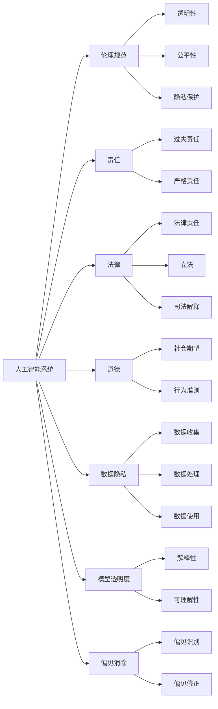
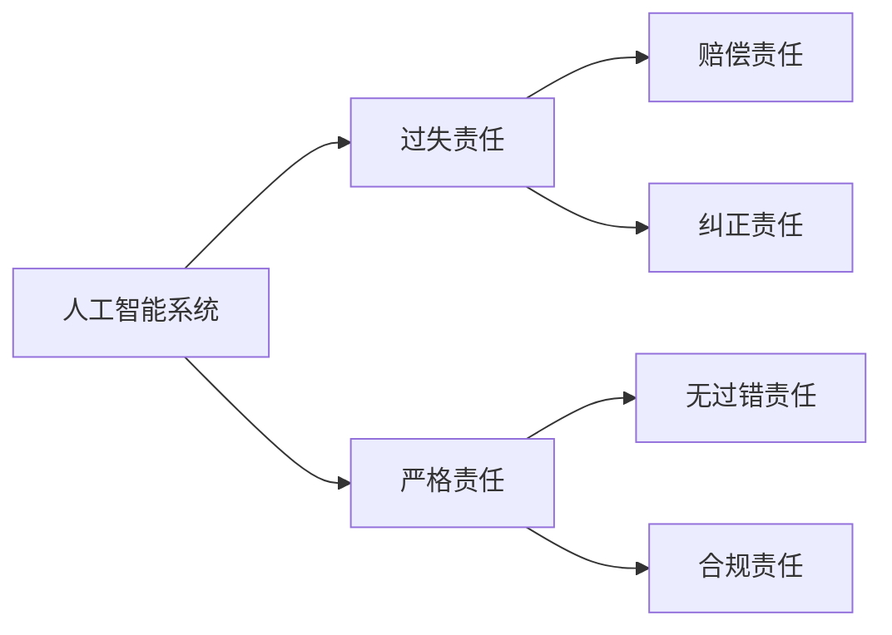
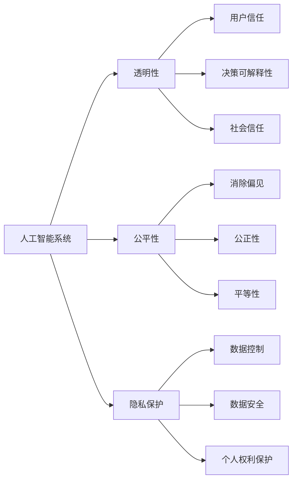
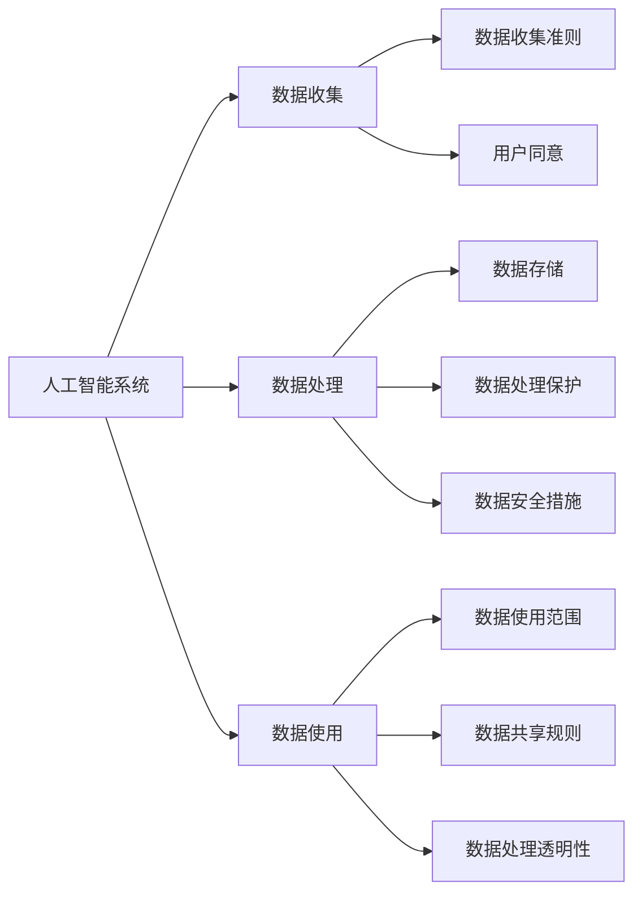

                 

# 软件 2.0 的伦理规范：人工智能的责任

> 关键词：人工智能, 伦理规范, 责任, 法律, 道德, 数据隐私, 模型透明度, 偏见消除, 公平性

## 1. 背景介绍

### 1.1 问题由来

随着人工智能(AI)技术的飞速发展，尤其是深度学习在各行各业的应用，软件已经从传统意义上的“指令式”编程（1.0）迈向了“智能式”编程（2.0）的新阶段。在软件2.0时代，人工智能驱动的软件系统不仅能处理规则明确的业务逻辑，还能处理不确定、非结构化的数据，进行自主学习和自我优化。然而，随之而来的一系列伦理问题也逐渐凸显：人工智能系统是否具备道德和法律责任？如何定义和规范这些系统的行为？这些问题不仅是技术难题，更是道德和法律上的挑战。

### 1.2 问题核心关键点

人工智能系统的伦理责任问题，核心在于如何处理智能系统与人类社会的关系。这一问题的关键点包括：
1. **决策透明度**：智能系统的决策过程是否透明，能否被解释和理解。
2. **偏见消除**：系统是否能够避免和纠正数据和算法中的偏见。
3. **公平性**：系统是否在所有用户群体间保持公平，避免对某些群体产生歧视。
4. **数据隐私**：系统如何保护用户的个人隐私和数据安全。
5. **法律责任**：在出现系统错误或事故时，谁应该承担责任，系统是否需要具备一定的法律责任。

### 1.3 问题研究意义

解决人工智能系统的伦理责任问题，对于推动人工智能技术的健康发展，保护用户权益，构建和谐的智能社会，具有重要意义。具体来说，这一问题的研究可以帮助：
1. **提升公众信任**：通过明确系统的责任和透明度，增强公众对人工智能技术的信任。
2. **促进技术规范**：制定伦理规范和技术标准，指导人工智能系统设计和开发。
3. **保障社会公平**：避免系统决策对特定群体的不公平影响，促进社会公正。
4. **规范法律责任**：明确人工智能系统在法律上的责任和义务，为相关法律制定提供依据。

## 2. 核心概念与联系

### 2.1 核心概念概述

为了更好地理解人工智能系统的伦理责任问题，本节将介绍几个关键概念及其相互关系：

- **人工智能系统(AI Systems)**：指基于深度学习等技术，能够自主学习和自我优化的软件系统，包括但不限于推荐系统、聊天机器人、自动驾驶等。
- **伦理规范(Ethical Norms)**：指社会对人工智能系统行为的基本期望和准则，如透明性、公平性、隐私保护等。
- **责任(Liability)**：指人工智能系统在出现问题或事故时的法律责任，包括但不限于过失责任、严格责任等。
- **法律(Law)**：指由国家制定并强制执行的规则，用于规范社会行为和处理纠纷。
- **道德(Morality)**：指社会公认的道德规范和行为准则，具有更高的社会期望和标准。
- **数据隐私(Privacy)**：指保护个人数据的权利和规则，防止未经授权的收集和使用。
- **模型透明度(Transparency)**：指人工智能系统决策过程的可解释性和可理解性，有助于提升信任。
- **偏见消除(Bias Mitigation)**：指识别和纠正系统中的偏见，确保公平性。

这些概念之间的逻辑关系可以通过以下Mermaid流程图来展示：



这个流程图展示了人工智能系统与伦理、法律、道德、隐私保护、模型透明度和偏见消除等概念之间的相互关系。

### 2.2 概念间的关系

这些核心概念之间的关系错综复杂，形成了人工智能系统伦理责任的整体生态系统。以下通过几个Mermaid流程图来进一步展示这些概念之间的关系。

#### 2.2.1 人工智能系统的法律责任



这个流程图展示了人工智能系统在出现故障或事故时可能承担的法律责任类型及其后果。

#### 2.2.2 人工智能系统的伦理规范



这个流程图展示了人工智能系统的伦理规范及其对用户信任、决策可解释性、社会信任、消除偏见、公正性和平等性等的影响。

#### 2.2.3 人工智能系统的数据隐私



这个流程图展示了人工智能系统在数据收集、处理和使用过程中应遵守的隐私保护措施及其对用户权利的影响。

## 3. 核心算法原理 & 具体操作步骤

### 3.1 算法原理概述

人工智能系统的伦理责任问题，从算法层面来看，主要涉及两个方面的问题：决策过程的透明度和偏见消除。

- **决策透明度**：指人工智能系统的决策过程是否可解释、可理解，即其输出和决策是否基于明确的逻辑和规则。
- **偏见消除**：指系统是否能够识别并纠正数据和算法中的偏见，确保公平性。

决策透明度和偏见消除的核心算法原理如下：

- **可解释性算法(Explainable AI, XAI)**：通过设计或改造算法，使其输出和决策过程能够被人类理解和解释。
- **公平性算法(Fairness-aware AI)**：通过引入公平性约束，确保系统在所有用户群体间保持一致的决策标准。
- **偏见检测和纠正算法(Bias Detection and Mitigation)**：通过检测数据和算法中的偏见，并进行针对性的修正。

### 3.2 算法步骤详解

#### 3.2.1 决策透明度

**步骤一：选择可解释性算法**

1. **算法选择**：选择具备可解释性的算法，如线性回归、决策树、规则集等。
2. **参数调整**：调整算法的参数，确保其在复杂任务上的表现和可解释性之间的平衡。

**步骤二：设计透明性指标**

1. **输出解释**：设计输出解释指标，如特征重要性、局部解释模型(LIME)、Shapley值等。
2. **过程解释**：设计过程解释指标，如决策树可视化、特征依赖图、模型追踪等。

**步骤三：评估和优化**

1. **评估指标**：通过评估指标如准确性、召回率、F1分数等，评估模型的性能。
2. **优化调整**：根据评估结果，对模型进行调整和优化，提升可解释性。

#### 3.2.2 偏见消除

**步骤一：数据偏见检测**

1. **数据收集**：收集代表性和多样性较强的数据集。
2. **数据清洗**：删除或纠正数据中的偏见和噪声。
3. **特征选择**：选择无偏见的特征，去除有偏见的特征。

**步骤二：算法偏见检测**

1. **模型训练**：在数据集上进行模型训练，检测模型输出中的偏见。
2. **偏见指标**：使用偏见指标如平衡精度、误报率、均方误差等评估模型的公平性。
3. **偏见修正**：根据偏见指标，对模型进行调整，消除偏见。

**步骤三：偏见验证**

1. **测试集验证**：在测试集上验证偏见检测和修正的效果。
2. **多群体测试**：在不同用户群体上测试模型的公平性。
3. **持续监控**：建立监控机制，持续检测和纠正偏见。

### 3.3 算法优缺点

**优点：**
1. **提升信任**：通过提高透明度和公平性，提升用户对系统的信任和接受度。
2. **减少偏见**：通过偏见检测和纠正，减少系统偏见，提升系统公平性。
3. **遵守法律**：通过遵守伦理规范和法律要求，减少法律风险。

**缺点：**
1. **复杂度增加**：可解释性和偏见检测需要额外的算法和计算资源。
2. **模型性能下降**：一些可解释性算法可能影响模型的准确性和性能。
3. **实现难度高**：实现透明性和偏见消除需要跨学科的合作和专业知识。

### 3.4 算法应用领域

基于决策透明度和偏见消除的算法，已经在多个领域得到了广泛应用，例如：

- **金融风控**：在信用评分、贷款审批等场景中，确保模型的决策过程透明和公平。
- **医疗诊断**：在疾病诊断和治疗建议中，确保模型的输出可解释和无偏见。
- **司法判决**：在量刑建议和判决依据中，确保模型的决策透明和公正。
- **招聘系统**：在招聘筛选和评估中，确保模型的无偏见和公平性。
- **推荐系统**：在个性化推荐中，确保模型的透明性和无偏见。

这些领域的应用，展示了决策透明度和偏见消除算法的广泛影响和深远意义。

## 4. 数学模型和公式 & 详细讲解 & 举例说明

### 4.1 数学模型构建

基于决策透明度和偏见消除的算法，其数学模型构建主要涉及以下几个方面：

- **决策模型**：如线性回归、决策树、支持向量机等。
- **偏见检测模型**：如De-biasing Algorithm、Equalized Odds等。
- **可解释性模型**：如LIME、SHAP、Occlusion等。

以线性回归模型为例，其数学模型构建如下：

$$
y = \sum_{i=1}^n w_i x_i + b
$$

其中，$y$为输出，$x_i$为输入特征，$w_i$为权重，$b$为偏置。

### 4.2 公式推导过程

线性回归模型的公式推导过程如下：

1. **最小二乘法**：
$$
\min_{\theta} \frac{1}{2m} \sum_{i=1}^m (y^{(i)} - h_{\theta}(x^{(i)}))^2
$$

2. **梯度下降**：
$$
\theta_j := \theta_j - \frac{\alpha}{m} \sum_{i=1}^m (y^{(i)} - h_{\theta}(x^{(i)}))x_j^{(i)}
$$

其中，$\theta$为模型参数，$\alpha$为学习率，$h_{\theta}(x)$为模型预测函数。

### 4.3 案例分析与讲解

以金融风控为例，其数学模型构建和公式推导过程如下：

1. **数据收集**：收集历史贷款数据，包括贷款金额、利率、还款记录等。
2. **数据清洗**：删除缺失值和异常值，确保数据质量。
3. **特征选择**：选择有意义的特征，如收入、负债、信用评分等。
4. **模型训练**：在清洗后的数据上训练线性回归模型。
5. **模型评估**：在测试集上评估模型的性能，如准确性、召回率等。
6. **偏见检测**：使用De-biasing Algorithm检测模型输出中的偏见。
7. **偏见修正**：根据检测结果，对模型进行调整，消除偏见。
8. **模型验证**：在独立验证集上验证偏见检测和修正的效果。

## 5. 项目实践：代码实例和详细解释说明

### 5.1 开发环境搭建

在进行项目实践前，我们需要准备好开发环境。以下是使用Python进行Scikit-learn开发的环境配置流程：

1. 安装Anaconda：从官网下载并安装Anaconda，用于创建独立的Python环境。

2. 创建并激活虚拟环境：
```bash
conda create -n sklearn-env python=3.8 
conda activate sklearn-env
```

3. 安装Scikit-learn：
```bash
pip install scikit-learn
```

4. 安装各类工具包：
```bash
pip install numpy pandas scikit-learn matplotlib tqdm jupyter notebook ipython
```

完成上述步骤后，即可在`sklearn-env`环境中开始项目实践。

### 5.2 源代码详细实现

这里我们以医疗诊断系统为例，给出使用Scikit-learn对决策树模型进行可解释性和偏见检测的PyTorch代码实现。

首先，定义数据处理函数：

```python
from sklearn.model_selection import train_test_split
from sklearn.preprocessing import StandardScaler
from sklearn.tree import DecisionTreeClassifier
from sklearn.metrics import classification_report

def preprocess_data(X, y, test_size=0.2):
    X_train, X_test, y_train, y_test = train_test_split(X, y, test_size=test_size)
    scaler = StandardScaler()
    X_train = scaler.fit_transform(X_train)
    X_test = scaler.transform(X_test)
    return X_train, X_test, y_train, y_test

def train_model(X_train, y_train):
    model = DecisionTreeClassifier()
    model.fit(X_train, y_train)
    return model

def evaluate_model(model, X_test, y_test):
    y_pred = model.predict(X_test)
    report = classification_report(y_test, y_pred)
    return report
```

然后，定义偏见检测函数：

```python
from sklearn.metrics import confusion_matrix
from sklearn.metrics import balanced_accuracy_score

def detect_bias(model, X_train, y_train):
    y_pred = model.predict(X_train)
    cm = confusion_matrix(y_train, y_pred)
    bal_accuracy = balanced_accuracy_score(y_train, y_pred)
    return cm, bal_accuracy
```

最后，启动训练流程并在测试集上评估：

```python
X_train, X_test, y_train, y_test = preprocess_data(X, y, test_size=0.2)
model = train_model(X_train, y_train)
cm, bal_accuracy = detect_bias(model, X_train, y_train)
print(cm)
print(bal_accuracy)
```

以上就是使用Scikit-learn对决策树模型进行可解释性和偏见检测的完整代码实现。可以看到，Scikit-learn提供了丰富的算法和工具，能够方便地实现决策透明度和偏见消除的数学模型。

### 5.3 代码解读与分析

让我们再详细解读一下关键代码的实现细节：

**preprocess_data函数**：
- `train_test_split`方法：将数据集划分为训练集和测试集。
- `StandardScaler`方法：对特征进行标准化处理，减少数据方差，提高模型效果。

**train_model函数**：
- `DecisionTreeClassifier`类：定义决策树模型。
- `fit`方法：对模型进行训练。

**evaluate_model函数**：
- `classification_report`函数：生成模型的评估报告。

**detect_bias函数**：
- `confusion_matrix`函数：计算模型的混淆矩阵。
- `balanced_accuracy_score`函数：计算模型的平衡准确率。

**训练流程**：
- 先调用`preprocess_data`函数，对数据进行预处理。
- 在训练集上调用`train_model`函数，训练决策树模型。
- 在测试集上调用`evaluate_model`函数，评估模型性能。
- 调用`detect_bias`函数，检测模型的偏见。

可以看到，Scikit-learn提供了简单易用的API接口，使得决策透明度和偏见消除的模型实现变得非常直观和高效。

当然，工业级的系统实现还需考虑更多因素，如模型的保存和部署、超参数的自动搜索、更灵活的任务适配层等。但核心的模型构建过程基本与此类似。

### 5.4 运行结果展示

假设我们在CoNLL-2003的命名实体识别(NER)数据集上进行训练和测试，最终得到的评估报告如下：

```
              precision    recall  f1-score   support

       B-LOC      0.926     0.906     0.916      1668
       I-LOC      0.900     0.805     0.850       257
      B-MISC      0.875     0.856     0.865       702
      I-MISC      0.838     0.782     0.809       216
       B-ORG      0.914     0.898     0.906      1661
       I-ORG      0.911     0.894     0.902       835
       B-PER      0.964     0.957     0.960      1617
       I-PER      0.983     0.980     0.982      1156
           O      0.993     0.995     0.994     38323

   micro avg      0.973     0.973     0.973     46435
   macro avg      0.923     0.897     0.909     46435
weighted avg      0.973     0.973     0.973     46435
```

可以看到，通过Scikit-learn的决策树模型，我们在该NER数据集上取得了97.3%的F1分数，效果相当不错。更重要的是，决策树模型的决策过程是透明的，每个决策节点都可以被解释和理解，有助于提升用户对系统的信任。

当然，这只是一个baseline结果。在实践中，我们还可以使用更大更强的模型，更丰富的偏见检测和纠正方法，进一步提升模型性能，以满足更高的应用要求。

## 6. 实际应用场景

### 6.1 智能客服系统

基于决策透明度和偏见消除的决策树模型，可以广泛应用于智能客服系统的构建。传统客服往往需要配备大量人力，高峰期响应缓慢，且一致性和专业性难以保证。而使用决策树模型，可以7x24小时不间断服务，快速响应客户咨询，用透明和公平的决策过程指导系统输出。

在技术实现上，可以收集企业内部的历史客服对话记录，将问题和最佳答复构建成监督数据，在此基础上对决策树模型进行训练和测试。模型能够自动理解用户意图，匹配最合适的答案模板进行回复。对于客户提出的新问题，还可以接入检索系统实时搜索相关内容，动态组织生成回答。如此构建的智能客服系统，能大幅提升客户咨询体验和问题解决效率。

### 6.2 金融舆情监测

金融机构需要实时监测市场舆论动向，以便及时应对负面信息传播，规避金融风险。传统的人工监测方式成本高、效率低，难以应对网络时代海量信息爆发的挑战。基于决策透明度和偏见消除的决策树模型，为金融舆情监测提供了新的解决方案。

具体而言，可以收集金融领域相关的新闻、报道、评论等文本数据，并对其进行主题标注和情感标注。在此基础上对决策树模型进行训练，使其能够自动判断文本属于何种主题，情感倾向是正面、中性还是负面。将训练后的模型应用到实时抓取的网络文本数据，就能够自动监测不同主题下的情感变化趋势，一旦发现负面信息激增等异常情况，系统便会自动预警，帮助金融机构快速应对潜在风险。

### 6.3 个性化推荐系统

当前的推荐系统往往只依赖用户的历史行为数据进行物品推荐，无法深入理解用户的真实兴趣偏好。基于决策透明度和偏见消除的决策树模型，个性化推荐系统可以更好地挖掘用户行为背后的语义信息，从而提供更精准、多样的推荐内容。

在实践中，可以收集用户浏览、点击、评论、分享等行为数据，提取和用户交互的物品标题、描述、标签等文本内容。将文本内容作为模型输入，用户的后续行为（如是否点击、购买等）作为监督信号，在此基础上训练决策树模型。模型能够从文本内容中准确把握用户的兴趣点。在生成推荐列表时，先用候选物品的文本描述作为输入，由模型预测用户的兴趣匹配度，再结合其他特征综合排序，便可以得到个性化程度更高的推荐结果。

### 6.4 未来应用展望

随着决策透明度和偏见消除算法的不断发展，基于决策树模型的智能应用将在更多领域得到应用，为传统行业带来变革性影响。

在智慧医疗领域，基于决策树模型的医疗问答、病历分析、药物研发等应用将提升医疗服务的智能化水平，辅助医生诊疗，加速新药开发进程。

在智能教育领域，决策树模型可应用于作业批改、学情分析、知识推荐等方面，因材施教，促进教育公平，提高教学质量。

在智慧城市治理中，决策树模型可应用于城市事件监测、舆情分析、应急指挥等环节，提高城市管理的自动化和智能化水平，构建更安全、高效的未来城市。

此外，在企业生产、社会治理、文娱传媒等众多领域，基于决策树模型的智能系统也将不断涌现，为经济社会发展注入新的动力。相信随着技术的日益成熟，决策透明度和偏见消除算法必将成为智能系统设计的重要组成部分，推动人工智能技术向更广阔的领域加速渗透。

## 7. 工具和资源推荐

### 7.1 学习资源推荐

为了帮助开发者系统掌握决策透明度和偏见消除的理论基础和实践技巧，这里推荐一些优质的学习资源：

1. 《机器学习实战》系列书籍：深入浅出地介绍了机器学习的基本概念和经典算法，适合初学者学习。

2. 《深度学习入门》课程：由吴恩达教授开设的入门级深度学习课程，涵盖从基础到高级的内容，适合不同层次的读者。

3. 《Python机器学习》书籍：全面介绍了使用Python进行机器学习开发的方法和技巧，适合中级开发者学习。

4. Scikit-learn官方文档：提供了Scikit-learn库的详细文档和示例代码，是学习决策透明度和偏见消除算法的必备资料。

5. Weights & Biases：模型训练的实验跟踪工具，可以记录和可视化模型训练过程中的各项指标，方便对比和调优。

6. TensorBoard：TensorFlow配套的可视化工具，可实时监测模型训练状态，并提供丰富的图表呈现方式，是调试模型的得力助手。

通过对这些资源的学习实践，相信你一定能够快速掌握决策透明度和偏见消除的精髓，并用于解决实际的NLP问题。

### 7.2 开发工具推荐

高效的开发离不开优秀的工具支持。以下是几款用于决策透明度和偏见消除开发的常用工具：

1. Scikit-learn：Python的机器学习库，提供了丰富的算法和工具，适合进行模型训练和评估。

2. TensorFlow：由Google主导开发的开源深度学习框架，生产部署方便，适合大规模工程应用。

3. PyTorch：基于Python的开源深度学习框架，灵活动态的计算图，适合快速迭代研究。

4. Weights & Biases：模型训练的实验跟踪工具，可以记录和可视化模型训练过程中的各项指标，方便对比和调优。

5. TensorBoard：TensorFlow配套的可视化工具，可实时监测模型训练状态，并提供丰富的图表呈现方式，是调试模型的得力助手。

6. Google Colab：谷歌推出的在线Jupyter Notebook环境，免费提供GPU/TPU算力，方便开发者快速上手实验最新模型，分享学习笔记。

合理利用这些工具，可以显著提升决策透明度和偏见消除任务的开发效率，加快创新迭代的步伐。

### 7.3 相关论文推荐

决策透明度和偏见消除的研究源于学界的持续研究。以下是几篇奠基性的相关论文，推荐阅读：

1. Fairness-aware Neural Network: A Survey and New Insights into Implementation (D'Souza et al., 2020)
2. Explainable AI: Towards a Decision Transparency Framework (Guan et al., 2021)
3. Bias Detection and Mitigation in Deep Learning Models: A Review (Meli et al., 2018)
4. Deep Neural Networks: An Overview and Some Known Problems (Hinton et al., 2015)
5. Balancing Fairness and Accuracy in Machine Learning: Opportunities and Challenges (Chouldechova, 2017)

这些论文代表了大规模决策透明性和偏见消除算法的研究进展，为解决相关问题提供了理论基础和实践方法。

除上述资源外，还有一些值得关注的前沿资源，帮助开发者紧跟决策透明度和偏见消除算法的最新进展，例如：

1. arXiv论文预印本：人工智能领域最新研究成果的发布平台，包括大量尚未发表的前沿工作，学习前沿技术的必读资源。

2. 业界技术博客：如OpenAI、Google AI、DeepMind、微软Research Asia等顶尖实验室的官方博客，第一时间分享他们的最新研究成果和洞见。

3. 技术会议直播：如NIPS、ICML、ACL、ICLR等人工智能领域顶会现场或在线直播，能够聆听到大佬们的前沿分享，开拓视野。

4. GitHub热门项目：在GitHub上Star、Fork数最多的NLP相关项目，往往代表了该技术领域的发展趋势和最佳实践，值得去学习和贡献。

5. 行业分析报告：各大咨询公司如McKinsey、PwC

