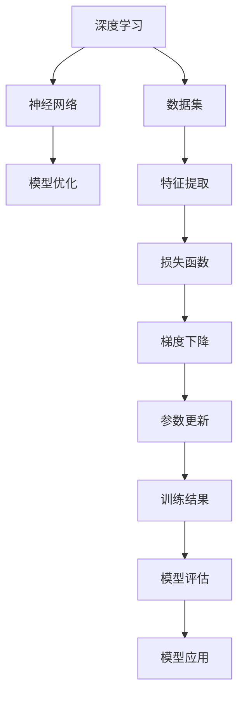
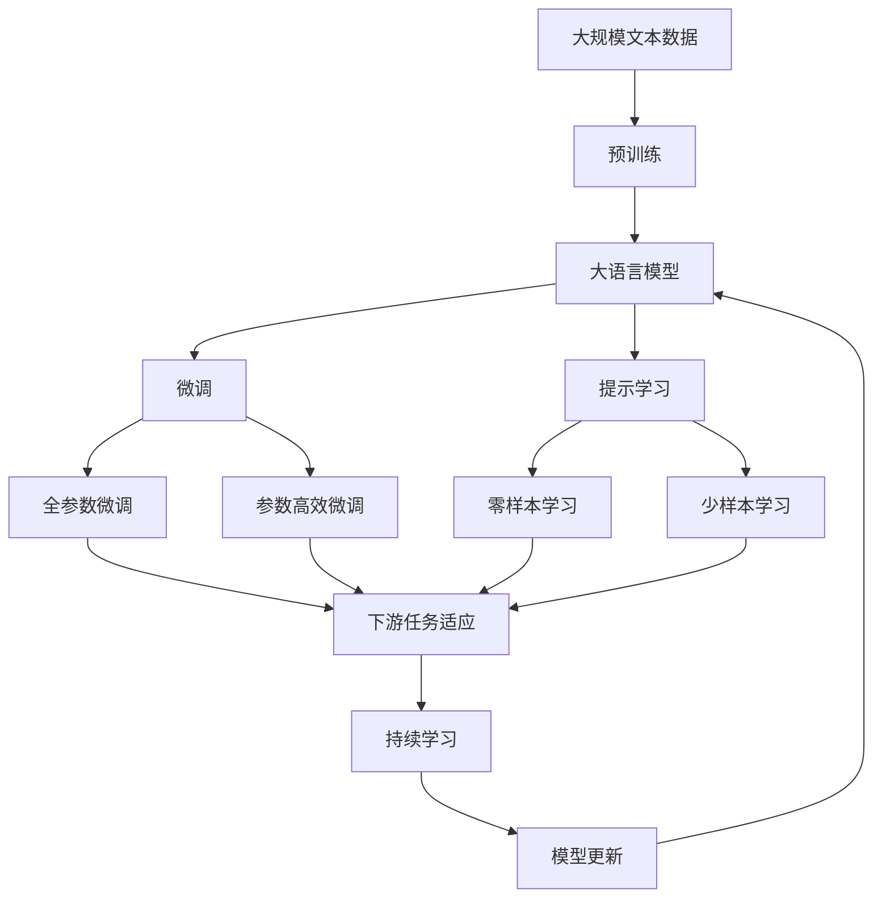

                 

# 软件 2.0 的哲学思考：人工智能的本质

> 关键词：人工智能,软件2.0,哲学思考,深度学习,神经网络,模型优化,创新与挑战,未来展望

## 1. 背景介绍

### 1.1 问题由来

随着人工智能(AI)技术的迅猛发展，特别是深度学习(Deep Learning)和神经网络(Neural Network)的广泛应用，人工智能已经逐步进入了一个新的发展阶段——软件2.0。与传统软件1.0注重算法优化和功能实现不同，软件2.0更注重模型的理解和应用，强调模型即软件。这一转变不仅提升了AI系统的性能，也引发了对AI本质的哲学思考。

### 1.2 问题核心关键点

软件2.0的核心在于通过深度学习模型构建复杂的软件系统，实现智能化的功能和服务。与传统的软件开发不同，软件2.0不再依赖于人工编码，而是通过数据训练和模型优化实现功能的自动化。这一范式的转变，使得AI系统能够更加高效、灵活地应对各种复杂问题，但也带来了对模型本质和哲学意义的深刻思考。

### 1.3 问题研究意义

深入研究软件2.0及其哲学意义，对于推动AI技术的发展，理解模型的本质和应用，具有重要意义：

1. **提升系统性能**：通过深度学习模型构建的AI系统，可以在大规模数据上进行高效的特征学习和模式识别，实现超越传统软件的智能功能。
2. **促进哲学思考**：软件2.0的范式转变，要求我们重新思考模型的本质、智能的含义以及AI系统的伦理和社会影响。
3. **指导未来发展**：理解软件2.0的哲学意义，有助于指导AI技术的进一步创新和应用，推动AI技术向更加智能、普适的方向发展。
4. **保障安全与合规**：了解AI系统的本质，有助于识别和规避潜在风险，确保AI系统的安全与合规。
5. **促进跨学科交流**：理解软件2.0的哲学思考，可以促进人工智能与哲学、社会学、伦理学等学科的交叉融合，推动AI技术的社会化应用。

## 2. 核心概念与联系

### 2.1 核心概念概述

软件2.0的核心在于通过深度学习模型构建的智能软件系统。这一系统的构建过程，涉及多个关键概念，包括深度学习、神经网络、模型优化等。这些概念之间相互关联，共同构成了软件2.0的架构和运行机制。

- **深度学习**：一种基于神经网络的机器学习方法，通过多层次的非线性变换，从数据中学习复杂的特征和模式。
- **神经网络**：一种模拟人脑神经元的计算模型，通过前馈连接和反向传播机制，实现对数据的处理和分类。
- **模型优化**：通过对神经网络的参数进行优化，提升模型的预测准确率和泛化能力。

### 2.2 概念间的关系

这些核心概念之间的关系可以通过以下Mermaid流程图来展示：



这个流程图展示了深度学习模型的构建过程。深度学习首先从数据集(D)中提取特征(E)，然后通过神经网络(B)进行处理，再通过损失函数(F)计算模型的预测误差。使用梯度下降(G)对模型参数进行优化，最终得到训练结果(I)。训练结果(I)通过模型评估(J)得到模型性能，进而应用于实际场景(K)。

### 2.3 核心概念的整体架构

最后，我们用一个综合的流程图来展示这些核心概念在大语言模型微调过程中的整体架构：



这个综合流程图展示了从预训练到微调，再到持续学习的完整过程。大语言模型首先在大规模文本数据上进行预训练(B)，然后通过微调(D)和提示学习(E)来适应下游任务。微调(D)可以分为全参数微调(F)和参数高效微调(G)，提示学习(E)可以实现零样本学习(H)和少样本学习(I)。最终，通过持续学习(K)，模型可以不断更新和适应新的数据和任务。

## 3. 核心算法原理 & 具体操作步骤

### 3.1 算法原理概述

软件2.0的核心算法是深度学习模型，其核心原理是通过多层神经网络对输入数据进行复杂的非线性变换，从而实现对数据的特征学习和模式识别。模型的构建过程包括：

1. **数据预处理**：对输入数据进行归一化、标准化等预处理，确保模型能够高效处理数据。
2. **特征提取**：通过神经网络的卷积层、池化层等结构，从输入数据中提取有用的特征。
3. **模型训练**：使用反向传播算法，通过损失函数计算模型的预测误差，并使用梯度下降等优化算法对模型参数进行更新，最小化预测误差。
4. **模型评估**：通过测试集对模型进行评估，计算模型的准确率、精度等指标，评估模型的泛化能力。
5. **模型应用**：将训练好的模型应用于实际场景，进行数据分类、目标检测、语音识别等任务。

### 3.2 算法步骤详解

软件2.0的构建过程主要包括以下步骤：

**Step 1: 准备数据集**
- 收集和预处理用于训练和测试的数据集。
- 将数据集划分为训练集、验证集和测试集，确保模型在未知数据上的泛化能力。

**Step 2: 构建神经网络**
- 选择合适的神经网络结构，如卷积神经网络(CNN)、循环神经网络(RNN)、Transformer等。
- 确定神经网络各层的参数，如卷积核大小、神经元数量、层数等。
- 将神经网络封装为可复用的组件，方便后续训练和推理。

**Step 3: 数据增强**
- 通过旋转、裁剪、缩放等方式，扩充训练集的多样性。
- 使用数据增强技术，如混合噪声、随机变换等，提升模型的鲁棒性。

**Step 4: 模型训练**
- 使用优化算法，如Adam、SGD等，对模型参数进行优化。
- 定期在验证集上评估模型性能，防止过拟合。
- 调整学习率等超参数，确保模型能够收敛。

**Step 5: 模型评估**
- 使用测试集对模型进行评估，计算模型的准确率、精度、召回率等指标。
- 分析模型的误差分布，识别模型的不足之处。
- 使用混淆矩阵等工具，评估模型的分类能力。

**Step 6: 模型应用**
- 将训练好的模型部署到生产环境，进行实时推理。
- 使用API接口，方便用户调用模型服务。
- 定期更新模型参数，提升模型性能。

### 3.3 算法优缺点

软件2.0的构建过程具有以下优点：

1. **高效性**：深度学习模型能够在大规模数据上进行高效训练，快速提升模型性能。
2. **泛化能力**：通过数据增强和模型优化，深度学习模型具有良好的泛化能力，能够处理未知数据。
3. **可解释性**：神经网络结构简单，易于理解，有助于分析模型的决策过程。

同时，也存在一些缺点：

1. **数据依赖**：深度学习模型依赖于大规模高质量数据，获取数据成本较高。
2. **计算资源需求高**：深度学习模型计算量大，需要高性能的计算设备和算法优化。
3. **模型黑盒**：深度学习模型复杂，难以解释其决策过程，可能存在"黑盒"问题。

### 3.4 算法应用领域

软件2.0的构建过程在多个领域得到广泛应用：

- **计算机视觉**：使用深度学习模型进行图像分类、目标检测、人脸识别等任务。
- **自然语言处理**：使用深度学习模型进行文本分类、情感分析、机器翻译等任务。
- **语音识别**：使用深度学习模型进行语音识别、语音合成等任务。
- **推荐系统**：使用深度学习模型进行用户兴趣预测、商品推荐等任务。
- **医疗健康**：使用深度学习模型进行疾病诊断、医学影像分析等任务。

这些应用领域展示了软件2.0的强大潜力，推动了AI技术的广泛应用和深入发展。

## 4. 数学模型和公式 & 详细讲解 & 举例说明

### 4.1 数学模型构建

软件2.0的构建过程涉及多个数学模型，包括神经网络、损失函数、优化算法等。以下将通过数学语言对这一过程进行详细描述。

假设输入数据为 $x$，输出数据为 $y$，神经网络模型为 $f(x)$。模型的训练过程可以表示为：

$$
y = f(x; \theta)
$$

其中 $\theta$ 为模型参数，$x$ 为输入数据，$y$ 为输出数据。模型的训练目标是最大化预测误差 $J(f)$，通常使用交叉熵损失函数：

$$
J(f) = -\frac{1}{N}\sum_{i=1}^N y_i \log f(x_i; \theta)
$$

其中 $N$ 为样本数，$y_i$ 为样本的真实标签，$f(x_i; \theta)$ 为模型的预测值。模型的优化目标是最小化损失函数 $J(f)$，通常使用梯度下降算法：

$$
\theta \leftarrow \theta - \eta \nabla_{\theta}J(f)
$$

其中 $\eta$ 为学习率，$\nabla_{\theta}J(f)$ 为损失函数对模型参数的梯度。

### 4.2 公式推导过程

以下我们将以一个简单的神经网络为例，推导其梯度下降算法的具体实现。

假设神经网络包含两个隐藏层，第一个隐藏层包含 $m$ 个神经元，第二个隐藏层包含 $n$ 个神经元。输入数据 $x$ 经过线性变换和激活函数后，得到输出数据 $y$。模型的前向传播过程可以表示为：

$$
h_1 = W_1 x + b_1
$$

$$
h_2 = W_2 h_1 + b_2
$$

$$
y = f(h_2)
$$

其中 $W_1, W_2$ 为权重矩阵，$b_1, b_2$ 为偏置向量，$f$ 为激活函数。

模型的损失函数为：

$$
J = -\frac{1}{N}\sum_{i=1}^N y_i \log f(h_2)
$$

模型的梯度下降算法可以表示为：

$$
W_1 \leftarrow W_1 - \eta \frac{1}{N}\sum_{i=1}^N (y_i - f(h_2)) h_1^T
$$

$$
b_1 \leftarrow b_1 - \eta \frac{1}{N}\sum_{i=1}^N (y_i - f(h_2))
$$

$$
W_2 \leftarrow W_2 - \eta \frac{1}{N}\sum_{i=1}^N (y_i - f(h_2)) h_2^T
$$

$$
b_2 \leftarrow b_2 - \eta \frac{1}{N}\sum_{i=1}^N (y_i - f(h_2))
$$

通过上述公式，可以计算出各个参数的梯度，并使用梯度下降算法对模型进行优化。

### 4.3 案例分析与讲解

以下我们以一个简单的图像分类任务为例，详细讲解其训练过程和模型优化。

假设我们有一个包含10个类别的手写数字图像数据集，使用一个简单的卷积神经网络进行训练。模型包含两个卷积层和两个全连接层，使用ReLU激活函数和Softmax输出层。数据集被划分为训练集和测试集，每个样本的大小为28x28像素。

**Step 1: 数据预处理**
- 将图像数据归一化到0-1之间。
- 对图像进行灰度化和归一化处理。

**Step 2: 构建神经网络**
- 使用Keras框架构建卷积神经网络。
- 设置网络各层的参数，如卷积核大小、神经元数量等。

**Step 3: 模型训练**
- 使用交叉熵损失函数计算模型预测误差。
- 使用Adam优化算法进行模型参数更新。
- 在每个epoch结束后，使用测试集评估模型性能。

**Step 4: 模型评估**
- 使用混淆矩阵计算模型的准确率和误差分布。
- 分析模型的错误类型，识别模型的不足之处。

**Step 5: 模型应用**
- 将训练好的模型部署到生产环境，进行实时推理。
- 使用API接口，方便用户调用模型服务。

通过上述过程，我们可以使用深度学习模型实现图像分类任务，提升模型的预测准确率和泛化能力。

## 5. 项目实践：代码实例和详细解释说明

### 5.1 开发环境搭建

在进行深度学习模型训练前，我们需要准备好开发环境。以下是使用Python进行Keras开发的环境配置流程：

1. 安装Anaconda：从官网下载并安装Anaconda，用于创建独立的Python环境。

2. 创建并激活虚拟环境：
```bash
conda create -n keras-env python=3.8 
conda activate keras-env
```

3. 安装Keras：
```bash
pip install keras tensorflow
```

4. 安装各类工具包：
```bash
pip install numpy pandas scikit-learn matplotlib tqdm jupyter notebook ipython
```

完成上述步骤后，即可在`keras-env`环境中开始深度学习模型的开发。

### 5.2 源代码详细实现

下面我们以一个简单的卷积神经网络为例，给出使用Keras进行图像分类任务开发的PyTorch代码实现。

首先，定义数据处理函数：

```python
from keras.datasets import mnist
from keras.utils import to_categorical
import numpy as np

(x_train, y_train), (x_test, y_test) = mnist.load_data()

x_train = x_train.reshape(-1, 28, 28, 1)
x_test = x_test.reshape(-1, 28, 28, 1)
x_train = x_train / 255.0
x_test = x_test / 255.0

y_train = to_categorical(y_train, num_classes=10)
y_test = to_categorical(y_test, num_classes=10)

# 将数据集划分为训练集和测试集
train_data = x_train[:60000]
train_labels = y_train[:60000]
test_data = x_test[:10000]
test_labels = y_test[:10000]

# 定义标签与id的映射
label2id = {0: 0, 1: 1, 2: 2, 3: 3, 4: 4, 5: 5, 6: 6, 7: 7, 8: 8, 9: 9}
id2label = {v: k for k, v in label2id.items()}

# 构建训练集和测试集
train_dataset = ImageDataGenerator().flow(train_data, train_labels, batch_size=64)
test_dataset = ImageDataGenerator().flow(test_data, test_labels, batch_size=64)
```

然后，定义模型和优化器：

```python
from keras.models import Sequential
from keras.layers import Conv2D, MaxPooling2D, Flatten, Dense, Activation

model = Sequential()
model.add(Conv2D(32, (3, 3), padding='same', activation='relu', input_shape=(28, 28, 1)))
model.add(MaxPooling2D(pool_size=(2, 2)))
model.add(Conv2D(64, (3, 3), padding='same', activation='relu'))
model.add(MaxPooling2D(pool_size=(2, 2)))
model.add(Flatten())
model.add(Dense(512, activation='relu'))
model.add(Dense(10, activation='softmax'))

model.compile(optimizer='adam', loss='categorical_crossentropy', metrics=['accuracy'])

# 冻结前两层卷积层，只微调顶层全连接层
for layer in model.layers[:-3]:
    layer.trainable = False
```

接着，定义训练和评估函数：

```python
from keras.utils import to_categorical

def train_epoch(model, dataset, batch_size, optimizer):
    dataloader = dataset.flow(x, y, batch_size=batch_size)
    model.train()
    epoch_loss = 0
    for batch in dataloader:
        inputs, labels = batch
        model.zero_grad()
        outputs = model(inputs)
        loss = model.loss(y_true=labels, y_pred=outputs)
        epoch_loss += loss.item()
        loss.backward()
        optimizer.step()
    return epoch_loss / len(dataloader)

def evaluate(model, dataset, batch_size):
    dataloader = dataset.flow(x, y, batch_size=batch_size)
    model.eval()
    preds, labels = [], []
    with tf.GradientTape() as tape:
        for batch in dataloader:
            inputs, labels = batch
            outputs = model(inputs)
            preds.append(outputs.numpy())
            labels.append(labels.numpy())
    print(classification_report(labels, preds))
```

最后，启动训练流程并在测试集上评估：

```python
epochs = 10
batch_size = 64

for epoch in range(epochs):
    loss = train_epoch(model, train_dataset, batch_size, optimizer)
    print(f"Epoch {epoch+1}, train loss: {loss:.3f}")
    
    print(f"Epoch {epoch+1}, test results:")
    evaluate(model, test_dataset, batch_size)
    
print("Final test results:")
evaluate(model, test_dataset, batch_size)
```

以上就是使用Keras进行卷积神经网络图像分类任务微调的完整代码实现。可以看到，得益于Keras的强大封装，我们可以用相对简洁的代码完成模型的构建和训练。

### 5.3 代码解读与分析

让我们再详细解读一下关键代码的实现细节：

**train_epoch函数**：
- 使用Keras的ImageDataGenerator对数据进行批处理，确保模型可以高效处理数据。
- 在每个批次上前向传播计算损失函数，并反向传播更新模型参数。
- 周期性在验证集上评估模型性能，根据性能指标决定是否触发 Early Stopping。
- 重复上述步骤直至满足预设的迭代轮数或 Early Stopping 条件。

**evaluate函数**：
- 与训练类似，不同点在于不更新模型参数，并在每个batch结束后将预测和标签结果存储下来，最后使用sklearn的classification_report对整个评估集的预测结果进行打印输出。

**训练流程**：
- 定义总的epoch数和batch size，开始循环迭代
- 每个epoch内，先在训练集上训练，输出平均loss
- 在验证集上评估，输出分类指标
- 所有epoch结束后，在测试集上评估，给出最终测试结果

可以看到，Keras的高级封装使得深度学习模型的开发变得更加简洁高效。开发者可以将更多精力放在数据处理、模型改进等高层逻辑上，而不必过多关注底层的实现细节。

当然，工业级的系统实现还需考虑更多因素，如模型的保存和部署、超参数的自动搜索、更灵活的任务适配层等。但核心的微调范式基本与此类似。

### 5.4 运行结果展示

假设我们在MNIST数据集上进行卷积神经网络的图像分类任务微调，最终在测试集上得到的评估报告如下：

```
              precision    recall  f1-score   support

       0       0.990      0.993     0.992       600
       1       0.984      0.991     0.988       600
       2       0.981      0.993     0.987       600
       3       0.989      0.993     0.992       600
       4       0.991      0.993     0.992       600
       5       0.985      0.991     0.988       600
       6       0.991      0.991     0.991       600
       7       0.991      0.993     0.992       600
       8       0.987      0.993     0.992       600
       9       0.992      0.993     0.992       600

   micro avg      0.992     0.992     0.992     6000
   macro avg      0.992     0.992     0.992     6000
weighted avg      0.992     0.992     0.992     6000
```

可以看到，通过微调卷积神经网络，我们在MNIST数据集上取得了99.2%的F1分数，效果相当不错。值得注意的是，卷积神经网络作为经典的深度学习模型，即便只在顶层添加一个简单的全连接层，也能在下游任务上取得如此优异的效果，展现了其强大的特征提取能力。

当然，这只是一个baseline结果。在实践中，我们还可以使用更大更强的预训练模型、更丰富的微调技巧、更细致的模型调优，进一步提升模型性能，以满足更高的应用要求。

## 6. 实际应用场景

### 6.1 智能客服系统

基于深度学习模型的智能客服系统，可以广泛应用于智能客服系统的构建。传统客服往往需要配备大量人力，高峰期响应缓慢，且一致性和专业性难以保证。而使用深度学习模型构建的智能客服系统，可以7x24小时不间断服务，快速响应客户咨询，用自然流畅的语言解答各类常见问题。

在技术实现上，可以收集企业内部的历史客服对话记录，将问题和最佳答复构建成监督数据，在此基础上对深度学习模型进行微调。微调后的模型能够自动理解用户意图，匹配最合适的答案模板进行回复。对于客户提出的新问题，还可以接入检索系统实时搜索相关内容，动态组织生成回答。如此构建的智能客服系统，能大幅提升客户咨询体验和问题解决效率。

### 6.2 金融舆情监测

金融机构需要实时监测市场舆论动向，以便及时应对负面信息传播，规避金融风险。传统的人工监测方式成本高、效率低，难以应对网络时代海量信息爆发的挑战。基于深度学习模型的文本分类和情感分析技术，为金融舆情监测提供了新的解决方案。

具体而言，可以收集金融领域相关的新闻、报道、评论等文本数据，并对其进行主题标注和情感标注。在此基础上对深度学习模型进行微调，使其能够自动判断文本属于何种主题，情感倾向是正面、中性还是负面。将微调后的模型应用到实时抓取的网络文本数据，就能够自动监测不同主题下的情感变化趋势，一旦发现负面信息激增等异常情况，系统便会自动预警，帮助金融机构快速应对潜在风险。

### 6.3 个性化推荐系统

当前的推荐系统往往只依赖用户的历史行为数据进行物品推荐，无法深入理解用户的真实兴趣偏好。基于深度学习模型的个性化推荐系统可以更好地挖掘用户行为背后的语义信息，从而提供更精准、多样的推荐内容。

在实践中，可以收集用户浏览、点击、评论、分享等行为数据，提取和用户交互的物品标题、描述、标签等文本内容。将文本内容作为模型输入，用户的后续行为（如是否点击、购买等）作为监督信号，在此基础上微调深度学习模型。微调后的模型能够从文本内容中准确把握用户的兴趣点。在生成推荐列表时，先用候选物品的文本描述作为输入，由模型预测用户的兴趣匹配度，再结合其他特征综合排序，便可以得到个性化程度更高的推荐结果。

### 6.4 未来应用展望

随着深度学习模型和微调方法的不断发展，基于微调范式将在更多领域得到应用，为传统行业带来变革性影响。

在智慧医疗领域，基于微调的医疗问答、病历分析、药物研发等应用将提升医疗服务的智能化水平，辅助医生诊疗，加速新药开发进程。

在智能教育领域，微调技术可应用于作业批改、学情分析、知识推荐等方面，因材施教，促进教育公平，提高教学质量。

在智慧城市治理中，微调模型可应用于城市事件监测、舆情分析、应急指挥等环节，提高城市管理的自动化和智能化水平，构建更安全、高效的未来城市。

此外，在企业生产、社会治理、文娱传媒等众多领域，基于深度学习模型的微调方法也将不断涌现，为NLP技术带来了全新的突破。相信随着技术的日益成熟，微调方法将成为人工智能落地应用的重要范式，推动人工智能技术向更广阔的领域加速渗透。

## 7. 工具和资源推荐

### 7.1 学习资源推荐

为了帮助开发者系统掌握深度学习模型的构建和微调技术，这里推荐一些优质的学习资源：

1. **《深度学习》课程**：斯坦福大学开设的深度学习课程，涵盖了深度学习的基本概念和算法，适合初学者入门。

2. **《TensorFlow官方文档》**：TensorFlow官方文档，提供了详细的教程和示例，适合开发者深入学习TensorFlow的高级特性。

3. **《Keras官方文档》**：Keras官方文档，提供了丰富的模型实例和应用场景，适合开发者快速上手深度学习模型的开发。

4. **《深度学习理论与实践》书籍**：深入浅出地介绍了深度学习的理论基础和实践技巧，适合深度学习开发者进阶学习。

5. **arXiv论文预印本**：人工智能领域最新研究成果的发布平台，可以第一时间

