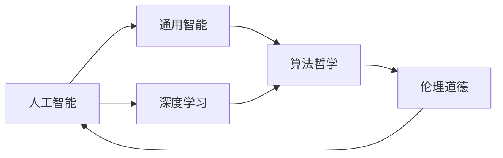

                 

# 软件 2.0 的哲学思考：人工智能的本质

> 关键词：软件2.0, 人工智能, 人类智能, 深度学习, 通用智能, 算法哲学

## 1. 背景介绍

### 1.1 问题由来

21世纪，随着计算机科学的迅猛发展，特别是深度学习技术的突破，人工智能（AI）进入了高速发展阶段。从棋类游戏到图像识别，从语音识别到自然语言处理，人工智能在多个领域展示了卓越的性能。

然而，这些人工智能系统是否达到了“智能”的标准？它们是否能够像人类一样，具备理解、推理、创造的能力？这些问题引发了广泛而深入的哲学思考。

### 1.2 问题核心关键点

人工智能的核心问题在于如何定义“智能”，以及人工智能是否能够达到人类智能的水平。这一问题不仅关乎技术实现，更涉及伦理、社会、经济等多方面的考量。

- **智能定义**：人类智能通常包括理解、推理、创造等能力，但这些能力如何量化？人工智能是否能够超越人类的这些能力？
- **通用智能**：是否存在一种通用的智能，能够适应各种复杂任务？
- **道德伦理**：人工智能的发展是否可能带来新的道德伦理问题？如何确保人工智能的使用符合人类价值观？
- **算法哲学**：人工智能的本质是什么？算法和智能之间存在怎样的联系？

这些问题不仅是技术实现的难点，更涉及深层次的哲学和伦理问题。本文将从这些核心问题出发，深入探讨人工智能的本质及其哲学思考。

## 2. 核心概念与联系

### 2.1 核心概念概述

- **人工智能**：指通过计算机程序实现人类智能的系统，包括学习、推理、感知、决策等能力。
- **深度学习**：一种基于神经网络的机器学习技术，通过多层非线性变换，从原始数据中提取高层次特征。
- **通用智能**：指能够适应各种复杂任务的智能，具备理解、推理、创造等能力。
- **算法哲学**：探讨算法和智能之间的联系，研究算法的本质和智能的本质。
- **伦理道德**：人工智能的发展可能带来的道德伦理问题，如隐私保护、决策透明度、就业影响等。

这些概念之间存在紧密的联系，共同构成了人工智能研究的框架。理解这些概念及其相互关系，是深入探讨人工智能本质的基础。

### 2.2 概念间的关系

这些核心概念之间的关系可以通过以下Mermaid流程图来展示：



这个流程图展示了人工智能与其他核心概念的关系：

1. 人工智能基于深度学习技术实现，具备通用智能的能力。
2. 算法哲学探讨了算法的本质和智能的本质，研究如何通过算法实现智能。
3. 伦理道德是人工智能应用中需要考虑的重要因素，影响算法的开发和应用。

## 3. 核心算法原理 & 具体操作步骤

### 3.1 算法原理概述

人工智能的核心算法原理涉及机器学习、深度学习、强化学习等多个领域。其中，深度学习通过构建复杂的神经网络模型，从大量数据中提取特征，实现对数据的理解和推理。

深度学习的核心在于神经网络结构的设计和训练。通过反向传播算法，神经网络能够自动调整权重，最小化预测误差。这种自适应的能力，使得深度学习在处理复杂任务时表现出卓越的性能。

### 3.2 算法步骤详解

深度学习的训练过程一般包括以下几个关键步骤：

1. **数据准备**：收集和预处理训练数据，确保数据的多样性和代表性。
2. **模型设计**：选择合适的神经网络结构，确定网络层数、节点数等参数。
3. **损失函数设计**：定义用于衡量模型预测与真实标签之间差异的损失函数。
4. **反向传播**：通过梯度下降等优化算法，更新模型参数以最小化损失函数。
5. **验证与测试**：在验证集和测试集上评估模型的性能，确保模型泛化能力。

### 3.3 算法优缺点

深度学习的优点在于其强大的数据处理能力和自适应学习能力，能够处理大规模的复杂任务。但同时也存在一些缺点：

- **数据依赖**：深度学习模型需要大量标注数据进行训练，数据不足时性能受限。
- **计算资源消耗大**：深度学习模型参数量大，训练和推理需要大量计算资源。
- **可解释性差**：深度学习模型通常是“黑盒”模型，难以解释其决策过程。
- **鲁棒性不足**：深度学习模型面对小样本、噪声数据等情况时，容易产生过拟合。

### 3.4 算法应用领域

深度学习在多个领域得到了广泛应用，如计算机视觉、自然语言处理、语音识别等。以下是几个典型应用场景：

- **计算机视觉**：图像分类、目标检测、图像分割等任务。
- **自然语言处理**：文本分类、情感分析、机器翻译等任务。
- **语音识别**：语音识别、语音合成、语音情感识别等任务。
- **医疗健康**：医学图像分析、疾病诊断、药物发现等任务。
- **自动驾驶**：环境感知、路径规划、决策制定等任务。

这些应用展示了深度学习在各个领域的广泛影响力，为社会发展和科技进步提供了强有力的支撑。

## 4. 数学模型和公式 & 详细讲解

### 4.1 数学模型构建

深度学习的核心数学模型是神经网络。以一个简单的前馈神经网络为例，其数学模型可以表示为：

$$
y = f(Wx + b)
$$

其中，$x$ 为输入向量，$W$ 为权重矩阵，$b$ 为偏置向量，$f$ 为激活函数。神经网络的输出 $y$ 通过多层非线性变换，最终成为模型的预测结果。

### 4.2 公式推导过程

以一个简单的多隐层前馈神经网络为例，其数学推导过程如下：

1. **输入层**：输入 $x$ 经过线性变换后得到 $z_1 = W_1x + b_1$，再经过激活函数得到 $h_1 = f(z_1)$。
2. **隐层**：$z_2 = W_2h_1 + b_2$，$h_2 = f(z_2)$。
3. **输出层**：$z_3 = W_3h_2 + b_3$，$y = f(z_3)$。

通过反向传播算法，可以计算每个参数的梯度，并更新权重和偏置向量，以最小化损失函数：

$$
L = \frac{1}{N}\sum_{i=1}^N \ell(y_i, \hat{y}_i)
$$

其中 $\ell$ 为损失函数，$\hat{y}$ 为模型预测结果，$y$ 为真实标签。

### 4.3 案例分析与讲解

以图像分类任务为例，神经网络模型可以通过多层卷积和池化层提取图像特征，并通过全连接层进行分类。具体实现如下：

1. **卷积层**：通过卷积操作提取图像特征。
2. **池化层**：通过最大池化操作降维，保留重要特征。
3. **全连接层**：将特征向量映射到类别空间，进行分类预测。

深度学习的成功在于其强大的数据处理能力和自动特征提取能力，能够处理各种复杂的非线性关系。但同时也需要大量的计算资源和标注数据，以及有效的训练策略和模型设计。

## 5. 项目实践：代码实例和详细解释说明

### 5.1 开发环境搭建

为了进行深度学习项目开发，需要搭建合适的开发环境。以下是使用Python和TensorFlow搭建深度学习开发环境的流程：

1. **安装Python**：从官网下载并安装Python 3.6以上版本。
2. **安装TensorFlow**：从官网下载并安装TensorFlow，支持CUDA和GPU加速。
3. **安装其他库**：安装常用的深度学习库，如Keras、TensorBoard等。
4. **配置环境**：在开发环境中设置Python路径和环境变量。

### 5.2 源代码详细实现

以下是一个简单的图像分类模型的实现，使用TensorFlow和Keras库：

```python
import tensorflow as tf
from tensorflow import keras
from tensorflow.keras import layers

# 加载数据集
(x_train, y_train), (x_test, y_test) = keras.datasets.mnist.load_data()

# 数据预处理
x_train = x_train / 255.0
x_test = x_test / 255.0

# 定义模型
model = keras.Sequential([
    layers.Flatten(input_shape=(28, 28)),
    layers.Dense(128, activation='relu'),
    layers.Dense(10, activation='softmax')
])

# 编译模型
model.compile(optimizer='adam',
              loss='sparse_categorical_crossentropy',
              metrics=['accuracy'])

# 训练模型
model.fit(x_train, y_train, epochs=5, validation_data=(x_test, y_test))

# 评估模型
model.evaluate(x_test, y_test)
```

### 5.3 代码解读与分析

上述代码实现了简单的手写数字图像分类模型。具体步骤包括：

1. **数据加载与预处理**：使用Keras的数据加载器加载MNIST数据集，并将像素值归一化。
2. **模型定义**：使用Keras的Sequential模型定义神经网络结构，包含一个全连接层和一个输出层。
3. **模型编译**：指定优化器、损失函数和评估指标，准备训练。
4. **模型训练**：使用fit方法对模型进行训练，并指定验证集。
5. **模型评估**：使用evaluate方法评估模型在测试集上的性能。

### 5.4 运行结果展示

训练模型后，可以通过以下代码生成预测结果：

```python
import matplotlib.pyplot as plt

# 随机选择一个测试样本
digit = x_test[0]

# 使用模型预测数字
prediction = model.predict(digit.reshape(1, 784))[0]

# 绘制数字图像
plt.imshow(digit, cmap='gray')
plt.show()

# 打印预测结果
print(prediction)
```

以上代码展示了深度学习模型的训练、评估和预测过程。通过构建适当的神经网络结构，并使用反向传播算法进行训练，可以有效地解决复杂的分类问题。

## 6. 实际应用场景

### 6.1 智能推荐系统

智能推荐系统是深度学习在实际应用中的重要场景之一。通过分析用户的历史行为数据，预测用户偏好，提供个性化的推荐内容。推荐系统广泛应用于电商、新闻、视频等领域，极大地提升了用户体验和商业价值。

### 6.2 自动驾驶

自动驾驶是深度学习在智能交通领域的重要应用。通过构建环境感知、路径规划、决策制定的模型，自动驾驶系统能够在复杂交通环境中实现安全可靠的行驶。自动驾驶技术的推广，将彻底改变人们的出行方式和生活习惯。

### 6.3 医疗健康

深度学习在医疗健康领域的应用也日益广泛。通过分析医学影像、病历数据，预测疾病发展趋势，辅助医生诊断和治疗。深度学习在医学图像分析、疾病诊断、药物发现等领域展示了卓越的性能，为医疗健康事业提供了强有力的支撑。

## 7. 工具和资源推荐

### 7.1 学习资源推荐

- **《深度学习》书籍**：Ian Goodfellow等著作，深度学习领域的经典教材，涵盖深度学习的理论和实践。
- **Coursera课程**：由斯坦福大学、加州大学等名校开设的深度学习课程，提供了丰富的学习资源和实战经验。
- **Kaggle竞赛**：参加Kaggle数据科学竞赛，通过实际项目提升深度学习技能。

### 7.2 开发工具推荐

- **TensorFlow**：由Google开发的深度学习框架，支持多种平台和硬件加速。
- **PyTorch**：Facebook开发的深度学习框架，提供了灵活的动态计算图功能。
- **Keras**：高层次的深度学习库，提供了简单易用的API接口。

### 7.3 相关论文推荐

- **《深度学习》论文**：Ian Goodfellow等，介绍了深度学习的基本概念和应用。
- **《ImageNet分类挑战》论文**：Alex Krizhevsky等，展示了深度学习在图像分类任务上的突破性成果。
- **《AlphaGo论文》**：David Silver等，展示了深度学习在围棋智能上的应用。

## 8. 总结：未来发展趋势与挑战

### 8.1 研究成果总结

深度学习在多个领域展示了卓越的性能，为社会发展和科技进步提供了强有力的支撑。然而，深度学习仍然存在诸多挑战，需要进一步研究和探索。

### 8.2 未来发展趋势

- **多模态学习**：深度学习将进一步拓展到多模态数据融合，实现视觉、语音、文本等多种信息协同处理。
- **弱监督学习**：深度学习将更多地关注弱监督学习，利用少量标注数据进行训练，提升模型泛化能力。
- **边缘计算**：深度学习模型将更多地在边缘设备上进行部署，降低计算和存储成本。
- **联邦学习**：通过分布式协同学习，保护用户隐私，提升模型安全性和鲁棒性。

### 8.3 面临的挑战

- **数据瓶颈**：深度学习需要大量标注数据进行训练，数据获取和标注成本高昂。
- **计算资源**：深度学习模型参数量大，计算和存储资源消耗大。
- **可解释性**：深度学习模型通常是“黑盒”模型，难以解释其决策过程。
- **伦理问题**：深度学习可能带来隐私泄露、偏见歧视等问题，需要多方协同解决。

### 8.4 研究展望

未来，深度学习将在多个领域继续深入应用，为社会发展和科技进步提供更强大的动力。同时，深度学习也需要面对和解决更多的挑战，确保其在各个领域的应用安全、可靠、公平。

## 9. 附录：常见问题与解答

**Q1: 深度学习是否能够完全替代人类智能？**

A: 深度学习在某些领域展示了卓越的性能，但完全替代人类智能仍存在很大挑战。深度学习擅长处理大量数据和复杂模式，但在理解、推理、创造等方面，仍难以达到人类智能的水平。

**Q2: 深度学习算法的本质是什么？**

A: 深度学习的本质在于通过神经网络结构，从大量数据中提取高层次特征，实现对数据的理解和推理。算法本身是一种基于数据驱动的学习过程，需要大量标注数据和计算资源进行训练和优化。

**Q3: 深度学习在实际应用中需要注意哪些问题？**

A: 深度学习在实际应用中需要注意以下几个问题：
- 数据获取和标注成本高昂，需要多方协作解决。
- 计算资源消耗大，需要高效优化和分布式部署。
- 模型可解释性差，需要结合多种手段提高模型透明性。
- 隐私和安全问题需要特别注意，保护用户数据和隐私。

**Q4: 深度学习如何应用于未来社会的各个领域？**

A: 深度学习在未来社会的应用领域包括：
- 医疗健康：辅助诊断和治疗，提升医疗服务水平。
- 自动驾驶：实现安全可靠的智能驾驶，改变交通出行方式。
- 金融科技：风险评估和欺诈检测，提升金融安全和服务水平。
- 教育培训：个性化推荐和智能评估，提升教育培训质量。

综上所述，深度学习在多个领域展示了卓越的性能，但也存在诸多挑战。未来，深度学习需要在解决数据、计算、可解释性、伦理问题等方面不断进步，才能更好地服务于社会发展和科技进步。

---

作者：禅与计算机程序设计艺术 / Zen and the Art of Computer Programming

