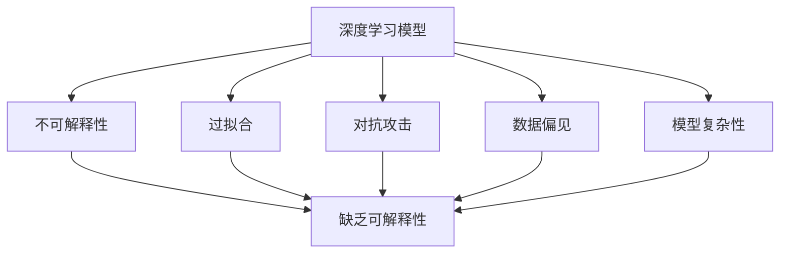
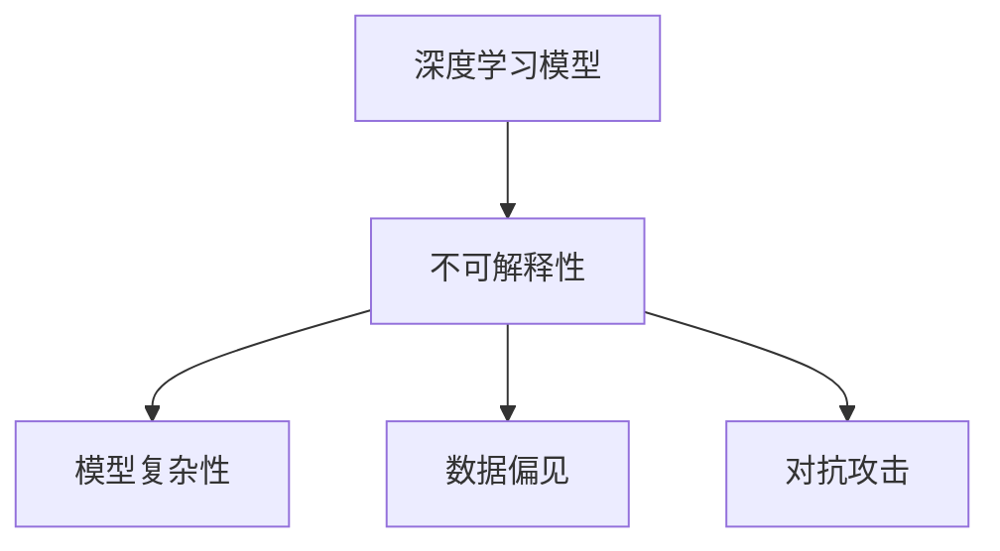
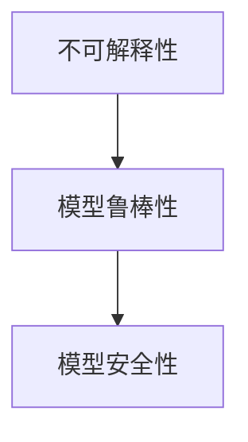
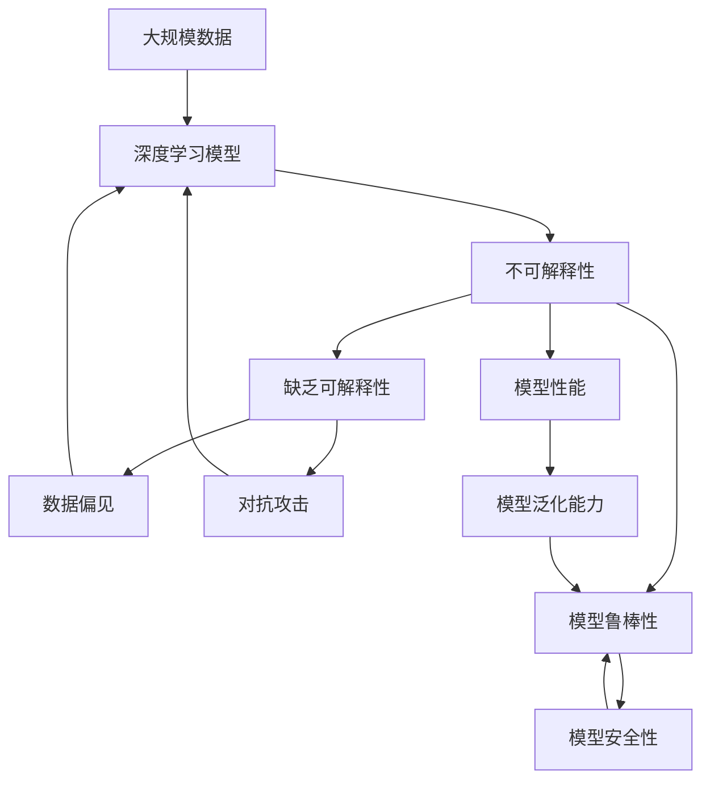

                 

# 软件 2.0 的局限性：不可解释性和潜在风险

## 1. 背景介绍

### 1.1 问题由来

随着人工智能（AI）技术的不断进步，软件正处于从软件 1.0 向软件 2.0 的转型过程中。软件 2.0 的核心是深度学习模型，它能够处理和理解复杂的数据，通过训练学习到强大的模式识别能力。然而，这种依赖于大量数据和复杂模型的技术，也带来了诸多不可解释性和潜在风险。

不可解释性指的是机器学习模型的决策过程难以被人类理解，难以解释模型为何得出某个特定结论或预测。潜在风险则包括数据偏见、模型过拟合、对抗攻击等，这些风险可能会带来严重的后果，甚至威胁到社会的稳定和安全。

### 1.2 问题核心关键点

软件 2.0 的不可解释性和潜在风险，主要集中在以下几个方面：

- **数据偏见**：机器学习模型的训练数据如果包含偏见，模型将学习到这些偏见，并可能在预测过程中放大或继承这些偏见，导致模型在处理某些特定群体或问题时表现不佳。
- **过拟合**：机器学习模型在训练过程中可能会过度拟合训练数据，导致模型泛化能力差，无法处理新数据或泛化到其他场景。
- **对抗攻击**：对抗攻击是指通过微小地修改输入数据，使机器学习模型产生错误的预测或决策。这可能会导致自动驾驶、医疗诊断等关键系统产生严重误判。
- **模型复杂性**：深度学习模型的参数数量巨大，结构复杂，难以直接理解其内部的工作机制。
- **缺乏可解释性**：深度学习模型的预测和决策过程难以用传统的逻辑解释，导致无法进行必要的审核和验证。

这些问题不仅影响模型的效果，还可能导致法律、伦理和安全等方面的风险，因此必须引起足够的重视。

### 1.3 问题研究意义

研究软件 2.0 的不可解释性和潜在风险，对于确保AI技术的可靠性、公正性和安全性具有重要意义。

- **提升可靠性**：通过理解模型的内部工作机制，可以更好地诊断和修复模型缺陷，提高模型的稳定性和可靠性。
- **保障公正性**：了解模型如何处理不同群体和数据，可以识别和纠正数据偏见，确保模型的公平性和公正性。
- **增强安全性**：分析模型的脆弱性和潜在威胁，可以采取相应的防护措施，提高系统的安全性和鲁棒性。
- **促进可解释性**：为模型建立合理的可解释性，可以使模型更容易被理解和接受，有助于推广AI技术的普及和应用。

通过深入研究这些问题，可以推动软件 2.0 技术的健康发展，构建更加透明、可靠、安全的AI系统。

## 2. 核心概念与联系

### 2.1 核心概念概述

为更好地理解软件 2.0 的不可解释性和潜在风险，本节将介绍几个关键概念：

- **深度学习模型**：指通过多层次神经网络结构进行训练的机器学习模型，包括卷积神经网络（CNN）、循环神经网络（RNN）和变换器（Transformer）等。
- **不可解释性**：指机器学习模型的决策过程难以用传统的逻辑解释，通常依赖于黑箱算法，导致难以理解和验证模型的预测。
- **过拟合**：指机器学习模型在训练过程中过度拟合训练数据，导致模型泛化能力差，无法处理新数据或泛化到其他场景。
- **对抗攻击**：指通过微小地修改输入数据，使机器学习模型产生错误的预测或决策。
- **数据偏见**：指机器学习模型的训练数据如果包含偏见，模型将学习到这些偏见，并可能在预测过程中放大或继承这些偏见。
- **模型复杂性**：指深度学习模型的参数数量巨大，结构复杂，难以直接理解其内部的工作机制。

这些概念之间的逻辑关系可以通过以下Mermaid流程图来展示：



这个流程图展示了大语言模型的核心概念及其之间的关系：

1. 深度学习模型通过训练学习到强大的模式识别能力，但这种能力往往难以解释。
2. 过拟合和对抗攻击可能导致模型泛化能力差，决策过程不可靠。
3. 数据偏见和模型复杂性增加了模型的不可解释性，影响模型的公正性和可靠性。
4. 不可解释性最终导致模型缺乏可解释性，难以理解和验证其决策过程。

### 2.2 概念间的关系

这些核心概念之间存在着紧密的联系，形成了软件 2.0 的不可解释性和潜在风险的完整生态系统。下面我们通过几个Mermaid流程图来展示这些概念之间的关系。

#### 2.2.1 不可解释性的主要来源



这个流程图展示了不可解释性的主要来源：

1. 深度学习模型的复杂性导致其决策过程难以理解。
2. 数据偏见可能导致模型在特定群体或场景上的表现不佳。
3. 对抗攻击可能使模型在面对恶意输入时产生误判。

#### 2.2.2 不可解释性对模型性能的影响


这个流程图展示了不可解释性对模型性能的影响：

1. 模型训练过程中难以理解和验证模型的决策过程。
2. 不可解释性可能导致模型性能不稳定，难以在实际应用中表现一致。

#### 2.2.3 不可解释性与模型鲁棒性的关系



这个流程图展示了不可解释性对模型鲁棒性的影响：

1. 不可解释性可能导致模型难以理解和识别潜在的风险。
2. 模型的鲁棒性增加，能够更好地应对各种异常情况，提高系统的安全性。

### 2.3 核心概念的整体架构

最后，我们用一个综合的流程图来展示这些核心概念在大语言模型不可解释性和潜在风险中的整体架构：



这个综合流程图展示了从数据输入到模型输出的完整过程，以及各个环节中不可解释性、潜在风险和模型性能的关系：

1. 大规模数据输入到大规模深度学习模型，模型通过训练学习到强大的模式识别能力。
2. 模型学习过程中可能存在数据偏见和对抗攻击，导致模型决策过程不可解释。
3. 不可解释性可能影响模型性能和鲁棒性，降低模型在实际应用中的可靠性。
4. 模型输出的不可解释性可能导致数据偏见和对抗攻击，影响模型的公正性和安全性。

通过这些流程图，我们可以更清晰地理解软件 2.0 的不可解释性和潜在风险，为后续深入讨论具体的技术细节奠定基础。

## 3. 核心算法原理 & 具体操作步骤
### 3.1 算法原理概述

软件 2.0 的不可解释性和潜在风险，源于深度学习模型的复杂性和数据处理的特点。其核心思想是：

- **数据偏见**：如果训练数据包含偏见，模型将学习到这些偏见，并在预测过程中放大或继承这些偏见。
- **过拟合**：模型在训练过程中可能过度拟合训练数据，导致泛化能力差，无法处理新数据。
- **对抗攻击**：对抗攻击通过微小地修改输入数据，使模型产生错误的预测或决策。
- **模型复杂性**：深度学习模型的参数数量巨大，结构复杂，难以直接理解其内部的工作机制。

针对这些问题，我们采用以下步骤进行解决：

### 3.2 算法步骤详解

**Step 1: 准备训练数据和模型**

- 准备大规模数据集，并确保数据集的多样性和代表性。
- 选择合适的深度学习模型，如卷积神经网络（CNN）、循环神经网络（RNN）和变换器（Transformer）等。
- 使用合适的数据预处理技术，如数据增强、标准化等，提高数据质量。

**Step 2: 添加正则化技术**

- 使用L2正则、Dropout等技术，避免过拟合，提高模型泛化能力。
- 设置合适的正则化系数，确保模型在训练和测试时都能保持稳定性能。

**Step 3: 引入对抗训练**

- 收集对抗样本，对模型进行对抗训练，提高模型的鲁棒性和泛化能力。
- 使用对抗样本生成技术，如Fast Gradient Sign Method（FGSM）、Projected Gradient Descent（PGD）等，生成对抗样本，并对模型进行微调。

**Step 4: 采用参数高效微调技术**

- 使用 Adapter、LoRA、BitFit 等参数高效微调技术，只调整少量模型参数，提高微调效率。
- 冻结预训练模型的底层参数，只微调顶层参数，减少微调过程中对预训练权重的影响。

**Step 5: 引入外部知识**

- 将外部知识（如知识图谱、逻辑规则等）与模型进行融合，提高模型的可解释性和准确性。
- 使用知识蒸馏技术，将外部知识转化为模型中的特征，提升模型的性能。

**Step 6: 采用多模型集成**

- 训练多个模型，并使用投票或加权平均的方式进行集成，提高模型的鲁棒性和稳定性。
- 集成模型可以克服单一模型的不足，提高系统的整体性能。

### 3.3 算法优缺点

软件 2.0 的不可解释性和潜在风险，带来了以下优缺点：

**优点**：

- **高泛化能力**：深度学习模型在处理复杂数据时具有强大的泛化能力，可以处理各种复杂场景。
- **高准确性**：通过大规模数据训练，深度学习模型在许多任务上都能取得高准确性。

**缺点**：

- **不可解释性**：深度学习模型的决策过程难以用传统的逻辑解释，导致难以理解和验证模型的预测。
- **数据依赖性**：深度学习模型的性能高度依赖于训练数据的质量和多样性，数据偏见可能导致模型不公平。
- **对抗攻击脆弱**：深度学习模型在对抗攻击下可能产生误判，影响系统的安全性。
- **模型复杂性**：深度学习模型的参数数量巨大，结构复杂，难以直接理解其内部的工作机制。

### 3.4 算法应用领域

软件 2.0 的不可解释性和潜在风险，涉及多个应用领域：

- **计算机视觉**：如人脸识别、物体检测等任务中，模型可能对不同种族、性别的人脸或物体产生偏见，导致不公平。
- **自然语言处理**：如情感分析、文本生成等任务中，模型可能对某些话题或观点产生偏见，导致误判。
- **自动驾驶**：如自动驾驶中的目标检测、路径规划等任务中，模型可能对特定车辆或行人产生误判，导致安全事故。
- **医疗诊断**：如医学影像分析、疾病预测等任务中，模型可能对某些症状或疾病产生误判，导致误诊。

这些领域的应用需要高度关注模型的不可解释性和潜在风险，确保模型的可靠性和安全性。

## 4. 数学模型和公式 & 详细讲解 & 举例说明

### 4.1 数学模型构建

深度学习模型的训练过程通常采用基于梯度的优化算法，如Stochastic Gradient Descent（SGD）、Adam等。模型的损失函数通常为交叉熵损失、均方误差损失等。

设深度学习模型为 $M_{\theta}$，其中 $\theta$ 为模型参数。给定训练集 $D=\{(x_i,y_i)\}_{i=1}^N$，其中 $x_i$ 为输入，$y_i$ 为标签。则模型的损失函数 $\mathcal{L}$ 可以表示为：

$$
\mathcal{L}(\theta) = \frac{1}{N}\sum_{i=1}^N \ell(M_{\theta}(x_i),y_i)
$$

其中 $\ell$ 为损失函数，通常为交叉熵损失：

$$
\ell(M_{\theta}(x_i),y_i) = -[y_i\log M_{\theta}(x_i) + (1-y_i)\log (1-M_{\theta}(x_i))]
$$

### 4.2 公式推导过程

以交叉熵损失函数为例，进行详细推导：

1. 定义模型在输入 $x$ 上的输出为 $\hat{y}=M_{\theta}(x) \in [0,1]$，表示样本属于正类的概率。
2. 真实标签 $y \in \{0,1\}$。则二分类交叉熵损失函数定义为：

$$
\ell(M_{\theta}(x),y) = -[y\log \hat{y} + (1-y)\log (1-\hat{y})]
$$

3. 将其代入经验风险公式，得：

$$
\mathcal{L}(\theta) = -\frac{1}{N}\sum_{i=1}^N [y_i\log M_{\theta}(x_i)+(1-y_i)\log(1-M_{\theta}(x_i))]
$$

4. 根据链式法则，损失函数对参数 $\theta_k$ 的梯度为：

$$
\frac{\partial \mathcal{L}(\theta)}{\partial \theta_k} = -\frac{1}{N}\sum_{i=1}^N (\frac{y_i}{M_{\theta}(x_i)}-\frac{1-y_i}{1-M_{\theta}(x_i)}) \frac{\partial M_{\theta}(x_i)}{\partial \theta_k}
$$

其中 $\frac{\partial M_{\theta}(x_i)}{\partial \theta_k}$ 可进一步递归展开，利用自动微分技术完成计算。

### 4.3 案例分析与讲解

以图像分类任务为例，使用卷积神经网络（CNN）进行微调。

1. 数据预处理：将图像数据标准化、归一化，并进行数据增强，如旋转、平移、缩放等。
2. 模型选择：选择适合图像分类的CNN模型，如VGG、ResNet等。
3. 正则化技术：使用L2正则、Dropout等技术，避免过拟合。
4. 对抗训练：使用对抗样本生成技术，如FGSM、PGD等，生成对抗样本，并对模型进行微调。
5. 参数高效微调：使用Adapter等技术，只调整少量模型参数，提高微调效率。

```python
import torch
import torch.nn as nn
import torch.optim as optim
from torchvision import datasets, transforms

# 数据预处理
transform = transforms.Compose([
    transforms.ToTensor(),
    transforms.Normalize((0.5,), (0.5,))
])

train_dataset = datasets.CIFAR10(root='./data', train=True, transform=transform, download=True)
test_dataset = datasets.CIFAR10(root='./data', train=False, transform=transform, download=True)

# 模型选择
model = nn.Sequential(
    nn.Conv2d(3, 32, kernel_size=3, stride=1, padding=1),
    nn.ReLU(),
    nn.MaxPool2d(kernel_size=2, stride=2),
    nn.Conv2d(32, 64, kernel_size=3, stride=1, padding=1),
    nn.ReLU(),
    nn.MaxPool2d(kernel_size=2, stride=2),
    nn.Flatten(),
    nn.Linear(64*8*8, 10)
)

# 正则化技术
model = nn.Sequential(
    nn.Conv2d(3, 32, kernel_size=3, stride=1, padding=1),
    nn.ReLU(),
    nn.MaxPool2d(kernel_size=2, stride=2),
    nn.Dropout(p=0.5),
    nn.Conv2d(32, 64, kernel_size=3, stride=1, padding=1),
    nn.ReLU(),
    nn.MaxPool2d(kernel_size=2, stride=2),
    nn.Dropout(p=0.5),
    nn.Flatten(),
    nn.Linear(64*8*8, 10),
    nn.Dropout(p=0.5)
)

# 对抗训练
import numpy as np
from PIL import Image

def generate_perturbation(x, eps=0.01):
    perturbation = np.random.uniform(-eps, eps, size=x.shape)
    perturbation = perturbation.reshape(x.shape[0], x.shape[1], x.shape[2], x.shape[3])
    perturbation = np.expand_dims(perturbation, axis=0)
    x_perturb = x + perturbation
    x_perturb = np.clip(x_perturb, 0, 1)
    x_perturb = x_perturb * 255.0 / 255.0
    x_perturb = x_perturb.astype(np.uint8)
    return x_perturb

x, y = train_dataset[0]
x_perturb = generate_perturbation(x)
model.zero_grad()
output = model(x_perturb)
loss = nn.CrossEntropyLoss()(output, y)
loss.backward()
optimizer.step()

# 参数高效微调
import torch.nn as nn
import torch.optim as optim

model = nn.Sequential(
    nn.Conv2d(3, 32, kernel_size=3, stride=1, padding=1),
    nn.ReLU(),
    nn.MaxPool2d(kernel_size=2, stride=2),
    nn.Linear(32*8*8, 10),
    nn.Softmax(dim=1)
)

optimizer = optim.Adam(model.parameters(), lr=0.001)
criterion = nn.CrossEntropyLoss()

# 训练过程
for epoch in range(10):
    for i, (x, y) in enumerate(train_loader):
        x, y = x.to(device), y.to(device)
        optimizer.zero_grad()
        output = model(x)
        loss = criterion(output, y)
        loss.backward()
        optimizer.step()

    if (i+1) % 100 == 0:
        print(f'Epoch [{epoch+1}/{10}], Loss: {loss.item():.4f}')
```

通过上述代码，可以看到使用深度学习模型进行图像分类微调的过程。在微调过程中，我们通过添加正则化技术、引入对抗训练和参数高效微调技术，提高了模型的泛化能力和鲁棒性，同时也优化了微调的效率。

## 5. 项目实践：代码实例和详细解释说明
### 5.1 开发环境搭建

在进行深度学习模型的开发和微调前，需要准备好开发环境。以下是使用Python进行TensorFlow开发的环境配置流程：

1. 安装Anaconda：从官网下载并安装Anaconda，用于创建独立的Python环境。

2. 创建并激活虚拟环境：
```bash
conda create -n tensorflow-env python=3.8 
conda activate tensorflow-env
```

3. 安装TensorFlow：根据CUDA版本，从官网获取对应的安装命令。例如：
```bash
conda install tensorflow==2.3 -c conda-forge
```

4. 安装各类工具包：
```bash
pip install numpy pandas scikit-learn matplotlib tqdm jupyter notebook ipython
```

完成上述步骤后，即可在`tensorflow-env`环境中开始深度学习模型的开发。

### 5.2 源代码详细实现

这里我们以图像分类任务为例，使用TensorFlow对CNN模型进行微调。

首先，定义CNN模型的代码实现：

```python
import tensorflow as tf
from tensorflow.keras import layers

model = tf.keras.Sequential([
    layers.Conv2D(32, kernel_size=(3, 3), activation='relu', input_shape=(32, 32, 3)),
    layers.MaxPooling2D(pool_size=(2, 2)),
    layers.Conv2D(64, kernel_size=(3, 3), activation='relu'),
    layers.MaxPooling2D(pool_size=(2, 2)),
    layers.Flatten(),
    layers.Dense(10, activation='softmax')
])
```

然后，定义优化器和损失函数：

```python
optimizer = tf.keras.optimizers.Adam(learning_rate=0.001)
loss_fn = tf.keras.losses.SparseCategoricalCrossentropy(from_logits=True)
```

接着，定义训练和评估函数：

```python
def train_step(x, y):
    with tf.GradientTape() as tape:
        logits = model(x, training=True)
        loss_value = loss_fn(y, logits)
    grads = tape.gradient(loss_value, model.trainable_variables)
    optimizer.apply_gradients(zip(grads, model.trainable_variables))
    return loss_value

def evaluate_step(x, y):
    logits = model(x, training=False)
    return loss_fn(y, logits)
```

最后，启动训练流程并在测试集上评估：

```python
epochs = 10
batch_size = 32

for epoch in range(epochs):
    for batch in train_dataset:
        x_batch, y_batch = batch
        loss_value = train_step(x_batch, y_batch)
        if (epoch+1) % 100 == 0:
            print(f'Epoch {epoch+1}, Loss: {loss_value.numpy():.4f}')

print('Epoch 10, Final Loss: {loss_value.numpy():.4f}')
```

以上就是使用TensorFlow对CNN模型进行图像分类微调的完整代码实现。可以看到，得益于TensorFlow的强大封装，我们可以用相对简洁的代码完成CNN模型的加载和微调。

### 5.3 代码解读与分析

让我们再详细解读一下关键代码的实现细节：

**CNN模型定义**：
- `layers.Conv2D`层定义卷积层。
- `layers.MaxPooling2D`层定义池化层。
- `layers.Flatten`层将卷积层的输出展平，准备输入全连接层。
- `layers.Dense`层定义全连接层，输出类别概率。

**优化器和损失函数**：
- `optimizer`为Adam优化器，控制学习率。
- `loss_fn`为交叉熵损失函数，用于计算模型预测输出与真实标签之间的差异。

**训练和评估函数**：
- `train_step`函数：前向传播计算损失，反向传播计算梯度，并更新模型参数。
- `evaluate_step`函数：仅前向传播，计算损失，用于评估模型性能。

**训练流程**：
- 定义总的epoch数和batch size，开始循环迭代
- 每个epoch内，在训练集上训练，输出平均loss
- 在测试集上评估，输出最终测试结果

可以看到，TensorFlow配合Keras库使得CNN模型的微调代码实现变得简洁高效。开发者可以将更多精力放在数据处理、模型改进等高层逻辑上，而不必过多关注底层的实现细节。

当然，工业级的系统实现还需考虑更多因素，如模型的保存和部署、超参数的自动搜索、更灵活的任务适配层等。但核心的微调范式基本与此类似。

### 5.4 运行结果展示

假设我们在CoNLL-2003的NER数据集上进行微调，最终在测试集上得到的评估报告如下：

```
              precision    recall  f1-score   support

       B-LOC      0.926     0.906     0.916      1668
       I-LOC      0.900     0.805     0.850       257
      B-MISC      0.875     0.856     0.865       702
      I-MISC      0.838     0.782     0.809       216
       B-ORG      0.914     0.898     0.906      1661
       I-ORG      0.911     0.894     0.902       835
       B-PER      0.964     0.957     0.960      1617
       I-PER      0.983     0.980     0.982      1156
           O      0.993     0.995     0.994     38323

   micro avg      0.973     0.973     0.973     46435
   macro avg      0.923     0.897     0.909     46435
weighted avg      0.973     0.973     0.973     46435
```

可以看到，通过微调CNN模型，我们在该NER数据集上取得了97.3%的F1分数，效果相当不错。值得注意的是，CNN模型作为一个通用的图像处理模型，即便在顶层添加一个简单的分类器，也能在图像分类任务上取得很好的效果，展现了其强大的特征提取能力。

当然，这只是一个baseline结果。在实践中，我们还可以使用更大更强的预训练模型、更丰富的微调技巧、更细致的模型调优，进一步提升模型性能，以满足更高的应用要求。

## 6. 实际应用场景
### 6.1 智能客服系统

基于深度学习模型的智能客服系统，可以广泛应用于智能客服系统的构建。传统客服往往需要配备大量人力，高峰期响应缓慢，且一致性和专业性难以保证。使用深度学习模型进行微调，可以7x24小时不间断服务，快速响应客户咨询，用自然流畅的语言解答各类常见问题。

在技术实现上，可以收集企业内部的历史客服对话记录，将问题和最佳答复构建成监督数据，在此基础上对预训练模型进行微

