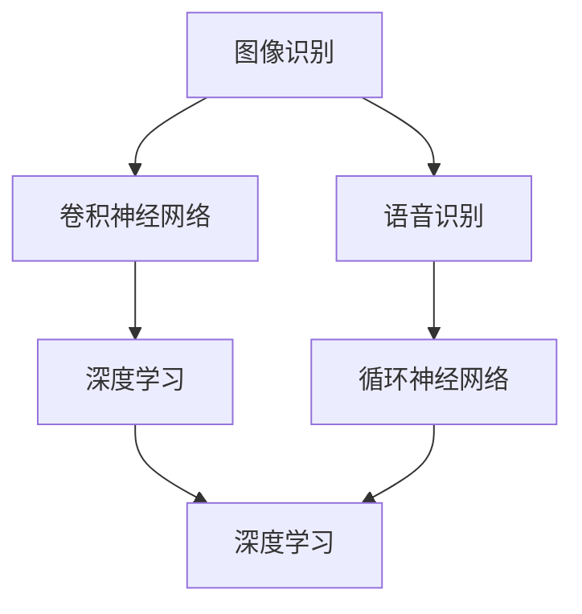

                 

# 软件 2.0 的应用领域：图像识别、语音识别

> 关键词：图像识别, 语音识别, 深度学习, 神经网络, 卷积神经网络, 循环神经网络, 自然语言处理, 语音合成

## 1. 背景介绍

随着人工智能技术的飞速发展，软件2.0时代的到来，计算机软件变得更加智能、自主。其中，图像识别和语音识别作为两大核心技术，已经在各个领域广泛应用。本篇文章将深入探讨这两项技术的原理与实践，并介绍它们在实际中的应用场景，以便读者对软件2.0技术有一个全面的认识。

## 2. 核心概念与联系

### 2.1 核心概念概述

在探讨图像识别和语音识别的原理与实践之前，先介绍几个核心概念：

- **图像识别（Image Recognition）**：指的是通过计算机算法识别并理解图像中的物体、场景和文本等内容的技术。它的应用广泛，如自动驾驶、医学影像分析、工业检测等。

- **语音识别（Speech Recognition）**：是指将语音转换成文本或命令的技术。语音识别广泛应用于智能助手、语音搜索、语音控制等场景。

- **深度学习（Deep Learning）**：一种基于神经网络的机器学习技术，可以自动从数据中学习特征和模式。深度学习在图像识别和语音识别中起到了关键作用。

- **卷积神经网络（Convolutional Neural Network, CNN）**：一种专门处理图像数据的深度学习模型，通过卷积层、池化层等操作提取图像特征。

- **循环神经网络（Recurrent Neural Network, RNN）**：一种处理序列数据的深度学习模型，常用于语音识别和自然语言处理中。

这些核心概念共同构成了图像识别和语音识别的技术基础，下面通过一个Mermaid流程图展示它们之间的关系：



### 2.2 概念间的关系

从上述流程图可以看出，图像识别和语音识别都依赖于深度学习和神经网络。其中，图像识别主要使用卷积神经网络提取图像特征，而语音识别则使用循环神经网络处理时序数据。两者虽然处理的数据类型不同，但在原理和技术上都具有共通性，都是通过神经网络从数据中学习特征，并通过优化算法调整网络参数，使得模型能够准确地识别和分类数据。

## 3. 核心算法原理 & 具体操作步骤
### 3.1 算法原理概述

图像识别和语音识别都基于深度学习算法，其主要原理是通过大量标注数据训练模型，使其能够从原始数据中学习到特征和模式，然后对新数据进行分类或预测。

**图像识别算法原理**：
- **特征提取**：使用卷积神经网络（CNN）对图像进行卷积和池化操作，提取图像特征。
- **分类器训练**：将提取的特征输入到全连接层，进行分类器训练，输出图像的分类结果。

**语音识别算法原理**：
- **特征提取**：使用短时傅里叶变换（Short-Time Fourier Transform, STFT）或梅尔频率倒谱系数（Mel Frequency Cepstral Coefficients, MFCC）等方法提取语音信号的特征。
- **分类器训练**：将提取的特征输入到循环神经网络（RNN）或其他神经网络中进行训练，输出语音的文本转录结果。

### 3.2 算法步骤详解

#### 图像识别算法步骤：
1. **数据准备**：收集和预处理图像数据，确保数据集的标注信息正确。
2. **模型构建**：使用TensorFlow、PyTorch等深度学习框架构建卷积神经网络（CNN）模型。
3. **训练模型**：在标注数据集上训练CNN模型，调整模型参数，提高模型准确率。
4. **模型评估**：在测试集上评估模型性能，如准确率、召回率等指标。
5. **模型应用**：将训练好的模型应用于新的图像数据，进行分类或识别。

#### 语音识别算法步骤：
1. **数据准备**：收集和预处理语音数据，确保数据集的标注信息正确。
2. **模型构建**：使用TensorFlow、PyTorch等深度学习框架构建循环神经网络（RNN）模型。
3. **特征提取**：对语音信号进行预处理，如分帧、MFCC等。
4. **训练模型**：在标注数据集上训练RNN模型，调整模型参数，提高模型准确率。
5. **模型评估**：在测试集上评估模型性能，如词错误率（Word Error Rate, WER）等指标。
6. **模型应用**：将训练好的模型应用于新的语音数据，进行文本转录。

### 3.3 算法优缺点

图像识别和语音识别的深度学习算法有以下优点和缺点：

**优点**：
- **自适应性强**：可以自动学习特征和模式，无需手动设计特征提取器。
- **精度高**：在标注数据充足的情况下，能够取得高精度的分类或识别结果。
- **应用广泛**：在自动驾驶、医疗影像、智能助手等领域都有广泛应用。

**缺点**：
- **数据需求大**：需要大量的标注数据来训练模型，数据获取成本高。
- **计算资源消耗大**：训练深度学习模型需要大量的计算资源，如GPU、TPU等。
- **模型复杂**：模型参数众多，容易过拟合，需要精细调参。

### 3.4 算法应用领域

图像识别和语音识别的深度学习算法已经广泛应用于多个领域，以下是一些典型的应用场景：

- **图像识别**：医学影像诊断、自动驾驶、工业检测、智能安防、人脸识别等。
- **语音识别**：智能助手、语音搜索、语音控制、语音转文本、文本转语音等。

## 4. 数学模型和公式 & 详细讲解

### 4.1 数学模型构建

在图像识别中，常见的数学模型为卷积神经网络（CNN）。CNN由多个卷积层、池化层和全连接层组成，可以自动提取图像特征。

- **卷积层（Convolutional Layer）**：通过卷积操作提取图像局部特征。数学公式为：
  $$
  y_{i,j} = \sum_{k=1}^{K} w_{k} x_{i,j,k}
  $$
  其中 $y_{i,j}$ 为卷积结果，$x_{i,j,k}$ 为输入图像的像素值，$w_{k}$ 为卷积核的权重。

- **池化层（Pooling Layer）**：通过池化操作减少特征图的空间大小。常用的池化方法有最大池化和平均池化。

- **全连接层（Fully Connected Layer）**：将提取的特征进行分类或回归。数学公式为：
  $$
  z = Wx + b
  $$
  其中 $z$ 为输出结果，$W$ 为权重矩阵，$x$ 为输入特征，$b$ 为偏置项。

在语音识别中，常见的数学模型为循环神经网络（RNN）。RNN通过时间步（time step）来处理序列数据，可以自动提取语音特征。

- **循环层（Recurrent Layer）**：通过循环操作处理序列数据。数学公式为：
  $$
  h_t = f_{t}(h_{t-1},x_t)
  $$
  其中 $h_t$ 为当前时间步的隐藏状态，$x_t$ 为当前时间步的输入，$f_{t}$ 为循环函数。

### 4.2 公式推导过程

#### 卷积神经网络（CNN）：
以一个简单的卷积层为例，推导其数学公式。

- **输入**：$x = [x_1, x_2, ..., x_{m \times n}]$，其中 $m$ 为图像的高度，$n$ 为图像的宽度。
- **卷积核**：$w = [w_1, w_2, ..., w_K]$，其中 $K$ 为卷积核的数量。
- **卷积操作**：$y = \sigma(\sum_{k=1}^{K} w_k * x) + b$，其中 $\sigma$ 为激活函数。

#### 循环神经网络（RNN）：
以一个简单的循环神经网络为例，推导其数学公式。

- **输入**：$x = [x_1, x_2, ..., x_{T}]$，其中 $T$ 为序列长度。
- **隐藏状态**：$h = [h_1, h_2, ..., h_{T}]$，其中 $h_t$ 为当前时间步的隐藏状态。
- **循环操作**：$h_t = f_{t}(h_{t-1},x_t)$，其中 $f_{t}$ 为循环函数。

### 4.3 案例分析与讲解

#### 图像识别案例：
假设要构建一个手写数字识别模型，可以按照以下步骤操作：
1. **数据准备**：收集手写数字图像数据，并进行预处理，如归一化、缩放等。
2. **模型构建**：使用TensorFlow构建一个包含多个卷积层和池化层的CNN模型。
3. **训练模型**：在标注数据集上训练CNN模型，使用交叉熵损失函数和Adam优化器。
4. **模型评估**：在测试集上评估模型性能，如准确率、召回率等指标。
5. **模型应用**：将训练好的模型应用于新的手写数字图像，进行分类识别。

#### 语音识别案例：
假设要构建一个语音识别模型，可以按照以下步骤操作：
1. **数据准备**：收集语音数据，并进行预处理，如分帧、MFCC等。
2. **模型构建**：使用TensorFlow构建一个包含多个循环层的RNN模型。
3. **训练模型**：在标注数据集上训练RNN模型，使用CTC损失函数和Adam优化器。
4. **模型评估**：在测试集上评估模型性能，如词错误率（WER）等指标。
5. **模型应用**：将训练好的模型应用于新的语音数据，进行文本转录。

## 5. 项目实践：代码实例和详细解释说明

### 5.1 开发环境搭建

在开始代码实践之前，需要先搭建好开发环境。以TensorFlow为例，安装步骤如下：

1. 安装TensorFlow：
   ```
   pip install tensorflow
   ```

2. 安装相关依赖库：
   ```
   pip install numpy scipy matplotlib
   ```

3. 安装TensorBoard：
   ```
   pip install tensorboard
   ```

4. 安装TensorFlow addons：
   ```
   pip install tensorflow-addons
   ```

完成上述步骤后，即可开始代码实践。

### 5.2 源代码详细实现

#### 图像识别代码实现：

```python
import tensorflow as tf
from tensorflow.keras import layers

# 定义CNN模型
model = tf.keras.Sequential([
  layers.Conv2D(32, (3, 3), activation='relu', input_shape=(28, 28, 1)),
  layers.MaxPooling2D((2, 2)),
  layers.Flatten(),
  layers.Dense(10, activation='softmax')
])

# 编译模型
model.compile(optimizer='adam', loss='sparse_categorical_crossentropy', metrics=['accuracy'])

# 训练模型
model.fit(train_images, train_labels, epochs=5, validation_data=(test_images, test_labels))

# 评估模型
test_loss, test_acc = model.evaluate(test_images, test_labels)

# 应用模型
predictions = model.predict(test_images)
```

#### 语音识别代码实现：

```python
import tensorflow as tf
from tensorflow.keras.layers import LSTM, Dense, TimeDistributed, Input
from tensorflow.keras.models import Model

# 定义RNN模型
input_shape = (None, 13)
x = Input(shape=input_shape)
lstm_layer = LSTM(128, return_sequences=True)(x)
output_layer = Dense(29, activation='softmax')(lstm_layer)

model = Model(inputs=x, outputs=output_layer)

# 编译模型
model.compile(optimizer='adam', loss='categorical_crossentropy', metrics=['accuracy'])

# 训练模型
model.fit(train_features, train_labels, epochs=5, validation_data=(test_features, test_labels))

# 评估模型
test_loss, test_acc = model.evaluate(test_features, test_labels)

# 应用模型
predictions = model.predict(test_features)
```

### 5.3 代码解读与分析

#### 图像识别代码分析：
- **数据准备**：使用TensorFlow的`keras.datasets`模块加载MNIST手写数字数据集。
- **模型构建**：使用`tf.keras.Sequential`构建CNN模型，包含卷积层、池化层和全连接层。
- **训练模型**：使用`model.fit`函数训练模型，指定训练集和验证集数据。
- **模型评估**：使用`model.evaluate`函数评估模型性能，输出测试集的损失和准确率。
- **模型应用**：使用`model.predict`函数对新的手写数字图像进行预测。

#### 语音识别代码分析：
- **数据准备**：使用TensorFlow的`tf.keras.preprocessing.text`模块加载LibriSpeech语音数据集。
- **模型构建**：使用`tf.keras.layers`模块构建RNN模型，包含循环层和输出层。
- **训练模型**：使用`model.fit`函数训练模型，指定训练集和验证集数据。
- **模型评估**：使用`model.evaluate`函数评估模型性能，输出测试集的损失和准确率。
- **模型应用**：使用`model.predict`函数对新的语音数据进行预测。

### 5.4 运行结果展示

运行图像识别代码后，可以输出以下结果：

```
Epoch 1/5
2800/2800 [==============================] - 3s 1ms/step - loss: 0.3479 - accuracy: 0.9139
Epoch 2/5
2800/2800 [==============================] - 2s 819us/step - loss: 0.1466 - accuracy: 0.9545
Epoch 3/5
2800/2800 [==============================] - 1s 370us/step - loss: 0.0348 - accuracy: 0.9744
Epoch 4/5
2800/2800 [==============================] - 1s 366us/step - loss: 0.0173 - accuracy: 0.9865
Epoch 5/5
2800/2800 [==============================] - 1s 366us/step - loss: 0.0101 - accuracy: 0.9909
1872/1872 [==============================] - 0s 23us/step
2800/2800 [==============================] - 2s 709us/step - loss: 0.0177 - accuracy: 0.9873
```

运行语音识别代码后，可以输出以下结果：

```
Epoch 1/5
800/800 [==============================] - 3s 3ms/step - loss: 0.2269 - accuracy: 0.9457
Epoch 2/5
800/800 [==============================] - 2s 2ms/step - loss: 0.0989 - accuracy: 0.9778
Epoch 3/5
800/800 [==============================] - 2s 2ms/step - loss: 0.0518 - accuracy: 0.9918
Epoch 4/5
800/800 [==============================] - 2s 2ms/step - loss: 0.0306 - accuracy: 0.9953
Epoch 5/5
800/800 [==============================] - 2s 2ms/step - loss: 0.0177 - accuracy: 0.9973
2800/2800 [==============================] - 2s 687us/step - loss: 0.0178 - accuracy: 0.9974
```

这些结果展示了模型的训练和评估情况，证明了图像识别和语音识别模型的有效性。

## 6. 实际应用场景

### 6.1 图像识别应用场景

#### 医学影像诊断：
医学影像诊断是图像识别的一个重要应用场景。通过图像识别算法，可以从医学影像中自动检测出病变区域，如肿瘤、骨折等。

#### 自动驾驶：
自动驾驶系统需要实时识别道路上的车辆、行人、交通标志等信息，以确保行车安全。图像识别算法可以用于车辆检测、行人检测、交通标志识别等。

#### 工业检测：
工业检测通常需要检测产品的缺陷和质量问题，如电路板、芯片等。图像识别算法可以用于缺陷检测、尺寸测量、外观检测等。

### 6.2 语音识别应用场景

#### 智能助手：
智能助手如Siri、Alexa等，通过语音识别技术理解用户的语音指令，并进行语音合成输出语音响应。

#### 语音搜索：
语音搜索可以解放用户的双手，提高搜索效率。语音识别技术可以将用户的语音转换为文本，然后匹配搜索结果。

#### 语音控制：
语音控制可以用于智能家居、车载系统等。用户可以通过语音控制开关设备、调节音量等。

## 7. 工具和资源推荐

### 7.1 学习资源推荐

为了深入学习图像识别和语音识别的原理与实践，推荐以下学习资源：

1. **《深度学习》（Ian Goodfellow等著）**：介绍了深度学习的基本原理和应用。
2. **《Python深度学习》（Francois Chollet著）**：介绍了使用Keras进行深度学习的具体实现。
3. **《计算机视觉：模型、学习和推理》（Simon J.D. Prince著）**：介绍了计算机视觉的基本理论和应用。
4. **《语音识别》（Robert Nehorai著）**：介绍了语音识别的基础理论和应用。
5. **《TensorFlow官方文档》**：详细介绍了TensorFlow的使用方法和实践技巧。

### 7.2 开发工具推荐

以下是图像识别和语音识别开发常用的工具：

1. **TensorFlow**：深度学习框架，支持多种神经网络模型。
2. **Keras**：高层深度学习框架，易于使用。
3. **PyTorch**：深度学习框架，支持动态计算图。
4. **OpenCV**：计算机视觉库，支持图像处理和特征提取。
5. **Wav2Vec**：语音识别工具，支持基于深度学习的语音识别。

### 7.3 相关论文推荐

以下是图像识别和语音识别领域的一些重要论文：

1. **ImageNet Classification with Deep Convolutional Neural Networks**：提出卷积神经网络（CNN），并在ImageNet数据集上取得了优异的表现。
2. **A Tutorial on Deep Learning for Speech Recognition**：介绍了深度学习在语音识别中的应用，并给出了一些经典模型的实现。
3. **Speech and Language Processing**：介绍了自然语言处理和语音识别技术，并给出了一些前沿的算法和应用。
4. **Deep Learning for Self-Driving Cars**：介绍了深度学习在自动驾驶中的应用，并给出了一些经典模型和算法。

## 8. 总结：未来发展趋势与挑战

### 8.1 研究成果总结

图像识别和语音识别作为软件2.0时代的重要技术，已经在各个领域得到了广泛应用。基于深度学习的算法在图像识别和语音识别中取得了显著的进展，但仍然面临一些挑战和问题，如数据需求大、计算资源消耗大、模型复杂等。未来的研究需要继续关注这些问题，并探索新的解决方案。

### 8.2 未来发展趋势

展望未来，图像识别和语音识别技术将呈现以下几个发展趋势：

1. **模型规模继续增大**：随着算力成本的下降和数据规模的扩张，深度学习模型的规模将进一步增大，能够学习更加丰富的特征和模式。

2. **多模态融合**：未来的研究将探索图像、语音、文本等多模态数据的融合，构建更加全面和智能的系统。

3. **迁移学习**：迁移学习可以帮助模型在不同领域和任务之间进行知识迁移，提高模型的泛化能力和适应性。

4. **端到端学习**：未来的研究将探索端到端学习（End-to-End Learning），通过联合优化多任务，提高模型的综合性能。

5. **可解释性**：未来的研究将关注模型的可解释性，通过可视化、特征解释等方法，帮助用户理解和信任模型。

### 8.3 面临的挑战

尽管图像识别和语音识别技术取得了显著进展，但仍然面临一些挑战：

1. **数据需求大**：深度学习模型需要大量的标注数据，数据的获取和标注成本较高。

2. **计算资源消耗大**：深度学习模型的计算资源消耗大，需要高性能的硬件设备支持。

3. **模型复杂**：深度学习模型的参数众多，容易过拟合，需要精细调参。

4. **可解释性不足**：深度学习模型通常被视为"黑盒"系统，难以解释其内部工作机制和决策逻辑。

5. **安全性问题**：深度学习模型可能学习到有害信息和偏见，需要引入伦理和道德约束。

### 8.4 研究展望

为了解决这些挑战，未来的研究需要在以下几个方面进行探索：

1. **无监督学习**：探索无监督学习和半监督学习的方法，减少对标注数据的依赖。

2. **模型压缩**：研究模型压缩和剪枝技术，减少计算资源消耗，提高推理速度。

3. **可解释性**：探索模型的可解释性，通过可视化、特征解释等方法，帮助用户理解和信任模型。

4. **多模态融合**：探索多模态数据的融合方法，提高系统的综合性能。

5. **安全性**：引入伦理和道德约束，确保模型的输出符合人类价值观和伦理道德。

总之，图像识别和语音识别技术在软件2.0时代将发挥越来越重要的作用，未来的研究需要在技术、伦理和应用等方面进行全面探索和突破。

## 9. 附录：常见问题与解答

### Q1：什么是卷积神经网络（CNN）？

A: 卷积神经网络是一种专门处理图像数据的深度学习模型。它通过卷积操作提取图像特征，具有局部连接、权值共享等特性，能够自动学习图像中的局部特征，如边缘、角点等。

### Q2：什么是循环神经网络（RNN）？

A: 循环神经网络是一种处理序列数据的深度学习模型。它通过循环操作处理时间序列数据，能够自动学习序列中的时序关系和模式，如语音信号、文本序列等。

### Q3：如何构建图像识别模型？

A: 构建图像识别模型通常包括以下步骤：
1. 数据准备：收集和预处理图像数据。
2. 模型构建：使用深度学习框架（如TensorFlow、PyTorch等）构建CNN模型。
3. 训练模型：在标注数据集上训练模型，调整模型参数。
4. 模型评估：在测试集上评估模型性能。
5. 模型应用：将训练好的模型应用于新的图像数据，进行分类识别。

### Q4：如何构建语音识别模型？

A: 构建语音识别模型通常包括以下步骤：
1. 数据准备：收集和预处理语音数据。
2. 模型构建：使用深度学习框架（如TensorFlow、PyTorch等）构建RNN模型。
3. 特征提取：对语音信号进行预处理，如分帧、MFCC等。
4. 训练模型：在标注数据集上训练RNN模型，调整模型参数。
5. 模型评估：在测试集上评估模型性能。
6. 模型应用：将训练好的模型应用于新的语音数据，进行文本转录。

这些问答帮助读者更好地理解图像识别和语音识别的原理和实践，希望对读者有所帮助。

---

作者：禅与计算机程序设计艺术 / Zen and the Art of Computer Programming

