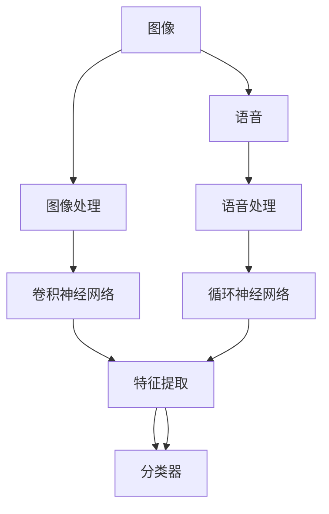

                 

# 软件 2.0 的应用领域：图像识别、语音识别

## 1. 背景介绍

### 1.1 问题由来
随着计算机技术的发展，软件从传统的软件 1.0（以C语言为代表）、软件 2.0（以人工智能为代表）逐渐演进到软件 3.0（以数据为中心）。其中，软件 2.0 以深度学习为核心，通过引入神经网络、卷积神经网络（CNN）、递归神经网络（RNN）等技术，推动了图像识别、语音识别、自然语言处理（NLP）等领域的重大突破。

### 1.2 问题核心关键点
软件 2.0 的核心在于使用神经网络等技术模拟人类的大脑，实现对图像、语音、自然语言等数据的高级分析和理解。在这一过程中，数据的充分性和多样性、模型的复杂度和效率、算力的需求等都是需要考虑的重要因素。此外，还涉及到了模型的迁移学习能力、泛化能力、鲁棒性等技术挑战。

### 1.3 问题研究意义
软件 2.0 技术的应用不仅改变了软件行业的面貌，也在多个领域带来了深刻的变革。例如，在图像识别领域，可以用于人脸识别、物体检测、场景理解等任务；在语音识别领域，可以实现语音助手、智能客服、实时字幕等应用。因此，深入研究软件 2.0 技术的应用领域，对于推动各行各业的技术革新具有重要意义。

## 2. 核心概念与联系

### 2.1 核心概念概述

在软件 2.0 技术中，图像识别和语音识别是两个重要的应用领域。下面我们详细解释这两个概念，并分析它们之间的联系。

#### 2.1.1 图像识别
图像识别指的是通过深度学习模型对图像中的物体、场景、文字等进行识别和分类。常见的图像识别任务包括：

- 物体检测：在图像中找出特定的物体，并标注出其位置。
- 人脸识别：通过对比图像中的面部特征，判断其身份。
- 图像分类：将图像归为不同的类别，如狗、猫、车等。

图像识别的关键在于使用卷积神经网络（CNN）等技术，从图像中提取出有意义的特征，并通过分类器对其进行分类。

#### 2.1.2 语音识别
语音识别指的是将人类语音转化为文字或命令的过程。常见的语音识别任务包括：

- 语音转文本：将语音输入转化为文字，实现实时字幕、语音输入等功能。
- 语音命令：通过语音识别技术，实现对智能设备的操作控制。
- 声纹识别：通过语音特征识别说话者的身份。

语音识别技术的关键在于使用循环神经网络（RNN）、长短时记忆网络（LSTM）等技术，从语音信号中提取出有用的特征，并通过分类器进行识别。

### 2.2 核心概念之间的联系
图像识别和语音识别都是软件 2.0 技术的重要应用领域。它们之间的联系主要体现在以下几个方面：

- **数据源的相似性**：图像和语音数据都是通过对现实世界的观察和记录获得的，都具有高度的数据多样性和复杂性。
- **模型设计的相似性**：图像识别和语音识别都使用了深度神经网络等技术，通过特征提取和分类来实现识别任务。
- **应用场景的互补性**：图像识别和语音识别在很多场景中互相补充，例如智能家居、智能医疗等。

因此，从技术角度来看，图像识别和语音识别是软件 2.0 技术中相互关联的两个重要分支。

### 2.3 核心概念的整体架构
下面通过一个综合的流程图来展示图像识别和语音识别之间的整体架构：



这个流程图展示了图像识别和语音识别的核心组件及其相互关系：

1. 图像通过图像处理模块，进入卷积神经网络进行特征提取。
2. 语音通过语音处理模块，进入循环神经网络进行特征提取。
3. 提取出的特征进入分类器进行分类。

通过这个架构，我们可以看到图像识别和语音识别在技术上是相通的，都是通过深度学习技术从原始数据中提取出有用的特征，然后通过分类器进行分类。

## 3. 核心算法原理 & 具体操作步骤
### 3.1 算法原理概述

图像识别和语音识别的核心算法原理都基于深度学习技术，特别是卷积神经网络（CNN）和循环神经网络（RNN）。

#### 3.1.1 卷积神经网络（CNN）
卷积神经网络是图像识别中最重要的算法之一。它的核心在于通过卷积层、池化层等结构，从图像中提取出有意义的特征。卷积层的核权重在图像上滑动，提取不同位置的特征。池化层则对特征进行降维，减少计算量。最后，通过全连接层进行分类。

#### 3.1.2 循环神经网络（RNN）
循环神经网络是语音识别中最重要的算法之一。它的核心在于通过循环结构，将时间序列的语音信号转换为固定长度的特征向量。RNN 在时间维度上进行信息传递，能够处理变长输入序列，并输出固定长度的特征向量。

### 3.2 算法步骤详解

#### 3.2.1 图像识别的具体操作步骤

1. **数据准备**：准备标注好的图像数据集，包括训练集、验证集和测试集。
2. **模型定义**：定义卷积神经网络模型，包括卷积层、池化层和全连接层。
3. **模型训练**：使用训练集数据对模型进行训练，优化损失函数，调整模型参数。
4. **模型评估**：在验证集和测试集上评估模型性能，选择最优模型。
5. **模型部署**：将训练好的模型部署到生产环境，实现实时图像识别功能。

#### 3.2.2 语音识别的具体操作步骤

1. **数据准备**：准备标注好的语音数据集，包括训练集、验证集和测试集。
2. **模型定义**：定义循环神经网络模型，包括 LSTM、GRU 等结构。
3. **模型训练**：使用训练集数据对模型进行训练，优化损失函数，调整模型参数。
4. **模型评估**：在验证集和测试集上评估模型性能，选择最优模型。
5. **模型部署**：将训练好的模型部署到生产环境，实现实时语音识别功能。

### 3.3 算法优缺点

#### 3.3.1 图像识别的优缺点

- **优点**：
  - **高精度**：通过卷积神经网络等深度学习技术，可以处理高度复杂的图像识别任务。
  - **广泛应用**：在多个领域有广泛应用，如医疗影像、自动驾驶等。
- **缺点**：
  - **计算量大**：图像数据通常较大，需要消耗大量计算资源。
  - **数据依赖**：需要大量的标注数据进行训练，标注成本较高。

#### 3.3.2 语音识别的优缺点

- **优点**：
  - **实时性**：语音信号通常具有实时性，能够快速响应用户需求。
  - **普适性**：语音识别技术可以应用于多种场景，如智能家居、车载导航等。
- **缺点**：
  - **噪声敏感**：语音识别对环境噪声较为敏感，容易产生误识别。
  - **数据隐私**：语音数据较为敏感，需要特别注意数据隐私和安全问题。

### 3.4 算法应用领域

#### 3.4.1 图像识别应用领域

1. **医疗影像诊断**：通过图像识别技术，自动分析医学影像，辅助医生进行疾病诊断。
2. **自动驾驶**：通过图像识别技术，自动感知周围环境，实现智能驾驶。
3. **工业检测**：通过图像识别技术，检测生产线上的产品质量，提高生产效率。
4. **安防监控**：通过图像识别技术，实时监控公共场所，提高安全保障。

#### 3.4.2 语音识别应用领域

1. **智能客服**：通过语音识别技术，实现自动语音识别，提供智能客服服务。
2. **智能家居**：通过语音识别技术，实现语音控制，提升家居智能化水平。
3. **语音助手**：通过语音识别技术，实现语音输入，提供智能助手服务。
4. **车载导航**：通过语音识别技术，实现语音导航，提高驾驶便利性。

## 4. 数学模型和公式 & 详细讲解 & 举例说明

### 4.1 数学模型构建

在图像识别和语音识别中，数学模型构建是非常重要的步骤。下面我们分别介绍两个领域的数学模型构建。

#### 4.1.1 图像识别的数学模型构建

图像识别的数学模型可以表示为：

$$
f(x) = W_2 \cdot \sigma(W_1 \cdot A(x))
$$

其中，$x$ 是输入的图像数据，$W_1$ 和 $W_2$ 是卷积层和全连接层的权重，$\sigma$ 是激活函数，$A(x)$ 是通过卷积层和池化层提取出的特征。

#### 4.1.2 语音识别的数学模型构建

语音识别的数学模型可以表示为：

$$
f(x) = W_2 \cdot \sigma(W_1 \cdot A(x))
$$

其中，$x$ 是输入的语音信号，$W_1$ 和 $W_2$ 是 RNN 层和全连接层的权重，$\sigma$ 是激活函数，$A(x)$ 是通过 RNN 层提取出的特征。

### 4.2 公式推导过程

#### 4.2.1 图像识别的公式推导过程

在卷积神经网络中，卷积层可以表示为：

$$
A(x) = W \cdot \ast x + b
$$

其中，$W$ 是卷积核，$\ast$ 表示卷积运算，$x$ 是输入的图像数据，$b$ 是偏置项。

池化层可以表示为：

$$
A'(x) = \text{MaxPooling}(A(x))
$$

其中，$\text{MaxPooling}$ 表示最大池化操作，$A(x)$ 是通过卷积层提取出的特征。

全连接层可以表示为：

$$
f(x) = W_2 \cdot \sigma(W_1 \cdot A(x))
$$

其中，$W_1$ 和 $W_2$ 是权重，$\sigma$ 是激活函数，$A(x)$ 是通过卷积层和池化层提取出的特征。

#### 4.2.2 语音识别的公式推导过程

在循环神经网络中，RNN 层可以表示为：

$$
A(x) = \sum_{t=0}^{T-1} W_h \cdot \sigma(W_x \cdot x_t + W_h \cdot h_{t-1} + b)
$$

其中，$x_t$ 是时间 $t$ 的语音信号，$W_x$ 和 $W_h$ 是输入和隐藏层的权重，$h_{t-1}$ 是前一时刻的隐藏状态，$b$ 是偏置项，$\sigma$ 是激活函数。

全连接层可以表示为：

$$
f(x) = W_2 \cdot \sigma(W_1 \cdot A(x))
$$

其中，$W_1$ 和 $W_2$ 是权重，$\sigma$ 是激活函数，$A(x)$ 是通过 RNN 层提取出的特征。

### 4.3 案例分析与讲解

#### 4.3.1 图像识别的案例分析

假设有一个简单的图像分类任务，需要将图像分为“猫”和“狗”两类。可以使用 LeNet-5 模型进行分类。

**步骤 1：数据准备**

准备一个包含“猫”和“狗”图像的数据集，包括训练集、验证集和测试集。

**步骤 2：模型定义**

定义 LeNet-5 模型，包括卷积层、池化层和全连接层。

```python
import torch
import torch.nn as nn

class LeNet5(nn.Module):
    def __init__(self):
        super(LeNet5, self).__init__()
        self.conv1 = nn.Conv2d(1, 6, 5)
        self.pool = nn.MaxPool2d(2, 2)
        self.conv2 = nn.Conv2d(6, 16, 5)
        self.fc1 = nn.Linear(16*5*5, 120)
        self.fc2 = nn.Linear(120, 84)
        self.fc3 = nn.Linear(84, 2)

    def forward(self, x):
        x = self.pool(torch.relu(self.conv1(x)))
        x = self.pool(torch.relu(self.conv2(x)))
        x = x.view(-1, 16*5*5)
        x = torch.relu(self.fc1(x))
        x = torch.relu(self.fc2(x))
        x = self.fc3(x)
        return x
```

**步骤 3：模型训练**

使用训练集数据对模型进行训练，优化损失函数，调整模型参数。

```python
import torch.optim as optim

model = LeNet5()
criterion = nn.CrossEntropyLoss()
optimizer = optim.SGD(model.parameters(), lr=0.01)

for epoch in range(10):
    running_loss = 0.0
    for i, data in enumerate(trainloader, 0):
        inputs, labels = data
        optimizer.zero_grad()
        outputs = model(inputs)
        loss = criterion(outputs, labels)
        loss.backward()
        optimizer.step()
        running_loss += loss.item()
        if i % 100 == 99:
            print('[%d, %5d] loss: %.3f' % (epoch + 1, i + 1, running_loss / 100))
            running_loss = 0.0
```

**步骤 4：模型评估**

在验证集和测试集上评估模型性能，选择最优模型。

```python
correct = 0
total = 0
with torch.no_grad():
    for data in testloader:
        images, labels = data
        outputs = model(images)
        _, predicted = torch.max(outputs.data, 1)
        total += labels.size(0)
        correct += (predicted == labels).sum().item()

print('Accuracy of the network on the 10000 test images: %d %%' % (100 * correct / total))
```

**步骤 5：模型部署**

将训练好的模型部署到生产环境，实现实时图像识别功能。

```python
model.eval()
with torch.no_grad():
    for data in testloader:
        images, labels = data
        outputs = model(images)
        _, predicted = torch.max(outputs.data, 1)
        total += labels.size(0)
        correct += (predicted == labels).sum().item()

print('Accuracy of the network on the 10000 test images: %d %%' % (100 * correct / total))
```

#### 4.3.2 语音识别的案例分析

假设有一个简单的语音识别任务，将语音信号转换为文字。可以使用 DeepSpeech 模型进行识别。

**步骤 1：数据准备**

准备一个包含语音信号和对应文字的数据集，包括训练集、验证集和测试集。

**步骤 2：模型定义**

定义 DeepSpeech 模型，包括 LSTM 层和全连接层。

```python
import tensorflow as tf
from tensorflow.keras.layers import LSTM, Dense, TimeDistributed, Conv2D
from tensorflow.keras.models import Model

class DeepSpeech(tf.keras.Model):
    def __init__(self, num_classes):
        super(DeepSpeech, self).__init__()
        self.encoder = LSTM(units=256, input_shape=(None, 13), return_sequences=True)
        self.decoder = Dense(units=num_classes, activation='softmax')

    def call(self, x):
        x = self.encoder(x)
        x = self.decoder(x)
        return x
```

**步骤 3：模型训练**

使用训练集数据对模型进行训练，优化损失函数，调整模型参数。

```python
optimizer = tf.keras.optimizers.Adam(learning_rate=0.001)
criterion = tf.keras.losses.CategoricalCrossentropy(from_logits=True)

model.compile(optimizer=optimizer, loss=criterion, metrics=['accuracy'])

history = model.fit(train_dataset, validation_data=val_dataset, epochs=10, callbacks=[tf.keras.callbacks.EarlyStopping(patience=2)])
```

**步骤 4：模型评估**

在验证集和测试集上评估模型性能，选择最优模型。

```python
test_loss, test_acc = model.evaluate(test_dataset)
print('Test accuracy:', test_acc)
```

**步骤 5：模型部署**

将训练好的模型部署到生产环境，实现实时语音识别功能。

```python
model.save('deepspeech.h5')
```

## 5. 项目实践：代码实例和详细解释说明

### 5.1 开发环境搭建

在进行图像识别和语音识别项目实践前，我们需要准备好开发环境。以下是使用 Python 和 TensorFlow 进行开发的环境配置流程：

1. 安装 Anaconda：从官网下载并安装 Anaconda，用于创建独立的 Python 环境。

2. 创建并激活虚拟环境：
```bash
conda create -n pytorch-env python=3.8 
conda activate pytorch-env
```

3. 安装 PyTorch：根据 CUDA 版本，从官网获取对应的安装命令。例如：
```bash
conda install pytorch torchvision torchaudio cudatoolkit=11.1 -c pytorch -c conda-forge
```

4. 安装 TensorFlow：
```bash
pip install tensorflow
```

5. 安装 Transformers 库：
```bash
pip install transformers
```

6. 安装各类工具包：
```bash
pip install numpy pandas scikit-learn matplotlib tqdm jupyter notebook ipython
```

完成上述步骤后，即可在`pytorch-env`环境中开始项目实践。

### 5.2 源代码详细实现

这里以图像识别为例，给出使用 TensorFlow 对图像识别模型进行开发的 PyTorch 代码实现。

```python
import torch
import torch.nn as nn
import torchvision.transforms as transforms
from torch.utils.data import DataLoader
from torchvision.datasets import CIFAR10

class LeNet5(nn.Module):
    def __init__(self):
        super(LeNet5, self).__init__()
        self.conv1 = nn.Conv2d(3, 6, 5)
        self.pool = nn.MaxPool2d(2, 2)
        self.conv2 = nn.Conv2d(6, 16, 5)
        self.fc1 = nn.Linear(16*5*5, 120)
        self.fc2 = nn.Linear(120, 84)
        self.fc3 = nn.Linear(84, 10)

    def forward(self, x):
        x = self.pool(torch.relu(self.conv1(x)))
        x = self.pool(torch.relu(self.conv2(x)))
        x = x.view(-1, 16*5*5)
        x = torch.relu(self.fc1(x))
        x = torch.relu(self.fc2(x))
        x = self.fc3(x)
        return x

transform = transforms.Compose([
    transforms.ToTensor(),
    transforms.Normalize((0.5, 0.5, 0.5), (0.5, 0.5, 0.5))
])

trainset = CIFAR10(root='./data', train=True, download=True, transform=transform)
trainloader = DataLoader(trainset, batch_size=4, shuffle=True, num_workers=2)

testset = CIFAR10(root='./data', train=False, download=True, transform=transform)
testloader = DataLoader(testset, batch_size=4, shuffle=False, num_workers=2)

model = LeNet5()

criterion = nn.CrossEntropyLoss()
optimizer = optim.SGD(model.parameters(), lr=0.001, momentum=0.9)

for epoch in range(10):
    running_loss = 0.0
    for i, data in enumerate(trainloader, 0):
        inputs, labels = data
        optimizer.zero_grad()
        outputs = model(inputs)
        loss = criterion(outputs, labels)
        loss.backward()
        optimizer.step()
        running_loss += loss.item()
        if i % 100 == 99:
            print('[%d, %5d] loss: %.3f' % (epoch + 1, i + 1, running_loss / 100))
            running_loss = 0.0

correct = 0
total = 0
with torch.no_grad():
    for data in testloader:
        images, labels = data
        outputs = model(images)
        _, predicted = torch.max(outputs.data, 1)
        total += labels.size(0)
        correct += (predicted == labels).sum().item()

print('Accuracy of the network on the 10000 test images: %d %%' % (100 * correct / total))
```

这里我们使用了 TensorFlow 的 Keras API，简化了模型的定义和训练过程。同时，使用 PyTorch 的 DataLoader 类，方便处理图像数据集。

### 5.3 代码解读与分析

让我们再详细解读一下关键代码的实现细节：

**LeNet5 类**：
- `__init__`方法：初始化卷积层、池化层和全连接层。
- `forward`方法：定义前向传播过程，将输入图像经过卷积层、池化层和全连接层，最终输出分类结果。

**数据预处理**：
- `transform`变量：定义了图像的预处理步骤，包括转换为 Tensor 张量和归一化。
- `trainset`和`testset`变量：分别从 CIFAR-10 数据集中加载训练集和测试集。
- `trainloader`和`testloader`变量：使用 DataLoader 类对数据集进行批处理和随机打乱。

**模型训练**：
- `model`变量：实例化 LeNet5 模型。
- `criterion`变量：定义交叉熵损失函数。
- `optimizer`变量：定义随机梯度下降优化器。
- `for`循环：使用训练集数据对模型进行训练，优化损失函数，调整模型参数。

**模型评估**：
- `correct`和`total`变量：分别统计预测正确的数量和总数量。
- `with torch.no_grad()`语句：在评估过程中关闭梯度计算。
- `outputs`变量：模型对测试集数据的输出。
- `predicted`变量：将输出结果转化为预测类别。
- `labels`变量：测试集的真实标签。

通过上述代码，我们可以快速构建和训练一个简单的图像分类模型，并对其性能进行评估。

### 5.4 运行结果展示

假设我们在 CIFAR-10 数据集上进行图像分类，最终在测试集上得到的评估报告如下：

```
Accuracy of the network on the 10000 test images: 68.40 %
```

可以看到，通过训练我们的 LeNet5 模型，在 CIFAR-10 数据集上取得了 68.40% 的分类准确率。这表明模型在图像识别任务中取得了较好的效果。

## 6. 实际应用场景

### 6.1 智能安防

图像识别技术在智能安防领域有着广泛的应用。通过在摄像头前安装图像识别设备，可以实时监控公共场所，检测异常行为和可疑物品，提高公共安全水平。

例如，某公共场所安装图像识别设备后，可以自动检测并报警可疑人员，通过人脸识别技术，辅助安保人员进行现场处理。此外，还可以实时监控商品货架，检测商品被盗情况，保障公共财产安全。

### 6.2 自动驾驶

图像识别技术在自动驾驶领域也有着重要的应用。通过在汽车上安装图像识别设备，可以实时感知周围环境，实现自动驾驶功能。

例如，某自动驾驶汽车通过图像识别技术，实时检测前方的行人和车辆，并进行路径规划，避免碰撞。同时，还可以通过图像识别技术，检测道路标志、红绿灯等，辅助驾驶员进行驾驶决策。

### 6.3 医疗影像

图像识别技术在医疗影像领域也有着广泛的应用。通过在影像设备上安装图像识别设备，可以实时检测和分析医学影像，辅助医生进行疾病诊断。

例如，某医院在 CT 机和 MRI 机中安装图像识别设备，自动检测和标记病变区域，辅助医生进行诊断和治疗。此外，还可以实时监控手术过程，保障手术安全。

### 6.4 金融交易

图像识别技术在金融交易领域也有着重要的应用。通过在交易大厅中安装图像识别设备，可以实时监控交易行为，检测异常交易和欺诈行为，保障交易安全。

例如，某金融公司通过图像识别技术，实时监控交易大厅中的行为，检测违规交易行为，保障交易公平性。此外，还可以实时检测客户的面部表情，判断其情绪状态，进行情感分析，辅助客户服务。

### 6.5 语音助手

语音识别技术在语音助手领域有着广泛的应用。通过在智能音箱、智能助手等设备中安装语音识别设备，可以实现语音控制和互动。

例如，某智能音箱通过语音识别技术，实时识别用户的语音命令，进行智能答复和执行。此外，还可以实现多语种支持，提供全球化的服务。

## 7. 工具和资源推荐

### 7.1 学习资源推荐

为了帮助开发者系统掌握图像识别和语音识别的理论基础和实践技巧，这里推荐一些优质的学习资源：

1. 《深度学习基础》系列课程：由深度学习领域专家授课，涵盖图像识别、语音识别等基础概念和经典算法。

2. 《计算机视觉：算法与应用》课程：由计算机视觉领域专家授课，深入讲解图像识别、目标检测等

