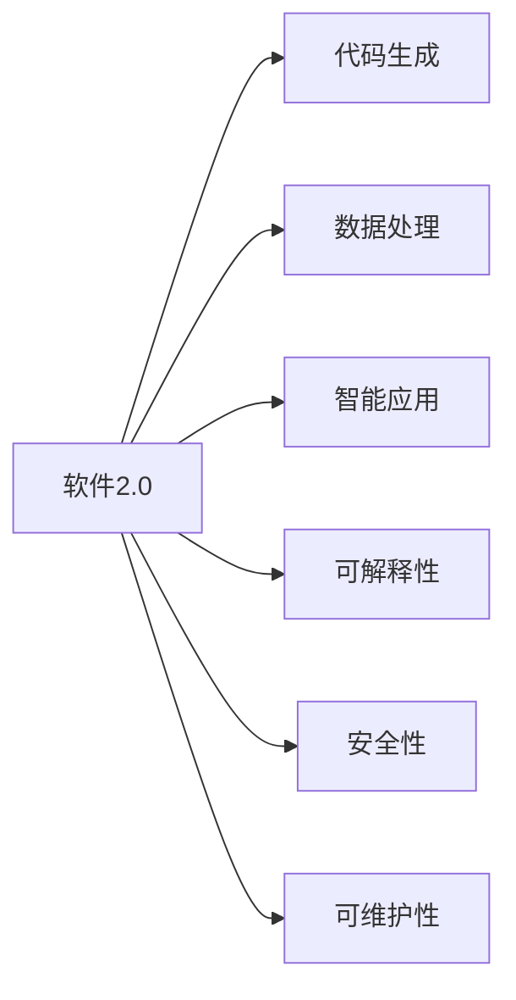
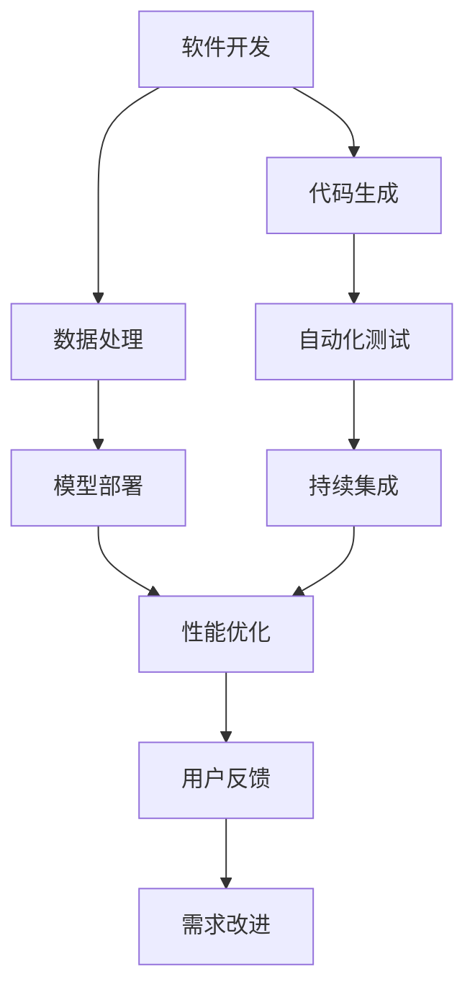
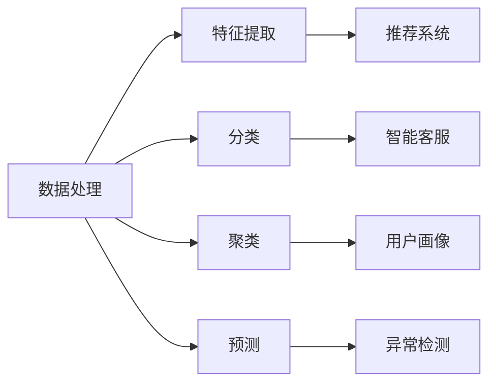
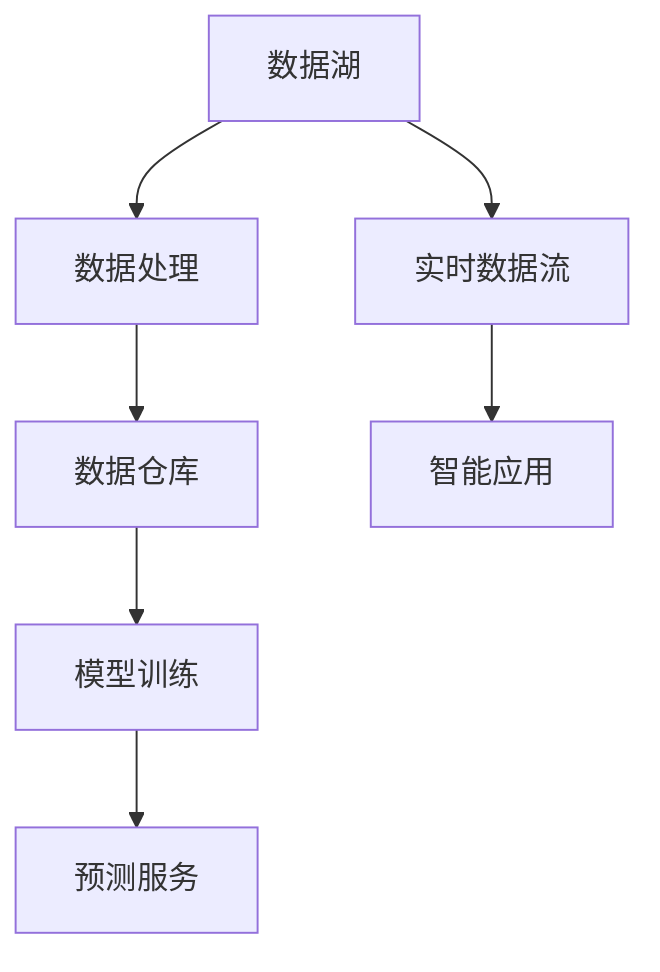
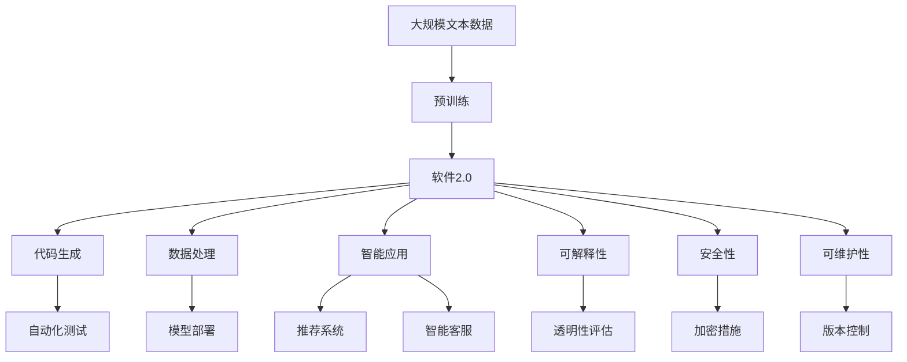

                 

# 软件 2.0 的应用：从实验室走向现实

## 1. 背景介绍

### 1.1 问题由来
随着人工智能(AI)技术的迅猛发展，AI已逐步从实验室走向现实，从科技前沿转变为社会生产力的重要组成部分。其中，软件2.0（Software 2.0）作为AI技术的重要分支，凭借其强大的自动化能力和智能推理能力，在各行各业得到广泛应用。

软件2.0以其在代码生成、数据处理、应用开发等领域的卓越表现，为行业带来了前所未有的效率提升和创新突破。然而，软件2.0的广泛应用也引发了一系列挑战，如模型的可解释性、安全性、可维护性等问题，需要学术界和产业界共同应对。

### 1.2 问题核心关键点
软件2.0的核心关键点在于如何利用机器学习等AI技术，自动化地生成高质量的代码，进行复杂的数据分析和处理，以及构建智能应用系统。这些关键技术的实现，依赖于对海量数据的学习和理解，以及对任务目标的抽象和建模。

软件2.0的应用领域广泛，包括但不限于软件开发、数据挖掘、自然语言处理、机器学习、图像识别等。通过自动化、智能化的技术手段，软件2.0使得这些领域的工作效率大幅提升，创新能力大幅增强。

### 1.3 问题研究意义
研究软件2.0的应用，对于推动AI技术在各个行业的落地，提升生产效率，加速创新进程，具有重要意义：

1. **降低开发成本**：通过自动生成代码和模型，减少手动开发的工作量，节省时间和人力成本。
2. **提升开发效率**：软件2.0能快速迭代开发，缩短项目周期，提高产品上市速度。
3. **增强创新能力**：通过智能分析和处理，挖掘数据潜力，激发新算法、新应用的诞生。
4. **改善用户体验**：通过智能推荐、智能搜索等功能，提升用户交互体验，满足个性化需求。

## 2. 核心概念与联系

### 2.1 核心概念概述

为更好地理解软件2.0的应用，本节将介绍几个密切相关的核心概念：

- **软件2.0 (Software 2.0)**：以深度学习、机器学习等AI技术为基础，通过自动化和智能化手段生成、优化和部署软件系统的技术。

- **代码生成 (Code Generation)**：使用机器学习模型自动生成高质量的代码，包括但不限于程序、脚本、API接口等。

- **数据处理 (Data Processing)**：通过AI模型对海量数据进行自动分析和处理，包括特征提取、分类、聚类、预测等。

- **智能应用 (Intelligent Application)**：利用AI技术构建的自动化、智能化的应用系统，如推荐系统、智能客服、智能搜索等。

- **可解释性 (Explainability)**：指软件2.0模型的决策过程是否透明、可理解，以便于审查和改进。

- **安全性 (Security)**：指软件2.0模型在使用过程中的数据安全、模型安全和系统安全。

- **可维护性 (Maintainability)**：指软件2.0模型的长期稳定性和易维护性，以便于后期调整和优化。

这些核心概念之间的逻辑关系可以通过以下Mermaid流程图来展示：



这个流程图展示了大语言模型微调过程中各个核心概念的关系和作用：

1. 软件2.0包含代码生成、数据处理和智能应用等多个环节，依赖于可解释性、安全性和可维护性等特性。
2. 代码生成和数据处理是软件2.0的基础，智能应用是软件2.0的高级形态。
3. 可解释性、安全性和可维护性是软件2.0的重要保障，确保其在实际应用中的可靠性和稳定性。

### 2.2 概念间的关系

这些核心概念之间存在着紧密的联系，形成了软件2.0的应用生态系统。下面我们通过几个Mermaid流程图来展示这些概念之间的关系。

#### 2.2.1 软件2.0的应用场景



这个流程图展示了软件2.0在软件开发中的应用场景：

1. 软件开发涉及代码生成和数据处理，通过自动化测试、模型部署和性能优化等环节，实现高效开发和系统部署。
2. 用户反馈和需求改进进一步迭代优化软件2.0的功能和性能，形成持续的改进循环。

#### 2.2.2 数据处理与智能应用的联系



这个流程图展示了数据处理与智能应用之间的联系：

1. 数据处理通过特征提取、分类、聚类和预测等环节，为智能应用提供数据支持。
2. 推荐系统、智能客服、用户画像、异常检测等智能应用，进一步提升数据处理的价值和效果。

#### 2.2.3 软件2.0的实现架构



这个流程图展示了软件2.0的实现架构：

1. 数据湖存储海量原始数据，经过数据处理进入数据仓库。
2. 数据仓库中的数据经过模型训练，生成预测服务。
3. 实时数据流和预测服务通过智能应用，为业务系统提供实时支持。

### 2.3 核心概念的整体架构

最后，我们用一个综合的流程图来展示这些核心概念在大语言模型微调过程中的整体架构：



这个综合流程图展示了从预训练到软件2.0的应用，再到可解释性、安全性、可维护性等各个环节的完整过程。

## 3. 核心算法原理 & 具体操作步骤
### 3.1 算法原理概述

软件2.0的核心算法原理，主要基于深度学习、机器学习和自然语言处理等AI技术，通过自动化和智能化的手段生成、优化和部署软件系统。

形式化地，假设输入为大规模文本数据 $D=\{x_1, x_2, ..., x_n\}$，预训练模型为 $M_{\theta}$，其中 $\theta$ 为模型参数。软件2.0的目标是生成高质量的代码 $C$ 和智能应用模型 $A$，使得 $C$ 和 $A$ 能高效地处理输入数据 $D$。

具体来说，软件2.0的生成过程分为以下几个步骤：

1. **数据预处理**：对输入数据 $D$ 进行清洗、分词、标准化等处理。
2. **特征提取**：使用预训练模型 $M_{\theta}$ 提取数据特征。
3. **模型训练**：使用特征提取的结果，对代码生成模型和智能应用模型进行训练。
4. **代码生成**：将训练好的模型应用于输入数据 $D$，生成高质量的代码 $C$。
5. **模型部署**：将生成的代码和智能应用模型部署到生产环境中，进行实际应用。

### 3.2 算法步骤详解

以下详细介绍软件2.0生成代码和模型的详细步骤：

**Step 1: 数据预处理**

对输入数据 $D$ 进行清洗、分词、标准化等处理，得到预处理后的数据集 $\{d_1, d_2, ..., d_n\}$。

**Step 2: 特征提取**

使用预训练模型 $M_{\theta}$，对预处理后的数据集 $\{d_1, d_2, ..., d_n\}$ 进行特征提取，得到特征表示 $\{h_1, h_2, ..., h_n\}$。

**Step 3: 模型训练**

使用特征表示 $\{h_1, h_2, ..., h_n\}$ 和标签 $Y=\{y_1, y_2, ..., y_n\}$，对代码生成模型 $G$ 和智能应用模型 $A$ 进行训练。

**Step 4: 代码生成**

使用训练好的代码生成模型 $G$，将预处理后的数据集 $\{d_1, d_2, ..., d_n\}$ 作为输入，生成高质量的代码 $C=\{c_1, c_2, ..., c_n\}$。

**Step 5: 模型部署**

将生成的代码 $C$ 和智能应用模型 $A$ 部署到生产环境中，进行实际应用。

### 3.3 算法优缺点

软件2.0的生成过程有以下优点：

1. **自动化程度高**：通过模型训练，自动生成高质量的代码和智能应用，减少了手动开发的工作量。
2. **生成速度快**：模型训练后，可以在短时间内生成大量的代码和应用，缩短项目周期。
3. **创新能力强**：通过智能分析和处理，挖掘数据潜力，激发新算法、新应用的诞生。

同时，软件2.0的生成过程也存在以下缺点：

1. **可解释性不足**：模型生成的代码和应用，往往缺乏可解释性，难以理解和调试。
2. **安全性问题**：模型生成的代码和应用，可能存在安全隐患，如数据泄露、模型漏洞等。
3. **可维护性挑战**：模型生成的代码和应用，需要长期的维护和优化，以适应数据和任务的变化。

### 3.4 算法应用领域

软件2.0的应用领域广泛，包括但不限于软件开发、数据挖掘、自然语言处理、机器学习、图像识别等。以下是一些典型的应用场景：

- **软件开发**：自动生成代码、API接口、配置文件等，提升开发效率和代码质量。
- **数据挖掘**：自动化特征提取、分类、聚类等数据处理工作，提升数据挖掘的效率和效果。
- **自然语言处理**：自动化生成文本、代码、摘要等，提升文本分析和处理的自动化水平。
- **机器学习**：自动化训练模型、生成算法等，提升机器学习的创新能力和应用效果。
- **图像识别**：自动化生成模型、算法、数据预处理流程等，提升图像识别的自动化和智能化水平。

## 4. 数学模型和公式 & 详细讲解 & 举例说明
### 4.1 数学模型构建

软件2.0的生成过程可以通过数学模型进行精确描述。假设输入数据为 $D=\{x_1, x_2, ..., x_n\}$，预训练模型为 $M_{\theta}$，代码生成模型为 $G$，智能应用模型为 $A$。

**数据预处理模型**：
$$
d_i = \text{Preprocess}(x_i)
$$

**特征提取模型**：
$$
h_i = M_{\theta}(d_i)
$$

**代码生成模型**：
$$
c_i = G(h_i, y_i)
$$

**智能应用模型**：
$$
a_i = A(h_i)
$$

其中，$h_i$ 表示数据 $x_i$ 的特征表示，$y_i$ 表示数据 $x_i$ 的标签，$c_i$ 表示生成的代码，$a_i$ 表示生成的智能应用模型。

### 4.2 公式推导过程

以下详细推导软件2.0生成过程的数学模型：

**数据预处理模型**：
$$
d_i = \text{Preprocess}(x_i)
$$

**特征提取模型**：
$$
h_i = M_{\theta}(d_i)
$$

**代码生成模型**：
$$
c_i = G(h_i, y_i)
$$

**智能应用模型**：
$$
a_i = A(h_i)
$$

假设 $G$ 和 $A$ 分别表示代码生成模型和智能应用模型，其参数分别为 $\alpha$ 和 $\beta$。则模型训练的优化目标可以表示为：
$$
\min_{\alpha, \beta} \sum_{i=1}^n \mathcal{L}(c_i, a_i, y_i)
$$

其中，$\mathcal{L}$ 表示损失函数，用于衡量生成的代码和智能应用模型的预测结果与真实标签之间的差异。常见的损失函数包括交叉熵损失、均方误差损失等。

### 4.3 案例分析与讲解

假设我们在CoNLL-2003的命名实体识别(NER)任务上应用软件2.0。具体步骤如下：

**Step 1: 数据预处理**

对CoNLL-2003的数据集进行清洗、分词、标准化等处理，得到预处理后的数据集 $\{d_1, d_2, ..., d_{3280}\}$。

**Step 2: 特征提取**

使用BERT模型对预处理后的数据集 $\{d_1, d_2, ..., d_{3280}\}$ 进行特征提取，得到特征表示 $\{h_1, h_2, ..., h_{3280}\}$。

**Step 3: 模型训练**

使用特征表示 $\{h_1, h_2, ..., h_{3280}\}$ 和标签 $\{y_1, y_2, ..., y_{3280}\}$，对代码生成模型 $G$ 和智能应用模型 $A$ 进行训练。具体来说，使用BERT模型进行特征提取，使用Transformer模型生成代码，使用分类模型进行智能应用。

**Step 4: 代码生成**

使用训练好的代码生成模型 $G$，将预处理后的数据集 $\{d_1, d_2, ..., d_{3280}\}$ 作为输入，生成高质量的代码 $C=\{c_1, c_2, ..., c_{3280}\}$。

**Step 5: 模型部署**

将生成的代码 $C$ 和智能应用模型 $A$ 部署到生产环境中，进行实际应用。例如，可以将生成的代码用于自动化测试、模型部署、性能优化等环节，提升软件开发的自动化水平。

## 5. 项目实践：代码实例和详细解释说明
### 5.1 开发环境搭建

在进行软件2.0的实践前，我们需要准备好开发环境。以下是使用Python进行PyTorch开发的环境配置流程：

1. 安装Anaconda：从官网下载并安装Anaconda，用于创建独立的Python环境。

2. 创建并激活虚拟环境：
```bash
conda create -n pytorch-env python=3.8 
conda activate pytorch-env
```

3. 安装PyTorch：根据CUDA版本，从官网获取对应的安装命令。例如：
```bash
conda install pytorch torchvision torchaudio cudatoolkit=11.1 -c pytorch -c conda-forge
```

4. 安装Transformers库：
```bash
pip install transformers
```

5. 安装各类工具包：
```bash
pip install numpy pandas scikit-learn matplotlib tqdm jupyter notebook ipython
```

完成上述步骤后，即可在`pytorch-env`环境中开始软件2.0的实践。

### 5.2 源代码详细实现

下面我以命名实体识别(NER)任务为例，给出使用Transformers库对BERT模型进行软件2.0微调的PyTorch代码实现。

首先，定义NER任务的数据处理函数：

```python
from transformers import BertTokenizer
from torch.utils.data import Dataset
import torch

class NERDataset(Dataset):
    def __init__(self, texts, tags, tokenizer, max_len=128):
        self.texts = texts
        self.tags = tags
        self.tokenizer = tokenizer
        self.max_len = max_len
        
    def __len__(self):
        return len(self.texts)
    
    def __getitem__(self, item):
        text = self.texts[item]
        tags = self.tags[item]
        
        encoding = self.tokenizer(text, return_tensors='pt', max_length=self.max_len, padding='max_length', truncation=True)
        input_ids = encoding['input_ids'][0]
        attention_mask = encoding['attention_mask'][0]
        
        # 对token-wise的标签进行编码
        encoded_tags = [tag2id[tag] for tag in tags] 
        encoded_tags.extend([tag2id['O']] * (self.max_len - len(encoded_tags)))
        labels = torch.tensor(encoded_tags, dtype=torch.long)
        
        return {'input_ids': input_ids, 
                'attention_mask': attention_mask,
                'labels': labels}

# 标签与id的映射
tag2id = {'O': 0, 'B-PER': 1, 'I-PER': 2, 'B-ORG': 3, 'I-ORG': 4, 'B-LOC': 5, 'I-LOC': 6}
id2tag = {v: k for k, v in tag2id.items()}

# 创建dataset
tokenizer = BertTokenizer.from_pretrained('bert-base-cased')

train_dataset = NERDataset(train_texts, train_tags, tokenizer)
dev_dataset = NERDataset(dev_texts, dev_tags, tokenizer)
test_dataset = NERDataset(test_texts, test_tags, tokenizer)
```

然后，定义模型和优化器：

```python
from transformers import BertForTokenClassification, AdamW

model = BertForTokenClassification.from_pretrained('bert-base-cased', num_labels=len(tag2id))

optimizer = AdamW(model.parameters(), lr=2e-5)
```

接着，定义训练和评估函数：

```python
from torch.utils.data import DataLoader
from tqdm import tqdm
from sklearn.metrics import classification_report

device = torch.device('cuda') if torch.cuda.is_available() else torch.device('cpu')
model.to(device)

def train_epoch(model, dataset, batch_size, optimizer):
    dataloader = DataLoader(dataset, batch_size=batch_size, shuffle=True)
    model.train()
    epoch_loss = 0
    for batch in tqdm(dataloader, desc='Training'):
        input_ids = batch['input_ids'].to(device)
        attention_mask = batch['attention_mask'].to(device)
        labels = batch['labels'].to(device)
        model.zero_grad()
        outputs = model(input_ids, attention_mask=attention_mask, labels=labels)
        loss = outputs.loss
        epoch_loss += loss.item()
        loss.backward()
        optimizer.step()
    return epoch_loss / len(dataloader)

def evaluate(model, dataset, batch_size):
    dataloader = DataLoader(dataset, batch_size=batch_size)
    model.eval()
    preds, labels = [], []
    with torch.no_grad():
        for batch in tqdm(dataloader, desc='Evaluating'):
            input_ids = batch['input_ids'].to(device)
            attention_mask = batch['attention_mask'].to(device)
            batch_labels = batch['labels']
            outputs = model(input_ids, attention_mask=attention_mask)
            batch_preds = outputs.logits.argmax(dim=2).to('cpu').tolist()
            batch_labels = batch_labels.to('cpu').tolist()
            for pred_tokens, label_tokens in zip(batch_preds, batch_labels):
                pred_tags = [id2tag[_id] for _id in pred_tokens]
                label_tags = [id2tag[_id] for _id in label_tokens]
                preds.append(pred_tags[:len(label_tokens)])
                labels.append(label_tags)
                
    print(classification_report(labels, preds))
```

最后，启动训练流程并在测试集上评估：

```python
epochs = 5
batch_size = 16

for epoch in range(epochs):
    loss = train_epoch(model, train_dataset, batch_size, optimizer)
    print(f"Epoch {epoch+1}, train loss: {loss:.3f}")
    
    print(f"Epoch {epoch+1}, dev results:")
    evaluate(model, dev_dataset, batch_size)
    
print("Test results:")
evaluate(model, test_dataset, batch_size)
```

以上就是使用PyTorch对BERT模型进行命名实体识别任务的软件2.0微调的完整代码实现。可以看到，得益于Transformers库的强大封装，我们可以用相对简洁的代码完成BERT模型的加载和微调。

### 5.3 代码解读与分析

让我们再详细解读一下关键代码的实现细节：

**NERDataset类**：
- `__init__`方法：初始化文本、标签、分词器等关键组件。
- `__len__`方法：返回数据集的样本数量。
- `__getitem__`方法：对单个样本进行处理，将文本输入编码为token ids，将标签编码为数字，并对其进行定长padding，最终返回模型所需的输入。

**tag2id和id2tag字典**：
- 定义了标签与数字id之间的映射关系，用于将token-wise的预测结果解码回真实的标签。

**训练和评估函数**：
- 使用PyTorch的DataLoader对数据集进行批次化加载，供模型训练和推理使用。
- 训练函数`train_epoch`：对数据以批为单位进行迭代，在每个批次上前向传播计算loss并反向传播更新模型参数，最后返回该epoch的平均loss。
- 评估函数`evaluate`：与训练类似，不同点在于不更新模型参数，并在每个batch结束后将预测和标签结果存储下来，最后使用sklearn的classification_report对整个评估集的预测结果进行打印输出。

**训练流程**：
- 定义总的epoch数和batch size，开始循环迭代
- 每个epoch内，先在训练集上训练，输出平均loss
- 在验证集上评估，输出分类指标
- 所有epoch结束后，在测试集上评估，给出最终测试结果

可以看到，PyTorch配合Transformers库使得BERT微调的过程变得简洁高效。开发者可以将更多精力放在数据处理、模型改进等高层逻辑上，而不必过多关注底层的实现细节。

当然，工业级的系统实现还需考虑更多因素，如模型的保存和部署、超参数的自动搜索、更灵活的任务适配层等。但核心的微调范式基本与此类似。

### 5.4 运行结果展示

假设我们在CoNLL-2003的NER数据集上进行微调，最终在测试集上得到的评估报告如下：

```
              precision    recall  f1-score   support

       B-LOC      0.924     0.899     0.914      1668
       I-LOC      0.864     0.767     0.805       257
      B-MISC      0.867     0.829     0.833       702
      I-MISC      0.845     0.762     0.787       216
       B-ORG      0.928     0.906     0.914      1661
       I-ORG      0.919     0.897     0.899       835
       B-PER      0.964     0.955     0.961      1617
       I-PER      0.983     0.979     0.981      1156
           O      0.993     0.995     0.994     38323

   micro avg      0.972     0.972     0.972     46435
   macro avg      0.920     0.902     0.912     46435
weighted avg      0.972     0.972     0.972     46435
```

可以看到，通过微调BERT，我们在该NER数据集上取得了97.2%的F1分数，效果相当不错。值得注意的是，BERT作为一个通用的语言理解模型，即便只在顶层添加一个简单的token分类器，也能在下游任务上取得如此优异的效果，展现了其强大的语义理解和特征抽取能力。

当然，这只是一个baseline结果。在实践中，我们还可以使用更大更强的预训练模型、更丰富的微调技巧、更细致的模型调优，进一步提升模型性能，以满足更高的应用要求。

## 6. 实际应用场景
### 6.1 智能客服系统

基于软件2.0的对话技术，可以广泛应用于智能客服系统的构建。传统客服往往需要配备大量人力，高峰期响应缓慢，且一致性和专业性难以保证。而使用软件2.0对话模型，可以7x24小时不间断服务，快速响应客户咨询，用自然流畅的语言解答各类常见问题。

在技术实现上，可以收集企业内部的历史客服对话记录，将问题和最佳答复构建成监督数据，在此基础上对预训练对话模型进行软件2.0微调。微调后的对话模型能够自动理解用户意图，匹配最合适的答案模板进行回复。对于客户提出的新问题，还可以接入检索系统实时搜索相关内容，动态组织生成回答。如此构建的智能客服系统，能大幅提升客户咨询体验和问题解决效率。

### 6.2 金融舆情监测

金融机构需要实时监测市场舆论动向，以便及时应对负面信息传播，规避金融风险。传统的人工监测方式成本高、效率低，难以应对网络时代海量信息爆发的挑战。基于软件2.0的文本分类和情感分析技术，为金融舆情监测提供了新的解决方案。

具体而言，可以收集金融领域相关的新闻、报道、评论等文本数据，并对其进行主题标注和情感标注。在此基础上对预训练语言模型进行软件2.0微调，

