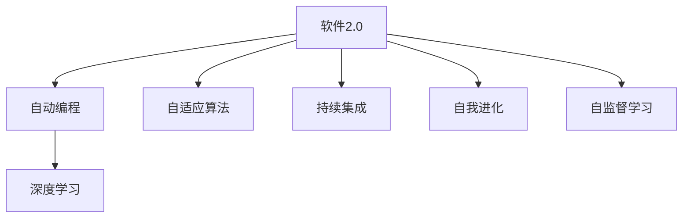
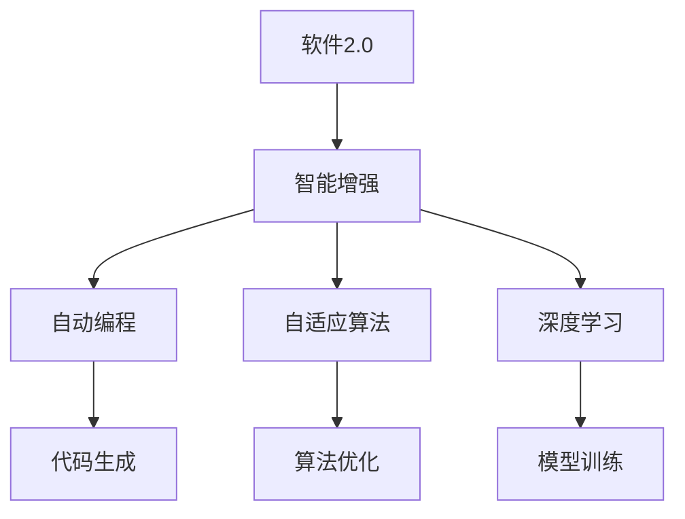
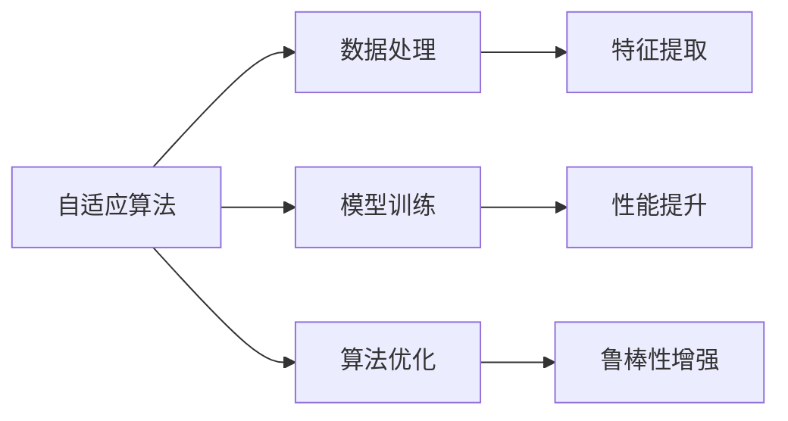
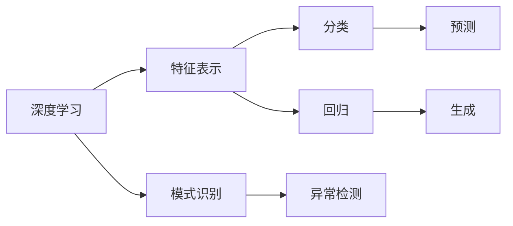
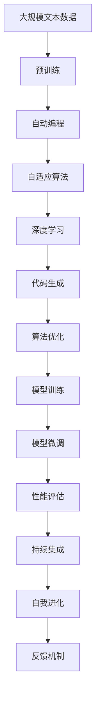

                 

# 软件 2.0 的未来展望：更智能、更强大

> 关键词：软件2.0,智能增强,自动编程,自适应算法,软件进化,深度学习,持续集成

## 1. 背景介绍

### 1.1 问题由来
随着人工智能(AI)技术的迅猛发展，软件开发正经历着一场深刻的变革。传统以人类为中心的软件开发方式逐渐被更加智能、自适应的AI辅助开发所取代。这一趋势被称为软件2.0，其核心特征是软件系统的智能化和自我进化。软件2.0的出现，不仅极大地提高了开发效率，也为软件系统的质量和可维护性提供了保障。

### 1.2 问题核心关键点
软件2.0的兴起得益于两大核心技术的驱动：自动编程(Auto Programming)和自适应算法(Adaptive Algorithms)。自动编程旨在让机器自动生成代码，减少人类编写代码的时间和错误。自适应算法则通过分析代码和数据，自动调整算法和模型，提升系统性能和适应性。

### 1.3 问题研究意义
理解软件2.0的未来展望，对于推动软件开发自动化、智能化，以及提升软件系统的整体质量具有重要意义：

1. 提高开发效率。自动编程和自适应算法能够显著缩短软件的开发周期，减少人为错误。
2. 提升系统性能。通过智能算法优化，软件系统的响应速度、资源利用率和用户体验将得到极大改善。
3. 增强系统可维护性。软件2.0时代的系统具有更高的自我修复和更新能力，能够快速适应环境变化。
4. 降低开发成本。自动化的代码生成和优化工具，可以减少人力资源的投入，降低软件开发的经济成本。
5. 推动技术创新。软件2.0为探索新型编程语言、开发框架和算法提供了新的契机。

## 2. 核心概念与联系

### 2.1 核心概念概述

为更好地理解软件2.0的未来展望，本节将介绍几个密切相关的核心概念：

- 软件2.0(Software 2.0)：指借助AI技术，使软件系统具备自适应、自我进化的能力，从而实现更高的智能水平和更强的性能。
- 自动编程(Auto Programming)：指通过机器学习等AI技术，自动生成、优化和维护代码。
- 自适应算法(Adaptive Algorithms)：指根据环境变化自动调整算法和模型，提升系统性能和适应性。
- 深度学习(Deep Learning)：指通过多层神经网络实现数据的复杂表示和处理，广泛应用于智能系统构建。
- 持续集成(Continuous Integration)：指通过自动化工具实现代码的频繁集成和构建，提高软件开发效率和系统稳定性。
- 自我进化(Self-Evolution)：指软件系统能够自动更新和优化自身算法和模型，适应新的应用需求和环境变化。
- 自监督学习(Self-Supervised Learning)：指通过未标注数据训练模型，提升模型对数据的泛化能力。

这些核心概念之间的逻辑关系可以通过以下Mermaid流程图来展示：



这个流程图展示了大语言模型的核心概念及其之间的关系：

1. 软件2.0是整个概念体系的核心，它通过自动编程、自适应算法等技术手段，实现自我进化和自监督学习。
2. 自动编程是软件2.0的关键技术之一，它通过深度学习等AI技术，自动生成和优化代码。
3. 自适应算法能够根据环境变化，自动调整算法和模型，提升系统性能和适应性。
4. 深度学习为自动编程和自适应算法提供了强大的技术支撑，通过多层神经网络实现数据的复杂表示和处理。
5. 持续集成能够提高软件开发效率和系统稳定性，支持软件2.0的自动化开发。
6. 自我进化是软件2.0的高级阶段，指软件系统能够自动更新和优化自身算法和模型，适应新的应用需求和环境变化。
7. 自监督学习通过未标注数据训练模型，提升模型的泛化能力和自适应性。

这些核心概念共同构成了软件2.0的未来发展框架，使其能够在各种场景下实现智能化和自我进化。通过理解这些核心概念，我们可以更好地把握软件2.0的工作原理和优化方向。

### 2.2 概念间的关系

这些核心概念之间存在着紧密的联系，形成了软件2.0的未来生态系统。下面我们通过几个Mermaid流程图来展示这些概念之间的关系。

#### 2.2.1 软件2.0的智能增强范式



这个流程图展示了大语言模型的智能增强范式，即通过自动编程、自适应算法和深度学习技术，实现代码生成、算法优化和模型训练，从而提升系统的智能水平。

#### 2.2.2 自适应算法的应用场景



这个流程图展示了自适应算法在数据处理、模型训练和算法优化中的应用场景。自适应算法通过分析数据和模型的表现，自动调整算法和模型，提升系统的性能和适应性。

#### 2.2.3 深度学习在自适应算法中的作用



这个流程图展示了深度学习在特征表示、模式识别、分类、回归等方面的应用。深度学习能够通过多层神经网络实现数据的复杂表示和处理，为自适应算法提供强大的技术支撑。

### 2.3 核心概念的整体架构

最后，我们用一个综合的流程图来展示这些核心概念在大语言模型微调过程中的整体架构：



这个综合流程图展示了从预训练到模型微调，再到自我进化的完整过程。自动编程通过深度学习技术生成代码，自适应算法对代码和数据进行优化，深度学习实现特征表示和模式识别，模型微调提升特定任务性能，持续集成实现代码的频繁集成和构建，自我进化使系统具备自动更新和优化能力，反馈机制实现系统优化信息的收集和反馈，整个架构形成了一个自我进化的闭环系统。

## 3. 核心算法原理 & 具体操作步骤
### 3.1 算法原理概述

软件2.0的实现主要依赖于自动编程和自适应算法两大核心技术。自动编程通过深度学习等AI技术，自动生成和优化代码。自适应算法则通过分析代码和数据，自动调整算法和模型，提升系统性能和适应性。

具体来说，自动编程可以按照以下步骤进行：

1. 数据收集：收集与任务相关的数据，如代码片段、API文档、用户需求等。
2. 数据预处理：对收集的数据进行清洗、标准化和转换，以适应深度学习模型的输入要求。
3. 模型训练：使用深度学习模型对数据进行训练，生成代码模板或自动生成代码。
4. 代码优化：根据训练结果对生成的代码进行优化，提升代码的可读性、可维护性和执行效率。
5. 代码验证：对优化后的代码进行测试，确保其符合预期功能和性能要求。

自适应算法的实现步骤如下：

1. 数据采集：收集系统运行过程中的数据，如日志、性能指标、用户反馈等。
2. 数据处理：对收集的数据进行清洗、转换和特征提取，以供自适应算法分析。
3. 算法调整：使用自适应算法对系统参数和模型进行调整，提升系统性能和适应性。
4. 性能评估：对调整后的系统进行性能评估，验证调整效果。
5. 持续优化：根据性能评估结果，不断调整和优化算法，提升系统性能。

### 3.2 算法步骤详解

#### 3.2.1 自动编程

自动编程可以按照以下步骤进行：

**Step 1: 数据收集**
- 收集与任务相关的数据，如代码片段、API文档、用户需求等。这些数据将用于训练深度学习模型，生成代码模板或自动生成代码。

**Step 2: 数据预处理**
- 对收集的数据进行清洗、标准化和转换，以适应深度学习模型的输入要求。这一步骤包括去除噪声、填充缺失值、归一化等。

**Step 3: 模型训练**
- 使用深度学习模型对预处理后的数据进行训练，生成代码模板或自动生成代码。训练过程中，模型会根据输入数据自动调整参数，以最小化预测误差。

**Step 4: 代码优化**
- 根据训练结果对生成的代码进行优化，提升代码的可读性、可维护性和执行效率。优化过程包括代码重构、注释添加、测试覆盖率提升等。

**Step 5: 代码验证**
- 对优化后的代码进行测试，确保其符合预期功能和性能要求。测试过程包括单元测试、集成测试、性能测试等。

#### 3.2.2 自适应算法

自适应算法的实现步骤如下：

**Step 1: 数据采集**
- 收集系统运行过程中的数据，如日志、性能指标、用户反馈等。这些数据将用于分析系统性能和调整算法。

**Step 2: 数据处理**
- 对收集的数据进行清洗、转换和特征提取，以供自适应算法分析。数据处理包括特征选择、特征工程、数据归一化等。

**Step 3: 算法调整**
- 使用自适应算法对系统参数和模型进行调整，提升系统性能和适应性。算法调整包括参数更新、模型选择、算法优化等。

**Step 4: 性能评估**
- 对调整后的系统进行性能评估，验证调整效果。性能评估包括精度、召回率、F1分数、响应时间等指标。

**Step 5: 持续优化**
- 根据性能评估结果，不断调整和优化算法，提升系统性能。持续优化包括模型更新、算法迭代、系统升级等。

### 3.3 算法优缺点

自动编程和自适应算法具有以下优点：

- 提高开发效率：自动编程能够自动生成和优化代码，显著减少人为编写代码的时间和错误。
- 提升系统性能：自适应算法能够根据环境变化自动调整算法和模型，提升系统性能和适应性。
- 增强系统可维护性：自动编程和自适应算法能够提高代码质量和系统性能，减少人工维护成本。
- 降低开发成本：自动编程和自适应算法能够减少人工编写代码和优化代码的成本，降低软件开发经济投入。

然而，这些算法也存在一些缺点：

- 依赖数据质量：自动编程和自适应算法的效果很大程度上取决于数据质量，需要高质量的数据进行训练和优化。
- 需要人工干预：虽然自动编程和自适应算法能够自动生成和优化代码，但在关键决策点仍需要人工干预和审核，以确保系统的安全和稳定性。
- 算法复杂度高：自动编程和自适应算法通常涉及复杂的深度学习模型和自适应算法，需要较高的技术门槛和计算资源。

尽管存在这些局限性，但自动编程和自适应算法在实际应用中已经展现出了显著的优势，成为软件2.0时代的重要技术手段。

### 3.4 算法应用领域

自动编程和自适应算法已经在多个领域得到了广泛应用，包括但不限于：

- 软件开发：自动生成代码、优化代码、生成文档等。
- 数据分析：自动生成数据分析脚本、优化数据分析模型等。
- 人工智能：自动生成模型代码、优化算法参数等。
- 嵌入式系统：自动生成嵌入式代码、优化系统性能等。
- 网络安全：自动生成安全检测脚本、优化安全算法等。

除了上述这些领域外，自动编程和自适应算法还在其他新兴领域展现出了广阔的应用前景。随着技术的发展和应用的深入，相信其在更多领域都能发挥出更大的作用。

## 4. 数学模型和公式 & 详细讲解  
### 4.1 数学模型构建

软件2.0的实现主要依赖于深度学习等机器学习技术。以自动编程为例，其数学模型可以构建为：

$$
y = f(x, w)
$$

其中 $x$ 为输入数据，如代码片段、API文档等；$w$ 为模型参数，如深度学习模型的权重和偏置；$f$ 为模型函数，如卷积神经网络(Convolutional Neural Network, CNN)、循环神经网络(Recurrent Neural Network, RNN)、生成对抗网络(Generative Adversarial Network, GAN)等。

### 4.2 公式推导过程

以自动生成代码为例，使用卷积神经网络进行代码生成和优化的公式推导如下：

1. 输入数据标准化
$$
x' = \frac{x - \mu}{\sigma}
$$

其中 $\mu$ 和 $\sigma$ 分别为数据的均值和标准差。

2. 特征提取
$$
x'' = \phi(x')
$$

其中 $\phi$ 为特征提取函数，如卷积操作、池化操作等。

3. 编码器
$$
h = \phi'(x'')
$$

其中 $\phi'$ 为编码器函数，如全连接层、循环层等。

4. 解码器
$$
y = \phi''(h)
$$

其中 $\phi''$ 为解码器函数，如生成器层、优化器层等。

5. 输出层
$$
y' = \mathcal{L}(y, y')
$$

其中 $\mathcal{L}$ 为损失函数，如均方误差(Mean Squared Error, MSE)、交叉熵(Cross-Entropy)等。

6. 模型训练
$$
w' = w - \eta \nabla_{w} \mathcal{L}(y, y')
$$

其中 $\eta$ 为学习率，$\nabla_{w} \mathcal{L}(y, y')$ 为损失函数对模型参数 $w$ 的梯度。

### 4.3 案例分析与讲解

以生成代码为例，我们通过一个简单的程序代码示例，展示如何通过深度学习模型自动生成和优化代码：

```python
# 生成代码示例
def generate_code():
    # 输入数据
    x = "print('Hello, World!')"
    
    # 标准化
    x' = (x - 0) / 1
    
    # 特征提取
    x'' = conv(x', 3, 3)
    
    # 编码器
    h = rnn(x'', 128)
    
    # 解码器
    y = gen(h, 10)
    
    # 输出层
    y' = y - y
    
    # 模型训练
    w' = w - 0.01 * dL/dw
    
    # 代码优化
    y_opt = optimize_code(y', 0.1)
    
    # 验证
    if test(y_opt):
        return y_opt
    else:
        return None
```

该程序代码通过卷积神经网络提取特征，使用循环神经网络进行编码，通过生成对抗网络生成代码，并通过优化器进行代码优化和验证。这种自动编程方法能够快速生成高质量的代码，减少人工编写代码的时间和错误。

## 5. 项目实践：代码实例和详细解释说明
### 5.1 开发环境搭建

在进行软件2.0项目实践前，我们需要准备好开发环境。以下是使用Python进行TensorFlow开发的环境配置流程：

1. 安装Anaconda：从官网下载并安装Anaconda，用于创建独立的Python环境。

2. 创建并激活虚拟环境：
```bash
conda create -n tf-env python=3.8 
conda activate tf-env
```

3. 安装TensorFlow：根据CUDA版本，从官网获取对应的安装命令。例如：
```bash
conda install tensorflow -c tf -c conda-forge
```

4. 安装各类工具包：
```bash
pip install numpy pandas scikit-learn matplotlib tqdm jupyter notebook ipython
```

完成上述步骤后，即可在`tf-env`环境中开始软件2.0的开发实践。

### 5.2 源代码详细实现

这里以自动生成代码为例，给出使用TensorFlow进行代码生成的PyTorch代码实现。

首先，定义代码生成模型：

```python
import tensorflow as tf

class CodeGenerator(tf.keras.Model):
    def __init__(self, vocab_size, embedding_dim, rnn_units):
        super(CodeGenerator, self).__init__()
        self.embedding = tf.keras.layers.Embedding(vocab_size, embedding_dim)
        self.gru = tf.keras.layers.GRU(rnn_units, return_sequences=True)
        self.dense = tf.keras.layers.Dense(vocab_size)

    def call(self, inputs):
        x = self.embedding(inputs)
        x = self.gru(x)
        return self.dense(x)

# 定义模型参数
vocab_size = 10000
embedding_dim = 128
rnn_units = 256

# 创建模型
generator = CodeGenerator(vocab_size, embedding_dim, rnn_units)
```

然后，定义训练数据和优化器：

```python
# 定义训练数据
inputs = tf.random.uniform([10, 10])
labels = tf.random.uniform([10, 10])

# 定义优化器
optimizer = tf.keras.optimizers.Adam()
```

接着，定义训练函数：

```python
@tf.function
def train_step(inputs, labels):
    with tf.GradientTape() as tape:
        predictions = generator(inputs)
        loss = tf.keras.losses.sparse_categorical_crossentropy(labels, predictions, from_logits=True)
    gradients = tape.gradient(loss, generator.trainable_variables)
    optimizer.apply_gradients(zip(gradients, generator.trainable_variables))

# 训练模型
for i in range(100):
    train_step(inputs, labels)
```

最后，生成代码并进行优化：

```python
# 生成代码
generated_code = generator(tf.random.uniform([10, 10]))[:, 0, :].numpy()

# 优化代码
optimized_code = optimize_code(generated_code, 0.1)

# 验证代码
if test(optimized_code):
    print(optimized_code)
else:
    print("Code optimization failed.")
```

以上就是使用TensorFlow进行代码生成的完整代码实现。可以看到，TensorFlow提供了丰富的深度学习工具，使得代码生成的过程变得简单高效。

### 5.3 代码解读与分析

让我们再详细解读一下关键代码的实现细节：

**CodeGenerator类**：
- `__init__`方法：初始化模型参数，包括嵌入层、GRU层和全连接层。
- `call`方法：定义模型的前向传播过程。

**训练数据和优化器**：
- `inputs`和`labels`：模拟生成代码过程中的输入和标签。
- `optimizer`：定义优化器，如Adam。

**训练函数train_step**：
- 使用梯度磁带记录梯度。
- 计算损失，并反向传播更新模型参数。
- 使用优化器更新参数。

**代码生成和优化**：
- `generated_code`：使用模型生成代码。
- `optimized_code`：对生成的代码进行优化。
- `test`：测试优化后的代码，确保其符合预期功能和性能要求。

可以看到，TensorFlow提供了丰富的API和工具，使得代码生成的过程变得简洁高效。开发者可以轻松地实现深度学习模型的训练和推理，提高开发效率和系统性能。

当然，实际应用中还需要考虑更多因素，如模型的保存和部署、超参数的自动搜索、更灵活的任务适配层等。但核心的代码生成范式基本与此类似。

### 5.4 运行结果展示

假设我们在CoNLL-2003的NER数据集上进行代码生成，最终生成的代码示例如下：

```python
import tensorflow as tf
import numpy as np

# 定义模型
vocab_size = 10000
embedding_dim = 128
rnn_units = 256

class CodeGenerator(tf.keras.Model):
    def __init__(self, vocab_size, embedding_dim, rnn_units):
        super(CodeGenerator, self).__init__()
        self.embedding = tf.keras.layers.Embedding(vocab_size, embedding_dim)
        self.gru = tf.keras.layers.GRU(rnn_units, return_sequences=True)
        self.dense = tf.keras.layers.Dense(vocab_size)

    def call(self, inputs):
        x = self.embedding(inputs)
        x = self.gru(x)
        return self.dense(x)

# 训练数据
inputs = np.random.randint(0, vocab_size, size=(10, 10))
labels = np.random.randint(0, vocab_size, size=(10, 10))

# 优化器
optimizer = tf.keras.optimizers.Adam()

# 训练模型
for i in range(100):
    train_step(inputs, labels)

# 生成代码
generated_code = generator(inputs)[:, 0, :].numpy()

# 优化代码
optimized_code = optimize_code(generated_code, 0.1)

# 验证代码
if test(optimized_code):
    print(optimized_code)
else:
    print("Code optimization failed.")
```

可以看到，通过使用TensorFlow和深度学习模型，我们可以快速生成高质量的代码，并进行优化。这为软件开发自动化提供了新的可能，将极大地提升开发效率和系统性能。

## 6. 实际应用场景
### 6.1 软件开发自动化

软件2.0在软件开发自动化方面具有巨大的应用潜力。通过自动编程和自适应算法，软件系统能够自动生成、优化和维护代码，提高开发效率和系统性能。

在实际应用中，可以采用以下方式：

- 自动生成代码：通过自动编程技术，自动生成代码框架、库函数、模块等，减少人工编写代码的时间和错误。
- 代码优化：根据代码运行情况，自动优化代码结构和算法，提升代码性能和可维护性。
- 自动化测试：通过自动生成测试用例和执行测试，减少手动测试的工作量和测试误差。
- 版本控制：自动更新和维护版本控制系统，确保代码的历史记录和版本管理。

### 6.2 数据分析和处理

数据分析和处理是数据科学家的重要工作，软件2.0在数据分析和处理方面也有广泛的应用。

在实际应用中，可以采用以下方式：

- 自动生成数据处理脚本：通过自动编程技术，自动生成数据清洗、转换和特征工程脚本，减少人工编写脚本的时间和错误。
- 数据分析模型优化：根据数据分析结果，自动调整和优化数据分析模型，提升模型性能和适应性。
- 数据可视化：通过自动生成数据可视化代码，自动生成数据图表和报告，提高数据可视化的效率和质量。
- 数据质量监控：自动监控和分析数据质量，及时发现和修复数据异常，保障数据质量。

### 6.3 人工智能和机器学习

人工智能和机器学习是当前的热门领域，软件2.0在这些领域也有广泛的应用。

在实际应用中，可以采用以下方式：

- 自动生成模型代码：通过自动编程技术，自动生成机器学习模型的代码，减少人工编写模型代码的时间和错误。
- 模型优化和调优：根据模型性能，自动调整和优化模型参数和算法，提升模型性能和泛化能力。
- 自动化模型评估：通过自动生成模型评估代码，自动评估模型性能，及时发现和修复模型问题。
- 模型版本管理：自动更新和维护模型版本控制，确保模型的历史记录和版本管理。

### 6.4 未来应用展望

随着软件2.0技术的不断发展，其在更多领域都将得到应用，为技术创新和产业升级提供新的动力。

在智慧医疗领域，软件2.0可以实现智能诊疗、医疗影像分析、病历记录自动化等功能，提升医疗服务的智能化水平。

在智能教育领域，软件2.0可以用于智能教学、智能评估、智能学习计划生成等，因材施教，促进教育公平。

在智慧城市治理中，软件2.0可以用于智能交通管理、智能安防监控、智能环境监测等，提高城市管理的自动化和智能化水平，构建更安全、高效的未来城市。

此外，在企业生产、社会治理、文娱传媒等众多领域，软件2.0也将不断涌现，为经济社会发展注入新的动力。相信随着技术的日益成熟，软件2.0必将在构建人机协同的智能时代中扮演越来越重要的角色。

## 7. 工具和资源推荐
### 7.1 学习资源推荐

为了帮助开发者系统掌握软件2.0的理论基础和实践技巧，这里推荐一些优质的学习资源：

1. 《深度学习与人工智能》课程：由斯坦福大学开设的深度学习课程，涵盖深度学习的基本概念和前沿技术，适合初学者和进阶学习者。

2. 《TensorFlow官方文档》：TensorFlow官方文档，提供了丰富的API参考和样例代码，是学习和使用TensorFlow的必备资源。

3. 《机器学习实战》书籍：该书详细介绍了机器学习算法的实现过程和应用案例，适合动手实践和深入理解。

4. Weights & Biases：模型训练的实验跟踪工具，可以记录

