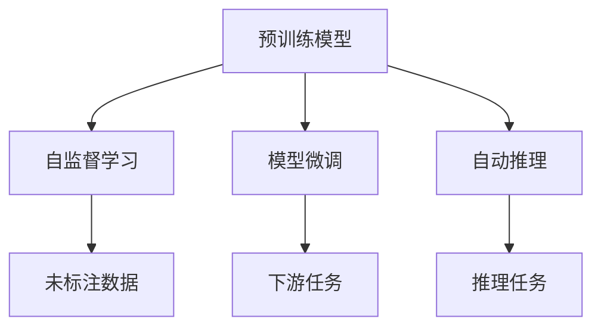
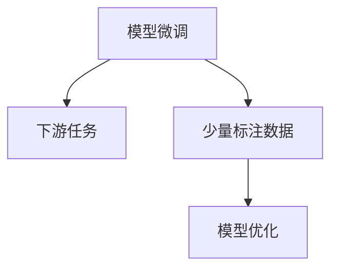
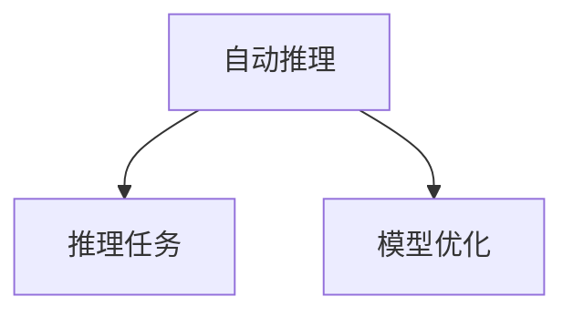
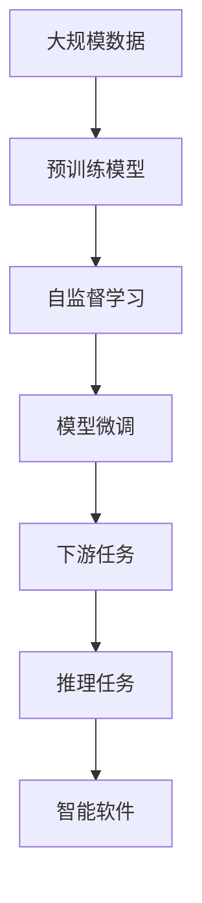

                 

# 软件 2.0 的未来：通用人工智能的基石

> 关键词：软件 2.0, 通用人工智能, 预训练模型, 自监督学习, 自动推理, 模型微调, 深度学习, 人工智能, 自然语言处理(NLP), 计算机视觉(CV)

## 1. 背景介绍

### 1.1 问题由来

随着信息技术的发展，软件的内涵和功能不断扩展。从早期的仅关注代码编写和执行，到后来引入了人工智能（AI）、大数据、云计算等技术，软件逐步演变成一个复杂的系统工程。然而，这些技术的引入虽然提升了软件的智能化水平，但也带来了新的挑战和问题。例如，如何在大规模数据上训练出高性能模型，如何处理模型的复杂推理过程，如何保证模型的鲁棒性和安全性等。

为了应对这些挑战，软件工程师们开始探索新的技术和工具，以满足不断变化的需求。其中，软件 2.0 的概念应运而生，它强调将人工智能、深度学习和自然语言处理（NLP）等技术应用于软件开发中，提升软件的智能化和自动化水平。软件 2.0 的核心在于预训练模型、自监督学习和模型微调等技术，它们为通用人工智能的实现提供了坚实的基石。

### 1.2 问题核心关键点

软件 2.0 中的关键技术包括预训练模型、自监督学习、模型微调和自动推理等。这些技术共同构成了通用人工智能的实现框架。

- 预训练模型：在大规模无标签数据上训练出的模型，能够提取通用的语言或视觉特征，为下游任务提供基础的知识。
- 自监督学习：通过未标注数据训练模型，使其学习到数据的潜在规律和特征。
- 模型微调：在预训练模型的基础上，利用少量标注数据对模型进行优化，使其适应特定的任务。
- 自动推理：在推理过程中，模型能够自我发现并应用规则，进行复杂的逻辑和计算。

这些技术不仅能够提升模型的性能和泛化能力，还能够显著降低开发成本，加速模型的部署和应用。

### 1.3 问题研究意义

软件 2.0 技术的不断发展，对于推动人工智能技术在各行各业的应用具有重要意义：

1. **降低开发成本**：通过预训练模型和自监督学习，可以在大规模数据上快速训练出高性能模型，大幅降低人工标注和训练成本。
2. **提升模型性能**：模型微调和自动推理技术能够进一步优化模型，提升其在特定任务上的性能，满足实际应用需求。
3. **加速模型部署**：利用预训练模型和微调技术，可以显著降低模型的推理计算量和存储需求，加速模型的部署和应用。
4. **促进产业升级**：软件 2.0 技术的应用，能够帮助传统行业实现数字化转型，提升智能化水平，推动产业升级。

## 2. 核心概念与联系

### 2.1 核心概念概述

为了更好地理解软件 2.0 的实现原理，本节将介绍几个密切相关的核心概念：

- 预训练模型：在大规模无标签数据上训练出的模型，能够提取通用的语言或视觉特征，为下游任务提供基础的知识。
- 自监督学习：通过未标注数据训练模型，使其学习到数据的潜在规律和特征。
- 模型微调：在预训练模型的基础上，利用少量标注数据对模型进行优化，使其适应特定的任务。
- 自动推理：在推理过程中，模型能够自我发现并应用规则，进行复杂的逻辑和计算。
- 通用人工智能（AGI）：具有广泛智能和自我学习能力的人工智能，能够理解和执行复杂的任务。

这些概念之间的逻辑关系可以通过以下 Mermaid 流程图来展示：



这个流程图展示了大规模数据训练模型的各个环节：

1. 预训练模型在大规模无标签数据上训练，提取通用特征。
2. 自监督学习通过未标注数据进一步优化模型，学习数据潜在规律。
3. 模型微调在特定任务上优化模型，提升性能。
4. 自动推理在推理任务中，模型能够自我发现并应用规则，进行复杂计算。

这些概念共同构成了软件 2.0 的实现框架，使其能够构建智能化的软件系统。

### 2.2 概念间的关系

这些核心概念之间存在着紧密的联系，形成了软件 2.0 的完整生态系统。下面我们通过几个 Mermaid 流程图来展示这些概念之间的关系。

#### 2.2.1 预训练模型的训练


这个流程图展示了预训练模型的训练过程。在大规模无标签数据上，通过自监督学习任务，预训练模型能够学习到数据的潜在规律和特征。

#### 2.2.2 自监督学习的目标


这个流程图展示了自监督学习的目标。通过未标注数据，自监督学习能够优化模型，使其学习到数据潜在规律，提升模型泛化能力。

#### 2.2.3 模型微调的过程



这个流程图展示了模型微调的过程。在预训练模型的基础上，利用少量标注数据进行微调，能够进一步提升模型在特定任务上的性能。

#### 2.2.4 自动推理的应用



这个流程图展示了自动推理的应用。在推理任务中，模型能够自我发现并应用规则，进行复杂计算，提升推理效率和准确性。

### 2.3 核心概念的整体架构

最后，我们用一个综合的流程图来展示这些核心概念在大规模数据训练模型中的整体架构：



这个综合流程图展示了从大规模数据训练模型到智能软件构建的完整过程。预训练模型在大规模数据上训练，通过自监督学习和模型微调，提升模型性能，最终应用于智能软件的推理任务中。

## 3. 核心算法原理 & 具体操作步骤

### 3.1 算法原理概述

软件 2.0 中的预训练模型、自监督学习、模型微调和自动推理等技术，构成了其核心算法原理。下面将详细介绍这些核心算法的原理和操作步骤。

#### 3.1.1 预训练模型的训练

预训练模型的训练过程通常包括自监督学习任务和数据增强等步骤。以下是常见的预训练模型训练步骤：

1. 数据准备：收集大规模无标签数据，并进行数据清洗和预处理。
2. 自监督学习：选择合适的自监督学习任务，如语言建模、掩码预测等，在无标签数据上训练模型。
3. 数据增强：通过回译、数据清洗等手段，扩充训练集，增加模型泛化能力。
4. 模型优化：通过反向传播算法和优化器，更新模型参数，最小化损失函数。

#### 3.1.2 自监督学习的目标

自监督学习的目标是通过未标注数据训练模型，使其学习到数据的潜在规律和特征。常见的自监督学习任务包括：

1. 掩码预测：通过预测掩码位置的词语，训练模型学习词语之间的语义关系。
2. 语言模型：通过预测上下文中的下一个词语，训练模型学习语言的概率分布。
3. 数据增强：通过生成更多样化的数据，增加模型泛化能力。

#### 3.1.3 模型微调的过程

模型微调的过程通常包括下游任务的数据准备和模型优化等步骤。以下是常见的模型微调步骤：

1. 数据准备：收集下游任务的有标签数据，并进行数据清洗和预处理。
2. 模型优化：在预训练模型的基础上，利用下游任务的数据进行微调，优化模型参数。
3. 模型评估：通过验证集评估模型性能，调整模型参数。
4. 模型部署：将微调后的模型部署到实际应用中，进行推理和计算。

#### 3.1.4 自动推理的应用

自动推理的目标是使模型能够自我发现并应用规则，进行复杂的逻辑和计算。常见的自动推理任务包括：

1. 逻辑推理：通过推导已知规则，进行逻辑推理和判断。
2. 计算推理：通过计算已知数据，得出推理结果。
3. 交互推理：通过与用户进行交互，逐步推理和得出结论。

### 3.2 算法步骤详解

软件 2.0 中的预训练模型、自监督学习、模型微调和自动推理等技术，构成了其核心算法步骤。下面将详细介绍这些核心算法的详细步骤。

#### 3.2.1 预训练模型的训练步骤

1. 数据收集：收集大规模无标签数据，如维基百科、新闻、小说等。
2. 数据清洗：去除数据中的噪声和无用信息，保留有效数据。
3. 分词和向量化：将文本数据分词，并进行向量化处理，转换为模型能够处理的数值形式。
4. 选择自监督任务：选择合适的自监督学习任务，如语言建模、掩码预测等。
5. 模型训练：在无标签数据上训练模型，最小化损失函数。
6. 模型评估：通过测试集评估模型性能，调整模型参数。
7. 模型保存：保存预训练模型，用于下游任务的微调。

#### 3.2.2 自监督学习的训练步骤

1. 数据准备：收集未标注数据，并进行数据清洗和预处理。
2. 选择自监督任务：选择合适的自监督学习任务，如掩码预测、语言模型等。
3. 模型训练：在无标签数据上训练模型，最小化损失函数。
4. 模型评估：通过测试集评估模型性能，调整模型参数。
5. 数据增强：通过回译、数据清洗等手段，扩充训练集。

#### 3.2.3 模型微调的训练步骤

1. 数据准备：收集下游任务的有标签数据，并进行数据清洗和预处理。
2. 模型初始化：将预训练模型作为初始化参数，用于微调。
3. 任务适配层：根据下游任务，添加任务适配层，如分类层、解码器等。
4. 选择优化器：选择合适的优化器，如 Adam、SGD 等。
5. 设置学习率：设置合适的学习率，避免破坏预训练权重。
6. 模型优化：利用下游任务的数据进行微调，优化模型参数。
7. 模型评估：通过验证集评估模型性能，调整模型参数。
8. 模型部署：将微调后的模型部署到实际应用中，进行推理和计算。

#### 3.2.4 自动推理的推理步骤

1. 数据准备：收集推理任务的数据，并进行数据清洗和预处理。
2. 选择推理任务：选择合适的推理任务，如逻辑推理、计算推理等。
3. 模型初始化：将预训练模型作为初始化参数，用于推理。
4. 推理计算：通过自动推理机制，进行复杂的逻辑和计算。
5. 结果输出：输出推理结果，进行后续处理。

### 3.3 算法优缺点

软件 2.0 中的预训练模型、自监督学习、模型微调和自动推理等技术，具有以下优点和缺点：

#### 3.3.1 预训练模型的优点

- 在大规模无标签数据上训练，提取通用特征，提升模型泛化能力。
- 减少人工标注和训练成本，提高开发效率。
- 通过自监督学习，学习数据潜在规律和特征，提升模型性能。

#### 3.3.2 预训练模型的缺点

- 需要大量计算资源和时间，训练成本较高。
- 模型参数较大，推理计算复杂度较高。
- 预训练模型可能存在过拟合风险，需要额外正则化技术。

#### 3.3.3 自监督学习的优点

- 利用未标注数据训练模型，避免人工标注成本。
- 通过自监督学习，学习数据潜在规律和特征，提升模型泛化能力。
- 数据增强技术，扩充训练集，增加模型泛化能力。

#### 3.3.4 自监督学习的缺点

- 自监督学习任务选择不当，可能导致模型性能下降。
- 数据增强技术可能引入噪声，影响模型性能。
- 自监督学习目标不明确，可能导致模型过拟合。

#### 3.3.5 模型微调的优点

- 利用少量标注数据进行微调，快速适应下游任务。
- 任务适配层灵活，可以根据下游任务进行优化。
- 模型微调过程简单，开发效率高。

#### 3.3.6 模型微调的缺点

- 微调过程容易过拟合，需要额外正则化技术。
- 微调过程依赖标注数据，标注成本较高。
- 微调模型参数较大，推理计算复杂度较高。

#### 3.3.7 自动推理的优点

- 模型能够自我发现并应用规则，进行复杂计算。
- 自动推理机制灵活，适用于多种推理任务。
- 自动推理结果可解释性强，易于理解。

#### 3.3.8 自动推理的缺点

- 自动推理机制复杂，实现难度高。
- 自动推理过程可能存在错误，需要人工干预。
- 自动推理结果可解释性较弱，可能存在不确定性。

### 3.4 算法应用领域

软件 2.0 中的预训练模型、自监督学习、模型微调和自动推理等技术，已经广泛应用于以下几个领域：

#### 3.4.1 自然语言处理（NLP）

- 预训练模型：如BERT、GPT-3等，在语言建模、文本分类、命名实体识别等任务中表现优异。
- 自监督学习：如掩码预测、语言模型等，提升模型泛化能力。
- 模型微调：如情感分析、问答系统、机器翻译等，提升模型在特定任务上的性能。
- 自动推理：如对话生成、文本摘要、文本纠错等，提升模型推理能力。

#### 3.4.2 计算机视觉（CV）

- 预训练模型：如ResNet、Inception等，在图像分类、目标检测、人脸识别等任务中表现优异。
- 自监督学习：如图像生成、图像分类等，提升模型泛化能力。
- 模型微调：如图像分割、图像生成等，提升模型在特定任务上的性能。
- 自动推理：如场景理解、图像增强等，提升模型推理能力。

#### 3.4.3 语音识别（ASR）

- 预训练模型：如LSTM、CNN等，在语音识别、语音合成等任务中表现优异。
- 自监督学习：如声学建模、语音识别等，提升模型泛化能力。
- 模型微调：如语音情感识别、语音翻译等，提升模型在特定任务上的性能。
- 自动推理：如语音交互、语音控制等，提升模型推理能力。

## 4. 数学模型和公式 & 详细讲解 & 举例说明

### 4.1 数学模型构建

为了更好地理解软件 2.0 的实现原理，本节将介绍几个常用的数学模型和公式。

#### 4.1.1 预训练模型的数学模型

预训练模型的训练过程通常使用自监督学习任务进行。以下是常见的自监督学习任务和数学模型：

1. 掩码预测任务：通过预测掩码位置的词语，训练模型学习词语之间的语义关系。数学模型为：
   $$
   \ell = -\sum_{i=1}^n \log p(y_i | x)
   $$
   其中 $x$ 为输入文本，$y_i$ 为掩码位置的词语，$p(y_i | x)$ 为模型预测的词语概率。

2. 语言模型任务：通过预测上下文中的下一个词语，训练模型学习语言的概率分布。数学模型为：
   $$
   \ell = -\sum_{i=1}^n \log p(x_{i+1} | x_1 \cdots x_i)
   $$
   其中 $x$ 为输入文本，$p(x_{i+1} | x_1 \cdots x_i)$ 为模型预测的下一个词语概率。

#### 4.1.2 自监督学习的数学模型

自监督学习的目标是通过未标注数据训练模型，使其学习到数据的潜在规律和特征。以下是常见的自监督学习任务和数学模型：

1. 掩码预测任务：通过预测掩码位置的词语，训练模型学习词语之间的语义关系。数学模型为：
   $$
   \ell = -\sum_{i=1}^n \log p(y_i | x)
   $$
   其中 $x$ 为输入文本，$y_i$ 为掩码位置的词语，$p(y_i | x)$ 为模型预测的词语概率。

2. 语言模型任务：通过预测上下文中的下一个词语，训练模型学习语言的概率分布。数学模型为：
   $$
   \ell = -\sum_{i=1}^n \log p(x_{i+1} | x_1 \cdots x_i)
   $$
   其中 $x$ 为输入文本，$p(x_{i+1} | x_1 \cdots x_i)$ 为模型预测的下一个词语概率。

#### 4.1.3 模型微调的数学模型

模型微调的过程通常使用下游任务的数据进行训练。以下是常见的模型微调任务和数学模型：

1. 分类任务：通过预测文本的类别，训练模型学习分类标签。数学模型为：
   $$
   \ell = -\sum_{i=1}^n \log p(y_i | x)
   $$
   其中 $x$ 为输入文本，$y_i$ 为文本的类别标签，$p(y_i | x)$ 为模型预测的类别概率。

2. 生成任务：通过生成目标文本，训练模型学习文本生成规律。数学模型为：
   $$
   \ell = -\sum_{i=1}^n \log p(x_i | x_1 \cdots x_{i-1}, y)
   $$
   其中 $x$ 为输入文本，$y$ 为目标文本，$p(x_i | x_1 \cdots x_{i-1}, y)$ 为模型预测的下一个词语概率。

### 4.2 公式推导过程

为了更好地理解软件 2.0 的实现原理，本节将详细介绍几个核心算法的公式推导过程。

#### 4.2.1 预训练模型的公式推导

预训练模型的训练过程通常使用自监督学习任务进行。以下是常见的自监督学习任务和公式推导：

1. 掩码预测任务：通过预测掩码位置的词语，训练模型学习词语之间的语义关系。公式推导为：
   $$
   \ell = -\sum_{i=1}^n \log p(y_i | x)
   $$
   其中 $x$ 为输入文本，$y_i$ 为掩码位置的词语，$p(y_i | x)$ 为模型预测的词语概率。

2. 语言模型任务：通过预测上下文中的下一个词语，训练模型学习语言的概率分布。公式推导为：
   $$
   \ell = -\sum_{i=1}^n \log p(x_{i+1} | x_1 \cdots x_i)
   $$
   其中 $x$ 为输入文本，$p(x_{i+1} | x_1 \cdots x_i)$ 为模型预测的下一个词语概率。

#### 4.2.2 自监督学习的公式推导

自监督学习的目标是通过未标注数据训练模型，使其学习到数据的潜在规律和特征。以下是常见的自监督学习任务和公式推导：

1. 掩码预测任务：通过预测掩码位置的词语，训练模型学习词语之间的语义关系。公式推导为：
   $$
   \ell = -\sum_{i=1}^n \log p(y_i | x)
   $$
   其中 $x$ 为输入文本，$y_i$ 为掩码位置的词语，$p(y_i | x)$ 为模型预测的词语概率。

2. 语言模型任务：通过预测上下文中的下一个词语，训练模型学习语言的概率分布。公式推导为：
   $$
   \ell = -\sum_{i=1}^n \log p(x_{i+1} | x_1 \cdots x_i)
   $$
   其中 $x$ 为输入文本，$p(x_{i+1} | x_1 \cdots x_i)$ 为模型预测的下一个词语概率。

#### 4.2.3 模型微调的公式推导

模型微调的过程通常使用下游任务的数据进行训练。以下是常见的模型微调任务和公式推导：

1. 分类任务：通过预测文本的类别，训练模型学习分类标签。公式推导为：
   $$
   \ell = -\sum_{i=1}^n \log p(y_i | x)
   $$
   其中 $x$ 为输入文本，$y_i$ 为文本的类别标签，$p(y_i | x)$ 为模型预测的类别概率。

2. 生成任务：通过生成目标文本，训练模型学习文本生成规律。公式推导为：
   $$
   \ell = -\sum_{i=1}^n \log p(x_i | x_1 \cdots x_{i-1}, y)
   $$
   其中 $x$ 为输入文本，$y$ 为目标文本，$p(x_i | x_1 \cdots x_{i-1}, y)$ 为模型预测的下一个词语概率。

### 4.3 案例分析与讲解

为了更好地理解软件 2.0 的实现原理，本节将详细介绍几个核心算法的案例分析。

#### 4.3.1 预训练模型的案例分析

以BERT模型为例，其在预训练阶段使用掩码预测和语言模型任务，训练出通用的语言表示。在微调阶段，通过任务适配层，利用下游任务的数据进行微调，提升模型在特定任务上的性能。

#### 4.3.2 自监督学习的案例分析

以语言模型为例，其通过预测上下文中的下一个词语，训练模型学习语言的概率分布。在微调阶段，利用下游任务的数据进行微调，提升模型在特定任务上的性能。

#### 4.3.3 模型微调的案例分析

以分类任务为例，通过预测文本的类别，训练模型学习分类标签。在微调阶段，利用下游任务的数据进行微调，提升模型在特定任务上的性能。

## 5. 项目实践：代码实例和详细解释说明

### 5.1 开发环境搭建

在进行软件 2.0 的开发实践前，我们需要准备好开发环境。以下是使用Python进行TensorFlow开发的环境配置流程：

1. 安装Anaconda：从官网下载并安装Anaconda，用于创建独立的Python环境。

2. 创建并激活虚拟环境：
```bash
conda create -n tf-env python=3.8 
conda activate tf-env
```

3. 安装TensorFlow：根据CUDA版本，从官网获取对应的安装命令。例如：
```bash
conda install tensorflow -c conda-forge
```

4. 安装各类工具包：
```bash
pip install numpy pandas scikit-learn matplotlib tqdm jupyter notebook ipython
```

完成上述步骤后，即可在`tf-env`环境中开始软件 2.0 的开发实践。

### 5.2 源代码详细实现

这里我们以自然语言处理（NLP）领域中的情感分析任务为例，给出使用TensorFlow进行BERT模型微调的PyTorch代码实现。

首先，定义数据处理函数：

```python
import tensorflow as tf
from tensorflow.keras.preprocessing.text import Tokenizer
from tensorflow.keras.preprocessing.sequence import pad_sequences
from tensorflow.keras.layers import Embedding, LSTM, Dense, Dropout
from tensorflow.keras.models import Sequential
from sklearn.model_selection import train_test_split
import numpy as np

def load_data(file_path):
    with open(file_path, 'r', encoding='utf-8') as f:
        lines = f.readlines()
    lines = [line.strip() for line in lines]
    texts = [line.split('\t')[0] for line in lines]
    labels = [int(line.split('\t')[1]) for line in lines]
    return texts, labels

def tokenize(texts):
    tokenizer = Tokenizer(oov_token='<OOV>')
    tokenizer.fit_on_texts(texts)
    sequences = tokenizer.texts_to_sequences(texts)
    return tokenizer, sequences

def pad_sequences(sequences):
    max_len = max([len(seq) for seq in sequences])
    padded_sequences = pad_sequences(sequences, maxlen=max_len, padding='post')
    return padded_sequences

texts, labels = load_data('data.txt')

tokenizer, sequences = tokenize(texts)
padded_sequences = pad_sequences(sequences)

# 划分训练集和验证集
train_texts, test_texts, train_labels, test_labels = train_test_split(padded_sequences, labels, test_size=0.2)

# 定义模型
model = Sequential()
model.add(Embedding(input_dim=len(tokenizer.word_index) + 1, output_dim

