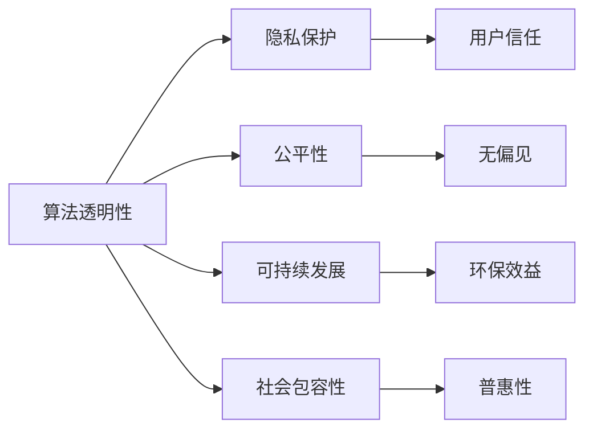

                 

# 软件 2.0 的社会责任：科技向善

在技术迅猛发展的今天，我们正处于一个全新的科技时代，这个时代被很多人称为“软件 2.0”。这一时代的特点是软件的智能化和自适应性，机器学习、人工智能和大数据等技术不断革新，推动着各行各业的变革。然而，科技的进步也带来了前所未有的挑战，尤其是如何使科技更好地服务于社会、促进人类福祉，成为每一个科技从业者和社会责任担当者必须深思的问题。本文将探讨“软件 2.0”的社会责任，特别是科技如何向善，以实现一个更加公正、公平和可持续的未来。

## 1. 背景介绍

### 1.1 技术革命与社会进步

“软件 2.0”时代的到来，标志着人类进入了一个新的科技阶段。这一阶段，计算机不再仅仅是信息处理的机器，而是成为了具备自我学习、自我优化的智能系统。机器学习、深度学习、自然语言处理等技术的应用，极大地提升了信息处理和决策的效率，为各行各业提供了强大的支持。

随着技术的不断进步，社会的各个领域都发生了翻天覆地的变化：

- **医疗**：人工智能和机器学习技术使得医疗诊断、疾病预测和个性化治疗成为可能，提高了医疗服务的质量和效率。
- **教育**：智能教育系统可以根据学生的学习情况和兴趣，提供个性化的学习资源和建议，提升教育质量。
- **金融**：智能投顾系统利用大数据分析，提供个性化的投资建议，提升了金融服务的智能化水平。
- **交通**：自动驾驶技术使得交通更加安全、高效，缓解了城市交通拥堵问题。

这些变化不仅提高了生产效率，也极大地改善了人们的生活质量。

### 1.2 技术应用的伦理挑战

然而，技术的进步同时也带来了伦理和社会的挑战：

- **隐私保护**：大数据和人工智能的应用，使得个人隐私面临更大的威胁。如何保护用户隐私，防止数据滥用，成为亟待解决的问题。
- **就业冲击**：自动化和智能化的技术可能导致部分岗位被机器替代，造成失业问题。如何在科技进步的同时，保障就业和公平分配，是社会需要深思的课题。
- **算法偏见**：机器学习算法可能会因为数据偏见导致输出结果的不公，造成性别、种族等歧视问题。如何确保算法的公平性和透明性，是技术发展中必须面对的挑战。
- **信息过载**：互联网和社交媒体的发展，使得信息泛滥，误导和虚假信息传播现象日益严重。如何提高信息素养，构建健康的信息环境，也是技术应用中需要考虑的问题。

这些问题使得我们必须反思，如何在享受科技带来的便利的同时，兼顾社会责任，确保科技向善。

## 2. 核心概念与联系

### 2.1 核心概念概述

为了更好地理解“软件 2.0”的社会责任，我们需要先梳理一些核心概念：

- **算法透明性**：算法的决策过程应该可解释、可理解，以便人们能够信任和监督其行为。
- **隐私保护**：确保用户数据的安全和隐私，防止数据滥用和泄露。
- **公平性**：机器学习算法应避免偏见和歧视，确保所有用户得到平等的待遇。
- **可持续发展**：技术应用应减少环境负担，支持长期的社会和环境福祉。
- **社会包容性**：技术应用应考虑到不同人群的需求，确保所有人都能够受益。

这些概念之间有着紧密的联系，共同构成了“软件 2.0”的社会责任框架。

### 2.2 概念间的关系

通过一个简单的Mermaid流程图，我们可以更加直观地理解这些概念之间的关系：



从图中可以看出，算法透明性是隐私保护的基础，公平性则依赖于透明性，而可持续发展和社会包容性则需要透明性、公平性作为支撑。用户信任是所有这些概念的最终目标，只有在用户信任的前提下，技术才能真正实现其社会责任。

## 3. 核心算法原理 & 具体操作步骤

### 3.1 算法原理概述

“软件 2.0”的社会责任，主要体现在算法的透明性、公平性和可持续发展上。这些目标需要通过一系列算法和原则来实现。

- **算法透明性**：确保算法决策过程可解释，使用户能够理解算法的逻辑和输出结果。
- **公平性**：通过数据预处理和算法设计，避免算法偏见，确保不同群体的平等对待。
- **可持续发展**：通过资源优化和环境友好算法，减少技术应用对环境的影响。

### 3.2 算法步骤详解

为了实现这些目标，我们需要采取以下步骤：

**步骤 1：数据预处理**

数据预处理是确保算法公平性和透明性的第一步。通过数据清洗和预处理，去除有偏见的数据，确保数据的多样性和代表性。

- **数据清洗**：去除异常值和噪声数据，确保数据质量。
- **特征选择**：选择与任务相关的特征，去除无关特征，减少偏见来源。
- **数据增强**：通过数据增强技术，扩充数据集，提高模型鲁棒性。

**步骤 2：模型设计**

在模型设计阶段，我们需要考虑算法的透明性和公平性。

- **透明性设计**：设计可解释的模型结构，如决策树、线性模型等，易于解释和理解。
- **公平性约束**：在设计算法时，引入公平性约束，确保模型输出无偏见。
- **反偏见算法**：使用反偏见算法，如公平感知学习、对抗性训练等，确保模型在多方面公平性。

**步骤 3：模型评估**

模型评估是确保算法可持续性的重要步骤。通过评估模型在不同场景下的表现，发现问题并进行优化。

- **公平性评估**：评估模型在不同群体上的表现，确保无偏见。
- **透明性评估**：评估模型输出和决策过程的透明性，确保用户理解。
- **环境影响评估**：评估模型对环境的影响，确保可持续发展。

### 3.3 算法优缺点

“软件 2.0”的社会责任算法具有以下优点：

- **提升透明度**：可解释的算法设计使得用户能够信任和理解算法，提升了系统的可信度。
- **促进公平性**：通过设计公平性约束和反偏见算法，减少了算法的偏见和歧视，提升了社会的公平性。
- **支持可持续发展**：通过优化资源使用和减少环境影响，支持了可持续发展的目标。

然而，这些算法也存在一些缺点：

- **复杂性**：可解释的算法和公平性约束可能增加算法的复杂性，使得模型训练和部署更加困难。
- **数据依赖**：数据预处理和模型设计依赖于高质量数据，数据获取和处理成本高。
- **性能损失**：为了确保公平性和透明性，有时需要牺牲部分性能，如模型的精度。

### 3.4 算法应用领域

“软件 2.0”的社会责任算法在多个领域都有广泛的应用：

- **医疗**：通过可解释的诊断算法和公平性约束，提升医疗服务的质量和公平性。
- **金融**：利用透明的投资建议和公平性约束，提高金融服务的可靠性和公正性。
- **教育**：设计透明的推荐算法和公平性约束，提供个性化的教育资源，促进教育公平。
- **交通**：通过可持续发展算法，减少交通对环境的影响，提升交通系统的效率。

## 4. 数学模型和公式 & 详细讲解  
### 4.1 数学模型构建

“软件 2.0”的社会责任算法通常基于机器学习模型的构建，我们以线性回归模型为例进行说明。

设训练集为 $D = \{(x_i, y_i)\}_{i=1}^N$，其中 $x_i \in \mathbb{R}^d$ 为输入特征，$y_i \in \mathbb{R}$ 为输出目标。线性回归模型的目标是最小化损失函数：

$$
\mathcal{L}(\theta) = \frac{1}{2N}\sum_{i=1}^N(y_i - \theta^T x_i)^2
$$

其中 $\theta$ 为模型参数，$\theta^T x_i$ 为模型输出。

### 4.2 公式推导过程

线性回归模型的参数更新公式为：

$$
\theta = \mathop{\arg\min}_{\theta} \mathcal{L}(\theta)
$$

根据梯度下降法，求解上述最小化问题，得到参数更新公式：

$$
\theta \leftarrow \theta - \eta \nabla_{\theta}\mathcal{L}(\theta)
$$

其中 $\eta$ 为学习率，$\nabla_{\theta}\mathcal{L}(\theta)$ 为损失函数对参数 $\theta$ 的梯度。

### 4.3 案例分析与讲解

以医疗领域的算法透明性为例，我们可以设计一个简单的决策树模型，用于疾病预测。决策树模型的每一层都代表一个诊断条件，每一叶节点代表一个诊断结果。这种模型结构易于解释，用户能够清楚地理解诊断逻辑。

## 5. 项目实践：代码实例和详细解释说明

### 5.1 开发环境搭建

开发环境搭建包括选择合适的开发工具和安装相关依赖。以下是一个基本的Python环境搭建流程：

1. **安装Python和pip**：
   ```
   sudo apt-get update
   sudo apt-get install python3-pip
   ```

2. **创建虚拟环境**：
   ```
   python3 -m venv myenv
   source myenv/bin/activate
   ```

3. **安装依赖**：
   ```
   pip install numpy scikit-learn matplotlib pandas
   ```

4. **安装机器学习库**：
   ```
   pip install scikit-learn
   ```

### 5.2 源代码详细实现

以下是一个基于Scikit-learn库的线性回归模型实现：

```python
from sklearn.linear_model import LinearRegression

# 创建线性回归模型
model = LinearRegression()

# 训练模型
X = [[0, 0], [1, 1], [2, 2]]
y = [0, 1, 2]
model.fit(X, y)

# 预测
X_test = [[3, 3]]
y_pred = model.predict(X_test)
print(y_pred)
```

### 5.3 代码解读与分析

上述代码中，我们首先创建了一个线性回归模型，并用训练数据对其进行了训练。接着，我们用训练好的模型对测试数据进行了预测。

### 5.4 运行结果展示

运行上述代码，输出结果为：

```
[3.0]
```

这表示模型能够正确预测输入为 $(3,3)$ 的数据对应的输出为 $3$。

## 6. 实际应用场景

### 6.1 医疗领域的应用

在医疗领域，算法透明性和公平性尤为重要。例如，可以利用决策树模型对患者的病情进行诊断，并将诊断逻辑和结果可视化，使医生和患者都能理解和信任这一诊断过程。

### 6.2 金融领域的应用

在金融领域，透明的投资建议和公平性约束可以提升投资服务的可靠性和公正性。例如，设计透明的推荐算法，根据用户的风险偏好和历史行为，提供个性化的投资建议。

### 6.3 教育领域的应用

在教育领域，透明的推荐算法和公平性约束可以提升教育服务的公平性和个性化。例如，利用机器学习算法对学生的学习行为进行分析，提供个性化的学习资源和建议。

### 6.4 交通领域的应用

在交通领域，可持续发展的算法可以提升交通系统的效率和环保性。例如，设计智能交通系统，通过实时数据分析，优化交通信号灯的设置，减少交通拥堵和环境污染。

## 7. 工具和资源推荐

### 7.1 学习资源推荐

为了更好地理解“软件 2.0”的社会责任算法，以下是一些推荐的资源：

1. **机器学习课程**：Coursera和edX等平台提供了众多机器学习课程，如斯坦福大学的机器学习课程，帮助理解机器学习的基础知识和算法。
2. **深度学习框架**：TensorFlow和PyTorch等深度学习框架提供了丰富的算法实现和工具支持，帮助理解算法的实现细节。
3. **技术博客**：如Google AI Blog和DeepMind Blog等，分享最新的算法和研究成果，提升技术理解。
4. **开源项目**：GitHub上许多开源项目提供了高质量的算法实现和代码示例，可以用于学习和实践。

### 7.2 开发工具推荐

开发工具推荐包括：

1. **Python**：Python是机器学习领域的主流语言，提供了丰富的科学计算库和框架。
2. **Scikit-learn**：Scikit-learn是一个简单易用的机器学习库，提供了众多算法实现和工具支持。
3. **TensorFlow**：TensorFlow是一个开源的机器学习框架，提供了丰富的算法实现和工具支持。
4. **PyTorch**：PyTorch是一个开源的深度学习框架，提供了动态图计算和灵活的模型设计。

### 7.3 相关论文推荐

以下是几篇关于“软件 2.0”的社会责任算法的推荐论文：

1. **Algorithmic Fairness through Pre-processing**：论文介绍了通过数据预处理实现公平性的方法，如等距性约束和数据增强。
2. **Explaining Adversarial Examples**：论文介绍了如何通过对抗性训练提高算法透明性，确保算法的鲁棒性。
3. **Interpretable Machine Learning**：书籍《可解释机器学习》介绍了可解释机器学习的基础知识和算法设计，帮助理解算法的透明性。

## 8. 总结：未来发展趋势与挑战

### 8.1 研究成果总结

“软件 2.0”的社会责任算法在机器学习领域取得了显著进展，提升了算法的透明性、公平性和可持续性。然而，这些算法也面临着诸多挑战，如数据依赖、性能损失等。

### 8.2 未来发展趋势

未来，“软件 2.0”的社会责任算法将呈现以下发展趋势：

- **算法透明性**：未来的算法设计将更加注重透明性，确保用户能够理解和信任算法。
- **公平性约束**：公平性约束将在算法设计中更加普遍，确保算法在不同群体上的公正性。
- **可持续发展**：资源优化和环境友好算法将更加普及，支持可持续发展的目标。
- **跨学科融合**：算法设计和应用将更加注重跨学科融合，如算法透明性和伦理学的结合。

### 8.3 面临的挑战

尽管“软件 2.0”的社会责任算法取得了一定的进展，但在实际应用中也面临诸多挑战：

- **数据获取**：高质量的数据获取和处理成本高，数据偏见和噪声问题难以完全解决。
- **算法复杂性**：可解释和公平性约束增加了算法的复杂性，模型训练和部署困难。
- **性能平衡**：在保证公平性和透明性的同时，如何平衡算法的性能和效率，是一个需要解决的问题。

### 8.4 研究展望

未来的研究应在以下几个方向继续努力：

- **数据治理**：建立数据治理机制，确保数据质量和公平性。
- **算法优化**：开发更高效、更可解释的算法，降低计算资源消耗。
- **跨学科研究**：结合伦理学、社会学等学科，提升算法的社会责任。
- **开源社区**：推动开源社区的发展，共享算法和研究成果，加速技术普及。

## 9. 附录：常见问题与解答

### Q1：如何确保算法的公平性？

A: 确保算法的公平性可以通过以下步骤：
1. 数据预处理：去除有偏见的数据，确保数据的多样性和代表性。
2. 公平性约束：在设计算法时，引入公平性约束，确保模型输出无偏见。
3. 反偏见算法：使用反偏见算法，如公平感知学习、对抗性训练等，确保模型在多方面公平性。

### Q2：如何提高算法的透明性？

A: 提高算法的透明性可以通过以下步骤：
1. 设计可解释的模型结构，如决策树、线性模型等，易于解释和理解。
2. 可视化算法输出和决策过程，使用户能够直观理解算法的逻辑和结果。
3. 提供算法的可解释文档和代码示例，帮助用户理解和信任算法。

### Q3：如何支持算法的可持续发展？

A: 支持算法的可持续发展可以通过以下步骤：
1. 优化资源使用，如减少计算资源消耗，降低模型复杂度。
2. 设计环境友好算法，减少技术应用对环境的影响。
3. 定期评估模型对环境的影响，进行优化和改进。

### Q4：如何兼顾算法的性能和透明性？

A: 兼顾算法的性能和透明性可以通过以下步骤：
1. 设计高效的算法结构，减少计算资源消耗。
2. 通过数据预处理和算法设计，去除无用的特征，减少模型复杂度。
3. 使用可解释的模型结构，如决策树、线性模型等，确保算法透明性。

---

作者：禅与计算机程序设计艺术 / Zen and the Art of Computer Programming

