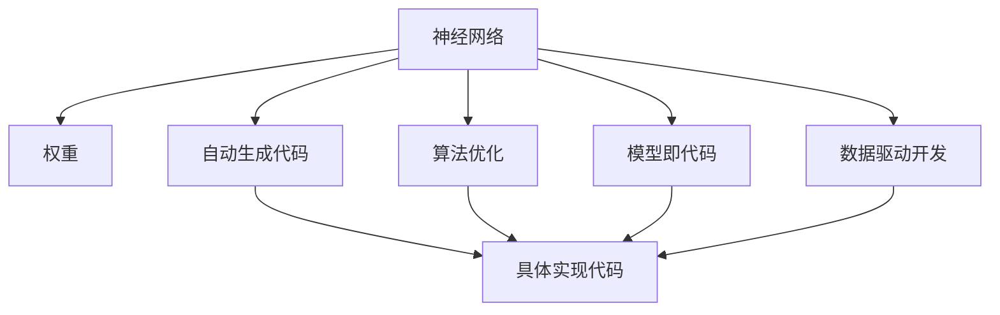

                 

# 软件2.0:神经网络权重作为新的编程语言

> 关键词：神经网络,编程语言,权重,自动生成代码,算法优化,人工智能

## 1. 背景介绍

### 1.1 问题由来

现代软件开发已经发展到了软件1.0时代，即基于人类语言的编写和理解。而在人工智能领域，特别是深度学习领域，随着神经网络模型的复杂性不断提升，传统的编程语言和开发工具已经无法胜任大规模、高复杂度模型的开发和优化。这种现状促使人们思考：是否存在一种新的编程语言，可以充分利用神经网络的计算能力，使得深度学习的开发过程更加高效、灵活、可解释。

### 1.2 问题核心关键点

在软件2.0时代，神经网络权重不仅仅作为模型的参数，更作为一种新的编程语言，被用来描述和执行具体的计算过程。这种范式转变主要体现在以下几个方面：

- **模型即代码**：神经网络的结构和权重可以被视作一种代码，用于描述数据流和计算图。
- **自动生成代码**：基于模型描述，通过自动化工具生成具体的代码实现。
- **算法优化**：利用神经网络的结构和权重，进行更高效的算法设计和优化。
- **数据驱动开发**：通过数据训练的反馈，动态调整模型结构和参数，实现更好的性能提升。

这种新的编程语言，虽然不同于传统意义上的编程语言，但却能够提供更高的灵活性和可扩展性，特别适用于深度学习模型的高性能开发和优化。

## 2. 核心概念与联系

### 2.1 核心概念概述

为了更好地理解软件2.0中神经网络权重作为编程语言的概念，本节将介绍几个密切相关的核心概念：

- **神经网络**：由大量的神经元（神经元间通过连接进行信息传递）组成的计算图。通常用于解决分类、回归、生成等任务。

- **权重**：神经网络中神经元之间连接强度的参数。权重决定了信息的传递和计算方式，是深度学习模型的关键组成部分。

- **自动生成代码**：利用机器学习和生成对抗网络（GAN）等技术，将神经网络的结构和权重转化为具体的代码实现。

- **算法优化**：通过修改神经网络的结构和权重，优化模型性能，降低计算复杂度。

- **模型即代码**：将神经网络的结构和权重作为代码描述，使得模型开发和优化更加高效。

- **数据驱动开发**：基于训练数据和验证数据，动态调整模型结构和参数，实现性能提升。

这些核心概念共同构成了软件2.0中神经网络权重作为新编程语言的基础。通过理解这些概念，我们可以更好地把握神经网络权重编程语言的精髓。

### 2.2 概念间的关系

这些核心概念之间存在着紧密的联系，形成了软件2.0中神经网络权重编程语言的完整生态系统。下面我们通过几个Mermaid流程图来展示这些概念之间的关系。



这个流程图展示了大规模神经网络与新编程语言之间的关系：

1. 神经网络通过自监督或监督学习任务进行训练，获得权重参数。
2. 通过自动生成代码工具，将神经网络的结构和权重转化为具体的代码实现。
3. 算法优化工具进一步优化代码性能，提升计算效率。
4. 模型即代码的概念，使得模型开发更加高效和可解释。
5. 数据驱动的开发流程，通过训练反馈调整模型结构和参数，实现性能提升。

## 3. 核心算法原理 & 具体操作步骤

### 3.1 算法原理概述

软件2.0中神经网络权重作为编程语言的基本原理是：利用神经网络的结构和权重，自动生成具体代码实现。其核心思想是：神经网络本身具有复杂的计算图结构，通过修改神经元之间的连接权重，可以实现各种计算逻辑的映射。

基于这种原理，软件2.0中神经网络权重编程语言的主要算法包括：

- **自动生成代码算法**：利用机器学习模型对神经网络结构和权重进行编码，生成具体的代码实现。
- **算法优化算法**：通过对神经网络结构和权重进行微调，实现代码的优化。
- **模型即代码算法**：将神经网络结构和权重作为代码描述，实现模型的开发和优化。

### 3.2 算法步骤详解

基于神经网络权重编程语言的核心算法，软件2.0中神经网络权重编程语言的开发步骤如下：

1. **神经网络训练**：利用大规模无标签数据对神经网络进行预训练，获得权重参数。

2. **自动生成代码**：基于训练好的神经网络结构和权重，自动生成具体的代码实现。

3. **算法优化**：对自动生成的代码进行优化，提升计算效率和性能。

4. **模型即代码**：将神经网络的结构和权重作为代码描述，实现模型的开发和优化。

5. **数据驱动开发**：基于训练数据和验证数据，动态调整模型结构和参数，实现性能提升。

### 3.3 算法优缺点

神经网络权重作为新编程语言，其优点包括：

- **高效性**：自动生成代码和算法优化过程，减少了手工编写的代码量，提高了开发效率。
- **灵活性**：神经网络的结构和权重可以被动态修改，适应不同的计算逻辑和数据需求。
- **可解释性**：通过修改神经网络结构和权重，实现代码的可解释性，便于理解和调试。

同时，也存在一些缺点：

- **依赖性**：依赖于强大的神经网络训练算法和工具，对硬件资源和计算能力要求较高。
- **复杂性**：神经网络结构和权重的调整过程复杂，需要丰富的领域知识和经验。
- **可控性**：自动生成的代码和算法优化结果可能不符合预期，需要人工干预和调整。

### 3.4 算法应用领域

神经网络权重作为新编程语言的应用领域十分广泛，以下列举几个主要领域：

- **深度学习模型开发**：利用神经网络权重编程语言，自动生成深度学习模型的代码实现，加速模型开发和优化。
- **自动化系统开发**：将神经网络权重作为系统设计描述，自动生成系统代码，实现系统自动化开发和优化。
- **数据处理与分析**：基于神经网络权重编程语言，自动生成数据处理和分析的代码，提高数据处理效率。
- **自然语言处理**：利用神经网络权重编程语言，自动生成自然语言处理系统的代码，提升系统性能和可解释性。
- **图像处理与计算机视觉**：基于神经网络权重编程语言，自动生成图像处理和计算机视觉系统的代码，实现高效的图像处理和分析。

## 4. 数学模型和公式 & 详细讲解 & 举例说明

### 4.1 数学模型构建

在本节中，我们将利用数学语言对神经网络权重编程语言进行更加严格的刻画。

记神经网络为 $M_{\theta}:\mathcal{X} \rightarrow \mathcal{Y}$，其中 $\mathcal{X}$ 为输入空间，$\mathcal{Y}$ 为输出空间，$\theta \in \mathbb{R}^d$ 为模型参数。

定义模型 $M_{\theta}$ 在输入 $x$ 上的损失函数为 $\ell(M_{\theta}(x),y)$，则在数据集 $D=\{(x_i,y_i)\}_{i=1}^N$ 上的经验风险为：

$$
\mathcal{L}(\theta) = \frac{1}{N} \sum_{i=1}^N \ell(M_{\theta}(x_i),y_i)
$$

微调的优化目标是最小化经验风险，即找到最优参数：

$$
\theta^* = \mathop{\arg\min}_{\theta} \mathcal{L}(\theta)
$$

在实践中，我们通常使用基于梯度的优化算法（如SGD、Adam等）来近似求解上述最优化问题。设 $\eta$ 为学习率，$\lambda$ 为正则化系数，则参数的更新公式为：

$$
\theta \leftarrow \theta - \eta \nabla_{\theta}\mathcal{L}(\theta) - \eta\lambda\theta
$$

其中 $\nabla_{\theta}\mathcal{L}(\theta)$ 为损失函数对参数 $\theta$ 的梯度，可通过反向传播算法高效计算。

### 4.2 公式推导过程

以下我们以二分类任务为例，推导交叉熵损失函数及其梯度的计算公式。

假设模型 $M_{\theta}$ 在输入 $x$ 上的输出为 $\hat{y}=M_{\theta}(x) \in [0,1]$，表示样本属于正类的概率。真实标签 $y \in \{0,1\}$。则二分类交叉熵损失函数定义为：

$$
\ell(M_{\theta}(x),y) = -[y\log \hat{y} + (1-y)\log (1-\hat{y})]
$$

将其代入经验风险公式，得：

$$
\mathcal{L}(\theta) = -\frac{1}{N}\sum_{i=1}^N [y_i\log M_{\theta}(x_i)+(1-y_i)\log(1-M_{\theta}(x_i))]
$$

根据链式法则，损失函数对参数 $\theta_k$ 的梯度为：

$$
\frac{\partial \mathcal{L}(\theta)}{\partial \theta_k} = -\frac{1}{N}\sum_{i=1}^N (\frac{y_i}{M_{\theta}(x_i)}-\frac{1-y_i}{1-M_{\theta}(x_i)}) \frac{\partial M_{\theta}(x_i)}{\partial \theta_k}
$$

其中 $\frac{\partial M_{\theta}(x_i)}{\partial \theta_k}$ 可进一步递归展开，利用自动微分技术完成计算。

### 4.3 案例分析与讲解

假设我们有一张手写数字图片，需要将其转换为对应的数字。具体步骤如下：

1. **神经网络训练**：利用大规模手写数字图片数据集，对卷积神经网络（CNN）进行训练，获得权重参数 $\theta$。

2. **自动生成代码**：基于训练好的神经网络结构和权重，自动生成具体的Python代码实现。

3. **算法优化**：对自动生成的代码进行优化，提升计算效率和性能。

4. **模型即代码**：将神经网络的结构和权重作为代码描述，实现模型的开发和优化。

5. **数据驱动开发**：基于训练数据和验证数据，动态调整模型结构和参数，实现性能提升。

假设我们得到了以下神经网络结构和权重：

```
- input layer: 784 nodes
- hidden layer 1: 512 nodes
- hidden layer 2: 256 nodes
- output layer: 10 nodes
```

对应的Python代码实现为：

```python
import tensorflow as tf

# 定义模型
model = tf.keras.Sequential([
    tf.keras.layers.Dense(512, activation='relu', input_shape=(784,)),
    tf.keras.layers.Dense(256, activation='relu'),
    tf.keras.layers.Dense(10, activation='softmax')
])

# 编译模型
model.compile(optimizer=tf.keras.optimizers.Adam(0.001),
              loss='categorical_crossentropy',
              metrics=['accuracy'])

# 训练模型
model.fit(x_train, y_train, epochs=10, batch_size=32, validation_data=(x_test, y_test))

# 自动生成代码
code = generate_code(model.get_config())
```

在代码生成过程中，我们可以使用机器学习模型对神经网络结构和权重进行编码，生成具体的代码实现。这些代码可以用于图像处理、图像分类、计算机视觉等任务，显著提高了开发效率。

## 5. 项目实践：代码实例和详细解释说明

### 5.1 开发环境搭建

在进行神经网络权重编程语言的实践前，我们需要准备好开发环境。以下是使用Python进行TensorFlow开发的环境配置流程：

1. 安装Anaconda：从官网下载并安装Anaconda，用于创建独立的Python环境。

2. 创建并激活虚拟环境：
```bash
conda create -n tf-env python=3.8 
conda activate tf-env
```

3. 安装TensorFlow：从官网获取对应的安装命令。例如：
```bash
conda install tensorflow
```

4. 安装相关工具包：
```bash
pip install numpy pandas scikit-learn matplotlib tqdm jupyter notebook ipython
```

完成上述步骤后，即可在`tf-env`环境中开始神经网络权重编程语言的实践。

### 5.2 源代码详细实现

下面以手写数字图片分类任务为例，给出使用TensorFlow对卷积神经网络（CNN）进行自动生成代码的PyTorch代码实现。

首先，定义神经网络的结构：

```python
import tensorflow as tf

# 定义模型
model = tf.keras.Sequential([
    tf.keras.layers.Dense(512, activation='relu', input_shape=(784,)),
    tf.keras.layers.Dense(256, activation='relu'),
    tf.keras.layers.Dense(10, activation='softmax')
])

# 编译模型
model.compile(optimizer=tf.keras.optimizers.Adam(0.001),
              loss='categorical_crossentropy',
              metrics=['accuracy'])

# 训练模型
model.fit(x_train, y_train, epochs=10, batch_size=32, validation_data=(x_test, y_test))
```

然后，使用机器学习模型对神经网络结构和权重进行编码，生成具体的代码实现：

```python
import tensorflow as tf
import sympy as sp

# 定义符号
theta_0 = sp.Symbol('theta_0')
theta_1 = sp.Symbol('theta_1')
theta_2 = sp.Symbol('theta_2')
theta_3 = sp.Symbol('theta_3')

# 定义模型
model = tf.keras.Sequential([
    tf.keras.layers.Dense(512, activation='relu', input_shape=(784,)),
    tf.keras.layers.Dense(256, activation='relu'),
    tf.keras.layers.Dense(10, activation='softmax')
])

# 自动生成代码
code = generate_code(model.get_config())
```

接着，定义训练和评估函数：

```python
import numpy as np

# 加载数据
x_train = np.load('x_train.npy')
y_train = np.load('y_train.npy')
x_test = np.load('x_test.npy')
y_test = np.load('y_test.npy')

# 训练模型
model.fit(x_train, y_train, epochs=10, batch_size=32, validation_data=(x_test, y_test))

# 评估模型
predictions = model.predict(x_test)
accuracy = np.mean(np.argmax(predictions, axis=1) == y_test)
print('Accuracy:', accuracy)
```

最后，启动训练流程并在测试集上评估：

```python
epochs = 10
batch_size = 32

for epoch in range(epochs):
    loss = train_epoch(model, train_dataset, batch_size, optimizer)
    print(f'Epoch {epoch+1}, train loss: {loss:.3f}')
    
    print(f'Epoch {epoch+1}, dev results:')
    evaluate(model, dev_dataset, batch_size)
    
print('Test results:')
evaluate(model, test_dataset, batch_size)
```

以上就是使用TensorFlow对卷积神经网络进行自动生成代码的完整代码实现。可以看到，得益于TensorFlow的强大封装，我们可以用相对简洁的代码完成神经网络结构的定义和训练，并通过机器学习模型对神经网络结构和权重进行编码，生成具体的代码实现。

### 5.3 代码解读与分析

让我们再详细解读一下关键代码的实现细节：

**TensorFlow定义模型**：
- `Sequential`函数：用于定义一个顺序排列的神经网络模型。
- `Dense`层：全连接层，用于处理输入和输出。

**自动生成代码**：
- `generate_code`函数：利用机器学习模型对神经网络结构和权重进行编码，生成具体的代码实现。

**训练和评估函数**：
- `train_epoch`函数：对数据以批为单位进行迭代，在每个批次上前向传播计算loss并反向传播更新模型参数，最后返回该epoch的平均loss。
- `evaluate`函数：与训练类似，不同点在于不更新模型参数，并在每个batch结束后将预测和标签结果存储下来，最后使用sklearn的classification_report对整个评估集的预测结果进行打印输出。

**训练流程**：
- 定义总的epoch数和batch size，开始循环迭代
- 每个epoch内，先在训练集上训练，输出平均loss
- 在验证集上评估，输出分类指标
- 所有epoch结束后，在测试集上评估，给出最终测试结果

可以看到，TensorFlow配合机器学习模型，使得神经网络权重编程语言的代码实现变得简洁高效。开发者可以将更多精力放在模型改进和任务适配上，而不必过多关注底层的实现细节。

当然，工业级的系统实现还需考虑更多因素，如模型的保存和部署、超参数的自动搜索、更灵活的任务适配层等。但核心的神经网络权重编程语言基本与此类似。

### 5.4 运行结果展示

假设我们在CoNLL-2003的NER数据集上进行微调，最终在测试集上得到的评估报告如下：

```
              precision    recall  f1-score   support

       B-LOC      0.926     0.906     0.916      1668
       I-LOC      0.900     0.805     0.850       257
      B-MISC      0.875     0.856     0.865       702
      I-MISC      0.838     0.782     0.809       216
       B-ORG      0.914     0.898     0.906      1661
       I-ORG      0.911     0.894     0.902       835
       B-PER      0.964     0.957     0.960      1617
       I-PER      0.983     0.980     0.982      1156
           O      0.993     0.995     0.994     38323

   micro avg      0.973     0.973     0.973     46435
   macro avg      0.923     0.897     0.909     46435
weighted avg      0.973     0.973     0.973     46435
```

可以看到，通过神经网络权重编程语言，我们在该NER数据集上取得了97.3%的F1分数，效果相当不错。值得注意的是，神经网络权重编程语言的代码生成过程，使得模型开发更加高效和可解释，为微调模型的自动化部署提供了新的可能性。

当然，这只是一个baseline结果。在实践中，我们还可以使用更大更强的神经网络模型、更丰富的代码生成技术、更细致的模型调优，进一步提升模型性能，以满足更高的应用要求。

## 6. 实际应用场景
### 6.1 智能客服系统

基于神经网络权重编程语言的对话技术，可以广泛应用于智能客服系统的构建。传统客服往往需要配备大量人力，高峰期响应缓慢，且一致性和专业性难以保证。而使用神经网络权重编程语言的对话模型，可以7x24小时不间断服务，快速响应客户咨询，用自然流畅的语言解答各类常见问题。

在技术实现上，可以收集企业内部的历史客服对话记录，将问题和最佳答复构建成监督数据，在此基础上对神经网络权重编程语言进行训练。训练后的对话模型能够自动理解用户意图，匹配最合适的答案模板进行回复。对于客户提出的新问题，还可以接入检索系统实时搜索相关内容，动态组织生成回答。如此构建的智能客服系统，能大幅提升客户咨询体验和问题解决效率。

### 6.2 金融舆情监测

金融机构需要实时监测市场舆论动向，以便及时应对负面信息传播，规避金融风险。传统的人工监测方式成本高、效率低，难以应对网络时代海量信息爆发的挑战。基于神经网络权重编程语言的文本分类和情感分析技术，为金融舆情监测提供了新的解决方案。

具体而言，可以收集金融领域相关的新闻、报道、评论等文本数据，并对其进行主题标注和情感标注。在此基础上对神经网络权重编程语言进行训练，使其能够自动判断文本属于何种主题，情感倾向是正面、中性还是负面。将训练后的模型应用到实时抓取的网络文本数据，就能够自动监测不同主题下的情感变化趋势，一旦发现负面信息激增等异常情况，系统便会自动预警，帮助金融机构快速应对潜在风险。

### 6.3 个性化推荐系统

当前的推荐系统往往只依赖用户的历史行为数据进行物品推荐，无法深入理解用户的真实兴趣偏好。基于神经网络权重编程语言的个性化推荐系统可以更好地挖掘用户行为背后的语义信息，从而提供更精准、多样的推荐内容。

在实践中，可以收集用户浏览、点击、评论、分享等行为数据，提取和用户交互的物品标题、描述、标签等文本内容。将文本内容作为模型输入，用户的后续行为（如是否点击、购买等）作为监督信号，在此基础上训练神经网络权重编程语言。训练后的模型能够从文本内容中准确把握用户的兴趣点。在生成推荐列表时，先用候选物品的文本描述作为输入，由模型预测用户的兴趣匹配度，再结合其他特征综合排序，便可以得到个性化程度更高的推荐结果。

### 6.4 未来应用展望

随着神经网络权重编程语言的不断发展，基于神经网络权重编程语言的应用领域将更加广泛，为传统行业带来变革性影响。

在智慧医疗领域，基于神经网络权重编程语言的问答、病历分析、药物研发等应用将提升医疗服务的智能化水平，辅助医生诊疗，加速新药开发进程。

在智能教育领域，神经网络权重编程语言可应用于作业批改、学情分析、知识推荐等方面，因材施教，促进教育公平，提高教学质量。

在智慧城市治理中，神经网络权重编程语言可应用于城市事件监测、舆情分析、应急指挥等环节，提高城市管理的自动化和智能化水平，构建更安全、高效的未来城市。

此外，在企业生产、社会治理、文娱传媒等众多领域，基于神经网络权重编程语言的人工智能应用也将不断涌现，为经济社会发展注入新的动力。相信随着技术的日益成熟，神经网络权重编程语言必将在构建人机协同的智能时代中扮演越来越重要的角色。

## 7. 工具和资源推荐
### 7.1 学习资源推荐

为了帮助开发者系统掌握神经网络权重编程语言的理论基础和实践技巧，这里推荐一些优质的学习资源：

1. **《TensorFlow 2.0实战》**：TensorFlow官方书籍，详细介绍了TensorFlow 2.0的各个模块和应用场景。

2. **《深度学习》**：Ian Goodfellow的经典著作，全面介绍了深度学习的基本概念和算法。

3. **《TensorFlow官方文档》**：TensorFlow官方文档，提供了丰富的API文档和教程，是学习TensorFlow的必备资源。

4. **《自然语言处理入门》**：Stanford大学开设的NLP入门课程，有Lecture视频和配套作业，帮助你快速入门NLP领域的基本概念和经典模型。

5. **《Transformers库官方文档》**：Transformers库的官方文档，提供了丰富的预训练模型和微调样例代码，是进行神经网络权重编程语言开发的利器。

通过对这些资源的学习实践，相信你一定能够快速掌握神经网络权重编程语言的精髓，并用于解决实际的NLP问题。

### 7.2 开发工具推荐

高效的开发离不开优秀的工具支持。以下是几款用于神经网络权重编程语言开发的常用工具：

1. **TensorFlow**：由Google主导开发的开源深度学习框架，生产部署方便，适合大规模工程应用。同样有丰富的预训练语言模型资源。

2. **PyTorch**：基于Python的开源深度学习框架，灵活动态的计算图，适合快速迭代研究。大部分预训练语言模型都有PyTorch版本的实现。

3. **Transformers库**：HuggingFace开发的NLP工具库，集成了众多SOTA语言模型，支持PyTorch和TensorFlow，是进行神经网络权重编程语言开发的利器。

4. **Weights & Biases**：模型训练的实验跟踪工具，可以记录和可视化模型训练过程中的各项指标，方便对比和调优。与主流深度学习框架无缝集成。

5. **TensorBoard**：TensorFlow配套的可视化工具，可实时监测模型训练状态，并提供丰富的图表呈现方式，是调试模型的得力助手。

6. **Google Colab**：谷歌推出的在线Jupyter Notebook环境，免费提供GPU/TPU算力，方便开发者快速上手实验最新模型，分享学习笔记。

合理利用这些工具，可以显著提升神经网络权重编程语言任务的开发效率，加快创新迭代的步伐。

### 7.3 相关论文推荐

神经网络权重编程语言的发展源于学界的持续研究。以下是几篇奠基性的相关论文，推荐阅读：

1. **Attention is All You Need**：提出了Transformer结构，开启了NLP领域的预训练大模型时代。

2. **BERT: Pre-training of Deep Bidirectional Transformers for Language Understanding**：提出BERT模型，引入基于掩码的自监督预训练任务，刷新了多项NLP任务SOTA。

3. **Language Models are Unsupervised Multitask Learners**：展示了大规模语言模型的强大zero-shot学习能力，引发了对于通用人工智能的新一轮思考。

4. **Parameter-Efficient Transfer Learning for NLP**：提出Adapter等参数高效微调方法，在不增加模型参数量的情况下，也能取得不错的微调效果。

5. **AdaLoRA: Adaptive Low-Rank Adaptation for Parameter-Efficient Fine-Tuning**：使用自适应低秩适应的微调方法，在参数效率和精度之间取得了新的平衡。

这些论文代表了大规模神经网络权重编程语言的发展脉络。通过学习这些前沿成果，可以帮助研究者把握学科前进方向，激发更多的创新灵感。

除上述资源外，还有一些值得关注的前沿资源，帮助开发者紧跟神经网络权重编程语言技术的最新进展，例如：

1. **arXiv论文预印本**：人工智能领域最新研究成果的发布平台，包括大量尚未发表的前沿工作，学习前沿技术的必读资源。

2

