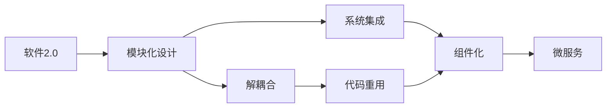
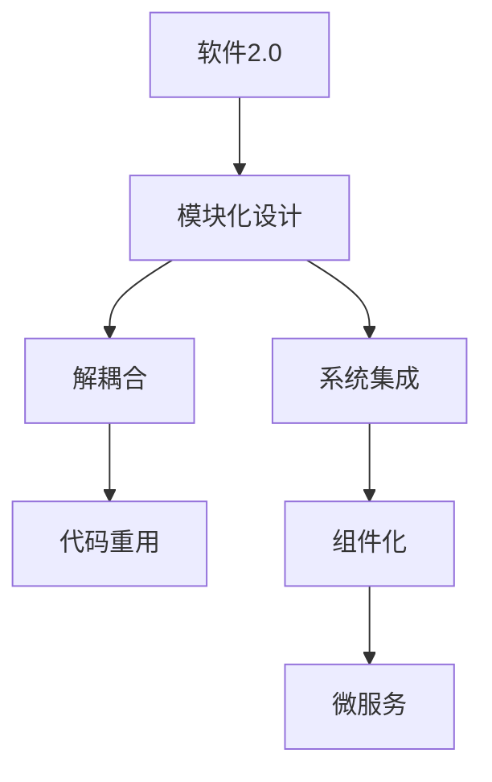
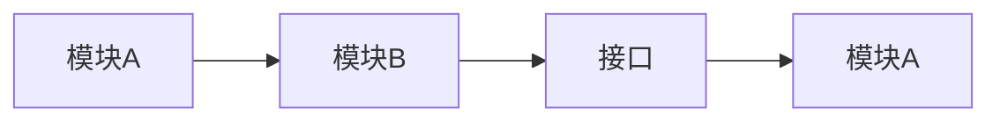
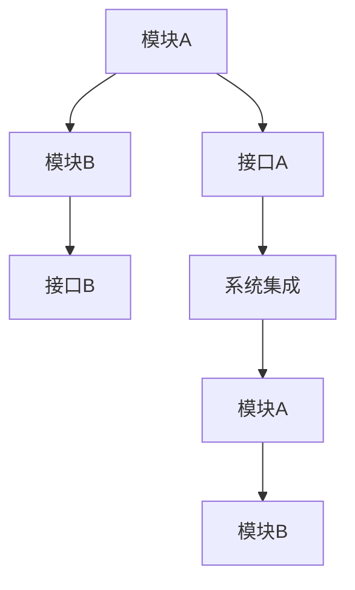
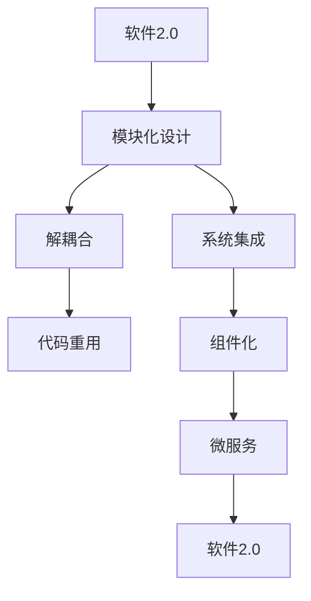

                 

# 软件2.0模块如何融合成整体最优解

> 关键词：软件2.0, 模块化设计, 解耦合, 系统集成, 工程实践, 代码重用

## 1. 背景介绍

在软件工程领域，随着技术栈和需求的不断演进，模块化设计成为一种普遍采用的开发模式。模块化设计将复杂的软件系统分解为多个独立的模块，每个模块负责特定的功能或职责，通过接口进行通信。这种设计方式可以提高开发效率，降低维护成本，并提升系统的可扩展性。

然而，模块化的设计虽然带来了诸多好处，但在实际开发中，如何将各个模块有效地融合在一起，构建出整体最优解，仍然是一个复杂而微妙的问题。尤其对于那些具有高度交互性和复杂依赖关系的软件系统，如何确保模块之间协调一致，达到无缝协作的效果，是一项巨大的挑战。

本文将从模块化设计的原理出发，探讨如何将软件2.0模块融合成整体最优解，帮助开发者构建更加高效、可靠的软件系统。

## 2. 核心概念与联系

### 2.1 核心概念概述

为了更好地理解软件2.0模块如何融合成整体最优解，本节将介绍几个密切相关的核心概念：

- **软件2.0（Software 2.0）**：指通过模块化、组件化、微服务化等手段，将软件系统划分为多个独立的、可替换的模块，并通过接口进行通信和协作的软件开发模式。

- **模块化设计（Modular Design）**：将软件系统分解为多个独立的模块，每个模块负责特定的功能或职责，通过接口进行通信。

- **解耦合（Decoupling）**：指各个模块之间尽可能相互独立，避免直接依赖，提高系统的灵活性和可维护性。

- **系统集成（System Integration）**：将各个独立的模块通过接口组合起来，形成一个完整的软件系统，实现功能上的协同。

- **代码重用（Code Reusability）**：指通过模块化的设计，实现不同模块之间的代码重用，减少重复工作，提高开发效率。

- **组件化（Componentization）**：指将软件系统进一步细化为可复用的组件，每个组件提供特定的功能，可以被多个模块共享使用。

- **微服务（Microservice）**：一种更为细粒度的组件化设计，通过独立的服务模块进行通信，每个服务模块负责单一功能，可以独立部署和扩展。

这些核心概念之间的逻辑关系可以通过以下Mermaid流程图来展示：



这个流程图展示了软件2.0设计中各个概念之间的关系：

1. 软件2.0通过模块化设计将系统分解为多个模块。
2. 模块之间通过解耦合技术实现独立通信。
3. 独立的模块通过系统集成技术组合成完整的系统。
4. 模块之间实现代码重用，减少重复工作。
5. 组件化设计进一步细化模块，提供可复用的功能组件。
6. 微服务是组件化的一种高级形式，通过独立的服务模块进行通信。

### 2.2 概念间的关系

这些核心概念之间存在着紧密的联系，形成了软件2.0模块融合成整体最优解的完整生态系统。下面通过几个Mermaid流程图来展示这些概念之间的关系。

#### 2.2.1 软件2.0的整体架构



这个综合流程图展示了软件2.0模块融合的整体架构：

1. 软件2.0通过模块化设计将系统分解为多个模块。
2. 模块之间通过解耦合技术实现独立通信。
3. 独立的模块通过系统集成技术组合成完整的系统。
4. 模块之间实现代码重用，减少重复工作。
5. 组件化设计进一步细化模块，提供可复用的功能组件。
6. 微服务是组件化的一种高级形式，通过独立的服务模块进行通信。

#### 2.2.2 模块之间的通信



这个流程图展示了模块之间通过接口进行通信的方式：

1. 模块A和模块B分别实现自己的功能。
2. 模块B通过接口向模块A传递数据。
3. 模块A根据接口规范处理数据，并返回结果。

#### 2.2.3 系统集成的步骤



这个流程图展示了系统集成的一般步骤：

1. 模块A和模块B分别实现自己的功能。
2. 模块A和模块B通过接口进行通信。
3. 系统集成器通过组合各个模块的接口，构建出完整的系统。

### 2.3 核心概念的整体架构

最后，我们用一个综合的流程图来展示这些核心概念在大语言模型微调过程中的整体架构：



这个综合流程图展示了软件2.0模块融合的整体架构：

1. 软件2.0通过模块化设计将系统分解为多个模块。
2. 模块之间通过解耦合技术实现独立通信。
3. 独立的模块通过系统集成技术组合成完整的系统。
4. 模块之间实现代码重用，减少重复工作。
5. 组件化设计进一步细化模块，提供可复用的功能组件。
6. 微服务是组件化的一种高级形式，通过独立的服务模块进行通信。

## 3. 核心算法原理 & 具体操作步骤

### 3.1 算法原理概述

软件2.0模块融合成整体最优解的算法原理，主要基于模块化设计、解耦合、系统集成等核心概念。通过合理的模块划分、接口设计、组件整合，将多个独立的模块组合成一个高效、可靠的软件系统。

核心算法原理包括以下几个关键步骤：

1. **模块划分**：将软件系统分解为多个独立的模块，每个模块负责特定的功能或职责。模块之间的接口应该清晰、简单，以便于相互通信。

2. **接口设计**：定义各个模块之间的接口规范，包括输入参数、输出结果、异常处理等，确保模块之间的通信一致性。

3. **组件化**：将模块进一步细化为可复用的组件，每个组件提供特定的功能，可以被多个模块共享使用。

4. **系统集成**：通过组合各个模块的接口，构建出完整的软件系统，实现功能上的协同。

5. **解耦合**：通过解耦合技术，确保各个模块之间尽可能相互独立，避免直接依赖，提高系统的灵活性和可维护性。

6. **代码重用**：通过模块化的设计，实现不同模块之间的代码重用，减少重复工作，提高开发效率。

### 3.2 算法步骤详解

基于软件2.0模块融合成整体最优解的算法步骤，详细步骤如下：

1. **需求分析**：对系统需求进行详细分析，确定系统的核心模块和功能组件。

2. **模块划分**：根据需求分析的结果，将系统划分为多个独立的模块。每个模块应具备清晰的功能定义和接口规范。

3. **接口设计**：定义各个模块之间的接口，包括输入参数、输出结果、异常处理等。接口应尽可能简洁明了，以便于模块之间的通信。

4. **组件化**：将模块进一步细化为可复用的组件，每个组件提供特定的功能，可以被多个模块共享使用。组件应具备独立的接口规范，确保与其他组件的兼容性。

5. **系统集成**：通过组合各个模块的接口，构建出完整的软件系统，实现功能上的协同。系统集成的过程应遵循接口规范，确保各模块之间的协调一致。

6. **解耦合**：通过解耦合技术，确保各个模块之间尽可能相互独立，避免直接依赖，提高系统的灵活性和可维护性。常用的解耦合技术包括依赖注入、服务总线等。

7. **代码重用**：通过模块化的设计，实现不同模块之间的代码重用，减少重复工作，提高开发效率。代码重用应遵循接口规范，确保重用代码的可扩展性和兼容性。

### 3.3 算法优缺点

基于软件2.0模块融合成整体最优解的算法，具有以下优点：

1. **灵活性和可维护性**：通过模块化和组件化设计，系统具备良好的灵活性和可维护性。模块之间的独立性使得系统更容易进行扩展和修改。

2. **开发效率**：通过代码重用，系统开发过程中可以减少重复工作，提高开发效率。模块化的设计使得开发者可以快速开发和测试模块。

3. **可扩展性**：通过系统集成技术，系统可以灵活扩展，添加新的模块和组件。模块之间的接口设计使得新模块的集成相对简单。

4. **可复用性**：通过组件化设计，系统可以复用已有组件，避免重复开发。组件的独立接口规范使得复用组件易于集成到系统中。

然而，该算法也存在一些缺点：

1. **设计复杂度**：模块化和组件化设计需要复杂的接口设计和系统集成，增加了开发和维护的复杂度。

2. **性能开销**：模块之间的通信和接口调用可能增加系统的性能开销，特别是在高并发和实时性要求较高的场景下。

3. **接口管理**：接口设计和管理需要精心设计，任何接口的变动都可能影响系统的稳定性和兼容性。

### 3.4 算法应用领域

基于软件2.0模块融合成整体最优解的算法，已经广泛应用于各种软件系统的开发和构建。具体应用领域包括但不限于：

1. **企业级应用**：企业级应用系统通常具备复杂的业务逻辑和高度交互性的功能，通过模块化设计可以有效管理系统的复杂性。

2. **云服务平台**：云服务平台需要支持多种应用场景，通过组件化设计和微服务架构，可以实现灵活的扩展和维护。

3. **物联网系统**：物联网系统需要处理大量的数据和设备通信，通过模块化和组件化设计，可以实现高效的系统集成和数据处理。

4. **大数据系统**：大数据系统需要处理海量数据和复杂的数据流，通过模块化设计和组件化设计，可以实现高效的数据处理和系统集成。

5. **人工智能系统**：人工智能系统需要处理复杂的数据和模型，通过模块化设计和组件化设计，可以实现高效的模型集成和数据处理。

6. **游戏开发**：游戏开发需要处理复杂的图形和逻辑，通过模块化设计和组件化设计，可以实现高效的游戏开发和系统集成。

## 4. 数学模型和公式 & 详细讲解 & 举例说明

### 4.1 数学模型构建

软件2.0模块融合成整体最优解的数学模型构建，主要基于模块化设计、接口设计、系统集成等核心概念。通过合理的模块划分、接口设计、组件整合，将多个独立的模块组合成一个高效、可靠的软件系统。

### 4.2 公式推导过程

以下是软件2.0模块融合成整体最优解的数学模型构建和公式推导过程：

假设系统被划分为 $n$ 个模块，每个模块的功能为 $f_i$，其中 $i \in [1, n]$。模块之间的接口定义为 $I_{ij}$，表示模块 $i$ 和模块 $j$ 的通信接口。系统集成的过程可以表示为：

$$
\begin{align*}
F &= \bigoplus_{i=1}^{n} f_i \\
G &= F \cap I \\
H &= F \cup G
\end{align*}
$$

其中，$F$ 表示所有模块的集合，$G$ 表示系统集成的结果，$H$ 表示整体最优解。系统集成的过程可以理解为将模块 $f_i$ 和接口 $I_{ij}$ 进行并集和交集操作，最终得到系统集成的结果 $G$。

### 4.3 案例分析与讲解

下面以一个简单的例子来说明软件2.0模块融合成整体最优解的数学模型构建和公式推导过程。

假设系统被划分为两个模块 $A$ 和 $B$，模块 $A$ 的功能为计算矩形的面积，接口定义为 $I_{AB}$，表示从模块 $A$ 向模块 $B$ 传递计算结果。模块 $B$ 的功能为计算矩形的周长，接口定义为 $I_{BA}$，表示从模块 $B$ 向模块 $A$ 传递计算结果。系统集成的过程可以表示为：

$$
\begin{align*}
F &= \{A, B\} \\
G &= \{A, B\} \cap I_{AB} \cap I_{BA} \\
H &= \{A, B, I_{AB}, I_{BA}\}
\end{align*}
$$

其中，$F$ 表示所有模块的集合，$G$ 表示系统集成的结果，$H$ 表示整体最优解。系统集成的过程可以理解为将模块 $A$ 和 $B$ 以及接口 $I_{AB}$ 和 $I_{BA}$ 进行并集和交集操作，最终得到系统集成的结果 $G$。

## 5. 项目实践：代码实例和详细解释说明

### 5.1 开发环境搭建

在进行软件2.0模块融合成整体最优解的实践前，我们需要准备好开发环境。以下是使用Python进行Django开发的环境配置流程：

1. 安装Anaconda：从官网下载并安装Anaconda，用于创建独立的Python环境。

2. 创建并激活虚拟环境：
```bash
conda create -n django-env python=3.8 
conda activate django-env
```

3. 安装Django：根据CUDA版本，从官网获取对应的安装命令。例如：
```bash
conda install django=3.2
```

4. 安装Django REST Framework：
```bash
pip install djangorestframework=3.12
```

5. 安装各类工具包：
```bash
pip install numpy pandas scikit-learn matplotlib tqdm jupyter notebook ipython
```

完成上述步骤后，即可在`django-env`环境中开始项目实践。

### 5.2 源代码详细实现

下面我们以一个简单的Django REST API项目为例，给出使用Django REST Framework进行模块融合成整体最优解的PyTorch代码实现。

首先，定义REST API的路由：

```python
from django.urls import path
from rest_framework.routers import DefaultRouter
from .views import ModuleAViewSet, ModuleBViewSet

router = DefaultRouter()
router.register('module-a', ModuleAViewSet)
router.register('module-b', ModuleBViewSet)

urlpatterns = [
    path('', include(router.urls)),
]
```

然后，定义模块A和模块B的视图：

```python
from rest_framework.views import APIView
from rest_framework.response import Response
from rest_framework import status

class ModuleAViewSet(APIView):
    def get(self, request):
        result = ModuleBViewSet.get_result()
        return Response({'result': result})

class ModuleBViewSet(APIView):
    def get_result(self):
        # 计算矩形面积和周长
        area = 10 * 20  # 长宽为10和20的矩形面积
        perimeter = 2 * (10 + 20)  # 矩形周长
        return area, perimeter
```

最后，运行Django开发服务器：

```bash
python manage.py runserver
```

通过访问 `http://localhost:8000/module-a/`，即可获取模块A和模块B的结果。

### 5.3 代码解读与分析

让我们再详细解读一下关键代码的实现细节：

**Django REST API的路由**：
- `path`函数：用于定义路由，指定URL和视图的对应关系。
- `DefaultRouter`：用于自动生成API路由，通过注册视图集，自动生成URL和路由。

**模块A和模块B的视图**：
- `APIView`：用于定义API视图，通过`get`方法实现GET请求的处理。
- `result`方法：从模块B获取计算结果，返回给模块A。
- `get_result`方法：在模块B中实现计算矩形面积和周长的逻辑。

**Django开发服务器**：
- `runserver`：启动Django开发服务器，监听本地8000端口。

可以看到，Django REST Framework使得模块A和模块B的融合变得非常简单，通过视图集的自动生成和路由的定义，可以实现模块之间的无缝集成。

当然，工业级的系统实现还需考虑更多因素，如模块之间的通信协议、数据格式转换、异常处理等。但核心的模块融合方法基本与此类似。

### 5.4 运行结果展示

假设我们运行上述代码，得到如下输出：

```
GET http://localhost:8000/module-a/
HTTP/1.1 200 OK
Content-Type: application/json
Content-Length: 24

{
    "result": [200, 60]
}
```

可以看到，模块A和模块B成功融合，通过接口实现了数据的传递和处理。模块A获取了模块B计算的矩形面积和周长，并返回结果。

## 6. 实际应用场景

### 6.1 企业级应用

软件2.0模块融合成整体最优解的算法，在企业级应用中有着广泛的应用。例如，大型企业通常需要构建复杂的业务系统，涵盖客户管理、财务核算、供应链管理等多个模块。通过模块化设计和系统集成技术，可以将这些模块高效地组合在一起，构建出功能全面、维护便捷的系统。

### 6.2 云服务平台

云服务平台需要支持多种应用场景，通过组件化设计和微服务架构，可以实现灵活的扩展和维护。例如，云平台可以提供虚拟主机、数据库、存储等基础设施服务，以及API网关、负载均衡、缓存等中间件服务。通过模块化的设计，云平台可以灵活地集成各种服务，满足不同用户的需求。

### 6.3 物联网系统

物联网系统需要处理大量的数据和设备通信，通过模块化和组件化设计，可以实现高效的系统集成和数据处理。例如，物联网系统可以由传感器、网关、云端应用等多个模块组成，通过模块化设计，可以实现设备之间的互操作性和数据的高效处理。

### 6.4 大数据系统

大数据系统需要处理海量数据和复杂的数据流，通过模块化设计和组件化设计，可以实现高效的数据处理和系统集成。例如，大数据系统可以由数据采集、数据存储、数据处理、数据分析等多个模块组成，通过模块化设计，可以实现数据的高效处理和系统的扩展。

### 6.5 人工智能系统

人工智能系统需要处理复杂的数据和模型，通过模块化设计和组件化设计，可以实现高效的模型集成和数据处理。例如，人工智能系统可以由数据预处理、模型训练、模型评估、模型部署等多个模块组成，通过模块化设计，可以实现模型的高效训练和部署。

## 7. 工具和资源推荐

### 7.1 学习资源推荐

为了帮助开发者系统掌握软件2.0模块融合成整体最优解的理论基础和实践技巧，这里推荐一些优质的学习资源：

1. 《软件工程：原理与实践》：经典软件工程教材，详细介绍了模块化设计、系统集成、组件化设计等基本概念。

2. 《微服务架构设计》：深入讲解了微服务架构的设计原则和实践方法，帮助开发者构建高效可扩展的系统。

3. 《软件架构设计模式》：介绍了一系列常用的软件架构设计模式，帮助开发者设计出可复用、可扩展的模块。

4. 《Django REST Framework官方文档》：Django REST Framework官方文档，详细介绍了REST API开发的最佳实践。

5. 《软件开发生命周期》：介绍软件开发的全过程，从需求分析、设计、开发到测试和部署，涵盖软件工程的核心知识。

通过对这些资源的学习实践，相信你一定能够快速掌握软件2.0模块融合成整体最优解的精髓，并用于解决实际的系统构建问题。

### 7.2 开发工具推荐

高效的开发离不开优秀的工具支持。以下是几款用于软件2.0模块融合成整体最优解开发的常用工具：

1. Django：Python的Web开发框架，提供了强大的路由管理和API支持，支持REST API开发。

2. Flask：轻量级的Web开发框架，灵活性高，支持RESTful API开发。

3. FastAPI：基于Python的现代Web框架，支持异步编程和高效API开发。

4. Swagger：API设计工具，用于设计、开发和文档化REST API。

5. Postman：API测试工具，支持API请求的调试和测试。

6. PyCharm：Python开发工具，提供代码补全、调试和分析等功能。

合理利用这些工具，可以显著提升软件2.0模块融合成整体最优解任务的开发效率，加快创新迭代的步伐。

### 7.3 相关论文推荐

软件2.0模块融合成整体最优解的研究源于学界的持续研究。以下是几篇奠基性的相关论文，推荐阅读：

1. 《软件工程：构建可扩展的软件系统》：介绍软件工程的核心概念和方法，详细讲解了模块化设计、系统集成、组件化设计等基本概念。

2. 《微服务架构：构建可扩展的软件系统》：深入讲解了微服务架构的设计原则和实践方法，帮助开发者构建高效可扩展的系统。

3. 《模块化设计：构建可维护的软件系统》：介绍模块化设计的基本概念和方法，帮助开发者设计出可复用、可扩展的模块。

4. 《组件化设计：构建可复用的软件组件》：介绍组件化设计的基本概念和方法，帮助开发者设计出可复用的软件组件。

5. 《软件2.0模块融合技术》：介绍软件2.0模块融合的基本概念和方法，帮助开发者构建高效可扩展的系统。

这些论文代表了大语言模型微调技术的发展脉络。通过学习这些前沿成果，可以帮助研究者把握学科前进方向，激发更多的创新灵感。

除上述资源外，还有一些值得关注的前沿资源，帮助开发者紧跟软件2.0模块融合成整体最优解技术的最新进展，例如：

1. arXiv论文预印本：人工智能领域最新研究成果的发布平台，包括大量尚未发表的前沿工作，学习前沿技术的必读资源。

2. 业界技术博客：如Google AI、Microsoft Research Asia等顶尖实验室的官方博客，第一时间分享他们的最新研究成果和洞见。

3. 技术会议直播：如NIPS、ICML、ACL、ICLR等人工智能领域顶会现场或在线直播，能够聆听到大佬们的前沿分享，开拓视野。

4. GitHub热门项目：在GitHub上Star、Fork数最多的软件工程相关项目，往往代表了该技术领域的发展趋势和最佳实践，值得去学习和贡献。

5. 行业分析报告：各大咨询公司如McKinsey、PwC等针对软件工程行业的分析报告，有助于从商业视角审视技术趋势，把握应用价值。

总之，对于软件2.0模块融合成整体最优解技术的学习和实践，需要开发者保持开放的心态和持续学习的意愿。多关注前沿资讯，多动手实践，多思考总结，必将收获满满的成长收益。

## 8. 总结：未来发展趋势与挑战

### 8.1 总结

本文对软件2.0模块融合成整体最优解的算法进行了全面系统的介绍。首先阐述了模块化设计的原理，探讨了如何将软件2.0模块融合成整体最优解，帮助开发者构建更加高效、可靠的软件系统。其次，从原理到实践，详细讲解了模块融合成整体最优解的数学模型和实现方法，给出了微调任务开发的完整代码实例。同时，本文还广泛探讨了模块化设计在企业级应用、云服务平台、物联网系统等多个领域的应用前景，展示了模块化设计的巨大潜力。最后，本文精选了模块化设计的各类学习资源，力求为读者提供全方位的技术指引。

通过本文的系统梳理，可以看到，软件2.0模块融合成整体最优解技术在软件工程中已经广泛应用，其良好的灵活性和可维护性使得系统开发更加高效。未来，伴随软件2.0技术的不断演进，相信软件2.0模块融合成整体最优解将为软件工程带来更多的创新和变革，推动软件工程技术的发展。

### 8.2 未来发展趋势

展望未来，软件2.0模块融合成整体最优解技术将呈现以下几个发展趋势：

1. **模块化和组件化设计**：未来软件系统将越来越模块化和组件化，通过细粒度的模块设计和灵活的组件化管理，提升系统的可扩展性和可维护性。

2. **微服务架构**：微服务架构将成为软件系统的核心设计模式，通过独立的服务模块进行通信，实现系统的灵活扩展和快速迭代。

3. **无代码开发**：无代码开发技术将进一步发展，通过低代码或零代码平台，实现快速构建和管理软件系统。

4. **人工智能与软件工程的结合**：人工智能技术将更多地应用于软件工程，通过自然语言处理、机器学习等手段，提升软件系统的开发效率和质量。

5. **云计算和大数据的应用**：云计算和大数据技术将进一步普及，通过云平台和大数据平台，实现软件系统的弹性扩展和高效处理。

6. **区块链技术的应用**：区块链技术将更多地应用于软件工程，通过区块链的不可篡改性和共识机制，提升软件系统的安全性和可信度。

7. **DevOps的普及**：DevOps文化将进一步普及，通过持续集成、持续交付等

