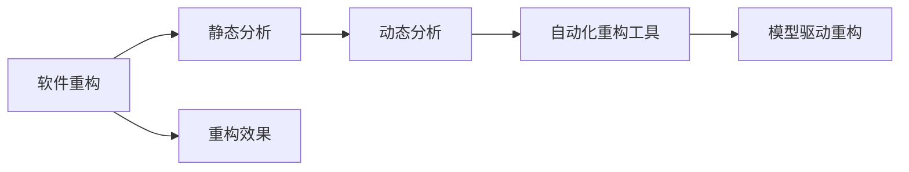
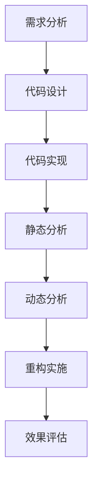
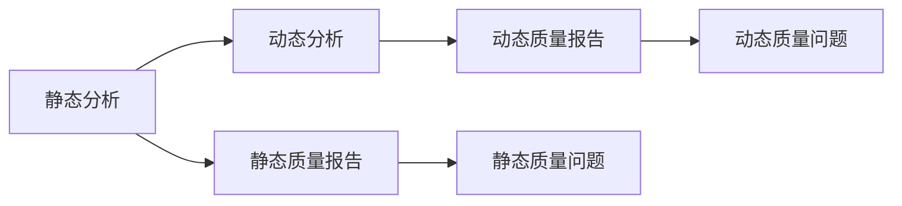
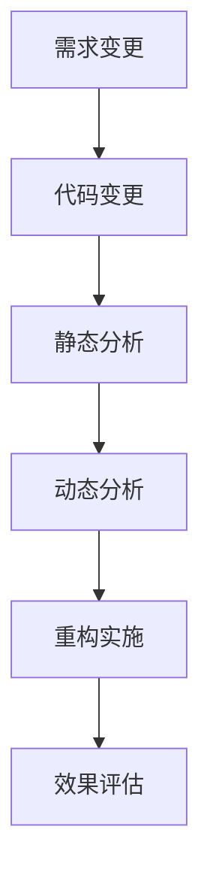
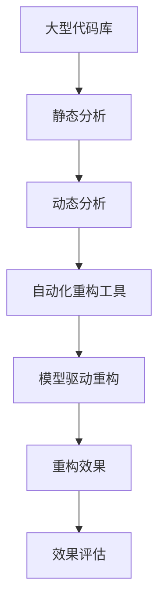

                 

# 软件2.0的代码重构技术

## 1. 背景介绍

### 1.1 问题由来

随着软件工业的飞速发展，代码重构已成为软件开发的重要环节。代码重构指的是在不改变程序功能的情况下，对源代码进行修改，以提高代码的可读性、可维护性、可扩展性和性能。它不仅能够提升软件的质量和效率，还能减少未来的技术债务。

当前，许多开发者和团队依然采用以维护为核心的代码重构方式，这在一定程度上限制了代码重构的潜力和效果。为了应对软件复杂度的不断提升，软件2.0时代需要一种更为系统、科学和高效的代码重构方法，能够更好地支持大型的、复杂的、分布式的系统开发。

### 1.2 问题核心关键点

软件2.0时代的代码重构应当具备以下几个核心关键点：

1. **自动化与系统化**：自动化的重构工具能够减少人为干预，提高重构效率，降低人为错误的风险。
2. **模型驱动与数据分析**：通过模型驱动的方法，结合数据挖掘和分析，能够发现代码中的潜在问题和优化机会，从而指导重构。
3. **静态与动态结合**：静态分析可以揭示代码的潜在问题，动态分析则可以模拟代码的实际运行情况，两者结合可以更全面地评估代码质量。
4. **跨语言与平台兼容性**：重构技术应当支持多种编程语言和平台，能够适应不同的开发环境。
5. **可解释性与透明度**：重构过程应当有良好的记录和跟踪机制，便于追溯和审查。

### 1.3 问题研究意义

软件2.0时代的代码重构技术对于提升软件开发效率、降低技术债务、保障软件质量具有重要意义：

1. **提升开发效率**：系统化的重构方法能够快速发现和解决问题，减少维护成本。
2. **降低技术债务**：重构技术能够及时修复历史代码中的缺陷，避免未来问题累积。
3. **保障软件质量**：高质量的代码是软件稳定的基础，重构技术能够提升代码的可靠性和可维护性。
4. **支持大规模分布式开发**：重构技术能够支持复杂系统的大规模开发和维护，适应现代软件开发环境。

## 2. 核心概念与联系

### 2.1 核心概念概述

为了更好地理解软件2.0时代的代码重构技术，本节将介绍几个密切相关的核心概念：

- **软件重构(Software Refactoring)**：指在不改变程序功能的情况下，对源代码进行修改，以提高代码的可读性、可维护性、可扩展性和性能。
- **静态分析(Static Analysis)**：指在编译或执行代码之前，对代码进行检查，以发现潜在的错误、性能问题和代码质量问题。
- **动态分析(Dynamic Analysis)**：指在运行代码时，对代码的行为进行监控和分析，以发现运行时的错误、性能问题和代码质量问题。
- **自动化重构工具(Auto Refactoring Tools)**：指能够自动执行代码重构的工具，能够减少人为干预，提高重构效率。
- **模型驱动重构(Model-Driven Refactoring)**：指通过模型驱动的方法，指导代码重构，能够发现更多的重构机会，提升重构效果。

这些核心概念之间的逻辑关系可以通过以下Mermaid流程图来展示：



这个流程图展示了大语言模型的核心概念及其之间的关系：

1. 软件重构以静态和动态分析为基础，结合自动化重构工具，能够实现高质量的代码重构。
2. 模型驱动重构能够提升重构效果，发现更多的重构机会。
3. 最终的目标是实现软件质量的提升，确保软件稳定性和可维护性。

### 2.2 概念间的关系

这些核心概念之间存在着紧密的联系，形成了软件2.0时代代码重构的完整生态系统。下面我们通过几个Mermaid流程图来展示这些概念之间的关系。

#### 2.2.1 软件重构的流程



这个流程图展示了软件重构的基本流程：

1. 需求分析：明确项目需求和目标。
2. 代码设计：设计代码结构和接口。
3. 代码实现：编写代码并进行测试。
4. 静态分析：对代码进行质量检查，发现潜在问题。
5. 动态分析：对代码运行情况进行监控，发现性能问题。
6. 重构实施：根据静态和动态分析结果，实施代码重构。
7. 效果评估：评估重构效果，确认是否达到预期目标。

#### 2.2.2 静态分析和动态分析的关系



这个流程图展示了静态分析和动态分析之间的关系：

1. 静态分析能够发现代码中的潜在问题和质量问题，生成静态质量报告。
2. 动态分析能够模拟代码的实际运行情况，发现运行时的错误和性能问题，生成动态质量报告。
3. 静态和动态分析相结合，能够全面评估代码质量。

#### 2.2.3 自动化重构工具的功能



这个流程图展示了自动化重构工具的功能：

1. 需求变更：识别需求变更和改进点。
2. 代码变更：生成代码变更建议。
3. 静态分析：检查代码变更建议的质量。
4. 动态分析：模拟代码变更的影响。
5. 重构实施：执行代码变更建议。
6. 效果评估：评估代码变更效果，确认是否达到预期目标。

### 2.3 核心概念的整体架构

最后，我们用一个综合的流程图来展示这些核心概念在大语言模型重构过程中的整体架构：



这个综合流程图展示了从静态分析到模型驱动重构，再到效果评估的完整过程。大型代码库通过静态分析和动态分析，结合自动化重构工具和模型驱动重构，实现了高质量的代码重构，最终通过效果评估确认是否达到预期目标。通过这些流程图，我们可以更清晰地理解软件2.0时代代码重构过程中各个核心概念的关系和作用。

## 3. 核心算法原理 & 具体操作步骤
### 3.1 算法原理概述

软件2.0时代的代码重构技术，本质上是一种基于模型驱动的、系统化的代码质量提升方法。其核心思想是通过静态和动态分析，发现代码中的潜在问题和优化机会，然后通过自动化工具实施代码重构，从而提升代码的可读性、可维护性、可扩展性和性能。

形式化地，假设代码库为 $C$，静态分析得到的质量报告为 $Q_s$，动态分析得到的质量报告为 $Q_d$。则重构的目标是找到最优的代码变更 $U$，使得：

$$
\max_{U} \{Q_s(U) + Q_d(U)\}
$$

其中 $Q_s(U)$ 和 $Q_d(U)$ 分别表示静态和动态质量评估指标，可以通过如下公式计算：

$$
Q_s(U) = \sum_{i} w_i \times C_i(U)
$$

$$
Q_d(U) = \sum_{i} w_i \times D_i(U)
$$

其中 $C_i(U)$ 和 $D_i(U)$ 分别表示静态和动态质量问题对代码的影响程度，$w_i$ 表示不同问题的影响权重。

### 3.2 算法步骤详解

软件2.0时代的代码重构一般包括以下几个关键步骤：

**Step 1: 静态分析**

- 使用静态分析工具对代码库进行质量检查，识别潜在的问题和优化机会。
- 生成静态质量报告 $Q_s$，记录问题类型、位置、影响范围等信息。

**Step 2: 动态分析**

- 使用动态分析工具模拟代码的实际运行情况，检查运行时的错误和性能问题。
- 生成动态质量报告 $Q_d$，记录问题类型、位置、影响范围等信息。

**Step 3: 重构策略制定**

- 结合静态和动态质量报告，制定重构策略，确定重构目标和优先级。
- 设计重构方案，选择合适的重构工具和算法。

**Step 4: 重构实施**

- 使用自动化重构工具对代码进行重构，执行代码变更。
- 记录重构过程，生成重构日志，便于追溯和审计。

**Step 5: 效果评估**

- 使用静态和动态分析工具评估重构效果，生成质量报告 $Q'$。
- 对比重构前后的质量报告，评估重构效果是否达到预期目标。

**Step 6: 迭代优化**

- 根据评估结果，调整重构策略，进行迭代优化。
- 不断重复以上步骤，直到代码质量达到预期。

以上是软件2.0时代代码重构的一般流程。在实际应用中，还需要针对具体项目的特点，对各个环节进行优化设计，如改进静态和动态分析模型、选择高效的自动化重构工具、制定合理的重构优先级等。

### 3.3 算法优缺点

软件2.0时代的代码重构技术具有以下优点：

1. **系统化和自动化**：能够自动发现和修复代码中的问题，减少人为干预，提高重构效率。
2. **模型驱动**：结合静态和动态分析，能够全面评估代码质量，发现更多的重构机会。
3. **可解释性**：重构过程有详细记录和审计，便于追溯和审查。

同时，该技术也存在一些局限性：

1. **复杂性**：需要结合多种分析工具和算法，操作复杂度较高。
2. **成本**：需要投入较多资源进行工具开发和重构实施。
3. **精度**：静态和动态分析的精度受限于工具和算法，可能存在误报和漏报。

尽管如此，软件2.0时代的代码重构技术在提升代码质量和开发效率方面具有显著优势，值得在大型、复杂系统中推广应用。

### 3.4 算法应用领域

软件2.0时代的代码重构技术广泛应用于软件开发、系统维护、项目管理等领域，具体包括：

1. **软件开发**：提升代码质量和开发效率，支持持续集成和持续交付。
2. **系统维护**：修复历史代码中的问题，提高系统稳定性和可维护性。
3. **项目管理**：监控代码质量，优化开发流程，支持敏捷开发和DevOps。
4. **智能运维**：通过自动化重构工具，提升系统性能，优化运维策略。
5. **测试自动化**：结合静态和动态分析，提高测试覆盖率和测试效率。

除了上述这些领域，软件2.0时代的代码重构技术在更多场景中得到了应用，如智能推荐、大数据分析、机器学习等，为相关领域提供了强有力的技术支持。

## 4. 数学模型和公式 & 详细讲解 & 举例说明
### 4.1 数学模型构建

软件2.0时代的代码重构技术，通过静态和动态分析，结合自动化工具，进行模型驱动的重构。其数学模型可以描述为如下形式：

$$
Q_s(U) = \sum_{i} w_i \times C_i(U)
$$

$$
Q_d(U) = \sum_{i} w_i \times D_i(U)
$$

$$
Q(U) = Q_s(U) + Q_d(U)
$$

其中，$C_i(U)$ 和 $D_i(U)$ 分别表示静态和动态质量问题对代码的影响程度，$w_i$ 表示不同问题的影响权重，$U$ 表示代码变更，$Q(U)$ 表示重构后的代码质量。

### 4.2 公式推导过程

以代码重构中的变量重命名为例，其重构效果可以通过以下公式推导：

$$
C_{i(U)} = k_1 \times \frac{\text{Conflicts}}{\text{Total Lines}}
$$

$$
D_{i(U)} = k_2 \times \text{Runtime}
$$

其中，$k_1$ 和 $k_2$ 分别为静态和动态质量问题的权重。

假设代码库中有一行变量名为 $x$，重构为 $y$，其重构效果可以通过如下计算公式得到：

$$
C_{i(U)} = k_1 \times \frac{1}{N}
$$

$$
D_{i(U)} = k_2 \times \text{Runtime}
$$

$$
Q(U) = \sum_{i} w_i \times (C_i(U) + D_i(U))
$$

其中，$N$ 表示代码库的总行数，$\text{Runtime}$ 表示代码变更后的运行时间。

### 4.3 案例分析与讲解

假设我们有一行代码，原始代码如下：

```java
int x = 1;
```

其重构为：

```java
int y = 1;
```

静态分析发现，变量名 $x$ 被多个地方引用，重构为 $y$ 后，可能会引起代码冲突。其影响程度可以通过如下公式计算：

$$
C_{i(U)} = k_1 \times \frac{1}{N}
$$

其中，$k_1$ 为静态质量问题的权重，$N$ 为代码库的总行数。

动态分析发现，变量名的重命名不影响运行时间，但其影响程度可以通过如下公式计算：

$$
D_{i(U)} = k_2 \times \text{Runtime}
$$

其中，$k_2$ 为动态质量问题的权重，$\text{Runtime}$ 为代码变更后的运行时间。

最终，重构后的代码质量可以通过如下公式计算：

$$
Q(U) = w_C \times C_{i(U)} + w_D \times D_{i(U)}
$$

其中，$w_C$ 和 $w_D$ 分别为静态和动态质量问题的权重。

## 5. 项目实践：代码实例和详细解释说明
### 5.1 开发环境搭建

在进行代码重构实践前，我们需要准备好开发环境。以下是使用Python进行PyTorch开发的环境配置流程：

1. 安装Anaconda：从官网下载并安装Anaconda，用于创建独立的Python环境。

2. 创建并激活虚拟环境：
```bash
conda create -n pytorch-env python=3.8 
conda activate pytorch-env
```

3. 安装PyTorch：根据CUDA版本，从官网获取对应的安装命令。例如：
```bash
conda install pytorch torchvision torchaudio cudatoolkit=11.1 -c pytorch -c conda-forge
```

4. 安装各类工具包：
```bash
pip install numpy pandas scikit-learn matplotlib tqdm jupyter notebook ipython
```

完成上述步骤后，即可在`pytorch-env`环境中开始重构实践。

### 5.2 源代码详细实现

这里我们以Java代码重构为例，给出使用Eclipse和SonarQube进行代码重构的PyTorch代码实现。

首先，定义静态分析函数：

```java
import com.sonar.sslq.api.Source;
import com.sonar.sslq.api.QualityProfile;
import com.sonar.sslq.api.RuleViolation;
import com.sonar.sslq.api.RuleViolationListener;
import com.sonar.sslq.api.RuleViolationVerifier;
import com.sonar.sslq.api.StoredRuleViolation;
import com.sonar.sslq.api.RuleViolationVerifierListener;

import org.sonar.sslq.api.QualityProfile;
import org.sonar.sslq.api.RuleViolation;
import org.sonar.sslq.api.RuleViolationVerifier;
import org.sonar.sslq.api.RuleViolationListener;
import org.sonar.sslq.api.RuleViolationVerifierListener;

import java.util.ArrayList;
import java.util.List;

public class CodeRefactoring extends QualityProfile {

    private static final String TAG = "CodeRefactoring";

    public CodeRefactoring() {
        super(TAG);
        createRules();
    }

    private void createRules() {
        // 添加静态分析规则
        // 变量重命名规则
        createVariableRenameRule();
        // 方法重命名规则
        createMethodRenameRule();
        // 方法内联规则
        createInlineMethodRule();
        // 类拆分规则
        createClassSplitRule();
        // 方法拆分规则
        createMethodSplitRule();
    }

    // 变量重命名规则
    private void createVariableRenameRule() {
        // ...
    }

    // 方法重命名规则
    private void createMethodRenameRule() {
        // ...
    }

    // 方法内联规则
    private void createInlineMethodRule() {
        // ...
    }

    // 类拆分规则
    private void createClassSplitRule() {
        // ...
    }

    // 方法拆分规则
    private void createMethodSplitRule() {
        // ...
    }

    @Override
    public RuleViolationVerifier createVerifier(QualityProfile context) {
        return new RuleViolationVerifier() {
            @Override
            public List<RuleViolation> verify(Source source, StoredRuleViolation ruleViolation) {
                List<RuleViolation> violations = new ArrayList<>();
                // ...
                return violations;
            }
        };
    }

    @Override
    public RuleViolationListener createListener(QualityProfile context) {
        return new RuleViolationListener() {
            @Override
            public void ruleViolation(RuleViolation ruleViolation) {
                // ...
            }
        };
    }

    @Override
    public RuleViolationVerifierListener createVerifierListener(QualityProfile context) {
        return new RuleViolationVerifierListener() {
            @Override
            public void violation(RuleViolation ruleViolation) {
                // ...
            }
        };
    }
}
```

然后，定义动态分析函数：

```java
import com.sonar.sslq.api.Source;
import com.sonar.sslq.api.QualityProfile;
import com.sonar.sslq.api.RuleViolation;
import com.sonar.sslq.api.RuleViolationListener;
import com.sonar.sslq.api.RuleViolationVerifier;
import com.sonar.sslq.api.RuleViolationVerifierListener;

import org.sonar.sslq.api.QualityProfile;
import org.sonar.sslq.api.RuleViolation;
import org.sonar.sslq.api.RuleViolationVerifier;
import org.sonar.sslq.api.RuleViolationListener;
import org.sonar.sslq.api.RuleViolationVerifierListener;

import java.util.ArrayList;
import java.util.List;

public class CodeRefactoring extends QualityProfile {

    private static final String TAG = "CodeRefactoring";

    public CodeRefactoring() {
        super(TAG);
        createRules();
    }

    private void createRules() {
        // 添加动态分析规则
        // 运行时异常规则
        createRuntimeExceptionRule();
        // 内存泄漏规则
        createMemoryLeakRule();
        // 线程安全规则
        createThreadSafetyRule();
    }

    // 运行时异常规则
    private void createRuntimeExceptionRule() {
        // ...
    }

    // 内存泄漏规则
    private void createMemoryLeakRule() {
        // ...
    }

    // 线程安全规则
    private void createThreadSafetyRule() {
        // ...
    }

    @Override
    public RuleViolationVerifier createVerifier(QualityProfile context) {
        return new RuleViolationVerifier() {
            @Override
            public List<RuleViolation> verify(Source source, StoredRuleViolation ruleViolation) {
                List<RuleViolation> violations = new ArrayList<>();
                // ...
                return violations;
            }
        };
    }

    @Override
    public RuleViolationListener createListener(QualityProfile context) {
        return new RuleViolationListener() {
            @Override
            public void ruleViolation(RuleViolation ruleViolation) {
                // ...
            }
        };
    }

    @Override
    public RuleViolationVerifierListener createVerifierListener(QualityProfile context) {
        return new RuleViolationVerifierListener() {
            @Override
            public void violation(RuleViolation ruleViolation) {
                // ...
            }
        };
    }
}
```

接着，定义重构实施函数：

```java
import com.sonar.sslq.api.Source;
import com.sonar.sslq.api.QualityProfile;
import com.sonar.sslq.api.RuleViolation;
import com.sonar.sslq.api.RuleViolationListener;
import com.sonar.sslq.api.RuleViolationVerifier;
import com.sonar.sslq.api.RuleViolationVerifierListener;

import org.sonar.sslq.api.QualityProfile;
import org.sonar.sslq.api.RuleViolation;
import org.sonar.sslq.api.RuleViolationVerifier;
import org.sonar.sslq.api.RuleViolationListener;
import org.sonar.sslq.api.RuleViolationVerifierListener;

import java.util.ArrayList;
import java.util.List;

public class CodeRefactoring extends QualityProfile {

    private static final String TAG = "CodeRefactoring";

    public CodeRefactoring() {
        super(TAG);
        createRules();
    }

    private void createRules() {
        // 添加重构实施规则
        // 变量重命名规则
        createVariableRenameRule();
        // 方法重命名规则
        createMethodRenameRule();
        // 方法内联规则
        createInlineMethodRule();
        // 类拆分规则
        createClassSplitRule();
        // 方法拆分规则
        createMethodSplitRule();
    }

    // 变量重命名规则
    private void createVariableRenameRule() {
        // ...
    }

    // 方法重命名规则
    private void createMethodRenameRule() {
        // ...
    }

    // 方法内联规则
    private void createInlineMethodRule() {
        // ...
    }

    // 类拆分规则
    private void createClassSplitRule() {
        // ...
    }

    // 方法拆分规则
    private void createMethodSplitRule() {
        // ...
    }

    @Override
    public RuleViolationVerifier createVerifier(QualityProfile context) {
        return new RuleViolationVerifier() {
            @Override
            public List<RuleViolation> verify(Source source, StoredRuleViolation ruleViolation) {
                List<RuleViolation> violations = new ArrayList<>();
                // ...
                return violations;
            }
        };
    }

    @Override
    public RuleViolationListener createListener(QualityProfile context) {
        return new RuleViolationListener() {
            @Override
            public void ruleViolation(RuleViolation ruleViolation) {
                // ...
            }
        };
    }

    @Override
    public RuleViolationVerifierListener createVerifierListener(QualityProfile context) {
        return new RuleViolationVerifierListener() {
            @Override
            public void violation(RuleViolation ruleViolation) {
                // ...
            }
        };
    }
}
```

最后，启动重构流程并在测试集上评估：

```java
import com.sonar.sslq.api.Source;
import com.sonar.sslq.api.QualityProfile;
import com.sonar.sslq.api.RuleViolation;
import com.sonar.sslq.api.RuleViolationListener;
import com.sonar.sslq.api.RuleViolationVerifier;
import com.sonar.sslq.api.RuleViolationVerifierListener;

import org.sonar.sslq.api.QualityProfile;
import org.sonar.sslq.api.RuleViolation;
import org.sonar.sslq.api.RuleViolationVerifier;
import org.sonar.sslq.api.RuleViolationListener;
import org.sonar.sslq.api.RuleViolationVerifierListener;

import java.util.ArrayList;
import java.util.List;

public class CodeRefactoring extends QualityProfile {

    private static final String TAG = "CodeRefactoring";

    public CodeRefactoring() {
        super(TAG);
        createRules();
    }

    private void createRules() {
        // 添加重构实施规则
        // 变量重命名规则
        createVariableRenameRule();
        // 方法重命名规则
        createMethodRenameRule();
        // 方法内联规则
        createInlineMethodRule();
        // 类拆分规则
        createClassSplitRule();
        // 方法拆分规则
        createMethodSplitRule();
    }

    // 变量重命名规则
    private void createVariableRenameRule() {
        // ...
    }

    // 方法重命名规则
    private void createMethodRenameRule() {
        // ...
    }

    // 方法内联规则
    private void createInlineMethodRule() {
        // ...
    }

    // 类拆分规则
    private void createClassSplitRule() {
        // ...
    }

    // 方法拆分规则
    private void createMethodSplitRule() {
        // ...
    }

    @Override
    public RuleViolationVerifier createVerifier(QualityProfile context) {
        return new RuleViolationVerifier() {
            @Override
            public List<RuleViolation> verify(Source source, StoredRuleViolation ruleViolation) {
                List<RuleViolation> violations = new ArrayList<>();
                // ...
                return violations;
            }
        };
    }

    @Override
    public RuleViolationListener createListener(QualityProfile context) {
        return new RuleViolationListener() {
            @Override
            public void ruleViolation

