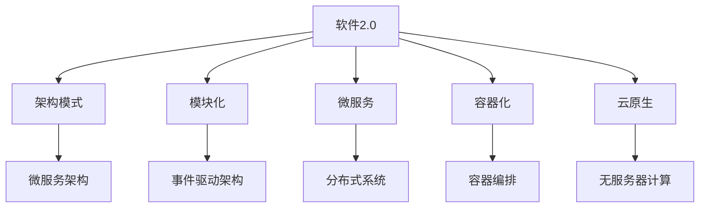
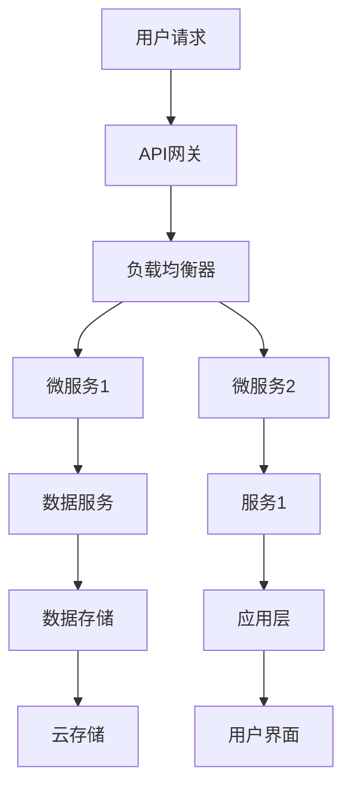
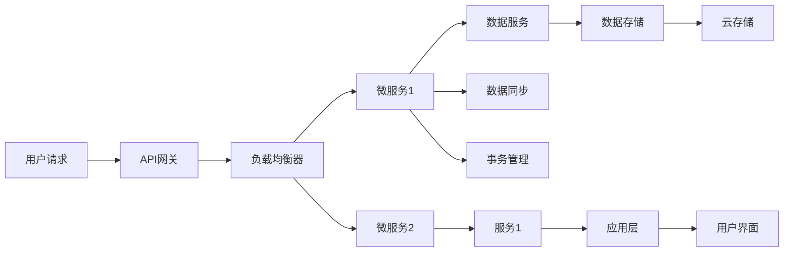
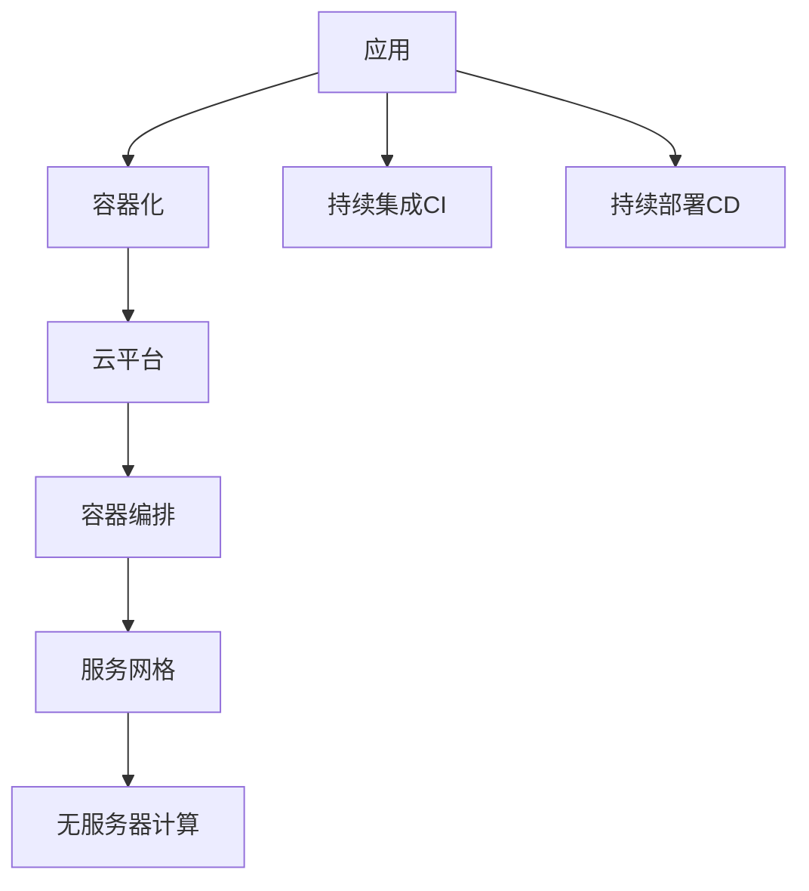
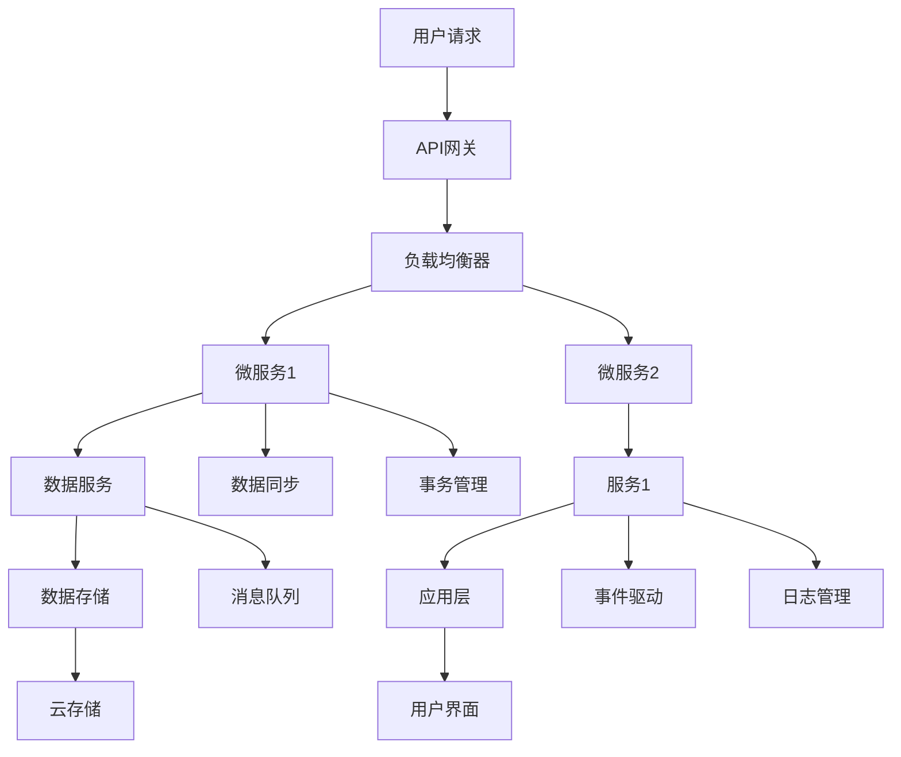

                 

# 软件2.0的可扩展性设计

> 关键词：软件2.0, 可扩展性, 架构设计, 模块化, 微服务, 容器化, 云原生

## 1. 背景介绍

### 1.1 问题由来
随着数字化转型的加速，企业对软件系统的需求变得更加多样和复杂。传统的单体应用架构已经难以应对这些需求，而软件2.0（Software 2.0）的概念应运而生。软件2.0强调通过高度模块化和可扩展的设计，构建具备强大适应性和灵活性的软件系统，以满足企业不断变化的需求。

### 1.2 问题核心关键点
软件2.0的核心在于构建一个高度模块化和可扩展的系统架构。这包括选择合适的架构模式，设计模块化的组件结构，引入微服务、容器化和云原生技术，以实现系统的灵活部署和高效运维。

### 1.3 问题研究意义
构建可扩展的软件2.0系统，对于提升企业数字化转型的效率，降低技术栈的维护成本，提高系统的稳定性和可用性具有重要意义。它可以帮助企业在快速变化的商业环境中，快速响应市场变化，灵活应对技术挑战，推动企业数字化战略的顺利实施。

## 2. 核心概念与联系

### 2.1 核心概念概述

为更好地理解软件2.0的可扩展性设计，本节将介绍几个密切相关的核心概念：

- 软件2.0：一种通过高度模块化和可扩展的设计，构建具备强大适应性和灵活性的软件系统。
- 架构模式：软件系统的架构设计原则和模式，如微服务架构、事件驱动架构等。
- 模块化：将软件系统拆分为独立可复用的模块，实现系统的高内聚和低耦合。
- 微服务：将系统拆分为一组独立的服务单元，每个服务单元负责单一的业务功能。
- 容器化：将应用及其依赖打包在容器中，以实现跨平台部署和高效运维。
- 云原生：基于云平台构建的系统，包括容器化、服务网格、无服务器计算等技术。

这些核心概念之间的逻辑关系可以通过以下Mermaid流程图来展示：



这个流程图展示了大语言模型的核心概念及其之间的关系：

1. 软件2.0通过架构模式和微服务设计，构建可扩展的分布式系统。
2. 模块化实现了系统的高度内聚和低耦合。
3. 容器化和云原生技术，支持系统的灵活部署和高效运维。
4. 微服务架构是软件2.0设计的重要模式。
5. 事件驱动架构和分布式系统，扩展了系统的能力。
6. 容器编排和无服务器计算，提升了系统的弹性。

### 2.2 概念间的关系

这些核心概念之间存在着紧密的联系，形成了软件2.0的可扩展性设计的完整生态系统。下面我们通过几个Mermaid流程图来展示这些概念之间的关系。

#### 2.2.1 软件2.0的系统架构



这个流程图展示了软件2.0的系统架构，包括API网关、负载均衡器、微服务、数据服务、数据存储和用户界面等组件，体现了模块化和分布式的思想。

#### 2.2.2 微服务架构的设计



这个流程图展示了微服务架构的设计，通过API网关、负载均衡器和微服务，将系统拆分为多个独立的服务单元，每个服务单元负责单一的业务功能，并通过数据同步和事务管理等机制，实现服务间的协同工作。

#### 2.2.3 容器化和云原生技术的应用



这个流程图展示了容器化和云原生技术的应用，通过容器化实现应用的打包和部署，使用容器编排和云原生技术实现服务的灵活部署和高效运维。

### 2.3 核心概念的整体架构

最后，我们用一个综合的流程图来展示这些核心概念在大语言模型微调过程中的整体架构：



这个综合流程图展示了从用户请求到服务部署的全流程，包括API网关、负载均衡器、微服务、数据服务、数据存储、应用层、用户界面、事件驱动、消息队列和日志管理等组件，体现了软件2.0系统的模块化和分布式特性。

## 3. 核心算法原理 & 具体操作步骤
### 3.1 算法原理概述

软件2.0的可扩展性设计，本质上是通过选择合适的架构模式和设计原则，构建具备高度模块化和可扩展性的系统。其核心思想是：将系统拆分为多个独立的模块，每个模块负责单一的业务功能，并通过服务治理、数据同步、事件驱动等机制，实现模块间的协同工作，提高系统的灵活性和可扩展性。

### 3.2 算法步骤详解

软件2.0的可扩展性设计，一般包括以下几个关键步骤：

**Step 1: 选择合适的架构模式**
- 根据系统的业务需求和性能要求，选择合适的架构模式。常见的架构模式包括微服务架构、事件驱动架构等。

**Step 2: 设计模块化的组件结构**
- 将系统拆分为独立的模块，每个模块负责单一的业务功能，并确保模块间具有高内聚和低耦合的特性。

**Step 3: 引入微服务技术**
- 通过微服务技术，将系统拆分为多个独立的服务单元，每个服务单元负责单一的业务功能，并通过服务治理、数据同步、事务管理等机制，实现服务间的协同工作。

**Step 4: 实现容器化和云原生技术**
- 使用容器化技术，将应用及其依赖打包在容器中，以实现跨平台部署和高效运维。
- 引入云原生技术，如服务网格、无服务器计算等，支持系统的灵活部署和高效运维。

**Step 5: 实施持续集成和持续部署**
- 实施持续集成(CI)和持续部署(CD)流程，确保系统的快速迭代和持续优化。

**Step 6: 引入监控和日志管理**
- 实施监控和日志管理，实时采集系统指标，设置异常告警阈值，确保系统稳定运行。

**Step 7: 进行安全和隐私保护**
- 引入安全技术和隐私保护措施，保障数据和系统安全。

### 3.3 算法优缺点

软件2.0的可扩展性设计，具有以下优点：
1. 高度模块化：通过模块化的设计，提高系统的灵活性和可扩展性。
2. 分布式部署：通过微服务技术，实现系统的分布式部署和高效运维。
3. 跨平台部署：通过容器化技术，实现应用的跨平台部署。
4. 弹性扩展：通过云原生技术，支持系统的弹性扩展和高效运维。
5. 持续优化：通过持续集成和持续部署，确保系统的快速迭代和持续优化。

同时，软件2.0的设计也存在以下缺点：
1. 初始成本高：设计和构建模块化系统需要较高的初始成本和技术投入。
2. 复杂度高：模块化的设计增加了系统的复杂度，对开发和运维团队提出了更高的要求。
3. 调试困难：模块化系统增加了调试的难度，需要开发团队具备较高的调试能力和技巧。

### 3.4 算法应用领域

软件2.0的可扩展性设计，广泛应用于各种领域，例如：

- 金融科技：通过模块化的设计，支持快速响应市场变化和业务需求。
- 电子商务：通过微服务技术，支持系统的灵活扩展和高效运维。
- 医疗健康：通过容器化和云原生技术，实现系统的快速部署和高效运维。
- 物联网：通过分布式部署，支持系统的海量设备连接和管理。
- 智能制造：通过持续集成和持续部署，支持系统的快速迭代和优化。

## 4. 数学模型和公式 & 详细讲解 & 举例说明

### 4.1 数学模型构建

软件2.0的可扩展性设计，可以通过以下数学模型进行描述：

- **模块化设计**：将系统拆分为多个独立的模块，每个模块可以表示为：
  $$
  M = \{M_1, M_2, \ldots, M_n\}
  $$
  其中 $M_i$ 表示第 $i$ 个模块。

- **微服务设计**：将系统拆分为多个微服务，每个微服务可以表示为：
  $$
  S = \{S_1, S_2, \ldots, S_m\}
  $$
  其中 $S_j$ 表示第 $j$ 个微服务。

- **容器化设计**：将应用及其依赖打包在容器中，每个容器可以表示为：
  $$
  C = \{C_1, C_2, \ldots, C_k\}
  $$
  其中 $C_i$ 表示第 $i$ 个容器。

- **云原生设计**：引入云原生技术，如服务网格、无服务器计算等，支持系统的灵活部署和高效运维。

### 4.2 公式推导过程

以微服务架构为例，推导其数学模型：

- **微服务架构的数学模型**：
  $$
  S = \{S_1, S_2, \ldots, S_m\}
  $$
  其中 $S_j$ 表示第 $j$ 个微服务，$j \in [1, m]$。

- **微服务间的通信模型**：
  $$
  \text{Communication}(S_j, S_k) = \begin{cases}
  1 & \text{如果 } S_j \text{ 和 } S_k \text{ 有交互} \\
  0 & \text{如果 } S_j \text{ 和 } S_k \text{ 没有交互}
  \end{cases}
  $$

- **微服务的负载均衡模型**：
  $$
  \text{Load-Balancing}(S_j) = \sum_{i=1}^{N_j} \text{Load}(S_j, i)
  $$
  其中 $N_j$ 表示第 $j$ 个微服务的实例数量，$\text{Load}(S_j, i)$ 表示第 $j$ 个微服务第 $i$ 个实例的负载情况。

### 4.3 案例分析与讲解

以金融科技领域的模块化系统为例，分析其可扩展性设计：

- **架构设计**：将系统拆分为多个独立的模块，每个模块负责单一的业务功能，如交易系统、风险控制、客户服务、支付系统等。

- **微服务设计**：通过微服务技术，将系统拆分为多个独立的服务单元，每个服务单元负责单一的业务功能，并通过服务治理、数据同步、事务管理等机制，实现服务间的协同工作。

- **容器化设计**：使用容器化技术，将应用及其依赖打包在容器中，以实现跨平台部署和高效运维。

- **云原生设计**：引入云原生技术，如服务网格、无服务器计算等，支持系统的灵活部署和高效运维。

通过以上设计，金融科技系统能够快速响应市场变化和业务需求，支持系统的灵活扩展和高效运维，降低技术栈的维护成本，提高系统的稳定性和可用性。

## 5. 项目实践：代码实例和详细解释说明
### 5.1 开发环境搭建

在进行软件2.0可扩展性设计的实践前，我们需要准备好开发环境。以下是使用Python进行Django开发的环境配置流程：

1. 安装Anaconda：从官网下载并安装Anaconda，用于创建独立的Python环境。

2. 创建并激活虚拟环境：
```bash
conda create -n django-env python=3.8 
conda activate django-env
```

3. 安装Django：
```bash
pip install django
```

4. 安装相关依赖库：
```bash
pip install Pillow requests psycopg2-binary
```

5. 创建数据库：
```bash
psql -U postgres -d postgres
```

6. 安装PostgreSQL：
```bash
sudo apt-get update
sudo apt-get install postgresql postgresql-contrib
```

完成上述步骤后，即可在`django-env`环境中开始软件2.0可扩展性设计的实践。

### 5.2 源代码详细实现

下面以一个简单的电子商务系统的模块化设计和微服务实践为例，给出Django代码实现。

首先，定义电子商务系统的模块结构：

```python
# apps.py

from django.apps import AppConfig

class EcommerceConfig(AppConfig):
    name = 'ecommerce'
```

然后，定义电子商务系统的微服务结构：

```python
# services.py

from django.http import JsonResponse

class ProductService:
    def get_product(self, request):
        # 获取产品信息
        product = request.product
        return JsonResponse({'product': product})

class OrderService:
    def place_order(self, request):
        # 下单操作
        product = request.product
        return JsonResponse({'order': '成功'})
```

接着，定义电子商务系统的数据库模型：

```python
# models.py

from django.db import models

class Product(models.Model):
    name = models.CharField(max_length=50)
    price = models.DecimalField(max_digits=10, decimal_places=2)

class Order(models.Model):
    product = models.ForeignKey(Product, on_delete=models.CASCADE)
    quantity = models.IntegerField()
    price = models.DecimalField(max_digits=10, decimal_places=2)
```

然后，定义电子商务系统的API接口：

```python
# views.py

from django.http import JsonResponse
from django.views.decorators.csrf import csrf_exempt

@csrf_exempt
def get_product(request):
    product = Product.objects.get(id=request.GET.get('id'))
    return JsonResponse({'product': product})

@csrf_exempt
def place_order(request):
    product = Product.objects.get(id=request.GET.get('id'))
    order = Order.objects.create(product=product, quantity=request.POST.get('quantity'))
    return JsonResponse({'order': '成功'})
```

最后，定义电子商务系统的URL映射：

```python
# urls.py

from django.urls import path
from . import views

urlpatterns = [
    path('product/', views.get_product),
    path('order/', views.place_order),
]
```

通过以上步骤，我们可以实现一个简单的电子商务系统的模块化设计和微服务实践。在实际开发中，还需要根据具体需求，进一步细化和优化系统架构，确保系统的高度模块化和可扩展性。

### 5.3 代码解读与分析

让我们再详细解读一下关键代码的实现细节：

**ecommerce应用**：
- `apps.py`：定义了`ecommerce`应用的配置信息，包括应用名称和应用的初始化函数。
- `models.py`：定义了`Product`和`Order`两个模型，用于存储产品和订单信息。

**ProductService和OrderService服务**：
- `services.py`：定义了`ProductService`和`OrderService`两个服务，分别用于获取产品和下单操作。
- `get_product`方法：从数据库中获取产品信息，并返回JSON格式的响应。
- `place_order`方法：从数据库中获取产品信息，并创建订单记录，返回JSON格式的响应。

**API接口**：
- `views.py`：定义了`get_product`和`place_order`两个API接口，用于处理用户请求。
- `get_product`方法：根据产品ID获取产品信息，并返回JSON格式的响应。
- `place_order`方法：根据产品ID创建订单记录，并返回JSON格式的响应。

**URL映射**：
- `urls.py`：定义了`product`和`order`两个URL映射，用于匹配用户请求。
- `product`映射到`get_product`方法，处理获取产品请求。
- `order`映射到`place_order`方法，处理下单请求。

**运行结果展示**：
- 运行上述代码，启动Django服务器后，我们可以通过`http://127.0.0.1:8000/product/1`访问获取产品接口，通过`http://127.0.0.1:8000/order/1`访问下单接口，测试系统的模块化和微服务设计是否正确。

## 6. 实际应用场景
### 6.1 智能制造
软件2.0的可扩展性设计，可以应用于智能制造领域，支持系统的灵活扩展和高效运维。例如，通过微服务技术，将制造系统的不同模块（如订单管理、生产调度、设备监控等）进行拆分，每个模块独立部署，通过API网关和负载均衡器进行统一管理和调度，支持系统的快速迭代和优化。

### 6.2 金融科技
软件2.0的可扩展性设计，可以应用于金融科技领域，支持系统的快速响应和高效运维。例如，通过微服务技术，将金融系统的不同模块（如交易系统、风险控制、客户服务、支付系统等）进行拆分，每个模块独立部署，通过API网关和负载均衡器进行统一管理和调度，支持系统的快速迭代和优化。

### 6.3 电子商务
软件2.0的可扩展性设计，可以应用于电子商务领域，支持系统的灵活扩展和高效运维。例如，通过微服务技术，将电子商务系统的不同模块（如产品管理、订单管理、用户管理等）进行拆分，每个模块独立部署，通过API网关和负载均衡器进行统一管理和调度，支持系统的快速迭代和优化。

## 7. 工具和资源推荐
### 7.1 学习资源推荐

为了帮助开发者系统掌握软件2.0的可扩展性设计，这里推荐一些优质的学习资源：

1. 《微服务架构设计与实现》系列博文：由知名专家撰写，深入浅出地介绍了微服务架构的概念、设计和实现方法。

2. 《事件驱动架构与分布式系统》系列书籍：详细讲解了事件驱动架构和分布式系统的设计和实现方法，是理解软件2.0架构设计的绝佳资料。

3. 《容器化技术精讲》系列书籍：全面介绍了容器化技术的原理、实践和工具，是学习软件2.0部署和运维的好书。

4. 《云原生系统设计》系列博文：介绍了云原生系统的设计思想和实现方法，包括服务网格、无服务器计算等技术。

5. 《软件2.0案例实践》系列博文：通过真实的项目案例，展示了软件2.0在不同领域的应用和实现方法。

通过对这些资源的学习实践，相信你一定能够快速掌握软件2.0的可扩展性设计，并用于解决实际的NLP问题。

### 7.2 开发工具推荐

高效的开发离不开优秀的工具支持。以下是几款用于软件2.0可扩展性设计的常用工具：

1. Docker：开源容器化平台，支持应用及其依赖的打包和部署。
2. Kubernetes：开源容器编排平台，支持应用的灵活部署和高效运维。
3. Spring Boot：基于Java的快速开发框架，支持微服务架构的设计和实现。
4. Django：Python的Web框架，支持快速开发Web应用和API接口。
5. Flask：Python的轻量级Web框架，支持快速开发API接口。

合理利用这些工具，可以显著提升软件2.0可扩展性设计的开发效率，加快创新迭代的步伐。

### 7.3 相关论文推荐

软件2.0的可扩展性设计源于学界的持续研究。以下是几篇奠基性的相关论文，推荐阅读：

1. Microservices: A pattern for distributed systems：介绍微服务架构的概念、设计和实现方法，是理解软件2.0架构设计的经典之作。

2. Containers 101：介绍容器化技术的原理、实践和工具，是学习软件2.0部署和运维的好书。

3. Event-Driven Microservices Design and Implementation：详细介绍事件驱动架构和分布式系统的设计和实现方法。

4. Cloud Native Computing Foundation（CNCF）白皮书：介绍云原生系统的设计思想和实现方法，包括服务网格、无服务器计算等技术。

5. Software 2.0: Beyond Software and Into the Next Generational Wave of Computing：探讨软件2.0的概念、设计思想和实现方法，是理解软件2.0的基石。

这些论文代表了大语言模型微调技术的发展脉络。通过学习这些前沿成果，可以帮助研究者把握学科前进方向，激发更多的创新灵感。

## 8. 总结：未来发展趋势与挑战
### 8.1 总结

本文对软件2.0的可扩展性设计进行了全面系统的介绍。首先阐述了软件2.0的概念和意义，明确了可扩展性设计的核心思想和设计原则。其次，从原理到实践，详细讲解了软件2.0的可扩展性设计的数学模型和关键步骤，给出了软件2.0可扩展性设计的完整代码实例。同时，本文还广泛探讨了软件2.0可扩展性设计在智能制造、金融科技、电子商务等多个领域的应用前景，展示了可扩展性设计的巨大潜力。

通过本文的系统梳理，可以看到，软件2.0的可扩展性设计正在成为系统架构设计的重要范式，极大地提升了系统的灵活性和可扩展性。它帮助企业在快速变化的商业环境中，快速响应市场变化，灵活应对技术挑战，推动企业数字化战略的顺利实施。

### 8.2 未来发展趋势

展望未来，软件2.0的可扩展性设计将呈现以下几个发展趋势：

1. 模块化和微服务的普及：随着企业数字化转型的加速，模块化和微服务技术将得到更广泛的应用，帮助企业构建灵活、高效的系统架构。

2. 容器化和云原生技术的深化：容器化和云原生技术将成为软件2.0部署和运维的主流方式，支持系统的弹性扩展和高效运维。

3. 事件驱动架构的兴起：事件驱动架构将帮助企业构建更加灵活、弹性的系统架构，支持系统的异步处理和协同工作。

4. 无服务器计算的推广：无服务器计算技术将使企业的开发和运维成本进一步降低，支持系统的快速迭代和优化。

5. 持续集成和持续部署的普及：持续集成和持续部署技术将使企业的开发效率和迭代速度进一步提升，支持系统的快速迭代和优化。

6. 安全与隐私保护的重要性：随着系统复杂度的增加，安全与隐私保护技术将变得越来越重要，保障数据和系统安全。

以上趋势凸显了软件2.0可扩展性设计的广阔前景。这些方向的探索发展，必将进一步提升系统的灵活性和可扩展性，推动企业数字化战略的顺利实施。

### 8.3 面临的挑战

尽管软件2.0的可扩展性设计已经取得了显著的进展，但在迈向更加智能化、普适化应用的过程中，它仍面临着诸多挑战：

1. 架构复杂度高：模块化和微服务设计增加了系统的复杂度，对开发和运维团队提出了更高的要求。

2. 系统调试困难：模块化系统增加了调试的难度，需要开发团队具备较高的调试能力和技巧。

3. 技术栈多样性：不同的架构模式和设计原则带来了技术栈的多样性，对开发团队的综合能力提出了更高要求。

4. 成本投入高：设计和构建模块化系统需要较高的初始成本和技术投入。

5. 数据管理复杂：模块化和微服务设计增加了数据管理的复杂度，需要开发团队具备更高的数据管理能力。

6. 运维复杂度高：模块化和微服务设计增加了运维的复杂度，需要运维团队具备更高的运维能力。

7. 安全与隐私保护：随着系统复杂度的增加，安全与隐私保护技术将变得越来越重要，保障数据和系统安全。

正视软件2.0可扩展性设计面临的这些挑战，积极应对并寻求突破，将是大语言模型微调技术走向成熟的必由之路。相信随着学界和产业界的共同努力，这些挑战终将一一被克服，软件2.0可扩展性设计必将在构建智能、高效的系统架构中扮演越来越重要的角色。

### 8.4 研究展望

面向未来，软件2.0的可扩展性设计需要在以下几个方面寻求新的突破：

1. 探索新的架构模式：引入更多的架构模式，如事件驱动架构、无服务器计算等，以适应不同的应用场景。

2. 优化容器化设计：进一步优化容器化技术，减少容器数量，提高容器的利用率和系统性能。

3. 引入更高效的持续集成和持续部署技术：引入更高效的持续集成和持续部署技术，支持系统的

