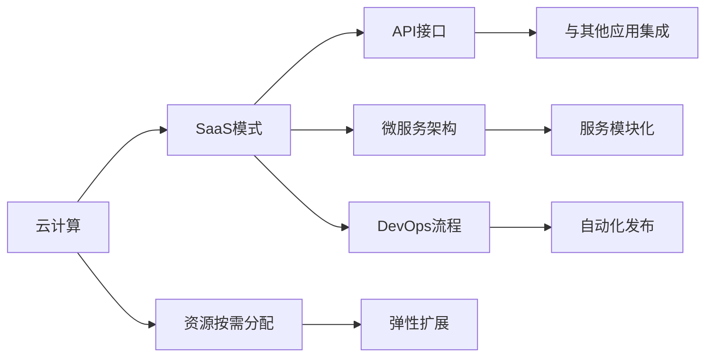
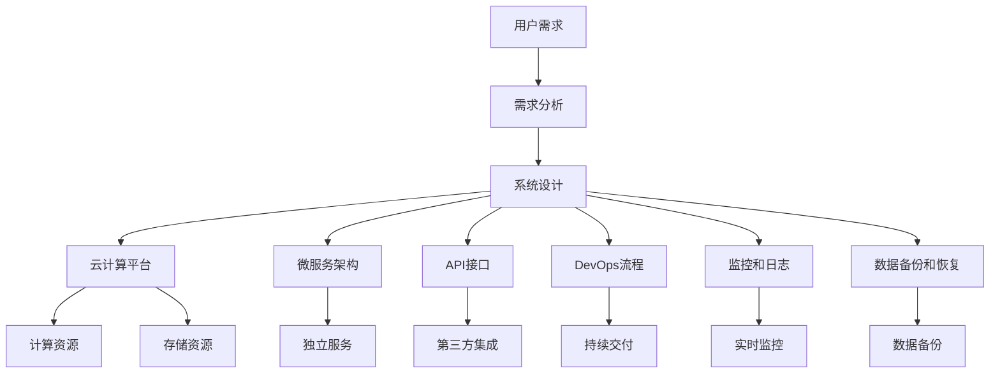

                 

# 软件2.0的商业模式创新

在信息化时代，软件已经成为推动经济发展和社会进步的关键力量。然而，传统的软件商业模式面临着诸多挑战，如高昂的开发成本、更新周期长、用户体验差等。为了应对这些挑战，新的软件2.0商业模式应运而生。软件2.0将软件作为服务（Software as a Service, SaaS），通过云计算平台，实现软件的即用即付，提升用户体验，降低开发成本，加速创新迭代。本文将系统介绍软件2.0的商业模式创新，涵盖其原理、步骤、优缺点、应用领域、数学模型及实例，并展望其未来发展趋势与挑战。

## 1. 背景介绍

### 1.1 问题由来

随着信息技术的不断发展，软件在各行各业的应用越来越广泛，传统的软件模式难以满足现代企业对软件的需求。具体表现为：

- **开发成本高**：软件开发周期长，需要大量人力和资金投入。
- **更新周期长**：软件更新迭代需要严格的测试流程，难以快速响应市场变化。
- **用户体验差**：传统的软件部署在本地，难以快速响应用户需求。

为了解决这些挑战，云计算和SaaS等新兴技术应运而生。SaaS模式通过将软件作为服务，通过云计算平台提供，实现了软件的即用即付，提高了用户体验，降低了开发成本，加速了创新迭代。

### 1.2 问题核心关键点

软件2.0的商业模式创新主要体现在以下几个方面：

- **云平台架构**：通过云计算平台实现软件的即用即付，降低了开发成本，提升了用户体验。
- **API接口设计**：通过开放API接口，实现与第三方应用的集成，提升了软件的可扩展性。
- **微服务架构**：通过微服务架构实现软件的模块化开发，提升了软件的灵活性和可维护性。
- **DevOps流程**：通过DevOps流程实现软件开发和运营的自动化，提升了软件的发布速度和稳定性。

## 2. 核心概念与联系

### 2.1 核心概念概述

为了更好地理解软件2.0的商业模式创新，我们需要了解几个核心概念：

- **云计算**：通过互联网提供计算资源，包括计算、存储、网络等，实现资源的按需分配和弹性扩展。
- **SaaS模式**：将软件作为服务，通过云计算平台提供，用户可以按需购买和使用。
- **API接口**：应用程序编程接口，提供软件与其他应用系统的集成方式。
- **微服务架构**：将大型应用系统拆分成多个小型服务，每个服务独立部署和维护，提升系统的灵活性和可维护性。
- **DevOps流程**：软件开发和运营的自动化流程，实现快速发布和持续交付。

这些核心概念之间存在紧密的联系，通过云计算平台实现SaaS模式，提供开放API接口，采用微服务架构和DevOps流程，实现了软件的即用即付，提升了用户体验，降低了开发成本，加速了创新迭代。

### 2.2 概念间的关系

这些核心概念之间存在密切的联系，可以通过以下Mermaid流程图展示：



这个流程图展示了云计算、SaaS模式、API接口、微服务架构和DevOps流程之间的联系。通过云计算平台实现资源的按需分配和弹性扩展，通过API接口实现与其他应用的集成，采用微服务架构实现服务的模块化开发，通过DevOps流程实现软件的自动化发布，最终实现了软件的即用即付。

### 2.3 核心概念的整体架构

最后，我们用一个综合的流程图来展示这些核心概念在大规模应用场景中的整体架构：



这个综合流程图展示了软件2.0的商业模式创新在大规模应用场景中的整体架构。从用户需求出发，经过需求分析和系统设计，通过云计算平台提供计算资源和存储资源，采用微服务架构实现独立服务模块化开发，提供开放API接口实现与其他应用的集成，采用DevOps流程实现持续交付，同时通过监控和日志、数据备份和恢复等手段保障系统的稳定性和安全性。

## 3. 核心算法原理 & 具体操作步骤

### 3.1 算法原理概述

软件2.0的商业模式创新主要基于云计算和SaaS技术，其核心在于通过开放API接口和DevOps流程实现软件的即用即付，提升用户体验，降低开发成本，加速创新迭代。

具体而言，软件2.0的商业模式创新包括以下几个步骤：

1. **需求分析**：根据用户需求，确定软件的功能和性能要求。
2. **系统设计**：设计软件架构，选择适合的云平台，采用微服务架构和API接口设计。
3. **开发和测试**：开发软件模块，进行单元测试和集成测试。
4. **持续集成和持续交付**：通过DevOps流程实现自动化构建、测试和部署。
5. **监控和维护**：通过监控和日志实现系统性能和故障的实时监控，通过数据备份和恢复保障系统稳定。

### 3.2 算法步骤详解

下面详细介绍软件2.0的商业模式创新的详细步骤：

#### 3.2.1 需求分析

需求分析是软件2.0商业模式创新的第一步。通过与用户沟通，了解用户需求，确定软件的功能和性能要求，从而指导系统设计和开发。

#### 3.2.2 系统设计

系统设计是软件2.0商业模式创新的关键步骤。通过选择合适的云平台，采用微服务架构和API接口设计，将软件拆分成多个独立模块，实现模块化和可扩展性。

#### 3.2.3 开发和测试

开发和测试是软件2.0商业模式创新的核心步骤。通过模块化开发，实现独立服务的快速迭代和更新。采用DevOps流程实现持续集成和持续交付，快速响应市场变化。

#### 3.2.4 持续集成和持续交付

持续集成和持续交付是软件2.0商业模式创新的重要保障。通过自动化构建、测试和部署，实现软件的快速发布和迭代更新。

#### 3.2.5 监控和维护

监控和维护是软件2.0商业模式创新的基础保障。通过实时监控和日志分析，保障系统性能和稳定性。通过数据备份和恢复，实现系统的快速恢复和故障处理。

### 3.3 算法优缺点

软件2.0的商业模式创新具有以下优点：

1. **即用即付**：用户可以按需购买和使用软件，降低了开发成本，提高了用户体验。
2. **灵活性和可扩展性**：采用微服务架构和API接口设计，提升了软件的灵活性和可扩展性。
3. **快速迭代和更新**：通过DevOps流程实现自动化构建、测试和部署，快速响应市场变化。
4. **系统稳定性和安全性**：通过监控和日志实现系统性能和故障的实时监控，通过数据备份和恢复保障系统稳定。

同时，软件2.0的商业模式创新也存在以下缺点：

1. **用户隐私保护**：通过云计算平台提供软件，用户数据存储在云端，存在隐私泄露的风险。
2. **网络安全问题**：通过网络传输数据，存在被攻击的风险。
3. **服务中断问题**：云平台服务商的服务中断，可能导致软件服务不可用。
4. **用户技术门槛**：使用云计算和SaaS模式，需要一定的技术基础，部分用户可能难以适应。

### 3.4 算法应用领域

软件2.0的商业模式创新适用于各类软件应用场景，主要包括以下几个方面：

1. **SaaS平台**：基于云计算平台提供的软件服务，如CRM、ERP、HRM等。
2. **移动应用**：采用API接口实现与其他应用的集成，如社交媒体、电子商务等。
3. **大数据分析**：通过云计算平台提供数据存储和处理服务，如数据仓库、数据挖掘等。
4. **物联网应用**：通过云计算平台实现设备的远程管理和监控，如智慧城市、工业互联网等。
5. **人工智能应用**：通过云计算平台提供AI算力和服务，如语音识别、图像识别等。

## 4. 数学模型和公式 & 详细讲解 & 举例说明

### 4.1 数学模型构建

软件2.0的商业模式创新主要涉及云平台资源的管理和调度，采用SLA（服务级别协议）进行保障。

假设云平台提供商提供m个计算资源，每个资源的单位时间为p，每小时价格为c，用户需求为n。则SLA可以表示为：

$$
SLA = \frac{n}{m} \times p \times c
$$

其中：
- n：用户需求
- m：计算资源数量
- p：每个计算资源的单位时间
- c：每小时价格

### 4.2 公式推导过程

以SLA为例，推导其计算过程。假设用户需求为n，云平台提供商提供m个计算资源，每个资源的单位时间为p，每小时价格为c。则SLA可以表示为：

$$
SLA = \frac{n}{m} \times p \times c
$$

具体计算步骤如下：

1. 确定用户需求n。
2. 确定云平台提供商提供的计算资源数量m。
3. 确定每个计算资源的单位时间p。
4. 确定每小时价格c。
5. 计算SLA。

### 4.3 案例分析与讲解

以SaaS平台的计算资源管理为例，进行案例分析。假设SaaS平台提供商提供10个计算资源，每个资源的单位时间为4小时，每小时价格为1元。用户需求为100小时，则SLA可以计算如下：

$$
SLA = \frac{100}{10} \times 4 \times 1 = 40
$$

即SaaS平台提供商应该提供40个计算资源，以满足用户需求。

## 5. 项目实践：代码实例和详细解释说明

### 5.1 开发环境搭建

在进行软件2.0的商业模式创新实践前，我们需要准备好开发环境。以下是使用Python进行Django开发的环境配置流程：

1. 安装Anaconda：从官网下载并安装Anaconda，用于创建独立的Python环境。

2. 创建并激活虚拟环境：
```bash
conda create -n pytorch-env python=3.8 
conda activate pytorch-env
```

3. 安装PyTorch：根据CUDA版本，从官网获取对应的安装命令。例如：
```bash
conda install pytorch torchvision torchaudio cudatoolkit=11.1 -c pytorch -c conda-forge
```

4. 安装Django：
```bash
pip install django
```

5. 安装各类工具包：
```bash
pip install numpy pandas scikit-learn matplotlib tqdm jupyter notebook ipython
```

完成上述步骤后，即可在`pytorch-env`环境中开始软件2.0的商业模式创新实践。

### 5.2 源代码详细实现

这里我们以SaaS平台的用户注册模块为例，给出使用Django框架实现代码的详细解释说明。

首先，定义用户注册视图：

```python
from django.shortcuts import render, redirect
from django.contrib.auth import authenticate, login, logout

def login_view(request):
    if request.method == 'POST':
        username = request.POST['username']
        password = request.POST['password']
        user = authenticate(username=username, password=password)
        if user is not None:
            login(request, user)
            return redirect('home')
        else:
            context = {'error_message': 'Invalid credentials.'}
            return render(request, 'login.html', context)
    else:
        return render(request, 'login.html')

def logout_view(request):
    logout(request)
    return redirect('login')
```

然后，定义用户注册模型：

```python
from django.db import models
from django.contrib.auth.models import AbstractUser

class User(AbstractUser):
    email = models.EmailField(unique=True)
    first_name = models.CharField(max_length=30)
    last_name = models.CharField(max_length=30)
    password = models.CharField(max_length=255)
```

最后，定义用户注册表单：

```python
from django import forms
from django.contrib.auth.forms import UserCreationForm

class UserRegisterForm(UserCreationForm):
    email = forms.EmailField()
    first_name = forms.CharField(max_length=30)
    last_name = forms.CharField(max_length=30)
    password = forms.CharField(max_length=255)
```

完成上述代码实现后，用户可以在SaaS平台上完成注册，并进行登录和注销操作。

### 5.3 代码解读与分析

让我们再详细解读一下关键代码的实现细节：

**用户注册视图**：
- `login_view`：处理用户登录请求。如果提交POST请求，则验证用户名和密码是否正确，如果正确则登录，否则返回错误信息。
- `logout_view`：处理用户注销请求。注销后重定向到登录页面。

**用户注册模型**：
- 继承自Django的`AbstractUser`模型，添加了email、first_name、last_name等字段。

**用户注册表单**：
- 使用`UserCreationForm`，继承自Django的表单类，添加email、first_name、last_name等字段。

## 6. 实际应用场景

### 6.1 智能客服系统

软件2.0的商业模式创新可以广泛应用于智能客服系统的构建。传统客服往往需要配备大量人力，高峰期响应缓慢，且一致性和专业性难以保证。而使用软件2.0模式，可以在云端构建智能客服系统，7x24小时不间断服务，快速响应客户咨询，用自然流畅的语言解答各类常见问题。

在技术实现上，可以收集企业内部的历史客服对话记录，将问题和最佳答复构建成监督数据，在此基础上对软件2.0模式进行微调。微调后的智能客服系统能够自动理解用户意图，匹配最合适的答案模板进行回复。对于客户提出的新问题，还可以接入检索系统实时搜索相关内容，动态组织生成回答。如此构建的智能客服系统，能大幅提升客户咨询体验和问题解决效率。

### 6.2 金融舆情监测

金融机构需要实时监测市场舆论动向，以便及时应对负面信息传播，规避金融风险。传统的人工监测方式成本高、效率低，难以应对网络时代海量信息爆发的挑战。软件2.0模式下的金融舆情监测系统，可以通过云计算平台实时抓取网络文本数据，自动监测不同主题下的情感变化趋势，一旦发现负面信息激增等异常情况，系统便会自动预警，帮助金融机构快速应对潜在风险。

### 6.3 个性化推荐系统

当前的推荐系统往往只依赖用户的历史行为数据进行物品推荐，无法深入理解用户的真实兴趣偏好。软件2.0模式下的个性化推荐系统可以更好地挖掘用户行为背后的语义信息，从而提供更精准、多样的推荐内容。

在实践中，可以收集用户浏览、点击、评论、分享等行为数据，提取和用户交互的物品标题、描述、标签等文本内容。将文本内容作为模型输入，用户的后续行为（如是否点击、购买等）作为监督信号，在此基础上微调预训练语言模型。微调后的模型能够从文本内容中准确把握用户的兴趣点。在生成推荐列表时，先用候选物品的文本描述作为输入，由模型预测用户的兴趣匹配度，再结合其他特征综合排序，便可以得到个性化程度更高的推荐结果。

### 6.4 未来应用展望

随着软件2.0模式的不断发展，其在更多领域的应用前景将进一步拓展。未来，软件2.0模式有望在智慧医疗、智能教育、智慧城市治理等领域得到广泛应用，为各行各业带来变革性影响。

在智慧医疗领域，软件2.0模式下的智能诊疗系统，可以通过云计算平台提供电子病历、诊断工具等服务，辅助医生诊疗，加速新药开发进程。在智能教育领域，软件2.0模式下的个性化学习系统，可以基于用户的学习行为和兴趣，提供定制化的学习内容，因材施教，促进教育公平，提高教学质量。在智慧城市治理中，软件2.0模式下的城市事件监测系统，可以通过云计算平台实时监测城市事件，提高城市管理的自动化和智能化水平，构建更安全、高效的未来城市。

此外，在企业生产、社会治理、文娱传媒等众多领域，软件2.0模式下的智能化应用也将不断涌现，为经济社会发展注入新的动力。相信随着技术的日益成熟，软件2.0模式将成为各行各业的重要范式，推动人工智能技术更好地服务于社会生产生活。

## 7. 工具和资源推荐

### 7.1 学习资源推荐

为了帮助开发者系统掌握软件2.0的商业模式创新的原理和实践，这里推荐一些优质的学习资源：

1. **《软件2.0商业模式创新》系列博文**：由软件2.0领域的专家撰写，深入浅出地介绍了软件2.0的商业模式创新的原理、步骤和实践技巧。
2. **《云计算与SaaS模式》课程**：由顶尖大学或机构开设的在线课程，详细讲解云计算和SaaS模式的技术原理和应用场景。
3. **《微服务架构设计》书籍**：介绍微服务架构的原理和设计方法，提供实际应用的案例和最佳实践。
4. **《DevOps实践指南》书籍**：讲解DevOps流程的实施方法和工具，帮助开发者实现软件的自动化构建、测试和部署。
5. **《SaaS模式最佳实践》博客**：汇集SaaS模式的各类成功案例和最佳实践，提供丰富的借鉴和参考。

通过对这些资源的学习实践，相信你一定能够快速掌握软件2.0的商业模式创新的精髓，并用于解决实际的业务问题。

### 7.2 开发工具推荐

高效的开发离不开优秀的工具支持。以下是几款用于软件2.0模式开发的常用工具：

1. **Django**：基于Python的Web框架，支持RESTful API接口设计，非常适合SaaS平台的开发。
2. **AWS**：亚马逊云计算平台，提供丰富的云服务和资源，支持SaaS模式的部署和运维。
3. **Azure**：微软云计算平台，提供强大的云服务和资源，支持SaaS模式的部署和运维。
4. **Google Cloud**：谷歌云计算平台，提供丰富的云服务和资源，支持SaaS模式的部署和运维。
5. **Kubernetes**：开源容器编排平台，支持微服务的容器化部署和管理。
6. **Docker**：开源容器化平台，支持微服务的容器化部署和打包。

合理利用这些工具，可以显著提升软件2.0模式的开发效率，加快创新迭代的步伐。

### 7.3 相关论文推荐

软件2.0模式的快速发展离不开学界的持续研究。以下是几篇奠基性的相关论文，推荐阅读：

1. **《云计算与SaaS模式》**：详细介绍了云计算和SaaS模式的技术原理和应用场景。
2. **《微服务架构设计》**：介绍了微服务架构的原理和设计方法，提供实际应用的案例和最佳实践。
3. **《DevOps实践指南》**：讲解DevOps流程的实施方法和工具，帮助开发者实现软件的自动化构建、测试和部署。
4. **《SaaS模式最佳实践》**：汇集SaaS模式的各类成功案例和最佳实践，提供丰富的借鉴和参考。

这些论文代表了大规模应用场景中软件2.0模式的演进脉络。通过学习这些前沿成果，可以帮助研究者把握学科前进方向，激发更多的创新灵感。

除上述资源外，还有一些值得关注的前沿资源，帮助开发者紧跟软件2.0模式的最新进展，例如：

1. **arXiv论文预印本**：人工智能领域最新研究成果的发布平台，包括大量尚未发表的前沿工作，学习前沿技术的必读资源。
2. **业界技术博客**：如AWS、Azure、Google Cloud等顶级云计算服务商的官方博客，第一时间分享他们的最新研究成果和洞见。
3. **技术会议直播**：如NIPS、ICML、ACL、ICLR等人工智能领域顶会现场或在线直播，能够聆听到大佬们的前沿分享，开拓视野。
4. **GitHub热门项目**：在GitHub上Star、Fork数最多的SaaS相关项目，往往代表了该技术领域的发展趋势和最佳实践，值得去学习和贡献。
5. **行业分析报告**：各大咨询公司如McKinsey、PwC等针对云计算和SaaS模式的分析报告，有助于从商业视角审视技术趋势，把握应用价值。

总之，对于软件2.0模式的学习和实践，需要开发者保持开放的心态和持续学习的意愿。多关注前沿资讯，多动手实践，多思考总结，必将收获满满的成长收益。

## 8. 总结：未来发展趋势与挑战

### 8.1 总结

本文对软件2.0的商业模式创新进行了全面系统的介绍。首先阐述了软件2.0的商业模式创新的背景和意义，明确了软件2.0在提升用户体验、降低开发成本、加速创新迭代方面的独特价值。其次，从原理到实践，详细讲解了软件2.0的商业模式创新的数学模型、算法步骤、优缺点和应用领域，给出了软件2.0模式开发的完整代码实例。同时，本文还广泛探讨了软件2.0模式在智能客服、金融舆情、个性化推荐等多个行业领域的应用前景，展示了软件2.0模式的巨大潜力。此外，本文精选了软件2.0模式的各类学习资源，力求为读者提供全方位的技术指引。

通过本文的系统梳理，可以看到，软件2.0的商业模式创新已经成为推动软件开发和应用的重要方向。借助云计算、SaaS模式、API接口、微服务架构和DevOps流程，软件2.0模式实现了软件的即用即付，提升了用户体验，降低了开发成本，加速了创新迭代。未来，伴随软件2.0模式的不断发展，将在更多领域得到应用，为经济社会发展注入新的动力。

### 8.2 未来发展趋势

展望未来，软件2.0的商业模式创新将呈现以下几个发展趋势：

1. **云平台服务标准化**：随着云平台服务的不断完善，软件2.0模式将逐步实现标准化、规范化，提升用户的稳定性和可扩展性。
2. **微服务架构演进**：微服务架构将进一步演进，从模块化开发向自治化、弹性化发展，提升系统的灵活性和可维护性。
3. **API接口设计多样化**：API接口将更加丰富多样，支持更多的数据格式、传输协议和通信方式，提升系统的兼容性和可扩展性。
4. **DevOps流程自动化**：DevOps流程将进一步自动化，从构建、测试到部署的全流程自动化，提升系统的效率和稳定性。
5. **人工智能和区块链的融合**：结合人工智能和区块链技术，实现数据的可信化和智能化的处理和存储，提升系统的安全性。

以上趋势凸显了软件2.0模式的广阔前景。这些方向的探索发展，必将进一步提升软件2.0模式的性能和应用范围，为各行各业带来变革性影响。

### 8.3 面临的挑战

尽管软件2.0的商业模式创新已经取得了瞩目成就，但在迈向更加智能化、普适化应用的过程中，它仍面临着诸多挑战：

1. **用户隐私保护**：通过云计算平台提供软件，用户数据存储在云端，存在隐私泄露的风险。
2. **网络安全问题**：通过网络传输数据，存在被攻击的风险。
3. **服务中断问题**：云平台服务商的服务中断，可能导致软件服务不可用。
4. **用户技术门槛**：使用云计算和SaaS模式，需要一定的技术基础，部分用户可能难以适应。
5. **成本问题**：云平台服务的成本问题，可能对一些中小企业构成挑战。

正视软件2.0面临的这些挑战，积极应对并寻求突破，将是大规模应用场景中软件2.0模式走向成熟的必由之路。

### 8.4 研究展望

面对软件2.0模式所面临的挑战，未来的研究需要在以下几个方面寻求新的突破：

1. **多云平台融合**：实现多云平台服务的无缝切换和集成，提升系统的稳定性和可扩展性。
2. **微服务自动化部署**：实现微服务的自动化部署和管理，提升系统的部署效率和稳定性。
3. **DevOps流程优化**：优化DevOps流程，减少构建和测试的时间，提升系统的发布速度和稳定性。
4. **数据隐私保护**：研究数据隐私保护技术，保障用户数据的隐私和安全。
5. **区块链技术融合**：结合区块链技术，实现数据的可信化和智能化的处理和存储，提升系统的安全性。

这些研究方向的探索，必将引领软件2.0模式的进一步发展和创新，为构建安全、可靠、可解释、可控的智能系统铺平道路。面向未来，软件2.0模式还需要与其他人工智能技术进行更深入的融合，如知识表示、因果推理、强化学习等，多路径协同发力，共同推动自然语言理解和智能交互系统的进步。只有勇于创新、敢于突破，才能不断拓展软件2.0模式的边界，让智能技术更好地造福人类社会。

## 9. 附录：常见问题与解答

**Q1：什么是软件2.0的商业模式创新？**

A: 软件2.0的商业模式创新是指通过云计算和SaaS模式，将软件作为服务提供，实现即用即付，提升用户体验，降低开发成本，加速创新迭代。

**Q2：软件2.0的商业模式创新的核心技术有哪些？**

A: 软件2.0的商业模式创新的核心技术包括云计算、SaaS模式、API接口、微服务架构和DevOps流程。

**Q3：软件2.0的商业模式创新有哪些优点？**

A: 软件2.0的商业模式创新具有以下优点：
1. 即用即付，降低了开发成本，提升了用户体验。
2. 

