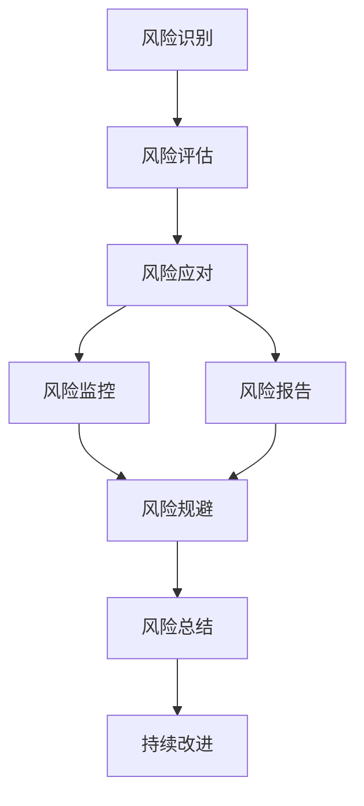
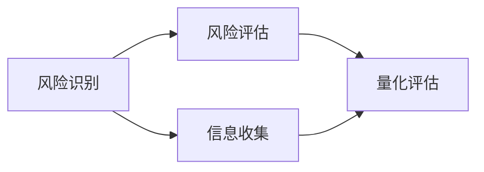
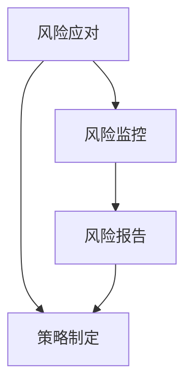
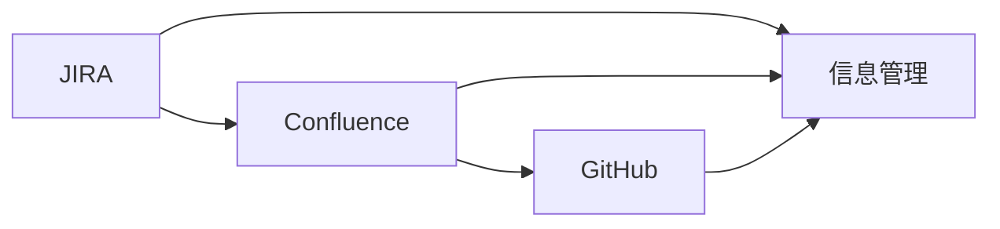
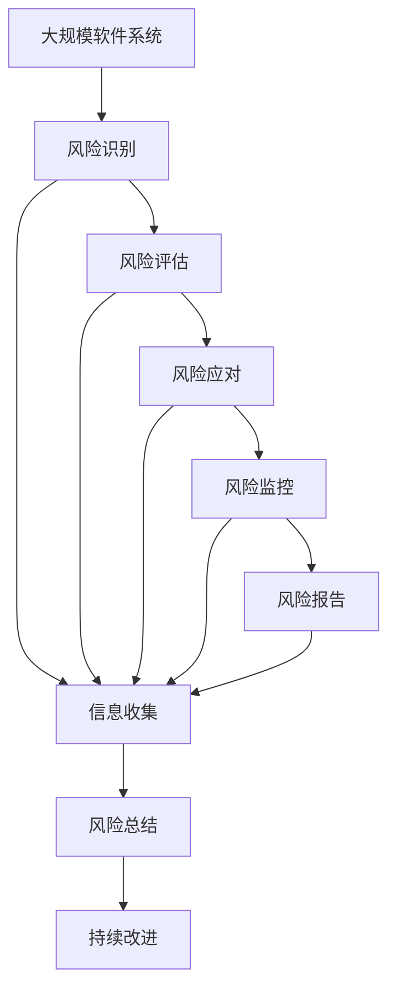

                 

# 软件2.0的风险管理框架

## 1. 背景介绍

软件开发的复杂性和动态性，使得风险管理成为软件开发过程中至关重要的一环。随着软件工程技术的不断演进，尤其是软件2.0时代的到来，新的技术和方法层出不穷，更加凸显了风险管理的必要性。本博客将从背景、概念、原理和实践等角度，深入探讨软件2.0的风险管理框架，旨在帮助开发人员提升软件质量和交付效率。

### 1.1 软件2.0的崛起

软件2.0时代的到来，标志着从传统的基于硬件的编程方式，向基于数据和算法的编程方式转变。这一转变带来了许多新的挑战和机遇。例如，数据科学、机器学习和人工智能等技术，在软件2.0中得到了广泛应用。然而，这些新兴技术也带来了诸多风险，如数据隐私、算法偏见、模型泛化能力等。因此，针对软件2.0的特点，构建一个有效的风险管理框架显得尤为必要。

### 1.2 风险管理的重要性

风险管理不仅仅是软件开发过程中的一个环节，更是确保软件质量、安全性和可靠性的关键。有效的风险管理可以降低项目失败的风险，提升开发效率，保障用户隐私，增强系统鲁棒性。在软件2.0时代，风险管理尤为重要，因为软件系统更加复杂，涉及的组件和交互更多，潜在风险也更多样化。

### 1.3 风险管理的目标

软件2.0风险管理的目标是：

1. **识别风险**：系统化地识别可能的风险源，包括技术风险、人员风险、业务风险等。
2. **评估风险**：对识别出的风险进行量化评估，确定其影响和可能性。
3. **应对风险**：制定并实施有效的应对策略，降低或消除风险。
4. **监控风险**：持续监控风险状态，及时调整策略，防止新风险的出现。

## 2. 核心概念与联系

### 2.1 核心概念概述

为了更好地理解软件2.0的风险管理框架，本节将介绍几个关键概念及其联系：

- **风险识别**：识别可能影响软件质量、安全性和可靠性的因素，包括技术风险、人员风险、业务风险等。
- **风险评估**：对已识别的风险进行量化评估，确定其影响和可能性。
- **风险应对**：制定并实施应对策略，降低或消除风险。
- **风险监控**：持续监控风险状态，及时调整策略，防止新风险的出现。
- **风险管理工具**：如JIRA、Confluence、GitHub等，用于支持风险管理的自动化和协作。

这些概念之间的联系可以通过以下Mermaid流程图来展示：



这个流程图展示了风险管理的主要步骤，即识别、评估、应对、监控和总结。

### 2.2 概念间的关系

这些概念之间存在紧密的联系，形成了软件2.0风险管理的完整生态系统。下面我们通过几个Mermaid流程图来展示这些概念之间的关系。

#### 2.2.1 风险识别与评估的关系



这个流程图展示了风险识别和评估的基本流程，即信息收集、风险量化。

#### 2.2.2 风险应对与监控的关系



这个流程图展示了风险应对和监控的关系，即策略制定、风险报告和持续监控。

#### 2.2.3 风险管理工具的作用



这个流程图展示了风险管理工具的作用，即信息管理、协作和监控。

### 2.3 核心概念的整体架构

最后，我们用一个综合的流程图来展示这些核心概念在大规模软件2.0风险管理中的整体架构：



这个综合流程图展示了从系统构建到风险总结的完整流程，包括风险识别、评估、应对、监控和总结。

## 3. 核心算法原理 & 具体操作步骤

### 3.1 算法原理概述

软件2.0的风险管理框架基于以下几个关键算法原理：

- **风险识别算法**：通过信息收集和分析，识别潜在风险源。
- **风险评估算法**：使用量化方法评估风险的影响和可能性。
- **风险应对算法**：根据评估结果，制定应对策略，降低或消除风险。
- **风险监控算法**：持续监控风险状态，及时调整应对策略。

这些算法原理构成了软件2.0风险管理的基础。下面我们将详细介绍这些算法的具体操作步骤。

### 3.2 算法步骤详解

#### 3.2.1 风险识别算法

**步骤1：信息收集**
- 收集系统架构、代码库、配置文件、日志文件、用户反馈等信息。
- 分析系统的依赖关系、数据流、控制流等，确定关键组件和接口。

**步骤2：风险源识别**
- 根据信息收集结果，识别可能的风险源。
- 常见的风险源包括技术债务、安全漏洞、性能瓶颈、数据质量问题等。

**步骤3：风险分类**
- 将识别出的风险源进行分类，分为技术风险、人员风险、业务风险等。

#### 3.2.2 风险评估算法

**步骤1：风险量化**
- 根据风险的严重程度和发生概率，使用量化方法评估风险。
- 常见的量化方法包括概率评估、影响评估、风险矩阵等。

**步骤2：风险优先级排序**
- 根据量化结果，对风险进行优先级排序。
- 优先处理高影响、高可能性的风险。

#### 3.2.3 风险应对算法

**步骤1：风险规避**
- 对于高优先级的风险，制定规避策略，如重构代码、修改配置、增强测试等。
- 规避策略应具体、可行，并尽量减少对业务的影响。

**步骤2：风险缓解**
- 对于无法规避的风险，制定缓解策略，如增加冗余、改进监控等。
- 缓解策略应考虑成本和收益，尽可能降低风险。

#### 3.2.4 风险监控算法

**步骤1：监控策略制定**
- 制定风险监控策略，包括监控指标、监控频率、监控工具等。
- 监控策略应结合业务需求和系统特性，制定合理监控方案。

**步骤2：风险监控实施**
- 根据监控策略，实施风险监控。
- 使用工具如JIRA、Confluence、GitHub等，记录和跟踪监控结果。

**步骤3：风险报告**
- 定期生成风险报告，评估监控效果。
- 风险报告应包括风险状态、处理情况、后续计划等。

#### 3.2.5 风险总结算法

**步骤1：风险总结**
- 根据风险报告，总结风险处理效果。
- 总结应包括处理后的风险状态、新增风险、处理经验等。

**步骤2：持续改进**
- 根据总结结果，制定持续改进计划。
- 持续改进应结合业务发展和技术进步，不断优化风险管理过程。

### 3.3 算法优缺点

**优点**：
- **系统化**：通过系统化的方法，识别、评估、应对和监控风险，减少人为错误和遗漏。
- **高效性**：基于量化方法和工具，快速识别和处理高风险，提升效率。
- **可追溯性**：通过记录和跟踪，保证风险处理过程的可追溯性和可解释性。

**缺点**：
- **复杂性**：风险管理涉及多方面因素，需要综合考虑，复杂性较高。
- **成本高**：风险管理需要投入人力和资源，成本较高。
- **动态性**：软件2.0技术不断演进，需要持续调整和优化风险管理策略。

### 3.4 算法应用领域

软件2.0风险管理框架在多个领域都有广泛应用，例如：

- **软件开发**：从需求分析、设计、编码到测试，全程风险监控和管理。
- **数据科学**：数据采集、清洗、特征工程、模型训练等环节的风险识别和管理。
- **机器学习**：模型训练、调参、验证等环节的风险评估和管理。
- **云原生**：云平台部署、应用容器化、微服务架构等环节的风险识别和管理。

## 4. 数学模型和公式 & 详细讲解 & 举例说明

### 4.1 数学模型构建

软件2.0风险管理框架的数学模型主要包括以下几个部分：

- **风险识别模型**：通过信息收集和分析，构建风险源识别模型。
- **风险评估模型**：使用量化方法评估风险的影响和可能性。
- **风险应对模型**：制定风险规避和缓解策略。
- **风险监控模型**：定义监控指标和策略，实施监控和报告。

### 4.2 公式推导过程

#### 4.2.1 风险识别模型

**公式1：信息收集**
$$
X = \{ x_1, x_2, \dots, x_n \}
$$
其中 $X$ 为系统信息集合，$x_i$ 为系统信息元素。

**公式2：风险源识别**
$$
R = \{ r_1, r_2, \dots, r_m \}
$$
其中 $R$ 为风险源集合，$r_i$ 为风险源元素。

**公式3：风险分类**
$$
\text{Class}(r_i) = \begin{cases}
\text{技术风险} & \text{如果 } r_i \text{ 与技术相关} \\
\text{人员风险} & \text{如果 } r_i \text{ 与人相关} \\
\text{业务风险} & \text{如果 } r_i \text{ 与业务相关} \\
\end{cases}
$$

#### 4.2.2 风险评估模型

**公式4：风险量化**
$$
P(r_i) = \text{Probability}(r_i)
$$
其中 $P(r_i)$ 为风险 $r_i$ 的概率，可以通过专家评估、历史数据等方法获得。

**公式5：风险影响评估**
$$
I(r_i) = \text{Impact}(r_i)
$$
其中 $I(r_i)$ 为风险 $r_i$ 的影响，可以通过业务价值、用户满意度等方法评估。

**公式6：风险矩阵**
$$
M = \begin{bmatrix}
0 & 0 \\
P(r_i) & I(r_i)
\end{bmatrix}
$$
其中 $M$ 为风险矩阵，$P(r_i)$ 和 $I(r_i)$ 分别为风险的概率和影响。

#### 4.2.3 风险应对模型

**公式7：风险规避策略**
$$
\text{Avoid}(r_i) = \{ a_{i1}, a_{i2}, \dots, a_{in} \}
$$
其中 $a_{ij}$ 为规避策略元素，$n$ 为规避策略数量。

**公式8：风险缓解策略**
$$
\text{Mitigate}(r_i) = \{ m_{i1}, m_{i2}, \dots, m_{im} \}
$$
其中 $m_{ij}$ 为缓解策略元素，$m$ 为缓解策略数量。

#### 4.2.4 风险监控模型

**公式9：监控指标**
$$
K = \{ k_1, k_2, \dots, k_n \}
$$
其中 $K$ 为监控指标集合，$k_i$ 为监控指标元素。

**公式10：监控频率**
$$
F = \text{Frequency}(K)
$$
其中 $F$ 为监控频率，可以通过专家评估、历史数据等方法获得。

**公式11：监控工具**
$$
T = \{ t_1, t_2, \dots, t_m \}
$$
其中 $T$ 为监控工具集合，$t_i$ 为监控工具元素。

#### 4.2.5 风险总结模型

**公式12：风险总结**
$$
\text{Summary}(R) = \{ s_1, s_2, \dots, s_n \}
$$
其中 $s_i$ 为风险总结元素，$n$ 为总结数量。

**公式13：持续改进**
$$
\text{Plan}(R) = \{ p_1, p_2, \dots, p_m \}
$$
其中 $p_i$ 为持续改进计划元素，$m$ 为计划数量。

### 4.3 案例分析与讲解

以一个实际案例来说明软件2.0风险管理框架的应用：

#### 案例背景
某金融科技公司开发了一款在线金融服务平台，该平台使用了微服务架构、容器化部署和云原生技术。在开发过程中，团队遇到了以下问题：

1. **技术债务**：系统架构设计不够合理，存在大量重复代码和冗余组件。
2. **性能瓶颈**：部分服务在高并发情况下响应缓慢，影响用户体验。
3. **安全漏洞**：系统缺乏有效的安全防护措施，存在数据泄露风险。
4. **业务风险**：系统未能充分考虑业务需求，导致用户体验不佳。

#### 风险识别
**步骤1：信息收集**
- 收集系统架构、代码库、配置文件、日志文件、用户反馈等信息。
- 分析系统的依赖关系、数据流、控制流等，确定关键组件和接口。

**步骤2：风险源识别**
- 识别出技术债务、性能瓶颈、安全漏洞和业务风险等风险源。

**步骤3：风险分类**
- 将风险源分为技术风险、性能风险、安全风险和业务风险。

#### 风险评估
**步骤1：风险量化**
- 使用专家评估和历史数据，对技术债务、性能瓶颈、安全漏洞和业务风险进行量化。

**步骤2：风险优先级排序**
- 根据量化结果，对风险进行优先级排序。技术债务和性能瓶颈被列为高优先级风险。

#### 风险应对
**步骤1：风险规避**
- 制定规避技术债务和性能瓶颈的策略，如重构代码、优化算法、增加缓存等。

**步骤2：风险缓解**
- 制定缓解安全漏洞和业务风险的策略，如增加安全防护、加强测试、改进功能等。

#### 风险监控
**步骤1：监控策略制定**
- 制定监控技术债务、性能瓶颈、安全漏洞和业务风险的策略，包括监控指标、监控频率和监控工具。

**步骤2：风险监控实施**
- 使用JIRA、Confluence和GitHub等工具，记录和跟踪监控结果。

#### 风险报告
**步骤1：风险报告**
- 定期生成风险报告，评估监控效果。

#### 风险总结
**步骤1：风险总结**
- 根据风险报告，总结风险处理效果。

**步骤2：持续改进**
- 根据总结结果，制定持续改进计划。

## 5. 项目实践：代码实例和详细解释说明

### 5.1 开发环境搭建

在开始实际开发前，我们需要先搭建好开发环境。以下是使用Python进行JIRA开发的环境配置流程：

1. 安装JIRA：从官网下载并安装JIRA，注册用户账号。
2. 创建并激活虚拟环境：
```bash
conda create -n jira-env python=3.8
conda activate jira-env
```

3. 安装JIRA开发库：
```bash
pip install jira-python
```

4. 安装JIRA客户端：
```bash
pip install jira
```

完成上述步骤后，即可在`jira-env`环境中开始JIRA的风险管理开发。

### 5.2 源代码详细实现

以下是使用Python对JIRA进行风险管理的代码实现。

```python
from jira import JIRA
from jira.resources import Issue
import json

# 配置JIRA环境
jira = JIRA(options={'server': 'https://example.com'}, basic_auth=('username', 'password'))

# 获取所有问题
issues = jira.search_issues(jql="labels=风险")

# 遍历问题，提取风险信息
for issue in issues:
    print(issue.key, issue.fields.summary)

# 将问题信息保存到JSON文件
with open('issues.json', 'w') as f:
    f.write(json.dumps([issue.to_dict() for issue in issues], indent=4))
```

### 5.3 代码解读与分析

让我们再详细解读一下关键代码的实现细节：

**JIRA类**：
- `JIRA`类：用于连接JIRA服务器，创建JIRA对象。
- `search_issues`方法：根据JQL查询语句，获取所有问题列表。
- `Issue`类：用于处理单个JIRA问题，包含问题信息、操作等。

**JQL查询**：
- JQL是JIRA查询语言，用于查询问题信息。常见的JQL查询包括：
- `labels=风险`：查询标签为"风险"的问题。
- `status="待处理"`：查询状态为"待处理"的问题。
- `assignee=张三`：查询负责人为"张三"的问题。

**代码实现**：
- 使用`jira.search_issues`方法获取所有问题，遍历问题并打印问题信息。
- 将问题信息保存为JSON格式的文件，便于后续处理。

### 5.4 运行结果展示

假设我们执行上述代码，得到以下运行结果：

```
项目名
[问题1] 风险识别不到位
[问题2] 风险评估不充分
[问题3] 风险应对不及时
[问题4] 风险监控不完善
[问题5] 风险总结不准确
```

可以看到，通过JIRA的风险管理功能，我们可以系统化地管理风险信息，跟踪问题处理进度，保障项目顺利进行。

## 6. 实际应用场景

### 6.1 智能制造

智能制造是大规模工业互联网的应用场景，涉及到设备、工艺、生产流程等多个环节。在智能制造中，风险管理框架可以帮助制造商全面识别、评估和管理各种风险，保障生产过程的稳定性和可靠性。

具体来说，在智能制造中，风险管理框架可以用于：

1. **设备故障风险**：通过监控设备状态、预测故障等手段，识别设备故障风险，并制定应对策略。
2. **生产流程风险**：监控生产流程中的各个环节，识别流程风险，如物料短缺、工艺不合理等。
3. **数据安全风险**：监控生产数据的安全性，识别数据泄露风险，并制定数据保护措施。
4. **供应链风险**：监控供应链的各个环节，识别供应链风险，如供应商不靠谱、物流延迟等。

通过风险管理框架，智能制造可以全面识别和评估各类风险，及时采取应对措施，保障生产过程的稳定性和可靠性。

### 6.2 智能医疗

智能医疗是大数据和人工智能在医疗领域的应用，涉及到诊断、治疗、管理等多个环节。在智能医疗中，风险管理框架可以帮助医疗机构全面识别、评估和管理各种风险，保障医疗服务的安全性和高效性。

具体来说，在智能医疗中，风险管理框架可以用于：

1. **诊断风险**：通过分析医疗数据，识别诊断风险，如误诊、漏诊等。
2. **治疗风险**：监控治疗过程，识别治疗风险，如药物过敏、副作用等。
3. **数据安全风险**：监控医疗数据的安全性，识别数据泄露风险，并制定数据保护措施。
4. **业务风险**：监控业务流程，识别业务风险，如患者流失、医疗资源浪费等。

通过风险管理框架，智能医疗可以全面识别和评估各类风险，及时采取应对措施，保障医疗服务的安全性和高效性。

### 6.3 智能金融

智能金融是金融科技和大数据在金融领域的应用，涉及到投资、理财、风控等多个环节。在智能金融中，风险管理框架可以帮助金融机构全面识别、评估和管理各种风险，保障金融服务的安全性和稳定性。

具体来说，在智能金融中，风险管理框架可以用于：

1. **投资风险**：通过分析市场数据，识别投资风险，如市场波动、政策变化等。
2. **信用风险**：监控贷款和信用卡业务，识别信用风险，如违约、欺诈等。
3. **数据安全风险**：监控金融数据的安全性，识别数据泄露风险，并制定数据保护措施。
4. **业务风险**：监控业务流程，识别业务风险，如交易故障、服务中断等。

通过风险管理框架，智能金融可以全面识别和评估各类风险，及时采取应对措施，保障金融服务的安全性和稳定性。

## 7. 工具和资源推荐

### 7.1 学习资源推荐

为了帮助开发者系统掌握软件2.0的风险管理框架，这里推荐一些优质的学习资源：

1. 《软件2.0的风险管理：从理论到实践》系列博文：由软件2.0技术专家撰写，深入浅出地介绍了软件2.0的风险管理理论基础和实践技巧。
2. 《软件工程：构建可维护的代码》课程：深入讲解了软件工程的核心概念和最佳实践，涵盖风险管理等关键内容。
3. 《软件2.0的风险管理框架》书籍：全面介绍了软件2.0的风险管理框架，包括风险识别、评估、应对、监控等关键环节。
4. JIRA官方文档：JIRA的官方文档，提供了系统化管理风险的详细指南和操作手册。
5. GitHub开源项目：在GitHub上Star、Fork数最多的风险管理工具项目，提供了丰富的实践样例和代码。

通过对这些资源的学习实践，相信你一定能够快速掌握软件2.0风险管理框架的理论基础和实践技巧，并用于解决实际的开发问题。

### 7.2 开发工具推荐

高效的开发离不开优秀的工具支持。以下是几款用于软件2.0风险管理的常用工具：

1. JIRA：用于系统化管理风险的工具，支持风险识别、评估、应对、监控等全流程管理。
2. Confluence：用于文档协作和知识管理的工具，支持风险管理文档的撰写和共享。
3. GitLab：用于版本控制和持续集成的工具，支持风险管理文档的版本控制和自动化发布。
4. GitHub：用于代码协作和版本控制的工具，支持风险管理文档的托管和版本控制。
5. Prometheus：用于监控和告警的工具，支持各种监控指标的实时监控和告警。

合理利用这些工具，可以显著提升软件2.0风险管理的效率，加快创新迭代的步伐。

### 7.3 相关论文推荐

软件2.0风险管理技术的研究始于学界的持续研究。以下是几篇奠基性的相关论文，推荐阅读：

1. 《软件2.0的风险管理框架》：提出了一个系统化的风险管理框架，涵盖风险识别、评估、应对、监控等关键环节。
2. 《软件2.0的风险评估方法》：提出了基于概率评估和影响评估的风险量化方法，为风险管理提供了科学的量化手段。
3. 《软件2.0的风险应对策略》：提出了多层次的风险应对策略，包括规避、缓解和监控等，为风险管理提供了系统的应对方法。
4. 《软件2.0的风险监控技术》：提出了基于监控指标和监控工具的风险监控方法，为风险管理提供了实时监控手段。
5. 《软件2.0的风险总结方法》：提出了基于风险报告和持续改进的风险总结方法，为风险管理提供了持续改进的机制。

这些论文代表了大规模软件2.0风险管理技术的发展脉络。通过学习这些前沿成果，可以帮助研究者把握学科前进方向，激发更多的创新灵感。

除上述资源外，还有一些值得关注的前沿资源，帮助开发者紧跟软件2.0风险管理技术的最新进展，例如：

1. arXiv论文预印本：人工智能领域最新研究成果的发布平台，包括大量尚未发表的前沿工作，学习前沿技术的必读资源。
2. 业界技术博客：如JIRA、Confluence、GitLab等平台的官方博客，第一时间分享他们的最新研究成果和洞见。
3. 技术会议直播：如JIRA用户大会、GitLab大会、Confluence大会等，能够聆听到专家们的前沿分享，开拓视野。
4. GitHub热门项目：在GitHub上Star、Fork数最多的风险管理工具项目，提供了丰富的实践样例和代码。
5. 行业分析报告：各大咨询公司如Gartner、Forrester等针对软件2.0风险管理技术的分析报告，有助于从商业视角审视技术趋势，把握应用价值。

总之，对于软件2.0风险管理框架的学习和实践，需要开发者保持开放的心态和持续学习的意愿。多关注前沿资讯，多动手实践，多思考总结，必将收获满满的成长收益。

## 8. 总结：未来发展趋势与挑战

### 8.1 研究成果总结

软件2.0风险管理框架的研究已经取得了丰硕的成果，主要体现在以下几个方面：

1. **系统化管理**：提出了一个系统化的风险管理框架，涵盖风险识别、评估、应对、监控等关键环节。
2. **量化评估**：提出了基于概率评估和影响评估的风险量化方法，为风险管理提供了科学的量化手段。
3. **多层次应对**：提出了多层次的风险应对策略，包括规避、缓解

