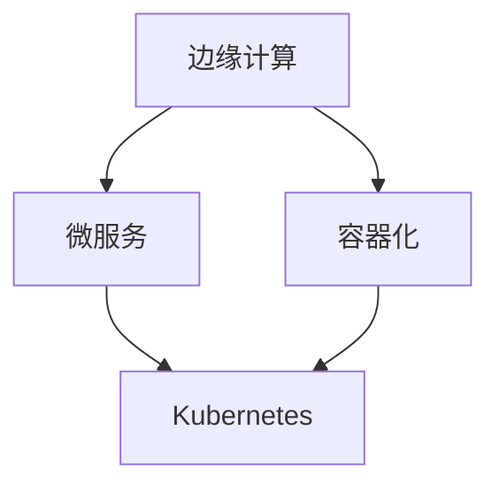
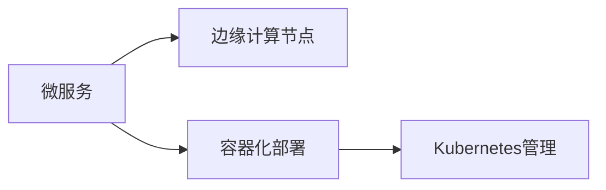
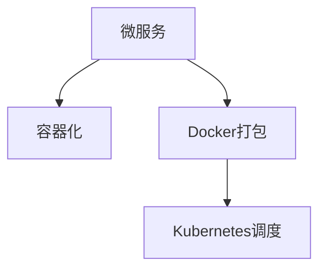
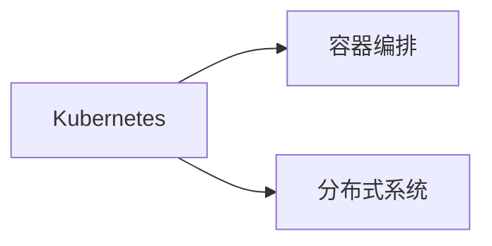
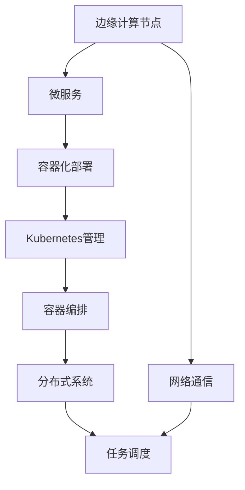

                 

# 边缘计算管理：优化分布式计算资源

> 关键词：边缘计算, 分布式计算, 计算资源管理, 性能优化, 微服务, 容器化, Kubernetes, 分布式系统, 云原生

## 1. 背景介绍

### 1.1 问题由来
随着互联网技术的迅猛发展，云计算和大数据在各行各业的应用越来越广泛。然而，随着数据量的爆炸式增长，传统中心化的云计算模式面临着诸多问题：如数据传输延迟高、网络带宽不足、隐私泄露风险大等。这些问题严重制约了云计算的扩展性和可用性。

为应对这些挑战，边缘计算（Edge Computing）应运而生。边缘计算将计算资源和数据存储分布式部署在网络边缘节点，极大提升了数据处理效率和响应速度，降低了延迟，优化了资源利用率。因此，边缘计算在物联网、车联网、工业互联网等场景中得到了广泛应用。

### 1.2 问题核心关键点
边缘计算的核心在于分布式计算资源的优化管理和性能优化。传统云平台通过集中式资源管理和调度，可以很好地控制计算资源的利用率，但在边缘场景下，资源有限、环境复杂，传统方法往往难以适用。

边缘计算管理需要考虑以下几个关键问题：

1. **资源分配与调度**：如何在分布式环境中合理分配计算资源，并根据负载动态调整资源分配。
2. **容错与可靠性**：如何确保计算任务的高可用性和容错性。
3. **安全与隐私**：如何在分布式环境中保护数据安全，避免数据泄露。
4. **优化性能**：如何通过算法和架构优化，提高边缘计算系统的整体性能。
5. **应用编排与监控**：如何将边缘计算资源与业务应用无缝集成，并进行实时监控和调优。

### 1.3 问题研究意义
研究边缘计算管理，对于拓展边缘计算应用范围，提高计算资源的利用率和任务处理性能，加速云计算向边缘的迁移，具有重要意义：

1. 降低边缘计算部署和运维成本。通过合理的资源管理，可以最大化利用边缘资源，减少不必要的计算和存储开销。
2. 提高边缘计算任务处理速度和响应时间。优化调度算法和任务编排策略，可以大幅提升边缘计算系统处理能力。
3. 保障边缘计算系统的稳定性和可靠性。通过容错机制和安全策略，可以确保计算任务不因单个节点故障而中断。
4. 促进边缘计算生态系统发展。构建一套完整、灵活的边缘计算管理框架，能够快速适配各类边缘计算环境。
5. 推动边缘计算技术的产业化进程。基于高效边缘计算管理方案，可以快速部署和应用边缘计算，加速云计算的落地。

## 2. 核心概念与联系

### 2.1 核心概念概述

为了更好地理解边缘计算管理，本节将介绍几个关键概念：

- **边缘计算**：在网络边缘节点上进行数据处理和计算，以降低延迟、提升效率的技术。常见边缘节点包括IoT设备、移动设备、边缘服务器等。
- **微服务架构**：将大系统拆分成多个独立的小服务，每个服务负责特定功能，并通过轻量级通信机制实现协同工作的架构。
- **容器化技术**：将应用打包到容器中，便于部署、管理和迁移的技术。
- **Kubernetes**：开源的容器编排平台，支持容器化应用在集群中的自动化管理、部署和调度。
- **分布式系统**：由多个节点组成的计算系统，通过网络通信实现协同工作。

这些概念之间存在着紧密的联系，形成了边缘计算管理的基本框架。以下通过一个Mermaid流程图来展示它们之间的关系：



这个流程图展示了边缘计算、微服务架构、容器化技术和Kubernetes之间的关系：

1. 边缘计算通常采用微服务架构，将复杂任务拆分成多个独立的服务，提升系统灵活性和可扩展性。
2. 微服务通常采用容器化技术进行打包和部署，以提升应用的部署效率和管理便利性。
3. Kubernetes作为容器编排工具，能够自动化管理、部署和调度容器化应用，支持微服务的分布式部署和管理。

通过这些技术手段，边缘计算系统能够高效利用分布式计算资源，实现计算任务的优化管理和性能优化。

### 2.2 概念间的关系

这些核心概念之间存在着紧密的联系，形成了边缘计算管理的完整生态系统。以下通过几个Mermaid流程图来展示这些概念之间的关系。

#### 2.2.1 边缘计算的微服务部署



这个流程图展示了微服务在边缘计算节点上的部署流程：

1. 将微服务打包为容器化应用。
2. 通过Kubernetes在边缘计算节点上自动化部署和调度容器。
3. 微服务通过网络通信协同工作，实现分布式计算任务的处理。

#### 2.2.2 容器化技术在微服务中的应用



这个流程图展示了微服务在容器化技术中的应用：

1. 将微服务打包为Docker容器。
2. 通过Kubernetes调度容器，实现微服务的自动化部署和扩展。
3. 容器化技术使得微服务能够在多个边缘节点上独立运行，提升系统的可靠性和扩展性。

#### 2.2.3 Kubernetes在分布式系统中的应用



这个流程图展示了Kubernetes在分布式系统中的应用：

1. Kubernetes通过容器编排技术，实现微服务的自动化部署和调度。
2. 分布式系统通过网络通信协同工作，实现计算任务的分布式处理。
3. Kubernetes能够优化资源的分配和调度，提升系统的整体性能。

### 2.3 核心概念的整体架构

最后，我们用一个综合的流程图来展示这些核心概念在边缘计算管理中的整体架构：



这个综合流程图展示了边缘计算管理的完整过程：

1. 边缘计算节点通过微服务实现分布式计算任务的处理。
2. 微服务采用容器化技术进行打包和部署，便于自动化管理和扩展。
3. Kubernetes作为容器编排工具，实现容器化应用的自动化部署和调度。
4. 分布式系统通过网络通信协同工作，实现计算任务的分布式处理。
5. 网络通信实现边缘计算节点之间的数据传输和任务调度。

通过这些技术手段，边缘计算系统能够高效利用分布式计算资源，实现计算任务的优化管理和性能优化。

## 3. 核心算法原理 & 具体操作步骤
### 3.1 算法原理概述

边缘计算管理主要涉及资源分配与调度、容错与可靠性、安全与隐私、优化性能和应用编排与监控等方面。以下是一些常用的算法原理和操作步骤：

#### 3.1.1 资源分配与调度

资源分配与调度是边缘计算管理的基础。在分布式环境中，资源分配需要考虑以下几个因素：

- **负载均衡**：根据各节点的负载情况，动态分配计算任务，避免某些节点过载。
- **资源池管理**：将边缘资源分为多个池，根据任务需求选择合适的资源池。
- **自适应调整**：根据任务特点和系统状态，动态调整资源分配策略。

常用的算法包括：

- **静态资源分配**：根据历史负载和任务特点，静态分配计算资源。
- **动态资源分配**：根据实时负载和系统状态，动态调整计算资源。
- **负载感知调度**：根据任务负载和节点状态，动态调整计算资源和任务调度。

#### 3.1.2 容错与可靠性

容错与可靠性是边缘计算管理的核心。在分布式环境中，节点故障、网络异常等情况常见，需要采取以下措施：

- **冗余机制**：通过节点冗余和数据冗余，避免单点故障。
- **容错技术**：采用消息队列、分布式锁等技术，保证计算任务的高可用性。
- **故障恢复**：在节点故障时，自动恢复任务处理，避免任务中断。

常用的算法包括：

- **主从复制**：在节点之间进行数据复制，保证数据可靠性。
- **分布式锁**：通过分布式锁机制，保证节点之间的协同工作。
- **重试机制**：在节点故障时，自动重试任务处理，保证任务完成。

#### 3.1.3 安全与隐私

安全与隐私是边缘计算管理的重点。在分布式环境中，数据安全和隐私保护至关重要，需要采取以下措施：

- **数据加密**：通过加密技术，保护数据传输和存储安全。
- **访问控制**：通过访问控制技术，限制数据访问权限。
- **审计与监控**：通过审计和监控机制，保障数据和应用的安全性。

常用的算法包括：

- **数据加密算法**：如AES、RSA等，保障数据传输和存储的安全性。
- **访问控制技术**：如RBAC、ABAC等，限制数据访问权限。
- **安全审计与监控**：通过日志记录和审计机制，保障数据和应用的安全性。

#### 3.1.4 优化性能

优化性能是边缘计算管理的难点。在分布式环境中，计算任务的处理和调度需要考虑以下几个因素：

- **任务调度优化**：通过任务调度优化算法，提高计算任务的执行效率。
- **资源利用率优化**：通过资源利用率优化算法，最大化利用边缘资源。
- **网络通信优化**：通过网络通信优化算法，减少数据传输延迟。

常用的算法包括：

- **动态任务调度**：根据任务负载和系统状态，动态调整任务调度策略。
- **资源共享策略**：通过资源共享策略，提高资源利用率。
- **网络优化技术**：如缓存技术、负载均衡技术等，减少数据传输延迟。

#### 3.1.5 应用编排与监控

应用编排与监控是边缘计算管理的保障。在分布式环境中，任务编排和监控需要考虑以下几个因素：

- **应用编排**：通过编排技术，将计算任务与资源分配结合，提升系统灵活性和可扩展性。
- **实时监控**：通过实时监控技术，保障计算任务的高可用性和性能优化。
- **应用升级**：通过应用升级技术，提升系统的稳定性和可靠性。

常用的算法包括：

- **应用编排工具**：如Kubernetes、K8s等，支持应用的自动化编排和调度。
- **实时监控工具**：如Prometheus、Grafana等，支持实时监控和告警。
- **应用升级技术**：如版本管理、A/B测试等，保障应用的稳定性和可靠性。

### 3.2 算法步骤详解

以下是一些常用的算法步骤详解，以便更好地理解和应用边缘计算管理：

#### 3.2.1 静态资源分配算法

静态资源分配算法主要根据历史负载和任务特点，静态分配计算资源。其步骤如下：

1. **历史数据收集**：收集历史任务负载和资源使用情况，建立历史数据模型。
2. **任务特性分析**：分析任务的特性和资源需求，确定任务优先级。
3. **资源分配策略**：根据历史数据模型和任务优先级，静态分配计算资源。
4. **资源状态监控**：实时监控资源使用情况，及时调整资源分配策略。

#### 3.2.2 动态资源分配算法

动态资源分配算法主要根据实时负载和系统状态，动态调整计算资源。其步骤如下：

1. **实时数据收集**：实时收集任务负载和资源使用情况，建立实时数据模型。
2. **任务负载预测**：预测任务负载和资源需求，确定任务优先级。
3. **资源分配策略**：根据实时数据模型和任务优先级，动态调整计算资源。
4. **资源状态监控**：实时监控资源使用情况，及时调整资源分配策略。

#### 3.2.3 负载感知调度算法

负载感知调度算法主要根据任务负载和节点状态，动态调整计算资源和任务调度。其步骤如下：

1. **负载感知计算**：根据任务负载和节点状态，计算任务负载均衡度。
2. **任务调度优化**：根据负载均衡度，优化任务调度策略。
3. **资源分配优化**：根据任务调度结果，优化资源分配策略。
4. **资源状态监控**：实时监控资源使用情况，及时调整任务调度和资源分配策略。

#### 3.2.4 冗余机制算法

冗余机制算法主要通过节点冗余和数据冗余，避免单点故障。其步骤如下：

1. **节点冗余设计**：根据任务负载和系统状态，设计节点冗余策略。
2. **数据冗余备份**：通过数据冗余备份，保证数据可靠性。
3. **故障检测与恢复**：实时检测节点状态，及时发现故障并进行恢复。

#### 3.2.5 容错技术算法

容错技术算法主要采用消息队列、分布式锁等技术，保证计算任务的高可用性。其步骤如下：

1. **消息队列设计**：设计消息队列机制，保障任务调度的可靠性和容错性。
2. **分布式锁机制**：采用分布式锁机制，保证节点之间的协同工作。
3. **重试机制设计**：设计任务重试机制，避免任务中断和失败。

#### 3.2.6 数据加密算法

数据加密算法主要通过加密技术，保护数据传输和存储安全。其步骤如下：

1. **数据加密策略**：根据数据特性，设计加密策略。
2. **加密算法选择**：选择合适的加密算法，保障数据安全性。
3. **数据加密实现**：实现数据加密算法，保障数据传输和存储安全。

#### 3.2.7 访问控制技术

访问控制技术主要通过RBAC、ABAC等技术，限制数据访问权限。其步骤如下：

1. **权限策略设计**：根据任务需求，设计访问控制策略。
2. **权限分配实现**：实现访问控制技术，限制数据访问权限。
3. **权限审计与监控**：实时监控权限使用情况，保障数据安全性。

#### 3.2.8 实时监控工具

实时监控工具主要通过Prometheus、Grafana等工具，支持实时监控和告警。其步骤如下：

1. **监控指标设计**：设计监控指标，实时监控任务和资源状态。
2. **监控工具选择**：选择合适的实时监控工具，保障监控数据的实时性和可靠性。
3. **告警机制设计**：设计告警机制，及时发现异常并发出告警。

#### 3.2.9 应用编排工具

应用编排工具主要通过Kubernetes、K8s等工具，支持应用的自动化编排和调度。其步骤如下：

1. **应用编排设计**：根据任务需求，设计应用编排策略。
2. **编排工具选择**：选择合适的应用编排工具，支持应用的自动化部署和调度。
3. **编排流程优化**：优化编排流程，提升应用的灵活性和可扩展性。

#### 3.2.10 应用升级技术

应用升级技术主要通过版本管理、A/B测试等技术，保障应用的稳定性和可靠性。其步骤如下：

1. **版本管理策略**：根据任务需求，设计版本管理策略。
2. **升级流程设计**：设计应用升级流程，保障应用的稳定性和可靠性。
3. **测试与验证**：进行A/B测试等验证，确保应用的稳定性和可靠性。

### 3.3 算法优缺点

边缘计算管理算法具有以下优点：

1. **灵活性**：根据任务需求和系统状态，动态调整资源分配和任务调度，提高系统的灵活性和可扩展性。
2. **可靠性**：通过冗余机制、容错技术和负载感知调度，保障计算任务的高可用性和容错性。
3. **安全性**：通过数据加密、访问控制和实时监控，保障数据和应用的安全性。
4. **性能优化**：通过任务调度优化、资源利用率优化和网络通信优化，提升系统的整体性能。

边缘计算管理算法也存在一些缺点：

1. **复杂性**：算法设计复杂，需要考虑多方面因素，如资源分配、容错、安全等，增加了系统的复杂性。
2. **资源消耗**：算法实现需要消耗大量计算资源，如内存、CPU等，增加了系统的运行成本。
3. **延迟**：算法实现可能会带来一定的延迟，影响系统的实时性和响应速度。
4. **数据冗余**：冗余机制可能会带来数据冗余，增加存储和传输开销。

### 3.4 算法应用领域

边缘计算管理算法主要应用于以下领域：

#### 3.4.1 物联网

物联网（IoT）设备通常分布在网络边缘，边缘计算管理算法可以帮助优化计算资源分配，提升数据处理效率，保障系统稳定性。

#### 3.4.2 车联网

车联网设备通常分布在车辆、路边设施等网络边缘，边缘计算管理算法可以帮助优化车辆计算任务，提升数据处理效率，保障车辆安全。

#### 3.4.3 工业互联网

工业互联网设备通常分布在生产车间、工厂等网络边缘，边缘计算管理算法可以帮助优化生产任务，提升数据处理效率，保障生产安全。

#### 3.4.4 智能家居

智能家居设备通常分布在家庭环境中，边缘计算管理算法可以帮助优化家庭计算任务，提升数据处理效率，保障家庭安全。

#### 3.4.5 智慧城市

智慧城市系统通常分布在城市各个角落，边缘计算管理算法可以帮助优化城市计算任务，提升数据处理效率，保障城市安全。

## 4. 数学模型和公式 & 详细讲解 & 举例说明

### 4.1 数学模型构建

边缘计算管理涉及的数学模型较多，以下以资源分配与调度和任务调度优化为例，介绍常见的数学模型构建方法。

#### 4.1.1 资源分配与调度的数学模型

资源分配与调度的数学模型主要考虑以下几个变量：

- $R$：计算资源的总数。
- $T$：待分配的计算任务总数。
- $C$：计算资源池的总数。
- $d_t$：任务$t$的资源需求。
- $c_i$：资源池$i$的容量。
- $a_t^i$：任务$t$在资源池$i$上的分配比例。

资源分配与调度的目标是最小化资源利用率，同时最大化计算任务的完成率。数学模型如下：

$$
\begin{aligned}
& \min_{a_t^i} \sum_{t=1}^T \sum_{i=1}^C a_t^i \\
& \text{s.t.} \sum_{i=1}^C a_t^i = 1, \quad \forall t \\
& \sum_{t=1}^T d_t \leq R, \quad \sum_{i=1}^C c_i \leq R \\
& a_t^i \geq 0, \quad \forall t, i
\end{aligned}
$$

其中，第一个目标函数最小化资源利用率，第二个约束条件保证任务在每个资源池上的分配比例之和为1，第三个约束条件限制资源总需求不超过资源总数，第四个约束条件保证分配比例非负。

#### 4.1.2 任务调度的数学模型

任务调度的数学模型主要考虑以下几个变量：

- $T$：待调度的计算任务总数。
- $N$：可调度的节点总数。
- $d_t$：任务$t$的资源需求。
- $c_i$：节点$i$的容量。
- $a_t^i$：任务$t$在节点$i$上的分配比例。

任务调度的目标是最小化任务完成时间，同时最大化节点利用率。数学模型如下：

$$
\begin{aligned}
& \min_{a_t^i} \max_{i} \sum_{t=1}^T a_t^i \\
& \text{s.t.} \sum_{i=1}^N a_t^i = 1, \quad \forall t \\
& \sum_{t=1}^T d_t \leq \sum_{i=1}^N c_i \\
& a_t^i \geq 0, \quad \forall t, i
\end{aligned}
$$

其中，第一个目标函数最小化任务完成时间，第二个约束条件保证任务在每个节点上的分配比例之和为1，第三个约束条件限制任务总需求不超过节点总容量，第四个约束条件保证分配比例非负。

### 4.2 公式推导过程

#### 4.2.1 资源分配与调度的公式推导

资源分配与调度的公式推导主要通过线性规划求解。

根据上述数学模型，可以得到资源分配与调度的线性规划模型：

$$
\begin{aligned}
& \min_{a_t^i} \sum_{t=1}^T \sum_{i=1}^C a_t^i \\
& \text{s.t.} \sum_{i=1}^C a_t^i = 1, \quad \forall t \\
& \sum_{t=1}^T d_t \leq R, \quad \sum_{i=1}^C c_i \leq R \\
& a_t^i \geq 0, \quad \forall t, i
\end{aligned}
$$

通过求解上述线性规划模型，可以得到最优的资源分配与调度方案。

#### 4.2.2 任务调度的公式推导

任务调度的公式推导同样通过线性规划求解。

根据上述数学模型，可以得到任务调度的线性规划模型：

$$
\begin{aligned}
& \min_{a_t^i} \max_{i} \sum_{t=1}^T a_t^i \\
& \text{s.t.} \sum_{i=1}^N a_t^i = 1, \quad \forall t \\
& \sum_{t=1}^T d_t \leq \sum_{i=1}^N c_i \\
& a_t^i \geq 0, \quad \forall t, i
\end{aligned}
$$

通过求解上述线性规划模型，可以得到最优的任务调度方案。

### 4.3 案例分析与讲解

#### 4.3.1 资源分配与调度的案例分析

假设某智能工厂有10个加工车间，每个车间可以容纳1个任务，计算资源总容量为10。目前有5个加工任务，每个任务需要2个车间的计算资源。根据资源分配与调度的线性规划模型，可以得到最优的资源分配方案：

$$
\begin{aligned}
& \min_{a_t^i} \sum_{t=1}^5 \sum_{i=1}^{10} a_t^i \\
& \text{s.t.} \sum_{i=1}^{10} a_1^i = 1, \sum_{i=1}^{10} a_2^i = 1, \sum_{i=1}^{10} a_3^i = 1, \sum_{i=1}^{10} a_4^i = 1, \sum_{i=1}^{10} a_5^i = 1 \\
& 2 \leq \sum_{i=1}^{10} a_1^i + a_2^i + a_3^i + a_4^i + a_5^i \leq 10
\end{aligned}
$$

通过求解上述线性规划模型，可以得到最优的资源分配方案：每个任务分配2个车间资源，剩余2个车间保持空闲。

#### 4.3.2 任务调度的案例分析

假设某车联网系统有5个车辆节点，每个节点可以容纳1个任务，计算资源总容量为5。目前有2个车辆定位任务，每个任务需要2个节点的计算资源。根据任务调度的线性规划模型，可以得到最优的任务调度方案：

$$
\begin{aligned}
& \min_{a_t^i} \max_{i} \sum_{t=1}^2 a_t^i \\
& \text{s.t.} \sum_{i=1}^{5} a_1^i = 1, \sum_{i=1}^{5} a_2^i = 1 \\
& 2 \leq \sum_{i=1}^{5} a_1^i + a_2^i \leq 5
\end{aligned}
$$

通过求解上述线性规划模型，可以得到最优的任务调度方案：每个任务分配2个节点资源，剩余1个节点保持空闲。

## 5. 项目实践：代码实例和详细解释说明

### 5.1 开发环境搭建

在进行边缘计算管理项目实践前，我们需要准备好开发环境。以下是使用Python进行Kubernetes开发的环境配置流程：

1. 安装Anaconda：从官网下载并安装Anaconda，用于创建独立的Python环境。

2. 创建并激活虚拟环境：
```bash
conda create -n k8s-env python=3.8 
conda activate k8s-env
```

3. 安装Kubernetes：根据CUDA版本，从官网获取对应的安装命令。例如：
```bash
conda install kubernetes -c conda-forge
```

4. 安装各类工具包：
```bash
pip install numpy pandas scikit-learn matplotlib tqdm jupyter notebook ipython
```

完成上述步骤后，即可在`k8s-env`环境中开始边缘

