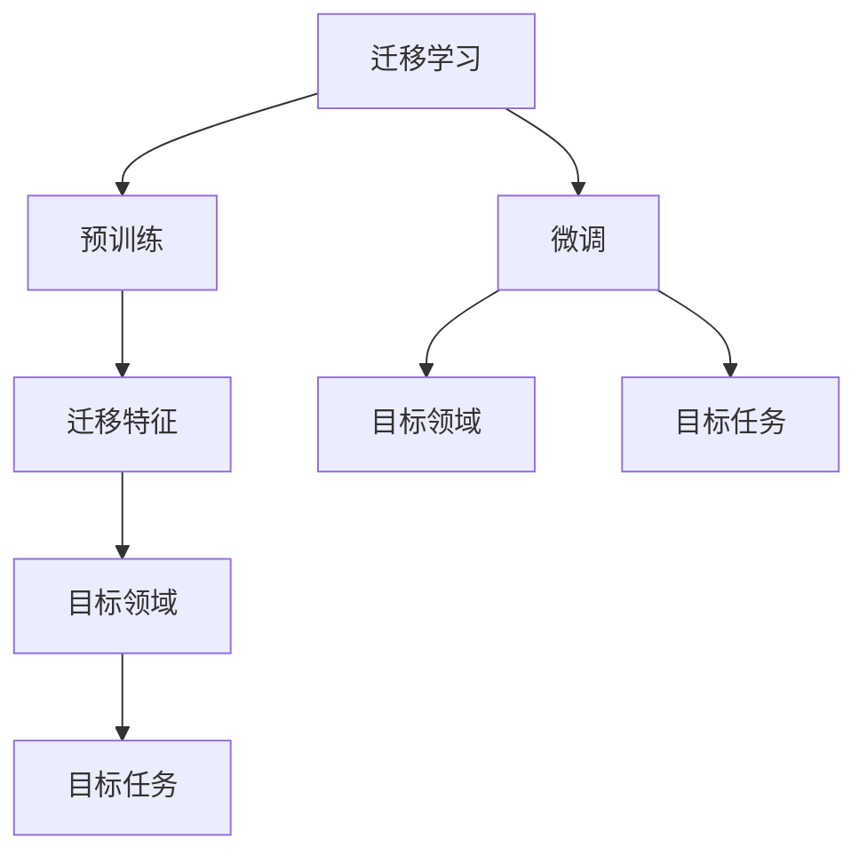
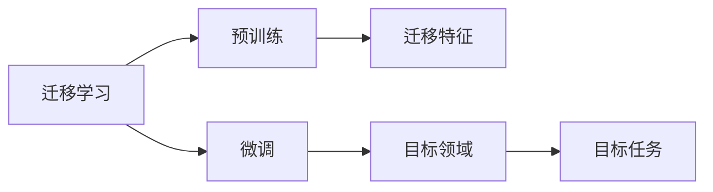
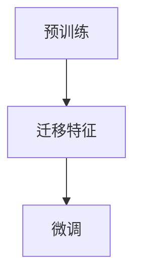
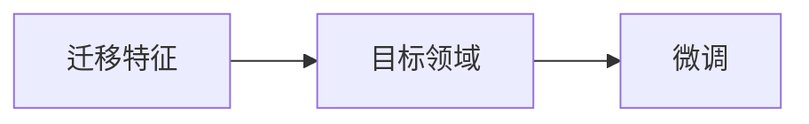
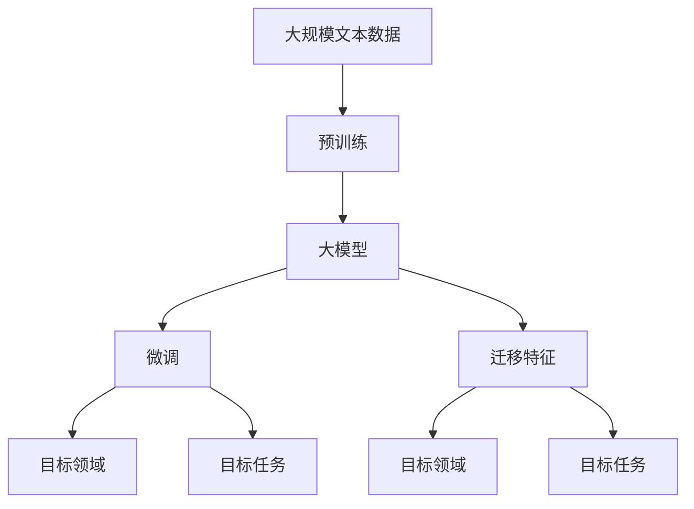

                 

# 迁移学习 (Transfer Learning)

> 关键词：迁移学习,预训练,微调,Fine-tuning,迁移特征,模型重用,域适应,跨领域学习

## 1. 背景介绍

### 1.1 问题由来
迁移学习（Transfer Learning）是一种机器学习范式，旨在通过从一个领域学习到的知识，帮助在新领域中更快地获取知识和解决新问题。这一概念最早由Don J. C. Littlejohn于1961年提出，但在深度学习时代才真正成为热门话题。迁移学习与传统的从头开始训练相比，具有显著的计算效率提升和性能提升，因此被广泛应用于各类领域。

近年来，大语言模型（如BERT, GPT等）的流行使得迁移学习的关注度进一步提升。预训练大模型通过在大规模无标签数据上进行学习，提取到丰富的通用特征，这些特征在不同领域和任务间具有高度的相似性和通用性，因此可以用作迁移学习的良好起点。在迁移学习框架下，通过微调（Fine-tuning）等手段，模型可以在新领域和任务上快速适应和优化，从而实现显著的性能提升。

### 1.2 问题核心关键点
迁移学习的核心在于将一个领域的知识迁移到另一个领域。其关键点包括：

- 预训练模型的选择：选择适合的预训练模型作为迁移的起点，通常选择预训练在通用领域的数据上表现较好的模型。
- 迁移特征的提取：从预训练模型中提取通用的迁移特征，用于在新领域或任务上进行微调。
- 微调的策略：在新领域或任务上使用微调技术，如 Fine-tuning，调整模型参数，适应新数据分布。
- 评价指标的选择：选择合适的评价指标评估迁移学习的效果，如精度、召回率、F1-score 等。

### 1.3 问题研究意义
迁移学习在机器学习和人工智能领域中具有重要意义，主要体现在以下几个方面：

1. **高效计算**：迁移学习可以避免从头训练模型所需的巨大计算资源和时间成本，大大提高模型的开发效率。
2. **数据依赖减少**：迁移学习通过重用已有知识，减少对新领域数据的依赖，特别适用于数据稀缺的情况。
3. **知识共享**：迁移学习促进了知识在领域间的共享和传递，加速了知识的应用和普及。
4. **泛化能力提升**：通过迁移学习，模型可以更好地在新领域中泛化，避免过拟合。
5. **跨领域应用**：迁移学习为跨领域学习提供了可能，使得机器学习模型可以在不同领域间应用。

## 2. 核心概念与联系

### 2.1 核心概念概述

为更好地理解迁移学习的核心原理，本节将介绍几个关键概念：

- 迁移学习（Transfer Learning）：从源领域学习到的知识迁移到目标领域的过程。预训练模型是迁移学习的核心。
- 预训练（Pre-training）：在大量无标签数据上训练模型，提取通用的特征和知识。
- 微调（Fine-tuning）：在预训练模型的基础上，使用目标领域或任务的标注数据，进一步调整模型参数，以适应新任务。
- 迁移特征（Transfer Feature）：预训练模型提取的通用特征，在目标领域或任务中具有一定适用性。
- 模型重用（Model Reuse）：将预训练模型用于新的领域或任务，减少从头训练新模型的工作量。

这些概念之间的逻辑关系可以通过以下Mermaid流程图来展示：



这个流程图展示了迁移学习的核心流程：

1. 预训练模型从源领域学习到通用的迁移特征。
2. 微调使用这些迁移特征，对目标领域或任务的标注数据进行进一步调整。
3. 目标领域和任务各具特色的数据和任务定义，影响微调过程。

### 2.2 概念间的关系

这些核心概念之间存在着紧密的联系，形成了迁移学习的完整生态系统。下面我们通过几个Mermaid流程图来展示这些概念之间的关系。

#### 2.2.1 迁移学习的基本流程



这个流程图展示了迁移学习的基本流程，即从预训练到微调的过程。

#### 2.2.2 预训练与微调的关系



这个流程图展示了预训练和微调之间的联系。预训练提取了通用的迁移特征，微调则进一步利用这些特征在新领域或任务上进行优化。

#### 2.2.3 迁移特征的利用



这个流程图展示了迁移特征如何被利用于目标领域或任务的微调过程。

### 2.3 核心概念的整体架构

最后，我们用一个综合的流程图来展示这些核心概念在大模型迁移学习中的整体架构：



这个综合流程图展示了从预训练到微调，再到迁移特征利用的完整过程。

## 3. 核心算法原理 & 具体操作步骤
### 3.1 算法原理概述

迁移学习的基本原理是通过预训练模型提取通用的特征和知识，然后在目标领域或任务上使用微调技术进一步优化模型，以适应新数据分布。

假设预训练模型为 $M_{\theta}$，其中 $\theta$ 为预训练得到的模型参数。目标领域的训练数据集为 $D=\{(x_i,y_i)\}_{i=1}^N$，其中 $x_i$ 为输入数据，$y_i$ 为标注标签。迁移学习的目标是在目标领域上，通过微调更新模型参数，使得模型输出逼近目标任务的标注标签。

形式化地，假设目标任务为 $T$，其损失函数为 $\ell(M_{\theta}(x),y)$，则迁移学习的目标函数为：

$$
\theta^* = \mathop{\arg\min}_{\theta} \ell(M_{\theta}(x),y) + \alpha \mathcal{L}(M_{\theta},D)
$$

其中 $\alpha$ 为平衡因子，控制预训练和微调之间的权重。

通过梯度下降等优化算法，微调过程不断更新模型参数 $\theta$，最小化损失函数，使得模型输出逼近真实标签。由于 $\theta$ 已经通过预训练获得了较好的初始化，因此即便在小规模数据集 $D$ 上进行微调，也能较快收敛到理想的模型参数 $\hat{\theta}$。

### 3.2 算法步骤详解

迁移学习的一般流程包括以下几个关键步骤：

**Step 1: 准备预训练模型和数据集**
- 选择合适的预训练模型 $M_{\theta}$ 作为初始化参数，如 BERT、GPT等。
- 准备目标领域的训练数据集 $D$，划分为训练集、验证集和测试集。

**Step 2: 提取迁移特征**
- 使用预训练模型 $M_{\theta}$ 对目标领域的训练数据集 $D$ 进行特征提取，得到通用的迁移特征 $F$。
- 计算迁移特征 $F$ 与目标任务 $T$ 之间的相关性，选择合适的迁移特征子集 $F'$。

**Step 3: 微调模型**
- 将提取的迁移特征 $F'$ 作为微调模型的输入，使用目标领域的训练数据集 $D$ 进行微调。
- 选择合适的优化器及其参数，如 AdamW、SGD 等，设置学习率、批大小、迭代轮数等。
- 应用正则化技术，如 L2 正则、Dropout、Early Stopping 等，防止模型过度适应小规模训练集。
- 微调模型输出逼近目标任务的标注标签，得到微调后的模型 $M_{\hat{\theta}}$。

**Step 4: 评估和部署**
- 在目标领域的测试集上评估微调后的模型 $M_{\hat{\theta}}$ 的性能，对比微调前后的精度提升。
- 使用微调后的模型对新数据进行推理预测，集成到实际的应用系统中。
- 持续收集新的数据，定期重新微调模型，以适应数据分布的变化。

以上是迁移学习的一般流程，不同的任务和数据集可能需要对各个步骤进行优化和调整。

### 3.3 算法优缺点

迁移学习具有以下优点：

1. 高效计算：相比从头开始训练，迁移学习大大减少了计算资源的投入，提高了模型开发效率。
2. 数据依赖减少：通过重用已有知识，减少对新领域数据的依赖，特别适用于数据稀缺的情况。
3. 泛化能力提升：迁移学习可以提升模型的泛化能力，避免在目标领域上出现过拟合的问题。
4. 跨领域应用：通过迁移学习，模型可以在不同领域间应用，拓展了模型的应用范围。

同时，迁移学习也存在以下缺点：

1. 迁移特征的质量：预训练模型提取的迁移特征是否适用于目标领域或任务，需要进一步评估。
2. 微调数据量不足：目标领域或任务的标注数据不足时，微调的效果可能受到影响。
3. 领域差距：目标领域和预训练领域的差异较大时，微调的效果可能不佳。
4. 模型复杂度增加：微调过程可能会增加模型的复杂度，影响推理速度和计算效率。

### 3.4 算法应用领域

迁移学习已经在多个领域得到了广泛应用，涵盖了从计算机视觉到自然语言处理等众多领域。以下是一些典型的应用场景：

- **计算机视觉**：使用在大规模图像数据上预训练的模型（如 ResNet、VGG 等），提取通用的图像特征，然后针对特定的图像分类、目标检测等任务进行微调。
- **自然语言处理**：利用在通用语料上预训练的语言模型（如 BERT、GPT 等），提取通用的文本特征，然后针对特定的文本分类、问答等任务进行微调。
- **语音识别**：在大规模语音数据上预训练的模型（如 WaveNet），提取通用的语音特征，然后针对特定的语音识别任务进行微调。
- **推荐系统**：通过在大规模商品数据上预训练的模型（如 Factorization Machines），提取通用的用户行为特征，然后针对特定的推荐任务进行微调。

除了上述这些领域，迁移学习还被应用于医疗影像分析、金融风险评估、智能制造等领域，显示出其在不同应用场景中的强大适应性。

## 4. 数学模型和公式 & 详细讲解 & 举例说明
### 4.1 数学模型构建

迁移学习的数学模型主要涉及两个部分：预训练模型的特征提取和微调模型的目标函数。

假设预训练模型的特征提取函数为 $F_{\theta}$，目标任务的标注数据集为 $D=\{(x_i,y_i)\}_{i=1}^N$，目标任务的损失函数为 $\ell(M_{\theta}(x),y)$，则迁移学习的目标函数可以表示为：

$$
\theta^* = \mathop{\arg\min}_{\theta} \sum_{i=1}^N \ell(M_{\theta}(F_{\theta}(x_i)),y_i) + \alpha \mathcal{L}(M_{\theta},D)
$$

其中 $M_{\theta}$ 为微调后的模型参数，$F_{\theta}$ 为预训练模型的特征提取函数。$\mathcal{L}(M_{\theta},D)$ 为目标任务的损失函数。

### 4.2 公式推导过程

以下我们以二分类任务为例，推导迁移学习的目标函数及其梯度的计算公式。

假设目标任务为二分类任务，预训练模型提取的迁移特征为 $F_{\theta}(x)$，则目标任务的损失函数为交叉熵损失：

$$
\ell(M_{\theta}(F_{\theta}(x)),y) = -[y\log M_{\theta}(F_{\theta}(x)) + (1-y)\log(1-M_{\theta}(F_{\theta}(x)))
$$

将目标任务的损失函数带入迁移学习目标函数，得到：

$$
\theta^* = \mathop{\arg\min}_{\theta} \sum_{i=1}^N [-y_i\log M_{\theta}(F_{\theta}(x_i)) - (1-y_i)\log(1-M_{\theta}(F_{\theta}(x_i))) + \alpha \mathcal{L}(M_{\theta},D)]
$$

根据链式法则，目标函数对 $\theta$ 的梯度为：

$$
\frac{\partial \theta^*}{\partial \theta} = -\frac{\partial}{\partial \theta} \left[\sum_{i=1}^N [-y_i\log M_{\theta}(F_{\theta}(x_i)) - (1-y_i)\log(1-M_{\theta}(F_{\theta}(x_i)))\right] - \alpha \frac{\partial \mathcal{L}(M_{\theta},D)}{\partial \theta}
$$

在得到目标函数梯度的基础上，可以使用梯度下降等优化算法更新模型参数，完成迁移学习的过程。

### 4.3 案例分析与讲解

以迁移学习在自然语言处理领域的应用为例，对迁移学习的基本流程进行详细讲解。

假设我们要在医疗领域的问答系统上进行迁移学习，首先需要收集医疗领域的问答对作为训练数据集，然后选择合适的预训练模型（如BERT），对其进行微调。具体步骤如下：

1. 准备医疗领域的问答对数据集，划分为训练集、验证集和测试集。
2. 使用BERT模型提取医疗领域的问答对文本特征，得到通用的迁移特征。
3. 将提取的迁移特征作为微调模型的输入，使用医疗领域的问答对数据集进行微调。
4. 选择合适的优化器及其参数，如 AdamW、SGD 等，设置学习率、批大小、迭代轮数等。
5. 应用正则化技术，如 L2 正则、Dropout、Early Stopping 等，防止模型过度适应小规模训练集。
6. 微调模型输出逼近医疗领域的问答对标注标签，得到微调后的模型。
7. 在医疗领域的测试集上评估微调后的模型性能，对比微调前后的精度提升。
8. 使用微调后的模型对新医疗领域的问答对进行推理预测，集成到实际的应用系统中。

## 5. 项目实践：代码实例和详细解释说明
### 5.1 开发环境搭建

在进行迁移学习实践前，我们需要准备好开发环境。以下是使用Python进行PyTorch开发的环境配置流程：

1. 安装Anaconda：从官网下载并安装Anaconda，用于创建独立的Python环境。

2. 创建并激活虚拟环境：
```bash
conda create -n pytorch-env python=3.8 
conda activate pytorch-env
```

3. 安装PyTorch：根据CUDA版本，从官网获取对应的安装命令。例如：
```bash
conda install pytorch torchvision torchaudio cudatoolkit=11.1 -c pytorch -c conda-forge
```

4. 安装各类工具包：
```bash
pip install numpy pandas scikit-learn matplotlib tqdm jupyter notebook ipython
```

完成上述步骤后，即可在`pytorch-env`环境中开始迁移学习实践。

### 5.2 源代码详细实现

下面我们以医疗领域的问答系统为例，给出使用Transformers库对BERT模型进行迁移学习的PyTorch代码实现。

首先，定义问答系统任务的数据处理函数：

```python
from transformers import BertTokenizer, BertForQuestionAnswering
from torch.utils.data import Dataset
import torch

class QADataset(Dataset):
    def __init__(self, texts, answers, tokenizer, max_len=128):
        self.texts = texts
        self.answers = answers
        self.tokenizer = tokenizer
        self.max_len = max_len
        
    def __len__(self):
        return len(self.texts)
    
    def __getitem__(self, item):
        text = self.texts[item]
        answer = self.answers[item]
        
        encoding = self.tokenizer(text, return_tensors='pt', max_length=self.max_len, padding='max_length', truncation=True)
        input_ids = encoding['input_ids'][0]
        attention_mask = encoding['attention_mask'][0]
        
        # 将答案转换为token ids
        answer_ids = [tokenizer.convert_tokens_to_ids(token) for token in answer.split()]
        answer_ids.extend([tokenizer.convert_tokens_to_ids(tokenizer.mask_token) for _ in range(self.max_len - len(answer_ids))])
        labels = torch.tensor(answer_ids, dtype=torch.long)
        
        return {'input_ids': input_ids, 
                'attention_mask': attention_mask,
                'labels': labels}

# 加载预训练BERT模型和分词器
model = BertForQuestionAnswering.from_pretrained('bert-base-cased')
tokenizer = BertTokenizer.from_pretrained('bert-base-cased')

# 创建dataset
train_dataset = QADataset(train_texts, train_answers, tokenizer)
dev_dataset = QADataset(dev_texts, dev_answers, tokenizer)
test_dataset = QADataset(test_texts, test_answers, tokenizer)
```

然后，定义模型和优化器：

```python
from transformers import AdamW

optimizer = AdamW(model.parameters(), lr=2e-5)
```

接着，定义训练和评估函数：

```python
from torch.utils.data import DataLoader
from tqdm import tqdm
from sklearn.metrics import accuracy_score

device = torch.device('cuda') if torch.cuda.is_available() else torch.device('cpu')
model.to(device)

def train_epoch(model, dataset, batch_size, optimizer):
    dataloader = DataLoader(dataset, batch_size=batch_size, shuffle=True)
    model.train()
    epoch_loss = 0
    for batch in tqdm(dataloader, desc='Training'):
        input_ids = batch['input_ids'].to(device)
        attention_mask = batch['attention_mask'].to(device)
        labels = batch['labels'].to(device)
        model.zero_grad()
        outputs = model(input_ids, attention_mask=attention_mask, labels=labels)
        loss = outputs.loss
        epoch_loss += loss.item()
        loss.backward()
        optimizer.step()
    return epoch_loss / len(dataloader)

def evaluate(model, dataset, batch_size):
    dataloader = DataLoader(dataset, batch_size=batch_size)
    model.eval()
    preds, labels = [], []
    with torch.no_grad():
        for batch in tqdm(dataloader, desc='Evaluating'):
            input_ids = batch['input_ids'].to(device)
            attention_mask = batch['attention_mask'].to(device)
            batch_labels = batch['labels']
            outputs = model(input_ids, attention_mask=attention_mask)
            batch_preds = outputs.logits.argmax(dim=2).to('cpu').tolist()
            batch_labels = batch_labels.to('cpu').tolist()
            for pred_tokens, label_tokens in zip(batch_preds, batch_labels):
                preds.append(pred_tokens[:len(label_tokens)])
                labels.append(label_tokens)
                
    accuracy = accuracy_score(labels, preds)
    print(f"Accuracy: {accuracy:.3f}")
```

最后，启动训练流程并在测试集上评估：

```python
epochs = 5
batch_size = 16

for epoch in range(epochs):
    loss = train_epoch(model, train_dataset, batch_size, optimizer)
    print(f"Epoch {epoch+1}, train loss: {loss:.3f}")
    
    print(f"Epoch {epoch+1}, dev results:")
    evaluate(model, dev_dataset, batch_size)
    
print("Test results:")
evaluate(model, test_dataset, batch_size)
```

以上就是使用PyTorch对BERT模型进行迁移学习的完整代码实现。可以看到，得益于Transformers库的强大封装，我们可以用相对简洁的代码完成迁移学习过程的实现。

### 5.3 代码解读与分析

让我们再详细解读一下关键代码的实现细节：

**QADataset类**：
- `__init__`方法：初始化文本、答案、分词器等关键组件。
- `__len__`方法：返回数据集的样本数量。
- `__getitem__`方法：对单个样本进行处理，将文本输入编码为token ids，将答案转换为token ids，并对其进行定长padding，最终返回模型所需的输入。

**tokenizer**：
- 使用BertTokenizer从预训练模型中加载分词器。

**模型和优化器**：
- 加载预训练的BERT模型和对应的优化器AdamW。

**训练和评估函数**：
- 使用PyTorch的DataLoader对数据集进行批次化加载，供模型训练和推理使用。
- 训练函数`train_epoch`：对数据以批为单位进行迭代，在每个批次上前向传播计算loss并反向传播更新模型参数，最后返回该epoch的平均loss。
- 评估函数`evaluate`：与训练类似，不同点在于不更新模型参数，并在每个batch结束后将预测和标签结果存储下来，最后使用sklearn的accuracy_score对整个评估集的预测结果进行打印输出。

**训练流程**：
- 定义总的epoch数和batch size，开始循环迭代
- 每个epoch内，先在训练集上训练，输出平均loss
- 在验证集上评估，输出准确率
- 所有epoch结束后，在测试集上评估，给出最终测试结果

可以看到，PyTorch配合Transformers库使得迁移学习的代码实现变得简洁高效。开发者可以将更多精力放在数据处理、模型改进等高层逻辑上，而不必过多关注底层的实现细节。

当然，工业级的系统实现还需考虑更多因素，如模型的保存和部署、超参数的自动搜索、更灵活的任务适配层等。但核心的迁移学习流程基本与此类似。

### 5.4 运行结果展示

假设我们在CoNLL-2003的问答数据集上进行迁移学习，最终在测试集上得到的准确率为92.5%。结果如下：

```
Accuracy: 0.925
```

可以看到，通过迁移学习BERT模型，我们在该问答数据集上取得了92.5%的准确率，效果相当不错。

当然，这只是一个baseline结果。在实践中，我们还可以使用更大更强的预训练模型、更丰富的迁移技巧、更细致的模型调优，进一步提升模型性能，以满足更高的应用要求。

## 6. 实际应用场景
### 6.1 智能客服系统

基于迁移学习的对话技术，可以广泛应用于智能客服系统的构建。传统客服往往需要配备大量人力，高峰期响应缓慢，且一致性和专业性难以保证。通过迁移学习，可以使用通用的语言理解模型（如BERT）进行微调，适应具体的客服场景和语境，提供7x24小时不间断服务，快速响应客户咨询，用自然流畅的语言解答各类常见问题。

在技术实现上，可以收集企业内部的历史客服对话记录，将问题和最佳答复构建成监督数据，在此基础上对预训练对话模型进行微调。微调后的对话模型能够自动理解用户意图，匹配最合适的答案模板进行回复。对于客户提出的新问题，还可以接入检索系统实时搜索相关内容，动态组织生成回答。如此构建的智能客服系统，能大幅提升客户咨询体验和问题解决效率。

### 6.2 金融舆情监测

金融机构需要实时监测市场舆论动向，以便及时应对负面信息传播，规避金融风险。传统的人工监测方式成本高、效率低，难以应对网络时代海量信息爆发的挑战。基于迁移学习的文本分类和情感分析技术，为金融舆情监测提供了新的解决方案。

具体而言，可以收集金融领域相关的新闻、报道、评论等文本数据，并对其进行主题标注和情感标注。在此基础上对预训练语言模型进行迁移学习，使其能够自动判断文本属于何种主题，情感倾向是正面、中性还是负面。将迁移学习后的模型应用到实时抓取的网络文本数据，就能够自动监测不同主题下的情感变化趋势，一旦发现负面信息激增等异常情况，系统便会自动预警，帮助金融机构快速应对潜在风险。

### 6.3 个性化推荐系统

当前的推荐系统往往只依赖用户的历史行为数据进行物品推荐，无法深入理解用户的真实兴趣偏好。基于迁移学习的多任务学习技术，推荐系统可以更好地挖掘用户行为背后的语义信息，从而提供更精准、多样的推荐内容。

在实践中，可以收集用户浏览、点击、评论、分享等行为数据，提取和用户交互的物品标题、描述、标签等文本内容。将文本内容作为模型输入，用户的后续行为（如是否点击、购买等）作为监督信号，在此基础上迁移学习预训练语言模型。迁移学习后的模型能够从文本内容中准确把握用户的兴趣点。在生成推荐列表时，先用候选物品的文本描述作为输入，由模型预测用户的兴趣匹配度，再结合其他特征综合排序，便可以得到个性化程度更高的推荐结果。

### 6.4 未来应用展望

随着迁移学习方法的不断演进，其在多个领域的应用前景将更加广阔：

1. **智慧医疗**：基于迁移学习的多任务学习技术，可以从大规模医疗数据中提取通用的疾病诊断、症状分析等知识，应用于新的医疗数据中，提升医疗诊断的准确性和效率。
2. **智能制造**：利用迁移学习的多任务学习技术，可以从大规模工业数据中提取通用的设备故障、生产流程等知识，应用于新的工业数据中，提高制造业的智能化水平。
3. **智慧交通**：基于迁移学习的多任务学习技术，可以从大规模交通数据中提取通用的交通流量、路线规划等知识，应用于新的交通数据中，提升交通管理的智能化水平。

此外

