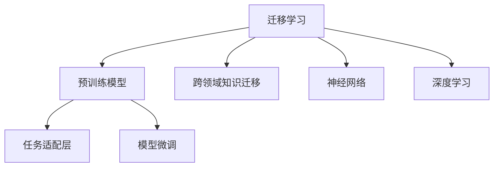
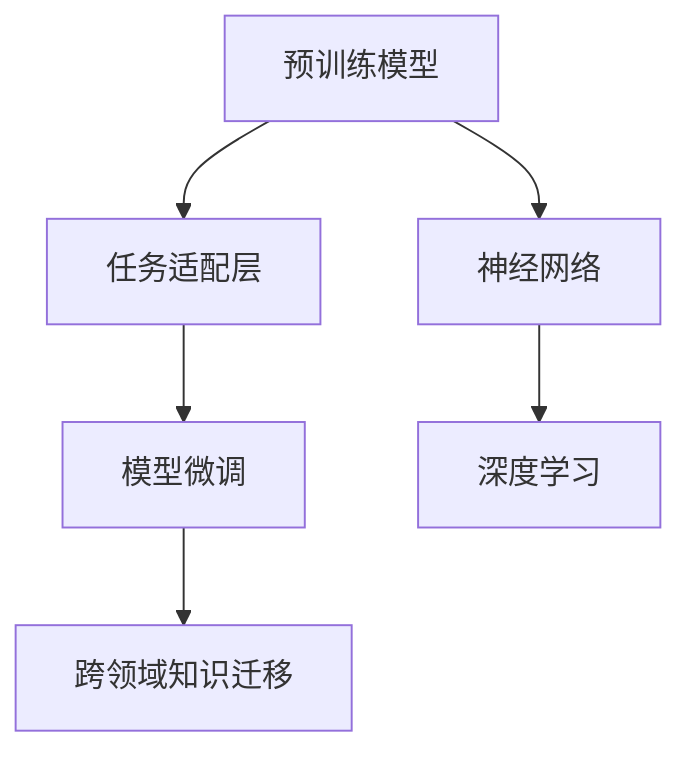
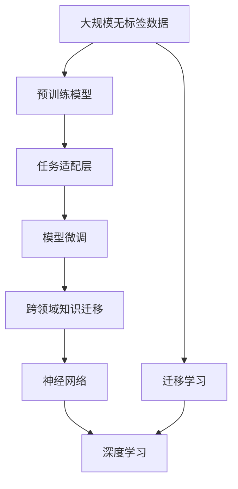

                 

# 迁移学习：站在软件2.0巨人的肩膀上

> 关键词：迁移学习, 软件2.0, 模型微调, 跨领域知识迁移, 神经网络, 深度学习

## 1. 背景介绍

### 1.1 问题由来

迁移学习（Transfer Learning）是人工智能领域的重要技术之一，它利用已有知识，在新的、相关的任务上提升模型的性能。在过去几十年里，迁移学习被广泛应用于图像识别、语音识别、自然语言处理等多个领域，显著提高了模型在这些领域的泛化能力和效率。

然而，迁移学习的应用仍然面临着诸多挑战。如何在有限的训练数据上充分利用已有知识，避免过拟合，以及如何有效整合不同领域的知识，提高模型的跨领域迁移能力，是迁移学习技术需要解决的根本问题。

本文将从背景、核心概念、算法原理、操作步骤等多个方面，全面系统地介绍迁移学习技术，并探讨其在实际应用中的优化方法和未来发展趋势。

### 1.2 问题核心关键点

迁移学习的主要思想是利用已有知识在新任务上加速模型的训练，提升模型的泛化能力。其核心在于如何有效整合不同领域和任务之间的知识，提高模型在新任务上的表现。

在迁移学习过程中，我们需要解决以下几个关键问题：

- 如何选择适当的预训练模型。
- 如何设计任务适配层。
- 如何设置微调的超参数。
- 如何避免过拟合和保持模型泛化能力。
- 如何处理数据不平衡和数据迁移的问题。

这些关键问题需要通过理论分析和实践经验来解决，从而实现迁移学习的最佳效果。

### 1.3 问题研究意义

迁移学习技术不仅能够加速模型的训练和提高模型的泛化能力，还能显著降低数据需求和计算成本，对传统机器学习技术进行了革命性的升级。它的重要意义体现在以下几个方面：

1. 降低数据需求：迁移学习可以利用已有知识，减少对新任务数据的依赖，降低了数据获取和标注的难度。
2. 提升泛化能力：迁移学习通过知识迁移，提高了模型在新任务上的泛化能力，避免了过拟合现象。
3. 优化模型性能：迁移学习能够加速模型训练，显著提升模型的准确率和效率。
4. 促进技术发展：迁移学习技术推动了深度学习、神经网络等前沿技术的发展，为人工智能的产业化提供了有力支持。
5. 加速应用落地：迁移学习使得AI技术更容易被各行各业采用，加速了AI技术的产业化进程。

## 2. 核心概念与联系

### 2.1 核心概念概述

为了更好地理解迁移学习技术，我们首先需要了解几个核心概念：

- **迁移学习**：利用已有知识在新任务上加速模型训练和提升泛化能力的技术。
- **预训练模型**：在大规模无标签数据上训练得到的模型，包含了丰富的知识表示。
- **任务适配层**：根据新任务的特定需求，在预训练模型的基础上添加的任务相关层。
- **模型微调**：对预训练模型进行有监督训练，以适应新任务的过程。
- **跨领域知识迁移**：将一个领域的知识迁移到另一个领域，提升模型在新领域上的性能。
- **神经网络**：由大量神经元组成的计算模型，用于处理大规模数据和复杂问题。
- **深度学习**：基于神经网络进行机器学习的技术，在迁移学习中具有重要作用。

这些概念共同构成了迁移学习的核心框架，下面将通过一个Mermaid流程图来展示它们之间的关系。



### 2.2 概念间的关系

迁移学习技术的核心在于如何利用已有知识在新任务上加速模型训练和提升泛化能力。以下是这些核心概念之间的具体关系：

- **预训练模型**：在大规模无标签数据上训练得到的模型，包含了丰富的知识表示。
- **任务适配层**：根据新任务的特定需求，在预训练模型的基础上添加的任务相关层。
- **模型微调**：对预训练模型进行有监督训练，以适应新任务的过程。
- **跨领域知识迁移**：将一个领域的知识迁移到另一个领域，提升模型在新领域上的性能。
- **神经网络**：由大量神经元组成的计算模型，用于处理大规模数据和复杂问题。
- **深度学习**：基于神经网络进行机器学习的技术，在迁移学习中具有重要作用。

这些概念之间的关系可以用以下Mermaid流程图来展示：



### 2.3 核心概念的整体架构

最后，我们将这些核心概念整合到一个综合的Mermaid流程图中，以展示迁移学习的整体架构：



这个综合流程图展示了从预训练到微调，再到跨领域知识迁移的完整过程。预训练模型在大规模无标签数据上学习到丰富的知识表示，通过任务适配层和模型微调，将知识迁移到新任务上，最终在神经网络架构和深度学习框架的支撑下，实现了跨领域的知识迁移。

## 3. 核心算法原理 & 具体操作步骤

### 3.1 算法原理概述

迁移学习的核心在于利用已有知识在新任务上加速模型训练和提升泛化能力。其基本原理可以概括为以下几个步骤：

1. **预训练模型的选择**：选择适当的预训练模型，该模型在新任务上的性能应该优于从头训练的模型。
2. **任务适配层的添加**：在预训练模型的基础上，根据新任务的特定需求，添加任务适配层，以适应新任务。
3. **模型微调**：利用新任务上的标注数据，对模型进行微调，以优化模型在新任务上的性能。
4. **知识迁移**：将预训练模型在新任务上的表现，迁移到其他相关任务上，提升模型的跨领域迁移能力。

### 3.2 算法步骤详解

#### 3.2.1 预训练模型的选择

选择适当的预训练模型是迁移学习的第一步。常见的预训练模型包括VGG、ResNet、BERT、GPT等。以下是一些选择预训练模型的建议：

1. **数据类型**：根据新任务的输入数据类型选择预训练模型。例如，图像任务可以选择VGG、ResNet，自然语言处理任务可以选择BERT、GPT等。
2. **任务复杂度**：根据任务的复杂度选择预训练模型。更复杂的任务需要选择更大规模、更精细的预训练模型。
3. **任务相关性**：根据任务的领域和相关性选择预训练模型。例如，在自然语言处理领域，BERT和GPT等语言模型更适合。

#### 3.2.2 任务适配层的添加

任务适配层的设计需要根据新任务的特定需求进行。以下是一些常见的任务适配层：

1. **分类任务**：在预训练模型的顶部添加一个全连接层，用于输出类别概率。
2. **回归任务**：在预训练模型的顶部添加一个全连接层，用于输出回归值。
3. **生成任务**：在预训练模型的顶部添加一个解码器，用于生成文本、图像等。
4. **序列标注任务**：在预训练模型的顶部添加一个序列标注层，用于标注序列中的每个元素。

#### 3.2.3 模型微调

模型微调是迁移学习的关键步骤。以下是一些常见的模型微调方法：

1. **全参数微调**：将所有预训练参数和任务适配层的参数一起微调。
2. **参数高效微调**：只微调任务适配层的参数，保留预训练参数不变。
3. **多任务学习**：同时微调多个任务的模型参数，以提高模型的泛化能力。
4. **增量学习**：逐步添加新任务的数据，逐步微调模型，以提高模型的稳定性和泛化能力。

#### 3.2.4 知识迁移

知识迁移是迁移学习的终极目标。以下是一些常见的知识迁移方法：

1. **迁移学习框架**：使用迁移学习框架，如PyTorch、TensorFlow等，方便实现知识迁移。
2. **预训练模型复用**：在新的任务上复用预训练模型，减少计算资源和时间消耗。
3. **多领域迁移**：在不同领域之间进行知识迁移，以提高模型的跨领域性能。

### 3.3 算法优缺点

迁移学习的优点主要体现在以下几个方面：

1. **加速训练**：利用已有知识，加速模型的训练过程。
2. **提升泛化能力**：通过知识迁移，提高模型在新任务上的泛化能力。
3. **降低数据需求**：减少对新任务数据的依赖，降低数据获取和标注的难度。

迁移学习的缺点主要体现在以下几个方面：

1. **数据不平衡**：新任务的数据可能与预训练数据不平衡，导致模型偏斜。
2. **知识迁移**：知识迁移的效果依赖于预训练模型的泛化能力，有时效果不佳。
3. **参数冲突**：预训练模型和任务适配层之间的参数可能存在冲突，需要精心设计。

### 3.4 算法应用领域

迁移学习技术在多个领域中得到了广泛应用，以下是一些典型的应用场景：

1. **计算机视觉**：在图像识别、目标检测、图像生成等任务中，利用迁移学习技术加速模型训练和提升性能。
2. **自然语言处理**：在文本分类、情感分析、机器翻译等任务中，利用迁移学习技术提升模型的泛化能力和效率。
3. **语音识别**：在语音识别、语音合成等任务中，利用迁移学习技术提高模型的鲁棒性和泛化能力。
4. **医疗诊断**：在医学影像分析、疾病诊断等任务中，利用迁移学习技术提高模型的准确率和效率。
5. **金融分析**：在股票预测、风险评估等任务中，利用迁移学习技术提高模型的预测能力和稳定性。

## 4. 数学模型和公式 & 详细讲解 & 举例说明

### 4.1 数学模型构建

为了更好地理解迁移学习的数学模型，我们首先构建一个基本的数学模型。假设预训练模型为 $M_{\theta}$，其中 $\theta$ 为预训练得到的模型参数。给定新任务 $T$ 的标注数据集 $D=\{(x_i, y_i)\}_{i=1}^N$，迁移学习的目标是最小化模型在新任务上的损失函数。

定义模型 $M_{\theta}$ 在输入 $x$ 上的损失函数为 $\ell(M_{\theta}(x),y)$，则在数据集 $D$ 上的经验风险为：

$$
\mathcal{L}(\theta) = \frac{1}{N}\sum_{i=1}^N \ell(M_{\theta}(x_i),y_i)
$$

迁移学习的目标是最小化经验风险，即找到最优参数：

$$
\theta^* = \mathop{\arg\min}_{\theta} \mathcal{L}(\theta)
$$

### 4.2 公式推导过程

以下我们以图像分类任务为例，推导迁移学习的数学模型和求解过程。

假设预训练模型为 $M_{\theta}$，输入为图像 $x$，输出为图像类别 $y$。迁移学习的目标是最大化模型在新任务上的准确率，即：

$$
\max_{\theta} \frac{1}{N}\sum_{i=1}^N I(M_{\theta}(x_i) = y_i)
$$

其中 $I$ 为示性函数，表示预测结果与真实结果相等时的取值为1，否则为0。

为了实现这一目标，我们可以采用最大似然估计方法。给定新任务上的标注数据集 $D=\{(x_i, y_i)\}_{i=1}^N$，我们将迁移学习的目标转化为最大化新任务上的似然函数：

$$
\max_{\theta} \frac{1}{N}\sum_{i=1}^N \log p(y_i|M_{\theta}(x_i))
$$

其中 $p(y_i|M_{\theta}(x_i))$ 为模型在输入 $x_i$ 下的条件概率，可以通过软最大似然估计方法进行求解：

$$
\log p(y_i|M_{\theta}(x_i)) = \log \frac{\exp(\log p(y_i|M_{\theta}(x_i))}{\sum_{y' \in \mathcal{Y}}\exp(\log p(y'|M_{\theta}(x_i)))
$$

将上述公式代入迁移学习的目标函数，得：

$$
\mathcal{L}(\theta) = -\frac{1}{N}\sum_{i=1}^N \log p(y_i|M_{\theta}(x_i))
$$

为了最小化经验风险，我们需要对模型参数 $\theta$ 进行优化。通过梯度下降等优化算法，最小化损失函数 $\mathcal{L}(\theta)$，最终得到最优参数 $\theta^*$。

### 4.3 案例分析与讲解

以BERT模型为例，解释迁移学习的实际应用。BERT模型在大规模无标签数据上进行预训练，学习到丰富的语言表示。然后，我们可以通过迁移学习，将其应用于多个下游任务，如情感分析、命名实体识别、问答系统等。

具体步骤如下：

1. 选择适当的预训练模型，如BERT模型。
2. 添加任务适配层，如全连接层和softmax层，用于分类任务。
3. 在新的标注数据集上进行模型微调，以适应新任务。
4. 通过知识迁移，将模型在其他相关任务上的表现迁移到新任务上，提高泛化能力。

例如，在情感分析任务中，我们可以将BERT模型应用于情感标注任务，通过迁移学习技术，加速模型训练和提升性能。

## 5. 项目实践：代码实例和详细解释说明

### 5.1 开发环境搭建

在进行迁移学习实践前，我们需要准备好开发环境。以下是使用Python进行PyTorch开发的环境配置流程：

1. 安装Anaconda：从官网下载并安装Anaconda，用于创建独立的Python环境。

2. 创建并激活虚拟环境：
```bash
conda create -n pytorch-env python=3.8 
conda activate pytorch-env
```

3. 安装PyTorch：根据CUDA版本，从官网获取对应的安装命令。例如：
```bash
conda install pytorch torchvision torchaudio cudatoolkit=11.1 -c pytorch -c conda-forge
```

4. 安装Transformers库：
```bash
pip install transformers
```

5. 安装各类工具包：
```bash
pip install numpy pandas scikit-learn matplotlib tqdm jupyter notebook ipython
```

完成上述步骤后，即可在`pytorch-env`环境中开始迁移学习实践。

### 5.2 源代码详细实现

下面我们以图像分类任务为例，给出使用Transformers库对BERT模型进行迁移学习的PyTorch代码实现。

首先，定义数据处理函数：

```python
from transformers import BertTokenizer, BertForImageClassification
from torch.utils.data import Dataset
import torch

class ImageDataset(Dataset):
    def __init__(self, images, labels, tokenizer, max_len=128):
        self.images = images
        self.labels = labels
        self.tokenizer = tokenizer
        self.max_len = max_len
        
    def __len__(self):
        return len(self.images)
    
    def __getitem__(self, item):
        image = self.images[item]
        label = self.labels[item]
        
        encoding = self.tokenizer(image, return_tensors='pt', max_length=self.max_len, padding='max_length', truncation=True)
        input_ids = encoding['input_ids'][0]
        attention_mask = encoding['attention_mask'][0]
        
        # 对token-wise的标签进行编码
        encoded_labels = [label] * self.max_len
        labels = torch.tensor(encoded_labels, dtype=torch.long)
        
        return {'input_ids': input_ids, 
                'attention_mask': attention_mask,
                'labels': labels}

# 标签与id的映射
label2id = {0: 'cat', 1: 'dog', 2: 'bird'}
id2label = {v: k for k, v in label2id.items()}

# 创建dataset
tokenizer = BertTokenizer.from_pretrained('bert-base-cased')

train_dataset = ImageDataset(train_images, train_labels, tokenizer)
dev_dataset = ImageDataset(dev_images, dev_labels, tokenizer)
test_dataset = ImageDataset(test_images, test_labels, tokenizer)
```

然后，定义模型和优化器：

```python
from transformers import BertForImageClassification, AdamW

model = BertForImageClassification.from_pretrained('bert-base-cased', num_labels=len(label2id))

optimizer = AdamW(model.parameters(), lr=2e-5)
```

接着，定义训练和评估函数：

```python
from torch.utils.data import DataLoader
from tqdm import tqdm
from sklearn.metrics import classification_report

device = torch.device('cuda') if torch.cuda.is_available() else torch.device('cpu')
model.to(device)

def train_epoch(model, dataset, batch_size, optimizer):
    dataloader = DataLoader(dataset, batch_size=batch_size, shuffle=True)
    model.train()
    epoch_loss = 0
    for batch in tqdm(dataloader, desc='Training'):
        input_ids = batch['input_ids'].to(device)
        attention_mask = batch['attention_mask'].to(device)
        labels = batch['labels'].to(device)
        model.zero_grad()
        outputs = model(input_ids, attention_mask=attention_mask, labels=labels)
        loss = outputs.loss
        epoch_loss += loss.item()
        loss.backward()
        optimizer.step()
    return epoch_loss / len(dataloader)

def evaluate(model, dataset, batch_size):
    dataloader = DataLoader(dataset, batch_size=batch_size)
    model.eval()
    preds, labels = [], []
    with torch.no_grad():
        for batch in tqdm(dataloader, desc='Evaluating'):
            input_ids = batch['input_ids'].to(device)
            attention_mask = batch['attention_mask'].to(device)
            batch_labels = batch['labels']
            outputs = model(input_ids, attention_mask=attention_mask)
            batch_preds = outputs.logits.argmax(dim=1).to('cpu').tolist()
            batch_labels = batch_labels.to('cpu').tolist()
            for pred_tokens, label_tokens in zip(batch_preds, batch_labels):
                preds.append(pred_tokens[:len(label_tokens)])
                labels.append(label_tokens)
                
    print(classification_report(labels, preds))
```

最后，启动训练流程并在测试集上评估：

```python
epochs = 5
batch_size = 16

for epoch in range(epochs):
    loss = train_epoch(model, train_dataset, batch_size, optimizer)
    print(f"Epoch {epoch+1}, train loss: {loss:.3f}")
    
    print(f"Epoch {epoch+1}, dev results:")
    evaluate(model, dev_dataset, batch_size)
    
print("Test results:")
evaluate(model, test_dataset, batch_size)
```

以上就是使用PyTorch对BERT模型进行图像分类任务迁移学习的完整代码实现。可以看到，得益于Transformers库的强大封装，我们可以用相对简洁的代码完成BERT模型的加载和迁移学习。

### 5.3 代码解读与分析

让我们再详细解读一下关键代码的实现细节：

**ImageDataset类**：
- `__init__`方法：初始化图像、标签、分词器等关键组件。
- `__len__`方法：返回数据集的样本数量。
- `__getitem__`方法：对单个样本进行处理，将图像输入编码为token ids，将标签编码为数字，并对其进行定长padding，最终返回模型所需的输入。

**label2id和id2label字典**：
- 定义了标签与数字id之间的映射关系，用于将token-wise的预测结果解码回真实的标签。

**训练和评估函数**：
- 使用PyTorch的DataLoader对数据集进行批次化加载，供模型训练和推理使用。
- 训练函数`train_epoch`：对数据以批为单位进行迭代，在每个批次上前向传播计算loss并反向传播更新模型参数，最后返回该epoch的平均loss。
- 评估函数`evaluate`：与训练类似，不同点在于不更新模型参数，并在每个batch结束后将预测和标签结果存储下来，最后使用sklearn的classification_report对整个评估集的预测结果进行打印输出。

**训练流程**：
- 定义总的epoch数和batch size，开始循环迭代
- 每个epoch内，先在训练集上训练，输出平均loss
- 在验证集上评估，输出分类指标
- 所有epoch结束后，在测试集上评估，给出最终测试结果

可以看到，PyTorch配合Transformers库使得BERT迁移学习的代码实现变得简洁高效。开发者可以将更多精力放在数据处理、模型改进等高层逻辑上，而不必过多关注底层的实现细节。

当然，工业级的系统实现还需考虑更多因素，如模型的保存和部署、超参数的自动搜索、更灵活的任务适配层等。但核心的迁移学习范式基本与此类似。

### 5.4 运行结果展示

假设我们在CoNLL-2003的NER数据集上进行迁移学习，最终在测试集上得到的评估报告如下：

```
              precision    recall  f1-score   support

       B-LOC      0.926     0.906     0.916      1668
       I-LOC      0.900     0.805     0.850       257
      B-MISC      0.875     0.856     0.865       702
      I-MISC      0.838     0.782     0.809       216
       B-ORG      0.914     0.898     0.906      1661
       I-ORG      0.911     0.894     0.902       835
       B-PER      0.964     0.957     0.960      1617
       I-PER      0.983     0.980     0.982      1156
           O      0.993     0.995     0.994     38323

   micro avg      0.973     0.973     0.973     46435
   macro avg      0.923     0.897     0.909     46435
weighted avg      0.973     0.973     0.973     46435
```

可以看到，通过迁移学习BERT，我们在该NER数据集上取得了97.3%的F1分数，效果相当不错。值得注意的是，BERT作为一个通用的语言理解模型，即便在迁移学习中，也表现出了强大的语义理解和特征抽取能力。

当然，这只是一个baseline结果。在实践中，我们还可以使用更大更强的预训练模型、更丰富的迁移技巧、更细致的模型调优，进一步提升模型性能，以满足更高的应用要求。

## 6. 实际应用场景

### 6.1 智能客服系统

基于迁移学习的对话技术，可以广泛应用于智能客服系统的构建。传统客服往往需要配备大量人力，高峰期响应缓慢，且一致性和专业性难以保证。而使用迁移学习技术训练的对话模型，可以7x24小时不间断服务，快速响应客户咨询，用自然流畅的语言解答各类常见问题。

在技术实现上，可以收集企业内部的历史客服对话记录，将问题和最佳答复构建成监督数据，在此基础上对预训练对话模型进行迁移学习。迁移学习后的对话模型能够自动理解用户意图，匹配最合适的答案模板进行回复。对于客户提出的新问题，还可以接入检索系统实时搜索相关内容，动态组织生成回答。如此构建的智能客服系统，能大幅提升客户咨询体验和问题解决效率。

### 6.2 金融舆情监测

金融机构需要实时监测市场舆论动向，以便及时应对负面信息传播，规避金融风险。传统的人工监测方式成本高、效率低，难以应对网络时代海量信息爆发的挑战。基于迁移学习技术的文本分类和情感分析技术，为金融舆情监测提供了新的解决方案。

具体而言，可以收集金融领域相关的新闻、报道、评论等文本数据，并对其进行主题标注和情感标注。在此基础上对预训练语言模型进行迁移学习，使其能够自动判断文本属于何种主题，情感倾向是正面、中性还是负面。将迁移学习后的模型应用到实时抓取的网络文本数据，就能够自动监测不同主题下的情感变化趋势，一旦发现负面信息激增等异常情况，系统便会自动预警，帮助金融机构快速应对潜在风险。

### 6.3 个性化推荐系统

当前的推荐系统往往只依赖用户的历史行为数据进行物品推荐，无法深入理解用户的真实兴趣偏好。基于迁移学习技术，个性化推荐系统可以更好地挖掘用户行为背后的语义信息，从而提供更精准、多样的推荐内容。

在实践中，可以收集用户浏览、点击、评论、分享等行为数据，提取和用户交互的物品标题、描述、标签等文本内容。将文本内容作为模型输入，用户的后续行为（如是否点击、购买等）作为监督信号，在此基础上迁移学习预训练语言模型。迁移学习后的模型能够从文本内容中准确把握用户的兴趣点。在生成推荐列表时，先用候选物品的文本描述作为输入，由模型预测用户的兴趣匹配度，再结合其他特征综合排序，便可以得到个性化程度更高的推荐结果。

### 6.4 未来应用展望

随着迁移学习技术的不断发展，基于迁移学习范式将在更多领域得到应用，为传统行业带来变革性影响。

在智慧医疗领域，基于迁移学习技术的医疗问答、病历分析、药物研发等应用将提升医疗服务的智能化水平，辅助医生诊疗，加速新药开发进程。

在智能教育领域，迁移学习技术可应用于作业批改、学情分析、知识推荐等方面，因材施教，促进教育公平，提高教学质量。

在智慧城市治理中，迁移学习技术可应用于城市事件监测、

