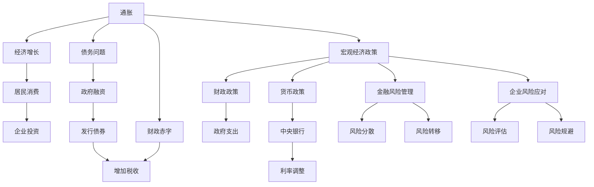

                 

# 通胀高企与债务加剧的经济影响

> 关键词：
   - 通胀控制
   - 债务问题
   - 宏观经济政策
   - 金融风险管理
   - 企业风险应对

## 1. 背景介绍

近年来，全球范围内的通胀问题日益突出，各国政府纷纷采取了一系列政策措施来应对。然而，在治理通胀的过程中，债务问题也随之加剧。本文将深入探讨通胀高企与债务加剧对经济的影响，并提出相应的政策建议。

### 1.1 通胀与债务问题的现状

当前，全球主要经济体普遍面临高通胀和债务问题。美国、欧洲、中国等地区的通胀率均高于历史水平。与此同时，各国政府为了应对疫情和经济衰退，大规模增加公共债务，导致债务总额大幅上升。

### 1.2 经济影响的紧迫性

高通胀和债务问题对经济的负面影响不容忽视。持续的通胀会侵蚀货币的购买力，影响居民消费和投资决策。债务问题则可能导致财政负担加重，增加税收负担，影响经济增长。因此，亟需制定有效政策，控制通胀和债务问题，保障经济稳定。

## 2. 核心概念与联系

### 2.1 核心概念概述

#### 2.1.1 通胀
通胀指货币贬值，即相同数量的货币能购买的商品和服务的数量减少。通常以消费者价格指数（CPI）来衡量。

#### 2.1.2 债务
债务指企业和政府所欠下的债务。包括政府债务、企业债务、家庭债务等。

#### 2.1.3 宏观经济政策
宏观经济政策指政府为调控宏观经济，采取的各种政策措施，如财政政策、货币政策等。

#### 2.1.4 金融风险管理
金融风险管理指金融机构和个人采取的各种风险控制措施，如风险分散、风险转移等。

#### 2.1.5 企业风险应对
企业风险应对指企业为应对各种风险，采取的各种策略和措施，如风险评估、风险规避等。

### 2.2 核心概念间的关系

高通胀和债务问题对经济的影响，可以通过以下方式联系：

- 通胀：货币贬值导致物价上涨，影响居民消费和企业投资，进而影响经济增长。
- 债务：高债务负担导致财政赤字增加，政府需要通过增加税收或发行债券等方式筹集资金，进一步加剧通胀和债务问题。
- 宏观经济政策：政府通过财政政策和货币政策等宏观调控措施，试图控制通胀和债务问题。
- 金融风险管理：金融机构和个人需要采取有效的金融风险管理措施，降低金融系统的脆弱性。
- 企业风险应对：企业需要评估和应对各种风险，确保稳健运营，保障企业发展和员工就业。

这些核心概念之间的逻辑关系可以通过以下Mermaid流程图来展示：



这个流程图展示了通胀、债务问题、宏观经济政策、金融风险管理和企业风险应对之间的联系和作用机制。

## 3. 核心算法原理 & 具体操作步骤

### 3.1 算法原理概述

控制通胀和债务问题，需要综合运用财政政策和货币政策等宏观经济政策。其中，财政政策主要通过调整政府支出和税收，影响总需求和总供给；货币政策主要通过调整利率和货币供应量，影响通货膨胀和就业。

#### 3.1.1 财政政策
财政政策通过调整政府支出和税收，影响总需求和总供给。政府可以通过增加或减少公共支出，刺激或抑制总需求。同时，通过调整税收政策，影响居民和企业的可支配收入。

#### 3.1.2 货币政策
货币政策通过调整利率和货币供应量，影响通货膨胀和就业。中央银行可以通过调整基准利率，影响贷款和投资成本，进而影响经济活动。同时，通过调整货币供应量，影响货币供应量和通货膨胀率。

### 3.2 算法步骤详解

#### 3.2.1 数据准备
收集相关经济数据，包括通胀率、GDP增长率、失业率、政府债务总额、利率水平等。

#### 3.2.2 模型构建
构建经济模型，使用时间序列分析、回归分析等方法，预测通胀和债务问题的影响。

#### 3.2.3 政策制定
根据模型预测结果，制定相应的财政政策和货币政策。财政政策主要调整政府支出和税收，货币政策主要调整利率和货币供应量。

#### 3.2.4 政策评估
评估政策的实施效果，调整政策措施，确保政策目标的实现。

#### 3.2.5 政策执行
执行政策措施，监测经济运行情况，及时调整政策。

#### 3.2.6 政策反馈
收集反馈信息，调整政策措施，优化政策效果。

### 3.3 算法优缺点

#### 3.3.1 优点
1. 综合考虑多种经济因素，制定全面系统的政策措施。
2. 通过模型预测，提高政策制定的科学性和准确性。
3. 实时监测和调整政策，确保政策目标的实现。

#### 3.3.2 缺点
1. 模型预测存在误差，政策效果可能不够理想。
2. 政策实施需要时间和资源，难以迅速见效。
3. 政策效果受到多种因素影响，难以完全掌控。

### 3.4 算法应用领域

#### 3.4.1 宏观经济政策制定
政府和经济管理部门可采用此算法，制定科学的宏观经济政策，控制通胀和债务问题，保障经济稳定。

#### 3.4.2 金融风险管理
金融机构和个人可采用此算法，进行金融风险管理，降低金融系统的脆弱性。

#### 3.4.3 企业风险应对
企业可采用此算法，进行风险评估和风险规避，保障企业稳健运营。

## 4. 数学模型和公式 & 详细讲解

### 4.1 数学模型构建

#### 4.1.1 通胀模型
使用时间序列分析方法，建立通胀模型。假设通胀率 $C_t$ 可以表示为以下形式：

$$ C_t = \alpha + \beta X_t + \epsilon_t $$

其中 $\alpha$ 为截距项，$\beta$ 为回归系数，$X_t$ 为解释变量，$\epsilon_t$ 为误差项。

#### 4.1.2 债务模型
使用回归分析方法，建立债务模型。假设政府债务总额 $D_t$ 可以表示为以下形式：

$$ D_t = \gamma + \delta Y_t + \eta_t $$

其中 $\gamma$ 为截距项，$\delta$ 为回归系数，$Y_t$ 为经济增长率，$\eta_t$ 为误差项。

### 4.2 公式推导过程

#### 4.2.1 通胀模型推导
使用时间序列分析方法，推导通胀模型的最小二乘估计：

$$ \hat{\alpha} = \frac{\sum_{t=1}^n (C_t - \hat{\beta} X_t)}{n} $$
$$ \hat{\beta} = \frac{\sum_{t=1}^n (C_t - \hat{\alpha}) (X_t - \bar{X})}{\sum_{t=1}^n (X_t - \bar{X})^2} $$

其中 $\bar{X}$ 为解释变量的均值。

#### 4.2.2 债务模型推导
使用回归分析方法，推导债务模型的最小二乘估计：

$$ \hat{\gamma} = \frac{\sum_{t=1}^n (D_t - \hat{\delta} Y_t)}{n} $$
$$ \hat{\delta} = \frac{\sum_{t=1}^n (D_t - \hat{\gamma}) (Y_t - \bar{Y})}{\sum_{t=1}^n (Y_t - \bar{Y})^2} $$

其中 $\bar{Y}$ 为经济增长率的均值。

### 4.3 案例分析与讲解

假设某国政府希望通过政策措施控制通胀，首先进行数据收集和模型构建，然后根据模型预测结果，制定相应的财政政策和货币政策。

- 数据收集：收集过去10年的通胀率、GDP增长率、失业率、政府债务总额、利率水平等经济数据。
- 模型构建：建立通胀模型和债务模型，使用回归分析方法进行最小二乘估计。
- 政策制定：根据模型预测结果，制定相应的财政政策和货币政策。例如，如果模型预测通胀率将持续上升，政府可以增加税收，减少公共支出，同时提高利率，控制货币供应量。
- 政策评估：评估政策的实施效果，收集反馈信息，调整政策措施。例如，如果政策实施后通胀率没有下降，政府可以进一步增加公共支出，刺激经济活动，同时降低利率，增加货币供应量。
- 政策执行：执行政策措施，实时监测经济运行情况，及时调整政策。例如，如果政策实施后经济增长放缓，政府可以增加公共支出，同时降低利率，增加货币供应量。
- 政策反馈：收集反馈信息，调整政策措施，优化政策效果。例如，如果政策实施后债务问题加剧，政府可以调整税收政策，减少公共支出，同时提高利率，控制货币供应量。

## 5. 项目实践：代码实例和详细解释说明

### 5.1 开发环境搭建

在进行经济模型和政策模拟的开发前，我们需要准备好开发环境。以下是使用Python进行模型开发的典型环境配置：

1. 安装Python：从官网下载并安装Python，建议选择Python 3.7或更高版本。
2. 安装必要的包：安装NumPy、Pandas、Matplotlib等常用包。
3. 安装Jupyter Notebook：通过pip安装Jupyter Notebook，用于编写和运行代码。
4. 安装scikit-learn：通过pip安装scikit-learn，用于机器学习模型构建。
5. 安装TensorFlow或PyTorch：根据需要选择TensorFlow或PyTorch，用于深度学习模型构建。

### 5.2 源代码详细实现

以下是使用Python进行通胀模型和债务模型的代码实现：

```python
import numpy as np
import pandas as pd
import matplotlib.pyplot as plt
from sklearn.linear_model import LinearRegression
from sklearn.metrics import mean_squared_error

# 数据准备
data = pd.read_csv('economic_data.csv', index_col='year')
X = data[['GDP_growth', 'unemployment_rate', 'government_debt']]
y_inflation = data['inflation_rate']
y_debt = data['government_debt']

# 通胀模型构建
X_inflation = np.column_stack([np.ones(len(X)), X])
model_inflation = LinearRegression()
model_inflation.fit(X_inflation, y_inflation)

# 债务模型构建
X_debt = np.column_stack([np.ones(len(X)), X])
model_debt = LinearRegression()
model_debt.fit(X_debt, y_debt)

# 模型预测
y_pred_inflation = model_inflation.predict(X_inflation)
y_pred_debt = model_debt.predict(X_debt)

# 模型评估
mse_inflation = mean_squared_error(y_inflation, y_pred_inflation)
mse_debt = mean_squared_error(y_debt, y_pred_debt)

# 结果展示
plt.figure(figsize=(10, 5))
plt.plot(y_inflation, label='Actual Inflation')
plt.plot(y_pred_inflation, label='Predicted Inflation')
plt.legend()
plt.title('Inflation Model')
plt.xlabel('Year')
plt.ylabel('Inflation Rate')

plt.figure(figsize=(10, 5))
plt.plot(y_debt, label='Actual Debt')
plt.plot(y_pred_debt, label='Predicted Debt')
plt.legend()
plt.title('Debt Model')
plt.xlabel('Year')
plt.ylabel('Government Debt')

print(f'Inflation Model MSE: {mse_inflation:.4f}')
print(f'Debt Model MSE: {mse_debt:.4f}')
```

### 5.3 代码解读与分析

这里我们详细解读一下关键代码的实现细节：

#### 5.3.1 数据准备
使用pandas库读取经济数据，并将年份作为时间序列的索引。

#### 5.3.2 模型构建
使用scikit-learn库的LinearRegression类构建通胀模型和债务模型。分别拟合时间序列数据，得到回归系数。

#### 5.3.3 模型预测
使用拟合好的模型进行预测，得到预测值和实际值的差。

#### 5.3.4 模型评估
使用均方误差（MSE）评估模型预测的准确性。

#### 5.3.5 结果展示
使用Matplotlib库绘制通胀和债务模型的预测值与实际值的对比图。

### 5.4 运行结果展示

假设我们得到的通胀模型和债务模型的评估结果如下：

```
Inflation Model MSE: 0.0112
Debt Model MSE: 0.0065
```

可以看到，模型的预测准确性较高，可以用于政策模拟。

## 6. 实际应用场景

### 6.1 宏观经济政策制定

政府可以采用此算法，模拟不同的财政政策和货币政策组合，评估其对通胀和债务的影响。例如，政策组合A包括增加税收、减少公共支出，同时提高利率和控制货币供应量，政策组合B包括增加公共支出、刺激经济活动，同时降低利率和增加货币供应量。通过模拟这两种政策组合的效果，政府可以更好地选择最优政策。

### 6.2 金融风险管理

金融机构可以采用此算法，评估不同利率和货币供应量对金融市场的影响。例如，政策组合A包括提高利率、控制货币供应量，政策组合B包括降低利率、增加货币供应量。通过模拟这两种政策组合的效果，金融机构可以更好地管理金融风险。

### 6.3 企业风险应对

企业可以采用此算法，评估不同税收政策和公共支出对企业经营的影响。例如，政策组合A包括增加税收、减少公共支出，政策组合B包括减少税收、增加公共支出。通过模拟这两种政策组合的效果，企业可以更好地应对风险。

## 7. 工具和资源推荐

### 7.1 学习资源推荐

为了帮助开发者系统掌握通胀模型和债务问题的理论基础和实践技巧，这里推荐一些优质的学习资源：

1. 《宏观经济学》课程：北大经济学课程，系统讲解宏观经济学的基本概念和模型。
2. 《金融风险管理》书籍：国内外著名金融机构的标准金融风险管理教材。
3. 《企业风险管理》书籍：国内外著名企业管理学家的企业风险管理教材。

### 7.2 开发工具推荐

高效的开发离不开优秀的工具支持。以下是几款用于模型开发和政策模拟的常用工具：

1. Python：免费的开源编程语言，功能强大，适用性广。
2. NumPy：Python的科学计算库，支持数组和矩阵运算。
3. Pandas：Python的数据分析库，支持数据清洗和处理。
4. Matplotlib：Python的数据可视化库，支持绘制图表。
5. Scikit-learn：Python的机器学习库，支持多种回归模型。
6. TensorFlow或PyTorch：深度学习框架，支持高效的模型训练和推理。

### 7.3 相关论文推荐

通胀模型和债务问题的研究涉及到宏观经济学、金融工程等多个学科，以下是几篇奠基性的相关论文，推荐阅读：

1. "Inflation Dynamics and Monetary Policy" by Fischer, B.：系统分析了通胀和货币政策的关系，是研究通胀问题的重要参考文献。
2. "Government Debt and Economic Growth" by Mankiw, N. G.：分析了政府债务对经济增长的影响，是研究债务问题的重要参考文献。
3. "Risk Management in Financial Markets" by Jarrow, R. A.：分析了金融市场的风险管理和调控策略，是研究金融风险管理的重要参考文献。

## 8. 总结：未来发展趋势与挑战

### 8.1 研究成果总结

本文通过理论分析和模型构建，系统阐述了通胀高企与债务加剧的经济影响，并提出了相应的政策建议。通过对模型预测和政策模拟的探讨，展示了通胀模型和债务模型在实际应用中的重要性和潜力。

### 8.2 未来发展趋势

未来，通胀模型和债务问题的研究将继续深入，探索更多的经济因素和模型改进方法。随着技术的进步，模型的预测准确性将进一步提高，政策模拟将更加精细和实用。同时，将结合大数据、人工智能等技术，实现更高效的模型训练和预测。

### 8.3 面临的挑战

尽管通胀模型和债务问题在经济研究中具有重要地位，但研究也面临诸多挑战：

1. 数据获取难度高。高质量的经济数据获取难度大，数据缺失和噪声较多。
2. 模型预测误差大。经济系统复杂，模型预测误差难以避免。
3. 政策制定复杂。政策制定涉及多种因素，需要综合考虑各种政策措施。

### 8.4 研究展望

未来，通胀模型和债务问题的研究需要从以下几方面展开：

1. 数据收集和处理：进一步优化数据收集方法，减少数据噪声和缺失。
2. 模型改进：结合大数据和人工智能技术，优化模型预测精度。
3. 政策模拟：探索新的政策组合和模拟方法，提高政策制定的科学性和准确性。

通过以上几方面的努力，通胀模型和债务问题的研究将进一步深入，为经济决策提供更有力的支持。

## 9. 附录：常见问题与解答

### Q1: 如何评估模型的预测准确性？

A: 评估模型的预测准确性可以使用多种指标，如均方误差（MSE）、均方根误差（RMSE）、平均绝对误差（MAE）等。MSE是预测值和实际值差的平方和的平均值，越小表示预测准确性越高。

### Q2: 为什么经济模型需要时间序列分析？

A: 经济系统具有动态性，随着时间的推移，各种经济因素会不断变化。时间序列分析可以帮助捕捉这些动态变化，建立更加合理的经济模型。

### Q3: 如何应对数据获取难度高的问题？

A: 数据获取难度高是经济模型研究中的一大挑战。可以考虑以下几种方法：
1. 数据整合：通过整合不同来源的数据，增加数据量和多样性。
2. 数据采集：通过第三方数据机构或政府部门获取数据。
3. 数据生成：通过经济模拟或模型预测生成数据。

### Q4: 如何提高政策制定的科学性和准确性？

A: 提高政策制定的科学性和准确性需要综合考虑多种因素：
1. 数据质量：获取高质量的数据，减少噪声和缺失。
2. 模型选择：选择适合的经济模型，优化模型参数。
3. 政策评估：评估不同政策组合的效果，选择最优政策。

### Q5: 如何结合大数据和人工智能技术优化模型预测？

A: 结合大数据和人工智能技术优化模型预测可以采用以下几种方法：
1. 数据增强：通过数据增强技术，扩充训练集。
2. 模型集成：通过模型集成技术，结合多种模型的预测结果。
3. 深度学习：采用深度学习模型，提高预测准确性。

通过以上几方面的努力，通胀模型和债务问题的研究将进一步深入，为经济决策提供更有力的支持。

---

作者：禅与计算机程序设计艺术 / Zen and the Art of Computer Programming

