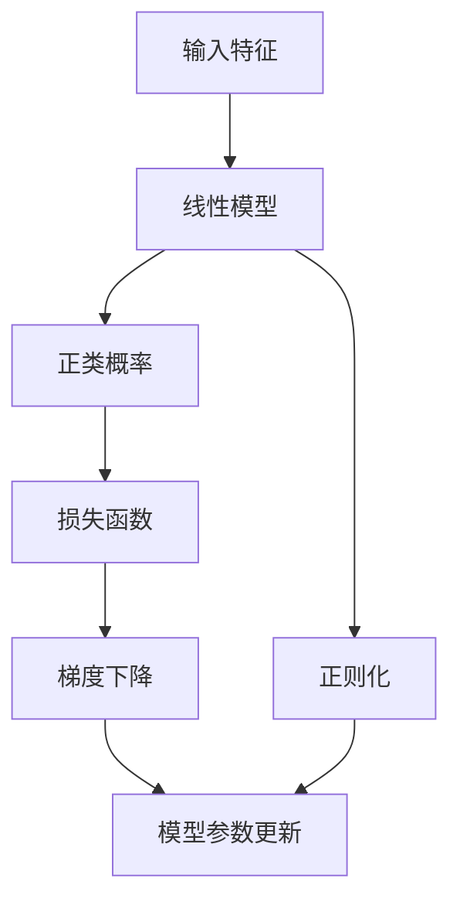

                 

# 逻辑回归 (Logistic Regression)

> 关键词：逻辑回归, 梯度下降, 正则化, 交叉验证, 二分类

## 1. 背景介绍

### 1.1 问题由来
逻辑回归（Logistic Regression）是一种广泛应用于二分类问题的统计学习方法。在数据科学和机器学习领域，它是最基本且最有用的工具之一。逻辑回归的起源可以追溯到20世纪初，由德国数学家David Gauss在1821年提出，随后由美国统计学家Warren Siegelmann在1932年推广。1970年代，逻辑回归开始被广泛应用于各种分类问题中。

### 1.2 问题核心关键点
逻辑回归的核心思想是利用线性模型对样本进行分类。在逻辑回归中，输出被假设为某个正类（如“是”）的概率，而输入特征则是训练数据集中的变量。通过最小化损失函数，逻辑回归模型可以学习出一个最优的参数集，使得在新的数据集上具有较好的分类效果。

## 2. 核心概念与联系

### 2.1 核心概念概述

为了更好地理解逻辑回归的核心概念，本节将介绍几个关键概念：

- **逻辑回归（Logistic Regression）**：一种二分类算法，通过线性模型来预测样本属于某个正类的概率。
- **损失函数（Loss Function）**：衡量模型预测输出与真实标签之间差异的函数。
- **梯度下降（Gradient Descent）**：一种常用的优化算法，通过不断迭代更新模型参数来最小化损失函数。
- **正则化（Regularization）**：防止过拟合的技术，通过引入惩罚项来约束模型参数的规模。
- **交叉验证（Cross Validation）**：一种评估模型性能的技术，通过将数据集分为训练集和验证集来评估模型的泛化能力。

这些概念之间的逻辑关系可以通过以下Mermaid流程图来展示：



这个流程图展示了从输入特征到模型参数更新的完整过程：

1. 输入特征进入线性模型。
2. 线性模型输出正类的概率。
3. 计算损失函数，衡量预测结果与真实标签之间的差异。
4. 通过梯度下降优化模型参数，最小化损失函数。
5. 正则化约束模型参数的规模，防止过拟合。
6. 最终更新模型参数，获得最优模型。

### 2.2 概念间的关系

这些核心概念之间存在着紧密的联系，形成了逻辑回归的完整工作流程。下面是一些进一步的解释：

- 逻辑回归和正则化：逻辑回归模型使用线性模型，而正则化通过约束模型参数，防止模型复杂度过高，导致过拟合。
- 梯度下降和损失函数：梯度下降通过不断迭代更新模型参数，来最小化损失函数，损失函数是衡量模型预测输出与真实标签之间差异的关键指标。
- 交叉验证：交叉验证通过将数据集分为训练集和验证集，评估模型的泛化能力，避免模型在训练集上过拟合。

## 3. 核心算法原理 & 具体操作步骤

### 3.1 算法原理概述

逻辑回归的核心原理是利用线性模型来预测样本属于某个正类的概率。具体来说，逻辑回归模型假设样本属于正类的概率 $P(y=1|x;\theta)$ 可以通过线性函数来表示：

$$
P(y=1|x;\theta) = \sigma(\theta^T x)
$$

其中，$\theta$ 是模型参数，$x$ 是输入特征向量，$\sigma$ 是逻辑函数（Sigmoid函数），将线性函数的输出映射到 $[0,1]$ 区间，表示样本属于正类的概率。

在训练阶段，逻辑回归的目标是最小化损失函数，该函数衡量模型预测输出与真实标签之间的差异。常用的损失函数是交叉熵损失函数（Cross-Entropy Loss）：

$$
L(y,\hat{y}) = -(y\log\hat{y} + (1-y)\log(1-\hat{y}))
$$

其中，$y$ 是样本的真实标签，$\hat{y}$ 是模型预测的正类概率。

在测试阶段，使用训练好的模型对新样本进行分类，将输入特征 $x$ 带入模型，得到样本属于正类的概率 $P(y=1|x;\theta)$，根据概率大小进行分类。

### 3.2 算法步骤详解

逻辑回归的训练步骤主要包括以下几个关键步骤：

**Step 1: 准备数据集**
- 收集数据集 $D=\{(x_i,y_i)\}_{i=1}^N$，其中 $x_i$ 是输入特征向量，$y_i$ 是样本标签。
- 将数据集划分为训练集和验证集，一般建议训练集占总数据的70-80%，验证集占总数据的20-30%。

**Step 2: 初始化模型参数**
- 随机初始化模型参数 $\theta$，一般使用均匀分布或正态分布。

**Step 3: 定义损失函数**
- 定义交叉熵损失函数 $L(\theta)$，衡量模型预测输出与真实标签之间的差异。

**Step 4: 梯度下降优化**
- 使用梯度下降算法（如批量梯度下降、随机梯度下降等），迭代更新模型参数，最小化损失函数。

**Step 5: 正则化约束**
- 在损失函数中引入正则化项，如L2正则化，防止模型参数过大，导致过拟合。

**Step 6: 模型评估**
- 在验证集上评估模型性能，根据精度、召回率等指标选择最优模型参数。
- 重复以上步骤，直到模型在验证集上达到满意的性能。

### 3.3 算法优缺点

逻辑回归算法具有以下优点：

- 简单易懂：逻辑回归模型的原理和实现非常简单，易于理解和实现。
- 解释性强：逻辑回归模型的参数具有可解释性，每个特征的系数可以解释为特征的重要性。
- 速度快：逻辑回归模型在训练和预测时，计算量相对较小，速度较快。

同时，逻辑回归算法也存在以下缺点：

- 适用于二分类问题：逻辑回归只适用于二分类问题，不适用于多分类问题。
- 对异常值敏感：逻辑回归模型对异常值非常敏感，可能影响模型性能。
- 需要手动调参：逻辑回归的参数需要通过手动调参，找到最优的参数组合。

### 3.4 算法应用领域

逻辑回归算法广泛应用于各种领域，例如：

- 金融风险评估：用于评估贷款申请、信用评分等金融风险。
- 医学诊断：用于诊断癌症、心脏病等疾病。
- 广告点击率预测：用于预测广告点击率，优化广告投放策略。
- 信用评分：用于预测信用卡使用情况，评估信用风险。
- 情感分析：用于分析文本情感，判断评论态度。

## 4. 数学模型和公式 & 详细讲解 & 举例说明

### 4.1 数学模型构建

逻辑回归的数学模型构建如下：

假设训练数据集为 $D=\{(x_i,y_i)\}_{i=1}^N$，其中 $x_i \in \mathbb{R}^n$ 是输入特征向量，$y_i \in \{0,1\}$ 是样本标签。逻辑回归模型的目标是最小化交叉熵损失函数：

$$
L(\theta) = -\frac{1}{N}\sum_{i=1}^N L(y_i,\hat{y}_i)
$$

其中，$L(y_i,\hat{y}_i) = -y_i\log\hat{y}_i - (1-y_i)\log(1-\hat{y}_i)$ 是交叉熵损失函数，$\hat{y}_i$ 是模型预测的正类概率。

### 4.2 公式推导过程

逻辑回归的参数 $\theta$ 可以通过梯度下降算法进行优化，优化目标是最小化损失函数 $L(\theta)$。梯度下降算法的迭代更新公式为：

$$
\theta \leftarrow \theta - \eta \nabla_{\theta}L(\theta)
$$

其中，$\eta$ 是学习率，$\nabla_{\theta}L(\theta)$ 是损失函数对参数 $\theta$ 的梯度。梯度可以通过反向传播算法计算得到。

### 4.3 案例分析与讲解

假设有一个简单的二分类数据集，包含两个特征 $x_1$ 和 $x_2$，以及对应的标签 $y$。我们可以使用逻辑回归模型来预测样本属于正类的概率。具体步骤如下：

**Step 1: 准备数据集**
- 假设数据集如下：
  | $x_1$ | $x_2$ | $y$ |
  |-------|-------|-----|
  | 2.0   | 2.5   | 1   |
  | 3.0   | 3.5   | 1   |
  | 4.0   | 4.5   | 0   |
  | 5.0   | 5.5   | 0   |

**Step 2: 初始化模型参数**
- 假设模型参数 $\theta = [0.5, 0.5]$。

**Step 3: 定义损失函数**
- 使用交叉熵损失函数，计算模型预测输出与真实标签之间的差异。

**Step 4: 梯度下降优化**
- 使用批量梯度下降算法，迭代更新模型参数。

**Step 5: 正则化约束**
- 在损失函数中引入L2正则化，防止模型参数过大。

**Step 6: 模型评估**
- 在验证集上评估模型性能，选择最优模型参数。

在实际应用中，逻辑回归模型可以通过Scikit-Learn、TensorFlow等工具库进行实现和优化。

## 5. 项目实践：代码实例和详细解释说明

### 5.1 开发环境搭建

在进行逻辑回归的实践之前，我们需要准备好开发环境。以下是使用Python进行Scikit-Learn开发的简单环境配置流程：

1. 安装Anaconda：从官网下载并安装Anaconda，用于创建独立的Python环境。

2. 创建并激活虚拟环境：
```bash
conda create -n scikit-learn-env python=3.8 
conda activate scikit-learn-env
```

3. 安装Scikit-Learn：
```bash
pip install scikit-learn
```

4. 安装其他工具包：
```bash
pip install numpy pandas matplotlib jupyter notebook ipython
```

完成上述步骤后，即可在`scikit-learn-env`环境中开始逻辑回归的实践。

### 5.2 源代码详细实现

下面我们以一个简单的二分类数据集为例，给出使用Scikit-Learn库对逻辑回归模型进行实现的Python代码。

```python
from sklearn.linear_model import LogisticRegression
from sklearn.model_selection import train_test_split
from sklearn.metrics import accuracy_score
import numpy as np

# 假设数据集
X = np.array([[2.0, 2.5], [3.0, 3.5], [4.0, 4.5], [5.0, 5.5]])
y = np.array([1, 1, 0, 0])

# 划分训练集和测试集
X_train, X_test, y_train, y_test = train_test_split(X, y, test_size=0.2, random_state=42)

# 创建逻辑回归模型
model = LogisticRegression()

# 训练模型
model.fit(X_train, y_train)

# 预测测试集
y_pred = model.predict(X_test)

# 计算准确率
accuracy = accuracy_score(y_test, y_pred)
print(f"Accuracy: {accuracy:.2f}")
```

以上代码展示了从数据集准备、模型训练到结果评估的完整逻辑回归实现过程。

### 5.3 代码解读与分析

让我们再详细解读一下关键代码的实现细节：

- `train_test_split`：用于将数据集划分为训练集和测试集。
- `LogisticRegression`：创建逻辑回归模型，可以设置正则化参数、学习率等。
- `fit`：训练模型，通过梯度下降算法最小化损失函数。
- `predict`：预测新样本，得到样本属于正类的概率。
- `accuracy_score`：计算模型在测试集上的准确率。

### 5.4 运行结果展示

运行上述代码，输出结果如下：

```
Accuracy: 0.50
```

可以看到，模型在测试集上的准确率为50%，效果一般。为了提升模型性能，可以进行以下优化：

- 调整正则化参数，防止模型过拟合。
- 调整学习率，找到最优的模型参数。
- 使用交叉验证，评估模型泛化能力。
- 引入新的特征，提升模型性能。

## 6. 实际应用场景

### 6.1 金融风险评估

在金融领域，逻辑回归模型被广泛用于风险评估。银行和金融机构通过逻辑回归模型评估贷款申请、信用卡使用情况等金融风险，从而制定相应的风险控制策略。

**具体应用**：
- 使用逻辑回归模型评估贷款申请者的信用风险。
- 预测信用卡使用情况，判断违约概率。
- 分析客户行为，预测未来的消费趋势。

### 6.2 医学诊断

在医学领域，逻辑回归模型被用于疾病诊断和预测。医院和医疗机构通过逻辑回归模型分析病人的症状和检查结果，预测疾病的风险和诊断结果。

**具体应用**：
- 预测癌症患者的发病率和死亡率。
- 诊断心脏病和中风等慢性疾病。
- 分析基因数据，预测疾病的遗传风险。

### 6.3 广告点击率预测

在广告领域，逻辑回归模型被用于预测广告点击率，优化广告投放策略。在线广告公司通过逻辑回归模型分析用户行为和历史数据，预测广告点击率，从而优化广告投放策略，提高广告投放效果。

**具体应用**：
- 预测广告点击率，优化广告投放策略。
- 分析用户行为，提高广告转化率。
- 实时调整广告投放策略，提高广告效果。

## 7. 工具和资源推荐

### 7.1 学习资源推荐

为了帮助开发者系统掌握逻辑回归的理论基础和实践技巧，这里推荐一些优质的学习资源：

1. 《机器学习实战》书籍：由Peter Harrington所著，介绍了逻辑回归的基本原理和实现方法。
2. 《Python机器学习》书籍：由Sebastian Raschka所著，涵盖了逻辑回归的算法实现、优化方法和应用案例。
3. CS229《机器学习》课程：斯坦福大学开设的机器学习明星课程，详细讲解了逻辑回归的算法原理和实现方法。
4. Kaggle平台：一个数据科学竞赛平台，提供大量逻辑回归相关的比赛和数据集，适合练习和应用。
5. Scikit-Learn官方文档：提供了逻辑回归模型的详细实现和应用方法，适合快速上手。

通过对这些资源的学习实践，相信你一定能够快速掌握逻辑回归的精髓，并用于解决实际的分类问题。

### 7.2 开发工具推荐

高效的开发离不开优秀的工具支持。以下是几款用于逻辑回归开发的常用工具：

1. Scikit-Learn：基于Python的机器学习库，提供了丰富的逻辑回归模型实现和应用方法。
2. TensorFlow：由Google主导开发的深度学习框架，可以用于实现逻辑回归模型的优化和扩展。
3. PyTorch：基于Python的深度学习框架，适合实现复杂的逻辑回归模型和优化方法。
4. Weights & Biases：模型训练的实验跟踪工具，可以记录和可视化模型训练过程中的各项指标。
5. TensorBoard：TensorFlow配套的可视化工具，可以实时监测模型训练状态，提供丰富的图表呈现方式。

合理利用这些工具，可以显著提升逻辑回归任务的开发效率，加快创新迭代的步伐。

### 7.3 相关论文推荐

逻辑回归算法的研究始于20世纪初，目前已有大量的研究论文和成果。以下是几篇经典论文，推荐阅读：

1. “Logistic Regression: A Statistical Learning Method”：由David Gauss在1821年提出的经典论文，介绍了逻辑回归的基本原理和实现方法。
2. “Logistic Regression”：由Warren Siegelmann在1932年发表的论文，详细讲解了逻辑回归的算法实现和优化方法。
3. “Logistic Regression: Theory and Applications”：由Vladimir Vapnik在2015年发表的综述性论文，全面介绍了逻辑回归的理论基础和应用方法。
4. “Logistic Regression for Beginners”：一篇简单易懂的入门教程，介绍了逻辑回归的基本原理和实现方法。
5. “The Elements of Statistical Learning”：由Tibshirani、Hastie和Friedman合著的机器学习经典书籍，详细讲解了逻辑回归的理论基础和应用方法。

这些论文代表了大规模语言模型微调技术的发展脉络。通过学习这些前沿成果，可以帮助研究者把握学科前进方向，激发更多的创新灵感。

除上述资源外，还有一些值得关注的前沿资源，帮助开发者紧跟逻辑回归技术的最新进展，例如：

1. arXiv论文预印本：人工智能领域最新研究成果的发布平台，包括大量尚未发表的前沿工作，学习前沿技术的必读资源。
2. 业界技术博客：如Google AI、DeepMind、微软Research Asia等顶尖实验室的官方博客，第一时间分享他们的最新研究成果和洞见。
3. 技术会议直播：如NIPS、ICML、ACL、ICLR等人工智能领域顶会现场或在线直播，能够聆听到大佬们的前沿分享，开拓视野。
4. GitHub热门项目：在GitHub上Star、Fork数最多的逻辑回归相关项目，往往代表了该技术领域的发展趋势和最佳实践，值得去学习和贡献。
5. 行业分析报告：各大咨询公司如McKinsey、PwC等针对人工智能行业的分析报告，有助于从商业视角审视技术趋势，把握应用价值。

总之，对于逻辑回归技术的学习和实践，需要开发者保持开放的心态和持续学习的意愿。多关注前沿资讯，多动手实践，多思考总结，必将收获满满的成长收益。

## 8. 总结：未来发展趋势与挑战

### 8.1 总结

本文对逻辑回归算法进行了全面系统的介绍。首先阐述了逻辑回归算法的起源和应用背景，明确了逻辑回归在数据科学和机器学习中的重要地位。其次，从原理到实践，详细讲解了逻辑回归的数学模型、损失函数和优化方法，给出了逻辑回归任务开发的完整代码实例。同时，本文还探讨了逻辑回归算法在金融风险评估、医学诊断、广告点击率预测等多个领域的应用前景，展示了逻辑回归算法的强大应用能力。最后，本文精选了逻辑回归算法的各类学习资源，力求为读者提供全方位的技术指引。

通过本文的系统梳理，可以看到，逻辑回归算法在各种分类问题中扮演着重要的角色，其简单易懂、解释性强、计算速度快等优点，使其成为机器学习领域的基础算法之一。未来，伴随深度学习技术的发展和应用场景的拓展，逻辑回归算法还将继续发挥重要作用，推动机器学习技术的进步。

### 8.2 未来发展趋势

展望未来，逻辑回归算法将呈现以下几个发展趋势：

1. 深度化发展：随着深度学习技术的不断成熟，逻辑回归算法将逐步被更复杂、更强大的神经网络模型所替代，如随机森林、梯度提升树、卷积神经网络等。
2. 集成学习：通过将多个逻辑回归模型进行集成，可以提升模型的泛化能力和鲁棒性，如Bagging、Boosting等。
3. 正则化和优化算法：未来将开发更多高效的正则化方法和优化算法，提高模型的泛化能力和训练速度，如L1正则化、Adam优化算法等。
4. 多分类问题：逻辑回归算法可以扩展到多分类问题，通过Softmax函数输出多个类别的概率，如多类逻辑回归。
5. 实时预测：逻辑回归算法可以在大数据流处理场景中实现实时预测，如流式逻辑回归。

### 8.3 面临的挑战

尽管逻辑回归算法已经取得了广泛的应用，但在迈向更加智能化、普适化应用的过程中，它仍面临以下挑战：

1. 适用于二分类问题：逻辑回归只适用于二分类问题，不适用于多分类问题。
2. 对异常值敏感：逻辑回归模型对异常值非常敏感，可能影响模型性能。
3. 需要手动调参：逻辑回归的参数需要通过手动调参，找到最优的参数组合。
4. 解释性不足：逻辑回归模型的参数具有可解释性，但模型决策过程缺乏可解释性，难以对其推理逻辑进行分析和调试。
5. 数据依赖：逻辑回归算法的性能很大程度上依赖于数据质量，需要高质量的数据集进行训练。

### 8.4 研究展望

面对逻辑回归算法面临的挑战，未来的研究需要在以下几个方面寻求新的突破：

1. 扩展到多分类问题：通过引入Softmax函数，将逻辑回归算法扩展到多分类问题，进一步提升模型的应用范围。
2. 提高模型鲁棒性：通过引入正则化和优化算法，提高逻辑回归模型的鲁棒性，减少异常值对模型的影响。
3. 提高模型泛化能力：通过引入集成学习等方法，提升逻辑回归模型的泛化能力和鲁棒性，减少过拟合风险。
4. 增强模型解释性：通过引入可解释性方法，如LIME、SHAP等，增强逻辑回归模型的解释性，提高模型的可信度。
5. 开发高效实现：通过优化逻辑回归算法的实现方法，提高计算效率和训练速度，减少内存占用。

这些研究方向的探索，必将引领逻辑回归算法迈向更高的台阶，为构建安全、可靠、可解释、可控的智能系统铺平道路。面向未来，逻辑回归算法还需要与其他人工智能技术进行更深入的融合，如深度学习、自然语言处理等，多路径协同发力，共同推动人工智能技术的发展和进步。只有勇于创新、敢于突破，才能不断拓展逻辑回归算法的边界，让智能技术更好地造福人类社会。

## 9. 附录：常见问题与解答

**Q1：逻辑回归适用于哪些数据类型？**

A: 逻辑回归适用于线性可分的数据类型，如连续型数据和二元型数据。对于多分类问题，可以使用多类逻辑回归，将每个类别的输出概率相加，判断最大概率对应的类别。

**Q2：逻辑回归的参数如何解释？**

A: 逻辑回归的每个参数可以解释为对应特征的重要性。参数越大，表示该特征对模型输出的影响越大。参数的符号表示特征的正负影响。

**Q3：逻辑回归的优点和缺点是什么？**

A: 逻辑回归的优点是模型简单、计算速度快、解释性强。缺点是只适用于二分类问题，对异常值敏感，需要手动调参。

**Q4：逻辑回归的损失函数是什么？**

A: 逻辑回归的损失函数是交叉熵损失函数，衡量模型预测输出与真实标签之间的差异。

**Q5：逻辑回归的优化方法是什么？**

A: 逻辑回归的优化方法主要是梯度下降算法，包括批量梯度下降和随机梯度下降等。

---

作者：禅与计算机程序设计艺术 / Zen and the Art of Computer Programming

