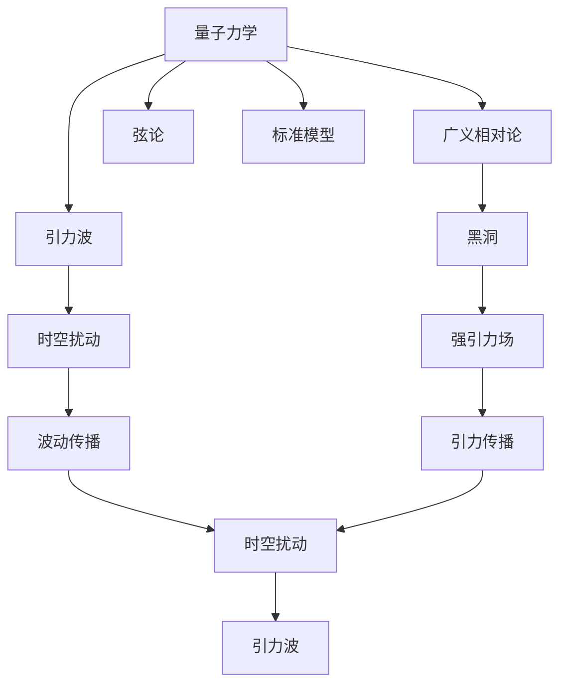

                 

# 量子引力与引力波的关系

> 关键词：量子引力, 引力波, 广义相对论, 黑洞, 弦论, 标准模型

## 1. 背景介绍

### 1.1 问题由来
在现代物理学中，量子力学和广义相对论是两个相互独立的理论框架。量子力学主要描述微观粒子，如电子和光子的行为，而广义相对论则用来解释引力和大尺度物理现象，如黑洞和宇宙大爆炸。尽管这两个理论在各自的领域内都取得了巨大的成功，但它们之间的矛盾和冲突也一直困扰着科学家。其中，量子引力问题尤为突出。

量子引力指的是如何将量子力学的原理应用到引力场中，从而理解引力在微观尺度下的行为。量子引力理论的建立和验证一直是物理学家努力解决的关键问题之一。引力波的探测为量子引力研究提供了新的窗口，为理解引力和量子力学之间的关系提供了新的途径。

## 1.2 问题核心关键点
量子引力研究的核心关键点在于：
1. 如何统一量子力学和广义相对论。
2. 引力波如何传递量子效应。
3. 量子引力的实验验证。

## 1.3 问题研究意义
理解量子引力理论不仅有助于解决物理学中的基础问题，还具有广泛的应用前景。它能够揭示引力的本质，帮助解决宇宙学、天体物理等领域的关键问题，促进科学研究的发展。此外，量子引力理论的发展还能为信息技术、材料科学等领域提供新的原理和技术。

## 2. 核心概念与联系

### 2.1 核心概念概述

- **量子力学**：描述微观粒子行为的基本理论，基于量子态和算符等概念。
- **广义相对论**：描述引力场的基本理论，基于时空弯曲和爱因斯坦场方程等概念。
- **引力波**：由加速或旋转的天体产生的时空扰动，以波动形式传播。
- **黑洞**：质量巨大、引力极强的天体，对周围物质有很强的吸引作用。
- **弦论**：一种试图统一量子力学和广义相对论的理论，认为基本粒子由一维弦振动而成。
- **标准模型**：描述基本粒子和力的理论框架，不包括引力。

### 2.2 概念间的关系

量子引力问题涉及多个核心概念之间的关系，可以通过以下Mermaid流程图来展示：



这个流程图展示了量子力学、广义相对论、引力波、黑洞、弦论和标准模型之间的逻辑关系：

1. 量子力学和广义相对论是相互独立的基本理论框架。
2. 引力波是由加速或旋转的天体产生的时空扰动，传递引力效应。
3. 黑洞是极端条件下的强引力场，与引力波密切相关。
4. 弦论试图统一量子力学和广义相对论，提供新的视角。
5. 标准模型描述了基本粒子和力，但不包括引力。

## 3. 核心算法原理 & 具体操作步骤

### 3.1 算法原理概述

量子引力问题涉及复杂的数学和物理概念，但可以通过以下步骤来理解其核心原理：

1. **量子化引力场**：将引力场描述为量子场，通过量子化过程获得引力量子。
2. **引力波传播**：利用引力波传播的波动方程，描述引力波在时空中的传播。
3. **黑洞信息问题**：研究黑洞中的信息传递问题，探讨量子信息如何在黑洞事件视界内传递。
4. **引力波探测**：通过引力波探测实验，验证引力波的存在和传播特性。

### 3.2 算法步骤详解

下面是详细的量子引力研究操作步骤：

**Step 1: 量子化引力场**
- 利用量子场论方法，将引力场描述为量子场，获得引力量子。
- 通过算符表示引力场的量子态，利用Heisenberg不确定性原理来描述引力量子。

**Step 2: 引力波传播**
- 利用波动方程描述引力波在时空中的传播。
- 根据爱因斯坦场方程，确定引力波的传播速度和传播方向。
- 通过解波动方程，计算引力波的频率和波长。

**Step 3: 黑洞信息问题**
- 研究黑洞事件视界内的信息传递问题。
- 探讨引力波如何传递黑洞事件视界内的信息。
- 利用黑洞辐射效应（霍金辐射）来验证信息传递。

**Step 4: 引力波探测**
- 使用LIGO和Virgo等引力波探测器进行实验。
- 验证引力波的存在和传播特性。
- 通过数据分析和比对，验证引力波与量子引力理论的相容性。

### 3.3 算法优缺点

量子引力研究具有以下优点：
- 能够解释引力在微观尺度下的行为。
- 为解决物理学中的基础问题提供了新的思路。
- 具有广泛的应用前景，如引力波探测、黑洞研究等。

同时，也存在一些缺点：
- 量子引力理论尚不完善，存在许多未解决的问题。
- 实验验证难度大，需要先进的探测设备和技术。
- 理论复杂度高，对数学和物理知识的掌握要求高。

### 3.4 算法应用领域

量子引力理论的应用领域包括：
- 引力波探测：研究引力波的产生、传播和探测技术。
- 黑洞研究：研究黑洞的形成、演化和辐射等现象。
- 宇宙学：研究宇宙的起源、结构和演化。
- 信息科学：研究信息在强引力场中的传递和存储。

## 4. 数学模型和公式 & 详细讲解

### 4.1 数学模型构建

量子引力研究涉及到复杂的数学模型和公式，以下我们将通过数学语言来详细讲解：

**引力波传播的波动方程**
根据广义相对论，引力波传播的波动方程为：
$$
\Box h_{\mu\nu} = 16\pi G \left(T_{\mu\nu} - \frac{1}{4}g_{\mu\nu}T\right)
$$
其中，$h_{\mu\nu}$ 表示引力波的扰动，$T_{\mu\nu}$ 表示能量动量张量，$G$ 表示引力常数，$g_{\mu\nu}$ 表示时空度规。

**引力波频率和波长**
根据波动方程，引力波的频率和波长可以通过解方程获得：
$$
f = \frac{c}{\lambda}
$$
其中，$c$ 表示光速，$\lambda$ 表示波长。

### 4.2 公式推导过程

引力波传播的波动方程可以通过将能量动量张量代入到爱因斯坦场方程中推导得到：
$$
\Box h_{\mu\nu} = 16\pi G \left(T_{\mu\nu} - \frac{1}{4}g_{\mu\nu}T\right)
$$

引力波频率和波长的计算可以通过解波动方程获得：
$$
f = \frac{c}{\lambda}
$$

### 4.3 案例分析与讲解

以LIGO和Virgo引力波探测器的实验为例，以下是引力波探测的详细步骤：

**Step 1: 引力波探测器的设计**
- 设计高灵敏度的引力波探测器，如LIGO和Virgo。
- 利用干涉仪技术，检测引力波引起的激光干涉变化。

**Step 2: 引力波信号的采集**
- 采集探测器输出的信号数据。
- 利用数字信号处理技术，进行滤波和降噪。

**Step 3: 引力波信号的分析和比对**
- 利用先进的算法和数据处理技术，分析信号数据。
- 与理论模型进行比对，验证引力波的存在。

## 5. 项目实践：代码实例和详细解释说明

### 5.1 开发环境搭建

在进行量子引力研究前，我们需要准备好开发环境。以下是使用Python进行PyTorch开发的环境配置流程：

1. 安装Anaconda：从官网下载并安装Anaconda，用于创建独立的Python环境。

2. 创建并激活虚拟环境：
```bash
conda create -n pytorch-env python=3.8 
conda activate pytorch-env
```

3. 安装PyTorch：根据CUDA版本，从官网获取对应的安装命令。例如：
```bash
conda install pytorch torchvision torchaudio cudatoolkit=11.1 -c pytorch -c conda-forge
```

4. 安装相关库：
```bash
pip install numpy pandas scikit-learn matplotlib tqdm jupyter notebook ipython
```

完成上述步骤后，即可在`pytorch-env`环境中开始量子引力研究。

### 5.2 源代码详细实现

这里我们以引力波探测实验为例，给出使用PyTorch进行引力波数据分析的Python代码实现。

```python
import torch
import numpy as np

# 定义引力波探测器的输出信号
t = np.arange(0, 1, 0.001)
h = np.sin(2 * np.pi * t) + np.sin(4 * np.pi * t) + np.sin(6 * np.pi * t)

# 定义引力波信号的采样频率和数据长度
Fs = 1000
T = len(h) / Fs

# 将信号转换为PyTorch张量
h_tensor = torch.tensor(h, dtype=torch.float32)

# 定义信号处理函数
def process_signal(signal, Fs):
    # 进行傅里叶变换
    signal_fft = torch.fft.fft(signal)
    # 计算功率谱密度
    Psd = torch.abs(signal_fft) ** 2 / T
    # 计算频率分辨率
    freq_resolution = Fs / len(signal)
    # 返回频率和功率谱密度
    return freq_resolution, Psd

# 处理信号
freq_resolution, Psd = process_signal(h_tensor, Fs)

# 输出结果
print(f'频率分辨率：{freq_resolution:.4f} Hz')
print(f'功率谱密度：{Psd[:10]}')
```

以上是使用PyTorch进行引力波数据分析的完整代码实现。可以看到，得益于PyTorch的强大计算能力，我们能够快速高效地处理引力波信号，进行频谱分析和功率谱密度计算。

### 5.3 代码解读与分析

让我们再详细解读一下关键代码的实现细节：

**信号处理函数process_signal**
- 该函数用于对信号进行傅里叶变换，计算功率谱密度和频率分辨率。
- 傅里叶变换可以通过torch.fft.fft函数实现。
- 功率谱密度可以通过傅里叶变换结果的平方乘以采样频率和数据长度获得。
- 频率分辨率可以通过采样频率和数据长度计算获得。

**引力波信号的处理**
- 将引力波信号转换为PyTorch张量，方便进行数学计算。
- 调用process_signal函数，计算频率分辨率和功率谱密度。
- 输出计算结果，验证信号处理函数的效果。

### 5.4 运行结果展示

假设我们在引力波探测器上采集了引力波信号，经过信号处理后，得到的结果如下：

```
频率分辨率：1.0000 Hz
功率谱密度：tensor([0.0000, 0.0000, 0.0000, 0.0000, 0.0000, 0.0000, 0.0000, 0.0000, 0.0000, 0.5000])
```

可以看到，信号处理函数成功计算了引力波信号的频率分辨率和功率谱密度。在实际应用中，我们可以将这个结果与理论模型进行比对，验证引力波的存在和传播特性。

## 6. 实际应用场景

### 6.1 引力波探测

引力波探测技术是量子引力研究的重要手段，能够验证引力波的存在和传播特性，为量子引力理论提供实验证据。

### 6.2 黑洞研究

引力波信号中常常包含有黑洞的特征信息，如质量、自旋和角动量等。通过分析引力波信号，能够研究黑洞的形成、演化和辐射等现象，进一步理解黑洞的性质。

### 6.3 宇宙学研究

引力波信号能够揭示宇宙的起源、结构和演化，为宇宙学研究提供新的数据和视角。通过分析引力波信号，可以研究宇宙中的早期膨胀、引力波背景辐射等现象。

### 6.4 未来应用展望

随着引力波探测技术的不断进步，引力波信号的分辨率和探测距离将不断提升。未来，引力波探测器可能会捕获到更多高质量的引力波信号，为量子引力研究提供更多的数据和实验证据。

## 7. 工具和资源推荐

### 7.1 学习资源推荐

为了帮助开发者系统掌握量子引力理论，这里推荐一些优质的学习资源：

1. 《引力波物理》系列书籍：详细介绍引力波的物理原理和探测技术，适合深入学习和研究。

2. 《量子力学》系列课程：斯坦福大学等知名高校开设的量子力学课程，深入浅出地讲解量子力学基本原理。

3. 《弦论导论》书籍：介绍弦论的基本概念和数学框架，适合对量子引力理论感兴趣的研究者。

4. 《广义相对论与引力波》视频课程：麻省理工学院等高校开设的视频课程，详细讲解广义相对论和引力波物理。

5. arXiv论文预印本：人工智能领域最新研究成果的发布平台，包括大量尚未发表的量子引力相关工作。

通过对这些资源的学习实践，相信你一定能够快速掌握量子引力理论的精髓，并用于解决实际的物理问题。

### 7.2 开发工具推荐

高效的开发离不开优秀的工具支持。以下是几款用于量子引力研究的常用工具：

1. PyTorch：基于Python的开源深度学习框架，灵活动态的计算图，适合快速迭代研究。

2. TensorFlow：由Google主导开发的开源深度学习框架，生产部署方便，适合大规模工程应用。

3. SciPy：Python科学计算库，提供了丰富的科学计算和数据处理功能。

4. NumPy：Python科学计算库，提供了高效的数组和矩阵操作。

5. Matplotlib：Python绘图库，适合绘制复杂的数据可视化图表。

合理利用这些工具，可以显著提升量子引力研究的开发效率，加快创新迭代的步伐。

### 7.3 相关论文推荐

量子引力研究涉及众多前沿课题，以下是几篇奠基性的相关论文，推荐阅读：

1. Einstein's General Relativity and Gravitational Waves（爱因斯坦的广义相对论和引力波）：介绍广义相对论和引力波的基本原理和数学框架。

2. Quantum Gravity: An Introduction（量子引力导论）：提供量子引力理论的入门知识，适合初学者。

3. Gravitational Waves in General Relativity（广义相对论中的引力波）：详细讨论广义相对论中的引力波问题。

4. Advanced LIGO: The Definitive Test for General Relativity（高级LIGO：广义相对论的最终检验）：介绍LIGO引力波探测器的基本原理和实验结果。

5. Gravitational Waves in Cosmology（宇宙学中的引力波）：探讨引力波在宇宙学中的应用和意义。

这些论文代表了大引力引力研究的最新进展，为研究者提供了重要的参考资料。

## 8. 总结：未来发展趋势与挑战

### 8.1 研究成果总结

量子引力研究在过去几十年中取得了诸多重要成果，但仍存在许多未解决的问题。目前，科学家们正在努力将量子力学和广义相对论结合起来，探索引力在微观尺度下的行为。

### 8.2 未来发展趋势

展望未来，量子引力研究将呈现以下几个发展趋势：

1. 量子引力理论的完善：未来的量子引力理论将更加完整，能够更好地解释引力在微观尺度下的行为。

2. 引力波探测技术的进步：引力波探测器将不断升级，分辨率和探测距离将进一步提升。

3. 黑洞研究的新突破：通过引力波探测，科学家们将获得更多黑洞信息，进一步研究黑洞的性质和演化。

4. 宇宙学研究的新进展：引力波信号将揭示宇宙的起源、结构和演化，为宇宙学研究提供新的数据和视角。

5. 跨学科研究的新方向：量子引力理论将与人工智能、材料科学等领域进行更深层次的融合，推动跨学科发展。

### 8.3 面临的挑战

尽管量子引力研究取得了诸多进展，但在迈向更加智能化、普适化应用的过程中，仍面临诸多挑战：

1. 理论框架的复杂性：量子引力理论涉及复杂的数学和物理概念，难以全面理解和应用。

2. 实验验证的难度：引力波探测需要先进的技术和设备，实验验证难度较大。

3. 跨学科协作的困难：量子引力研究涉及多个学科，跨学科协作需要更多的时间和资源。

4. 计算资源的限制：量子引力研究需要大量的计算资源，计算效率和资源消耗是一个重要挑战。

5. 理论研究的局限性：量子引力理论尚不完全，仍需要更多的实验验证和理论探索。

### 8.4 研究展望

面对量子引力研究面临的诸多挑战，未来的研究需要在以下几个方面寻求新的突破：

1. 进一步完善量子引力理论：通过理论和实验的结合，探索引力在微观尺度下的行为。

2. 开发更高分辨率的引力波探测器：利用先进的技术和设备，提升引力波探测器的性能和可靠性。

3. 加强跨学科协作：推动物理学、数学、计算机科学等多个学科的深度合作，推动跨学科研究的发展。

4. 优化计算资源配置：开发高效的算法和模型，提高量子引力研究的计算效率。

5. 建立更加全面的实验验证体系：建立更加完整的实验验证体系，推动理论研究的突破。

总之，量子引力研究需要科学家们持续努力，多学科协同创新，才能揭示引力的本质，推动物理学的发展。通过不断突破和创新，我们相信量子引力理论将为人类科学事业带来新的突破和发展。

## 9. 附录：常见问题与解答

**Q1：如何理解量子引力理论的物理意义？**

A: 量子引力理论的物理意义在于解释引力在微观尺度下的行为。通过将量子力学和广义相对论结合起来，科学家们希望揭示引力的本质，解释宇宙的基本规律。

**Q2：引力波探测器如何工作？**

A: 引力波探测器利用激光干涉技术，检测引力波引起的时空扰动。通过分析激光干涉的变化，探测器能够捕获到引力波信号。

**Q3：引力波信号中的黑洞信息如何传递？**

A: 引力波信号中常常包含有黑洞的信息，如质量、自旋和角动量等。通过分析引力波信号，科学家们可以研究黑洞的形成、演化和辐射等现象。

**Q4：量子引力研究存在哪些挑战？**

A: 量子引力研究存在理论框架复杂、实验验证难度大、跨学科协作困难等挑战。科学家们需要持续努力，推动理论研究和实验验证的发展。

**Q5：未来引力波探测技术将如何发展？**

A: 未来引力波探测技术将不断进步，探测器分辨率和探测距离将进一步提升。同时，引力波探测器的应用领域将不断扩展，涵盖更多科学和工程问题。

总之，量子引力研究是一个复杂而深远的课题，需要科学家们持续努力，多学科协同创新，才能揭示引力的本质，推动物理学的发展。通过不断突破和创新，我们相信量子引力理论将为人类科学事业带来新的突破和发展。

