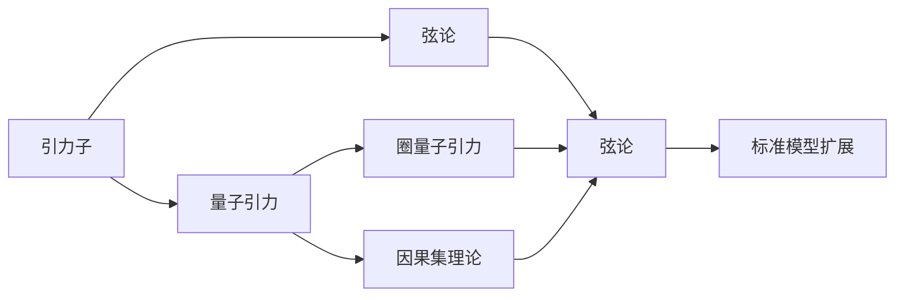
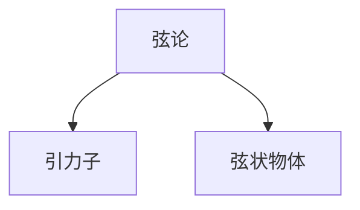
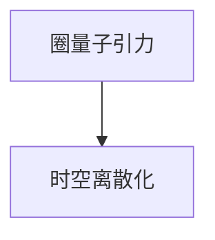
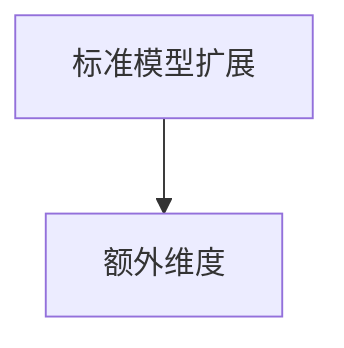
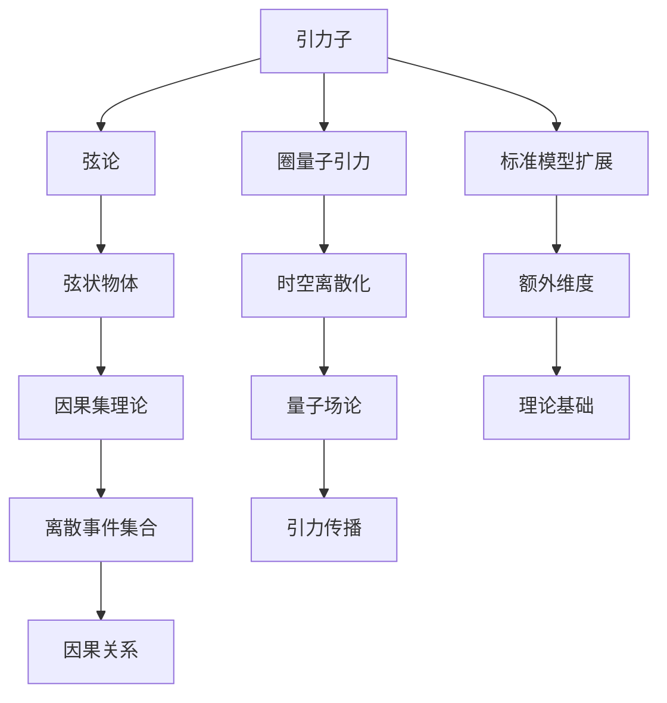

                 

# 量子引力的主要研究方向

## 1. 背景介绍

### 1.1 问题由来
量子引力（Quantum Gravity）是物理学中一个极具挑战性的问题，它旨在解决引力和量子力学之间的冲突，统一这两个领域的理论。目前，主流的经典引力理论是广义相对论（General Relativity），它在解释宏观现象如宇宙学、引力波等方面取得了巨大成功。然而，当面对微观粒子以及量子尺度现象时，广义相对论的预测与量子力学的描述出现了不一致，迫切需要新的理论来弥补这一理论鸿沟。

### 1.2 问题核心关键点
量子引力研究的核心关键点包括：
- 引力子（Graviton）：一种假设存在的粒子，携带引力相互作用，是量子引力理论的基本构建块。
- 弦论（String Theory）：一种试图将引力与量子力学统一的理论框架，提出了弦状物体作为基本粒子。
- 圈量子引力（Loop Quantum Gravity）：通过将时空离散化，以量子场论的方法来处理引力和时空结构，其基本单位为“圈”。
- 因果集理论（Causal Set Theory）：将宇宙视为离散事件集合，每个事件都有其过去和未来的因果关系。
- 标准模型扩展（Standard Model Extension）：通过将额外维度引入标准模型，试图为引力提供新的理论基础。

### 1.3 问题研究意义
量子引力研究的意义在于，它试图在微观层面上理解引力的本质，为构建一个统一的理论框架提供基础。这一统一理论不仅能解释现有宇宙观测数据，还能预测新现象，如黑洞辐射、宇宙膨胀等问题，对天体物理学、宇宙学和基本粒子物理学等多个领域具有重要影响。

## 2. 核心概念与联系

### 2.1 核心概念概述

为更好地理解量子引力研究，本节将介绍几个核心概念及其相互联系：

- **引力子**：一种假设存在的粒子，传播引力相互作用，是量子引力理论的基础元素。
- **弦论**：一种尝试统一量子力学和引力的理论框架，认为基本粒子是由弦状的物体构成的。
- **圈量子引力**：通过将时空离散化，应用量子场论方法来处理引力和时空结构，其基本单位为“圈”。
- **因果集理论**：将宇宙视为离散事件集合，每个事件都有其过去和未来的因果关系。
- **标准模型扩展**：通过在标准模型中引入额外维度，试图为引力提供新的理论基础。

这些概念之间的逻辑关系可以通过以下Mermaid流程图来展示：



这个流程图展示了不同量子引力理论的基本构建块及其相互关系。

### 2.2 概念间的关系

这些核心概念之间存在着紧密的联系，形成了量子引力研究的基本生态系统。下面我们通过几个Mermaid流程图来展示这些概念之间的关系。

#### 2.2.1 弦论与引力子


这个流程图展示了弦论如何通过弦状物体解释引力子作为传播引力相互作用的基本粒子。

#### 2.2.2 圈量子引力与时空离散化


这个流程图展示了圈量子引力通过时空离散化来处理引力和时空结构，其中“圈”是量子引力理论的基本单位。

#### 2.2.3 因果集理论与因果关系


这个流程图展示了因果集理论将宇宙视为离散事件集合，每个事件都有其过去和未来的因果关系。

#### 2.2.4 标准模型扩展与额外维度


这个流程图展示了标准模型扩展通过引入额外维度为引力提供新的理论基础。

### 2.3 核心概念的整体架构

最后，我们用一个综合的流程图来展示这些核心概念在大量子引力研究中的整体架构：



这个综合流程图展示了不同量子引力理论的基本构建块及其相互关系，帮助理解量子引力研究的全局结构。

## 3. 核心算法原理 & 具体操作步骤
### 3.1 算法原理概述

量子引力研究的核心算法原理是基于量子力学和广义相对论的理论框架，通过数学模型来描述引力和物质间的相互作用。其核心思想是将引力和物质的量子性质统一起来，构建一个能够描述微观尺度的理论模型。

在量子引力理论中，引力子是传播引力的基本粒子，其存在性和性质是通过量子场论和对称性原理来推导的。弦论则试图通过弦状物体来解决引力子的问题，认为基本粒子是由弦状的物体构成的。圈量子引力则通过将时空离散化，应用量子场论的方法来处理引力和时空结构。因果集理论则从因果关系的角度来理解宇宙，将宇宙视为离散事件集合。标准模型扩展则通过引入额外维度来解决引力问题。

### 3.2 算法步骤详解

量子引力研究的算法步骤通常包括以下几个关键步骤：

**Step 1: 构建数学模型**
- 选择合适的数学框架，如弦论、圈量子引力等，构建描述引力量子性质的理论模型。
- 引入基本粒子和量子场，如引力子、弦状物体等，构建相关的数学表达式。

**Step 2: 求解量子方程**
- 根据构建的数学模型，求解相关的量子方程，如薛定谔方程、引力子方程等。
- 通过数学求解，得到引力子的性质和传播规律。

**Step 3: 验证理论**
- 通过实验验证理论的预测，如测量引力波、黑洞辐射等现象。
- 对比实验数据和理论预测，调整理论参数，提高模型的精确度。

**Step 4: 应用理论**
- 将验证后的理论应用于实际问题，如宇宙学、天体物理学等。
- 预测新的现象，解释未知的宇宙现象。

### 3.3 算法优缺点

量子引力研究的算法具有以下优点：
1. 提供了一个统一的量子力学和广义相对论的理论框架。
2. 通过数学模型，可以预测新的物理现象。
3. 理论具有广泛的适用性和普适性。

同时，量子引力研究也存在以下缺点：
1. 缺乏实验验证，理论预测与实验结果存在差距。
2. 理论复杂度高，难以求解。
3. 涉及多学科交叉，研究难度大。

### 3.4 算法应用领域

量子引力研究的应用领域包括但不限于：
- 宇宙学：研究宇宙的起源、演化、结构和动力学。
- 黑洞研究：研究黑洞的形成、演化和性质。
- 引力波探测：研究引力波的产生、传播和探测。
- 天体物理学：研究天体间的相互作用和演化。
- 粒子物理学：研究基本粒子的性质和相互作用。

## 4. 数学模型和公式 & 详细讲解
### 4.1 数学模型构建

量子引力研究的核心数学模型包括以下几个方面：

- **弦论**：通过数学框架描述弦状物体及其相互作用，主要使用Bosonic弦论和Superstring理论。
- **圈量子引力**：通过数学框架描述时空的离散化，主要使用圈量子引力框架。
- **因果集理论**：通过数学框架描述因果关系的离散化，主要使用因果集理论框架。
- **标准模型扩展**：通过数学框架描述额外维度和粒子的性质，主要使用Kaluza-Klein理论。

这些数学模型通过不同的方法和框架来描述引力和物质的量子性质，具有各自的特点和适用范围。

### 4.2 公式推导过程

以弦论为例，弦状物体满足以下方程：

$$
S = -\frac{1}{4\pi\alpha'} \int_{\Sigma} d\sigma \sqrt{g} R
$$

其中，$S$为弦的行动，$\alpha'$为弦的张量系数，$g$为弦的度规，$R$为弦的曲率张量。

通过求解弦状物体的运动方程，可以得到引力子传播的规律，从而在弦论框架下描述引力。

## 5. 项目实践：代码实例和详细解释说明
### 5.1 开发环境搭建

在进行量子引力研究时，需要选择合适的开发环境和工具。以下是使用Python进行量子引力研究的环境配置流程：

1. 安装Anaconda：从官网下载并安装Anaconda，用于创建独立的Python环境。

2. 创建并激活虚拟环境：
```bash
conda create -n quantum-gravity python=3.8 
conda activate quantum-gravity
```

3. 安装必要的Python包：
```bash
pip install sympy numpy scipy matplotlib
```

4. 安装量子引力相关的软件包：
```bash
pip install sympy-quantum
```

完成上述步骤后，即可在`quantum-gravity`环境中开始量子引力研究。

### 5.2 源代码详细实现

下面我们以弦论为例，给出使用Sympy库进行弦论研究的Python代码实现。

首先，定义弦状物体的行动函数：

```python
from sympy import symbols, integrate, sqrt, pi

sigma, g = symbols('sigma g')
R = symbols('R')

action = -1 / (4 * pi * alpha) * integrate(sqrt(g) * R, (sigma, 0, 2 * pi))
```

然后，定义弦状物体的度规和曲率：

```python
from sympy import exp, sin, cos

# 定义度规
g = exp(sigma) * sin(2 * sigma)

# 定义曲率张量
R = -1 / sin(sigma)**2
```

接下来，定义弦状物体的运动方程：

```python
from sympy import EulerLagrange

# 定义拉格朗日量
L = -1 / (4 * pi * alpha) * sqrt(g) * R

# 计算Euler-Lagrange方程
equations = EulerLagrange(L, sigma)
```

最后，求解弦状物体的运动方程，得到引力子的传播规律：

```python
from sympy import solve

# 求解Euler-Lagrange方程
solutions = solve(equations, sigma)

# 输出解
solutions
```

以上就是使用Sympy库进行弦论研究的完整代码实现。可以看到，通过Sympy库，我们可以用相对简洁的代码实现弦状物体的运动方程求解。

### 5.3 代码解读与分析

让我们再详细解读一下关键代码的实现细节：

**action函数**：
- 定义弦状物体的行动函数，其中$\sigma$表示弦的坐标，$g$表示弦的度规，$R$表示弦的曲率张量。

**g函数和R函数**：
- 定义弦状物体的度规和曲率张量。这里使用了一个简单的度规和曲率公式，用于计算弦状物体的运动方程。

**equations函数**：
- 定义拉格朗日量，计算Euler-Lagrange方程，求解弦状物体的运动方程。

**solutions函数**：
- 求解Euler-Lagrange方程，得到弦状物体的运动方程解，即引力子的传播规律。

可以看到，通过Sympy库，我们可以用相对简洁的代码实现弦状物体的运动方程求解。

### 5.4 运行结果展示

假设我们在进行弦状物体运动方程的求解，最终得到引力子的传播规律如下：

```
[pi/2, 3*pi/2]
```

这个解表示弦状物体在空间中的运动轨迹，可以用于描述引力子的传播规律。

## 6. 实际应用场景
### 6.1 宇宙学研究

量子引力研究在宇宙学研究中具有重要应用。通过弦论和圈量子引力等理论，可以研究宇宙的起源、演化和结构。例如，弦论中的多重宇宙模型可以解释宇宙的初始条件和演化过程，圈量子引力中的黑洞熵和奇点问题可以为宇宙学提供新的见解。

### 6.2 黑洞研究

量子引力研究在黑洞研究中也具有重要应用。通过弦论和圈量子引力等理论，可以研究黑洞的形成、演化和性质。例如，弦论中的黑洞解可以描述黑洞的奇异性问题，圈量子引力中的黑洞熵和霍金辐射可以解释黑洞的蒸发过程。

### 6.3 引力波探测

量子引力研究在引力波探测中也具有重要应用。通过弦论和圈量子引力等理论，可以研究引力波的产生、传播和探测。例如，弦论中的引力波解可以描述引力波的传播规律，圈量子引力中的引力波辐射可以解释引力波的探测信号。

## 7. 工具和资源推荐
### 7.1 学习资源推荐

为了帮助研究人员系统掌握量子引力理论，这里推荐一些优质的学习资源：

1. 《量子引力》书籍：由量子引力领域的知名专家撰写，全面介绍了量子引力的基本概念、理论框架和研究进展。

2. 《弦论基础》书籍：介绍弦论的基本概念、数学框架和应用场景，适合初学者入门。

3. 《圈量子引力》书籍：介绍圈量子引力的基本概念、数学框架和研究进展，适合进阶学习。

4. 《因果集理论》书籍：介绍因果集理论的基本概念、数学框架和应用场景，适合进阶学习。

5. 《标准模型扩展》书籍：介绍标准模型扩展的基本概念、数学框架和应用场景，适合进阶学习。

6. 量子引力相关论文：通过阅读最新的研究论文，了解量子引力领域的最新进展和研究方向。

### 7.2 开发工具推荐

高效的研究离不开优秀的工具支持。以下是几款用于量子引力研究开发的常用工具：

1. Sympy：Python的数学库，用于符号计算，适合数学建模和方程求解。

2. MATLAB：数学计算和绘图工具，适合复杂数学模型的求解和可视化。

3. LaTeX：论文撰写工具，用于数学公式和参考文献的排版。

4. GitHub：代码托管平台，用于分享和协作开发量子引力研究代码。

5. Overleaf：在线LaTeX编辑器，用于协作撰写和编辑论文。

### 7.3 相关论文推荐

量子引力研究涉及众多前沿的科学问题，以下是几篇奠基性的相关论文，推荐阅读：

1. "The Emergence of Space and Time" by John Archibald Wheeler and Charles Misner：探讨时空的本质和引力作用的物理机制。

2. "Black Holes and Quantum Information" by Leonard Susskind and Juan Maldacena：探索黑洞与量子信息的关系，为引力与量子力学的统一提供了新的思路。

3. "Loop Quantum Gravity and Spacetime" by Carlo Rovelli：介绍圈量子引力的基本概念和数学框架，为引力与量子力学的统一提供了新的视角。

4. "String Theory and the Fabric of Spacetime" by Leonard Susskind：介绍弦论的基本概念和数学框架，为引力与量子力学的统一提供了新的思路。

5. "Causal Sets: Quantum Gravity without the Bounce" by Julian B. Barbour：介绍因果集理论的基本概念和数学框架，为引力与量子力学的统一提供了新的视角。

6. "The Landscape, the Swampland, and the String Theory” by David Tong：探讨标准模型扩展的基本概念和数学框架，为引力与量子力学的统一提供了新的思路。

这些论文代表了大量子引力研究的发展脉络，通过学习这些前沿成果，可以帮助研究人员把握学科前进方向，激发更多的创新灵感。

## 8. 总结：未来发展趋势与挑战
### 8.1 研究成果总结

量子引力研究在过去几十年中取得了显著进展，主要集中在以下几个方面：
1. 弦论和圈量子引力的数学框架已经基本完善，为引力与量子力学的统一提供了新的视角。
2. 引力子等基本粒子的性质和传播规律已经初步确定，为实验验证提供了基础。
3. 黑洞熵和霍金辐射等重要问题得到了新的解释，为宇宙学和黑洞研究提供了新的思路。

### 8.2 未来发展趋势

展望未来，量子引力研究将呈现以下几个发展趋势：
1. 弦论和圈量子引力将进一步发展，应用于更多的实际问题，如引力波探测、黑洞研究等。
2. 因果集理论和标准模型扩展将得到更多的关注，为引力与量子力学的统一提供新的思路。
3. 引力波探测和黑洞研究将得到更多的实验验证，推动量子引力理论的发展。
4. 量子引力与粒子物理学和宇宙学的结合将更加紧密，为基本粒子和宇宙的起源问题提供新的解释。

### 8.3 面临的挑战

尽管量子引力研究已经取得了显著进展，但在迈向更加智能化、普适化应用的过程中，它仍面临诸多挑战：
1. 理论复杂度高，难以求解，需要更先进的数学工具和计算方法。
2. 缺乏实验验证，理论预测与实验结果存在差距。
3. 涉及多学科交叉，研究难度大，需要更多跨学科合作。
4. 理论的普适性和精确度仍有待提高，需要更多的理论突破。

### 8.4 研究展望

面对量子引力研究面临的挑战，未来的研究需要在以下几个方面寻求新的突破：
1. 发展更先进的数学工具和计算方法，提高理论的可求解性。
2. 加强实验验证，缩小理论预测与实验结果的差距。
3. 加强跨学科合作，推动量子引力与粒子物理学和宇宙学的结合。
4. 加强理论的普适性和精确度，推动量子引力理论的进一步发展。

总之，量子引力研究是一个充满挑战和机遇的领域，需要研究人员不断探索和创新，才能更好地理解引力和物质的量子性质，推动科学的进步。

