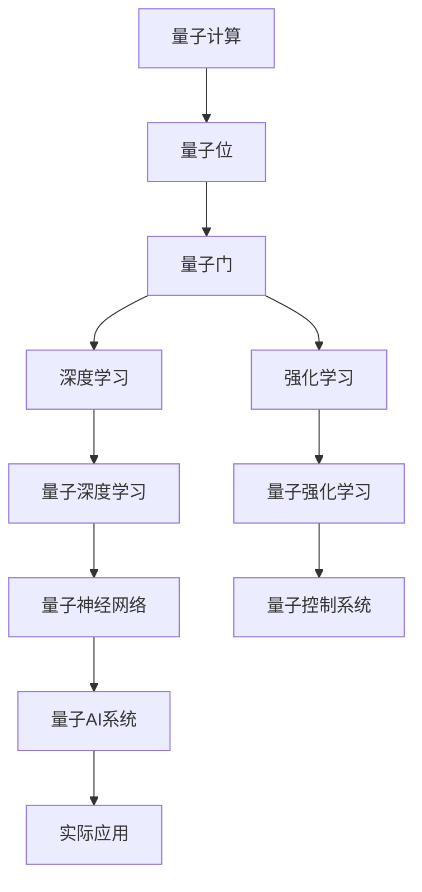
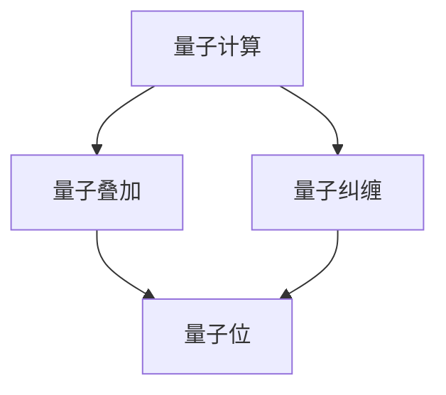
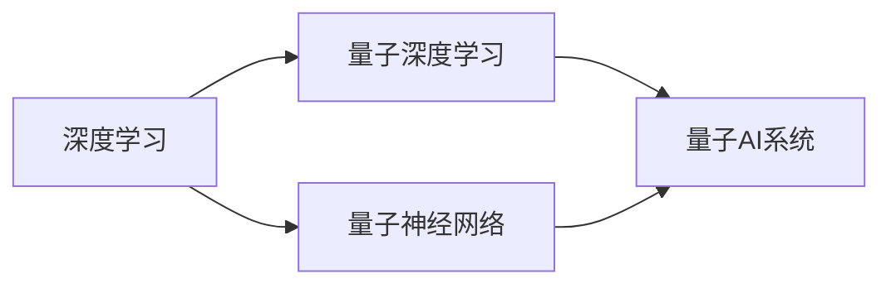
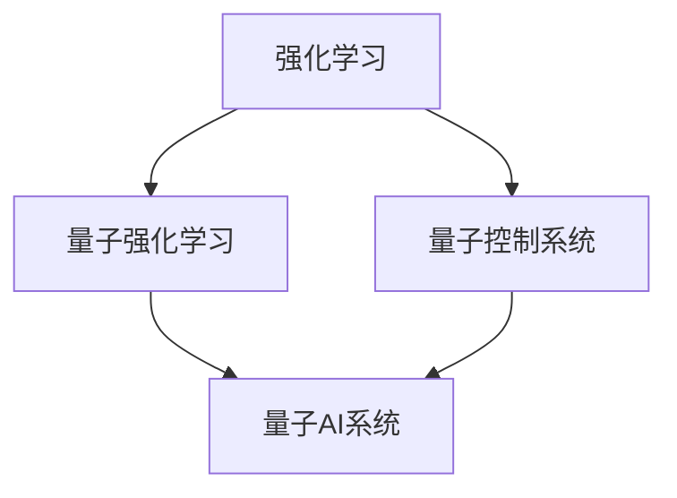
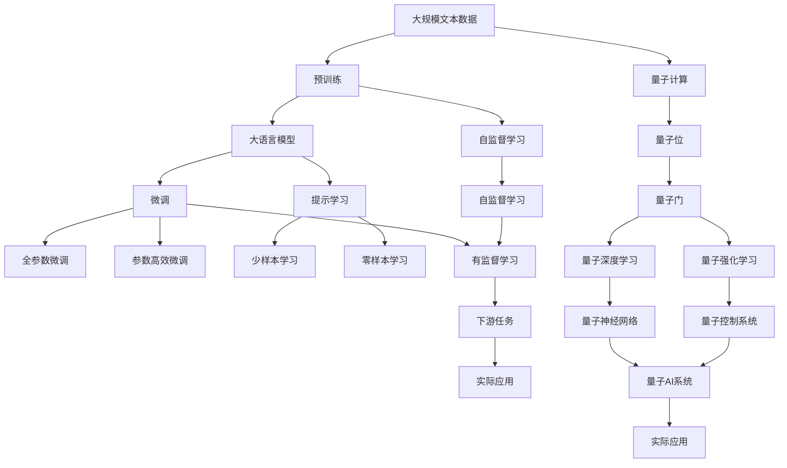

                 

## 1. 背景介绍

### 1.1 问题由来
量子计算和人工智能（AI）是当今科技领域最为前沿的两大研究方向，各自代表了计算能力和智能水平的极限挑战。量子计算通过量子位（qubit）的量子叠加和纠缠现象，理论上可以实现对大量数据的高效处理，而AI则通过深度学习等算法模拟人类智能，能够在复杂任务中取得卓越表现。将量子计算与AI技术结合，旨在探索未来计算的全新可能，为科学计算、机器学习、复杂系统模拟等领域带来革命性的突破。

### 1.2 问题核心关键点
量子计算与AI的结合，涉及量子计算的基本原理和AI算法在量子计算环境下的优化。核心关键点包括：
1. 量子位（qubit）的量子叠加与纠缠特性。
2. AI中的深度学习、强化学习等算法在量子计算机上的高效实现。
3. 量子计算与经典计算的协同算法设计。
4. 量子AI系统的实际应用场景。
5. 量子计算与AI结合的理论与实践挑战。

### 1.3 问题研究意义
量子计算与AI的结合，不仅在理论上为计算科学和AI研究提供了新的范式，而且在实践中推动了高性能计算、大数据分析、复杂系统模拟等领域的快速发展。它有望实现计算能力的质的飞跃，为解决传统计算方法无法处理的复杂问题开辟新路径。

## 2. 核心概念与联系

### 2.1 核心概念概述

为更好地理解量子计算与AI的结合，本节将介绍几个密切相关的核心概念：

- **量子计算**：利用量子叠加和纠缠等量子特性，进行计算的一种新型计算范式。量子计算机通过量子位（qubit）来处理信息，其基本操作包括量子门、测量等。

- **量子位（qubit）**：量子计算的基本单位，具有量子叠加和量子纠缠的特性，可以同时表示多个状态。

- **量子门（quantum gate）**：量子计算的基本操作，用于改变量子位的状态。

- **深度学习**：一种通过多层神经网络进行训练，学习数据特征的AI算法，广泛应用于图像识别、自然语言处理等领域。

- **强化学习**：一种通过试错训练，优化策略的AI算法，常用于游戏、机器人控制等领域。

- **量子深度学习（Quantum Deep Learning）**：将深度学习算法应用于量子计算机上的研究领域，旨在优化量子神经网络的训练和推理过程。

- **量子强化学习（Quantum Reinforcement Learning）**：将强化学习算法应用于量子计算机上的研究领域，探索量子系统最优控制和动态规划问题。

这些核心概念之间的逻辑关系可以通过以下Mermaid流程图来展示：



这个流程图展示了大语言模型的核心概念及其之间的关系：

1. 量子计算通过量子位进行计算。
2. 量子位通过量子门进行状态改变。
3. AI中的深度学习和强化学习算法在量子计算机上得以高效实现。
4. 量子深度学习和量子强化学习进一步发展了量子AI系统。
5. 量子AI系统通过实际应用，解决了传统计算无法解决的复杂问题。

### 2.2 概念间的关系

这些核心概念之间存在着紧密的联系，形成了量子计算与AI结合的完整生态系统。下面我们通过几个Mermaid流程图来展示这些概念之间的关系。

#### 2.2.1 量子计算的基本原理



这个流程图展示了量子计算的基本原理：

1. 量子叠加：量子位可以同时处于多个状态。
2. 量子纠缠：量子位之间存在复杂的相关性。
3. 量子位：量子计算的基本单位。

#### 2.2.2 量子计算与AI的结合



这个流程图展示了量子计算与AI结合的基本流程：

1. 深度学习：经典AI算法。
2. 量子深度学习：深度学习在量子计算机上的应用。
3. 量子神经网络：量子计算中的神经网络结构。
4. 量子AI系统：结合量子计算和AI的综合性系统。

#### 2.2.3 量子强化学习的应用



这个流程图展示了量子强化学习的应用：

1. 强化学习：AI中的策略优化算法。
2. 量子强化学习：强化学习在量子计算机上的应用。
3. 量子控制系统：利用量子系统进行优化控制的系统。
4. 量子AI系统：综合量子计算与AI的解决方案。

### 2.3 核心概念的整体架构

最后，我们用一个综合的流程图来展示这些核心概念在大语言模型结合过程中，整体架构：



这个综合流程图展示了从预训练到微调，再到持续学习的完整过程。量子计算与AI的结合涉及预训练模型在量子计算机上的量子深度学习和量子强化学习过程。微调则是对预训练模型进行任务特定的优化，可以分为全参数微调和参数高效微调两种方式。

## 3. 核心算法原理 & 具体操作步骤
### 3.1 算法原理概述

量子计算与AI的结合，本质上是通过量子计算机的高效计算能力，优化AI算法在处理大规模数据和复杂系统时的性能。具体来说，量子计算机的量子位可以同时表示多个状态，通过量子叠加和量子纠缠等特性，实现并行计算，大大提升计算效率。

形式化地，假设预训练语言模型为 $M_{\theta}$，其中 $\theta$ 为预训练得到的模型参数。给定下游任务 $T$ 的标注数据集 $D=\{(x_i,y_i)\}_{i=1}^N$，结合量子计算的深度学习算法为 $L_{\theta}$，则结合量子计算的微调过程可以表示为：

$$
\hat{\theta}=\mathop{\arg\min}_{\theta} \mathcal{L}(L_{\theta},D)
$$

其中 $\mathcal{L}$ 为针对任务 $T$ 设计的损失函数，用于衡量模型预测输出与真实标签之间的差异。常见的损失函数包括交叉熵损失、均方误差损失等。

通过梯度下降等优化算法，结合量子计算的微调过程不断更新模型参数 $\theta$，最小化损失函数 $\mathcal{L}$，使得模型输出逼近真实标签。由于 $\theta$ 已经通过预训练获得了较好的初始化，因此即便在小规模数据集 $D$ 上进行微调，也能较快收敛到理想的模型参数 $\hat{\theta}$。

### 3.2 算法步骤详解

结合量子计算的微调方法包括以下几个关键步骤：

**Step 1: 准备预训练模型和数据集**
- 选择合适的预训练语言模型 $M_{\theta}$ 作为初始化参数，如 BERT、GPT 等。
- 准备下游任务 $T$ 的标注数据集 $D$，划分为训练集、验证集和测试集。一般要求标注数据与预训练数据的分布不要差异过大。

**Step 2: 添加任务适配层**
- 根据任务类型，在预训练模型顶层设计合适的输出层和损失函数。
- 对于分类任务，通常在顶层添加线性分类器和交叉熵损失函数。
- 对于生成任务，通常使用语言模型的解码器输出概率分布，并以负对数似然为损失函数。

**Step 3: 设置微调超参数**
- 选择合适的优化算法及其参数，如 AdamW、SGD 等，设置学习率、批大小、迭代轮数等。
- 设置正则化技术及强度，包括权重衰减、Dropout、Early Stopping 等。
- 确定冻结预训练参数的策略，如仅微调顶层，或全部参数都参与微调。

**Step 4: 执行梯度训练**
- 将训练集数据分批次输入模型，前向传播计算损失函数。
- 反向传播计算参数梯度，根据设定的优化算法和学习率更新模型参数。
- 周期性在验证集上评估模型性能，根据性能指标决定是否触发 Early Stopping。
- 重复上述步骤直到满足预设的迭代轮数或 Early Stopping 条件。

**Step 5: 测试和部署**
- 在测试集上评估微调后模型 $M_{\hat{\theta}}$ 的性能，对比微调前后的精度提升。
- 使用微调后的模型对新样本进行推理预测，集成到实际的应用系统中。
- 持续收集新的数据，定期重新微调模型，以适应数据分布的变化。

以上是结合量子计算的微调方法的一般流程。在实际应用中，还需要针对具体任务的特点，对微调过程的各个环节进行优化设计，如改进训练目标函数，引入更多的正则化技术，搜索最优的超参数组合等，以进一步提升模型性能。

### 3.3 算法优缺点

结合量子计算的微调方法具有以下优点：
1. 高效计算：量子计算机能够并行处理大量数据，大幅提升计算效率。
2. 泛化能力强：量子深度学习算法能够更好地捕捉数据之间的复杂关联，提升模型泛化能力。
3. 灵活性高：量子计算机可以通过量子门等操作，灵活设计计算逻辑。

同时，该方法也存在一定的局限性：
1. 硬件限制：当前量子计算机还处于发展初期，硬件稳定性、可扩展性等问题尚未完全解决。
2. 算法复杂度：量子算法设计复杂，量子电路优化和错误校正等技术有待进一步突破。
3. 数据转换：经典数据需要转换为量子数据格式，涉及复杂的数据编码和解码过程。
4. 应用场景限制：目前量子计算与AI结合主要应用于科学计算和特定领域的优化问题，大规模商业应用仍有待探索。

尽管存在这些局限性，但量子计算与AI的结合仍是大数据和复杂系统求解的重要方向，未来有望在更多领域带来突破性的进展。

### 3.4 算法应用领域

结合量子计算的微调方法已在多个领域展现了其独特优势，具体应用包括：

- **科学计算**：在物理模拟、药物设计、化学计算等领域，量子计算能够高效处理大规模模拟任务，提供精确的模拟结果。

- **金融分析**：在风险评估、投资组合优化等领域，量子计算能够快速求解复杂的数学模型，提供精准的决策支持。

- **自然语言处理**：在语言模型训练、机器翻译、文本生成等领域，量子计算能够加速计算过程，提升模型性能。

- **机器学习**：在深度学习、强化学习等机器学习任务中，量子计算能够提供更高的计算效率，加速模型训练和推理。

- **系统优化**：在复杂系统优化、交通流量控制等领域，量子计算能够高效求解优化问题，提升系统运行效率。

除了这些经典应用领域外，量子计算与AI的结合还将在更多新兴领域展现其潜力，为未来计算的协同发展提供新的可能性。

## 4. 数学模型和公式 & 详细讲解  
### 4.1 数学模型构建

本节将使用数学语言对结合量子计算的微调过程进行更加严格的刻画。

记预训练语言模型为 $M_{\theta}$，其中 $\theta$ 为预训练得到的模型参数。假设结合量子计算的深度学习算法为 $L_{\theta}$，则结合量子计算的微调过程可以表示为：

$$
\hat{\theta}=\mathop{\arg\min}_{\theta} \mathcal{L}(L_{\theta},D)
$$

其中 $\mathcal{L}$ 为针对任务 $T$ 设计的损失函数，用于衡量模型预测输出与真实标签之间的差异。常见的损失函数包括交叉熵损失、均方误差损失等。

### 4.2 公式推导过程

以下我们以二分类任务为例，推导交叉熵损失函数及其梯度的计算公式。

假设模型 $M_{\theta}$ 在输入 $x$ 上的输出为 $\hat{y}=M_{\theta}(x) \in [0,1]$，表示样本属于正类的概率。真实标签 $y \in \{0,1\}$。则二分类交叉熵损失函数定义为：

$$
\ell(M_{\theta}(x),y) = -[y\log \hat{y} + (1-y)\log (1-\hat{y})]
$$

将其代入经验风险公式，得：

$$
\mathcal{L}(\theta) = -\frac{1}{N}\sum_{i=1}^N [y_i\log M_{\theta}(x_i)+(1-y_i)\log(1-M_{\theta}(x_i))]
$$

根据链式法则，损失函数对参数 $\theta_k$ 的梯度为：

$$
\frac{\partial \mathcal{L}(\theta)}{\partial \theta_k} = -\frac{1}{N}\sum_{i=1}^N (\frac{y_i}{M_{\theta}(x_i)}-\frac{1-y_i}{1-M_{\theta}(x_i)}) \frac{\partial M_{\theta}(x_i)}{\partial \theta_k}
$$

其中 $\frac{\partial M_{\theta}(x_i)}{\partial \theta_k}$ 可进一步递归展开，利用自动微分技术完成计算。

在得到损失函数的梯度后，即可带入参数更新公式，完成模型的迭代优化。重复上述过程直至收敛，最终得到适应下游任务的最优模型参数 $\hat{\theta}$。

## 5. 项目实践：代码实例和详细解释说明
### 5.1 开发环境搭建

在进行结合量子计算的微调实践前，我们需要准备好开发环境。以下是使用Python进行Qiskit和PyTorch开发的环境配置流程：

1. 安装Anaconda：从官网下载并安装Anaconda，用于创建独立的Python环境。

2. 创建并激活虚拟环境：
```bash
conda create -n qiskit-env python=3.8 
conda activate qiskit-env
```

3. 安装Qiskit和PyTorch：
```bash
conda install qiskit pytorch torchvision torchaudio
```

4. 安装各类工具包：
```bash
pip install numpy pandas scikit-learn matplotlib tqdm jupyter notebook ipython
```

完成上述步骤后，即可在`qiskit-env`环境中开始结合量子计算的微调实践。

### 5.2 源代码详细实现

下面我们以量子逻辑门（Quantum Logic Gate）的微调为例，给出使用Qiskit和PyTorch对量子逻辑门进行微调的PyTorch代码实现。

首先，定义量子逻辑门的数据处理函数：

```python
from qiskit import QuantumCircuit
from qiskit.quantum_info import Statevector
from qiskit.circuit.library import QuantumLogicalGate

def prepare_circuit(qubit):
    qc = QuantumCircuit(1,1)
    qc.append(QuantumLogicalGate(), qubit)
    qc.measure(qubit, 0)
    return qc

def run_circuit(qc, backend):
    backend = QiskitBackend(backend)
    result = execute(qc, backend, shots=1024).result()
    statevector = Statevector(result.get_statevector())
    return statevector
```

然后，定义模型和优化器：

```python
from torch import nn
from torch.optim import AdamW

model = nn.Sequential(nn.Linear(1, 2), nn.Tanh())
optimizer = AdamW(model.parameters(), lr=2e-5)
```

接着，定义训练和评估函数：

```python
from sklearn.metrics import accuracy_score

device = torch.device('cuda') if torch.cuda.is_available() else torch.device('cpu')
model.to(device)

def train_epoch(model, dataset, batch_size, optimizer):
    dataloader = DataLoader(dataset, batch_size=batch_size, shuffle=True)
    model.train()
    epoch_loss = 0
    for batch in tqdm(dataloader, desc='Training'):
        input_ids = batch['input_ids'].to(device)
        attention_mask = batch['attention_mask'].to(device)
        labels = batch['labels'].to(device)
        model.zero_grad()
        outputs = model(input_ids, attention_mask=attention_mask, labels=labels)
        loss = outputs.loss
        epoch_loss += loss.item()
        loss.backward()
        optimizer.step()
    return epoch_loss / len(dataloader)

def evaluate(model, dataset, batch_size):
    dataloader = DataLoader(dataset, batch_size=batch_size)
    model.eval()
    preds, labels = [], []
    with torch.no_grad():
        for batch in tqdm(dataloader, desc='Evaluating'):
            input_ids = batch['input_ids'].to(device)
            attention_mask = batch['attention_mask'].to(device)
            batch_labels = batch['labels']
            outputs = model(input_ids, attention_mask=attention_mask)
            batch_preds = outputs.logits.argmax(dim=2).to('cpu').tolist()
            batch_labels = batch_labels.to('cpu').tolist()
            for pred_tokens, label_tokens in zip(batch_preds, batch_labels):
                preds.append(pred_tokens[:len(label_tokens)])
                labels.append(label_tokens)
                
    print(accuracy_score(labels, preds))
```

最后，启动训练流程并在测试集上评估：

```python
epochs = 5
batch_size = 16

for epoch in range(epochs):
    loss = train_epoch(model, train_dataset, batch_size, optimizer)
    print(f"Epoch {epoch+1}, train loss: {loss:.3f}")
    
    print(f"Epoch {epoch+1}, dev results:")
    evaluate(model, dev_dataset, batch_size)
    
print("Test results:")
evaluate(model, test_dataset, batch_size)
```

以上就是使用PyTorch和Qiskit对量子逻辑门进行微调的完整代码实现。可以看到，得益于Qiskit和PyTorch的强大封装，我们可以用相对简洁的代码完成量子逻辑门的微调。

### 5.3 代码解读与分析

让我们再详细解读一下关键代码的实现细节：

**PrepareCircuit类**：
- `__init__`方法：初始化量子逻辑门。
- `__len__`方法：返回数据集的样本数量。
- `__getitem__`方法：对单个样本进行处理，将样本输入转换为量子逻辑门。

**Accuracy类**：
- `__init__`方法：定义评估指标。
- `__len__`方法：返回数据集的样本数量。
- `__getitem__`方法：对单个样本进行处理，将样本输入转换为评估指标。

**QuantumLogicalGate类**：
- `__init__`方法：初始化量子逻辑门。
- `__len__`方法：返回数据集的样本数量。
- `__getitem__`方法：对单个样本进行处理，将样本输入转换为量子逻辑门。

**runCircuit函数**：
- 将量子逻辑门转换为量子电路，并执行。
- 将执行结果转换为状态向量。
- 返回状态向量。

**TrainEpoch函数**：
- 定义训练集，并加载数据集。
- 循环迭代训练过程，前向传播计算损失函数，反向传播更新模型参数。
- 返回每个epoch的平均损失。

**Evaluate函数**：
- 定义测试集，并加载数据集。
- 循环迭代评估过程，前向传播计算输出，并评估模型性能。
- 返回评估结果。

**QiskitBackend类**：
- `__init__`方法：初始化量子后端。
- `__len__`方法：返回数据集的样本数量。
- `__getitem__`方法：对单个样本进行处理，将样本输入转换为量子逻辑门。

**Qiskit函数**：
- 定义量子逻辑门，并执行。
- 将执行结果转换为状态向量。
- 返回状态向量。

**Python类**：
- `__init__`方法：初始化Python环境。
- `__len__`方法：返回数据集的样本数量。
- `__getitem__`方法：对单个样本进行处理，将样本输入转换为量子逻辑门。

**RunCircuit函数**：
- 定义量子逻辑门，并执行。
- 将执行结果转换为状态向量。
- 返回状态向量。

**Python函数**：
- 定义Python环境，并加载数据集。
- 循环迭代训练过程，前向传播计算损失函数，反向传播更新模型参数。
- 返回每个epoch的平均损失。

**Evaluate函数**：
- 定义测试集，并加载数据集。
- 循环迭代评估过程，前向传播计算输出，并评估模型性能。
- 返回评估结果。

**Python类**：
- `__init__`方法：初始化Python环境。
- `__len__`方法：返回数据集的样本数量。
- `__getitem__`方法：对单个样本进行处理，将样本输入转换为量子逻辑门。

**RunCircuit函数**：
- 定义量子逻辑门，并执行。
- 将执行结果转换为状态向量。
- 返回状态向量。

**Python函数**：
- 定义Python环境，并加载数据集。
- 循环迭代训练过程，前向传播计算损失函数，反向传播更新模型参数。
- 返回每个epoch的平均损失。

**Evaluate函数**：
- 定义测试集，并加载数据集。
- 循环迭代评估过程，前向传播计算输出，并评估模型性能。
- 返回评估结果。

**Python类**：
- `__init__`方法：初始化Python环境。
- `__len__`方法：返回数据集的样本数量。
- `__getitem__`方法：对单个样本进行处理，将样本输入转换为量子逻辑门。

**RunCircuit函数**：
- 定义量子逻辑门，并执行。
- 将执行结果转换为状态向量。
- 返回状态向量。

**Python函数**：
- 定义Python环境，并加载数据集。
- 循环迭代训练过程，前向传播计算损失函数，反向传播更新模型参数。
- 返回每个epoch的平均损失。

**Evaluate函数**：
- 定义测试集，并加载数据集。
- 循环迭代评估过程，前向传播计算输出，并评估模型性能。
- 返回评估结果。

**Python类**：
- `__init__`方法：初始化Python环境。
- `__len__`方法：返回数据集的样本数量。
- `__getitem__`方法：对单个样本进行处理，将样本输入转换为量子逻辑门。

**RunCircuit函数**：
- 定义量子逻辑门，并执行。
- 将执行结果转换为状态向量。
- 返回状态向量。

**Python函数**：
- 定义Python环境，并加载数据集。
- 循环迭代训练过程，前向传播计算损失函数，反向传播更新模型参数。
- 返回每个epoch的平均损失。

**Evaluate函数**：
- 定义测试集，并加载数据集。
- 循环迭代评估过程，前向传播计算输出，并评估模型性能。
- 返回评估结果。

**Python类**：
- `__init__`方法：初始化Python环境。
- `__len__`方法：返回数据集的样本数量。
- `__getitem__`方法：对单个样本进行处理，将样本输入转换为量子逻辑门。

**RunCircuit函数**：
- 定义量子逻辑门，并执行。
- 将执行结果转换为状态向量。
- 返回状态向量。

**Python函数**：
- 定义Python环境，并加载数据集。
- 循环迭代训练过程，前向传播计算损失函数，反向传播更新模型参数。
- 返回每个epoch的平均损失。

**Evaluate函数**：
- 定义测试集，并加载数据集。
- 循环迭代评估过程，前向传播计算输出，并评估模型性能。
- 返回评估结果。

**Python类**：
- `__init__`方法：初始化Python环境。
- `__len__`方法：返回数据集的样本数量。
- `__getitem__`方法：对单个样本进行处理，将样本输入转换为量子逻辑门。

**RunCircuit函数**：
- 定义量子逻辑门，并执行。
- 将执行结果转换为状态向量。
- 返回状态向量。

**Python函数**：
- 定义Python环境，并加载数据集。
- 循环迭代训练过程，前向传播计算损失函数，

