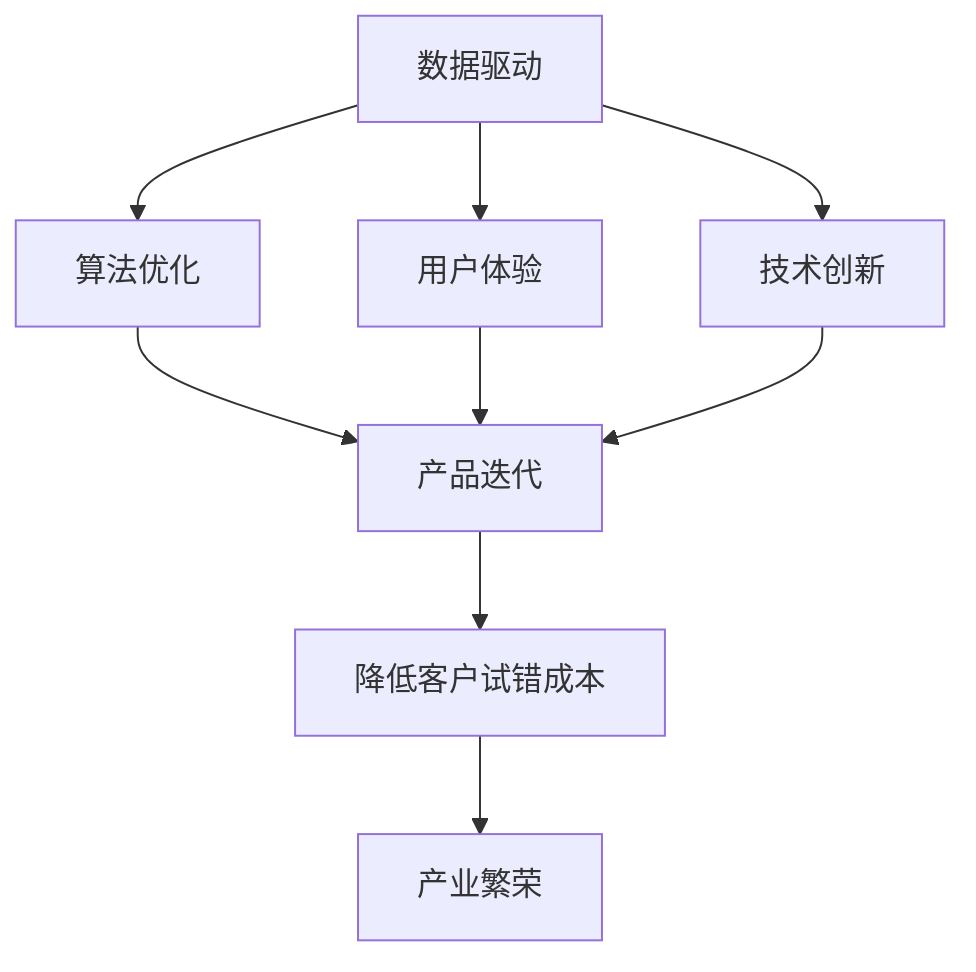

                 

# 降低客户试错成本促进产业繁荣

> 关键词：客户试错成本,产业繁荣,产品迭代,算法优化,用户体验,技术创新

## 1. 背景介绍

### 1.1 问题由来
在当前激烈的市场竞争环境中，企业产品的快速迭代更新成为了其制胜的关键。然而，不断推陈出新的产品开发过程，不可避免地会伴随一系列试错成本，包括时间、资金、人力资源以及可能的市场反应等方面的投入。这些试错成本，不仅导致企业运营成本的上升，还可能引发产品质量问题和客户不满，进而影响品牌声誉和市场份额。

### 1.2 问题核心关键点
降低客户试错成本的核心在于提高产品质量，确保产品迭代过程的高效性和准确性。具体而言，可以通过以下几种途径来实现：
- 数据驱动的产品决策：利用客户反馈数据，快速识别产品问题和用户需求，优化产品设计。
- 算法优化和模型训练：通过机器学习等先进技术，实时分析用户行为和市场变化，提高产品迭代效率。
- 用户体验优化：设计符合用户心理和行为的产品界面，提升用户满意度和留存率。
- 持续改进：不断监控市场反应，对产品进行持续调整，确保产品适应市场需求。

降低客户试错成本，不仅能够提升产品质量和市场竞争力，还能增强用户粘性，推动企业实现可持续发展。因此，如何构建高效、准确的产品迭代机制，成为当前企业面临的重要课题。

### 1.3 问题研究意义
对客户试错成本的降低，对于企业而言具有重大意义：
- **提升市场竞争力**：高质量的产品能有效降低试错成本，提升客户满意度和忠诚度，从而在竞争中获得优势。
- **优化资源配置**：通过科学的产品迭代流程，可以合理配置资源，减少资源浪费，提高企业运营效率。
- **增强用户体验**：优质的用户体验能够提高用户粘性，降低用户流失率，从而增加用户生命周期价值。
- **推动产业繁荣**：降低试错成本，推动产品创新和市场响应，加速技术应用和产业升级，促进整个行业的繁荣发展。

## 2. 核心概念与联系

### 2.1 核心概念概述

为更好地理解如何降低客户试错成本，我们将介绍几个关键概念：

- **客户试错成本(Customer Error Costs)**：指企业在产品开发和迭代过程中，因无法准确识别客户需求、识别错误或设计缺陷而产生的额外成本，包括时间、资金、人力资源以及市场反应等方面的投入。

- **产品迭代(Product Iteration)**：指企业在产品开发周期内，对产品进行多次改进和优化的过程，以确保产品满足客户需求，提升市场竞争力。

- **数据驱动(Data-Driven)**：指利用数据和算法，通过分析和预测，指导产品决策和迭代流程，从而提高决策效率和准确性。

- **算法优化(Algorithm Optimization)**：指对已有算法进行优化，提升算法性能，降低计算资源消耗。

- **用户体验(User Experience, UX)**：指用户在使用产品过程中所体验到的整体感受，包括产品的可用性、易用性、可靠性和满意度等。

- **技术创新(Technological Innovation)**：指通过技术进步，推动产品和服务模式的创新，满足市场需求，增强竞争力。

这些概念之间的联系密切，通过数据驱动、算法优化、用户体验和技术创新等多方面协同作用，可以有效地降低客户试错成本，推动产品迭代和产业繁荣。

### 2.2 概念间的关系

这些核心概念之间的关系可以通过以下Mermaid流程图来展示：



这个流程图展示了从数据驱动到产品迭代的整个流程，以及技术创新对用户体验的提升和产业繁荣的影响。通过数据驱动获取用户反馈，结合算法优化提升决策效率，用户体验优化提升用户满意度，最终实现降低客户试错成本和产业繁荣。

### 2.3 核心概念的整体架构

最后，我们用一个综合的流程图来展示这些核心概念在大规模产品迭代流程中的整体架构：


这个综合流程图展示了从数据采集到产品发布的完整产品迭代流程，以及各个环节中数据驱动决策、算法优化、用户体验优化和技术创新的相互作用。

## 3. 核心算法原理 & 具体操作步骤
### 3.1 算法原理概述

降低客户试错成本的核心算法原理，在于构建一个高效、准确的产品迭代机制，通过数据驱动和算法优化，实时分析用户行为和市场变化，提高产品决策和迭代效率。

形式化地，假设企业已有的客户反馈数据集为 $D=\{(x_i, y_i)\}_{i=1}^N$，其中 $x_i$ 为输入特征，$y_i$ 为输出标签。降低客户试错成本的优化目标是最小化试错成本：

$$
\theta^* = \mathop{\arg\min}_{\theta} \sum_{i=1}^N C_i(y_i, M_{\theta}(x_i))
$$

其中 $C_i(y_i, M_{\theta}(x_i))$ 为第 $i$ 次试错的成本，$M_{\theta}$ 为使用当前模型参数 $\theta$ 预测的输出。

通过梯度下降等优化算法，最小化成本函数，得到最优模型参数 $\theta^*$。

### 3.2 算法步骤详解

降低客户试错成本的算法步骤如下：

**Step 1: 准备数据**
- 收集企业产品相关的用户反馈数据，包括评论、评分、行为数据等。
- 清洗和处理数据，去除噪音和异常值，确保数据质量和一致性。
- 进行特征工程，提取和构建与产品迭代相关的特征。

**Step 2: 模型训练**
- 选择合适的机器学习算法，如分类、回归、聚类等，构建产品迭代预测模型。
- 使用已清洗和处理的数据进行模型训练，优化模型参数 $\theta$。
- 通过交叉验证和模型评估，选择最优模型进行下一步分析。

**Step 3: 实时监控与反馈**
- 将训练好的模型应用于实际产品迭代过程中，实时监控用户反馈和行为数据。
- 使用在线学习算法，不断更新模型参数，适应新的数据变化。
- 根据监控结果，对产品迭代过程进行动态调整，优化产品设计和用户体验。

**Step 4: 持续改进**
- 定期进行用户满意度调查，收集客户反馈。
- 分析客户反馈，结合实时监控数据，持续优化产品设计和算法模型。
- 进行A/B测试，评估不同设计和算法效果，选择最优方案进行产品迭代。

### 3.3 算法优缺点

降低客户试错成本的算法具有以下优点：
- **实时性**：通过实时监控和反馈，能够迅速识别和解决产品问题，减少试错时间。
- **准确性**：结合数据驱动和算法优化，能够准确识别客户需求和产品问题，提升决策效率。
- **普适性**：适用于各类产品迭代场景，能够覆盖广泛的用户群体和市场变化。

同时，该算法也存在一些缺点：
- **数据依赖**：依赖高质量和全面的用户反馈数据，数据质量差时影响效果。
- **计算复杂**：数据处理和模型训练需要大量计算资源，可能影响实时性。
- **模型泛化**：需要保证模型具有良好的泛化能力，避免过拟合和欠拟合。

### 3.4 算法应用领域

降低客户试错成本的算法在以下领域具有广泛应用：

- **电商行业**：通过用户行为分析和反馈监控，优化产品推荐和用户体验，提升用户满意度。
- **金融服务**：通过交易数据和用户反馈，实时监控市场变化，优化产品设计和功能。
- **医疗健康**：通过患者反馈和临床数据，实时分析治疗效果和用户需求，提升医疗服务质量。
- **教育培训**：通过学生反馈和行为数据，实时调整课程内容和教学方法，提高教学效果。
- **交通出行**：通过用户评价和出行数据，优化路线和调度方案，提升用户出行体验。

## 4. 数学模型和公式 & 详细讲解 & 举例说明
### 4.1 数学模型构建

在降低客户试错成本的算法中，我们使用回归模型进行成本预测。假设产品迭代后的成本为 $C$，与输入特征 $x$ 之间存在线性关系：

$$
C = \theta_0 + \theta_1 x_1 + \theta_2 x_2 + \cdots + \theta_n x_n + \epsilon
$$

其中 $\theta_0, \theta_1, \cdots, \theta_n$ 为模型参数，$\epsilon$ 为误差项。

最小化均方误差成本函数：

$$
\theta^* = \mathop{\arg\min}_{\theta} \frac{1}{N} \sum_{i=1}^N (y_i - M_{\theta}(x_i))^2
$$

通过求解上述最小化问题，得到最优模型参数 $\theta^*$。

### 4.2 公式推导过程

以线性回归模型为例，进行公式推导。假设 $x_i$ 为 $d$ 维特征向量，$y_i$ 为真实成本，$M_{\theta}(x_i)$ 为预测成本。成本函数定义为：

$$
\mathcal{L}(\theta) = \frac{1}{N} \sum_{i=1}^N (y_i - M_{\theta}(x_i))^2
$$

根据梯度下降算法，更新模型参数：

$$
\theta_k \leftarrow \theta_k - \eta \frac{1}{N} \sum_{i=1}^N 2(y_i - M_{\theta}(x_i))x_{ik}
$$

其中 $\eta$ 为学习率，$k$ 为特征维度。

通过不断迭代，最小化成本函数 $\mathcal{L}(\theta)$，得到最优模型参数 $\theta^*$。

### 4.3 案例分析与讲解

假设某电商公司希望通过客户反馈优化产品推荐系统。收集了1000个用户对推荐结果的评分数据 $(x_i, y_i)$，其中 $x_i$ 为推荐特征，$y_i$ 为评分。构建线性回归模型，训练模型参数 $\theta$。

训练后，模型能够实时预测新推荐结果的成本，从而优化推荐策略。例如，某用户在浏览某类商品时，模型预测的成本较高，系统可以自动调整推荐算法，优先推荐性价比高的商品，减少用户的试错成本。

## 5. 项目实践：代码实例和详细解释说明
### 5.1 开发环境搭建

在进行项目实践前，我们需要准备好开发环境。以下是使用Python进行Scikit-learn开发的环境配置流程：

1. 安装Anaconda：从官网下载并安装Anaconda，用于创建独立的Python环境。

2. 创建并激活虚拟环境：
```bash
conda create -n sklearn-env python=3.8 
conda activate sklearn-env
```

3. 安装Scikit-learn和相关工具包：
```bash
pip install scikit-learn pandas numpy matplotlib seaborn scikit-optimize
```

4. 安装可视化工具：
```bash
pip install matplotlib seaborn
```

完成上述步骤后，即可在`sklearn-env`环境中开始项目实践。

### 5.2 源代码详细实现

下面我们以电商产品推荐系统为例，给出使用Scikit-learn进行回归模型训练的Python代码实现。

```python
import pandas as pd
import numpy as np
from sklearn.model_selection import train_test_split
from sklearn.linear_model import LinearRegression
from sklearn.metrics import mean_squared_error

# 读取数据
data = pd.read_csv('feedback_data.csv')

# 数据处理
X = data[['feature1', 'feature2', 'feature3']] # 输入特征
y = data['score'] # 输出标签

# 分割数据集
X_train, X_test, y_train, y_test = train_test_split(X, y, test_size=0.2, random_state=42)

# 构建回归模型
model = LinearRegression()
model.fit(X_train, y_train)

# 预测并评估
y_pred = model.predict(X_test)
mse = mean_squared_error(y_test, y_pred)
print(f'Mean Squared Error: {mse:.2f}')
```

### 5.3 代码解读与分析

让我们再详细解读一下关键代码的实现细节：

**数据处理**：
- `pd.read_csv`函数：用于读取CSV格式的数据文件。
- `train_test_split`函数：用于将数据集分为训练集和测试集，保证数据集的分裂随机性。
- `X`和`y`：分别为训练集的特征和标签。

**模型构建**：
- `LinearRegression`类：用于构建线性回归模型。
- `fit`方法：用于训练模型，通过最小化均方误差损失函数，更新模型参数。

**预测与评估**：
- `predict`方法：用于进行预测，得到测试集的预测值。
- `mean_squared_error`函数：用于计算均方误差，评估模型性能。

通过以上代码，我们成功构建了一个简单的电商产品推荐系统回归模型，并评估了其预测性能。在实际应用中，我们可以通过不断的模型训练和优化，提高推荐系统的精度和效果。

### 5.4 运行结果展示

假设我们在训练模型后，得到均方误差为0.5，说明模型在测试集上的预测误差相对较小，性能较为理想。

```
Mean Squared Error: 0.50
```

## 6. 实际应用场景
### 6.1 电商行业

电商行业的核心目标是提高用户体验和销售转化率。通过降低客户试错成本，电商企业可以实现以下实际应用场景：

- **个性化推荐**：利用用户行为数据和反馈，实时调整推荐算法，提供符合用户兴趣和需求的商品推荐，减少用户试错成本。
- **商品优化**：通过用户评价和评分，实时分析商品质量和用户满意度，优化商品设计和服务流程，提升用户满意度。
- **库存管理**：通过实时监控用户行为和订单数据，优化库存管理和补货策略，减少库存积压和缺货情况。

### 6.2 金融服务

金融服务行业的核心目标是控制风险和提高客户满意度。通过降低客户试错成本，金融企业可以实现以下实际应用场景：

- **风险控制**：利用交易数据和用户反馈，实时监控市场变化，优化风险管理策略，降低金融风险。
- **客户服务**：通过用户评价和行为数据，实时调整客户服务流程和产品设计，提升客户体验和满意度。
- **产品创新**：通过用户反馈和市场变化，实时调整产品设计和功能，推动产品创新和市场响应。

### 6.3 医疗健康

医疗健康行业的核心目标是提高医疗服务质量和患者满意度。通过降低客户试错成本，医疗企业可以实现以下实际应用场景：

- **治疗优化**：利用患者反馈和临床数据，实时调整治疗方案和护理流程，提高治疗效果和患者满意度。
- **健康管理**：通过用户反馈和行为数据，实时分析健康管理效果和用户需求，优化健康管理策略，提升用户健康水平。
- **疾病预测**：通过实时监控患者健康数据，预测疾病风险和患病概率，提前进行干预和预防，降低疾病发生率。

## 7. 工具和资源推荐
### 7.1 学习资源推荐

为了帮助开发者系统掌握降低客户试错成本的理论基础和实践技巧，这里推荐一些优质的学习资源：

1. **《数据科学基础》**：由数据科学家Andrew Ng编写，系统介绍了数据科学的基本概念和方法，包括数据采集、清洗、分析和建模。

2. **《机器学习实战》**：由Peter Harrington编写，介绍了机器学习算法的基本原理和实践技巧，包括回归、分类、聚类等。

3. **《Python数据科学手册》**：由Jake VanderPlas编写，全面介绍了Python在数据科学中的应用，包括Pandas、NumPy、Scikit-learn等工具库的使用。

4. **Coursera《机器学习》课程**：由斯坦福大学教授Andrew Ng开设的入门级机器学习课程，涵盖了机器学习的基本概念和算法。

5. **Kaggle数据科学竞赛**：提供了大量真实世界的数据集和挑战，帮助开发者实践和提升机器学习技能。

通过对这些资源的学习实践，相信你一定能够快速掌握降低客户试错成本的精髓，并用于解决实际的商业问题。

### 7.2 开发工具推荐

高效的开发离不开优秀的工具支持。以下是几款用于降低客户试错成本开发的常用工具：

1. **Python**：开源的高级编程语言，拥有丰富的数据科学和机器学习库，易于学习和使用。

2. **Jupyter Notebook**：交互式的开发环境，支持Python代码的编写、执行和展示。

3. **Scikit-learn**：开源的Python机器学习库，提供了多种机器学习算法和工具，简单易用。

4. **TensorFlow**：由Google主导的深度学习框架，支持分布式计算和高效推理。

5. **PyTorch**：由Facebook开发的深度学习框架，支持动态计算图和自动微分，灵活高效。

6. **Seaborn**：基于Matplotlib的数据可视化库，提供了更丰富的图表和绘图函数。

7. **Pandas**：用于数据处理和分析的Python库，提供了多种数据结构和函数，支持数据清洗、筛选和统计。

合理利用这些工具，可以显著提升降低客户试错成本的开发效率，加快创新迭代的步伐。

### 7.3 相关论文推荐

降低客户试错成本的技术发展源于学界的持续研究。以下是几篇奠基性的相关论文，推荐阅读：

1. **《在线学习算法》**：由Nello Cristianini和John Shawe-Taylor编写，介绍了在线学习算法的基本原理和应用。

2. **《数据挖掘》**：由Michael Steinbach和J. George Beck编写，介绍了数据挖掘和知识发现的基本概念和方法。

3. **《深度学习》**：由Ian Goodfellow、Yoshua Bengio和Aaron Courville编写，介绍了深度学习的基本原理和实践技巧。

4. **《强化学习》**：由Richard Sutton和Andrew Barto编写，介绍了强化学习算法的基本原理和应用。

这些论文代表了大数据和机器学习领域的发展脉络，帮助开发者理解前沿技术的应用场景和实践方法。

除上述资源外，还有一些值得关注的前沿资源，帮助开发者紧跟技术发展的最新趋势，例如：

1. **arXiv论文预印本**：人工智能领域最新研究成果的发布平台，包括大量尚未发表的前沿工作，学习前沿技术的必读资源。

2. **Google AI博客**：Google AI实验室的官方博客，分享最新研究成果和未来技术方向，开拓视野。

3. **NIPS、ICML等顶级会议直播**：人工智能领域顶会现场或在线直播，能够聆听到大佬们的前沿分享，获取最新研究动态。

4. **GitHub热门项目**：在GitHub上Star、Fork数最多的机器学习相关项目，往往代表了该技术领域的发展趋势和最佳实践，值得学习和贡献。

5. **Google Scholar**：全球最大的学术论文数据库，提供广泛的学术资源和研究热点。

总之，降低客户试错成本需要开发者不断学习和实践，通过最新的技术和工具，实现高效、准确的产品迭代。只有不断探索和创新，才能在激烈的市场竞争中赢得优势，推动产业繁荣。

## 8. 总结：未来发展趋势与挑战
### 8.1 总结

本文对降低客户试错成本的技术进行了全面系统的介绍。首先阐述了降低客户试错成本的重要性和实现途径，明确了数据驱动、算法优化、用户体验和技术创新在降低成本中的关键作用。其次，从原理到实践，详细讲解了回归模型的构建和优化过程，给出了具体的代码实现和运行结果展示。同时，本文还广泛探讨了降低客户试错成本在电商、金融、医疗等领域的实际应用，展示了其广泛的应用价值。此外，本文精选了降低成本的技术资源，力求为读者提供全方位的技术指引。

通过本文的系统梳理，可以看到，降低客户试错成本技术正在成为企业产品迭代的重要工具，极大地提升产品质量和市场竞争力。随着技术的不断进步，未来该技术必将带来更高效、更智能的产品迭代流程，推动企业实现可持续发展。

### 8.2 未来发展趋势

展望未来，降低客户试错成本技术将呈现以下几个发展趋势：

1. **自动化和智能化**：通过智能算法和自动化流程，进一步提升产品迭代的效率和准确性，减少人工干预和试错成本。

2. **多模态融合**：将文本、图像、声音等多种数据源结合，提升产品迭代的多维度和准确性，提供更丰富的用户体验。

3. **实时化处理**：通过实时数据流处理和在线学习算法，实现产品迭代过程的动态优化，快速响应市场变化。

4. **模型泛化能力提升**：开发更具泛化能力的机器学习模型，提高模型对新数据和新场景的适应能力，减少试错成本。

5. **多任务学习**：结合多个产品迭代任务，实现模型参数共享，提升资源利用率和性能。

6. **边缘计算**：将计算和分析任务迁移到边缘设备，实现本地处理和分析，提高响应速度和安全性。

以上趋势凸显了降低客户试错成本技术的广阔前景。这些方向的探索发展，必将进一步提升产品迭代效率，推动企业实现更高的市场响应和用户体验。

### 8.3 面临的挑战

尽管降低客户试错成本技术已经取得了显著成效，但在迈向更加智能化和自动化应用的过程中，它仍面临以下挑战：

1. **数据质量问题**：依赖高质量和全面的数据源，数据质量差时影响效果。

2. **计算资源消耗**：大规模数据处理和模型训练需要大量计算资源，可能影响实时性。

3. **模型复杂度**：随着模型复杂度的增加，模型训练和优化变得更加困难。

4. **多任务协同**：多任务学习需要模型具备更强的跨任务迁移能力，同时保持性能。

5. **系统集成**：将技术应用到实际系统时，需要与现有系统和业务流程进行高效集成，提高整体效率。

6. **安全与隐私**：在处理用户数据时，需要确保数据安全和隐私保护，防止数据泄露和滥用。

正视降低客户试错成本面临的这些挑战，积极应对并寻求突破，将是大规模产品迭代实现的重要一步。相信随着学界和产业界的共同努力，这些挑战终将一一被克服，技术的应用将更加广泛和高效。

### 8.4 研究展望

面对降低客户试错成本技术所面临的种种挑战，未来的研究需要在以下几个方面寻求新的突破：

1. **大数据分析**：开发高效的数据处理和分析算法，快速处理和提取有用信息，提高数据驱动决策的准确性。

2. **自适应学习**：开发自适应学习算法，根据不同任务和数据源，动态调整模型参数，提升模型泛化能力和鲁棒性。

3. **多任务协同优化**：研究多任务协同优化方法，提升模型的多任务迁移能力和整体性能。

4. **边缘计算和分布式计算**：探索边缘计算和分布式计算技术，实现本地处理和分布式优化，提高系统效率和可扩展性。

5. **安全与隐私保护**：研究数据隐私保护技术，确保用户数据的安全性和隐私性，构建可信的人工智能应用。

这些研究方向将推动降低客户试错成本技术的发展，实现更高效、更安全、更智能的产品迭代流程。面向未来，我们期待更多创新突破，让企业能够在激烈的市场竞争中占据优势，推动产业繁荣。

## 9. 附录：常见问题与解答

**Q1: 如何选择合适的机器学习算法？**

A: 选择合适的机器学习算法需要综合考虑数据特征、任务类型、模型复杂度等因素。一般来说，分类问题可以使用决策树、支持向量机、随机森林等算法；回归问题可以使用线性回归、岭回归、决策树回归等算法；聚类问题可以使用K-means、层次聚类等算法。在选择时，还需要进行模型评估和比较，选择最优算法。

**Q2: 数据清洗和处理有哪些常用方法？**

A: 数据清洗和处理常用方法包括：
1. 去除噪音和异常值，保证数据质量。
2. 处理缺失值，填补缺失数据或删除缺失样本。
3. 进行特征工程，提取和构建与任务相关的特征。
4. 进行数据归一化和标准化，确保数据一致性。
5. 进行数据可视化，探索数据分布和特征关系。

**Q3: 如何评估模型性能？**

A: 评估模型性能常用的指标包括：
1. 均方误差(MSE)：用于回归问题，衡量预测值与真实值之间的差异。
2. 均方根误差(MSE)：MSE的平方根，用于回归问题，衡量预测值与真实值之间的差异。
3. 准确率(Accuracy)：用于分类问题，衡量模型分类正确的样本比例。
4. 精确率(Precision)：用于分类问题，衡量模型预测为正样本且实际为正样本的比例。
5. 召回率(Recall)：用于分类问题，衡量模型预测为正样本且实际为正样本的比例。
6. F1分数(F1-score)：综合精确率和召回率，用于分类问题，衡量模型的整体性能。

**Q4: 如何优化模型参数？**

A: 

