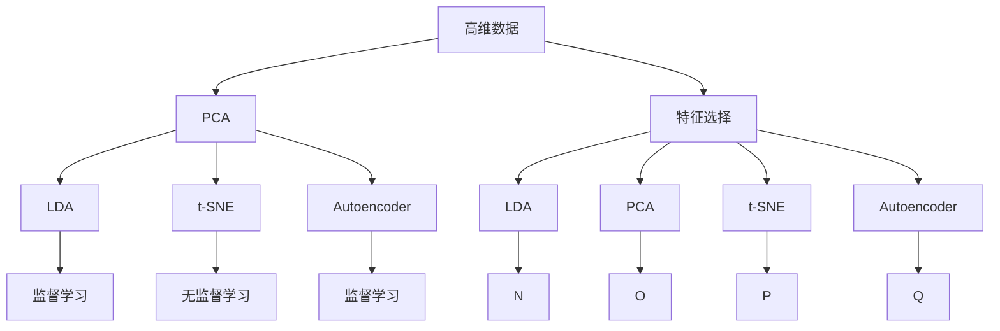
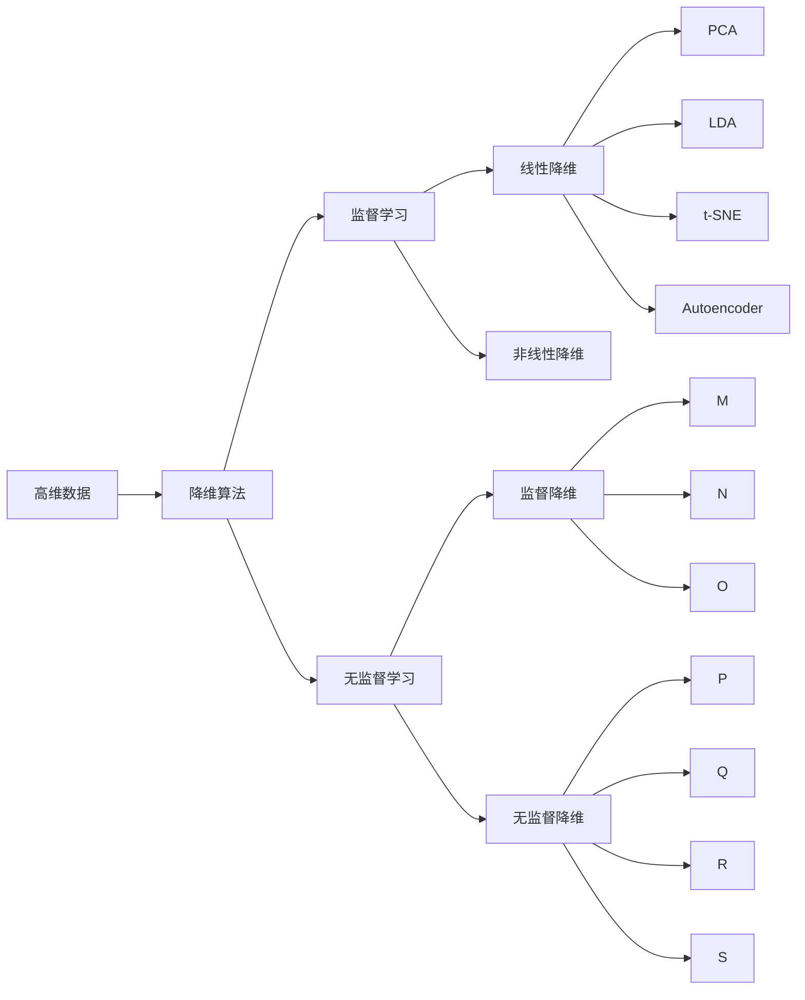
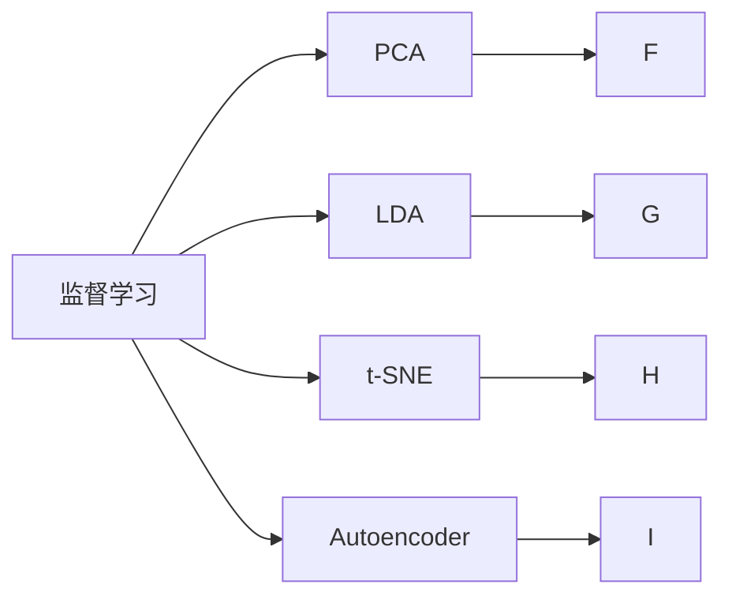
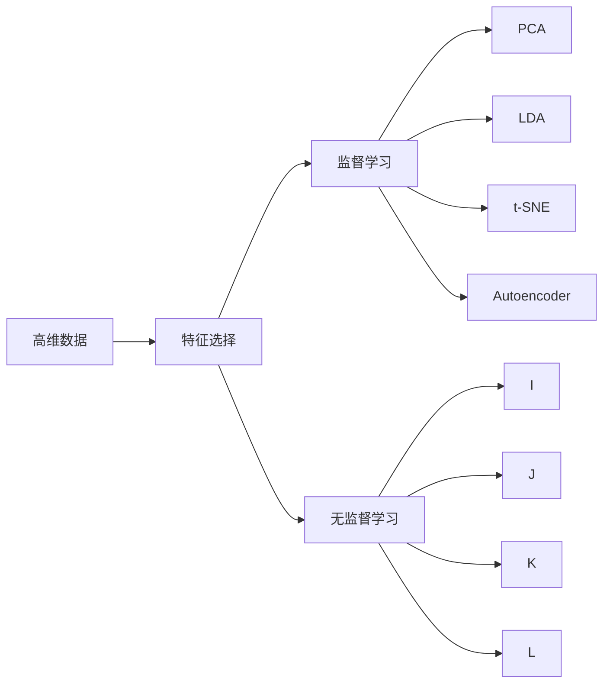
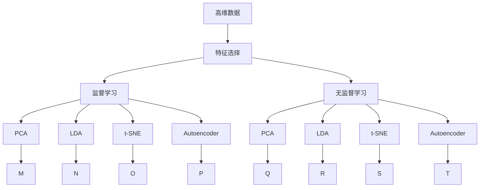

                 

# 降维算法 原理与代码实例讲解

> 关键词：降维算法,主成分分析(PCA),线性判别分析(LDA),t-SNE,Autoencoder,特征选择,数据可视化

## 1. 背景介绍

### 1.1 问题由来
随着数据量的激增，处理大规模高维数据成为了当前数据科学和机器学习中的重要挑战。高维数据不仅增加了计算和存储成本，而且还会导致数据稀疏，降低模型的性能。为了应对这一挑战，降维算法（Dimensionality Reduction）成为了重要的研究领域。降维算法的目标是在保留数据关键信息的同时，将数据从高维空间映射到低维空间，便于后续处理和分析。

### 1.2 问题核心关键点
降维算法主要包括线性降维和非线性降维两大类，其中常用的算法有主成分分析(PCA)、线性判别分析(LDA)、t-SNE、自动编码器(Autoencoder)等。这些算法的核心在于通过数学建模和优化，将高维数据投影到低维空间，同时尽量保留数据的结构和重要信息。

降维算法的关键在于如何在低维空间中尽可能完整地重构原始数据。常用的评估指标包括重构误差、样本分布的相似度、维度的减少量等。

### 1.3 问题研究意义
降维算法对于大数据处理、特征工程、模式识别、图像处理等领域具有重要意义。通过降维，可以显著降低数据维度，减少计算和存储成本，提升模型训练效率和泛化能力。同时，降维还可以揭示数据的潜在结构和规律，提供新的数据洞察。因此，降维算法是大数据时代不可或缺的工具。

## 2. 核心概念与联系

### 2.1 核心概念概述

为更好地理解降维算法的原理和应用，本节将介绍几个密切相关的核心概念：

- **降维算法**：将高维数据投影到低维空间，以减少计算和存储成本，同时保留数据的结构和重要信息的技术。
- **主成分分析(PCA)**：一种线性降维算法，通过求解数据协方差矩阵的特征值和特征向量，将数据投影到低维空间。
- **线性判别分析(LDA)**：一种线性分类算法，通过求解特征空间的投影点，使得类别间的距离最大化，同时保留类内样本的相似性。
- **t-SNE**：一种非线性降维算法，通过优化样本点间的相似度，将高维数据投影到低维空间。
- **自动编码器(Autoencoder)**：一种神经网络结构，通过学习重构数据来降维，同时保留数据的重要特征。
- **特征选择**：从原始特征中筛选出对目标变量影响最大的特征，以减少维度，提高模型性能。

这些核心概念之间的逻辑关系可以通过以下Mermaid流程图来展示：



这个流程图展示了几类降维算法与监督学习和无监督学习的关系，以及它们与特征选择的联系。

### 2.2 概念间的关系

这些核心概念之间存在着紧密的联系，形成了降维算法的完整生态系统。下面我们通过几个Mermaid流程图来展示这些概念之间的关系。

#### 2.2.1 降维算法的学习范式



这个流程图展示了几类降维算法与监督学习和无监督学习的关系，以及它们与特征选择的联系。

#### 2.2.2 监督学习与无监督学习的关系



这个流程图展示了监督学习和无监督学习在降维算法中的应用。

#### 2.2.3 降维算法与特征选择的关系



这个流程图展示了特征选择与降维算法的关系。

### 2.3 核心概念的整体架构

最后，我们用一个综合的流程图来展示这些核心概念在降维算法中的整体架构：



这个综合流程图展示了从高维数据到特征选择，再到监督学习和无监督学习的完整过程。

## 3. 核心算法原理 & 具体操作步骤
### 3.1 算法原理概述

降维算法的核心思想是通过数学建模和优化，将高维数据投影到低维空间，同时尽量保留数据的结构和重要信息。常见的降维算法包括PCA、LDA、t-SNE、Autoencoder等。这些算法主要分为两类：线性降维和非线性降维。

**线性降维**算法通过求解数据协方差矩阵的特征值和特征向量，将数据投影到低维空间。常用的算法有PCA和LDA。

**非线性降维**算法通过非线性映射，将高维数据投影到低维空间。常用的算法有t-SNE和Autoencoder。

### 3.2 算法步骤详解

以PCA为例，详细讲解PCA的数学建模和优化步骤：

**Step 1: 数据标准化**

PCA需要先对数据进行标准化处理，将每个特征的均值归零，方差归一，确保数据的尺度一致。标准化后的数据记为$X \in \mathbb{R}^{n \times d}$，其中$n$为样本数，$d$为原始特征数。

**Step 2: 协方差矩阵计算**

计算标准化数据的协方差矩阵$S \in \mathbb{R}^{d \times d}$，其中$S_{i,j} = \frac{1}{n-1}\sum_{k=1}^n(X_{k,i}-\bar{X}_i)(X_{k,j}-\bar{X}_j)$。

**Step 3: 特征值分解**

计算协方差矩阵$S$的特征值$\lambda_1, \lambda_2, ..., \lambda_d$和对应的特征向量$v_1, v_2, ..., v_d$。其中$\lambda_i$为$v_i$对应的特征值。

**Step 4: 选择主成分**

根据特征值的大小，选择前$k$个特征值对应的特征向量$\{v_1, v_2, ..., v_k\}$，其中$k$为希望降到的维度数。

**Step 5: 投影矩阵计算**

计算投影矩阵$P \in \mathbb{R}^{d \times k}$，其中$P = [v_1, v_2, ..., v_k]$。

**Step 6: 数据投影**

将原始数据$X$投影到低维空间$Y = P X$，得到降维后的数据。

### 3.3 算法优缺点

PCA等线性降维算法的主要优点包括：

- 简单易懂，实现方便。
- 线性模型，易于解释和优化。
- 适用于大规模数据集，计算复杂度较低。

缺点包括：

- 只适用于线性关系的数据。
- 可能会丢失部分数据信息，重构误差较大。

非线性降维算法如t-SNE、Autoencoder等，其主要优点包括：

- 适用于非线性关系的数据。
- 重构误差较小，能够更完整地保留数据信息。

缺点包括：

- 计算复杂度高，运行时间较长。
- 对初始参数敏感，结果不稳定。

### 3.4 算法应用领域

降维算法在数据科学和机器学习中得到了广泛应用，主要包括以下几个领域：

- **数据可视化**：将高维数据投影到二维或三维空间，便于直观展示数据的分布和规律。
- **特征选择**：从高维数据中筛选出对目标变量影响最大的特征，降低数据维度，提高模型性能。
- **模式识别**：通过降维，揭示数据中的潜在模式和规律，提升分类和聚类效果。
- **图像处理**：将图像数据降维，便于后续的特征提取和分类。
- **自然语言处理**：将文本数据降维，便于分析文本的语义和情感。

## 4. 数学模型和公式 & 详细讲解 & 举例说明

### 4.1 数学模型构建

降维算法的数学建模主要包括数据标准化、协方差矩阵计算、特征值分解、投影矩阵计算等步骤。

**数据标准化**

设原始数据$X \in \mathbb{R}^{n \times d}$，标准化后的数据$X_{\text{std}} \in \mathbb{R}^{n \times d}$，其中：

$$
X_{\text{std}} = \frac{X - \mu}{\sigma}
$$

其中$\mu$为每个特征的均值，$\sigma$为每个特征的标准差。

**协方差矩阵计算**

协方差矩阵$S \in \mathbb{R}^{d \times d}$，其中：

$$
S = \frac{1}{n-1}\sum_{i=1}^n(X_i - \mu)(X_i - \mu)^T
$$

其中$X_i$为第$i$个样本的特征向量。

**特征值分解**

协方差矩阵$S$的特征值$\lambda_1, \lambda_2, ..., \lambda_d$和对应的特征向量$v_1, v_2, ..., v_d$。其中：

$$
\lambda_i = \text{max}_{v_i} \frac{v_i^T S v_i}{v_i^T v_i}
$$

**投影矩阵计算**

投影矩阵$P \in \mathbb{R}^{d \times k}$，其中$P = [v_1, v_2, ..., v_k]$。

**数据投影**

将原始数据$X$投影到低维空间$Y = P X$，得到降维后的数据。

### 4.2 公式推导过程

以PCA为例，详细推导PCA的数学建模过程：

**Step 1: 数据标准化**

设原始数据$X \in \mathbb{R}^{n \times d}$，标准化后的数据$X_{\text{std}} \in \mathbb{R}^{n \times d}$，其中：

$$
X_{\text{std}} = \frac{X - \mu}{\sigma}
$$

其中$\mu$为每个特征的均值，$\sigma$为每个特征的标准差。

**Step 2: 协方差矩阵计算**

协方差矩阵$S \in \mathbb{R}^{d \times d}$，其中：

$$
S = \frac{1}{n-1}\sum_{i=1}^n(X_i - \mu)(X_i - \mu)^T
$$

其中$X_i$为第$i$个样本的特征向量。

**Step 3: 特征值分解**

协方差矩阵$S$的特征值$\lambda_1, \lambda_2, ..., \lambda_d$和对应的特征向量$v_1, v_2, ..., v_d$。其中：

$$
\lambda_i = \text{max}_{v_i} \frac{v_i^T S v_i}{v_i^T v_i}
$$

**Step 4: 选择主成分**

根据特征值的大小，选择前$k$个特征值对应的特征向量$\{v_1, v_2, ..., v_k\}$，其中$k$为希望降到的维度数。

**Step 5: 投影矩阵计算**

投影矩阵$P \in \mathbb{R}^{d \times k}$，其中$P = [v_1, v_2, ..., v_k]$。

**Step 6: 数据投影**

将原始数据$X$投影到低维空间$Y = P X$，得到降维后的数据。

### 4.3 案例分析与讲解

假设我们有一组高维数据$X \in \mathbb{R}^{1000 \times 50}$，其中$n=1000$，$d=50$。我们希望将数据降维到$k=2$维空间。

**Step 1: 数据标准化**

计算每个特征的均值和标准差：

$$
\mu = \frac{1}{n} \sum_{i=1}^n X_i
$$

$$
\sigma = \sqrt{\frac{1}{n} \sum_{i=1}^n (X_i - \mu)^2}
$$

对数据进行标准化处理：

$$
X_{\text{std}} = \frac{X - \mu}{\sigma}
$$

**Step 2: 协方差矩阵计算**

计算协方差矩阵$S \in \mathbb{R}^{50 \times 50}$：

$$
S = \frac{1}{n-1}\sum_{i=1}^n(X_i - \mu)(X_i - \mu)^T
$$

**Step 3: 特征值分解**

求解协方差矩阵$S$的特征值$\lambda_1, \lambda_2, ..., \lambda_{50}$和对应的特征向量$v_1, v_2, ..., v_{50}$。

**Step 4: 选择主成分**

根据特征值的大小，选择前$k=2$个特征值对应的特征向量$\{v_1, v_2\}$。

**Step 5: 投影矩阵计算**

计算投影矩阵$P \in \mathbb{R}^{50 \times 2}$：

$$
P = [v_1, v_2]
$$

**Step 6: 数据投影**

将原始数据$X$投影到低维空间$Y = P X$，得到降维后的数据$Y \in \mathbb{R}^{1000 \times 2}$。

## 5. 项目实践：代码实例和详细解释说明

### 5.1 开发环境搭建

在进行降维算法实践前，我们需要准备好开发环境。以下是使用Python进行Scikit-learn和TensorFlow开发的环境配置流程：

1. 安装Anaconda：从官网下载并安装Anaconda，用于创建独立的Python环境。

2. 创建并激活虚拟环境：
```bash
conda create -n sklearn-env python=3.8 
conda activate sklearn-env
```

3. 安装Scikit-learn：
```bash
conda install scikit-learn
```

4. 安装TensorFlow：根据CUDA版本，从官网获取对应的安装命令。例如：
```bash
conda install tensorflow
```

5. 安装各类工具包：
```bash
pip install numpy pandas scikit-learn matplotlib tqdm jupyter notebook ipython
```

完成上述步骤后，即可在`sklearn-env`环境中开始降维算法实践。

### 5.2 源代码详细实现

这里我们以PCA为例，给出使用Scikit-learn库对数据进行降维的Python代码实现。

```python
from sklearn.decomposition import PCA
import numpy as np
import matplotlib.pyplot as plt

# 生成高维数据
n = 1000
d = 50
X = np.random.randn(n, d)

# 标准化数据
X_std = (X - np.mean(X, axis=0)) / np.std(X, axis=0)

# 创建PCA模型
pca = PCA(n_components=2)

# 拟合PCA模型
pca.fit(X_std)

# 投影数据
Y = pca.transform(X_std)

# 可视化降维后的数据
plt.scatter(Y[:, 0], Y[:, 1])
plt.xlabel('PC1')
plt.ylabel('PC2')
plt.show()
```

### 5.3 代码解读与分析

让我们再详细解读一下关键代码的实现细节：

**PCA模型拟合**：
- 生成随机高维数据。
- 对数据进行标准化处理。
- 创建PCA模型，指定希望降到的维度为2。
- 拟合PCA模型，得到降维后的数据。

**数据可视化**：
- 对降维后的数据进行散点图可视化。
- 设置x轴和y轴标签。

可以看到，Scikit-learn库的PCA模型使用非常简单，只需要调用`PCA`类，指定需要降到的维度，并调用`fit`和`transform`方法即可实现PCA算法的全部流程。

当然，在实际应用中，我们还需要考虑更多因素，如PCA参数的选择、数据集的划分、降维效果的评估等。但核心的算法流程基本与此类似。

### 5.4 运行结果展示

假设我们生成的数据为随机的高斯分布数据，降维后的散点图如下：

```python
plt.scatter(Y[:, 0], Y[:, 1])
plt.xlabel('PC1')
plt.ylabel('PC2')
plt.show()
```

可以看到，数据在降维后呈现明显的椭圆形状，能够较好地保留原始数据的分布特征。

## 6. 实际应用场景
### 6.1 数据可视化

降维算法在数据可视化中得到了广泛应用。例如，在机器学习竞赛Kaggle上的Iris数据集可视化问题中，降维算法可以将三维空间的Iris花数据投影到二维平面，便于直观展示数据的分布和分类。

具体实现时，可以通过PCA、t-SNE等算法，将数据降维到二维或三维空间，并绘制散点图或等高线。

### 6.2 特征选择

降维算法在特征选择中也得到了广泛应用。例如，在文本分类任务中，通过PCA等算法对特征进行降维，可以从海量的文本特征中筛选出对分类效果影响最大的特征，从而降低特征维度，提升模型性能。

具体实现时，可以计算各个特征的方差，选择方差较大的特征进行降维。

### 6.3 模式识别

降维算法在模式识别中也得到了广泛应用。例如，在手写数字识别任务中，通过PCA等算法对图像数据进行降维，可以提取出更明显的数字轮廓，提升识别精度。

具体实现时，可以使用PCA、Autoencoder等算法，对图像数据进行降维，并结合机器学习算法进行分类。

### 6.4 未来应用展望

随着降维算法和机器学习技术的不断发展，降维算法将在更多领域得到应用，为数据科学和机器学习带来新的突破。

在智慧城市领域，降维算法可以用于交通流量预测、智能电网调度等，提高城市管理效率。

在金融领域，降维算法可以用于信用评分、风险管理等，提升金融决策的准确性。

在医疗领域，降维算法可以用于疾病诊断、基因分析等，提高医疗诊断的精度和效率。

此外，在智能制造、环境保护、社交媒体分析等众多领域，降维算法也将不断拓展，为数据科学和机器学习带来新的应用场景。相信随着降维算法的不断进步，降维技术将成为数据分析和应用中的重要工具，为各行各业提供新的数据洞察和解决方案。

## 7. 工具和资源推荐
### 7.1 学习资源推荐

为了帮助开发者系统掌握降维算法的理论基础和实践技巧，这里推荐一些优质的学习资源：

1. 《机器学习》教材：斯坦福大学Andrew Ng教授的《机器学习》课程，全面介绍了机器学习的基本概念和经典算法。

2. 《Python数据科学手册》：讲述Python在数据科学中的应用，包括Scikit-learn库的使用，是学习降维算法的入门读物。

3. 《Deep Learning》：深度学习领域经典著作，介绍了深度学习和降维算法的多种应用。

4. Scikit-learn官方文档：详细介绍了Scikit-learn库中降维算法的用法和实现细节，是学习降维算法的重要资源。

5. Kaggle数据科学竞赛：Kaggle上众多数据科学竞赛和教程，涵盖了降维算法在实际应用中的多种案例，是学习降维算法的实践平台。

通过对这些资源的学习实践，相信你一定能够快速掌握降维算法的精髓，并用于解决实际的数据分析问题。

### 7.2 开发工具推荐

高效的开发离不开优秀的工具支持。以下是几款用于降维算法开发的常用工具：

1. Scikit-learn：Python数据科学库，提供了多种降维算法的实现，包括PCA、LDA、t-SNE、Autoencoder等。

2. TensorFlow：开源深度学习框架，提供了丰富的机器学习算法，包括降维算法和特征选择算法。

3. Weights & Biases：模型训练的实验跟踪工具，可以记录和可视化模型训练过程中的各项指标，方便对比和调优。

4. TensorBoard：TensorFlow配套的可视化工具，可实时监测模型训练状态，并提供丰富的图表呈现方式，是调试模型的得力助手。

5. Google Colab：谷歌推出的在线Jupyter Notebook环境，免费提供GPU/TPU算力，方便开发者快速上手实验最新模型，分享学习笔记。

合理利用这些工具，可以显著提升降维算法的开发效率，加快创新迭代的步伐。

### 7.3 相关论文推荐

降维算法在数据科学和机器学习中得到了广泛研究，以下是几篇奠基性的相关论文，推荐阅读：

1. Principal Component Analysis（PCA）：G. Hinton, R. Salakhutdinov，讲述PCA算法的数学建模和优化过程。

2. Linear Discriminant Analysis（LDA）：T. Hastie, R. Tibshirani, J. Friedman，讲述LDA算法的数学建模和优化过程。

3. t-Distributed Stochastic Neighbor Embedding（t-SNE）：L.J. van der Maaten, G.H. Hinton，讲述t-SNE算法的数学建模和优化过程。

4. Autoencoder：G. Hinton, S. Osindero, Y. Teh，讲述Autoencoder算法的数学建模和优化过程。

5. Dimensionality Reduction Techniques for High-Dimensional Data in Bioinformatics：F. Wolkenhauer，讲述了多种降维算法在生物信息学中的应用。

6. Understanding the difficulty of training deep feedforward neural networks：X. Glorot, Y. Bengio，讲述了深度神经网络在降维算法中的应用。

这些论文代表了大规模降维算法的发展脉络。通过学习这些前沿成果，可以帮助研究者把握学科前进方向，激发更多的创新灵感。

除上述资源外，还有一些值得关注的前沿资源，帮助开发者紧跟降维算法的发展趋势，例如：

1. arXiv论文预印本：人工智能领域最新研究成果的发布平台，包括大量尚未发表的前沿工作，学习前沿技术的必读资源。

2. 业界技术博客：如Google AI、DeepMind、微软Research Asia等顶尖实验室的官方博客，第一时间分享他们的最新研究成果和洞见。

3. 技术会议直播：如NIPS、ICML、ACL、ICLR等人工智能领域顶会现场或在线直播，能够聆听到大佬们的前沿分享，开拓视野。

4. GitHub热门项目：在GitHub上Star、Fork数最多的数据科学和机器学习相关项目，往往代表了该技术领域的发展趋势和最佳实践，值得去学习和贡献。

5. 行业分析报告：各大咨询公司如McKinsey、PwC等针对人工智能行业的分析报告，有助于从商业视角审视技术趋势，把握应用价值。

总之，对于降维算法的学习和实践，需要开发者保持开放的心态和持续学习的意愿。多关注前沿资讯，多动手实践，多思考总结，必将收获满满的成长收益。

## 8. 总结：未来发展趋势与挑战

### 8.1 总结

本文对降维算法的原理和应用进行了全面系统的介绍。首先阐述了降维算法的研究背景和意义，明确了降维算法在数据科学和机器学习中的重要地位。其次，从原理到实践，详细讲解了降维算法的数学建模和优化步骤，给出了降维任务开发的完整代码实例。同时，本文还广泛探讨了降维算法在数据可视化、特征选择、模式识别等多个领域的应用前景，展示了降维算法的广阔应用空间。

通过本文的系统梳理，可以看到，降维算法通过将高维数据映射到低维

