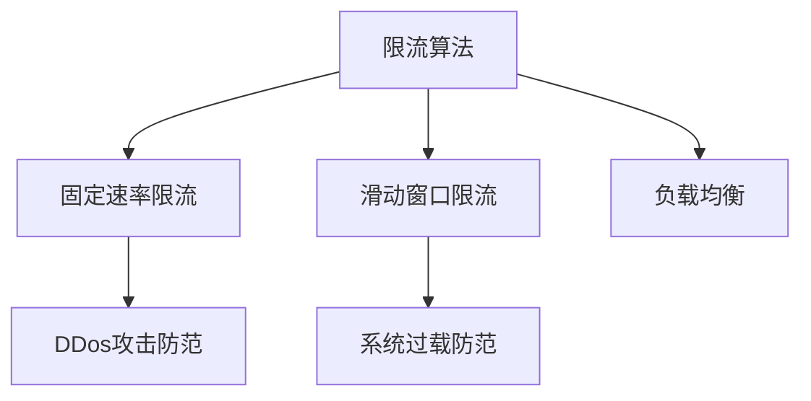
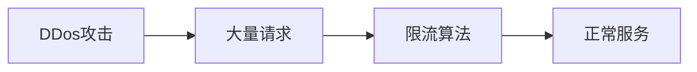
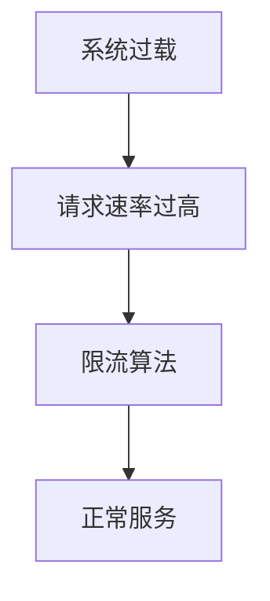
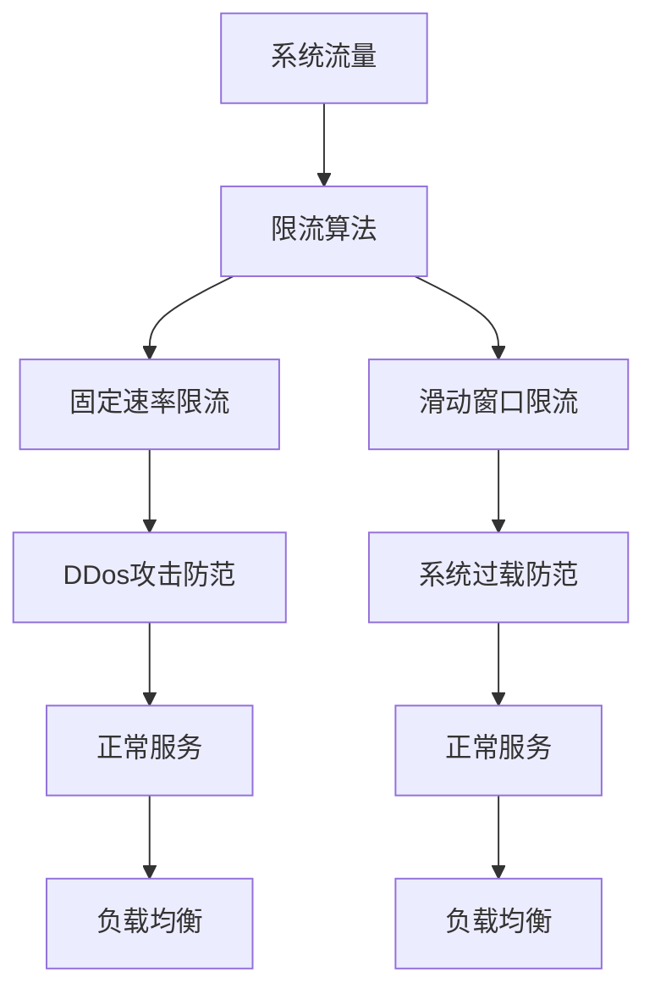

                 

# 限流：防止 DDos 攻击和系统过载

> 关键词：限流算法, 防止DDos攻击, 系统过载, 网络流量管理, 网络安全, 负载均衡, 滑动窗口, 固定速率, 动态限流

## 1. 背景介绍

### 1.1 问题由来

在网络环境中，数据流量的大小直接影响到系统性能和可用性。若数据流量超出了系统的处理能力，系统将无法正常运行，甚至发生崩溃。这种因数据流量过大而导致系统无法正常服务的情况被称为系统过载或过载（Overloading）。在极端情况下，数据流量突然大幅增加，可能是由于恶意攻击者刻意制造大量请求以使系统失效，这通常被称为分布式拒绝服务攻击（Distributed Denial of Service, DDos）攻击。

系统过载和DDos攻击不仅影响网站的用户体验，更可能导致严重的经济损失。因此，在系统设计和开发阶段，预防和缓解系统过载、防止DDos攻击变得尤为重要。

### 1.2 问题核心关键点

系统过载和DDos攻击的核心关键点在于对系统流量的控制。限流算法（Throttling Algorithm）是一种常用的解决方式。限流算法通过控制单位时间内的数据流量，避免流量过大对系统造成损害，同时防止DDos攻击。限流算法的关键在于选择合适的限流策略和限流参数，在保护系统稳定性的同时，最大化系统的服务效率。

## 2. 核心概念与联系

### 2.1 核心概念概述

为更好地理解限流算法，本节将介绍几个密切相关的核心概念：

- **限流算法（Throttling Algorithm）**：一种用于控制单位时间内的数据流量，防止系统过载和DDos攻击的技术。限流算法通常分为固定速率限流和滑动窗口限流两种类型。

- **固定速率限流（Fixed Rate Throttling）**：在固定的时间窗口内，控制输入请求的数量，确保速率不超过设定值。

- **滑动窗口限流（Sliding Window Throttling）**：根据请求到达的频率，动态调整限流窗口大小，以适应不同的流量情况。

- **DDos攻击（Distributed Denial of Service Attack）**：一种恶意攻击方式，通过大量伪造请求耗尽系统资源，使服务无法正常运行。

- **系统过载（System Overloading）**：由于数据流量过大，系统无法处理正常请求，导致服务响应延迟或失败。

- **负载均衡（Load Balancing）**：将负载分散到多个节点上进行处理，提高系统吞吐量和可用性。

这些核心概念之间的逻辑关系可以通过以下Mermaid流程图来展示：



这个流程图展示了大语言模型微调过程中各个核心概念的关系和作用：

1. 限流算法通过控制输入速率和窗口大小，防止系统过载和DDos攻击。
2. 固定速率限流和滑动窗口限流是限流算法的两种主要方式。
3. DDos攻击和系统过载是限流算法需要防范的主要威胁。
4. 负载均衡通过分散处理请求，提高系统的吞吐量和可用性。

### 2.2 概念间的关系

这些核心概念之间存在着紧密的联系，形成了限流算法的完整生态系统。下面我们通过几个Mermaid流程图来展示这些概念之间的关系。

#### 2.2.1 限流算法与DDos攻击



这个流程图展示了DDos攻击和限流算法的防范关系。限流算法通过限制请求速率，防止DDos攻击耗尽系统资源。

#### 2.2.2 限流算法与系统过载



这个流程图展示了系统过载和限流算法的防范关系。限流算法通过限制请求速率，避免系统过载导致服务失败。

#### 2.2.3 限流算法与负载均衡


这个流程图展示了负载均衡和限流算法的协同关系。负载均衡通过分散处理请求，限流算法通过控制请求速率，共同提高系统的稳定性和可用性。

### 2.3 核心概念的整体架构

最后，我们用一个综合的流程图来展示这些核心概念在大语言模型微调过程中的整体架构：



这个综合流程图展示了从系统流量到限流算法的整体架构：

1. 系统流量是大语言模型微调过程中需要控制的主要因素。
2. 限流算法通过固定速率限流和滑动窗口限流两种方式，控制输入请求速率。
3. 固定速率限流和滑动窗口限流分别用于防范DDos攻击和系统过载。
4. 负载均衡通过分散处理请求，提高系统的稳定性和可用性。

这些概念共同构成了限流算法的学习框架，使其能够在各种场景下发挥重要作用。通过理解这些核心概念，我们可以更好地把握限流算法的原理和优化方向。

## 3. 核心算法原理 & 具体操作步骤
### 3.1 算法原理概述

限流算法的核心原理是控制单位时间内的数据流量，避免流量过大对系统造成损害。其基本思路如下：

1. **速率控制**：对单位时间内的请求速率进行限制，确保系统的稳定性和可用性。
2. **窗口管理**：使用固定速率限流或滑动窗口限流，动态调整窗口大小，以适应不同的流量情况。
3. **算法实现**：选择合适的算法和数据结构，高效地实现限流功能。

### 3.2 算法步骤详解

限流算法的基本步骤如下：

**Step 1: 准备限流参数**
- 确定限流策略（固定速率或滑动窗口）
- 设定速率上限和窗口大小
- 初始化限流数据结构

**Step 2: 实现限流函数**
- 计算当前时间戳和周期开始时间
- 计算剩余允许请求数量
- 根据限流策略处理请求
- 更新限流数据结构

**Step 3: 输出限流结果**
- 返回限流结果（允许请求或拒绝请求）
- 记录限流日志

### 3.3 算法优缺点

固定速率限流和滑动窗口限流各有优缺点：

**固定速率限流**
- **优点**：算法简单，易于实现，适用于大部分限流场景。
- **缺点**：无法动态调整限流速率，不适用于数据流量波动较大的情况。

**滑动窗口限流**
- **优点**：根据实际流量动态调整窗口大小，更适应数据流量波动较大的情况。
- **缺点**：算法复杂，实现难度较大，需要维护多个窗口状态。

### 3.4 算法应用领域

限流算法在多个领域得到了广泛应用，包括但不限于：

- **Web应用**：限制用户的请求速率，避免恶意攻击和系统过载。
- **API服务**：保护API接口，防止DDos攻击和系统过载。
- **网络存储**：限制对网络存储系统的访问速率，保护存储资源。
- **物联网设备**：限制物联网设备的通信流量，避免网络拥塞和资源耗尽。

## 4. 数学模型和公式 & 详细讲解 & 举例说明

### 4.1 数学模型构建

以固定速率限流为例，假设限流策略为固定速率限流，速率上限为 `R`，当前时间为 `t`，周期开始时间为 `T`，则当前周期内允许请求数量为：

$$
\text{允许请求数量} = \min\left(\frac{R}{T}, N - \sum_{i=0}^{t-1} r_i\right)
$$

其中，$r_i$ 为每个周期内的请求数量。

### 4.2 公式推导过程

推导过程如下：

设周期为 `T`，速率上限为 `R`，当前时间为 `t`，当前周期内的请求数量为 `N`。根据速率限制，每个周期内的请求速率不超过 `R/T`。

设当前周期内的请求数量为 `N'`，则有：

$$
N' = \min\left(\frac{R}{T}, N - \sum_{i=0}^{t-1} r_i\right)
$$

其中，$r_i$ 为每个周期内的请求数量。

### 4.3 案例分析与讲解

以一个简单的Web应用为例，假设周期为1秒，速率上限为5个请求/秒，当前时间为2秒。则当前周期内允许请求数量为：

$$
N' = \min\left(\frac{5}{1}, 5 - 2\right) = 3
$$

因此，当前周期内允许最多3个请求。

## 5. 项目实践：代码实例和详细解释说明
### 5.1 开发环境搭建

在进行限流实践前，我们需要准备好开发环境。以下是使用Python进行项目开发的环境配置流程：

1. 安装Python：从官网下载并安装最新版本的Python，确保版本在3.6及以上。

2. 安装Flask框架：Flask是一个轻量级的Web框架，便于实现限流功能。可以通过pip安装：

```bash
pip install Flask
```

3. 安装Flask-Limiter：Flask-Limiter是一个基于Flask的限流插件，可以方便地实现限流功能。可以通过pip安装：

```bash
pip install Flask-Limiter
```

完成上述步骤后，即可在Python环境中开始限流实践。

### 5.2 源代码详细实现

下面是一个基于Flask的限流实现的示例代码：

```python
from flask import Flask, request, jsonify
from flask_limiter import Limiter
from flask_limiter.util import get_remote_address

app = Flask(__name__)

limiter = Limiter(app, key_func=get_remote_address)
limiter.limit("10/minute")(app)

@app.route('/')
def index():
    ip_address = request.remote_addr
    remaining = limiter.get_remaining(ip_address)
    if remaining <= 0:
        return jsonify({"status": "Rate limit exceeded"})
    else:
        return jsonify({"status": "OK", "remaining": remaining})

if __name__ == '__main__':
    app.run()
```

### 5.3 代码解读与分析

让我们再详细解读一下关键代码的实现细节：

**Flask和Flask-Limiter的引入**：
- Flask：轻量级Web框架，用于搭建Web应用。
- Flask-Limiter：Flask限流插件，提供限流功能的封装。

**限流策略的配置**：
- `limiter.limit("10/minute")(app)`：表示对应用进行限制，速率上限为每分钟10个请求。

**限流函数的实现**：
- `index()`函数：
  - `request.remote_addr`：获取请求IP地址。
  - `limiter.get_remaining(ip_address)`：获取当前周期内剩余的请求数量。
  - 若剩余请求数量为0，则返回`Rate limit exceeded`，否则返回`OK`和剩余请求数量。

**运行结果展示**：
- 若请求速率超过了设定值，则返回`Rate limit exceeded`。
- 若请求速率未超过设定值，则返回`OK`和剩余请求数量。

## 6. 实际应用场景
### 6.1 场景示例

以下是一些实际应用场景：

**Web应用限流**
- 对Web应用进行限流，防止恶意攻击和系统过载。例如，在登录接口处限制每秒5个请求，防止暴力破解攻击。

**API服务限流**
- 对API服务进行限流，防止DDos攻击和系统过载。例如，在支付接口处限制每分钟1000个请求，避免恶意攻击。

**网络存储限流**
- 对网络存储系统进行限流，防止数据流量过大导致存储资源耗尽。例如，限制每个用户每秒1次数据上传，确保存储系统稳定运行。

**物联网设备限流**
- 对物联网设备进行限流，避免网络拥塞和资源耗尽。例如，限制每个设备每秒1次数据传输，确保设备正常运行。

## 7. 工具和资源推荐
### 7.1 学习资源推荐

为了帮助开发者系统掌握限流算法的理论基础和实践技巧，这里推荐一些优质的学习资源：

1. **《网络流量管理：理论与实践》**：介绍网络流量管理的原理和实践，涵盖限流、负载均衡、DDos攻击防范等内容。

2. **《网络安全基础》**：讲解网络安全的基本概念和常用技术，包括限流、DDos攻击防范等内容。

3. **《分布式系统设计与实践》**：介绍分布式系统的设计原则和实践方法，涵盖负载均衡、限流等内容。

4. **《Flask官方文档》**：Flask框架的官方文档，提供了丰富的示例代码，便于实践限流功能。

5. **《Flask-Limiter官方文档》**：Flask-Limiter插件的官方文档，提供了详细的API参考和示例代码。

通过这些资源的学习实践，相信你一定能够快速掌握限流算法的精髓，并用于解决实际的系统流量控制问题。

### 7.2 开发工具推荐

高效的开发离不开优秀的工具支持。以下是几款用于限流开发的常用工具：

1. **Python**：Python是一种通用的编程语言，易于学习和使用，适用于开发限流功能。

2. **Flask框架**：轻量级的Web框架，便于实现限流功能，支持快速迭代开发。

3. **Flask-Limiter插件**：Flask限流插件，提供了丰富的限流功能，方便实现限流需求。

4. **Prometheus和Grafana**：监控工具，可以实时监测系统流量和限流效果，提供可视化的报表。

5. **Kubernetes**：容器编排工具，可以动态管理服务实例，确保限流功能的稳定性和可用性。

合理利用这些工具，可以显著提升限流功能的开发效率，加快创新迭代的步伐。

### 7.3 相关论文推荐

限流技术的发展源于学界的持续研究。以下是几篇奠基性的相关论文，推荐阅读：

1. **《网络流量管理：理论、模型与算法》**：介绍了网络流量管理的理论基础和常用算法，包括限流、负载均衡等内容。

2. **《DDos攻击检测与防御》**：介绍了DDos攻击的原理和防范技术，涵盖限流、黑名单过滤等内容。

3. **《基于滑动窗口的限流算法》**：提出了一种基于滑动窗口的限流算法，适用于数据流量波动较大的场景。

4. **《限流算法在Web应用中的应用》**：介绍了限流算法在Web应用中的实际应用，涵盖速率控制、窗口管理等内容。

这些论文代表了大语言模型微调技术的发展脉络。通过学习这些前沿成果，可以帮助研究者把握学科前进方向，激发更多的创新灵感。

除上述资源外，还有一些值得关注的前沿资源，帮助开发者紧跟限流技术的最新进展，例如：

1. **arXiv论文预印本**：人工智能领域最新研究成果的发布平台，包括大量尚未发表的前沿工作，学习前沿技术的必读资源。

2. **GitHub热门项目**：在GitHub上Star、Fork数最多的限流相关项目，往往代表了该技术领域的发展趋势和最佳实践，值得去学习和贡献。

3. **技术会议直播**：如网络安全、分布式系统等领域的顶级会议，现场或在线直播，能够聆听到大佬们的前沿分享，开拓视野。

4. **开源社区**：如Apache、Linux Foundation等开源社区，提供了丰富的限流实现和资源，值得深入学习和交流。

总之，对于限流算法的学习和实践，需要开发者保持开放的心态和持续学习的意愿。多关注前沿资讯，多动手实践，多思考总结，必将收获满满的成长收益。

## 8. 总结：未来发展趋势与挑战
### 8.1 总结

本文对限流算法进行了全面系统的介绍。首先阐述了限流算法的背景和意义，明确了限流在防止系统过载和DDos攻击中的重要性。其次，从原理到实践，详细讲解了限流算法的数学原理和关键步骤，给出了限流任务开发的完整代码实例。同时，本文还广泛探讨了限流算法在多个行业领域的应用前景，展示了限流范式的广泛价值。此外，本文精选了限流技术的各类学习资源，力求为读者提供全方位的技术指引。

通过本文的系统梳理，可以看到，限流算法通过控制输入速率和窗口大小，有效防止系统过载和DDos攻击，成为系统设计和开发中的重要技术手段。未来，随着技术的发展和应用场景的扩展，限流算法还将面临新的挑战和机遇，需要持续的研究和优化。

### 8.2 未来发展趋势

展望未来，限流算法将呈现以下几个发展趋势：

1. **智能化限流**：引入机器学习算法，根据实时流量数据动态调整限流策略，提高限流效果和灵活性。

2. **分布式限流**：通过分布式限流算法，将限流功能分散到多个节点上进行处理，提高系统的稳定性和可扩展性。

3. **多维度限流**：根据不同维度（如IP地址、请求来源、请求类型等）进行细粒度限流，提高限流策略的精准度。

4. **自适应限流**：根据系统负载和资源状况，动态调整限流参数，优化限流效果。

5. **跨平台限流**：将限流算法应用于多平台（如Web、移动、物联网等），提供统一的限流功能。

这些趋势凸显了限流算法的发展方向，通过智能化、分布式、多维度、自适应、跨平台等手段，进一步提升限流算法的性能和应用范围。

### 8.3 面临的挑战

尽管限流算法已经取得了一定的成果，但在实际应用中，仍面临以下挑战：

1. **系统复杂度增加**：随着限流算法的复杂度增加，系统维护和优化难度也随之增大。

2. **实时性要求高**：限流算法需要实时处理流量数据，对系统响应速度和资源占用提出了较高要求。

3. **资源消耗大**：限流算法需要维护和更新限流数据结构，消耗较多的计算和内存资源。

4. **误判率高**：限流算法在某些情况下可能误判正常请求为恶意攻击，导致用户体验下降。

5. **算法鲁棒性不足**：限流算法在面对复杂流量场景时，鲁棒性不足，难以应对异常情况。

6. **多维度限流困难**：在不同维度进行细粒度限流时，数据管理和策略优化难度较大。

这些挑战是限流算法需要持续解决的问题，需要在算法设计、系统架构、数据管理等方面进行综合优化。

### 8.4 研究展望

未来，限流算法的研究将侧重于以下几个方面：

1. **算法优化**：通过引入机器学习算法、优化算法等手段，进一步提升限流效果和灵活性。

2. **系统架构优化**：设计更加高效、可扩展的系统架构，提高限流算法的性能和可靠性。

3. **数据管理**：通过高效的数据存储和查询手段，优化限流数据管理，降低资源消耗。

4. **误判率降低**：引入多种防范手段，降低限流算法的误判率，提高用户体验。

5. **跨平台应用**：将限流算法应用于多平台，提供统一的限流功能，增强系统的通用性。

6. **安全性增强**：通过多维度、多层次的防范手段，提高限流算法的安全性，避免安全漏洞。

这些研究方向的探索，必将引领限流算法迈向更高的台阶，为构建安全、可靠、高效的系统奠定坚实基础。

## 9. 附录：常见问题与解答

**Q1：什么是限流算法？**

A: 限流算法是一种用于控制单位时间内的数据流量，防止系统过载和DDos攻击的技术。

**Q2：限流算法有哪些优缺点？**

A: 固定速率限流的优点是算法简单，易于实现，适用于大部分限流场景。缺点是无法动态调整限流速率，不适用于数据流量波动较大的情况。滑动窗口限流的优点是根据实际流量动态调整窗口大小，更适应数据流量波动较大的情况。缺点是算法复杂，实现难度较大，需要维护多个窗口状态。

**Q3：限流算法适用于哪些场景？**

A: 限流算法适用于Web应用、API服务、网络存储、物联网设备等场景，防止系统过载和DDos攻击。

**Q4：限流算法如何实现？**

A: 限流算法的实现包括准备限流参数、实现限流函数、输出限流结果等步骤。限流函数需要计算当前时间戳和周期开始时间，计算当前周期内允许请求数量，根据限流策略处理请求，更新限流数据结构。

**Q5：限流算法在实际应用中需要注意哪些问题？**

A: 限流算法在实际应用中需要注意系统复杂度增加、实时性要求高、资源消耗大、误判率高、鲁棒性不足、多维度限流困难等问题。需要优化算法设计、系统架构、数据管理等，降低误判率，提高系统安全性。

总之，限流算法是防止系统过载和DDos攻击的重要技术手段，需要在算法设计、系统架构、数据管理等方面进行综合优化，才能有效应对日益复杂的网络环境。

---

作者：禅与计算机程序设计艺术 / Zen and the Art of Computer Programming

