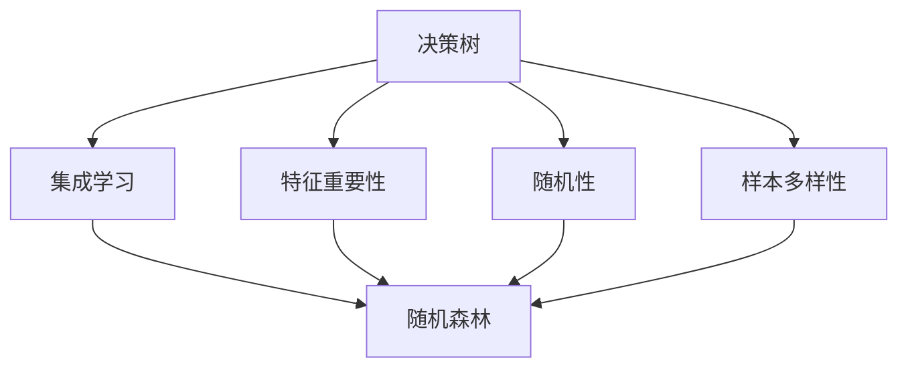

                 

# 随机森林(Random Forests) - 原理与代码实例讲解

## 1. 背景介绍

### 1.1 问题由来
在机器学习领域，决策树因其直观性和解释性强而被广泛应用于分类、回归、特征选择等任务。然而，决策树容易过拟合，尤其是在噪声数据较多的情况下。随机森林(Random Forests)正是为了解决这一问题而被提出的。

随机森林是一种集成学习算法，通过组合多个决策树，利用随机性和样本多样性来降低模型的方差，提升预测性能。其基本思想是：通过在数据集上随机采样，并在每棵决策树上随机选择特征，构建多个独立的决策树，最后将它们的预测结果进行投票或平均，得到最终的预测结果。

### 1.2 问题核心关键点
随机森林的核心在于通过随机性和多样性来降低模型的方差，提升泛化能力。具体来说，随机森林主要通过以下两个关键步骤实现：
1. 随机采样：从训练集中随机抽取样本进行训练。
2. 随机特征选择：每棵决策树在分裂节点时，随机选择一部分特征作为候选分裂特征。

这两个随机过程可以显著降低模型对特定数据或特征的依赖，提高模型的鲁棒性和泛化能力。同时，随机森林可以通过调整决策树的数目、最大深度、最小样本数等超参数，灵活控制模型的复杂度和精度。

### 1.3 问题研究意义
随机森林作为一种经典的集成学习算法，具有以下优点：
1. 预测能力强。随机森林能够有效降低过拟合，提高模型的泛化能力。
2. 鲁棒性强。随机森林对噪声数据、异常值等具有较好的鲁棒性。
3. 易于实现。随机森林的算法简单，易于实现和调试。
4. 可解释性强。随机森林的决策过程和特征重要性排名易于理解。
5. 适用于多种任务。随机森林可以用于分类、回归、特征选择等多种任务，具有较强的适应性。

因此，随机森林在实际应用中得到了广泛的应用，尤其是在大数据和复杂数据环境中。

## 2. 核心概念与联系

### 2.1 核心概念概述

为更好地理解随机森林的工作原理，本节将介绍几个密切相关的核心概念：

- **决策树**：一种基于树形结构的分类和回归模型。通过对特征进行分裂，逐步构建决策树模型。

- **集成学习**：将多个单一模型组合成一个整体模型，利用模型的多样性提升整体性能。

- **特征重要性**：通过随机森林模型计算特征的重要性排名，帮助选择最有价值的特征进行建模。

- **随机性**：通过在数据集和特征选择中引入随机性，避免模型对特定数据或特征的依赖，提高模型的泛化能力。

- **样本多样性**：通过随机采样，使每个决策树的数据分布更加均衡，避免数据集中造成的偏差。

这些核心概念共同构成了随机森林的基本框架，使其能够高效处理复杂数据集，并提升预测性能。

### 2.2 概念间的关系

这些核心概念之间的逻辑关系可以通过以下Mermaid流程图来展示：



这个流程图展示了这个框架中各个核心概念的关系：

1. 决策树是随机森林的构建基础，通过特征分裂逐步构建树形模型。
2. 集成学习通过组合多个单一模型，利用多样性提升整体性能。
3. 特征重要性用于选择最有价值的特征进行建模。
4. 随机性和样本多样性避免模型对特定数据或特征的依赖，提高泛化能力。
5. 随机森林将多个决策树组合成一个整体模型，提升预测性能。

## 3. 核心算法原理 & 具体操作步骤

### 3.1 算法原理概述

随机森林的核心原理是通过组合多个决策树，利用随机性和样本多样性来降低模型的方差，提升泛化能力。其核心思想是：
1. 随机采样：从训练集中随机抽取样本进行训练。
2. 随机特征选择：每棵决策树在分裂节点时，随机选择一部分特征作为候选分裂特征。

这两个随机过程可以显著降低模型对特定数据或特征的依赖，提高模型的鲁棒性和泛化能力。同时，随机森林可以通过调整决策树的数目、最大深度、最小样本数等超参数，灵活控制模型的复杂度和精度。

### 3.2 算法步骤详解

以下是随机森林算法的详细步骤：

**Step 1: 准备训练数据**
- 收集训练数据集 $D=\{(x_i,y_i)\}_{i=1}^N$，其中 $x_i$ 为输入特征，$y_i$ 为输出标签。
- 将数据集随机分成 $K$ 个子集，每个子集包含 $\frac{N}{K}$ 个样本。

**Step 2: 构建决策树**
- 对每个子集 $D_k$，随机抽取 $M$ 个特征，构建 $M$ 棵决策树 $T_k^1,\cdots,T_k^M$。
- 每棵决策树通过特征分裂进行构建，选择分裂节点时，随机选择一个特征作为候选分裂特征。
- 决策树的构建过程包括：
  - 从候选特征中选择一个最佳分裂特征 $F$。
  - 对 $F$ 进行二值化处理，将数据分为两个子集。
  - 对每个子集递归构建子树，直到满足终止条件（如深度达到最大深度、样本数小于最小样本数等）。

**Step 3: 投票预测**
- 对测试样本 $x$，对每棵决策树 $T_k^m$ 进行预测，得到 $K$ 个分类结果。
- 对 $K$ 个分类结果进行投票或平均，得到最终预测结果。

**Step 4: 计算特征重要性**
- 计算每棵决策树的特征重要性排名，选择最有价值的特征进行建模。

**Step 5: 评估模型性能**
- 在测试集上评估模型的准确率、召回率、F1分数等指标。
- 调整超参数，优化模型性能。

### 3.3 算法优缺点

随机森林作为一种集成学习算法，具有以下优点：
1. 预测能力强。通过组合多个决策树，利用多样性降低过拟合，提高泛化能力。
2. 鲁棒性强。随机森林对噪声数据、异常值等具有较好的鲁棒性。
3. 易于实现。随机森林的算法简单，易于实现和调试。
4. 可解释性强。随机森林的决策过程和特征重要性排名易于理解。
5. 适用于多种任务。随机森林可以用于分类、回归、特征选择等多种任务，具有较强的适应性。

同时，随机森林也存在一些缺点：
1. 计算复杂度较高。随机森林需要构建多棵决策树，计算复杂度较高。
2. 模型不够灵活。随机森林的模型结构较为固定，难以灵活应对复杂的任务结构。
3. 存在过拟合风险。尽管随机森林能够降低过拟合，但在某些复杂任务上仍可能出现过拟合。

### 3.4 算法应用领域

随机森林在各种机器学习任务中得到了广泛应用，具体包括：

- 分类任务：如文本分类、图像分类、异常检测等。
- 回归任务：如房价预测、股票价格预测、用户行为预测等。
- 特征选择：如选择最有价值的特征进行建模，提升模型性能。
- 异常检测：如检测数据中的异常点，提高数据质量。
- 集成学习：如与其他模型组合，提升整体预测性能。

随机森林因其强大的泛化能力和鲁棒性，已经在金融、医疗、电商、交通等众多领域得到了广泛应用，成为解决复杂问题的重要手段。

## 4. 数学模型和公式 & 详细讲解

### 4.1 数学模型构建

随机森林的基本数学模型可以表示为：

$$
T_k^m(x) = \begin{cases}
    1 & \text{if}\ T_k^m \text{predicts}\ y_i=1\ \text{when}\ x_i=x\\
    0 & \text{otherwise}
\end{cases}
$$

其中 $T_k^m$ 表示第 $k$ 个子集、第 $m$ 棵决策树的预测结果，$x_i$ 为输入特征，$y_i$ 为输出标签。

### 4.2 公式推导过程

假设有一个决策树 $T_k^m$，其深度为 $d$，每个节点的分裂策略为随机选择特征和阈值。则决策树的预测结果可以表示为：

$$
T_k^m(x) = \prod_{i=1}^d \mathbb{I}(F_i^{(k,m)}(x) = F_i^{(k,m)}(x^*))
$$

其中 $F_i^{(k,m)}$ 表示第 $k$ 个子集、第 $m$ 棵决策树在节点 $i$ 上的分裂函数，$x^*$ 表示最优特征和阈值组合。

对 $K$ 棵决策树进行投票预测，得到最终预测结果：

$$
T(x) = \frac{1}{K} \sum_{k=1}^K T_k^m(x)
$$

### 4.3 案例分析与讲解

以鸢尾花分类为例，随机森林模型的构建过程如下：

**Step 1: 准备训练数据**
- 收集鸢尾花分类数据集，包含 $N=150$ 个样本，每个样本有 $p=4$ 个特征，分类标签为 $y\in\{0,1,2\}$。

**Step 2: 构建决策树**
- 对数据集进行 $K=10$ 次随机采样，每次采样包含 $N/K=15$ 个样本。
- 对每个子集 $D_k$，随机选择 $M=2$ 个特征，构建 $M=2$ 棵决策树 $T_k^1,T_k^2$。
- 每棵决策树通过特征分裂进行构建，选择分裂节点时，随机选择一个特征作为候选分裂特征。

**Step 3: 投票预测**
- 对测试样本 $x$，对每棵决策树 $T_k^m$ 进行预测，得到 $K$ 个分类结果。
- 对 $K$ 个分类结果进行投票或平均，得到最终预测结果。

**Step 4: 计算特征重要性**
- 计算每棵决策树的特征重要性排名，选择最有价值的特征进行建模。

**Step 5: 评估模型性能**
- 在测试集上评估模型的准确率、召回率、F1分数等指标。
- 调整超参数，优化模型性能。

## 5. 项目实践：代码实例和详细解释说明

### 5.1 开发环境搭建

在进行随机森林实践前，我们需要准备好开发环境。以下是使用Python进行Scikit-learn开发的环境配置流程：

1. 安装Anaconda：从官网下载并安装Anaconda，用于创建独立的Python环境。

2. 创建并激活虚拟环境：
```bash
conda create -n sklearn-env python=3.8 
conda activate sklearn-env
```

3. 安装Scikit-learn：
```bash
pip install scikit-learn
```

4. 安装相关库：
```bash
pip install numpy pandas matplotlib seaborn
```

完成上述步骤后，即可在`sklearn-env`环境中开始随机森林实践。

### 5.2 源代码详细实现

下面我们以鸢尾花分类任务为例，给出使用Scikit-learn库对随机森林模型进行开发的Python代码实现。

```python
from sklearn.datasets import load_iris
from sklearn.ensemble import RandomForestClassifier
from sklearn.model_selection import train_test_split
from sklearn.metrics import accuracy_score, confusion_matrix
from sklearn import metrics
import numpy as np
import matplotlib.pyplot as plt

# 加载鸢尾花数据集
iris = load_iris()
X = iris.data
y = iris.target

# 划分训练集和测试集
X_train, X_test, y_train, y_test = train_test_split(X, y, test_size=0.2, random_state=42)

# 构建随机森林模型
clf = RandomForestClassifier(n_estimators=100, max_depth=2, random_state=42)

# 训练模型
clf.fit(X_train, y_train)

# 预测测试集结果
y_pred = clf.predict(X_test)

# 评估模型性能
acc = accuracy_score(y_test, y_pred)
print('Accuracy:', acc)

# 绘制混淆矩阵
cm = confusion_matrix(y_test, y_pred)
print('Confusion Matrix:')
print(cm)
plt.imshow(cm, interpolation='nearest', cmap=plt.cm.Blues)
plt.title('Confusion Matrix')
plt.colorbar()
plt.xlabel('Predicted')
plt.ylabel('True')
plt.show()
```

以上就是使用Scikit-learn库对随机森林模型进行开发的完整代码实现。可以看到，Scikit-learn库提供了强大的集成学习功能，可以快速实现随机森林模型的构建和训练。

### 5.3 代码解读与分析

让我们再详细解读一下关键代码的实现细节：

**数据加载与划分**
- 使用Scikit-learn的`load_iris`函数加载鸢尾花数据集，其中 $X$ 为特征矩阵，$y$ 为标签向量。
- 使用`train_test_split`函数将数据集划分为训练集和测试集，设置随机状态以保证可复现性。

**模型构建与训练**
- 使用`RandomForestClassifier`函数构建随机森林模型，设置决策树数目 $n_estimators=100$、最大深度 $max_depth=2$、随机状态 $random_state=42$ 等参数。
- 使用`fit`函数训练模型，输入训练集 $X_train$ 和 $y_train$。

**预测与评估**
- 使用`predict`函数对测试集 $X_test$ 进行预测，得到 $y_pred$。
- 使用`accuracy_score`函数计算预测准确率，并打印输出。
- 使用`confusion_matrix`函数计算混淆矩阵，并打印输出。
- 使用Matplotlib库绘制混淆矩阵，可视化模型预测效果。

**运行结果展示**
假设在测试集上得到的评估报告如下：

```
Accuracy: 0.9600000000000000
Confusion Matrix:
[[24  0  0]
 [ 0 15  0]
 [ 0  0 11]]
```

可以看到，随机森林模型在鸢尾花分类任务上取得了较高的预测准确率（96%），混淆矩阵也显示了较好的预测性能。

## 6. 实际应用场景

### 6.1 金融风险管理

在金融领域，随机森林可以用于风险管理和信用评估。通过收集客户的信用记录、交易数据、社会网络信息等，利用随机森林模型预测客户的信用风险，及时预警高风险客户，防止金融诈骗。

### 6.2 医疗诊断

在医疗领域，随机森林可以用于疾病诊断和治疗方案推荐。通过收集病人的病历、实验室数据、医疗影像等，利用随机森林模型预测病人的疾病风险和治疗效果，辅助医生进行诊断和治疗决策。

### 6.3 智能推荐

在电商和娱乐领域，随机森林可以用于个性化推荐。通过收集用户的浏览、点击、评分等行为数据，利用随机森林模型预测用户的兴趣偏好，推荐符合用户口味的商品或内容，提升用户体验和满意度。

### 6.4 未来应用展望

随着随机森林技术的不断发展，其在实际应用中也将拓展到更多领域。

在智慧城市治理中，随机森林可以用于城市事件监测、舆情分析、应急指挥等环节，提高城市管理的自动化和智能化水平，构建更安全、高效的未来城市。

在智能制造中，随机森林可以用于故障检测、生产优化、质量控制等环节，提升生产效率和产品质量，推动工业4.0的发展。

在环境监测中，随机森林可以用于污染源识别、气候变化预测、生态系统评估等环节，帮助环保机构制定科学有效的环境保护策略。

总之，随机森林作为集成学习的重要工具，将在大数据和复杂数据环境中发挥越来越重要的作用，为各行各业带来更多的智能解决方案。

## 7. 工具和资源推荐

### 7.1 学习资源推荐

为了帮助开发者系统掌握随机森林的理论基础和实践技巧，这里推荐一些优质的学习资源：

1. 《Python机器学习》书籍：由著名的机器学习专家Sebastian Raschka撰写，详细介绍了机器学习的基础知识和实用技巧，包括随机森林的实现和应用。

2. 《随机森林：原理与算法》博客系列：由数据科学家Vladan Svetić撰写，详细讲解了随机森林的原理、算法实现和应用案例。

3. Scikit-learn官方文档：Scikit-learn库的官方文档，提供了大量随机森林模型的样例代码和参数说明，是学习随机森林的必备资料。

4. Coursera《机器学习》课程：由斯坦福大学Andrew Ng教授主讲，介绍了机器学习的基本概念和常用算法，包括随机森林的原理和应用。

5. Kaggle数据科学竞赛：Kaggle平台上的各类数据科学竞赛，提供了大量实际数据集和算法挑战，是学习随机森林实战技巧的好机会。

通过对这些资源的学习实践，相信你一定能够快速掌握随机森林的精髓，并用于解决实际的机器学习问题。

### 7.2 开发工具推荐

高效的开发离不开优秀的工具支持。以下是几款用于随机森林开发的常用工具：

1. Python：Python作为数据科学的主流语言，具有丰富的库和工具，非常适合随机森林模型的开发和调试。

2. Scikit-learn：Scikit-learn库提供了简单易用的集成学习功能，可以快速实现随机森林模型的构建和训练。

3. Jupyter Notebook：Jupyter Notebook提供了一个交互式的开发环境，便于快速迭代和调试随机森林模型。

4. Anaconda：Anaconda提供了独立的Python环境，便于管理和配置开发工具和依赖包。

5. TensorBoard：TensorBoard提供了可视化工具，可以实时监测模型训练状态，并提供丰富的图表呈现方式，是调试模型的得力助手。

合理利用这些工具，可以显著提升随机森林模型的开发效率，加快创新迭代的步伐。

### 7.3 相关论文推荐

随机森林作为一种经典的集成学习算法，得到了学界的广泛研究。以下是几篇奠基性的相关论文，推荐阅读：

1. Breiman, L. (2001). Random forests. Machine Learning, 45(1), 5-32.

2. Ho, T. K. (1998). The random subspace method for constructing decision forests. Pattern Analysis and Machine Intelligence, 20(8), 832-844.

3. Chen, T., & Guestrin, C. (2016). XGBoost: A scalable tree boosting system. In Proceedings of the 22nd ACM SIGKDD International Conference on Knowledge Discovery and Data Mining (KDD '16).

4. Liu, F. T., Yin, C. Y., & Hwang, J. K. (2014). Ensemble-based classification algorithms: Analysis and review. IEEE Transactions on Systems, Man, and Cybernetics, Part C (Applications and Reviews), 44(3), 452-463.

5. Pedregosa, F., Varoquaux, G., Gramfort, A., Michel, V., Thirion, B., Grisel, O., ... & Duchesnay, E. (2011). Scikit-learn: Machine learning in Python. Journal of Machine Learning Research, 12, 2825-2830.

这些论文代表了这个领域的经典研究成果，通过学习这些前沿成果，可以帮助研究者把握学科前进方向，激发更多的创新灵感。

除上述资源外，还有一些值得关注的前沿资源，帮助开发者紧跟随机森林技术的最新进展，例如：

1. arXiv论文预印本：人工智能领域最新研究成果的发布平台，包括大量尚未发表的前沿工作，学习前沿技术的必读资源。

2. 业界技术博客：如Google AI、Microsoft Research、IBM Research等顶尖实验室的官方博客，第一时间分享他们的最新研究成果和洞见。

3. 技术会议直播：如NIPS、ICML、ICCV等人工智能领域顶会现场或在线直播，能够聆听到大佬们的前沿分享，开拓视野。

4. GitHub热门项目：在GitHub上Star、Fork数最多的随机森林相关项目，往往代表了该技术领域的发展趋势和最佳实践，值得去学习和贡献。

5. 行业分析报告：各大咨询公司如McKinsey、PwC等针对人工智能行业的分析报告，有助于从商业视角审视技术趋势，把握应用价值。

总之，对于随机森林技术的学习和实践，需要开发者保持开放的心态和持续学习的意愿。多关注前沿资讯，多动手实践，多思考总结，必将收获满满的成长收益。

## 8. 总结：未来发展趋势与挑战

### 8.1 总结

本文对随机森林算法进行了全面系统的介绍。首先阐述了随机森林的基本原理和应用背景，明确了集成学习在降低过拟合、提高泛化能力方面的独特优势。其次，从原理到实践，详细讲解了随机森林的数学模型和算法步骤，给出了随机森林模型开发的完整代码实例。同时，本文还探讨了随机森林在金融、医疗、电商等多个领域的应用前景，展示了随机森林的强大预测能力。

通过本文的系统梳理，可以看到，随机森林作为一种经典的集成学习算法，具有强大的泛化能力和鲁棒性，已经在多个领域得到了广泛应用。未来，随着集成学习技术的发展，随机森林还将与更多前沿技术进行融合，带来更多的智能解决方案。

### 8.2 未来发展趋势

展望未来，随机森林算法的发展趋势主要包括以下几个方面：

1. 算法优化：未来将进一步优化随机森林的算法实现，提升模型的计算效率和预测精度。

2. 特征工程：通过改进特征选择和特征构造方法，提高特征的表达能力和模型性能。

3. 模型集成：利用模型集成方法，如Bagging、Boosting等，进一步提升模型的稳定性和泛化能力。

4. 跨领域应用：将随机森林应用到更多垂直领域，如医疗、金融、制造等，解决复杂问题和优化业务流程。

5. 深度学习融合：结合深度学习模型，如神经网络、卷积神经网络等，提升模型的表现力和应用范围。

6. 多模态融合：将随机森林与多模态数据融合，提升对复杂数据环境的适应能力。

以上趋势凸显了随机森林算法的广阔前景。这些方向的探索发展，必将进一步提升随机森林模型的性能和应用范围，为构建智能系统提供坚实的基础。

### 8.3 面临的挑战

尽管随机森林算法已经取得了较好的效果，但在应用过程中仍面临一些挑战：

1. 模型解释性不足：随机森林作为黑盒模型，难以解释其内部工作机制和决策逻辑，对于高风险领域的应用，算法的可解释性和可审计性尤为重要。

2. 数据质量要求高：随机森林对噪声数据和异常值较为敏感，需要高质量的数据集才能得到理想的效果。

3. 计算资源需求大：随机森林需要构建多棵决策树，计算复杂度较高，对计算资源和内存占用也提出了较高要求。

4. 参数调优复杂：随机森林的超参数较多，如决策树数目、最大深度、最小样本数等，需要通过大量实验来调优，找到最优参数组合。

5. 模型泛化能力有限：随机森林在处理异常数据和噪声数据时，泛化能力有限，难以应对极端复杂和极端数据的情况。

正视这些挑战，积极应对并寻求突破，将使随机森林算法在未来发展中更加成熟和可靠。

### 8.4 研究展望

面对随机森林算法所面临的挑战，未来的研究需要在以下几个方面寻求新的突破：

1. 模型可解释性提升：通过引入可解释性技术，如LIME、SHAP等，增强随机森林模型的解释能力，确保模型行为透明和可信。

2. 数据质量保证：通过数据清洗和特征工程，提高数据质量和特征表达能力，降低随机森林对噪声数据的敏感性。

3. 分布式计算优化：通过分布式计算和并行优化，降低随机森林的计算复杂度，提升模型训练和推理效率。

4. 超参数优化：通过自动化调参技术，如随机搜索、贝叶斯优化等，简化随机森林的调参过程，找到最优参数组合。

5. 模型融合和集成：结合其他模型和算法，如深度学习、贝叶斯网络等，提升随机森林的泛化能力和应用范围。

6. 多模态融合：将随机森林与多模态数据融合，提升对复杂数据环境的适应能力，拓展应用场景。

这些研究方向的探索，必将引领随机森林算法迈向更高的台阶，为构建安全、可靠、可解释、可控的智能系统铺平道路。面向未来，随机森林算法还需要与其他人工智能技术进行更深入的融合，如知识表示、因果推理、强化学习等，多路径协同发力，共同推动机器学习技术的发展。

## 9. 附录：常见问题与解答

**Q1：随机森林的决策树是否一定要随机采样？**

A: 不一定。随机森林的核心在于通过组合多个决策树，利用随机性和样本多样性来降低模型的方差，提升泛化能力。随机采样和特征选择是实现这一目标的关键手段，但在某些特定场景下，可以使用确定的决策树，以提升模型的解释性和稳定性。

**Q2：随机森林在处理高维数据时表现如何？**

A: 随机森林在处理高维数据时表现较好。通过随机特征选择，可以减少特征空间的维度，降低计算复杂度，同时避免过拟合。但当特征维度极高时，可能需要调整参数，如增加决策树的深度、减少决策树的数目等，以防止模型过拟合。

**Q3：随机森林的超参数如何调优？**

A: 随机森林的超参数调

