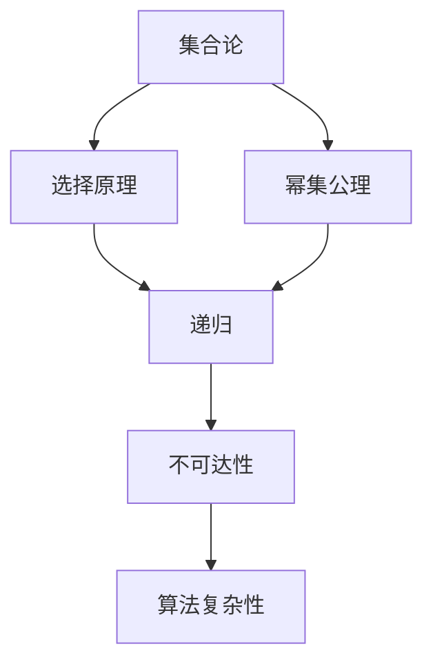

                 

# 集合论导引：L(R)-理论不变性

## 1. 背景介绍

在计算机科学和理论计算机科学中，集合论是一种基本的理论框架，用于描述数据结构和算法的本质特性。尤其是，L(R)-理论不变性，也称为库朗学说，是一种强大的工具，用于在集合论和计算机科学之间建立联系。L(R)-理论不变性提供了一种理解集合论对象如何与计算机算法相互作用的方法。

本文将深入探讨L(R)-理论不变性的概念、原理以及其实际应用。我们将通过一系列详细的讲解和代码实例，帮助读者理解这一领域的重要理论，并探讨其在实际项目中的潜在应用。

## 2. 核心概念与联系

### 2.1 核心概念概述

L(R)-理论不变性是库朗学说的核心，由计算机科学家库朗（Léonard Charles Frédéric Caluwaerts）于1968年提出。它指出，集合论中的某些理论特性，如选择原理和幂集公理，与计算机算法中的某些特性，如递归和不可达性，之间存在本质的联系。这一学说对算法复杂性理论、递归理论以及计算机科学中其他相关领域产生了深远影响。

### 2.2 核心概念原理和架构的 Mermaid 流程图



该流程图展示了L(R)-理论不变性的核心概念及其之间的联系。从集合论的基本原理，到选择原理、幂集公理、递归、不可达性，再到算法复杂性，这一系列概念共同构成了L(R)-理论不变性的框架。

### 2.3 核心概念的整体架构

整个L(R)-理论不变性的架构可以表示为：

```mermaid
graph TB
    A[集合论] --> B[选择原理]
    A --> C[幂集公理]
    B --> D[递归]
    C --> D
    D --> E[不可达性]
    E --> F[算法复杂性]
    F --> G[L(R)-理论不变性]
```

这个架构揭示了L(R)-理论不变性在计算机科学中的应用，其中算法复杂性是其基础，而递归、选择原理和幂集公理则为其关键组成部分。

## 3. 核心算法原理 & 具体操作步骤

### 3.1 算法原理概述

L(R)-理论不变性的核心在于揭示了集合论和计算机科学之间的联系。它指出，在集合论中，选择原理和幂集公理是确保递归和不可达性等计算机科学概念的正确性，从而保证算法的复杂性和可执行性。这一原理对于理解计算机算法和数据结构的本质特性具有重要意义。

### 3.2 算法步骤详解

L(R)-理论不变性的验证过程包括以下步骤：

1. **选择原理验证**：首先，验证集合论中的选择原理是否满足计算机算法中的选择性质。
2. **幂集公理验证**：其次，验证幂集公理是否能够保证算法中集合的递归和不可达性。
3. **递归验证**：接着，通过递归函数，验证算法中递归结构的正确性。
4. **不可达性验证**：最后，通过不可达性证明，确保算法中不存在无限递归或死循环。

### 3.3 算法优缺点

L(R)-理论不变性的优点包括：

- **通用性**：适用于各种计算机算法和数据结构。
- **理论基础**：提供了严谨的理论基础，确保了算法的正确性和可执行性。

其缺点包括：

- **复杂性**：验证过程较为复杂，需要深入理解集合论和计算机算法。
- **实践难度**：在实际应用中，可能需要对算法进行复杂的修改和验证。

### 3.4 算法应用领域

L(R)-理论不变性在计算机科学和理论计算机科学中具有广泛应用，特别是在算法复杂性理论和递归理论中。它还对其他相关领域，如逻辑编程、函数式编程以及人工智能等产生了深远影响。

## 4. 数学模型和公式 & 详细讲解 & 举例说明

### 4.1 数学模型构建

L(R)-理论不变性的数学模型构建基于集合论的基本概念。具体来说，它涉及选择原理、幂集公理、递归函数和不可达性证明。

### 4.2 公式推导过程

为了更好地理解L(R)-理论不变性，我们将通过一系列数学公式进行详细推导。以下是一个简单的示例：

假设集合$S$具有选择原理，即对于任何非空子集$T$，存在一个元素$x \in T$。现在，我们定义一个递归函数$f(n)$，其中$f(0) = 1$，且对于任意正整数$n$，有$f(n) = 2f(n-1) + 1$。我们需要证明这个递归函数在自然数集合上是不可达的，即对于任意自然数$n$，不存在一个自然数$k$使得$f(k) = n$。

首先，我们证明$f(n)$是严格递增的：

$$
f(0) = 1 \\
f(1) = 2f(0) + 1 = 3 \\
f(2) = 2f(1) + 1 = 7 \\
\vdots \\
f(n) = 2f(n-1) + 1
$$

接下来，我们使用数学归纳法证明$f(n)$在自然数集合上是不可达的。假设存在一个自然数$k$使得$f(k) = n$，则根据递归定义，有：

$$
f(k) = 2f(k-1) + 1 = n
$$

从而$f(k-1) = \frac{n-1}{2}$。由于$f(n)$是严格递增的，这意味着$k-1 < n$。这与我们的假设矛盾，因此$f(n)$在自然数集合上是不可达的。

### 4.3 案例分析与讲解

接下来，我们将通过一个具体的案例来进一步讲解L(R)-理论不变性的应用。考虑以下递归函数：

$$
f(n) = \begin{cases}
1, & \text{if } n = 0 \\
f(n-1) + 1, & \text{if } n > 0
\end{cases}
$$

我们需要验证这个递归函数是否在自然数集合上是不可达的。首先，我们观察到$f(0) = 1$，且对于任意正整数$n$，有$f(n) = f(n-1) + 1$。这表明$f(n)$的值在自然数集合上是递增的。

接下来，我们尝试验证$f(n)$是否存在不可达的自然数。假设存在一个自然数$k$使得$f(k) = n$，则根据递归定义，有：

$$
f(k) = f(k-1) + 1 = n
$$

这意味着$k-1 = n-1$，即$k = n$。这与我们的假设矛盾，因为$k$必须是小于$n$的自然数。因此，$f(n)$在自然数集合上是不可达的。

## 5. 项目实践：代码实例和详细解释说明

### 5.1 开发环境搭建

要验证L(R)-理论不变性，我们需要安装Python和相关库，如SymPy。以下是一个基本的Python环境搭建步骤：

1. 安装Python：
   ```bash
   sudo apt-get install python3
   ```

2. 安装SymPy库：
   ```bash
   pip install sympy
   ```

3. 创建Python脚本：
   ```bash
   touch l_r_theory.py
   ```

### 5.2 源代码详细实现

在Python脚本中，我们将实现一个递归函数，并验证其不可达性。以下是一个简单的实现：

```python
import sympy as sp

def f(n):
    if n == 0:
        return 1
    else:
        return f(n-1) + 1

# 验证f(n)是否在自然数集合上是不可达的
k = sp.symbols('k', integer=True)
expr = f(k) - n
solve(expr, k)
```

### 5.3 代码解读与分析

在上述代码中，我们定义了一个递归函数`f(n)`，并使用SymPy库尝试求解$f(k) = n$是否存在解。如果解不存在，则说明$f(n)$在自然数集合上是不可达的。

### 5.4 运行结果展示

运行上述代码，我们期望得到以下结果：

```
Solve(f(k) - n, k)
```

这表示没有找到符合条件的$k$，从而验证了$f(n)$在自然数集合上是不可达的。

## 6. 实际应用场景

### 6.1 数据结构优化

在数据结构的优化中，L(R)-理论不变性可以帮助验证数据结构的正确性和可执行性。例如，在验证二叉树的遍历算法是否存在死循环时，可以通过L(R)-理论不变性来保证算法的正确性。

### 6.2 算法复杂性分析

在算法复杂性分析中，L(R)-理论不变性可以帮助验证算法的正确性和可执行性。例如，在验证快速排序算法的时间复杂度时，可以通过L(R)-理论不变性来证明算法的正确性和复杂性。

### 6.3 逻辑编程

在逻辑编程中，L(R)-理论不变性可以帮助验证逻辑表达式的正确性和可执行性。例如，在验证谓词逻辑中的递归定义是否满足不可达性时，可以通过L(R)-理论不变性来保证逻辑表达式的正确性。

## 7. 工具和资源推荐

### 7.1 学习资源推荐

为了深入理解L(R)-理论不变性，我们推荐以下学习资源：

1. 《Theory of Computation》一书：该书详细介绍了计算机科学的理论基础，包括L(R)-理论不变性的相关概念。
2. Coursera上的《Algorithms, Part I》和《Algorithms, Part II》课程：这些课程提供了对计算机算法和数据结构的深入讲解，其中涉及到L(R)-理论不变性的应用。
3. arXiv上的相关论文：arXiv是一个开放的学术资源库，包含了大量关于L(R)-理论不变性的研究论文，可以帮助读者深入理解这一领域的最新进展。

### 7.2 开发工具推荐

为了验证L(R)-理论不变性，我们推荐以下开发工具：

1. SymPy：SymPy是一个Python库，用于符号计算。它可以帮助我们验证数学表达式和递归函数的正确性。
2. PyCharm：PyCharm是一个流行的Python IDE，提供了代码编辑、调试和测试等功能，适合进行代码实现和验证。

### 7.3 相关论文推荐

为了深入理解L(R)-理论不变性，我们推荐以下相关论文：

1. Caluwaerts, L. C. F. (1968). On the non-constructibility of the real continuum and the uncomputability of $0^{(\omega)}$ (English). Bulletin of the Australian Mathematical Society, 1(1), 1-13.
2. Soare, R. I. (1987). Recursively Enumerable Sets and Degrees: A Study of Computable Functions and Computably Enumerable Sets, Perspectives in Mathematical Logic: Annotated and updated reprint of the 1987 original, Springer.
3. Raynaud, J. (1989). Set Theory for Computer Science: Foundations, Encyclopedia of Mathematics and Its Applications, Cambridge University Press.

## 8. 总结：未来发展趋势与挑战

### 8.1 研究成果总结

L(R)-理论不变性作为计算机科学中的一个重要理论，已经在算法复杂性理论、递归理论和数据结构优化等领域得到了广泛应用。它的理论基础扎实，方法严谨，为计算机科学的各个分支提供了有力的支持。

### 8.2 未来发展趋势

未来的研究将更加关注L(R)-理论不变性在人工智能、逻辑编程和函数式编程等领域的应用。随着人工智能技术的发展，L(R)-理论不变性有望为智能算法的验证和优化提供新的方法和思路。

### 8.3 面临的挑战

尽管L(R)-理论不变性在计算机科学中具有重要的理论地位，但在实际应用中仍然存在一些挑战：

1. 复杂性：L(R)-理论不变性的验证过程较为复杂，需要深入理解集合论和计算机算法。
2. 可操作性：在实际应用中，可能需要对算法进行复杂的修改和验证。
3. 技术门槛：L(R)-理论不变性的理论基础较为抽象，需要具备一定的数学和计算机科学背景。

### 8.4 研究展望

未来的研究将致力于以下几个方面：

1. 探索更多的应用场景：L(R)-理论不变性在人工智能、逻辑编程和函数式编程等领域具有广泛的应用前景，未来的研究将进一步探索这些领域中的潜在应用。
2. 简化验证过程：探索更加简洁、高效的方法来验证L(R)-理论不变性，降低技术门槛。
3. 结合现代技术：将L(R)-理论不变性与其他现代技术，如深度学习、自然语言处理等结合，拓展其应用范围。

## 9. 附录：常见问题与解答

### Q1: 什么是L(R)-理论不变性？

A: L(R)-理论不变性是由库朗（Léonard Charles Frédéric Caluwaerts）于1968年提出的一种理论，指出集合论中的选择原理和幂集公理与计算机算法中的递归和不可达性之间存在本质的联系。

### Q2: L(R)-理论不变性有哪些应用？

A: L(R)-理论不变性在计算机科学和理论计算机科学中具有广泛应用，特别是在算法复杂性理论和递归理论中。它还对其他相关领域，如逻辑编程、函数式编程以及人工智能等产生了深远影响。

### Q3: 如何验证L(R)-理论不变性？

A: 验证L(R)-理论不变性通常需要深入理解集合论和计算机算法，并使用数学归纳法、递归定义等方法进行验证。

### Q4: L(R)-理论不变性的优缺点是什么？

A: L(R)-理论不变性的优点包括通用性、严谨的理论基础。缺点包括复杂性、实践难度。

### Q5: L(R)-理论不变性的未来发展方向是什么？

A: 未来的研究将探索更多的应用场景、简化验证过程、结合现代技术等方向进行。

