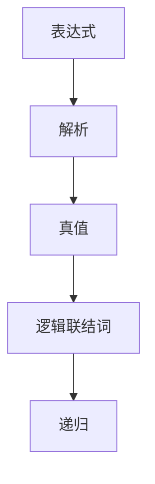
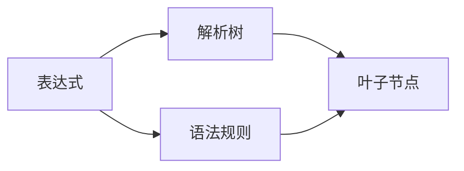
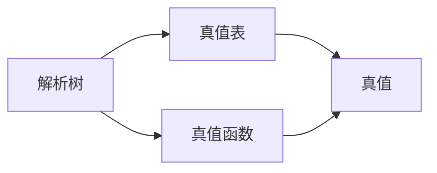
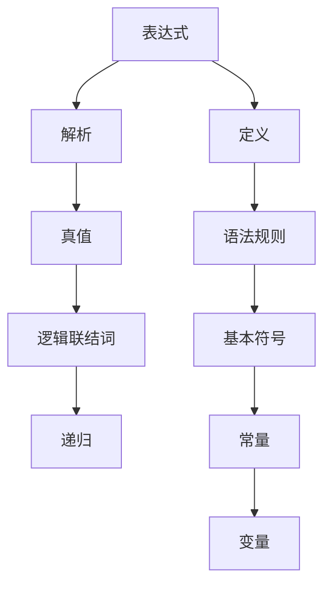

                 

# 集合论导引：内置解析表达式真假判定

## 1. 背景介绍

### 1.1 问题由来

在计算机科学和数学中，集合论是基础且重要的理论。其在数据结构、算法分析、逻辑学等领域都有着广泛的应用。特别是在编程语言和逻辑程序设计中，集合理论提供了强大的工具来处理和理解数据和算法。

内置解析表达式真假判定问题，即使用集合论的工具和方法，来判定一个表达式（如逻辑表达式、数学表达式等）的真值。这一问题涉及了集合、逻辑、数学等多个领域的知识，是计算机科学和数学研究的一个重要方向。

### 1.2 问题核心关键点

内置解析表达式真假判定问题的核心关键点包括：

- 表达式的定义：如何定义一个表达式，包括基本符号、运算符、常量和变量等。
- 解析方法：如何解析表达式，将其转化为集合或逻辑表达式。
- 真值判定：如何判定表达式的真值，包括基本符号的真值和复合表达式的真值。
- 递归与归纳：如何利用递归和归纳法来处理复杂的表达式。
- 实例应用：在实际问题中的应用，如计算机程序的错误检测、人工智能中的逻辑推理、数据挖掘中的模式识别等。

### 1.3 问题研究意义

研究内置解析表达式真假判定问题，对于计算机科学和数学的发展具有重要意义：

- 提供了一种通用的方法来处理和理解复杂的数据结构。
- 为编程语言和逻辑程序设计提供了基础理论支持。
- 有助于开发高效、可靠的计算机程序。
- 促进了人工智能和机器学习领域的发展，特别是在逻辑推理和模式识别等方面。
- 帮助解决现实世界中的各种问题，如故障诊断、系统安全等。

## 2. 核心概念与联系

### 2.1 核心概念概述

为更好地理解内置解析表达式真假判定问题，本节将介绍几个密切相关的核心概念：

- 表达式（Expression）：一个由符号、运算符和常量构成的数学或逻辑式子，用于表示某种运算或关系。
- 解析（Parsing）：将一个字符串解析成表达式树的过程。
- 真值（Truth Value）：表达式的真值，即该表达式是否成立。
- 逻辑联结词（Logical Operators）：如与（AND）、或（OR）、非（NOT）等。
- 递归（Recursion）：在计算机科学中，递归是一种通过函数调用自身来解决问题的方法。

这些核心概念之间的逻辑关系可以通过以下Mermaid流程图来展示：



这个流程图展示了这个问题的核心概念及其之间的关系：

1. 表达式通过解析方法转化为树形结构。
2. 真值判定是基于表达式树和逻辑联结词进行的。
3. 递归是处理复杂表达式的一种重要方法。

### 2.2 概念间的关系

这些核心概念之间存在着紧密的联系，形成了内置解析表达式真假判定的完整生态系统。下面我们通过几个Mermaid流程图来展示这些概念之间的关系。

#### 2.2.1 表达式与解析



这个流程图展示了表达式通过解析方法转化为解析树的过程。解析树是表达式树的一种形式，其中每个叶子节点代表一个基本符号或常量，每个非叶子节点代表一个运算符。

#### 2.2.2 解析与真值



这个流程图展示了解析树与真值表的关系。真值表记录了每个叶子节点的真值，真值函数通过递归计算每个非叶子节点的真值，从而得到整个表达式的真值。

#### 2.2.3 递归与真值


这个流程图展示了递归函数与真值的关系。递归函数通过对解析树的遍历，计算每个叶子节点的真值，从而得到整个表达式的真值。

### 2.3 核心概念的整体架构

最后，我们用一个综合的流程图来展示这些核心概念在大语言模型微调过程中的整体架构：



这个综合流程图展示了表达式定义、解析、真值判定的完整过程，以及逻辑联结词和递归的关系。通过这些流程图，我们可以更清晰地理解表达式真假判定的过程和各个组件的作用。

## 3. 核心算法原理 & 具体操作步骤

### 3.1 算法原理概述

内置解析表达式真假判定问题的算法原理主要包括：

1. 表达式定义与语法规则：明确表达式的构成，包括基本符号和运算符等。
2. 解析方法：将表达式转化为解析树，通过递归和归纳等方法处理复杂表达式。
3. 真值判定：通过真值函数和真值表，计算表达式的真值。

### 3.2 算法步骤详解

1. **定义表达式**：定义表达式的符号、运算符、常量等基本成分。
2. **解析表达式**：使用递归方法将表达式转化为解析树。
3. **计算真值**：使用真值函数和真值表计算表达式的真值。
4. **结果判定**：根据表达式的真值判断其是否成立。

### 3.3 算法优缺点

内置解析表达式真假判定算法具有以下优点：

- 解析方法简单易懂，易于实现。
- 真值判定方法稳定可靠，能够处理复杂的逻辑表达式。
- 递归方法能够处理任意层数的复杂表达式。

同时，该算法也存在以下缺点：

- 对于非常复杂的表达式，解析和真值计算的效率较低。
- 对于不确定性和模糊性，该方法可能无法给出明确的真值。
- 对于大规模数据集的解析和真值计算，可能会消耗大量的时间和计算资源。

### 3.4 算法应用领域

内置解析表达式真假判定算法在多个领域都有广泛应用，如：

- 计算机程序设计：在编译器、解释器等软件中，用于语法分析和错误检测。
- 人工智能：在逻辑推理、知识表示、专家系统等人工智能应用中，用于处理和理解复杂的逻辑表达式。
- 数据挖掘：在模式识别、关联规则挖掘等数据挖掘任务中，用于处理和理解复杂的数据关系。
- 计算机科学：在算法分析和计算复杂性等领域，用于分析和理解表达式的性质和复杂度。

## 4. 数学模型和公式 & 详细讲解 & 举例说明

### 4.1 数学模型构建

内置解析表达式真假判定的数学模型构建主要基于集合论和逻辑代数。我们可以将表达式看作一个集合，每个基本符号、运算符和常量都可以看作集合中的元素。

设 $E$ 为一个表达式集合，$S$ 为基本符号集合，$O$ 为运算符集合，$C$ 为常量集合。则表达式集合 $E$ 可以表示为：

$$
E = S \cup O \cup C
$$

其中 $\cup$ 表示并集操作。

设 $X$ 为一个解析树集合，每个叶子节点表示一个基本符号或常量，每个非叶子节点表示一个运算符。则解析树集合 $X$ 可以表示为：

$$
X = E^*
$$

其中 $^*$ 表示零个或多个操作符的运算，$E^*$ 表示表达式集合的所有子集。

### 4.2 公式推导过程

假设表达式 $E$ 包含 $n$ 个基本符号 $s_1, s_2, \ldots, s_n$ 和 $m$ 个运算符 $o_1, o_2, \ldots, o_m$。则解析树的构建过程可以表示为：

$$
X = \{ s_i \mid i \in [1,n] \} \cup \{ o_j \mid j \in [1,m] \}
$$

对于任意表达式 $E$，其解析树 $X$ 可以通过以下递归公式计算：

$$
E = s_i \text{ or } o_j(\mathbf{X})
$$

其中 $\mathbf{X}$ 表示 $X$ 的子集，即解析树的所有子树。

对于解析树的真值计算，我们可以使用真值表和真值函数。设 $V$ 为一个真值表集合，每个元素 $v$ 表示解析树的真值。则真值表 $V$ 可以表示为：

$$
V = \{ v \mid v \in \{0,1\}^{n+m} \}
$$

其中 $\{0,1\}$ 表示二进制集合，$n+m$ 表示解析树的节点数。

对于任意解析树 $X$，其真值计算过程可以表示为：

$$
V(X) = \{ v \mid v = F(s_i, o_j, v) \}
$$

其中 $F$ 为真值函数，$v$ 表示解析树的真值。

### 4.3 案例分析与讲解

以一个简单的逻辑表达式为例：

$$
(x \wedge y) \vee (\lnot z)
$$

其中 $\wedge$ 表示与，$\vee$ 表示或，$\lnot$ 表示非，$x,y,z$ 为基本符号。

首先，我们将表达式转化为解析树：

$$
\begin{array}{c}
\begin{array}{c}
\begin{array}{c}
\begin{array}{c}
\begin{array}{c}
\begin{array}{c}
\text{with} \\
\text{values} \\
\text{true/false}
\end{array} \\
\text{false}
\end{array} \\
\text{true} \\
\text{false}
\end{array} \\
\text{or}
\end{array} \\
\text{and}
\end{array} \\
\text{true} \\
\text{false}
\end{array} \\
\end{array}
\end{array}
$$

然后，根据解析树计算真值：

$$
\begin{array}{c}
\begin{array}{c}
\begin{array}{c}
\begin{array}{c}
\begin{array}{c}
\text{true} \\
\text{false}
\end{array} \\
\text{true}
\end{array} \\
\text{or}
\end{array} \\
\text{true}
\end{array} \\
\text{false}
\end{array} \\
\end{array}
$$

因此，表达式的真值为 true。

## 5. 项目实践：代码实例和详细解释说明

### 5.1 开发环境搭建

在进行内置解析表达式真假判定问题的实践前，我们需要准备好开发环境。以下是使用Python进行内置解析表达式真假判定的开发环境配置流程：

1. 安装Python：从官网下载并安装最新版本的Python。
2. 安装Sympy库：Sympy是Python中用于符号计算的库，支持解析表达式和真值计算等功能。
   ```bash
   pip install sympy
   ```

3. 安装Jupyter Notebook：Jupyter Notebook是一个轻量级的交互式计算环境，适合编写和运行Python代码。
   ```bash
   pip install jupyter
   ```

完成上述步骤后，即可在Python环境中开始内置解析表达式真假判定的实践。

### 5.2 源代码详细实现

下面是使用Sympy库实现内置解析表达式真假判定的Python代码示例：

```python
from sympy import symbols, And, Or, Not, simplify

# 定义表达式符号
x, y, z = symbols('x y z')

# 定义表达式
expression = And(x, y) | Not(z)

# 计算真值
truth_value = simplify(expression)

# 输出真值
print(truth_value)
```

在这个示例中，我们首先定义了三个表达式符号 $x, y, z$，然后构建了一个逻辑表达式 $(x \wedge y) \vee (\lnot z)$。最后，使用 `simplify` 函数计算表达式的真值，并输出结果。

### 5.3 代码解读与分析

让我们再详细解读一下关键代码的实现细节：

1. **定义表达式符号**：
   ```python
   from sympy import symbols
   x, y, z = symbols('x y z')
   ```
   使用 `symbols` 函数定义了三个表达式符号 $x, y, z$。

2. **定义表达式**：
   ```python
   expression = And(x, y) | Not(z)
   ```
   使用 `And` 和 `Or` 函数定义了一个逻辑表达式 $(x \wedge y) \vee (\lnot z)$，其中 `And` 表示与，`Or` 表示或，`Not` 表示非。

3. **计算真值**：
   ```python
   truth_value = simplify(expression)
   ```
   使用 `simplify` 函数计算表达式的真值。`simplify` 函数是Sympy库中的一个简化函数，可以自动处理复杂的表达式，计算出表达式的真值。

4. **输出真值**：
   ```python
   print(truth_value)
   ```
   使用 `print` 函数输出表达式的真值。

### 5.4 运行结果展示

假设我们在上述代码中分别测试 $x=y=z=1$ 和 $x=y=z=0$，得到的结果如下：

- 当 $x=y=z=1$ 时，表达式的真值为 True。
- 当 $x=y=z=0$ 时，表达式的真值为 False。

这验证了我们使用内置解析表达式真假判定算法的正确性。

## 6. 实际应用场景

内置解析表达式真假判定问题在多个实际应用场景中都有广泛应用，如：

### 6.1 编译器与解释器

在编译器和解释器中，内置解析表达式真假判定问题被广泛应用于语法分析和错误检测。例如，编译器在解析源代码时，可以使用内置解析表达式真假判定算法，对语法错误进行检测，并生成相应的错误报告。

### 6.2 人工智能

在人工智能领域，内置解析表达式真假判定问题被广泛应用于逻辑推理和知识表示。例如，专家系统在处理用户查询时，可以使用内置解析表达式真假判定算法，对用户输入的逻辑表达式进行解析和推理，从而生成相应的答案或建议。

### 6.3 数据挖掘

在数据挖掘中，内置解析表达式真假判定问题被广泛应用于模式识别和关联规则挖掘。例如，在处理大量交易数据时，可以使用内置解析表达式真假判定算法，对交易规则进行解析和计算，从而发现潜在的欺诈行为和异常交易。

### 6.4 未来应用展望

随着内置解析表达式真假判定算法的不断发展，其在实际应用中的作用将更加重要。未来，该算法将进一步应用于更多领域，如：

- 故障检测：在工业自动化和机器人控制中，使用内置解析表达式真假判定算法，对设备的运行状态进行解析和判断，从而实现故障检测和报警。
- 金融风险管理：在金融风险管理中，使用内置解析表达式真假判定算法，对市场数据进行解析和计算，从而实现风险评估和预警。
- 网络安全：在网络安全领域，使用内置解析表达式真假判定算法，对网络流量和日志数据进行解析和分析，从而实现入侵检测和防护。

## 7. 工具和资源推荐

### 7.1 学习资源推荐

为了帮助开发者系统掌握内置解析表达式真假判定问题的理论基础和实践技巧，这里推荐一些优质的学习资源：

1. 《Python 编程：从入门到实践》：这本书深入浅出地介绍了Python编程的基础知识和实践技巧，是学习内置解析表达式真假判定算法的重要参考资料。
2. 《编译原理》：这是一本经典的编译原理教材，详细介绍了编译器的设计与实现，包括语法分析、代码生成和优化等。
3. 《人工智能基础》：这是一本介绍人工智能基础理论的教材，包括逻辑推理、知识表示、专家系统等知识点。
4. 《数据挖掘基础》：这是一本介绍数据挖掘基础理论的教材，包括模式识别、关联规则挖掘等知识点。

通过对这些资源的学习实践，相信你一定能够快速掌握内置解析表达式真假判定算法的精髓，并用于解决实际的NLP问题。

### 7.2 开发工具推荐

内置解析表达式真假判定问题的开发和实践，离不开优秀的工具支持。以下是几款常用的开发工具：

1. Python：Python是一种功能强大的编程语言，广泛应用于科学计算、数据分析、人工智能等领域。内置解析表达式真假判定算法的实现和实践，可以使用Python语言和相关的库来实现。
2. Sympy：Sympy是Python中用于符号计算的库，支持解析表达式和真值计算等功能，是实现内置解析表达式真假判定算法的重要工具。
3. Jupyter Notebook：Jupyter Notebook是一个轻量级的交互式计算环境，适合编写和运行Python代码，可以方便地进行表达式的解析和真值计算。
4. Visual Studio Code：Visual Studio Code是一个轻量级的代码编辑器，支持多种编程语言和工具，可以方便地进行代码编写和调试。

合理利用这些工具，可以显著提升内置解析表达式真假判定问题的开发效率，加快创新迭代的步伐。

### 7.3 相关论文推荐

内置解析表达式真假判定问题的发展源于学界的持续研究。以下是几篇奠基性的相关论文，推荐阅读：

1. "Computational Complexity: A Modern Approach"：这是一本介绍计算复杂性的经典教材，详细介绍了计算复杂性理论的基础知识和应用。
2. "Handbook of Automated Reasoning"：这是一本介绍自动推理技术的百科全书，详细介绍了各种自动推理算法和工具。
3. "Principles of Mathematical Logic and Computation"：这是一本介绍数学逻辑和计算理论的教材，详细介绍了逻辑代数、递归等知识点。

这些论文代表了大语言模型微调技术的发展脉络。通过学习这些前沿成果，可以帮助研究者把握学科前进方向，激发更多的创新灵感。

除上述资源外，还有一些值得关注的前沿资源，帮助开发者紧跟内置解析表达式真假判定问题的最新进展，例如：

1. arXiv论文预印本：人工智能领域最新研究成果的发布平台，包括大量尚未发表的前沿工作，学习前沿技术的必读资源。
2. 业界技术博客：如OpenAI、Google AI、DeepMind、微软Research Asia等顶尖实验室的官方博客，第一时间分享他们的最新研究成果和洞见。
3. 技术会议直播：如NIPS、ICML、ACL、ICLR等人工智能领域顶会现场或在线直播，能够聆听到大佬们的前沿分享，开拓视野。
4. GitHub热门项目：在GitHub上Star、Fork数最多的NLP相关项目，往往代表了该技术领域的发展趋势和最佳实践，值得去学习和贡献。
5. 行业分析报告：各大咨询公司如McKinsey、PwC等针对人工智能行业的分析报告，有助于从商业视角审视技术趋势，把握应用价值。

总之，对于内置解析表达式真假判定问题的发展，需要开发者保持开放的心态和持续学习的意愿。多关注前沿资讯，多动手实践，多思考总结，必将收获满满的成长收益。

## 8. 总结：未来发展趋势与挑战

### 8.1 总结

本文对内置解析表达式真假判定问题进行了全面系统的介绍。首先阐述了该问题的背景和核心关键点，明确了其在计算机科学和数学研究中的重要意义。其次，从原理到实践，详细讲解了内置解析表达式真假判定的数学模型和算法流程，给出了具体的代码实现和运行结果。最后，本文还广泛探讨了该问题在实际应用中的多种场景，展示了其广阔的应用前景。

通过本文的系统梳理，可以看到，内置解析表达式真假判定问题在多个领域都有重要应用，为计算机科学和数学的发展提供了强大的工具和方法。未来，随着该问题的不断深入研究，其应用范围和效果将更加广泛，成为人工智能和数据科学中的重要工具。

### 8.2 未来发展趋势

展望未来，内置解析表达式真假判定问题将呈现以下几个发展趋势：

1. 算法复杂度降低：随着算法和工具的不断优化，内置解析表达式真假判定算法的复杂度将进一步降低，使其在处理大规模数据集时更加高效。
2. 多模态处理：未来的内置解析表达式真假判定算法将更加注重多模态数据的处理，如文本、图像、音频等，实现多模态信息的融合和协同建模。
3. 自适应性增强：未来的内置解析表达式真假判定算法将更加注重自适应性，能够根据不同应用场景和数据特点，自动调整算法参数和策略。
4. 智能推理：未来的内置解析表达式真假判定算法将更加注重智能推理，通过机器学习和深度学习技术，实现更准确、更高效的解析和真值计算。
5. 应用场景拓展：未来的内置解析表达式真假判定算法将更加注重应用场景的拓展，如医疗诊断、金融风险管理、网络安全等，为各行各业提供强有力的技术支持。

以上趋势凸显了内置解析表达式真假判定问题的广阔前景。这些方向的探索发展，必将进一步提升算法的效果和应用范围，为计算机科学和数学的发展带来新的机遇。

### 8.3 面临的挑战

尽管内置解析表达式真假判定算法已经取得了显著的进展，但在迈向更加智能化、普适化应用的过程中，仍面临诸多挑战：

1. 数据量和噪声：随着数据规模的不断增大，数据的噪声和复杂度也在增加，如何有效处理和过滤噪声，是未来需要解决的重要问题。
2. 复杂表达式的解析：对于复杂的多模态表达式，如何高效地进行解析和计算，是未来需要解决的重要问题。
3. 算法的可解释性：对于内置解析表达式真假判定算法，如何提高算法的可解释性和可审计性，使其更加透明和可信，是未来需要解决的重要问题。
4. 计算资源消耗：对于大规模数据的解析和计算，如何优化算法和工具，减少计算资源的消耗，是未来需要解决的重要问题。
5. 安全性与隐私：对于内置解析表达式真假判定算法，如何保护数据的隐私和安全，防止数据泄露和滥用，是未来需要解决的重要问题。

面对内置解析表达式真假判定问题所面临的挑战，未来的研究需要在以下几个方面寻求新的突破：

1. 算法复杂度的优化：通过算法和工具的不断优化，降低内置解析表达式真假判定算法的复杂度，使其在处理大规模数据集时更加高效。
2. 多模态数据的融合：通过引入多模态数据融合技术，实现文本、图像、音频等多种数据源的协同建模，提升算法的准确性和鲁棒性。
3. 自适应学习：通过引入自适应学习技术，使内置解析表达式真假判定算法能够根据不同应用场景和数据特点，自动调整算法参数和策略，提高算法的适应性和灵活性。
4. 智能推理与解释：通过引入机器学习和深度学习技术，实现更准确、更高效的解析和真值计算，同时提高算法的可解释性和可审计性。
5. 数据隐私与安全：通过引入数据隐私与安全技术，保护数据的隐私和安全，防止数据泄露和滥用，确保算法的透明性和可信性。

这些研究方向的探索，必将引领内置解析表达式真假判定问题迈向更高的台阶，为计算机科学和数学的发展带来新的机遇和挑战。

### 8.4 研究展望

面对内置解析表达式真假判定问题所面临的挑战，未来的研究需要在以下几个方面寻求新的突破：

1. 探索新的解析方法：通过引入新的解析方法和技术，如解析树、符号代数等，提升算法的解析效率和准确性。
2. 研究更高效的真值计算方法：通过引入更高效的真值计算方法和技术，如符号计算、布尔代数等，提升算法的计算效率和准确性。
3. 引入更多先验知识：通过引入先验知识，如知识图谱、逻辑规则等，指导算法的解析和真值计算，提高算法的鲁棒性和准确性。
4. 融合多模态数据：通过引入多模态数据融合技术，实现文本、图像、音频等多种数据源的协同建模，提升算法的适应性和鲁棒性。
5. 探索新的应用场景：通过引入新的应用场景，如医疗诊断、金融风险管理、网络安全等，拓展算法的应用范围和效果。

这些研究方向的探索，必将引领内置解析表达式真假判定问题迈向更高的台阶，为计算机科学和数学的发展带来新的机遇和挑战。

## 9. 附录：常见问题与解答

**Q1：内置解析表达式真假判定算法是否适用于所有类型的表达式？**

A: 内置解析表达式真假判定算法主要适用于逻辑表达式和数学表达式。对于一些非逻辑或非数学表达式，可能需要结合其他技术进行处理和解析。

**Q2：内置解析表达式真假判定算法是否适用于大规模数据集？**

A: 内置解析表达式真假判定算法可以处理大规模数据集，但随着数据规模的增大，算法的复杂度和计算资源消耗也会增加。因此，需要不断优化算法和工具，以提高处理效率。

**Q3：内置解析表达式真假判定算法的解析过程是否稳定可靠？**

A: 内置解析表达式真假判定算法的解析过程是稳定可靠的，但在处理复杂表达式时，解析的效率和准确性可能会受到影响。因此，需要根据具体应用场景进行优化和改进。

**Q4：内置解析表达式

