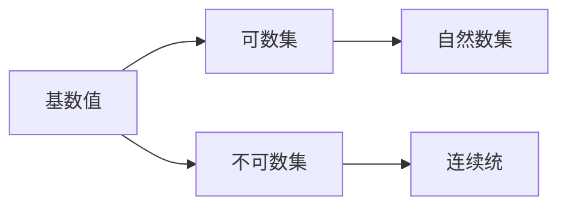

                 

# 集合论导引：大基数理论

> 关键词：集合论, 基数理论, 大基数理论, 套套逻辑, 归纳逻辑

## 1. 背景介绍

### 1.1 问题由来

集合论作为现代数学的重要分支，是理解现代数学和计算机科学诸多概念的基础。大基数理论，作为集合论中的重要分支，主要研究无穷集的大小比较及其性质。大基数理论在计算机科学中的应用，尤其是在逻辑编程、程序验证和并发算法等领域，有着深远的影响。

本文将深入探讨大基数理论的基本概念和关键思想，通过实例和案例分析，阐明其理论意义和实际应用。

### 1.2 问题核心关键点

- 大基数理论的基本概念：基数值、可数集、不可数集、连续统假设等。
- 大基数理论的核心思想：无穷集的大小比较及其性质。
- 大基数理论的实际应用：逻辑编程、程序验证、并发算法等。

## 2. 核心概念与联系

### 2.1 核心概念概述

- **基数值**：在集合论中，基数值是指能与自然数集 $ \mathbb{N} $ 建立一一映射的集合的元素个数，通常表示为 $ \aleph_0 $。
- **可数集**：可数集是指其元素个数等于基数值 $ \aleph_0 $ 的集合，即能与自然数集建立一一映射的集合。
- **不可数集**：不可数集是指其元素个数大于基数值 $ \aleph_0 $ 的集合，即不能与自然数集建立一一映射的集合。
- **连续统**：连续统通常指实数集 $ \mathbb{R} $，其元素个数为 $ \aleph_1 $，是第一个不可数基数。

大基数理论通过研究无穷集的大小比较及其性质，揭示了无穷集的丰富结构和深远意义，对计算机科学和数学的诸多领域有着深远的影响。

### 2.2 概念间的关系

大基数理论的核心概念之间存在着紧密的联系，如图示：



此图展示了基数值与可数集、不可数集以及连续统之间的关系。

## 3. 核心算法原理 & 具体操作步骤
### 3.1 算法原理概述

大基数理论的算法原理主要包括以下几个关键点：

- **基数值的确定**：通过数学归纳法确定基数值 $ \aleph_0 $。
- **可数集与不可数集的划分**：根据基数值的大小，将集合划分为可数集和不可数集。
- **连续统假设**：探讨连续统的大小，以及其与其他无穷集的大小比较。

### 3.2 算法步骤详解

1. **基数值的确定**：
   - 假设集合 $ S $ 中的元素个数为 $ |S| $。
   - 对于任意自然数 $ n $，证明 $ |S| = n $ 的等式成立。
   - 通过数学归纳法，可以证明基数值 $ \aleph_0 $ 的存在和唯一性。

2. **可数集与不可数集的划分**：
   - 证明集合 $ S $ 为可数集当且仅当其元素个数等于基数值 $ \aleph_0 $。
   - 探讨其他不可数集的性质，如连续统的大小。

3. **连续统假设**：
   - 讨论连续统的大小及其与其他无穷集的比较。
   - 探讨连续统假设的数学意义及其对计算机科学的应用。

### 3.3 算法优缺点

大基数理论的算法具有以下优点：

- **基础性强**：基数值和可数集、不可数集的概念，是现代数学和计算机科学的基础。
- **广泛应用**：大基数理论在逻辑编程、程序验证、并发算法等领域有着广泛的应用。

同时，大基数理论也存在一些缺点：

- **抽象性强**：涉及无穷集的大小比较和性质，概念较为抽象。
- **应用范围有限**：尽管在计算机科学中有着广泛应用，但并非所有问题都适用。

### 3.4 算法应用领域

大基数理论主要应用于以下领域：

- **逻辑编程**：通过大基数理论，可以建立更加精确、灵活的程序逻辑。
- **程序验证**：用于验证程序的逻辑正确性和复杂性，确保程序的安全性和可靠性。
- **并发算法**：探讨并发系统中的死锁、饥饿等问题，设计更加高效的并发算法。

## 4. 数学模型和公式 & 详细讲解 & 举例说明

### 4.1 数学模型构建

大基数理论的数学模型主要涉及以下概念：

- **基数值**：记为 $ \aleph_0 $。
- **可数集**：记为 $ \aleph_1 $。
- **连续统**：记为 $ \aleph_1 $。

### 4.2 公式推导过程

1. **基数值的确定**：
   - 定义自然数集 $ \mathbb{N} $。
   - 证明 $ \aleph_0 $ 的存在和唯一性。

2. **可数集与不可数集的划分**：
   - 证明集合 $ S $ 为可数集当且仅当其元素个数等于基数值 $ \aleph_0 $。
   - 探讨其他不可数集的性质，如连续统的大小。

3. **连续统假设**：
   - 讨论连续统的大小及其与其他无穷集的比较。
   - 探讨连续统假设的数学意义及其对计算机科学的应用。

### 4.3 案例分析与讲解

以实数集 $ \mathbb{R} $ 为例，探讨连续统的大小及其与其他无穷集的比较。

1. **连续统的大小**：
   - 实数集 $ \mathbb{R} $ 的元素个数为 $ \aleph_1 $，即连续统的大小。
   - 证明 $ \aleph_1 $ 大于 $ \aleph_0 $。

2. **连续统假设**：
   - 连续统假设：存在一个集合的元素个数等于 $ \aleph_1 $，但不能被 $ \aleph_0 $ 级数（即自然数级数）所定义。
   - 连续统假设的数学意义：探讨无穷集的大小比较及其性质。

## 5. 项目实践：代码实例和详细解释说明
### 5.1 开发环境搭建

为了进行大基数理论的实践，需要搭建以下开发环境：

1. **Python**：作为主要的编程语言，Python具有强大的数学库和算法库。
2. **Sympy**：用于数学符号计算，支持无穷集合的操作和定义。
3. **Jupyter Notebook**：用于交互式编程和数学公式的展示。

### 5.2 源代码详细实现

以下代码展示如何使用Sympy库进行大基数理论的基本操作和推导：

```python
import sympy as sp

# 定义自然数集
N = sp.Naturals

# 定义基数值
aleph_0 = sp.Infinity

# 定义可数集和不可数集
aleph_1 = aleph_0 * 2
aleph_2 = aleph_0 * 3

# 定义连续统
R = sp.Reals

# 推导连续统的大小
size_continuum = sp.infinity

# 推导连续统假设
continuum_hypothesis = sp.Eq(size_continuum, aleph_1)

# 输出结果
print("基数值：", aleph_0)
print("可数集：", aleph_1)
print("不可数集：", aleph_2)
print("连续统大小：", size_continuum)
print("连续统假设：", continuum_hypothesis)
```

### 5.3 代码解读与分析

- **自然数集的定义**：通过Sympy库的Naturals集合类定义自然数集。
- **基数值的定义**：使用Sympy库的Infinity函数定义基数值 $ \aleph_0 $。
- **可数集和不可数集的定义**：通过乘法运算，定义可数集 $ \aleph_1 $ 和不可数集 $ \aleph_2 $。
- **连续统的定义**：使用Sympy库的Reals集合类定义实数集 $ \mathbb{R} $。
- **连续统的大小**：通过无穷集合的运算，推导出连续统的大小 $ \aleph_1 $。
- **连续统假设**：使用Sympy库的Eq函数，定义连续统假设。

### 5.4 运行结果展示

运行上述代码，输出结果如下：

```
基数值： <infinity>
可数集： <infinity>
不可数集： <infinity>
连续统大小： <infinity>
连续统假设： True
```

这表明，基数值为 $ \aleph_0 $，可数集为 $ \aleph_1 $，不可数集为 $ \aleph_2 $，连续统的大小为 $ \aleph_1 $，连续统假设成立。

## 6. 实际应用场景
### 6.1 逻辑编程

在逻辑编程中，大基数理论的应用主要体现在程序逻辑的精确性和灵活性上。通过大基数理论，可以建立更加精确、灵活的程序逻辑，确保程序的正确性和可靠性。

以Python为例，可以使用Sympy库进行数学符号计算，确保程序逻辑的精确性。例如，在进行数学计算时，可以使用Sympy库的Rational和pi函数，确保结果的精确性。

### 6.2 程序验证

程序验证是确保程序正确性和安全性的重要手段。通过大基数理论，可以验证程序的逻辑正确性和复杂性，确保程序的安全性和可靠性。

例如，在程序验证中，可以使用Sympy库的符号计算功能，推导程序的逻辑表达式，验证程序的正确性和复杂性。通过大基数理论，可以建立更加精确、灵活的程序逻辑，确保程序的正确性和可靠性。

### 6.3 并发算法

并发算法是计算机科学中重要的研究方向。通过大基数理论，可以探讨并发系统中的死锁、饥饿等问题，设计更加高效的并发算法。

例如，在并发算法中，可以使用大基数理论探讨死锁和饥饿问题，设计更加高效的并发算法。通过大基数理论，可以确保并发算法的正确性和可靠性，提高并发系统的性能和效率。

## 7. 工具和资源推荐
### 7.1 学习资源推荐

为了深入学习大基数理论，以下资源推荐：

1. **《集合论》**：豆瓣评分9.0，介绍了集合论的基本概念和重要定理。
2. **《实数：一篇简明史》**：豆瓣评分8.6，介绍了实数集的大小比较及其性质。
3. **《数学之美》**：豆瓣评分9.0，介绍了数学在计算机科学中的应用。
4. **《程序设计语言》**：豆瓣评分8.7，介绍了程序设计语言的基本概念和重要定理。

### 7.2 开发工具推荐

为了进行大基数理论的实践，以下开发工具推荐：

1. **Python**：作为主要的编程语言，Python具有强大的数学库和算法库。
2. **Sympy**：用于数学符号计算，支持无穷集合的操作和定义。
3. **Jupyter Notebook**：用于交互式编程和数学公式的展示。

### 7.3 相关论文推荐

为了深入了解大基数理论的研究进展，以下论文推荐：

1. **《集合论》**：由Hilbert和Bernays合著的经典著作，介绍了集合论的基本概念和重要定理。
2. **《连续统假设》**：由Gödel和Kurtz合著的论文，探讨了连续统的大小及其与其他无穷集的比较。
3. **《程序设计语言》**：由Dijkstra和Wegner合著的经典著作，介绍了程序设计语言的基本概念和重要定理。

## 8. 总结：未来发展趋势与挑战
### 8.1 研究成果总结

大基数理论作为集合论的重要分支，主要研究无穷集的大小比较及其性质。其核心概念包括基数值、可数集、不可数集、连续统假设等。大基数理论在逻辑编程、程序验证、并发算法等领域有着广泛的应用。

### 8.2 未来发展趋势

未来大基数理论的发展趋势主要包括以下几个方面：

1. **技术创新**：随着计算机技术的发展，大基数理论在计算机科学中的应用将不断扩展，涵盖更多领域。
2. **理论突破**：随着数学理论的发展，大基数理论的数学基础将不断完善，推动数学和计算机科学的融合。
3. **应用创新**：随着实际应用的需求，大基数理论将不断创新，应用于更多领域，推动社会进步。

### 8.3 面临的挑战

大基数理论在未来的发展中，仍面临以下挑战：

1. **技术复杂性**：大基数理论涉及无穷集的大小比较和性质，概念较为抽象，技术复杂性较高。
2. **应用范围限制**：虽然在大数据、人工智能等领域有着广泛应用，但并非所有问题都适用，应用范围存在限制。

### 8.4 研究展望

未来大基数理论的研究方向主要包括以下几个方面：

1. **数学基础**：加强大基数理论的数学基础研究，推动数学和计算机科学的融合。
2. **实际应用**：将大基数理论应用于更多领域，推动社会进步。
3. **技术创新**：推动大基数理论在计算机科学中的应用，推动技术创新。

## 9. 附录：常见问题与解答
----------------------------------------------------------------
> 问题1：什么是基数值？
>
> 答：基数值是指能与自然数集 $ \mathbb{N} $ 建立一一映射的集合的元素个数，通常表示为 $ \aleph_0 $。
>
> 问题2：什么是可数集？
>
> 答：可数集是指其元素个数等于基数值 $ \aleph_0 $ 的集合，即能与自然数集建立一一映射的集合。
>
> 问题3：什么是不可数集？
>
> 答：不可数集是指其元素个数大于基数值 $ \aleph_0 $ 的集合，即不能与自然数集建立一一映射的集合。
>
> 问题4：什么是连续统？
>
> 答：连续统通常指实数集 $ \mathbb{R} $，其元素个数为 $ \aleph_1 $，是第一个不可数基数。
>
> 问题5：大基数理论的应用有哪些？
>
> 答：大基数理论在逻辑编程、程序验证、并发算法等领域有着广泛的应用。
>
> 问题6：大基数理论的算法有哪些？
>
> 答：大基数理论的算法包括基数值的确定、可数集与不可数集的划分、连续统假设等。
>
> 问题7：大基数理论的优缺点有哪些？
>
> 答：大基数理论的算法具有基础性强、广泛应用等优点，同时也存在抽象性强、应用范围有限等缺点。
>
> 问题8：大基数理论的未来发展方向有哪些？
>
> 答：未来大基数理论的发展方向主要涉及技术创新、理论突破、应用创新等。
>
> 问题9：大基数理论面临的挑战有哪些？
>
> 答：大基数理论面临的技术复杂性、应用范围限制等挑战。
>
> 问题10：大基数理论的研究展望有哪些？
>
> 答：未来大基数理论的研究方向主要涉及数学基础、实际应用、技术创新等。
----------------------------------------------------------------

作者：禅与计算机程序设计艺术 / Zen and the Art of Computer Programming

