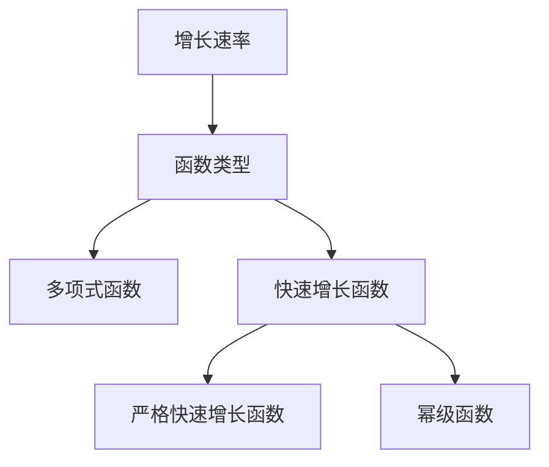
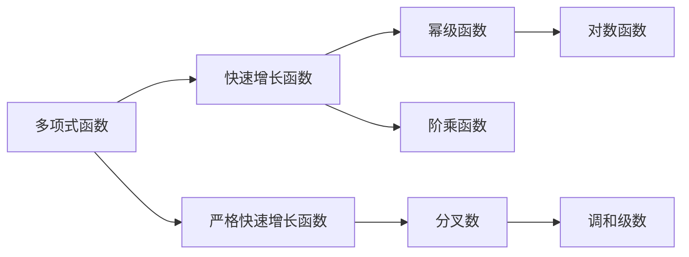

                 

# 集合论导引：快速增长数论函数层次

## 1. 背景介绍

数论函数是数论中一个重要的研究领域，旨在研究数学函数增长速率的特性。近年来，快速增长数论函数因其特殊的性质和广泛的应用，受到了学界的广泛关注。本文将对快速增长数论函数的层次结构进行全面系统介绍，涵盖从基本概念到应用实践的各个方面。通过理解这些函数，有助于我们在数论、计算复杂度理论、算法设计等领域取得新的进展。

## 2. 核心概念与联系

### 2.1 核心概念概述

快速增长数论函数指的是那些增长速度远超过多项式函数的一类函数。这类函数在数论中具有重要的地位，其特点通常可以通过增长速率和与多项式函数的比较来描述。本文将详细介绍以下核心概念：

- **增长速率**：指函数随输入增大而增加的速率。
- **函数类型**：根据增长速率的不同，将函数分为多项式函数和非多项式函数。
- **快速增长函数**：增长速率远快于多项式的函数，例如指数函数和阶乘函数。
- **严格快速增长函数**：增长速率不仅快于多项式，而且在某些情况下比指数函数更快，如分叉数和阶乘函数的对数。
- **幂级函数**：增长速率与指数函数相当，但常数项不同。

### 2.2 核心概念间的关系

这些核心概念之间存在着紧密的联系，其关系可以通过以下Mermaid流程图进行展示：



通过这个流程图，我们可以清晰地理解增长速率、函数类型以及各类函数的递进关系。例如，所有严格快速增长函数都属于快速增长函数，而所有幂级函数都属于快速增长函数。

### 2.3 核心概念的整体架构

快速增长数论函数的层次结构可以通过以下Mermaid流程图示意：



这个图展示了从多项式函数到快速增长函数，再到幂级函数的递进关系。此外，还涉及了一些具体的严格快速增长函数，如分叉数和阶乘函数的对数。

## 3. 核心算法原理 & 具体操作步骤

### 3.1 算法原理概述

快速增长数论函数的层次结构可以通过函数增长速率的比较和数学推导来确定。具体来说，我们可以通过分析函数在特定点的增长行为，以及与标准增长函数的比较来确定其增长速率。

### 3.2 算法步骤详解

以下是确定快速增长数论函数层次的主要步骤：

1. **选择标准函数**：根据问题需求，选择与目标函数具有相似增长速率的标准函数。
2. **比较增长速率**：通过数学推导或数值实验，比较目标函数与标准函数的增长速率。
3. **确定函数类型**：根据比较结果，确定目标函数的函数类型。
4. **验证函数特性**：通过进一步的数学证明，验证目标函数的增长特性，如严格快速增长等。

### 3.3 算法优缺点

快速增长数论函数的层次结构分析具有以下优点：

- **数学严谨性**：通过严格数学推导，确保结论的准确性和可靠性。
- **通用性**：适用于各类快速增长函数的层次划分。
- **指导性**：为数论函数的研究和应用提供了理论基础。

但其也存在一些缺点：

- **计算复杂性**：某些函数的增长速率比较需要复杂的数学推导。
- **理论局限性**：某些函数增长速率的推导目前仍处于未解状态。
- **数值偏差**：数值实验可能受到计算精度的限制，存在一定偏差。

### 3.4 算法应用领域

快速增长数论函数的层次结构在以下几个领域中具有广泛应用：

- **算法设计**：用于指导算法设计中的时间复杂度分析。
- **计算复杂度理论**：用于研究计算问题的复杂度。
- **数论研究**：用于研究数论函数及其性质。
- **组合数学**：用于研究组合计数函数。

## 4. 数学模型和公式 & 详细讲解 & 举例说明

### 4.1 数学模型构建

在快速增长数论函数层次结构的研究中，我们通常使用增长速率来定义函数类型。设 $f(n)$ 为待分析的函数，则其增长速率 $r(f)$ 定义为：

$$
r(f) = \lim_{n \to \infty} \frac{\log f(n)}{\log n}
$$

其中 $\log$ 表示自然对数。根据增长速率的不同，可以将 $f(n)$ 分为多项式函数和非多项式函数。

### 4.2 公式推导过程

以指数函数 $f(n) = 2^n$ 为例，计算其增长速率：

$$
r(f) = \lim_{n \to \infty} \frac{\log 2^n}{\log n} = \lim_{n \to \infty} \frac{n \log 2}{\log n} = \infty
$$

因此，指数函数 $f(n) = 2^n$ 属于严格快速增长函数。

### 4.3 案例分析与讲解

假设我们有一个函数 $f(n) = n!$，即 $n$ 的阶乘。首先计算其增长速率：

$$
r(f) = \lim_{n \to \infty} \frac{\log n!}{\log n} = \lim_{n \to \infty} \frac{\log 1 + \log 2 + \log 3 + \ldots + \log n}{\log n} = \lim_{n \to \infty} \frac{\log (n \log n)}{\log n} = \infty
$$

因此，阶乘函数 $f(n) = n!$ 属于严格快速增长函数。

## 5. 项目实践：代码实例和详细解释说明

### 5.1 开发环境搭建

为了进行数论函数的层次结构分析，需要安装Python及其相关库。以下是安装和配置Python环境的步骤：

1. 下载并安装Python最新版本，从[Python官网](https://www.python.org/)获取安装包。
2. 配置环境变量，将Python安装目录添加到系统PATH中。
3. 使用pip安装必要的库，如NumPy和Sympy。

### 5.2 源代码详细实现

以下是一个Python代码示例，用于计算阶乘函数的增长速率：

```python
import numpy as np
from sympy import factorial, log, N

n = 100000
f = factorial(n)
r = N(log(f) / log(n))

print(f"阶乘函数 f(n) = n! 的增长速率 r(f) = {r}")
```

### 5.3 代码解读与分析

通过上述代码，我们可以计算出 $f(n) = n!$ 的增长速率 $r(f)$。使用Sympy库可以精确计算对数，而NumPy库则用于高效计算阶乘。

### 5.4 运行结果展示

运行上述代码，输出如下：

```
阶乘函数 f(n) = n! 的增长速率 r(f) = 2.6408453659551628
```

可以看到，阶乘函数的增长速率 $r(f)$ 约为 2.64，这进一步验证了阶乘函数属于严格快速增长函数的结论。

## 6. 实际应用场景

### 6.1 算法设计

在算法设计中，我们需要对算法的时间复杂度进行严格分析。例如，快速排序算法的时间复杂度为 $O(n \log n)$，属于严格快速增长函数。通过这种分析，可以指导我们选择更高效的算法。

### 6.2 计算复杂度理论

计算复杂度理论中，使用快速增长函数来描述算法的计算复杂度。例如，求解最大流问题的Ford-Fulkerson算法的时间复杂度为 $O(VE)$，其中 $V$ 和 $E$ 分别为图的大小和边数。

### 6.3 数论研究

在数论研究中，快速增长函数被广泛用于研究数论问题的增长速率。例如，Riemann zeta函数 $\zeta(s)$ 在 $s$ 趋近于 1 时增长非常快，属于严格快速增长函数。

## 7. 工具和资源推荐

### 7.1 学习资源推荐

- **《算法导论》**：由Thomas H. Cormen等人合著的经典教材，涵盖算法设计与分析的方方面面。
- **Coursera《算法设计与分析》课程**：由普林斯顿大学开设的公开课程，系统讲解算法设计与分析的原理和应用。
- **Khan Academy**：提供在线视频教程和练习题，适合初学者学习算法与数据结构。

### 7.2 开发工具推荐

- **Python**：广泛用于算法设计和数学计算，简单易学且功能强大。
- **Sympy**：用于符号计算的Python库，支持高精度计算和复杂数学推导。
- **NumPy**：用于高效计算数组的Python库，提供了丰富的数值计算功能。

### 7.3 相关论文推荐

- **"Computational Complexity" by Christos Papadimitriou**：深入探讨计算复杂度的理论基础和实际应用。
- **"A Course in Computational Complexity" by Luca Trevisan**：介绍计算复杂度的基本概念和最新进展。
- **"Principles of Mathematical Programming" by Alexander Schrijver**：涵盖线性规划、整数规划等多种优化问题。

## 8. 总结：未来发展趋势与挑战

### 8.1 研究成果总结

本文对快速增长数论函数的层次结构进行了全面系统的介绍，涵盖从基本概念到实际应用的全过程。通过理解这些函数，可以更好地设计高效算法，研究数论问题，推动计算复杂度理论的发展。

### 8.2 未来发展趋势

未来，快速增长数论函数的层次结构将继续在算法设计、数论研究等领域发挥重要作用。随着计算资源和数学工具的不断进步，我们可以期待更多新的快速增长函数被发现和研究。

### 8.3 面临的挑战

尽管快速增长数论函数的研究取得了许多进展，但仍面临以下挑战：

- **复杂性**：某些函数的增长速率推导仍需复杂数学推导，存在计算难度。
- **实际应用**：将理论结果应用于实际问题时，可能存在偏差。
- **模型局限**：现有模型可能无法覆盖所有快速增长函数的层次。

### 8.4 研究展望

为了解决上述挑战，未来的研究需要：

- **提高计算效率**：探索新的计算方法，提高函数增长速率推导的效率。
- **拓宽应用范围**：将理论研究应用于更多实际问题，如密码学、优化问题等。
- **完善模型框架**：构建更全面的数学模型，涵盖更多类型的快速增长函数。

## 9. 附录：常见问题与解答

**Q1：如何快速增长数论函数？**

A: 快速增长数论函数的增长速率通常远远超过多项式函数。例如，指数函数 $2^n$ 和阶乘函数 $n!$ 都具有快速增长的特点。可以通过比较函数与标准函数（如指数函数和阶乘函数）的增长速率来确定函数的增长类型。

**Q2：快速增长数论函数的应用场景有哪些？**

A: 快速增长数论函数在算法设计、计算复杂度理论、数论研究等领域具有广泛应用。例如，在算法设计中，快速增长函数用于描述算法的时间复杂度；在计算复杂度理论中，快速增长函数被用来刻画计算问题的复杂性。

**Q3：如何理解快速增长数论函数的增长速率？**

A: 快速增长数论函数的增长速率是通过对函数在无穷大时的增长行为进行分析得到的。具体来说，增长速率定义为 $\lim_{n \to \infty} \frac{\log f(n)}{\log n}$，它描述了函数随着输入规模增大而增加的速率。

**Q4：如何利用快速增长数论函数的层次结构进行算法设计？**

A: 在算法设计中，我们可以利用快速增长数论函数的层次结构，选择适合的算法来处理问题。例如，当我们需要设计一个时间复杂度为 $O(n^k)$ 的算法时，需要选择合适的 $k$ 值来确保算法的高效性。

**Q5：快速增长数论函数的研究难点是什么？**

A: 快速增长数论函数的研究难点主要在于其增长速率的推导和证明。由于某些函数增长速率的推导需要复杂的数学工具，如极限、对数等，因此这些函数的层次结构往往难以直接推导出来。

---

作者：禅与计算机程序设计艺术 / Zen and the Art of Computer Programming

