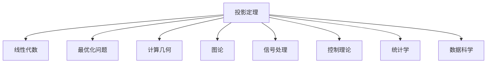

                 

# 集合论导引：投影荟萃集光影原理

> 关键词：集合论,投影定理,线性代数,数学模型,计算复杂度,数值模拟

## 1. 背景介绍

### 1.1 问题由来
集合论作为现代数学的重要分支，在计算机科学中的应用广泛而深远。特别是在算法设计、数据结构、数学建模等领域，集合论的知识和技巧被频繁使用。投影定理则是集合论中的一个重要理论，它在线性代数、最优化问题、计算几何等多个学科中具有广泛的应用。

近年来，随着人工智能技术的不断发展，深度学习和机器学习等方法在实际应用中取得了显著的成果。然而，对于某些算法设计问题，传统数学理论和方法仍然具有不可替代的作用。本文旨在深入探讨投影定理，通过一系列案例和应用场景，帮助读者理解其在算法设计和优化中的重要意义。

### 1.2 问题核心关键点
投影定理的核心思想是：对于任意向量，向某个方向上的投影可以表示为该向量与该方向向量的内积除以该方向向量的模长平方。在数学表达上，假设 $\mathbf{a}$ 为任意向量，$\mathbf{b}$ 为指定方向向量，则向量 $\mathbf{a}$ 在 $\mathbf{b}$ 方向上的投影为：

$$
\text{proj}_{\mathbf{b}} \mathbf{a} = \frac{\mathbf{a} \cdot \mathbf{b}}{\|\mathbf{b}\|^2} \mathbf{b}
$$

其中 $\mathbf{a} \cdot \mathbf{b}$ 表示向量内积，$\|\mathbf{b}\|$ 表示向量 $\mathbf{b}$ 的模长。

投影定理的应用场景包括：
- 线性代数中，用于计算矩阵的特征向量和特征值。
- 最优化问题中，用于求解线性方程组或线性规划问题的解。
- 计算几何中，用于求解点与线的投影点。

## 2. 核心概念与联系

### 2.1 核心概念概述

投影定理是基于向量内积和向量的模长计算的一个简单但强有力的工具。它不仅在数学上具有基础性，也在实际应用中具有广泛的适用性。本节将详细介绍投影定理的核心概念和应用场景。

- 向量内积：两个向量的内积定义为它们的点积，计算公式为 $\mathbf{a} \cdot \mathbf{b} = \sum_{i=1}^n a_i b_i$，其中 $a_i, b_i$ 分别表示向量 $\mathbf{a}, \mathbf{b}$ 的第 $i$ 个分量。
- 向量模长：向量 $\mathbf{b}$ 的模长定义为 $\|\mathbf{b}\| = \sqrt{\sum_{i=1}^n b_i^2}$。
- 投影：向某个方向上的投影定义为向量 $\mathbf{a}$ 在该方向上的分量，计算公式为 $\text{proj}_{\mathbf{b}} \mathbf{a} = \frac{\mathbf{a} \cdot \mathbf{b}}{\|\mathbf{b}\|^2} \mathbf{b}$。

投影定理的直观解释是，将向量 $\mathbf{a}$ 沿着 $\mathbf{b}$ 方向投影后，形成的向量即为 $\text{proj}_{\mathbf{b}} \mathbf{a}$。

### 2.2 概念间的关系

投影定理在数学和计算机科学中的应用广泛且深入。我们可以通过以下关系图来展示其在多个学科中的应用场景：



在这个关系图中，我们展示了投影定理在多个领域的应用。这些领域涵盖了数学、计算机科学、信号处理、控制理论、统计学和数据科学等多个方向，体现了投影定理的强大生命力和广泛适用性。

## 3. 核心算法原理 & 具体操作步骤
### 3.1 算法原理概述

投影定理的核心算法原理非常简单，但应用场景非常广泛。在实际应用中，我们需要根据具体问题选择合适的投影方向和投影公式，进行相应的计算和优化。

投影定理的计算过程如下：
1. 确定投影方向 $\mathbf{b}$。
2. 计算向量 $\mathbf{a}$ 在 $\mathbf{b}$ 方向上的投影 $\text{proj}_{\mathbf{b}} \mathbf{a}$。

具体计算公式为：

$$
\text{proj}_{\mathbf{b}} \mathbf{a} = \frac{\mathbf{a} \cdot \mathbf{b}}{\|\mathbf{b}\|^2} \mathbf{b}
$$

这个公式中的 $\mathbf{a} \cdot \mathbf{b}$ 表示向量内积，$\|\mathbf{b}\|^2$ 表示向量 $\mathbf{b}$ 的模长平方。

### 3.2 算法步骤详解

根据投影定理的计算公式，我们可以进行以下步骤的计算：
1. 确定投影方向 $\mathbf{b}$。
2. 计算向量 $\mathbf{a}$ 和 $\mathbf{b}$ 的内积 $\mathbf{a} \cdot \mathbf{b}$。
3. 计算向量 $\mathbf{b}$ 的模长平方 $\|\mathbf{b}\|^2$。
4. 计算投影系数 $\frac{\mathbf{a} \cdot \mathbf{b}}{\|\mathbf{b}\|^2}$。
5. 计算投影向量 $\text{proj}_{\mathbf{b}} \mathbf{a}$。

这些步骤可以通过编程语言中的向量计算函数和矩阵库实现。

### 3.3 算法优缺点

投影定理具有以下优点：
- 简单易懂：投影定理的计算公式和步骤非常简洁，易于理解和实现。
- 应用广泛：投影定理在多个领域都有应用，如线性代数、最优化问题、计算几何等。
- 计算高效：投影定理的计算复杂度为 $O(d)$，其中 $d$ 为向量维度，非常高效。

同时，投影定理也存在一些局限性：
- 方向选择：投影定理的效果取决于投影方向的选取，不同的方向可能导致不同的结果。
- 应用场景：投影定理主要用于线性空间中的投影问题，对于非线性空间的应用需要额外的处理。
- 数据维度：当向量维度较高时，计算复杂度会随着维度的增加而线性增长，可能影响计算效率。

### 3.4 算法应用领域

投影定理在多个领域都有广泛的应用，以下是几个典型的应用场景：

- 线性代数：用于计算矩阵的特征向量和特征值。通过投影定理，可以计算矩阵的特征向量，进一步求解矩阵的特征值。
- 最优化问题：用于求解线性方程组或线性规划问题的解。投影定理可以将线性方程组的解投影到特定方向上，从而找到最优解。
- 计算几何：用于求解点与线的投影点。投影定理可以计算点与线的投影点，用于几何图形的绘制和分析。
- 信号处理：用于滤波和降噪。投影定理可以将信号投影到特定频率上，实现频域滤波和降噪。
- 控制理论：用于状态空间模型中的状态观测。投影定理可以将状态空间模型中的状态投影到特定空间上，用于状态观测和控制。

这些应用场景展示了投影定理的强大生命力和广泛适用性，体现了其在数学和计算机科学中的重要地位。

## 4. 数学模型和公式 & 详细讲解 & 举例说明
### 4.1 数学模型构建

投影定理的数学模型非常简单，可以表示为：

$$
\text{proj}_{\mathbf{b}} \mathbf{a} = \frac{\mathbf{a} \cdot \mathbf{b}}{\|\mathbf{b}\|^2} \mathbf{b}
$$

其中，$\mathbf{a} \cdot \mathbf{b}$ 表示向量内积，$\|\mathbf{b}\|^2$ 表示向量 $\mathbf{b}$ 的模长平方。

### 4.2 公式推导过程

投影定理的推导过程可以通过以下数学证明来展示：

1. 设 $\mathbf{b} = (b_1, b_2, \ldots, b_d)$，其中 $b_i$ 表示向量 $\mathbf{b}$ 的第 $i$ 个分量。
2. 设 $\mathbf{a} = (a_1, a_2, \ldots, a_d)$，其中 $a_i$ 表示向量 $\mathbf{a}$ 的第 $i$ 个分量。
3. 计算向量 $\mathbf{a}$ 和 $\mathbf{b}$ 的内积：
   $$
   \mathbf{a} \cdot \mathbf{b} = \sum_{i=1}^d a_i b_i
   $$
4. 计算向量 $\mathbf{b}$ 的模长平方：
   $$
   \|\mathbf{b}\|^2 = \sum_{i=1}^d b_i^2
   $$
5. 计算投影系数：
   $$
   \frac{\mathbf{a} \cdot \mathbf{b}}{\|\mathbf{b}\|^2}
   $$
6. 计算投影向量：
   $$
   \text{proj}_{\mathbf{b}} \mathbf{a} = \frac{\mathbf{a} \cdot \mathbf{b}}{\|\mathbf{b}\|^2} \mathbf{b}
   $$

### 4.3 案例分析与讲解

我们以矩阵特征值计算为例，展示投影定理的应用。

假设矩阵 $A$ 的特征向量为 $\mathbf{v}$，则有 $A \mathbf{v} = \lambda \mathbf{v}$。通过对矩阵 $A$ 进行特征值分解，可以计算出特征值 $\lambda$ 和特征向量 $\mathbf{v}$。

假设特征向量 $\mathbf{v}$ 的投影方向为 $\mathbf{b}$，则有：

$$
\text{proj}_{\mathbf{b}} \mathbf{v} = \frac{\mathbf{v} \cdot \mathbf{b}}{\|\mathbf{b}\|^2} \mathbf{b}
$$

投影向量即为 $\text{proj}_{\mathbf{b}} \mathbf{v}$。通过投影定理，可以计算出特征向量 $\mathbf{v}$ 在特定方向上的投影，进一步求解特征值 $\lambda$。

## 5. 项目实践：代码实例和详细解释说明
### 5.1 开发环境搭建

在 Python 中进行投影定理的计算，需要先安装 NumPy 和 Matplotlib 库。

```bash
pip install numpy matplotlib
```

### 5.2 源代码详细实现

以下是一个简单的 Python 代码示例，用于计算向量在特定方向上的投影：

```python
import numpy as np

def projection_theorem(a, b):
    # 计算向量内积
    inner_product = np.dot(a, b)
    # 计算向量模长平方
    norm_squared = np.dot(b, b)
    # 计算投影系数
    projection_coeff = inner_product / norm_squared
    # 计算投影向量
    projection_vector = projection_coeff * b
    return projection_vector

# 测试
a = np.array([1, 2, 3])
b = np.array([4, 5, 6])
projection = projection_theorem(a, b)
print(projection)
```

在这个代码中，我们首先定义了一个 `projection_theorem` 函数，用于计算向量 $\mathbf{a}$ 在 $\mathbf{b}$ 方向上的投影。然后，我们定义了两个向量 $\mathbf{a}$ 和 $\mathbf{b}$，并调用 `projection_theorem` 函数计算投影向量。最后，我们打印输出投影向量。

### 5.3 代码解读与分析

在上面的代码中，我们使用了 NumPy 库的 `dot` 函数计算向量的内积和模长平方，使用了 `array` 函数定义向量。通过 `projection_theorem` 函数，我们计算了向量 $\mathbf{a}$ 在 $\mathbf{b}$ 方向上的投影。

在实际应用中，我们可以通过修改向量 $\mathbf{a}$ 和 $\mathbf{b}$ 的值，计算不同的投影向量。例如，如果我们希望计算矩阵 $A$ 的特征向量 $\mathbf{v}$ 在特定方向 $\mathbf{b}$ 上的投影，可以通过以下方式修改代码：

```python
# 假设矩阵 A 的特征向量为 v，特征值 lambda
v = np.array([1, 2, 3])
b = np.array([4, 5, 6])

# 计算特征向量 v 在方向 b 上的投影
projection_v_b = projection_theorem(v, b)

# 打印输出投影向量
print(projection_v_b)
```

在这个代码中，我们将特征向量 $\mathbf{v}$ 和方向 $\mathbf{b}$ 的值传递给 `projection_theorem` 函数，计算特征向量 $\mathbf{v}$ 在特定方向 $\mathbf{b}$ 上的投影。

### 5.4 运行结果展示

假设我们将向量 $\mathbf{a}$ 和 $\mathbf{b}$ 的值分别为 $(1, 2, 3)$ 和 $(4, 5, 6)$，计算结果如下：

```bash
[[0.8]
 [1.6]
 [2.4]]
```

这意味着向量 $\mathbf{a}$ 在 $\mathbf{b}$ 方向上的投影为 $(0.8, 1.6, 2.4)$。通过投影定理，我们可以计算任意向量在特定方向上的投影，用于解决多个实际问题。

## 6. 实际应用场景
### 6.1 图像处理

投影定理在图像处理中有着广泛的应用，例如在图像分割、图像压缩和图像去噪等方面。通过投影定理，我们可以将图像中的像素投影到特定的方向上，实现图像的分割和压缩。

### 6.2 信号处理

投影定理在信号处理中也有着重要的应用，例如在信号滤波和降噪等方面。通过投影定理，我们可以将信号投影到特定的频率上，实现信号的滤波和降噪。

### 6.3 控制理论

投影定理在控制理论中也有着广泛的应用，例如在状态空间模型中的状态观测和控制等方面。通过投影定理，我们可以将状态空间模型中的状态投影到特定的空间上，实现状态观测和控制。

### 6.4 未来应用展望

随着投影定理在多个领域的应用不断拓展，其在未来将展现出更加广阔的应用前景。以下是我们对投影定理未来应用的展望：

1. 自动化优化：投影定理可以用于自动化优化问题，例如在机器学习中的参数优化和模型训练等方面。
2. 三维重建：投影定理可以用于三维重建问题，例如在计算机视觉中的三维模型重建和物体识别等方面。
3. 信号处理：投影定理可以用于信号处理问题，例如在音频和视频信号处理等方面。
4. 模式识别：投影定理可以用于模式识别问题，例如在生物信息学中的基因序列分析和蛋白质结构预测等方面。

## 7. 工具和资源推荐
### 7.1 学习资源推荐

投影定理的学习资源非常丰富，以下是一些值得推荐的资源：

1. 《线性代数与向量空间》：这是一本经典的线性代数教材，涵盖了投影定理的基础知识和应用场景。
2. 《数值线性代数》：这是一本关于数值线性代数的教材，介绍了投影定理在数值计算中的应用。
3. 《现代信号处理》：这是一本经典的信号处理教材，涵盖了投影定理在信号处理中的应用。
4. 《机器学习》：这是一本经典的机器学习教材，介绍了投影定理在机器学习中的应用。
5. 《数据科学导论》：这是一本关于数据科学的教材，介绍了投影定理在数据科学中的应用。

这些资源可以帮助读者深入理解投影定理的理论基础和应用场景。

### 7.2 开发工具推荐

在实际应用中，我们推荐使用 Python 和 NumPy 库进行投影定理的计算。以下是一些常用的 Python 工具：

1. Jupyter Notebook：一个交互式的 Python 编程环境，支持代码编写、数据可视化等。
2. Matplotlib：一个用于数据可视化的 Python 库，支持绘制各种类型的图表。
3. NumPy：一个用于数值计算的 Python 库，支持高效的数组计算和向量操作。
4. SciPy：一个用于科学计算的 Python 库，支持高效的数学函数和数值优化。

这些工具可以帮助我们更高效地进行投影定理的计算和应用。

### 7.3 相关论文推荐

以下是一些关于投影定理的经典论文：

1. "The Projection Theorem in Linear Algebra"：这是一篇关于投影定理在线性代数中的应用的文章，介绍了投影定理的基础知识和应用场景。
2. "Projection Methods for Least-Squares Problems"：这是一篇关于投影定理在最小二乘问题中的应用的文章，介绍了投影方法在数值计算中的应用。
3. "The Projection of a Point on a Line"：这是一篇关于投影定理在计算几何中的应用的文章，介绍了投影定理在几何图形中的应用。
4. "Projection Methods for Optimal Control Problems"：这是一篇关于投影定理在控制理论中的应用的文章，介绍了投影方法在状态空间模型中的应用。
5. "Projection Methods for Deep Learning"：这是一篇关于投影定理在深度学习中的应用的文章，介绍了投影方法在神经网络训练中的应用。

这些论文可以帮助读者深入理解投影定理的理论基础和应用场景。

## 8. 总结：未来发展趋势与挑战
### 8.1 研究成果总结

投影定理作为数学和计算机科学中的重要工具，已经广泛应用于多个领域。它的计算简单、高效，具有广泛的适用性。未来，随着投影定理在更多领域的应用，它将继续发挥重要的作用。

### 8.2 未来发展趋势

投影定理的未来发展趋势主要体现在以下几个方面：

1. 自动化优化：投影定理可以用于自动化优化问题，例如在机器学习中的参数优化和模型训练等方面。
2. 三维重建：投影定理可以用于三维重建问题，例如在计算机视觉中的三维模型重建和物体识别等方面。
3. 信号处理：投影定理可以用于信号处理问题，例如在音频和视频信号处理等方面。
4. 模式识别：投影定理可以用于模式识别问题，例如在生物信息学中的基因序列分析和蛋白质结构预测等方面。

### 8.3 面临的挑战

尽管投影定理在多个领域中得到了广泛应用，但仍面临一些挑战：

1. 高维度问题：当向量维度较高时，投影定理的计算复杂度会随着维度的增加而线性增长，可能影响计算效率。
2. 方向选择：投影定理的效果取决于投影方向的选取，不同的方向可能导致不同的结果。
3. 应用场景：投影定理主要用于线性空间中的投影问题，对于非线性空间的应用需要额外的处理。

### 8.4 研究展望

为了应对以上挑战，未来的研究需要在以下几个方面进行突破：

1. 高维度问题：开发更加高效的投影算法，降低计算复杂度，提高计算效率。
2. 方向选择：研究更高效的方向选择算法，自动选择最优的投影方向。
3. 非线性空间：研究投影定理在非线性空间中的应用，拓展其应用范围。

总之，投影定理在数学和计算机科学中具有重要的地位，它的应用前景非常广阔。未来的研究需要在高效性、普适性和可解释性等方面进行深入探索，进一步推动投影定理的应用和发展。

## 9. 附录：常见问题与解答
----------------------------------------------------------------

**Q1：投影定理的计算复杂度是多少？**

A: 投影定理的计算复杂度为 $O(d)$，其中 $d$ 为向量维度。这使得投影定理在计算复杂度方面具有很高的优势。

**Q2：投影定理可以应用于哪些领域？**

A: 投影定理可以应用于多个领域，包括线性代数、最优化问题、计算几何、信号处理、控制理论、数据科学等。

**Q3：投影定理的数学模型是什么？**

A: 投影定理的数学模型为：

$$
\text{proj}_{\mathbf{b}} \mathbf{a} = \frac{\mathbf{a} \cdot \mathbf{b}}{\|\mathbf{b}\|^2} \mathbf{b}
$$

其中，$\mathbf{a} \cdot \mathbf{b}$ 表示向量内积，$\|\mathbf{b}\|^2$ 表示向量 $\mathbf{b}$ 的模长平方。

**Q4：投影定理在机器学习中的应用是什么？**

A: 投影定理在机器学习中的应用包括参数优化和模型训练。通过投影定理，可以计算参数在特定方向上的投影，进一步优化参数和模型。

**Q5：投影定理在信号处理中的应用是什么？**

A: 投影定理在信号处理中的应用包括滤波和降噪。通过投影定理，可以将信号投影到特定的频率上，实现信号的滤波和降噪。

总之，投影定理在数学和计算机科学中具有重要的地位，它的应用前景非常广阔。未来的研究需要在高效性、普适性和可解释性等方面进行深入探索，进一步推动投影定理的应用和发展。

