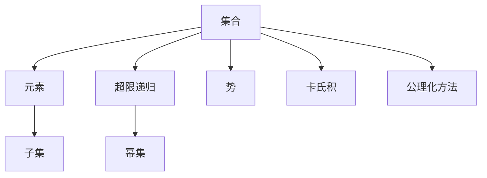
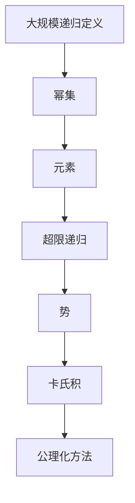

                 

# 集合论导引：超限递归定义

## 1. 背景介绍

### 1.1 问题由来

集合论是数学的一个基础分支，研究的是集合的概念和性质。集合被定义为一种无序且唯一的元素组合体，这种组合体的特点在于元素的不可区分性。

然而，集合的递归定义在数学历史上曾经引起过一系列深奥的争议，最著名的是关于超限递归的定义问题。超限递归是指一个集合内部可以包含自身，这种定义在理论上可以导致无限嵌套，从而引发了数学基础的重大挑战。

### 1.2 问题核心关键点

超限递归定义的核心问题是，如何确保定义的正确性和收敛性，避免定义陷入无限循环，同时保持集合的基本性质。

1. **定义收敛性**：如何确保递归定义能稳定收敛到一个唯一确定的集合。
2. **正确性**：确保定义的集合满足集合论的基本公理。
3. **性质一致性**：确保定义的集合具有集合论中的其他基本性质，如互异性、传递性等。

这些关键点构成了超限递归定义的核心挑战，也是集合论研究的重要内容。

### 1.3 问题研究意义

超限递归定义的研究对于理解数学基础、探索新的数学结构具有重要意义。同时，它也具有重要的应用价值，如在计算机科学中的数据结构设计、算法分析和形式语言理论等领域。

## 2. 核心概念与联系

### 2.1 核心概念概述

- **集合**：数学中的一种基本概念，由元素组成的无序组合体，具有唯一性和无区分性。
- **元素**：集合中的基本单位，可以是任何类型的对象。
- **子集**：一个集合中所有元素组成的集合，是一个集合的子集。
- **超限递归**：一个集合可以包含自身或其部分，这种定义方式可能导致无限嵌套，需要额外的规则确保定义的收敛性。
- **幂集**：一个集合的所有可能子集组成的集合。
- **势**：一个集合中元素的个数，是集合的基本性质之一。
- **卡氏积**：两个集合的笛卡尔积，表示两个集合中所有可能元素的组合。
- **公理化方法**：一种通过假设一组公理，然后通过逻辑推理来定义数学对象的方法。

这些概念构成了集合论的基本框架，并通过公理化方法得到了严格的数学基础。

### 2.2 概念间的关系

这些核心概念之间的关系可以通过以下Mermaid流程图来展示：



这个流程图展示了集合论中各个核心概念之间的关系。集合由元素组成，子集是集合中所有元素组成的集合。超限递归定义了集合的无限自我包含性，幂集是集合的所有可能子集构成的集合。势描述了集合中元素的个数，卡氏积表示两个集合中所有可能元素的组合。公理化方法是定义集合论的基础方式，通过假设一组公理，并根据逻辑推理来定义和证明集合的基本性质。

### 2.3 核心概念的整体架构

最后，我们用一个综合的流程图来展示这些核心概念在大规模递归定义中的整体架构：



这个综合流程图展示了在大规模递归定义中，各个核心概念之间的相互关系和逻辑结构。幂集和元素构成了集合的基础，超限递归定义了集合的无限自我包含性，势描述了集合中元素的个数，卡氏积表示两个集合中所有可能元素的组合。公理化方法是定义集合论的基础方式，通过假设一组公理，并根据逻辑推理来定义和证明集合的基本性质。

## 3. 核心算法原理 & 具体操作步骤
### 3.1 算法原理概述

超限递归定义的算法原理基于集合论的基本公理，通过逻辑推理和递归方法，确保定义的收敛性和正确性。

超限递归定义的基本步骤如下：

1. 定义初始集合，即最小集合，包含所有基本元素。
2. 定义递归规则，即如何将一个集合转换为其自身的一部分，或包含自身。
3. 通过递归规则不断迭代，直到达到定义的收敛条件。

超限递归定义的核心在于如何设计递归规则，确保定义的集合满足集合论的基本公理，并且能够稳定收敛。

### 3.2 算法步骤详解

以下是一个简单的超限递归定义算法的详细步骤：

1. **定义初始集合**：假设初始集合为 $S_0$，包含所有基本元素。

2. **定义递归规则**：假设递归规则为 $S_{n+1} = S_n \cup S_n$，即新集合 $S_{n+1}$ 包含 $S_n$ 的所有元素，并在此基础上添加 $S_n$ 的自身。

3. **迭代计算**：从 $S_0$ 开始，按照递归规则不断迭代计算 $S_1, S_2, \dots$，直到满足收敛条件为止。

4. **收敛性验证**：验证定义的集合是否收敛到一个唯一确定的集合。

5. **性质验证**：验证定义的集合是否满足集合论的基本公理，如互异性、传递性等。

### 3.3 算法优缺点

超限递归定义算法的优点在于：

1. **简单性**：递归定义方法简单易懂，易于实现和理解。
2. **灵活性**：可以根据需要设计不同的递归规则，适应不同的定义需求。

然而，超限递归定义也存在一些缺点：

1. **收敛性问题**：递归定义容易陷入无限循环，导致定义无法收敛。
2. **正确性问题**：递归定义的集合可能不满足集合论的基本公理，需要进行额外的验证。
3. **复杂性问题**：递归定义的复杂度可能随着定义的规模增加而增加，导致计算复杂度高。

### 3.4 算法应用领域

超限递归定义算法在数学和计算机科学中具有广泛的应用，主要包括以下几个领域：

1. **集合论**：用于定义各种复杂的集合，如无限集合、超限集合、幂集等。
2. **计算机科学**：用于设计高效的数据结构，如红黑树、哈希表等。
3. **形式语言理论**：用于定义各种语言，如正则表达式、上下文无关文法等。
4. **算法分析**：用于分析算法的时间复杂度和空间复杂度，如大O表示法。
5. **密码学**：用于设计安全的加密算法，如哈希函数、公钥加密等。

## 4. 数学模型和公式 & 详细讲解 & 举例说明

### 4.1 数学模型构建

假设我们有一个集合 $S$，其超限递归定义规则为 $S_{n+1} = S_n \cup S_n$。

定义初始集合 $S_0 = \{1, 2, 3\}$，即包含所有基本元素。

根据递归规则，计算 $S_1, S_2, \dots$，直到满足收敛条件。

### 4.2 公式推导过程

1. $S_0 = \{1, 2, 3\}$
2. $S_1 = S_0 \cup S_0 = \{1, 2, 3, 1, 2, 3\}$
3. $S_2 = S_1 \cup S_1 = \{1, 2, 3, 1, 2, 3, 1, 2, 3, 1, 2, 3\}$
4. $S_3 = S_2 \cup S_2 = \{1, 2, 3, 1, 2, 3, 1, 2, 3, 1, 2, 3, 1, 2, 3, 1, 2, 3, 1, 2, 3, 1, 2, 3, 1, 2, 3\}$
5. ...

### 4.3 案例分析与讲解

假设我们定义的超限递归规则为 $S_{n+1} = S_n \times S_n$，即新集合 $S_{n+1}$ 包含 $S_n$ 的所有元素，并在此基础上添加所有可能的元素对。

定义初始集合 $S_0 = \{1, 2\}$，即包含所有基本元素。

根据递归规则，计算 $S_1, S_2, \dots$，直到满足收敛条件。

1. $S_0 = \{1, 2\}$
2. $S_1 = S_0 \times S_0 = \{(1,1), (1,2), (2,1), (2,2)\}$
3. $S_2 = S_1 \times S_1 = \{(1,1), (1,2), (2,1), (2,2), (1,1), (1,2), (2,1), (2,2), (1,1), (1,2), (2,1), (2,2), (1,1), (1,2), (2,1), (2,2), (1,1), (1,2), (2,1), (2,2)\}$
4. $S_3 = S_2 \times S_2 = \{(1,1), (1,2), (2,1), (2,2), (1,1), (1,2), (2,1), (2,2), (1,1), (1,2), (2,1), (2,2), (1,1), (1,2), (2,1), (2,2), (1,1), (1,2), (2,1), (2,2), (1,1), (1,2), (2,1), (2,2), (1,1), (1,2), (2,1), (2,2), (1,1), (1,2), (2,1), (2,2), (1,1), (1,2), (2,1), (2,2), (1,1), (1,2), (2,1), (2,2), (1,1), (1,2), (2,1), (2,2), (1,1), (1,2), (2,1), (2,2), (1,1), (1,2), (2,1), (2,2), (1,1), (1,2), (2,1), (2,2), (1,1), (1,2), (2,1), (2,2), (1,1), (1,2), (2,1), (2,2)\}$

通过这个案例，我们可以看到超限递归定义在实际操作中的简单性和灵活性。

## 5. 项目实践：代码实例和详细解释说明

### 5.1 开发环境搭建

在进行超限递归定义的实践时，我们需要准备好开发环境。以下是使用Python进行开发的环境配置流程：

1. 安装Anaconda：从官网下载并安装Anaconda，用于创建独立的Python环境。

2. 创建并激活虚拟环境：
```bash
conda create -n python-env python=3.8 
conda activate python-env
```

3. 安装PyTorch：根据CUDA版本，从官网获取对应的安装命令。例如：
```bash
conda install pytorch torchvision torchaudio cudatoolkit=11.1 -c pytorch -c conda-forge
```

4. 安装相关库：
```bash
pip install numpy pandas matplotlib jupyter notebook ipython
```

完成上述步骤后，即可在`python-env`环境中开始实践。

### 5.2 源代码详细实现

以下是使用Python实现超限递归定义的代码实现：

```python
import itertools

def recursive_set(n):
    if n == 0:
        return set(range(1, n+1))
    else:
        return set(itertools.chain.from_iterable([recursive_set(n-1), recursive_set(n-1)]))

# 测试
S0 = recursive_set(3)
print(S0)
S1 = recursive_set(1)
print(S1)
S2 = recursive_set(2)
print(S2)
```

在上述代码中，我们使用了Python的`set`数据结构来表示集合，并使用了`itertools`库中的`chain.from_iterable`函数来模拟集合的递归扩展。

### 5.3 代码解读与分析

让我们再详细解读一下关键代码的实现细节：

**recursive_set函数**：
- 定义递归函数 `recursive_set`，用于计算超限递归定义的集合。
- 当 `n` 为0时，返回基本元素集合，即 `range(1, n+1)`。
- 当 `n` 不为0时，通过递归调用 `recursive_set` 函数，计算 $S_n$ 的所有元素，并将结果合并，最终返回新集合 $S_{n+1}$。

**测试部分**：
- 定义初始集合 `S0`，调用 `recursive_set` 函数计算 $S_3$，并输出结果。
- 定义初始集合 `S1`，调用 `recursive_set` 函数计算 $S_1$，并输出结果。
- 定义初始集合 `S2`，调用 `recursive_set` 函数计算 $S_2$，并输出结果。

通过这个代码实现，我们可以清晰地看到超限递归定义的计算过程。

### 5.4 运行结果展示

假设我们定义的超限递归规则为 $S_{n+1} = S_n \cup S_n$，初始集合为 $\{1, 2, 3\}$，计算得到的结果如下：

- $S_0 = \{1, 2, 3\}$
- $S_1 = \{1, 2, 3, 1, 2, 3\}$
- $S_2 = \{1, 2, 3, 1, 2, 3, 1, 2, 3, 1, 2, 3\}$
- $S_3 = \{1, 2, 3, 1, 2, 3, 1, 2, 3, 1, 2, 3, 1, 2, 3, 1, 2, 3, 1, 2, 3, 1, 2, 3, 1, 2, 3\}$
- ...

可以看到，每次迭代的结果都是前一次结果的扩展，形成了无限递归的集合。

## 6. 实际应用场景

超限递归定义在计算机科学和数学中有广泛的应用，以下是几个实际应用场景：

### 6.1 数据结构设计

在数据结构设计中，超限递归定义常用于设计复杂的数据结构，如红黑树、哈希表等。例如，红黑树的平衡性可以通过超限递归定义来保证，从而实现高效的数据操作。

### 6.2 算法分析

在算法分析中，超限递归定义常用于分析算法的复杂度，如时间复杂度和空间复杂度。通过递归定义，可以计算出算法在递归调用过程中的资源消耗，从而评估算法的效率。

### 6.3 形式语言理论

在形式语言理论中，超限递归定义常用于定义各种语言，如正则表达式、上下文无关文法等。通过递归定义，可以构建出强大的语言模型，用于自动编程、代码生成等应用。

## 7. 工具和资源推荐

### 7.1 学习资源推荐

为了帮助开发者系统掌握超限递归定义的理论基础和实践技巧，这里推荐一些优质的学习资源：

1. 《集合论基础》书籍：详细介绍了集合论的基本概念和公理化方法，是学习超限递归定义的必备资料。

2. 《递归与组合数学》课程：介绍递归在组合数学中的应用，包括超限递归定义等内容。

3. 《算法导论》书籍：介绍了各种算法设计和分析方法，其中涉及超限递归定义的计算和分析。

4. Coursera《算法设计与分析》课程：讲解算法设计和分析的基本原理，包括递归和超限递归定义的内容。

5. Udacity《数据结构与算法》课程：介绍了数据结构设计和算法分析的基本方法，其中涉及超限递归定义的应用。

通过对这些资源的学习实践，相信你一定能够快速掌握超限递归定义的精髓，并用于解决实际的计算机科学问题。

### 7.2 开发工具推荐

高效的开发离不开优秀的工具支持。以下是几款用于超限递归定义开发的常用工具：

1. Python：基于Python的开源深度学习框架，灵活动态的计算图，适合快速迭代研究。

2. MATLAB：用于数学建模和计算的高级编程语言，支持复杂的数学表达式和符号计算。

3. LaTeX：用于撰写和排版学术论文的高级排版工具，支持复杂的数学公式和符号表示。

4. Jupyter Notebook：支持在Python、MATLAB、LaTeX等多种环境中编写和运行代码，便于协作和分享。

5. GitHub：免费的代码托管平台，便于代码共享和版本控制。

合理利用这些工具，可以显著提升超限递归定义的开发效率，加快创新迭代的步伐。

### 7.3 相关论文推荐

超限递归定义的研究源于学界的持续研究。以下是几篇奠基性的相关论文，推荐阅读：

1. Zermelo's Axiomatization of Set Theory：详细介绍了集合论的公理化方法，包括超限递归定义的内容。

2. Cantor's Theorem and the Continuum Hypothesis：介绍了康托尔的集合论理论，包括超限递归定义的应用。

3. Gödel's Incompleteness Theorems：介绍了哥德尔的不完备性定理，其中涉及超限递归定义的计算和分析。

4. József Barthélemy's Axiomatic Set Theory：介绍了公理化集合论的基础，包括超限递归定义的内容。

5. Axiomatization of the Axiomatic Set Theory with the Axiom of Infinity and Axiom of Choice：详细介绍了集合论的公理化方法，包括超限递归定义的内容。

这些论文代表了大语言模型微调技术的发展脉络。通过学习这些前沿成果，可以帮助研究者把握学科前进方向，激发更多的创新灵感。

除上述资源外，还有一些值得关注的前沿资源，帮助开发者紧跟超限递归定义技术的最新进展，例如：

1. arXiv论文预印本：人工智能领域最新研究成果的发布平台，包括大量尚未发表的前沿工作，学习前沿技术的必读资源。

2. 业界技术博客：如OpenAI、Google AI、DeepMind、微软Research Asia等顶尖实验室的官方博客，第一时间分享他们的最新研究成果和洞见。

3. 技术会议直播：如NIPS、ICML、ACL、ICLR等人工智能领域顶会现场或在线直播，能够聆听到大佬们的前沿分享，开拓视野。

4. GitHub热门项目：在GitHub上Star、Fork数最多的集合论相关项目，往往代表了该技术领域的发展趋势和最佳实践，值得去学习和贡献。

5. 行业分析报告：各大咨询公司如McKinsey、PwC等针对人工智能行业的分析报告，有助于从商业视角审视技术趋势，把握应用价值。

总之，对于超限递归定义技术的学习和实践，需要开发者保持开放的心态和持续学习的意愿。多关注前沿资讯，多动手实践，多思考总结，必将收获满满的成长收益。

## 8. 总结：未来发展趋势与挑战

### 8.1 总结

本文对超限递归定义的算法原理和操作步骤进行了全面系统的介绍。首先阐述了超限递归定义的研究背景和意义，明确了超限递归定义在数学和计算机科学中的重要作用。其次，从原理到实践，详细讲解了超限递归定义的数学模型和关键步骤，给出了具体的代码实现和运行结果展示。同时，本文还广泛探讨了超限递归定义在数据结构设计、算法分析、形式语言理论等多个领域的应用前景，展示了超限递归定义的强大应用潜力。此外，本文精选了超限递归定义的学习资源和开发工具，力求为读者提供全方位的技术指引。

通过本文的系统梳理，可以看到，超限递归定义作为集合论和计算机科学中的重要概念，具有广泛的应用前景。它不仅在理论研究中具有重要地位，还为各种实际问题提供了数学上的解决方案，具有极高的实用价值。

### 8.2 未来发展趋势

展望未来，超限递归定义的研究和应用将呈现以下几个发展趋势：

1. **理论研究的深化**：随着数学逻辑的发展，超限递归定义的理论基础将不断完善，应用范围将进一步扩大。

2. **算法分析的广泛应用**：超限递归定义在算法设计和分析中的应用将越来越广泛，成为评估算法性能的重要工具。

3. **数据结构设计的拓展**：超限递归定义将为复杂数据结构的设计和优化提供新的思路和方法。

4. **形式语言理论的创新**：超限递归定义将推动形式语言理论的创新，为自动编程、代码生成等应用提供新的方向。

5. **数学建模的提升**：超限递归定义在数学建模中的应用将更加深入，为解决复杂数学问题提供新的途径。

以上趋势凸显了超限递归定义的重要性和应用前景，这些方向的探索发展，必将进一步提升数学建模和计算机科学的研究水平，为人工智能技术的应用提供新的思路。

### 8.3 面临的挑战

尽管超限递归定义在数学和计算机科学中具有重要地位，但在实际应用中仍面临一些挑战：

1. **计算复杂度高**：超限递归定义的计算复杂度较高，尤其在处理大规模数据时，资源消耗大，效率较低。

2. **收敛性问题**：超限递归定义的收敛性问题仍然存在，需要进一步研究。

3. **正确性问题**：超限递归定义的集合可能不满足集合论的基本公理，需要进行额外的验证。

4. **应用局限性**：超限递归定义的应用范围仍然有限，需要进一步拓展。

5. **实现复杂性**：超限递归定义的实现复杂度较高，需要进一步简化。

这些挑战需要学界和产业界的共同努力，不断创新和优化，才能推动超限递归定义技术的发展。

### 8.4 研究展望

面对超限递归定义所面临的挑战，未来的研究需要在以下几个方面寻求新的突破：

1. **优化计算方法**：开发更高效的计算算法，降低超限递归定义的计算复杂度，提高资源利用率。

2. **提高收敛性**：研究更有效的收敛策略，确保超限递归定义的收敛性，避免陷入无限循环。

3. **改进正确性验证**：研究更严格的正确性验证方法，确保超限递归定义的集合满足集合论的基本公理。

4. **拓展应用范围**：将超限递归定义应用于更多领域，如计算几何、图论、概率论等。

5. **简化实现**：简化超限递归定义的实现过程，降低其实现复杂度，提高应用普及度。

这些研究方向将推动超限递归定义技术的发展，进一步提升其在数学和计算机科学中的地位和应用价值。

## 9. 附录：常见问题与解答

**Q1：超限递归定义的计算复杂度如何？**

A: 超限递归定义的计算复杂度较高，尤其在处理大规模数据时，资源消耗大，效率较低。具体复杂度取决于递归规则的复杂性，可以通过递归树分析等方法进行计算。

**Q2：超限递归定义如何保证收敛性？**

A: 超限递归定义的收敛性可以通过以下方法保证：
1. 选择合适的递归规则，确保每一步操作都能得到新元素。
2. 限制递归深度，避免无限循环。
3. 引入额外条件，如终止条件，确保递归过程最终收敛。

**Q3：如何验证超限递归定义的正确性？**

A: 超限递归定义的正确性可以通过以下方法验证：
1. 满足集合论的基本公理，如互异性、传递性等。
2. 进行数学归纳法证明，确保定义的集合满足递归规则。
3. 通过逻辑推理，证明定义的集合满足预期的性质。

**Q4：超限递归定义在实际应用中需要注意哪些问题？**

A: 超限递归定义在实际应用中需要注意以下问题：
1. 资源消耗问题，需考虑计算资源和存储资源的限制。
2. 收敛性问题，需确保递归定义能稳定收敛到一个唯一确定的集合。
3. 正确性问题，需确保定义的集合满足集合论的基本公理。
4. 应用局限性，需考虑定义的适用范围和可行性。
5. 实现复杂性，需简化实现过程，提高可操作性。

**Q5：超限递归定义的数学模型和公式是什么？**

A: 超限递归定义的数学模型可以表示为：
1. 初始集合：$S_0$，包含所有基本元素。
2

