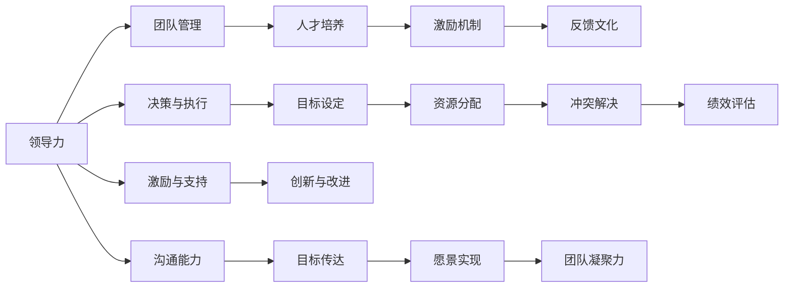
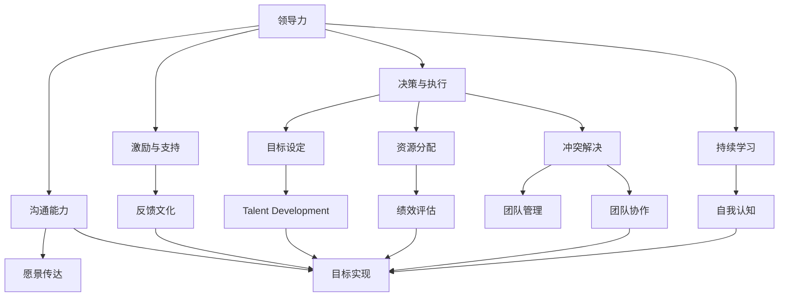

                 

# 领导技能：帮助他人成长，让他们变得更优秀

> 关键词：领导力, 团队管理, 人才培养, 激励机制, 反馈文化

## 1. 背景介绍

### 1.1 问题由来
在现代商业环境中，企业的发展不再仅仅依赖于单个领导者的决策和创新能力，而是需要依靠整个团队的协作和共同努力。面对快速变化的市场和技术环境，领导技能的重要性日益凸显。一个优秀的领导者不仅能够带领团队克服困难，达成目标，还能够通过激励和培养人才，激发团队成员的最大潜力，实现企业的可持续发展。

### 1.2 问题核心关键点
本文聚焦于如何通过有效的领导技能，帮助他人成长，让他们变得更优秀。这不仅关系到个体的职业发展，还直接影响到团队的凝聚力和企业的发展速度。优秀的领导者应该具备以下几方面的关键能力：

- **自我认知**：理解自己的优势和劣势，保持开放心态，持续学习和提升。
- **沟通能力**：能够清晰、有效地与团队成员沟通，传达愿景和目标。
- **激励与支持**：识别团队成员的需求和潜力，提供个性化激励和支持。
- **团队协作**：促进团队成员之间的合作与协调，建立信任和协作文化。
- **决策与执行**：在复杂多变的环境中，做出明智的决策并有效执行。

### 1.3 问题研究意义
掌握领导技能，帮助他人成长，对于企业来说，是推动团队协作、提升整体绩效的关键因素。对于领导者个人，则是实现自我价值，提升职业满意度的重要途径。本文将深入探讨领导技能的核心概念、理论基础和实际操作，为有志于成为优秀领导者的读者提供实用的指导。

## 2. 核心概念与联系

### 2.1 核心概念概述

为了更好地理解领导技能的实践，我们需要明确几个核心概念：

- **领导力(Ledership)**：指的是引导和激励团队实现共同目标的能力。领导力不仅体现在决策和执行上，更在于激发团队成员的内在动力。
- **团队管理(Team Management)**：涉及资源的分配、团队的协调、冲突的解决等管理活动，旨在最大化团队的整体效率和绩效。
- **人才培养(Talent Development)**：通过持续的学习和发展机会，提升团队成员的专业能力和素质，为团队注入新的活力。
- **激励机制(Motivation Mechanism)**：设计合理的激励措施，激发团队成员的积极性和创造力，营造正向的团队氛围。
- **反馈文化(Feedback Culture)**：建立开放、建设性的反馈机制，促进个人和团队的持续改进。

这些概念之间的联系可以理解为：领导力是核心，通过团队管理来协调资源和冲突，通过人才培养来提升整体素质，通过激励机制来激发成员积极性，通过反馈文化来实现持续改进。领导技能的实践就是将这些概念融合到实际工作中，帮助团队成员实现个人和团队的共同成长。

### 2.2 概念间的关系

这些核心概念之间的联系可以通过以下Mermaid流程图来展示：



这个流程图展示了领导技能的核心概念及其之间的关系：

1. 领导力作为核心，指导团队管理、人才培养和激励机制的实施。
2. 团队管理通过目标设定、资源分配和冲突解决等活动，为团队提供有序的运作环境。
3. 人才培养旨在提升团队成员的专业能力，为其提供成长空间。
4. 激励机制通过合理的激励措施，激发团队成员的积极性和创造力。
5. 反馈文化通过开放、建设性的反馈，促进个人和团队的持续改进。
6. 决策与执行是领导力的具体体现，需要结合目标设定和资源分配，解决冲突，评估绩效。
7. 激励与支持是领导力在微观层面的具体实践，旨在提升团队凝聚力和创新能力。
8. 沟通能力是领导力的基础，通过愿景传达和目标实现，促进团队的共同前进。

### 2.3 核心概念的整体架构

最后，我们用一个综合的流程图来展示这些核心概念在大规模领导技能实践中的整体架构：



这个综合流程图展示了从领导力的决策与执行到团队管理的绩效评估，从激励与支持到人才培养的反馈文化，再到沟通能力的愿景传达，整个过程构成了一个完整的领导技能实践框架。通过这个框架，我们可以更清晰地理解领导技能在实际应用中的各个环节和要素。

## 3. 核心算法原理 & 具体操作步骤
### 3.1 算法原理概述

领导技能的提升和应用，本质上是一个持续改进的过程。其核心在于通过系统的培训、合理的激励和有效的反馈，帮助团队成员不断提升个人能力和团队协作水平。这一过程可以概括为以下几个步骤：

1. **目标设定**：明确团队和个人的短期与长期目标，确保团队成员对目标的理解一致。
2. **资源分配**：合理分配资源，确保每个团队成员都有所需的资源来达成目标。
3. **激励与支持**：提供个性化的激励和支持，激发成员的积极性和创造力。
4. **反馈与改进**：建立开放、建设性的反馈机制，促进个人和团队的持续改进。
5. **评估与调整**：定期评估团队绩效，根据反馈调整目标和策略。

### 3.2 算法步骤详解

以下是一个详细的领导技能提升操作步骤：

#### 步骤1：目标设定
- **明确愿景与使命**：领导者应清晰定义团队的目标、愿景和使命，确保团队成员对未来方向有共同的认识。
- **设定SMART目标**：目标应具有具体性(Specific)、可衡量性(Measurable)、可达成性(Achievable)、相关性(Relevant)、时限性(Time-bound)。

#### 步骤2：资源分配
- **识别关键资源**：包括人力、物力、财力等，确保资源的合理分配。
- **优化资源配置**：通过优化资源配置，确保团队成员能够高效地使用可用资源。

#### 步骤3：激励与支持
- **个性化激励**：根据团队成员的兴趣、需求和贡献，设计个性化的激励措施。
- **持续支持**：提供持续的培训和发展机会，帮助成员提升能力和素质。

#### 步骤4：反馈与改进
- **建立反馈机制**：定期进行一对一、一对多的反馈会谈，收集成员的反馈意见。
- **建设性反馈**：反馈应具体、客观，同时注重鼓励和建设性意见。

#### 步骤5：评估与调整
- **绩效评估**：定期评估团队和个人的绩效，识别优势和改进空间。
- **调整目标和策略**：根据评估结果，调整目标和策略，确保团队持续向前。

### 3.3 算法优缺点
领导技能的提升和应用具有以下优点：

- **提升团队绩效**：通过明确的目标、合理的资源分配和有效的激励，提升团队的整体绩效。
- **促进个人成长**：通过持续的培训和反馈，促进团队成员的个人成长和职业发展。
- **增强团队凝聚力**：通过明确的愿景和共同的使命，增强团队的凝聚力和战斗力。

然而，这一过程也面临一些挑战：

- **资源有限**：特别是在资源有限的情况下，如何合理分配资源，是一个复杂的问题。
- **反馈不足**：有些团队成员可能不善于或不愿意提供反馈，导致反馈机制不完善。
- **激励多样性**：不同的成员对激励的需求和反应不同，如何设计个性化的激励措施，是一个需要精细管理的问题。
- **文化差异**：不同文化背景的成员可能有不同的价值观和行为模式，如何理解和尊重这些差异，也是一个重要的挑战。

### 3.4 算法应用领域

领导技能的应用领域非常广泛，涵盖企业、政府、非营利组织等各个领域。以下列举几个典型的应用场景：

1. **企业管理**：通过明确的目标和资源分配，提高企业的运营效率和市场竞争力。
2. **教育培训**：通过个性化的激励和持续支持，促进学生和教师的成长和提升。
3. **公共管理**：通过有效的沟通和反馈机制，提升政府的公共服务质量和公众满意度。
4. **非营利组织**：通过合理的激励和支持，提升志愿者的积极性和参与度。

这些应用场景展示了领导技能在不同领域中的广泛应用和重要价值。

## 4. 数学模型和公式 & 详细讲解 & 举例说明

### 4.1 数学模型构建

为了更好地理解领导技能的数学模型，我们可以将团队管理的目标和资源分配模型化。假设有一个由 $N$ 个成员组成的团队，每个成员的目标为 $T_i$，可用资源为 $R_i$。则团队管理的数学模型可以表示为：

$$
\max_{T_1,...,T_N, R_1,...,R_N} \sum_{i=1}^N \alpha_i T_i - \beta_i R_i
$$

其中 $\alpha_i$ 和 $\beta_i$ 分别是成员 $i$ 的目标权值和资源成本系数。这个模型需要最大化团队目标的实现，同时最小化资源成本。

### 4.2 公式推导过程

为了解这个优化问题，我们需要进行以下步骤：

1. **目标函数**：
   - 最大化团队目标：$\max_{T_1,...,T_N} \sum_{i=1}^N \alpha_i T_i$
   - 最小化资源成本：$\min_{R_1,...,R_N} \sum_{i=1}^N \beta_i R_i$

2. **约束条件**：
   - 目标总和约束：$\sum_{i=1}^N T_i = T_{total}$
   - 资源总和约束：$\sum_{i=1}^N R_i = R_{total}$
   - 资源分配约束：$R_i \geq 0$

3. **拉格朗日乘子法**：
   - 引入拉格朗日乘子 $\lambda_1$ 和 $\lambda_2$，构建拉格朗日函数：
   $$
   L(\lambda_1, \lambda_2) = \sum_{i=1}^N \alpha_i T_i + \lambda_1(T_{total} - \sum_{i=1}^N T_i) + \lambda_2(R_{total} - \sum_{i=1}^N R_i) + \sum_{i=1}^N \lambda_{i,1}(R_i - \beta_i R_i)
   $$

4. **求解优化问题**：
   - 对每个变量求偏导数，设置梯度为零，解方程组得到最优解：
   $$
   \frac{\partial L}{\partial T_i} = \alpha_i - \lambda_1 = 0
   $$
   $$
   \frac{\partial L}{\partial R_i} = \lambda_{i,1} - \beta_i - \lambda_2 = 0
   $$
   $$
   \frac{\partial L}{\partial \lambda_1} = T_{total} - \sum_{i=1}^N T_i = 0
   $$
   $$
   \frac{\partial L}{\partial \lambda_2} = R_{total} - \sum_{i=1}^N R_i = 0
   $$
   $$
   \frac{\partial L}{\partial \lambda_{i,1}} = R_i - \beta_i R_i = 0
   $$

### 4.3 案例分析与讲解

假设有一个由5名成员组成的团队，他们的目标是完成10个项目。每个项目需要的资源成本不同，资源总和为1000。根据上述数学模型，我们可以进行如下计算：

- 假设成员 $i$ 完成项目的权值为 $\alpha_i = 1$，完成项目所需的资源为 $R_i$。
- 目标总和约束为 $\sum_{i=1}^N T_i = 10$
- 资源总和约束为 $\sum_{i=1}^N R_i = 1000$
- 资源分配约束为 $R_i \geq 0$

通过求解上述方程组，我们可以得到最优的资源分配方案和项目完成方案。这个案例展示了领导技能在资源分配和目标设定中的应用。

## 5. 项目实践：代码实例和详细解释说明

### 5.1 开发环境搭建

为了实现领导技能的提升和应用，我们可以使用Python和Jupyter Notebook进行开发。以下是一个简单的开发环境搭建步骤：

1. 安装Python和Jupyter Notebook：
   ```bash
   sudo apt-get install python3-pip python3-dev python3-venv
   pip3 install jupyterlab
   ```

2. 创建虚拟环境：
   ```bash
   python3 -m venv myenv
   source myenv/bin/activate
   ```

3. 安装必要的库：
   ```bash
   pip install numpy scipy pandas matplotlib seaborn
   ```

### 5.2 源代码详细实现

以下是一个简单的Python代码示例，用于计算资源分配和目标实现：

```python
import numpy as np

# 目标总和
T_total = 10
# 资源总和
R_total = 1000

# 目标权值和资源成本
alpha = np.array([1, 1, 1, 1, 1])
beta = np.array([20, 30, 25, 15, 10])

# 求解优化问题
def optimize(T, R):
    return (T - T_total) @ alpha + (R - R_total) @ beta

# 目标函数和约束条件
def solve():
    lambda1 = 0
    lambda2 = 0
    for i in range(5):
        # 求解资源分配
        R_i = lambda1 * beta[i] + lambda2
        # 求解目标完成
        T_i = alpha[i] - lambda1
        # 更新拉格朗日乘子
        lambda1 += (R_i - beta[i]) / alpha[i]
        lambda2 += R_i - beta[i]
    return T_i, R_i

# 求解最优解
T_opt, R_opt = solve()

# 输出最优解
print(f"目标完成情况：{T_opt}")
print(f"资源分配情况：{R_opt}")
```

### 5.3 代码解读与分析

这个Python代码示例展示了如何使用拉格朗日乘子法求解资源分配和目标实现的最优解。通过定义目标权值、资源成本、约束条件和优化函数，我们可以计算出最优的资源分配方案和目标实现方案。在代码中，我们使用了numpy库进行矩阵运算，使得计算过程更加高效。

## 6. 实际应用场景

### 6.1 智能客服系统

在智能客服系统中，领导技能的应用可以通过以下几个方面来实现：

1. **明确服务目标**：确保客服团队明确服务标准和质量要求，提升客户满意度。
2. **资源分配**：合理分配客服资源，确保高峰期的服务能力和应对能力。
3. **激励机制**：设计个性化的激励措施，如服务质量奖、客户好评奖等，激发客服人员的积极性和创造力。
4. **反馈机制**：建立开放、建设性的反馈机制，定期收集客户和员工的反馈意见，持续改进服务质量。

### 6.2 金融理财顾问

在金融理财顾问中，领导技能的应用可以体现在以下几个方面：

1. **明确理财目标**：帮助客户明确财务目标和风险偏好，制定个性化的理财方案。
2. **资源配置**：合理配置投资资源，根据客户需求调整投资组合。
3. **激励支持**：通过持续的支持和培训，提升理财顾问的专业能力和服务水平。
4. **反馈改进**：建立透明的反馈机制，收集客户反馈，不断优化理财服务。

### 6.3 企业人力资源管理

在企业人力资源管理中，领导技能的应用可以体现在以下几个方面：

1. **人才招聘**：明确企业的人才需求和招聘目标，通过合理的激励措施吸引和留住优秀人才。
2. **员工培训**：制定个性化的培训计划，提升员工的技能和素质，增强团队的整体竞争力。
3. **绩效评估**：建立公正、透明的绩效评估体系，激发员工的积极性和创造力。
4. **团队建设**：通过团队建设活动和团队协作机制，增强员工的凝聚力和归属感。

### 6.4 未来应用展望

随着领导技能的不断发展和应用，未来将在更多领域和场景中展现出其重要价值。例如：

- **医疗健康**：通过明确医疗目标和资源分配，提升医疗服务的效率和质量。
- **环境保护**：通过明确环保目标和资源配置，推动绿色可持续发展。
- **教育培训**：通过明确教育目标和激励机制，提升教育质量和学生满意度。

总之，领导技能在各个领域中的应用前景广阔，其核心价值在于通过系统化的方法提升团队的整体绩效和成员的个人成长。

## 7. 工具和资源推荐

### 7.1 学习资源推荐

为了帮助读者系统掌握领导技能，这里推荐一些优质的学习资源：

1. **《领导力》系列课程**：由各大高校和在线教育平台提供的领导力课程，包括经典管理理论、现代领导实践等。
2. **《从优秀到卓越》**：吉姆·柯林斯的研究成果，深入分析了企业成功的领导力要素。
3. **《赋能》**：《哈佛商业评论》专栏作家丹尼尔·平克关于激励和赋能的深度思考。
4. **《高效能人士的七个习惯》**：史蒂芬·柯维的经典之作，提供了一系列实用的领导技能提升方法。
5. **《领导力的艺术与科学》**：约翰·马克斯维尔关于领导力的系统性思考和实践指南。

通过这些资源的学习，读者可以全面了解领导技能的理论基础和实践技巧，提升自身的领导力水平。

### 7.2 开发工具推荐

高效的工具支持是领导技能实践的重要保障。以下是几款推荐的开发工具：

1. **Jupyter Notebook**：用于数据处理、分析和可视化的交互式笔记本环境。
2. **Microsoft Excel**：用于资源分配和绩效评估的电子表格工具。
3. **Google Sheets**：用于团队协作和资源分配的云端表格工具。
4. **Trello**：用于任务管理和团队协作的项目管理工具。
5. **Slack**：用于团队沟通和协作的即时通讯工具。

这些工具可以帮助领导者更高效地管理团队资源和任务，提升团队的协作效率。

### 7.3 相关论文推荐

领导技能的研究源于学界的持续探索。以下是几篇奠基性的相关论文，推荐阅读：

1. **《领导力的科学》**：作者约翰·马克斯维尔对领导力的系统性研究。
2. **《成功与领导力》**：吉姆·柯林斯的深入分析。
3. **《高绩效领导力》**：杰克·韦尔奇的高效领导力实践。
4. **《情绪智力与领导力》**：丹尼尔·戈尔曼关于情绪智力与领导力的研究。
5. **《领导力的心理学》**：作者约翰·马克斯维尔对领导力的心理学分析。

这些论文代表了领导技能研究的发展脉络，提供了丰富的理论和实践指导。

## 8. 总结：未来发展趋势与挑战

### 8.1 研究成果总结

本文通过系统梳理领导技能的理论基础和实践技巧，为有志于成为优秀领导者的读者提供了实用的指导。主要研究成果包括：

1. **领导力的核心概念**：包括目标设定、资源分配、激励与支持、反馈机制等关键要素。
2. **数学模型与优化方法**：通过拉格朗日乘子法求解资源分配和目标实现的最优解。
3. **实际应用场景**：展示了领导技能在智能客服、金融理财顾问、企业人力资源管理等多个领域的应用。
4. **学习资源和开发工具**：推荐了多个优质的学习资源和开发工具，帮助读者系统掌握领导技能。

### 8.2 未来发展趋势

展望未来，领导技能的实践和发展将呈现以下几个趋势：

1. **数据驱动**：通过大数据和人工智能技术，实时分析和优化资源分配和目标设定。
2. **个性化管理**：利用机器学习算法，根据每个成员的特点和需求，设计个性化的激励和支持方案。
3. **跨领域应用**：领导技能将不仅限于企业领域，还将广泛应用到政府、非营利组织等多个领域。
4. **全球化视角**：随着全球化进程的加快，领导技能也将更多地考虑不同文化背景下的管理挑战。

### 8.3 面临的挑战

尽管领导技能的实践和发展取得了显著进展，但仍面临一些挑战：

1. **文化差异**：不同文化背景的团队成员可能有不同的价值观和行为模式，如何理解和尊重这些差异，是一个重要的挑战。
2. **技术壁垒**：大数据和人工智能技术的应用，需要团队具备相应的技术能力和数据素养。
3. **资源有限**：特别是在资源有限的情况下，如何合理分配资源，是一个复杂的问题。
4. **激励多样性**：不同的成员对激励的需求和反应不同，如何设计个性化的激励措施，是一个需要精细管理的问题。

### 8.4 研究展望

面对领导技能面临的挑战，未来的研究需要在以下几个方面寻求新的突破：

1. **跨文化领导力**：研究不同文化背景下的领导方式和沟通技巧，提升全球化背景下的管理能力。
2. **数据驱动决策**：探索大数据和人工智能在领导力实践中的应用，提高决策的科学性和准确性。
3. **个性化激励机制**：开发更加个性化、灵活的激励机制，满足不同成员的需求和期望。
4. **技术融合**：探索领导技能与大数据、人工智能等前沿技术的融合，提升管理效率和效果。

通过这些研究方向的探索，相信领导技能将进一步提升，成为推动企业和团队持续发展的关键力量。

## 9. 附录：常见问题与解答

**Q1：如何提升团队凝聚力？**

A: 提升团队凝聚力需要从多个方面入手：
- **明确共同目标**：确保团队成员对共同目标的理解一致。
- **建立信任**：通过团队建设活动和透明沟通，建立团队成员之间的信任。
- **合理分配任务**：确保每个成员都有发挥特长和展示才华的机会。
- **提供支持**：关注成员的个人和职业发展，提供持续的支持和培训。
- **建立正向文化**：营造正向的团队氛围，鼓励合作与创新。

**Q2：如何应对团队成员的消极态度？**

A: 应对团队成员的消极态度需要从以下几个方面入手：
- **理解原因**：了解成员消极态度的根本原因，可能是工作压力、沟通不畅、目标不明确等。
- **个性化激励**：根据成员的需求和特点，设计个性化的激励措施，提升其积极性和参与度。
- **建立开放的反馈机制**：鼓励成员提出意见和建议，倾听并回应他们的关切。
- **调整目标和策略**：根据反馈调整目标和策略，确保成员对任务的理解和期望一致。
- **心理支持**：提供心理辅导和支持，帮助成员应对压力和挑战。

**Q3：如何平衡资源分配和目标设定？**

A: 平衡资源分配和目标设定需要综合考虑以下几个因素：
- **资源评估**：明确每个任务的资源需求和成本，确保资源的合理分配。
- **目标优先级**：根据任务的重要性和紧急性，设定合理的目标优先级。
- **动态调整**：根据实际情况，及时调整资源分配和目标设定，确保资源的有效利用。
- **透明沟通**：建立透明的沟通机制，确保团队成员对资源分配和目标设定的理解和支持。
- **绩效评估**：定期评估目标实现情况和资源利用效率，优化资源分配和目标设定。

通过这些方法，可以更好地平衡资源分配和目标设定，提升团队的绩效和成员的满意度。

---

作者：禅与计算机程序设计艺术 / Zen and the Art of Computer Programming

