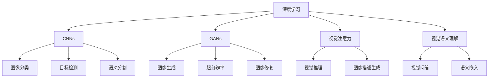
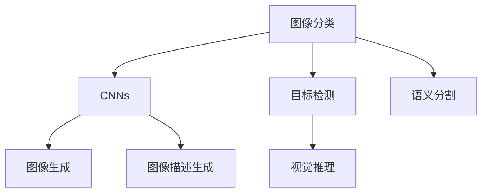
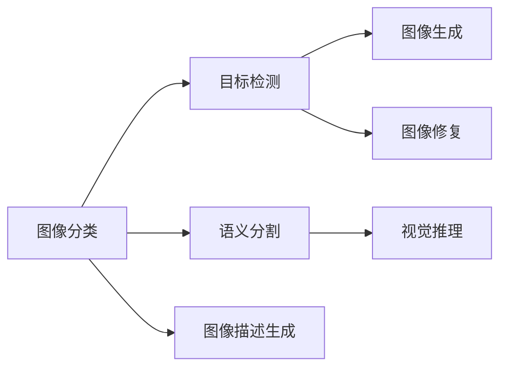
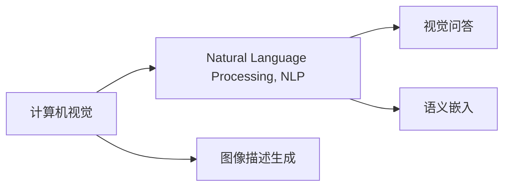
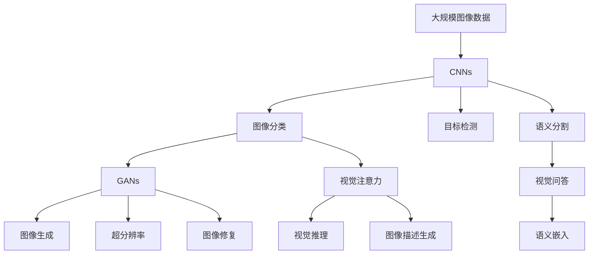

                 

# AI 2.0 时代的计算机视觉

## 1. 背景介绍

计算机视觉（Computer Vision, CV）作为人工智能（AI）的重要分支，从上个世纪80年代开始发展至今，取得了令人瞩目的成就。在AI 1.0时代，计算机视觉主要依赖于手工设计的特征和规则，难以处理复杂、变化多样的视觉信息。随着深度学习（Deep Learning, DL）技术的兴起，计算机视觉进入了AI 2.0时代，凭借其强大的数据驱动能力和自适应能力，突破了诸多传统视觉任务的瓶颈，为人类感知和理解世界提供了全新的视角。

### 1.1 问题由来

计算机视觉技术的发展，从最初的基于规则和手工特征的设计，逐步转向以深度学习为核心的端到端（End-to-End）自动学习范式。深度学习在计算机视觉中的应用主要体现在以下几个方面：

- **卷积神经网络（Convolutional Neural Networks, CNNs）**：通过卷积层、池化层、全连接层等结构，CNNs可以自动学习图像中的局部特征和整体语义，用于图像分类、目标检测、语义分割等任务。
- **生成对抗网络（Generative Adversarial Networks, GANs）**：通过GANs，可以实现图像生成、超分辨率、图像修复等创造性视觉任务。
- **视觉注意力机制**：通过视觉注意力机制，可以有效处理多模态信息，提升视觉推理、图像描述生成等任务性能。
- **视觉语义理解**：通过语义嵌入、视觉问答等技术，实现对图像语义的全面理解，推动计算机视觉向认知智能迈进。

深度学习技术在计算机视觉领域的成功应用，不仅提升了任务的准确率和效率，还拓展了视觉任务的范畴，推动了AI 2.0时代的到来。

### 1.2 问题核心关键点

深度学习在计算机视觉领域的核心问题包括：

- **数据获取与标注**：高质量的视觉数据和标注是深度学习模型训练的基础，而大规模、高精度的标注数据往往难以获得。
- **模型架构设计**：在处理不同视觉任务时，需要选择合适的模型架构和训练策略，以平衡模型的复杂度和性能。
- **推理与部署**：将训练好的模型部署到实际应用中，需要考虑推理速度、计算资源、模型大小等因素。
- **可解释性与鲁棒性**：深度学习模型通常被认为是"黑盒"，缺乏可解释性，且面对小样本和对抗攻击时，鲁棒性不足。

## 2. 核心概念与联系

### 2.1 核心概念概述

为了更好地理解AI 2.0时代的计算机视觉，本节将介绍几个密切相关的核心概念：

- **卷积神经网络（CNNs）**：一种专门用于处理图像和视频等二维数据的多层神经网络结构，通过卷积和池化操作提取局部特征，广泛应用于图像分类、目标检测等任务。
- **生成对抗网络（GANs）**：由生成器和判别器组成的两阶段训练过程，用于生成逼真的图像数据，实现图像生成、超分辨率、图像修复等任务。
- **视觉注意力机制**：一种将视觉信息转化为对特定区域的关注度的方法，常用于提升视觉推理、图像描述生成等任务。
- **视觉语义理解**：通过语义嵌入、视觉问答等技术，实现对图像语义的全面理解，推动计算机视觉向认知智能迈进。
- **端到端学习**：指直接从原始数据中学习任务的输入输出映射，不依赖手工设计的特征，提升模型的自动化和泛化能力。

这些核心概念之间的逻辑关系可以通过以下Mermaid流程图来展示：



这个流程图展示了大模型微调的各个核心概念及其之间的关系：

1. 深度学习作为大模型微调的基础，提供了强大的数据驱动和自适应能力。
2. CNNs作为深度学习中处理图像数据的主力，能够自动学习局部特征和全局语义。
3. GANs可以用于生成逼真的图像数据，提升数据获取效率。
4. 视觉注意力机制能提升视觉推理和图像描述生成能力。
5. 视觉语义理解推动计算机视觉向认知智能发展。
6. 端到端学习提升了模型的自动化和泛化能力。

这些概念共同构成了AI 2.0时代计算机视觉的核心框架，使其能够处理复杂、多模态的视觉信息。

### 2.2 概念间的关系

这些核心概念之间存在着紧密的联系，形成了计算机视觉任务的完整生态系统。下面我们通过几个Mermaid流程图来展示这些概念之间的关系。

#### 2.2.1 计算机视觉任务类型



这个流程图展示了计算机视觉任务的基本类型，以及与深度学习模型架构的关系：

1. 图像分类主要依赖CNNs提取局部特征。
2. 目标检测和语义分割可以使用CNNs提取特征，结合ROI池化等技术进行多阶段处理。
3. 图像生成通常使用GANs生成逼真图像。
4. 图像描述生成则将视觉特征与自然语言生成器结合。
5. 视觉推理可以基于视觉注意力机制对不同区域进行聚焦。

#### 2.2.2 计算机视觉任务依赖关系



这个流程图展示了不同计算机视觉任务之间的依赖关系：

1. 图像分类是目标检测的基础，提供类别信息指导目标定位。
2. 图像生成通常需要高质量的训练数据，可以通过目标检测获取。
3. 图像修复可以提升生成图像的质量。
4. 语义分割可以提供像素级的信息，用于推理和生成任务。
5. 图像描述生成可以用于辅助视觉推理。

#### 2.2.3 计算机视觉与自然语言处理的结合



这个流程图展示了计算机视觉与自然语言处理（Natural Language Processing, NLP）的结合方式：

1. 计算机视觉可以与NLP结合，进行视觉问答、图像描述生成等任务。
2. 语义嵌入可以将视觉信息转化为自然语言形式，用于信息检索和知识管理。
3. 图像描述生成可以将视觉信息转化为自然语言，提升人机交互的友好性。

### 2.3 核心概念的整体架构

最后，我们用一个综合的流程图来展示这些核心概念在大模型微调过程中的整体架构：



这个综合流程图展示了从图像数据预处理到微调模型，再到任务应用的全过程。计算机视觉模型首先对大规模图像数据进行预处理，然后通过CNNs进行特征提取，再通过GANs生成图像数据，或者通过注意力机制进行推理和生成。最终，这些模型可以应用于图像分类、目标检测、图像生成、视觉问答等各类视觉任务中。

## 3. 核心算法原理 & 具体操作步骤
### 3.1 算法原理概述

计算机视觉任务的深度学习模型，通常基于卷积神经网络（CNNs）进行训练。其核心思想是通过多层卷积、池化等操作，自动学习图像中的局部特征和整体语义，然后将这些特征映射到特定的任务输出，如分类、检测、分割等。

形式化地，假设输入图像为 $x \in \mathbb{R}^{H \times W \times C}$，其中 $H$ 和 $W$ 分别为图像的高和宽，$C$ 为通道数。定义卷积神经网络模型为 $f(x;\theta)$，其中 $\theta$ 为模型参数。则计算机视觉模型的训练目标是最小化经验风险，即：

$$
\theta^* = \mathop{\arg\min}_{\theta} \mathcal{L}(f(x;\theta), y)
$$

其中 $\mathcal{L}$ 为针对特定任务设计的损失函数，用于衡量模型输出与真实标签之间的差异。常见的损失函数包括交叉熵损失、均方误差损失等。

### 3.2 算法步骤详解

计算机视觉任务的深度学习模型训练一般包括以下几个关键步骤：

**Step 1: 准备训练数据**

- 收集并标注大规模图像数据，确保数据的多样性和代表性。
- 划分数据集为训练集、验证集和测试集，通常采用交叉验证等方法，以避免过拟合。
- 将图像数据转换为张量形式，以便输入深度学习框架。

**Step 2: 定义模型架构**

- 选择合适的卷积神经网络（CNNs）架构，如VGG、ResNet、Inception等。
- 在模型顶部添加任务特定的输出层，如全连接层、ROI池化层等。
- 定义损失函数和优化器，如交叉熵损失、AdamW优化器等。

**Step 3: 设置训练超参数**

- 设置学习率、批大小、迭代轮数等训练参数。
- 应用正则化技术，如L2正则、Dropout等，防止过拟合。
- 确定冻结预训练参数的策略，如仅微调顶层，或全部参数都参与微调。

**Step 4: 执行梯度训练**

- 将训练集数据分批次输入模型，前向传播计算损失函数。
- 反向传播计算参数梯度，根据设定的优化算法和学习率更新模型参数。
- 周期性在验证集上评估模型性能，根据性能指标决定是否触发Early Stopping。
- 重复上述步骤直到满足预设的迭代轮数或Early Stopping条件。

**Step 5: 测试和部署**

- 在测试集上评估微调后模型 $f_{\hat{\theta}}$ 的性能，对比微调前后的精度提升。
- 使用微调后的模型对新样本进行推理预测，集成到实际的应用系统中。
- 持续收集新的数据，定期重新微调模型，以适应数据分布的变化。

以上是计算机视觉任务的深度学习模型训练的一般流程。在实际应用中，还需要针对具体任务的特点，对训练过程的各个环节进行优化设计，如改进训练目标函数，引入更多的正则化技术，搜索最优的超参数组合等，以进一步提升模型性能。

### 3.3 算法优缺点

计算机视觉任务的深度学习模型训练具有以下优点：

- 强大的自动学习能力：深度学习模型可以自动学习图像特征，无需手工设计特征提取器。
- 泛化能力强：通过在大规模数据集上进行预训练，模型具备较强的泛化能力，可以处理多种视觉任务。
- 可解释性较好：卷积神经网络中的卷积层和池化层等结构具有较好的可解释性，易于理解模型的学习过程。

同时，该方法也存在一定的局限性：

- 数据标注成本高：大规模、高质量的标注数据集往往难以获取，标注成本较高。
- 训练资源需求大：深度学习模型需要大量的计算资源和存储空间，训练过程复杂。
- 模型可解释性不足：深度学习模型通常被认为是"黑盒"，难以解释其内部的决策过程。
- 鲁棒性不足：深度学习模型容易受到噪声和对抗样本的干扰，泛化性能较弱。

尽管存在这些局限性，但就目前而言，深度学习在计算机视觉任务的训练中仍是最主流的方法。未来相关研究的重点在于如何进一步降低训练对标注数据的依赖，提高模型的鲁棒性和可解释性，同时兼顾计算资源的使用效率。

### 3.4 算法应用领域

深度学习在计算机视觉任务中的应用已经覆盖了几乎所有常见场景，例如：

- 图像分类：如物体识别、场景分类等。通过卷积神经网络学习图像特征，然后通过全连接层进行分类。
- 目标检测：如物体定位、实例分割等。在卷积神经网络中引入ROI池化层，提取感兴趣区域的特征，然后进行分类和回归。
- 语义分割：如像素级分割、实例分割等。通过卷积神经网络提取像素级别的语义信息，然后进行像素级的分类。
- 图像生成：如风格迁移、图像补全等。通过生成对抗网络生成逼真图像，实现图像的创造性生成。
- 图像修复：如超分辨率、图像去噪等。通过卷积神经网络对损坏的图像进行修复。
- 图像描述生成：如图像 caption 生成、视觉问答等。将图像特征与自然语言生成器结合，生成图像描述或回答视觉问题。

除了上述这些经典任务外，深度学习在计算机视觉领域还拓展到了许多新兴领域，如视觉推理、多模态信息融合等，为计算机视觉技术带来了全新的突破。随着深度学习模型的不断进步，相信计算机视觉技术将在更广泛的领域得到应用，深刻影响人类的生产生活方式。

## 4. 数学模型和公式 & 详细讲解 & 举例说明

### 4.1 数学模型构建

本节将使用数学语言对计算机视觉任务的深度学习模型训练过程进行更加严格的刻画。

记输入图像为 $x \in \mathbb{R}^{H \times W \times C}$，其中 $H$ 和 $W$ 分别为图像的高和宽，$C$ 为通道数。定义卷积神经网络模型为 $f(x;\theta)$，其中 $\theta$ 为模型参数。假设微调任务的训练集为 $D=\{(x_i, y_i)\}_{i=1}^N, x_i \in \mathbb{R}^{H \times W \times C}, y_i \in \{0,1\}$。

定义模型 $f(x;\theta)$ 在数据样本 $(x,y)$ 上的损失函数为 $\ell(f(x;\theta),y)$，则在数据集 $D$ 上的经验风险为：

$$
\mathcal{L}(\theta) = \frac{1}{N} \sum_{i=1}^N \ell(f(x_i;\theta),y_i)
$$

微调的优化目标是最小化经验风险，即找到最优参数：

$$
\theta^* = \mathop{\arg\min}_{\theta} \mathcal{L}(\theta)
$$

在实践中，我们通常使用基于梯度的优化算法（如SGD、Adam等）来近似求解上述最优化问题。设 $\eta$ 为学习率，$\lambda$ 为正则化系数，则参数的更新公式为：

$$
\theta \leftarrow \theta - \eta \nabla_{\theta}\mathcal{L}(\theta) - \eta\lambda\theta
$$

其中 $\nabla_{\theta}\mathcal{L}(\theta)$ 为损失函数对参数 $\theta$ 的梯度，可通过反向传播算法高效计算。

### 4.2 公式推导过程

以下我们以二分类任务为例，推导交叉熵损失函数及其梯度的计算公式。

假设模型 $f(x;\theta)$ 在输入 $x$ 上的输出为 $\hat{y}=f(x;\theta) \in [0,1]$，表示样本属于正类的概率。真实标签 $y \in \{0,1\}$。则二分类交叉熵损失函数定义为：

$$
\ell(f(x;\theta),y) = -[y\log \hat{y} + (1-y)\log (1-\hat{y})]
$$

将其代入经验风险公式，得：

$$
\mathcal{L}(\theta) = -\frac{1}{N}\sum_{i=1}^N [y_i\log f(x_i;\theta)+(1-y_i)\log(1-f(x_i;\theta))]
$$

根据链式法则，损失函数对参数 $\theta_k$ 的梯度为：

$$
\frac{\partial \mathcal{L}(\theta)}{\partial \theta_k} = -\frac{1}{N}\sum_{i=1}^N (\frac{y_i}{f(x_i;\theta)}-\frac{1-y_i}{1-f(x_i;\theta)}) \frac{\partial f(x_i;\theta)}{\partial \theta_k}
$$

其中 $\frac{\partial f(x_i;\theta)}{\partial \theta_k}$ 可进一步递归展开，利用自动微分技术完成计算。

在得到损失函数的梯度后，即可带入参数更新公式，完成模型的迭代优化。重复上述过程直至收敛，最终得到适应下游任务的最优模型参数 $\theta^*$。

### 4.3 案例分析与讲解

为了更好地理解交叉熵损失函数的计算和梯度推导，我们以一个简单的二分类任务为例。假设模型在输入图像 $x$ 上的输出为 $\hat{y}=f(x;\theta) \in [0,1]$，真实标签为 $y \in \{0,1\}$。交叉熵损失函数的计算公式为：

$$
\ell(f(x;\theta),y) = -y\log f(x;\theta) - (1-y)\log (1-f(x;\theta))
$$

对于一个样本，假设模型输出为 $\hat{y}=0.8$，真实标签为 $y=1$，则交叉熵损失为：

$$
\ell(f(x;\theta),y) = -1 \times \log 0.8 - 0 \times \log 0.2 = 0.2231
$$

可以看出，当模型输出与真实标签一致时，损失最小；当模型输出与真实标签不一致时，损失较大。这种设计可以有效地激励模型输出正确的分类结果。

接下来，我们计算损失函数对模型参数 $\theta$ 的梯度。设模型输出 $\hat{y}=f(x;\theta) \in [0,1]$，则交叉熵损失函数对 $\theta$ 的梯度为：

$$
\frac{\partial \ell(f(x;\theta),y)}{\partial \theta} = -\frac{y}{f(x;\theta)} + \frac{1-y}{1-f(x;\theta)} \frac{\partial f(x;\theta)}{\partial \theta}
$$

假设模型输出为 $\hat{y}=0.8$，真实标签为 $y=1$，则梯度为：

$$
\frac{\partial \ell(f(x;\theta),y)}{\partial \theta} = \frac{1}{0.8} - \frac{0}{0.2} \frac{\partial f(x;\theta)}{\partial \theta} = 1.25 \frac{\partial f(x;\theta)}{\partial \theta}
$$

可以看出，梯度的方向与真实标签一致，即当模型输出与真实标签一致时，梯度为正，反之则为负。这种设计可以有效地引导模型更新，使其输出更接近真实标签。

## 5. 项目实践：代码实例和详细解释说明

### 5.1 开发环境搭建

在进行深度学习模型训练前，我们需要准备好开发环境。以下是使用Python进行PyTorch开发的环境配置流程：

1. 安装Anaconda：从官网下载并安装Anaconda，用于创建独立的Python环境。

2. 创建并激活虚拟环境：
```bash
conda create -n pytorch-env python=3.8 
conda activate pytorch-env
```

3. 安装PyTorch：根据CUDA版本，从官网获取对应的安装命令。例如：
```bash
conda install pytorch torchvision torchaudio cudatoolkit=11.1 -c pytorch -c conda-forge
```

4. 安装TensorFlow：
```bash
pip install tensorflow
```

5. 安装各类工具包：
```bash
pip install numpy pandas scikit-learn matplotlib tqdm jupyter notebook ipython
```

完成上述步骤后，即可在`pytorch-env`环境中开始深度学习模型训练。

### 5.2 源代码详细实现

下面我们以图像分类任务为例，给出使用PyTorch进行卷积神经网络（CNNs）训练的PyTorch代码实现。

首先，定义图像分类任务的数据处理函数：

```python
import torch
import torch.nn as nn
import torchvision.transforms as transforms
from torch.utils.data import DataLoader

# 定义数据处理函数
transform = transforms.Compose([
    transforms.Resize((224, 224)),
    transforms.ToTensor(),
    transforms.Normalize(mean=[0.485, 0.456, 0.406], std=[0.229, 0.224, 0.225])
])

# 加载数据集
train_dataset = torchvision.datasets.CIFAR10(root='data', train=True, transform=transform, download=True)
train_loader = DataLoader(train_dataset, batch_size=64, shuffle=True)

# 定义模型
model = nn.Sequential(
    nn.Conv2d(3, 64, kernel_size=3, stride=1, padding=1),
    nn.ReLU(inplace=True),
    nn.MaxPool2d(kernel_size=2, stride=2),
    nn.Conv2d(64, 128, kernel_size=3, stride=1, padding=1),
    nn.ReLU(inplace=True),
    nn.MaxPool2d(kernel_size=2, stride=2),
    nn.Flatten(),
    nn.Linear(128 * 7 * 7, 512),
    nn.ReLU(inplace=True),
    nn.Linear(512, 10)
)

# 定义损失函数和优化器
criterion = nn.CrossEntropyLoss()
optimizer = torch.optim.Adam(model.parameters(), lr=0.001)

# 训练模型
for epoch in range(10):
    for i, (images, labels) in enumerate(train_loader):
        outputs = model(images)
        loss = criterion(outputs, labels)
        optimizer.zero_grad()
        loss.backward()
        optimizer.step()
        if (i+1) % 100 == 0:
            print(f"Epoch {epoch+1}, Step {i+1}, Loss: {loss.item():.4f}")
```

然后，定义模型和优化器：

```python
# 定义模型
model = nn.Sequential(
    nn.Conv2d(3, 64, kernel_size=3, stride=1, padding=1),
    nn.ReLU(inplace=True),
    nn.MaxPool2d(kernel_size=2, stride=2),
    nn.Conv2d(64, 128, kernel_size=3, stride=1, padding=1),
    nn.ReLU(inplace=True),
    nn.MaxPool2d(kernel_size=2, stride=2),
    nn.Flatten(),
    nn.Linear(128 * 7 * 7, 512),
    nn.ReLU(inplace=True),
    nn.Linear(512, 10)
)

# 定义损失函数和优化器
criterion = nn.CrossEntropyLoss()
optimizer = torch.optim.Adam(model.parameters(), lr=0.001)
```

接着，定义训练和评估函数：

```python
# 定义训练函数
def train_epoch(model, data_loader, optimizer):
    model.train()
    loss = 0
    correct = 0
    total = 0
    for images, labels in data_loader:
        outputs = model(images)
        loss += criterion(outputs, labels).item()
        _, predicted = outputs.max(1)
        total += labels.size(0)
        correct += predicted.eq(labels).sum().item()
    return loss / total, correct / total

# 定义评估函数
def evaluate(model, data_loader):
    model.eval()
    loss = 0
    correct = 0
    total = 0
    with torch.no_grad():
        for images, labels in data_loader:
            outputs = model(images)
            loss += criterion(outputs, labels).item()
            _, predicted = outputs.max(1)
            total += labels.size(0)
            correct += predicted.eq(labels).sum().item()
    return loss / total, correct / total
```

最后，启动训练流程并在测试集上评估：

```python
# 加载数据集
train_dataset = torchvision.datasets.CIFAR10(root='data', train=True, transform=transform, download=True)
test_dataset = torchvision.datasets.CIFAR10(root='data', train=False, transform=transform, download=True)

# 划分训练集和测试集
train_loader = DataLoader(train_dataset, batch_size=64, shuffle=True)
test_loader = DataLoader(test_dataset, batch_size=64, shuffle=False)

# 定义模型和优化器
model = nn.Sequential(
    nn.Conv2d(3, 64, kernel_size=3, stride=1, padding=1),
    nn.ReLU(inplace=True),
    nn.MaxPool2d(kernel_size=2, stride=2),
    nn.Conv2d(64, 128, kernel_size=3, stride=1, padding=1),
    nn.ReLU(inplace=True),
    nn.MaxPool2d(kernel_size=2, stride=2),
    nn.Flatten(),
    nn.Linear(128 * 7 * 7, 512),
    nn.ReLU(inplace=True),
    nn.Linear(512, 10)
)

c

