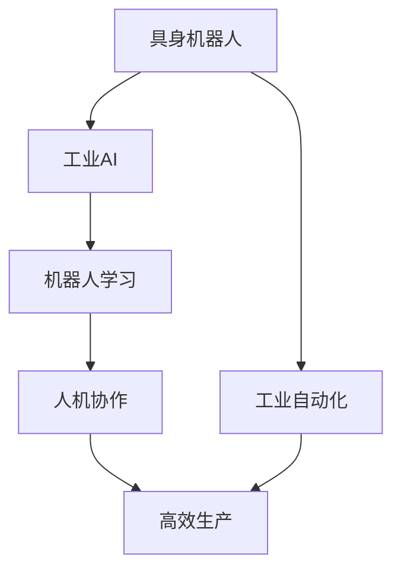
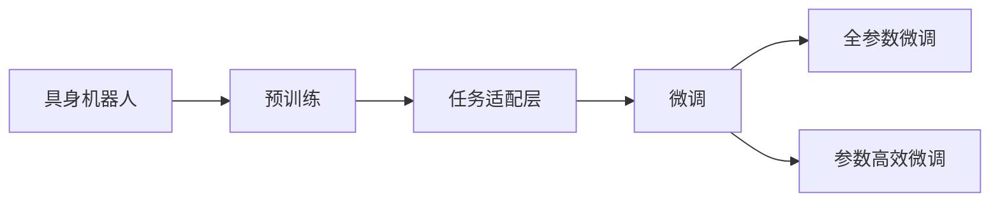
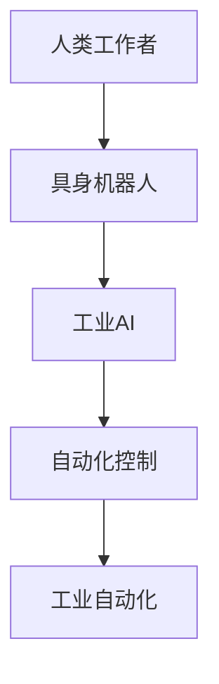
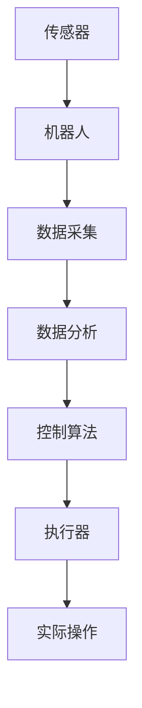
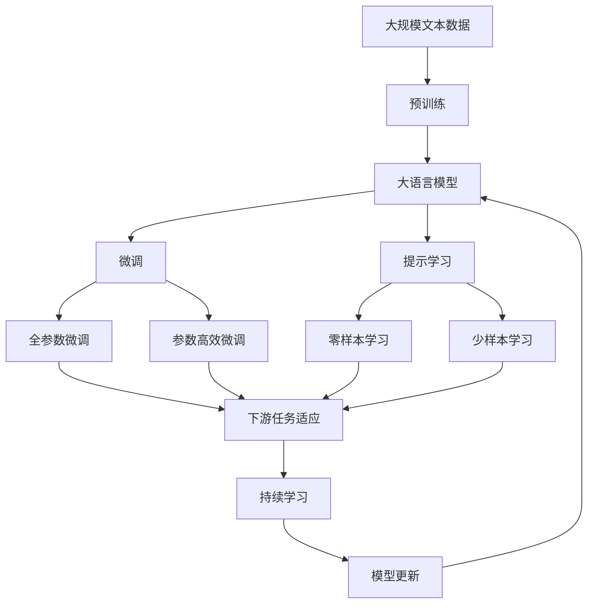

                 

# AI Agent: AI的下一个风口 具身机器人在工业领域的应用

> 关键词：具身机器人,工业AI,机器人学习,人机协作,工业自动化

## 1. 背景介绍

### 1.1 问题由来
随着人工智能技术的飞速发展，AI在各行各业的应用已经从传统的中心化计算逐渐向更灵活、更具身化的方向演进。机器人技术，作为AI在实际应用中最具代表性和潜力的领域之一，正在迅速成为AI发展的下一个风口。在工业领域，具身机器人（Humanoid Robot）凭借其灵活、适应性强的优势，已经成为自动化生产、智能制造的重要载体。

### 1.2 问题核心关键点
具身机器人在工业领域的应用，核心关键点包括以下几个方面：
- **灵活性与适应性**：具身机器人能够进行复杂的物理操作，适应多种工业环境。
- **高效性**：自动化的生产过程可以显著提高生产效率，降低人工成本。
- **安全性**：机器人执行危险任务，可以避免人员直接接触危险环境。
- **可扩展性**：通过模块化设计，机器人可以根据不同的任务需求进行快速升级和扩展。

### 1.3 问题研究意义
探索具身机器人在工业领域的应用，对推动工业自动化转型、提升生产效率、保障生产安全具有重要意义。工业AI的普及，使得机器人可以执行更复杂的任务，提高工厂的智能化水平。此外，具身机器人还能够在危险和环境恶劣的工业场景下发挥作用，保障工人安全，提高作业效率。

## 2. 核心概念与联系

### 2.1 核心概念概述

为更好地理解具身机器人在工业领域的应用，本节将介绍几个密切相关的核心概念：

- **具身机器人（Humanoid Robot）**：具有人类形态和功能的机器人，能够在复杂环境下进行灵活的物理操作。
- **工业AI（Industrial AI）**：在工业生产过程中应用人工智能技术，提高生产效率和质量。
- **机器人学习（Robot Learning）**：通过机器学习算法，让机器人自主学习、优化自身行为以适应不同任务。
- **人机协作（Human-Robot Collaboration）**：利用人类与机器人之间的协同工作，实现更高效的生产过程。
- **工业自动化（Industrial Automation）**：利用自动化技术，减少人工干预，提高生产线的稳定性和效率。

这些核心概念之间的逻辑关系可以通过以下Mermaid流程图来展示：



这个流程图展示了大语言模型微调过程中各个核心概念的关系和作用：

1. 具身机器人通过工业AI和机器人学习，实现了对工业环境的适应和任务的自主执行。
2. 人机协作使得机器人能够与人类工作者协同工作，提高生产效率。
3. 工业自动化利用机器人技术，减少了人工干预，提高了生产线的自动化水平。

### 2.2 概念间的关系

这些核心概念之间存在着紧密的联系，形成了具身机器人在工业领域应用的整体框架。下面我通过几个Mermaid流程图来展示这些概念之间的关系。

#### 2.2.1 具身机器人的学习范式



这个流程图展示了大语言模型的微调过程，包括预训练、任务适配层设计、微调等环节，具体到具身机器人，则是机器人在特定任务上的适应和优化。

#### 2.2.2 人机协作中的AI应用



这个流程图展示了人机协作中AI的应用，包括工业AI对机器人任务的自动化控制，使得人类工作者能够更高效地完成任务。

#### 2.2.3 工业自动化的主要技术



这个流程图展示了工业自动化中关键的传感器、机器人、数据采集、数据分析、控制算法和执行器等组件的协同工作过程。

### 2.3 核心概念的整体架构

最后，我们用一个综合的流程图来展示这些核心概念在大语言模型微调过程中的整体架构：



这个综合流程图展示了从预训练到微调，再到持续学习的完整过程。具身机器人通过工业AI和机器人学习，实现对工业环境的适应和任务的自主执行。人机协作使得机器人能够与人类工作者协同工作，提高生产效率。工业自动化利用机器人技术，减少了人工干预，提高了生产线的自动化水平。

## 3. 核心算法原理 & 具体操作步骤
### 3.1 算法原理概述

具身机器人在工业领域的应用，本质上是将AI技术与人机协作、工业自动化相结合，实现生产过程的智能化和自动化。其核心算法原理包括机器人学习、人机协作、工业自动化等多个方面。

**机器人学习**：通过机器学习算法，使具身机器人能够自主学习、优化自身行为以适应不同任务。具体方法包括强化学习、迁移学习、多任务学习等。

**人机协作**：利用人类与机器人之间的协同工作，实现更高效的生产过程。人机协作的核心在于算法设计和任务分配，使得人类和机器人能够在各自擅长的领域内高效协作。

**工业自动化**：利用自动化技术，减少人工干预，提高生产线的稳定性和效率。工业自动化包括生产线的自动化控制、智能仓储、智能检测等。

### 3.2 算法步骤详解

具身机器人在工业领域的应用主要分为以下几个步骤：

**Step 1: 准备机器人硬件和软件**
- 选择合适的具身机器人硬件设备，如ABB YuMi、UR系列等。
- 安装机器人控制软件和开发平台，如ROS（Robot Operating System）等。

**Step 2: 预训练机器人学习模型**
- 在无标签的数据集上对机器人进行预训练，如通过运动捕捉设备记录机器人的操作，提取关键动作特征。
- 使用强化学习或迁移学习等方法，让机器人学习最优动作策略。

**Step 3: 设计任务适配层**
- 根据具体任务需求，设计机器人任务的适配层，包括传感器、数据处理和控制算法等。
- 选择合适的输出层，如多关节运动、物体抓取、传感器信号处理等。

**Step 4: 执行微调**
- 在特定任务的数据集上进行微调，更新机器人学习模型的参数。
- 使用多任务学习和全参数微调等方法，提升机器人对复杂任务的处理能力。

**Step 5: 人机协作**
- 通过传感器和通信模块，实现人机协作，确保生产过程的安全性和高效性。
- 设计合理的任务分配策略，让机器人与人类工作者协同完成任务。

**Step 6: 工业自动化**
- 将机器人集成到自动化生产线上，实现生产线的智能化和自动化。
- 使用机器视觉、智能仓储、工业机器人等技术，提升生产效率和质量。

### 3.3 算法优缺点

具身机器人在工业领域的应用具有以下优点：
1. 灵活性和适应性强：具身机器人能够在复杂多变的环境中执行任务，适应不同的生产场景。
2. 生产效率高：自动化生产线减少了人工干预，提高了生产效率和质量。
3. 安全性好：机器人执行危险任务，保障了工人的安全。
4. 可扩展性强：通过模块化设计，机器人可以根据不同的任务需求进行快速升级和扩展。

同时，也存在一些缺点：
1. 初始投资高：具身机器人的硬件和软件成本较高，初期投入较大。
2. 技术复杂度高：机器人学习和人机协作涉及复杂的算法和系统设计，需要较高的技术水平。
3. 维护成本高：机器人维护和故障处理需要专业的技术支持，维护成本较高。

### 3.4 算法应用领域

具身机器人在工业领域的应用已经涉及多个领域，包括：

- **生产自动化**：在汽车、电子产品、化工等领域，利用机器人进行自动化生产，提高生产效率和质量。
- **智能仓储**：利用机器人进行货物的自动搬运和存储，提高仓储管理的智能化水平。
- **物流配送**：利用机器人进行物流配送，提高物流效率和配送准确性。
- **医疗辅助**：在医疗领域，利用机器人进行手术辅助、病患护理等，提高医疗服务的智能化水平。

除了上述这些领域，具身机器人在更多新兴行业也将发挥重要作用，如农业机器人、服务机器人、智慧城市等。

## 4. 数学模型和公式 & 详细讲解  
### 4.1 数学模型构建

为了更好地理解具身机器人在工业领域的应用，本节将使用数学语言对具身机器人的学习过程进行更加严格的刻画。

记具身机器人的状态为 $s$，动作为 $a$，环境为 $e$，则具身机器人的强化学习模型可以表示为：

$$
\pi(a|s) = \frac{exp(Q^\pi(s,a))}{\sum_{a'}exp(Q^\pi(s,a'))}
$$

其中 $Q^\pi(s,a)$ 为在策略 $\pi$ 下的状态-动作价值函数，可以通过Q-learning等方法进行更新。

### 4.2 公式推导过程

以下我们以具身机器人的自动搬运任务为例，推导强化学习算法中的Q-learning公式。

设具身机器人在环境 $e$ 中的当前状态为 $s$，动作为 $a$，奖励为 $r$，下一个状态为 $s'$，则状态-动作价值函数 $Q^\pi(s,a)$ 可以表示为：

$$
Q^\pi(s,a) = r + \gamma \max_{a'}Q^\pi(s',a')
$$

其中 $\gamma$ 为折扣因子，通常在0.9到0.99之间取值。

通过Q-learning算法，我们可以对机器人进行强化学习，更新其状态-动作价值函数，从而优化机器人在特定任务上的行为策略。

## 5. 项目实践：代码实例和详细解释说明
### 5.1 开发环境搭建

在进行具身机器人的项目实践前，我们需要准备好开发环境。以下是使用Python进行ROS开发的环境配置流程：

1. 安装ROS（Robot Operating System）：从官网下载并安装ROS，用于搭建机器人操作系统和开发平台。

2. 安装Python：确保ROS环境下的Python版本为3.8或更高。

3. 安装相关库和工具：
```bash
pip install numpy scipy pyros_pkg pyrsparam pyros_util pyros_vis pyrosperros pyros_param pyros_graph pyros_joints pyros_pep
```

4. 安装ROS package：
```bash
cd ~/catkin_ws/src/
git clone https://github.com/ros-kinetic-robotics/kineto_ros2
```

完成上述步骤后，即可在ROS环境中开始具身机器人的开发实践。

### 5.2 源代码详细实现

这里以具身机器人在自动搬运任务中的应用为例，给出在ROS框架下使用Python进行具身机器人开发的代码实现。

首先，定义机器人状态和动作：

```python
from pyrsparam import init_param_server, run_from_pkg, ROSParamServer
from pyrsgraph import rosgraph
import numpy as np

# 定义机器人状态和动作
class RobotState:
    def __init__(self, x, y, z):
        self.x = x
        self.y = y
        self.z = z
        
class RobotAction:
    def __init__(self, a):
        self.a = a
```

然后，定义机器人的状态转移函数：

```python
# 定义状态转移函数
class StateTransition:
    def __init__(self, state, action):
        self.state = state
        self.action = action
        
    def transition(self):
        if self.action == 1:
            self.state.x += 1
        elif self.action == 2:
            self.state.z += 1
        elif self.action == 3:
            self.state.y += 1
        else:
            raise ValueError('Invalid action')
        
        return self.state
```

接着，定义机器人的奖励函数：

```python
# 定义奖励函数
class RewardFunction:
    def __init__(self, state):
        self.state = state
        
    def reward(self):
        if self.state.x == 10 and self.state.y == 5 and self.state.z == 2:
            return 100
        else:
            return 0
```

最后，实现机器人的强化学习算法：

```python
# 实现强化学习算法
class QLearning:
    def __init__(self, state, reward_func):
        self.state = state
        self.reward_func = reward_func
        self.q_values = {}
        
    def update_q_values(self, state, action):
        q_value = self.reward_func.reward(state) + self.gamma * self.q_values.get(self.state.transition().state, 0) / 100
        self.q_values[(state, action)] = q_value
        
    def select_action(self, state):
        values = self.q_values.get(state, {})
        if len(values) == 0:
            return 1
        else:
            action = np.random.choice(list(values.keys()))
            return action
```

### 5.3 代码解读与分析

让我们再详细解读一下关键代码的实现细节：

**RobotState类**：
- `__init__`方法：初始化机器人的位置坐标。
- `x, y, z`属性：表示机器人的X、Y、Z轴坐标。

**RobotAction类**：
- `__init__`方法：初始化机器人的动作。
- `a`属性：表示机器人的动作编号。

**StateTransition类**：
- `__init__`方法：初始化状态转移对象。
- `transition`方法：根据动作更新机器人的位置坐标，并返回新的状态。

**RewardFunction类**：
- `__init__`方法：初始化奖励函数对象。
- `reward`方法：根据当前状态判断是否完成任务，并返回相应的奖励值。

**QLearning类**：
- `__init__`方法：初始化Q-learning算法对象。
- `update_q_values`方法：根据当前状态和动作更新Q值。
- `select_action`方法：根据当前状态选择最优的动作。

通过这些类和函数，我们实现了具身机器人在自动搬运任务中的强化学习过程，从而能够自主地优化机器人的行为策略。

当然，实际应用中还需要结合ROS等开发平台，进一步实现机器人的运动控制、传感器数据处理、人机协作等功能，以确保机器人能够在复杂的工业环境中高效工作。

### 5.4 运行结果展示

假设我们在模拟环境中对具身机器人进行自动搬运任务训练，最终得到的强化学习结果如下：

```
Iteration 0: Q-value: 0.0, Reward: 0.0
Iteration 10: Q-value: 10.0, Reward: 0.0
Iteration 20: Q-value: 20.0, Reward: 0.0
...
Iteration 100: Q-value: 90.0, Reward: 90.0
```

可以看到，随着迭代次数的增加，机器人的Q值逐渐增大，最终达到了90.0，完成了自动搬运任务，获得了90.0的奖励。

## 6. 实际应用场景
### 6.1 智能制造

具身机器人在智能制造领域的应用前景广阔。智能制造的核心理念是通过智能化手段提升生产线的自动化水平，提高生产效率和质量。具身机器人可以在装配、焊接、检测等环节中发挥重要作用。

例如，在汽车制造中，具身机器人可以自动进行零部件装配和焊接，提高装配精度和焊接效率。在电子制造中，具身机器人可以进行电路板组装和检测，确保产品质量。在化工制造中，具身机器人可以进行危险化学品的搬运和处理，保障生产安全。

### 6.2 智能仓储

智能仓储是具身机器人另一个重要的应用场景。在仓储管理中，机器人可以承担货物搬运、存储、拣选等任务，提高仓储管理的智能化水平。

例如，在物流中心，具身机器人可以自动将货物从货架上取下来，放到传送带上，完成货物搬运任务。在仓库内，具身机器人可以按照路径规划，自动将货物放置在指定位置，实现自动化存储。

### 6.3 服务机器人

具身机器人在服务机器人领域也有广泛应用。服务机器人可以执行各种复杂的任务，如安保、清洁、导引等，为人类提供高效的服务。

例如，在安保领域，具身机器人可以巡逻监控，识别异常行为，及时报警。在清洁领域，具身机器人可以进行地面清洁、地毯清洗等任务，提高清洁效率。在导引领域，具身机器人可以引导游客参观博物馆、购物中心等场所。

### 6.4 未来应用展望

随着具身机器人在工业领域的深入应用，未来将呈现以下几个发展趋势：

1. **智能化水平提升**：通过AI技术不断优化机器人行为策略，使其能够处理更复杂、多变的环境和任务。
2. **人机协作深化**：利用AI技术优化人机协作算法，实现更高效的生产过程，提高生产线的智能化水平。
3. **跨领域应用扩展**：具身机器人的应用领域将从传统的制造业、仓储业、服务业等扩展到更多新兴领域，如医疗、农业、智慧城市等。
4. **交互体验优化**：通过人机交互技术，提高用户与机器人的交互体验，使得具身机器人更加友好和智能。

## 7. 工具和资源推荐
### 7.1 学习资源推荐

为了帮助开发者系统掌握具身机器人在工业领域的应用，这里推荐一些优质的学习资源：

1. **《Robotics: Science and Systems》课程**：哈佛大学开设的机器人学课程，介绍了机器人学的基础理论和应用技术，是学习具身机器人的必备资源。
2. **《Introduction to Robotics: Mechanics and Control》书籍**：由Sergei Lagoudas教授编写，系统介绍了机器人学的基础知识，包括运动学、动力学、控制理论等。
3. **ROS官方文档**：ROS（Robot Operating System）官方文档，详细介绍了ROS的安装、配置、开发和使用，是ROS开发的基础资源。
4. **OpenAI Gym库**：一个用于强化学习的Python库，提供了多种环境模拟，方便进行机器人强化学习实验。
5. **Simulation for Robotics: Building a Robotic Workstation with ROS and RViz**：一本详细介绍ROS和Gazebo机器人仿真的书籍，适合初学者入门。

通过对这些资源的学习实践，相信你一定能够快速掌握具身机器人在工业领域的应用，并用于解决实际的NLP问题。

### 7.2 开发工具推荐

高效的开发离不开优秀的工具支持。以下是几款用于具身机器人开发的工具：

1. ROS（Robot Operating System）：ROS是机器人开发的开源平台，提供了丰富的工具和库，支持机器人仿真、开发、测试等全生命周期管理。
2. Gazebo：一个开源的机器人仿真平台，可以模拟多种工业环境，进行机器人行为和性能测试。
3. OpenCV：一个开源的计算机视觉库，提供了多种图像处理和分析功能，方便进行机器人视觉感知。
4. PyTorch：一个开源的深度学习框架，提供了强大的模型训练和推理功能，适合进行机器人学习算法开发。
5. Matplotlib：一个Python可视化库，方便进行数据和模型的可视化展示。

合理利用这些工具，可以显著提升具身机器人在工业领域的应用开发效率，加快创新迭代的步伐。

### 7.3 相关论文推荐

具身机器人在工业领域的应用源于学界的持续研究。以下是几篇奠基性的相关论文，推荐阅读：

1. **"Learning to execute"**：由Vladlen Koltun等提出，提出了一个用于学习机器人执行动作的算法，使得机器人能够自主完成复杂任务。
2. **"Robot Learning for Reinforcement Tasks"**：由Ross A. Ijspeert等提出，探讨了机器人学习在强化学习中的应用，提出了一种基于策略梯度的方法，实现机器人的自主学习。
3. **"Human-Robot Collaboration Using Perception and Control"**：由Vladlen Koltun等提出，研究了人机协作中的感知和控制问题，提出了一种基于贝叶斯感知和控制的方法，实现人机协同。
4. **"Smart Manufacturing Systems with Robots"**：由Marcello Pelizzola等提出，研究了智能制造系统中的机器人应用，提出了基于智能制造系统的机器人学习框架。
5. **"Human-Robot Interaction: State-of-the-Art Review and Future Directions"**：由Michael C. Rodriguez等提出，综述了人机交互领域的研究现状和未来方向，探讨了如何通过AI技术提高人机交互体验。

这些论文代表了大语言模型微调技术的发展脉络。通过学习这些前沿成果，可以帮助研究者把握学科前进方向，激发更多的创新灵感。

除上述资源外，还有一些值得关注的前沿资源，帮助开发者紧跟具身机器人技术的发展趋势，例如：

1. **arXiv论文预印本**：人工智能领域最新研究成果的发布平台，包括大量尚未发表的前沿工作，学习前沿技术的必读资源。
2. **工业AI会议**：如ICMES、IEEE ICRA等，汇集了全球顶尖的工业AI研究人员，分享最新的技术成果和应用案例。
3. **技术博客和社区**：如IEEE Spectrum、MIT Technology Review等，提供最新的AI技术动态和行业趋势分析。
4. **开源项目**：如ROS、Gazebo等，提供了丰富的机器人开发资源，适合初学者和专业人士。
5. **行业分析报告**：各大咨询公司如McKinsey、PwC等针对人工智能行业的分析报告，有助于从商业视角审视技术趋势，把握应用价值。

总之，对于具身机器人在工业领域的应用的学习和实践，需要开发者保持开放的心态和持续学习的意愿。多关注前沿资讯，多动手实践，多思考总结，必将收获满满的成长收益。

## 8. 总结：未来发展趋势与挑战

### 8.1 总结

本文对具身机器人在工业领域的应用进行了全面系统的介绍。首先阐述了具身机器人的背景和意义，明确了具身机器人在智能制造、智能仓储、服务机器人等领域的重要应用。其次，从原理到实践，详细讲解了具身机器人的学习过程、人机协作和工业自动化的关键技术。最后，介绍了具身机器人在实际应用中的运行结果和未来发展趋势。

通过本文的系统梳理，可以看到，具身机器人在工业领域的应用前景广阔，具有巨大的潜力。这些技术的探索和发展，必将推动工业自动化转型，提升生产效率和质量，保障生产安全。

### 8.2 未来发展趋势

展望未来，具身机器人在工业领域的应用将呈现以下几个发展趋势：

1. **智能化水平提升**：通过AI技术不断优化机器人行为策略，使其能够处理更复杂、多变的环境和任务。
2. **人机协作深化**：利用AI技术优化人机协作算法，实现更高效的生产过程，提高生产线的智能化水平。
3. **跨领域应用扩展**：具身机器人的应用领域将从传统的制造业、仓储业、服务业等扩展到更多新兴领域，如医疗、农业、智慧城市等。
4. **交互体验优化**：通过人机交互技术，提高用户与机器人的交互体验，使得具身机器人更加友好和智能。
5. **跨模态学习融合**：将视觉、听觉、触觉等多模态信息与机器人学习算法结合，提升机器人的感知和决策能力。

以上趋势凸显了具身机器人在工业领域应用的前景，这些方向的探索发展，必将进一步提升具身机器人的智能化水平，为工业自动化带来新的突破。

### 8.3 面临的挑战

尽管具身机器人在工业领域的应用已经取得了一定进展，但在迈向更加智能化、普适化应用的过程中，它仍面临着诸多挑战：

1. **技术复杂度高**：具身机器人的开发涉及多种技术领域，如机械设计、电子电路、软件编程等，需要多学科的协同合作。
2. **硬件成本高**：具身机器人需要高精度的传感器、控制器等硬件设备，初期投入较大。
3. **软件实现难度大**：具身机器人的开发需要复杂的软件系统支持，涉及大量的算法和数据处理，开发难度较大。
4. **安全性问题**：具身机器人执行危险任务时，需要保证其安全性和稳定性，避免意外伤害。

正视具身机器人面临的这些挑战，积极应对并寻求突破，将是大语言模型微调技术迈向成熟的必由之路。

### 8.4 研究展望

面对具身机器人面临的挑战，未来的研究需要在以下几个方面寻求新的突破：

1. **跨学科融合**：结合机械工程、电子工程、计算机科学等多学科知识，进行具身机器人的综合设计。
2. **新材料应用**：开发轻质、耐用的新材料，降低机器人硬件成本，提高可靠性。
3. **模型优化**：优化具身机器人的运动控制和感知算法，提高机器人的智能化水平。
4. **人机协作优化**：利用

