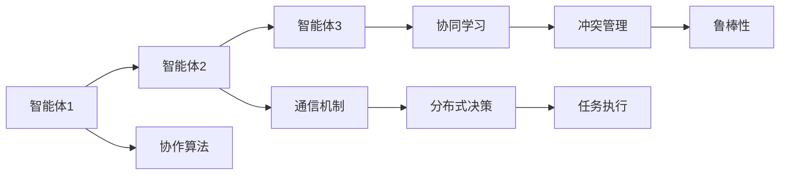
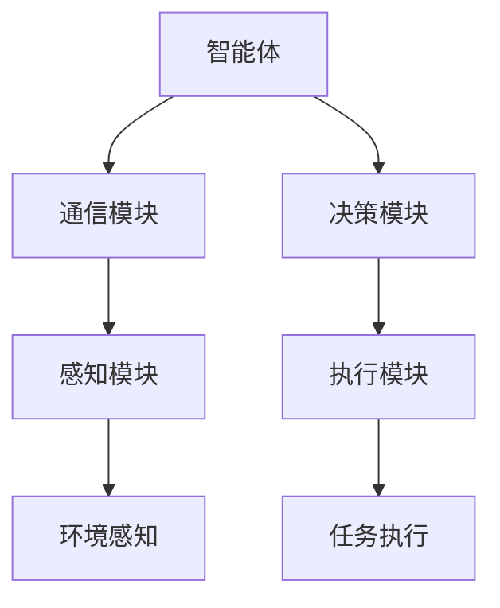
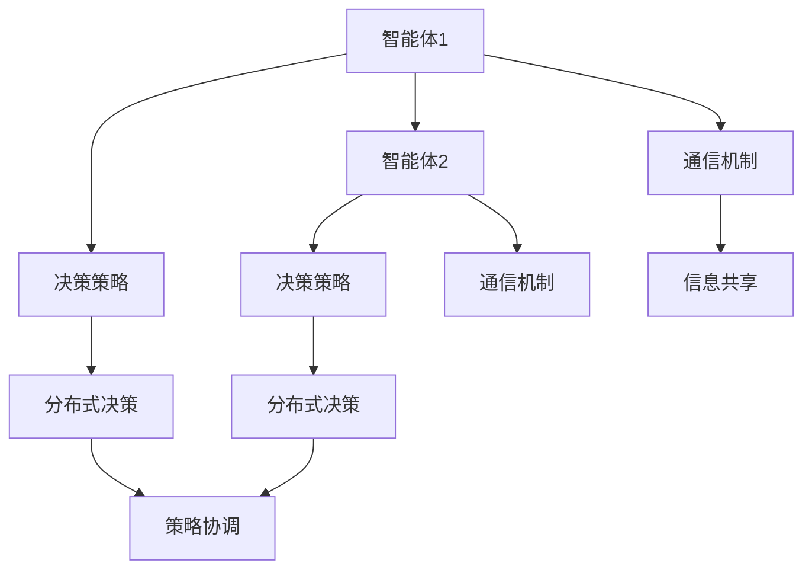
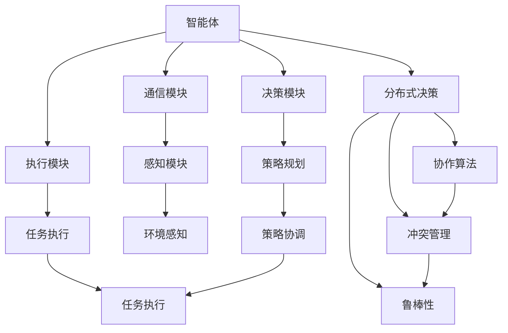

                 

# AI Agent: AI的下一个风口 多智能体系统的未来

> 关键词：多智能体系统(Multi-Agent Systems,MAS)，分布式协作,协作算法,智能代理(Agent),强化学习(Reinforcement Learning,RL),元学习(Meta Learning)

## 1. 背景介绍

### 1.1 问题由来
近年来，人工智能(AI)技术迅速发展，从视觉、语音、自然语言处理(NLP)等领域取得突破性进展。然而，如何让这些智能技术协同工作，实现复杂任务，成为AI领域的新焦点。分布式多智能体系统(Multi-Agent Systems, MAS)成为一种有潜力的解决方案，被广泛应用于机器人协作、智慧城市、自动化交易、无人驾驶等诸多领域。

多智能体系统通过对多个独立智能体(Agent)的协同管理，在分布式环境中实现任务分解与协作，以高效率和灵活性解决各种复杂问题。然而，由于智能体之间的交互复杂，如何设计高效的协作算法，使得系统能够稳定地协同工作，是当前研究的关键。

### 1.2 问题核心关键点
多智能体系统的核心在于多个独立智能体之间的信息共享、任务协作和决策优化。智能体通过分布式感知、通信、控制等环节，实现目标的协同达成。这涉及到智能体的感知能力、决策策略、通信机制等多方面的问题。

具体而言，多智能体系统面临的问题包括：
1. 分布式决策：如何使多个智能体协调一致，高效执行共同目标？
2. 通信机制：智能体之间如何高效共享信息，避免信息过载？
3. 协同学习：智能体如何从协作中学习，不断提高自身能力？
4. 冲突管理：如何在智能体间出现冲突时，公平、有效地解决？
5. 鲁棒性：多智能体系统在面对动态环境和不确定因素时，如何保证稳定性和鲁棒性？

### 1.3 问题研究意义
多智能体系统通过智能体的协作，具备了比单一智能体更强的适应性和问题解决能力，可以广泛应用于各种复杂环境中的分布式任务。研究高效协作算法，提升多智能体系统的性能，对于实现高效率、高可靠性的分布式AI系统，具有重要意义。

具体而言，多智能体系统的研究与应用，将推动以下领域的创新：
1. 提升自动化生产线的协作效率。
2. 实现智慧城市的协同管理。
3. 促进智能机器人协作。
4. 优化交通流管理。
5. 增强网络安全防御。

多智能体系统的研究与应用，将为AI技术的普及和落地带来新的突破，推动技术向更广范围、更深层次的应用发展。

## 2. 核心概念与联系

### 2.1 核心概念概述

为了更好地理解多智能体系统的协作算法，本节将介绍几个密切相关的核心概念：

- 多智能体系统(Multi-Agent Systems, MAS)：由多个独立智能体(Agent)组成的系统，通过信息共享、任务协作等方式，实现复杂任务的分布式处理。
- 智能体(Agent)：具有自主决策和行为能力的实体，可以感知环境、处理信息、执行任务。
- 协作算法(Cooperative Algorithms)：设计用于指导智能体之间协作的算法，实现任务分配、信息共享、冲突解决等功能。
- 分布式决策(Distributed Decision Making)：多个智能体共同参与的决策过程，需要考虑智能体之间的交互和协调。
- 通信机制(Communication Mechanism)：智能体之间信息传递的方式和协议。
- 协同学习(Cooperative Learning)：智能体在协作过程中，通过共享知识、优化策略等方式，提高自身能力。
- 冲突管理(Conflict Resolution)：在智能体间出现冲突时，通过协调、仲裁等手段，公平、有效地解决冲突。
- 鲁棒性(Robustness)：多智能体系统在面对环境变化、噪声干扰等因素时，仍能稳定、可靠地工作。

这些核心概念之间的逻辑关系可以通过以下Mermaid流程图来展示：

```mermaid
graph TB
    A[多智能体系统(MAS)] --> B[智能体(Agent)]
    A --> C[协作算法]
    A --> D[分布式决策]
    A --> E[通信机制]
    A --> F[协同学习]
    A --> G[冲突管理]
    A --> H[鲁棒性]
    B --> I[感知能力]
    B --> J[决策能力]
    B --> K[执行能力]
    I --> L[环境感知]
    J --> M[策略规划]
    K --> N[任务执行]
```

这个流程图展示了大语言模型微调过程中各个核心概念的关系：

1. 多智能体系统是基础，由多个智能体组成。
2. 协作算法、分布式决策、通信机制等是实现智能体协作的核心功能。
3. 协同学习和冲突管理帮助智能体不断提升自身能力和处理冲突。
4. 鲁棒性确保系统在动态环境中仍能稳定工作。

这些概念共同构成了多智能体系统的基本框架，使得系统具备了实现复杂任务协作的能力。

### 2.2 概念间的关系

这些核心概念之间存在着紧密的联系，形成了多智能体系统的完整生态系统。下面我们通过几个Mermaid流程图来展示这些概念之间的关系。

#### 2.2.1 多智能体系统的协作过程



这个流程图展示了一个简单的多智能体协作过程：

1. 智能体1、2、3通过通信机制共享信息，进行分布式决策。
2. 协作算法指导智能体协作，协同学习使智能体不断提高自身能力。
3. 冲突管理公平解决智能体之间的冲突。
4. 任务执行过程中，系统保持鲁棒性，避免崩溃和异常。

#### 2.2.2 多智能体系统的结构



这个流程图展示了一个典型智能体的内部结构：

1. 智能体通过通信模块获取其他智能体的信息。
2. 决策模块根据感知模块获取的环境信息，进行策略规划。
3. 执行模块执行决策，完成任务。

#### 2.2.3 分布式决策与协同学习



这个流程图展示了两智能体之间进行分布式决策和协同学习的场景：

1. 智能体1和智能体2通过通信机制共享信息。
2. 智能体1和智能体2根据自身决策策略，进行分布式决策。
3. 协作算法协调智能体之间的决策，共同达成目标。

### 2.3 核心概念的整体架构

最后，我们用一个综合的流程图来展示这些核心概念在大语言模型微调过程中的整体架构：



这个综合流程图展示了从感知到执行的全过程：

1. 智能体通过感知模块获取环境信息。
2. 决策模块根据环境信息进行策略规划，进行分布式决策。
3. 执行模块执行策略，完成任务。
4. 协作算法指导智能体之间的协作，冲突管理公平解决冲突，确保系统鲁棒性。

通过这些流程图，我们可以更清晰地理解多智能体系统协作过程的各个环节，为后续深入讨论具体的协作算法和技术奠定基础。

## 3. 核心算法原理 & 具体操作步骤
### 3.1 算法原理概述

多智能体系统中的协作算法，旨在通过优化智能体的策略，使得系统整体目标最优。常见的协作算法包括分布式强化学习、协作优化、协同演化等。其核心思想是通过优化每个智能体的策略，使得系统能够协同达成共同目标。

形式化地，假设系统包含 $N$ 个智能体 $A_1, A_2, ..., A_N$，智能体 $A_i$ 的状态为 $s_i$，动作为 $a_i$，策略为 $\pi_i$。系统的总目标函数为 $J(\pi_1, \pi_2, ..., \pi_N)$。则协作算法的目标是最小化该目标函数：

$$
\mathop{\arg\min}_{\pi_1, \pi_2, ..., \pi_N} J(\pi_1, \pi_2, ..., \pi_N)
$$

具体的协作算法设计涉及多个环节，包括信息共享、分布式决策、冲突管理等。下面以分布式强化学习为例，介绍具体的算法步骤。

### 3.2 算法步骤详解

#### 3.2.1 算法步骤概述

分布式强化学习是一种通过多智能体之间的交互，实现协作优化的方法。其基本步骤包括：

1. 环境感知：每个智能体通过感知模块获取环境状态 $s$。
2. 决策规划：智能体根据当前状态 $s$ 和自身策略 $\pi_i$，选择动作 $a_i$。
3. 状态更新：环境根据智能体的动作 $a_i$ 进行状态更新，生成下一个状态 $s'$。
4. 奖励反馈：环境给予智能体 $a_i$ 相应的奖励 $r_i$。
5. 策略更新：每个智能体根据接收到的奖励和状态信息，更新自身的策略 $\pi_i$。

通过迭代执行上述步骤，系统不断优化各个智能体的策略，使得整体目标函数 $J(\pi_1, \pi_2, ..., \pi_N)$ 最小化。

#### 3.2.2 算法步骤详解

**Step 1: 环境感知**

在每个时间步 $t$，每个智能体 $A_i$ 通过感知模块获取环境状态 $s_t$。状态 $s_t$ 可能包括当前位置、邻域智能体的状态、物品位置等相关信息。智能体可以使用感知模块中的传感器（如摄像头、雷达等）获取环境信息。

**Step 2: 决策规划**

智能体 $A_i$ 根据当前状态 $s_t$ 和自身策略 $\pi_i$，选择动作 $a_t$。策略 $\pi_i$ 可以是基于规则的策略、基于学习的策略等。在分布式系统中，智能体之间共享部分状态信息，协同规划动作。

**Step 3: 状态更新**

环境根据智能体的动作 $a_t$ 进行状态更新，生成下一个状态 $s_{t+1}$。状态更新可以基于物理模拟，也可以基于规则更新。例如，在机器人协作场景中，机器人的动作可能包括移动、抓取物品等，这些动作会改变环境的物理状态。

**Step 4: 奖励反馈**

环境根据智能体的动作 $a_t$ 给予相应的奖励 $r_t$。奖励可以是立即奖励，也可以是延时奖励。奖励机制需要设计合理，既要鼓励智能体完成任务，也要避免智能体之间出现恶意行为。

**Step 5: 策略更新**

每个智能体 $A_i$ 根据接收到的奖励 $r_t$ 和状态 $s_{t+1}$，更新自身的策略 $\pi_i$。策略更新可以通过经典强化学习算法，如Q-learning、SARSA等，也可以采用基于深度学习的策略优化方法，如Actor-Critic、REINFORCE等。

**Step 6: 迭代执行**

重复执行上述步骤，直至达到预设的终止条件（如时间步数、任务完成度等），得到最优的策略组合 $\pi_1^*, \pi_2^*, ..., \pi_N^*$。

### 3.3 算法优缺点

分布式强化学习作为一种协作算法，具有以下优点：

1. 灵活性强。智能体之间的交互丰富，可以根据任务需求灵活设计策略。
2. 可扩展性好。可以轻松扩展到多个智能体，适应大规模系统需求。
3. 分布式优化。多个智能体协同优化，可以加速收敛速度，提高优化效果。

然而，该算法也存在一些缺点：

1. 信息共享难度大。多个智能体之间需要高效的通信机制，避免信息过载。
2. 策略冲突风险高。多个智能体之间的策略冲突可能导致系统不稳定。
3. 分布式决策复杂。设计合理的协作算法和冲突管理机制，需要高度的数学和工程能力。

### 3.4 算法应用领域

分布式强化学习已经在多个领域取得了显著的进展，包括：

- 机器人协作：通过多智能体的协作，实现复杂机器人系统的协同操作。
- 无人驾驶：多智能体系统协同感知、决策、控制，实现自动驾驶。
- 分布式能源管理：多个智能体协同管理能源资源，实现高效、稳定的能源供应。
- 自动化交易：智能体协同执行交易策略，优化投资回报。
- 航空交通管理：多智能体系统协同控制飞行器，优化航路和飞行效率。

除了这些领域，分布式强化学习还在智能制造、供应链管理、智能家居等领域展现出广阔的应用前景。随着技术的不断发展，分布式强化学习将成为解决复杂分布式任务的重要工具。

## 4. 数学模型和公式 & 详细讲解  
### 4.1 数学模型构建

本节将使用数学语言对多智能体系统的协作算法进行更加严格的刻画。

假设多智能体系统包含 $N$ 个智能体 $A_1, A_2, ..., A_N$，每个智能体的状态为 $s_i \in \mathcal{S}$，动作为 $a_i \in \mathcal{A}_i$，状态转移概率为 $P_{i}(s_{i+1}|s_i, a_i)$。系统的总目标函数为 $J(\pi_1, \pi_2, ..., \pi_N)$。

定义智能体 $A_i$ 的策略 $\pi_i: \mathcal{S} \rightarrow \mathcal{A}_i$，表示智能体在状态 $s$ 下选择动作 $a$ 的概率分布。在分布式强化学习中，智能体 $A_i$ 的策略 $\pi_i$ 可以通过强化学习算法优化得到。

定义环境的状态转移概率 $P(s_{i+1}|s_i, a_i)$，表示智能体 $A_i$ 在状态 $s_i$ 下，采取动作 $a_i$ 后，下一个状态 $s_{i+1}$ 的概率分布。

定义环境对智能体 $A_i$ 的奖励函数 $R_i: \mathcal{S} \times \mathcal{A}_i \rightarrow [0,1]$，表示智能体 $A_i$ 在状态 $s_i$ 下，采取动作 $a_i$ 后，环境给予的奖励。

在多智能体系统中，系统的总目标函数 $J(\pi_1, \pi_2, ..., \pi_N)$ 可以表示为：

$$
J(\pi_1, \pi_2, ..., \pi_N) = \mathbb{E}_{s_0} \left[ \sum_{t=0}^{\infty} \gamma^t \sum_{i=1}^N R_i(s_i, a_i) \right]
$$

其中 $\gamma$ 为折扣因子，$\mathbb{E}_{s_0}$ 表示从初始状态 $s_0$ 开始的期望值。

### 4.2 公式推导过程

以下是分布式强化学习的数学公式推导过程：

**Step 1: 环境感知**

在每个时间步 $t$，智能体 $A_i$ 通过感知模块获取环境状态 $s_t$。状态 $s_t$ 可以表示为一个向量，包含环境中的关键信息。

**Step 2: 决策规划**

智能体 $A_i$ 根据当前状态 $s_t$ 和自身策略 $\pi_i$，选择动作 $a_t$。策略 $\pi_i$ 可以表示为策略函数 $Q_i: \mathcal{S} \rightarrow \mathcal{A}_i$，或策略网络 $\pi_i: \mathcal{S} \rightarrow \mathcal{A}_i$。

**Step 3: 状态更新**

环境根据智能体的动作 $a_t$ 进行状态更新，生成下一个状态 $s_{t+1}$。状态更新可以基于物理模拟，也可以基于规则更新。例如，在机器人协作场景中，机器人的动作可能包括移动、抓取物品等，这些动作会改变环境的物理状态。

**Step 4: 奖励反馈**

环境根据智能体的动作 $a_t$ 给予相应的奖励 $r_t$。奖励可以是立即奖励，也可以是延时奖励。奖励机制需要设计合理，既要鼓励智能体完成任务，也要避免智能体之间出现恶意行为。

**Step 5: 策略更新**

每个智能体 $A_i$ 根据接收到的奖励 $r_t$ 和状态 $s_{t+1}$，更新自身的策略 $\pi_i$。策略更新可以通过经典强化学习算法，如Q-learning、SARSA等，也可以采用基于深度学习的策略优化方法，如Actor-Critic、REINFORCE等。

**Step 6: 迭代执行**

重复执行上述步骤，直至达到预设的终止条件（如时间步数、任务完成度等），得到最优的策略组合 $\pi_1^*, \pi_2^*, ..., \pi_N^*$。

### 4.3 案例分析与讲解

我们以多智能体系统的协作优化为例，详细讲解分布式强化学习的应用。

假设一个智能配送系统，包含多个无人配送车 $A_1, A_2, ..., A_N$，每个配送车的状态为 $s_i$，动作为 $a_i$，目标是将货物从起点 $s_0$ 运送至终点 $s_{N+1}$。配送车的策略 $\pi_i$ 可以表示为动作选择的概率分布，例如：

$$
\pi_i: \mathcal{S} \rightarrow \mathcal{A}_i
$$

配送车的策略可以通过强化学习算法优化得到，例如，可以使用Q-learning算法。

定义环境的状态转移概率 $P(s_{i+1}|s_i, a_i)$，表示配送车 $A_i$ 在状态 $s_i$ 下，采取动作 $a_i$ 后，下一个状态 $s_{i+1}$ 的概率分布。

定义环境对配送车 $A_i$ 的奖励函数 $R_i: \mathcal{S} \times \mathcal{A}_i \rightarrow [0,1]$，表示配送车 $A_i$ 在状态 $s_i$ 下，采取动作 $a_i$ 后，环境给予的奖励。例如，可以定义奖励函数为：

$$
R_i(s_i, a_i) = 
\begin{cases}
0, & s_i \neq s_{N+1} \\
1, & s_i = s_{N+1}
\end{cases}
$$

定义系统的总目标函数 $J(\pi_1, \pi_2, ..., \pi_N)$ 为所有配送车到达终点的概率，可以表示为：

$$
J(\pi_1, \pi_2, ..., \pi_N) = \mathbb{E}_{s_0} \left[ \sum_{t=0}^{\infty} \gamma^t \prod_{i=1}^N R_i(s_i, a_i) \right]
$$

通过分布式强化学习算法，可以优化每个配送车的策略 $\pi_i$，使得所有配送车协同工作，高效地完成货物配送任务。

## 5. 项目实践：代码实例和详细解释说明
### 5.1 开发环境搭建

在进行多智能体系统开发前，我们需要准备好开发环境。以下是使用Python进行PyTorch开发的环境配置流程：

1. 安装Anaconda：从官网下载并安装Anaconda，用于创建独立的Python环境。

2. 创建并激活虚拟环境：
```bash
conda create -n pytorch-env python=3.8 
conda activate pytorch-env
```

3. 安装PyTorch：根据CUDA版本，从官网获取对应的安装命令。例如：
```bash
conda install pytorch torchvision torchaudio cudatoolkit=11.1 -c pytorch -c conda-forge
```

4. 安装Transformers库：
```bash
pip install transformers
```

5. 安装各类工具包：
```bash
pip install numpy pandas scikit-learn matplotlib tqdm jupyter notebook ipython
```

完成上述步骤后，即可在`pytorch-env`环境中开始多智能体系统开发的实践。

### 5.2 源代码详细实现

这里我们以多智能体系统的协作优化为例，给出使用PyTorch实现分布式强化学习的代码。

首先，定义智能体的状态空间和动作空间：

```python
import torch
import torch.nn as nn
import torch.optim as optim
import numpy as np

# 定义智能体的状态空间和动作空间
num_agents = 5
num_actions = 3

# 定义智能体的感知模块
class Percept(nn.Module):
    def __init__(self, obs_dim):
        super(Percept, self).__init__()
        self.fc1 = nn.Linear(obs_dim, 16)
        self.fc2 = nn.Linear(16, 32)
        self.fc3 = nn.Linear(32, num_actions)
    
    def forward(self, x):
        x = torch.tanh(self.fc1(x))
        x = torch.tanh(self.fc2(x))
        x = self.fc3(x)
        return x

# 定义智能体的动作空间
class Action(nn.Module):
    def __init__(self, num_actions):
        super(Action, self).__init__()
        self.fc1 = nn.Linear(32, 16)
        self.fc2 = nn.Linear(16, num_actions)
    
    def forward(self, x):
        x = torch.tanh(self.fc1(x))
        x = self.fc2(x)
        return x

# 定义智能体的决策模块
class Policy(nn.Module):
    def __init__(self, obs_dim, num_actions):
        super(Policy, self).__init__()
        self.percept = Percept(obs_dim)
        self.action = Action(num_actions)
    
    def forward(self, x):
        x = self.percept(x)
        x = self.action(x)
        return x

# 定义环境的状态空间
class Environment:
    def __init__(self, num_agents):
        self.state = torch.zeros(num_agents)
        self.terminal = False
    
    def step(self, actions):
        rewards = torch.zeros(num_agents)
        self.state = torch.zeros(num_agents)
        self.terminal = True
        return rewards, self.state, self.terminal
    
    def reset(self):
        self.state = torch.zeros(num_agents)
        self.terminal = False
        return self.state
```

然后，定义智能体的策略和优化器：

```python
class Agent:
    def __init__(self, num_agents, num_actions):
        self.num_agents = num_agents
        self.num_actions = num_actions
        self.policy = nn.Sequential(
            nn.Linear(1, 32),
            nn.Tanh(),
            nn.Linear(32, num_actions),
            nn.Softmax(dim=-1)
        )
        self.optimizer = optim.Adam(self.policy.parameters(), lr=0.001)
    
    def act(self, state, reward, new_state, done):
        self.policy.eval()
        with torch.no_grad():
            action_probs = self.policy(state)
            action = np.random.choice(self.num_actions, p=action_probs.numpy()[0])
        self.policy.train()
        return action
```

接着，定义训练函数和评估函数：

```python
def train_episode(agents, env, num_steps, num_epochs):
    for epoch in range(num_epochs):
        state = env.reset()
        for step in range(num_steps):
            actions = [agent.act(state) for agent in agents]
            rewards, new_state, done = env.step(actions)
            for agent, reward, new_state, done in zip(agents, rewards, new_state, done):
                agent.optimizer.zero_grad()
                loss = -torch.log(agent.act(state, reward, new_state, done)).mean()
                loss.backward()
                agent.optimizer.step()
            state = new_state
            if done:
                break
    return state

def evaluate(agents, env, num_steps):
    state = env.reset()
    rewards = 0
    for step in range(num_steps):
        actions = [agent.act(state) for agent in agents]
        rewards, new_state, done = env.step(actions)
        state = new_state
        if done:
            break
    return rewards

# 定义训练和评估函数
def train(agents, env, num_steps, num_epochs):
    for epoch in range(num_epochs):
        state = env.reset()
        rewards = 0
        for step in range(num_steps):
            actions = [agent.act(state) for agent in agents]
            rewards, new_state, done = env.step(actions)
            state = new_state
            if done:
                break
        

