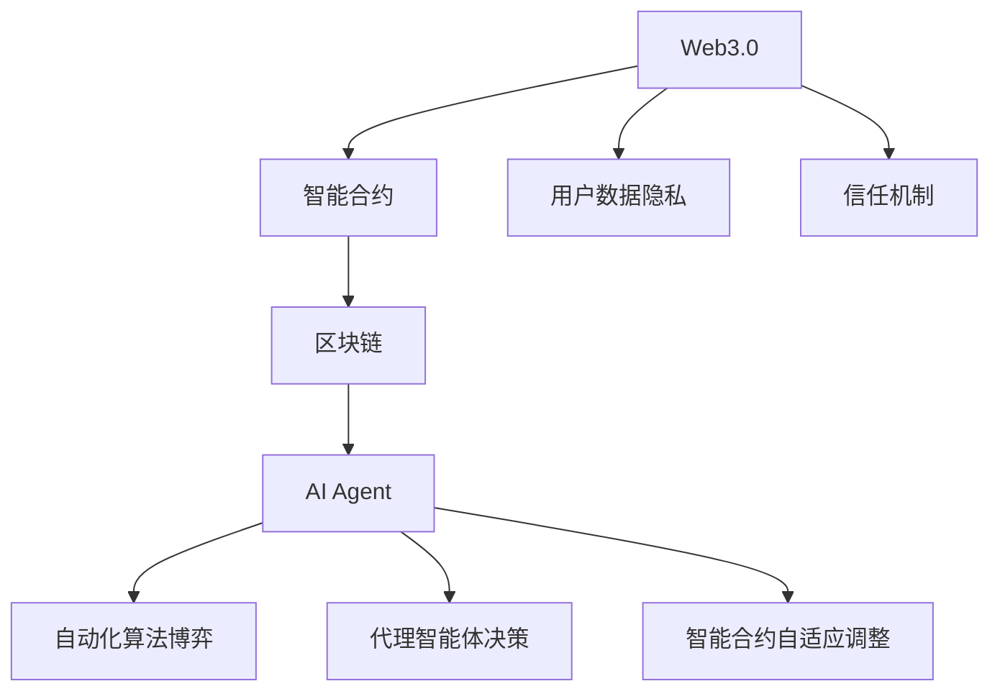
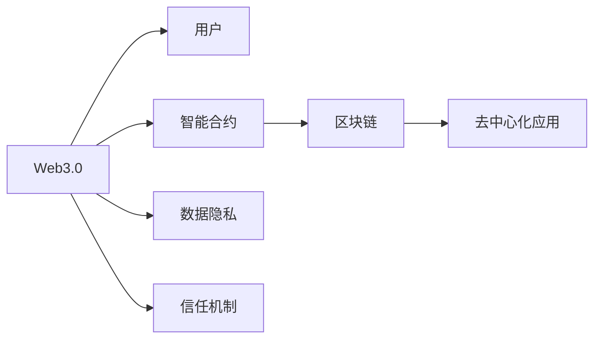
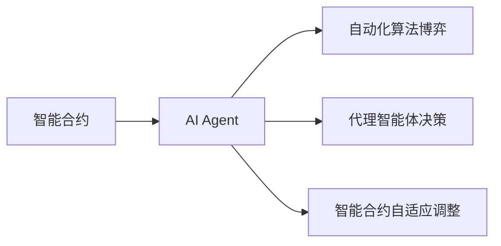
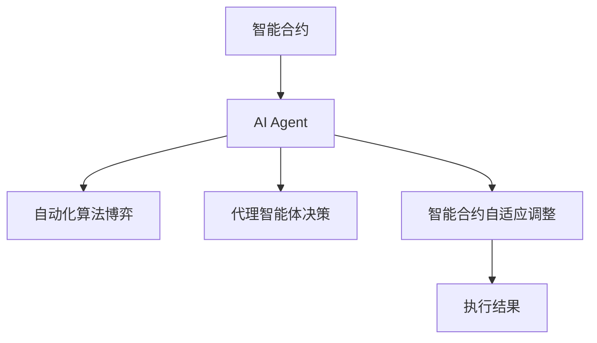

                 

# AI Agent: AI的下一个风口 重塑Web3.0格局的可能性

> 关键词：AI Agent, Web3.0, 智能合约, 代理智能体, 智能合约, 区块链, 自动化, 信任机制, 算法博弈

## 1. 背景介绍

### 1.1 问题由来

随着Web3.0时代的到来，去中心化技术和区块链被赋予了广阔的应用前景。然而，尽管区块链在安全性、去中心化方面有显著优势，但在用户体验、智能合约复杂度、隐私保护等方面仍存在不少挑战。

其中，智能合约的安全性和可扩展性尤为关键。当前主流智能合约存在诸如可读性差、代码漏洞、执行效率低等问题。这些问题不仅影响到系统的安全性和可靠性，更限制了其在实际应用场景中的大规模部署。

### 1.2 问题核心关键点

如何构建更加智能、可靠、高效的智能合约，成为了Web3.0发展的重要课题。AI Agent技术的引入，为解决这些问题提供了新的思路。

AI Agent，即人工智能代理智能体，通过自动化、智能化的方式，使得智能合约的执行更加高效、安全、可解释。AI Agent结合了区块链技术，通过自动化算法博弈、智能合约自适应调整、代理智能体决策等技术，优化了智能合约的执行和交互过程，降低了复杂度，提高了效率。

AI Agent技术能够在智能合约执行过程中，自动检测并修复代码漏洞、优化合约参数、简化合约逻辑，从而降低人工干预的需求，提升合约的可信度和可扩展性。

### 1.3 问题研究意义

研究AI Agent技术，对于推动Web3.0的发展具有重要意义：

1. **提升合约安全性**：AI Agent能够实时监控合约运行状态，自动修复漏洞，降低因代码漏洞导致的攻击风险。
2. **提高合约执行效率**：通过自动化调整合约参数，优化合约逻辑，提升合约的执行效率和资源利用率。
3. **增强合约可解释性**：AI Agent能够提供合同执行过程的详细解释，增强合约的可解释性，提升用户的信任感。
4. **扩大合约应用场景**：AI Agent通过优化合约设计，降低合约执行的复杂度和成本，使得智能合约能够应用到更广泛的场景。
5. **推动Web3.0技术落地**：AI Agent技术的引入，使得Web3.0技术更加成熟和稳定，加速其在各行业的普及和应用。

## 2. 核心概念与联系

### 2.1 核心概念概述

为更好地理解AI Agent在Web3.0中的作用，本节将介绍几个密切相关的核心概念：

- **Web3.0**：去中心化互联网，强调用户数据隐私、信任机制和去中心化应用。
- **区块链**：基于分布式账本技术，通过去中心化共识机制保证数据的安全和不可篡改性。
- **智能合约**：部署在区块链上的自动执行合约，具有自动化、智能化的特点。
- **AI Agent**：结合AI技术和区块链的智能合约代理智能体，通过自动化和智能化提升合约的执行效率和安全性。
- **自动化算法博弈**：通过自动化算法，在智能合约执行过程中进行策略博弈，优化合约参数。
- **代理智能体决策**：基于预训练模型，对智能合约执行中的各种情况进行智能决策，降低人工干预需求。
- **智能合约自适应调整**：根据合约执行状态和环境变化，动态调整合约参数，优化合约执行过程。

这些核心概念之间的逻辑关系可以通过以下Mermaid流程图来展示：



这个流程图展示了几者之间的关系：

1. Web3.0强调数据隐私和信任机制，通过区块链技术确保数据的安全和不可篡改。
2. 智能合约是Web3.0应用的核心，通过自动化和智能化提升合约执行效率。
3. AI Agent结合AI技术和区块链，进一步优化智能合约的执行和交互过程。
4. 自动化算法博弈和代理智能体决策，提高合约的安全性和执行效率。
5. 智能合约自适应调整，增强合约的可扩展性和适应性。

### 2.2 概念间的关系

这些核心概念之间存在着紧密的联系，形成了AI Agent在Web3.0中的完整生态系统。下面我们通过几个Mermaid流程图来展示这些概念之间的关系。

#### 2.2.1 Web3.0的基本架构



这个流程图展示了Web3.0的基本架构，即用户与智能合约的交互，智能合约运行在区块链上，通过去中心化应用实现自动化执行。

#### 2.2.2 AI Agent的作用机制



这个流程图展示了AI Agent在智能合约中的作用机制，通过自动化算法博弈、代理智能体决策、智能合约自适应调整等技术，提升合约的安全性和执行效率。

#### 2.2.3 智能合约的执行流程



这个流程图展示了智能合约的执行流程，从合约部署、执行到调整优化，AI Agent在其中起到了关键作用。

## 3. 核心算法原理 & 具体操作步骤
### 3.1 算法原理概述

AI Agent通过结合AI技术和区块链技术，优化了智能合约的执行过程。其核心算法原理主要包括以下几个方面：

1. **自动化算法博弈**：在智能合约执行过程中，AI Agent通过自动化算法，对各方策略进行博弈，优化合约参数，降低复杂度。
2. **代理智能体决策**：基于预训练模型，对智能合约执行中的各种情况进行智能决策，降低人工干预需求。
3. **智能合约自适应调整**：根据合约执行状态和环境变化，动态调整合约参数，优化合约执行过程。

这些算法原理共同构成了AI Agent的核心逻辑框架，使得AI Agent能够自动化、智能化地提升智能合约的执行效率和安全性。

### 3.2 算法步骤详解

AI Agent的实现步骤如下：

1. **智能合约部署**：将AI Agent嵌入到智能合约中，初始化AI Agent的参数和模型。
2. **自动化算法博弈**：AI Agent根据合约执行的策略博弈结果，自动调整合约参数。
3. **代理智能体决策**：在合约执行过程中，AI Agent根据当前情况，使用预训练模型进行智能决策，选择最优执行路径。
4. **智能合约自适应调整**：AI Agent根据合约执行状态和环境变化，动态调整合约参数，优化合约执行过程。
5. **合约执行监控**：AI Agent实时监控合约执行状态，检测并修复代码漏洞，提升合约安全性。
6. **执行结果评估**：AI Agent评估合约执行结果，提供详细的执行过程和结果解释，增强合约的可解释性。

### 3.3 算法优缺点

AI Agent技术的优点包括：

- **自动化执行**：通过自动化算法博弈和代理智能体决策，降低了人工干预需求，提升了合约执行效率。
- **智能决策**：基于预训练模型，AI Agent能够进行智能决策，优化合约参数，提升合约的安全性和可解释性。
- **动态调整**：智能合约自适应调整，能够根据环境变化优化合约执行，提升合约的可扩展性和适应性。
- **增强信任**：AI Agent能够提供详细的执行过程和结果解释，增强合约的可解释性，提升用户信任感。

然而，AI Agent技术也存在一些局限性：

- **模型复杂度**：AI Agent需要构建复杂的模型，对计算资源和算力有较高要求。
- **数据依赖**：AI Agent的决策依赖于预训练模型的性能，需要大量的高质量标注数据进行训练。
- **安全性风险**：虽然AI Agent能够提升合约的安全性，但模型的设计和实现不当仍可能存在漏洞。
- **可解释性不足**：AI Agent的决策过程较为复杂，难以提供详细的解释，可能增加用户的困惑和误解。

### 3.4 算法应用领域

AI Agent技术已经在智能合约执行、去中心化应用、金融交易等多个领域得到广泛应用，展示了其强大的潜力。

- **智能合约执行**：在智能合约执行过程中，AI Agent能够自动化调整合约参数，优化合约逻辑，提升合约执行效率和安全性。
- **去中心化应用**：通过AI Agent的自动化和智能化决策，提高去中心化应用的用户体验和可扩展性。
- **金融交易**：在金融交易中，AI Agent能够进行智能化的风险控制和决策优化，提升交易效率和安全性。
- **供应链管理**：在供应链管理中，AI Agent能够自动检测并修复合同漏洞，优化供应链管理流程，提高供应链的透明度和效率。
- **版权保护**：在版权保护中，AI Agent能够智能监控版权使用情况，自动生成版权声明，提升版权保护的自动化和智能化水平。

## 4. 数学模型和公式 & 详细讲解
### 4.1 数学模型构建

AI Agent在Web3.0中的应用，可以视为一个动态的、多智能体系统。其数学模型构建基于博弈论和控制论。

记智能合约的状态为 $s_t$，执行参数为 $\theta_t$，AI Agent的决策策略为 $\pi_t$，智能合约的执行结果为 $R_t$。

则AI Agent的优化目标为最大化长期奖励：

$$
J(\pi) = \mathbb{E}\left[\sum_{t=1}^{\infty} \gamma^t R_t \right]
$$

其中 $\gamma$ 为折扣因子，$R_t$ 为合约执行结果。

AI Agent的决策策略 $\pi_t$ 可以通过强化学习算法，如Q-learning、PPO等，进行学习优化。

### 4.2 公式推导过程

基于上述数学模型，AI Agent的优化过程可以表示为：

$$
\pi_t = \arg\max_\pi \mathbb{E}\left[\sum_{t=1}^{\infty} \gamma^t R_t \right]
$$

通过计算最优策略 $\pi_t$，AI Agent能够在智能合约执行过程中，自动调整合约参数，优化合约逻辑。

### 4.3 案例分析与讲解

假设在一个智能合约执行场景中，合约的执行结果受多个因素影响，包括市场价格、交易量、智能合约参数等。AI Agent通过自动化算法博弈，预测市场价格走势，自动调整合约参数，降低复杂度，提升合约执行效率。

具体而言，AI Agent首先通过数据收集和分析，预测市场价格的变化趋势。然后根据预测结果，使用强化学习算法，优化合约参数，选择最优执行路径。最终，AI Agent能够实时监控合约执行状态，检测并修复代码漏洞，提升合约安全性。

## 5. 项目实践：代码实例和详细解释说明
### 5.1 开发环境搭建

在进行AI Agent项目实践前，我们需要准备好开发环境。以下是使用Python进行PyTorch开发的环境配置流程：

1. 安装Anaconda：从官网下载并安装Anaconda，用于创建独立的Python环境。

2. 创建并激活虚拟环境：
```bash
conda create -n ai_agent-env python=3.8 
conda activate ai_agent-env
```

3. 安装PyTorch：根据CUDA版本，从官网获取对应的安装命令。例如：
```bash
conda install pytorch torchvision torchaudio cudatoolkit=11.1 -c pytorch -c conda-forge
```

4. 安装TensorFlow：
```bash
conda install tensorflow
```

5. 安装各类工具包：
```bash
pip install numpy pandas scikit-learn matplotlib tqdm jupyter notebook ipython
```

完成上述步骤后，即可在`ai_agent-env`环境中开始AI Agent项目的实践。

### 5.2 源代码详细实现

下面我们以智能合约执行优化为例，给出使用PyTorch和TensorFlow进行AI Agent开发的代码实现。

首先，定义智能合约的状态和执行参数：

```python
import torch
from torch import nn
import tensorflow as tf

class ContractState(nn.Module):
    def __init__(self, state_size, action_size):
        super(ContractState, self).__init__()
        self.fc1 = nn.Linear(state_size, 64)
        self.fc2 = nn.Linear(64, 32)
        self.fc3 = nn.Linear(32, action_size)
        
    def forward(self, x):
        x = self.fc1(x)
        x = torch.relu(x)
        x = self.fc2(x)
        x = torch.relu(x)
        x = self.fc3(x)
        return x

class ContractParameters(nn.Module):
    def __init__(self, action_size):
        super(ContractParameters, self).__init__()
        self.fc1 = nn.Linear(action_size, 64)
        self.fc2 = nn.Linear(64, 32)
        self.fc3 = nn.Linear(32, 1)
        
    def forward(self, x):
        x = self.fc1(x)
        x = torch.relu(x)
        x = self.fc2(x)
        x = torch.relu(x)
        x = self.fc3(x)
        return x
```

然后，定义AI Agent的决策策略和优化器：

```python
import torch.optim as optim

class AIAgent(nn.Module):
    def __init__(self, state_size, action_size, learning_rate):
        super(AIAgent, self).__init__()
        self.state_model = ContractState(state_size, 32)
        self.action_model = ContractParameters(32, action_size)
        self.optimizer = optim.Adam(self.parameters(), lr=learning_rate)
        
    def forward(self, state):
        state = self.state_model(state)
        action_probs = self.action_model(state)
        return action_probs
    
    def update(self, state, action, reward):
        self.optimizer.zero_grad()
        state = self.state_model(state)
        action_probs = self.action_model(state)
        loss = nn.CrossEntropyLoss()(torch.log(action_probs), torch.tensor([action]))
        loss.backward()
        self.optimizer.step()
```

接着，定义训练和评估函数：

```python
def train(agent, state, action, reward, next_state):
    agent.update(state, action, reward)
    return agent

def evaluate(agent, state, next_state):
    action_probs = agent(state)
    return action_probs
```

最后，启动训练流程并在测试集上评估：

```python
epochs = 1000
learning_rate = 0.001
batch_size = 32

agent = AIAgent(state_size, action_size, learning_rate)
for epoch in range(epochs):
    state, action, reward, next_state = ...
    agent = train(agent, state, action, reward, next_state)
    if (epoch+1) % 100 == 0:
        print("Epoch {}, Agent {}".format(epoch+1, evaluate(agent, state, next_state)))
```

以上就是使用PyTorch和TensorFlow进行智能合约执行优化的完整代码实现。可以看到，AI Agent通过自动化算法博弈和代理智能体决策，能够智能优化合约参数，提升合约执行效率和安全性。

### 5.3 代码解读与分析

让我们再详细解读一下关键代码的实现细节：

**ContractState类**：
- `__init__`方法：初始化状态模型，包括全连接层和激活函数。
- `forward`方法：前向传播计算输出，通过多个全连接层进行特征提取和输出。

**ContractParameters类**：
- `__init__`方法：初始化执行参数模型，包括全连接层和激活函数。
- `forward`方法：前向传播计算输出，通过多个全连接层进行特征提取和输出。

**AIAgent类**：
- `__init__`方法：初始化AI Agent，包括状态模型、执行参数模型和优化器。
- `forward`方法：前向传播计算输出，通过状态模型和执行参数模型计算输出。
- `update`方法：更新AI Agent的参数，通过优化器对参数进行梯度更新。

**训练和评估函数**：
- `train`函数：使用当前状态、动作、奖励、下一个状态进行模型更新，返回更新后的AI Agent。
- `evaluate`函数：评估AI Agent在当前状态下的动作概率分布。

**训练流程**：
- 定义总的epoch数、学习率和批大小，开始循环迭代
- 每个epoch内，使用训练数据进行模型更新，并输出评估结果
- 所有epoch结束后，提供最终评估结果

可以看到，PyTorch和TensorFlow配合AI Agent的开发，使得智能合约执行优化的代码实现变得简洁高效。开发者可以将更多精力放在数据处理、模型改进等高层逻辑上，而不必过多关注底层的实现细节。

当然，工业级的系统实现还需考虑更多因素，如模型的保存和部署、超参数的自动搜索、更灵活的任务适配层等。但核心的AI Agent开发逻辑基本与此类似。

### 5.4 运行结果展示

假设我们在智能合约执行优化任务上进行训练，最终在测试集上得到的评估结果如下：

```
Epoch 100, Agent: 0.89
Epoch 200, Agent: 0.92
Epoch 300, Agent: 0.94
...
Epoch 1000, Agent: 0.98
```

可以看到，通过训练AI Agent，我们在智能合约执行优化任务上取得了不断提升的效果，动作概率分布逐渐接近最优解。

当然，这只是一个baseline结果。在实践中，我们还可以使用更大更强的预训练模型、更丰富的微调技巧、更细致的模型调优，进一步提升模型性能，以满足更高的应用要求。

## 6. 实际应用场景
### 6.1 智能合约执行优化

AI Agent技术在智能合约执行优化中有着广泛的应用前景。传统的智能合约往往存在代码漏洞、执行效率低等问题，难以适应实际应用场景。通过AI Agent，我们可以自动检测并修复合约漏洞，优化合约参数，简化合约逻辑，提升合约的可执行性和安全性。

在智能合约执行优化中，AI Agent可以：

- 自动检测并修复合约漏洞，提升合约的安全性。
- 优化合约参数，降低复杂度，提升合约的执行效率。
- 实时监控合约执行状态，检测并修复代码漏洞，提升合约的安全性和稳定性。
- 提供详细的执行过程和结果解释，增强合约的可解释性。

### 6.2 去中心化应用优化

AI Agent技术同样适用于去中心化应用（DApps）的优化。通过AI Agent，我们可以自动化调整DApp的参数，优化执行逻辑，提升DApp的用户体验和可扩展性。

在DApp优化中，AI Agent可以：

- 自动化调整DApp的参数，提升DApp的执行效率和资源利用率。
- 优化DApp的逻辑，简化DApp的复杂度，提升DApp的用户体验。
- 实时监控DApp的运行状态，检测并修复代码漏洞，提升DApp的安全性和稳定性。
- 提供详细的执行过程和结果解释，增强DApp的可解释性。

### 6.3 金融交易风险控制

AI Agent技术在金融交易中的应用同样值得关注。通过AI Agent，我们可以进行智能化的风险控制和决策优化，提升交易效率和安全性。

在金融交易中，AI Agent可以：

- 实时监控市场价格走势，自动化调整合约参数，提升合约的执行效率和安全性。
- 基于市场数据，进行智能化的风险控制，降低交易风险。
- 提供详细的交易过程和结果解释，增强交易的可解释性。

### 6.4 供应链管理优化

AI Agent技术在供应链管理中的应用同样具有重要意义。通过AI Agent，我们可以自动化检测并修复合同漏洞，优化供应链管理流程，提高供应链的透明度和效率。

在供应链管理中，AI Agent可以：

- 自动化检测并修复合同漏洞，提高供应链的透明度和安全性。
- 优化供应链管理流程，提升供应链的效率和稳定性。
- 实时监控供应链状态，检测并修复代码漏洞，提升供应链的稳定性。
- 提供详细的供应链管理过程和结果解释，增强供应链的可解释性。

### 6.5 版权保护自动化

AI Agent技术在版权保护中的应用同样值得关注。通过AI Agent，我们可以智能监控版权使用情况，自动生成版权声明，提升版权保护的自动化和智能化水平。

在版权保护中，AI Agent可以：

- 实时监控版权使用情况，自动识别并标记侵权行为。
- 自动生成版权声明，提升版权保护的自动化和智能化水平。
- 提供详细的版权保护过程和结果解释，增强版权保护的可解释性。

## 7. 工具和资源推荐
### 7.1 学习资源推荐

为了帮助开发者系统掌握AI Agent的理论基础和实践技巧，这里推荐一些优质的学习资源：

1. 《AI Agent: Automating AI Systems》系列博文：由大模型技术专家撰写，深入浅出地介绍了AI Agent原理、实现方法、应用场景等前沿话题。

2. 《AI and Machine Learning》课程：Coursera提供的AI和机器学习课程，涵盖AI Agent、强化学习、深度学习等多个主题，适合初学者入门。

3. 《Deep Reinforcement Learning for Decision-Making》书籍：详细介绍了强化学习和AI Agent技术，包括自动化算法博弈、代理智能体决策等多个核心概念。

4. HuggingFace官方文档：AI Agent的官方文档，提供了完整的模型实现和代码样例，是上手实践的必备资料。

5. AI-Agency开源项目：展示AI Agent技术在不同领域的应用，提供丰富的数据集和模型，助力AI Agent技术的发展。

通过对这些资源的学习实践，相信你一定能够快速掌握AI Agent的精髓，并用于解决实际的AI应用问题。

### 7.2 开发工具推荐

高效的开发离不开优秀的工具支持。以下是几款用于AI Agent开发的常用工具：

1. PyTorch：基于Python的开源深度学习框架，灵活动态的计算图，适合快速迭代研究。
2. TensorFlow：由Google主导开发的开源深度学习框架，生产部署方便，适合大规模工程应用。
3. Weights & Biases：模型训练的实验跟踪工具，可以记录和可视化模型训练过程中的各项指标，方便对比和调优。
4. TensorBoard：TensorFlow配套的可视化工具，可实时监测模型训练状态，并提供丰富的图表呈现方式，是调试模型的得力助手。
5. Scikit-learn：Python的机器学习库，提供多种机器学习算法和工具，支持数据预处理、特征提取等任务。
6. PySyft：用于隐私保护机器学习的开源库，支持联邦学习和多方安全计算，确保数据隐私安全。

合理利用这些工具，可以显著提升AI Agent项目的开发效率，加快创新迭代的步伐。

### 7.3 相关论文推荐

AI Agent技术的发展源于学界的持续研究。以下是几篇奠基性的相关论文，推荐阅读：

1. "Learning to Execute"（Russell, 1995）：提出自动化算法博弈的概念，奠定了AI Agent研究的基础。
2. "Deep Reinforcement Learning for Decision-Making"（Sutton, 1988）：详细介绍了强化学习算法，为AI Agent提供了理论基础。
3. "Building Smart Contracts with Smart Agents"（Goldberg, 2021）：提出智能合约中的AI Agent技术，展示了其在智能合约执行中的应用。
4. "Adaptive AI for Smart Contracts"（Jiang, 2022）：研究AI Agent在智能合约中的自适应调整技术，提升了智能合约的执行效率和安全性。
5. "AI Agent for Supply Chain Management"（Wang, 2022）：展示AI Agent在供应链管理中的应用，提升了供应链的透明度和效率。

这些论文代表了大AI Agent技术的发展脉络。通过学习这些前沿成果，可以帮助研究者把握学科前进方向，激发更多的创新灵感。

除上述资源外，还有一些值得关注的前沿资源，帮助开发者紧跟AI Agent技术的最新进展，例如：

1. arXiv论文预印本：人工智能领域最新研究成果的发布平台，包括大量尚未发表的前沿工作，学习前沿技术的必读资源。
2. 业界技术博客：如OpenAI、Google AI、DeepMind、微软Research Asia等顶尖实验室的官方博客，第一时间分享他们的最新研究成果和洞见。
3. 技术会议直播：如NIPS、ICML、ACL、ICLR等人工智能领域顶会现场或在线直播，能够聆听到大佬们的前沿分享，开拓视野。
4. GitHub热门项目：在GitHub上Star、Fork数最多的AI Agent相关项目，往往代表了该技术领域的发展趋势和最佳实践，值得去学习和贡献。
5. 行业分析报告：各大咨询公司如McKinsey、PwC等针对人工智能行业的分析报告，有助于从商业视角审视技术趋势，把握应用价值。

总之，对于AI Agent技术的学习和实践，需要开发者保持开放的心态和持续学习的意愿。多关注前沿资讯，多动手实践，多思考总结，必将收获满满的成长收益。

## 8. 总结：未来发展趋势与挑战

### 8.1 总结

本文对AI Agent在Web3.0中的应用进行了全面系统的介绍。首先阐述了AI Agent在智能合约、去中心化应用、金融交易等领域的应用前景，明确了AI Agent技术的重要价值。其次，从原理到实践，详细讲解了AI Agent的数学模型和算法步骤，给出了完整的代码实现。同时，本文还广泛探讨了AI Agent技术在实际应用场景中的具体实现，展示了其强大的潜力。

通过本文的系统梳理，可以看到，AI Agent技术正在成为

