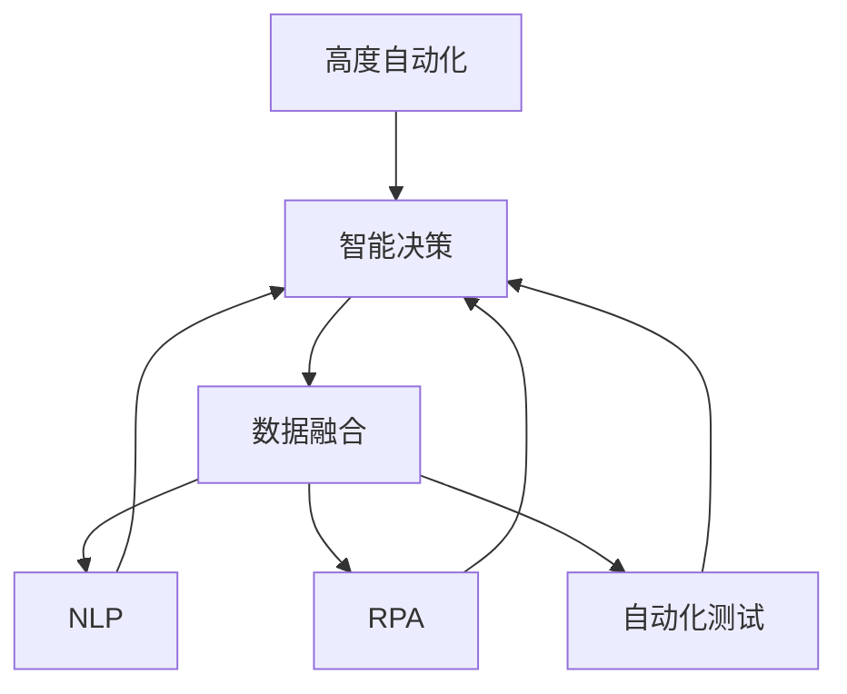
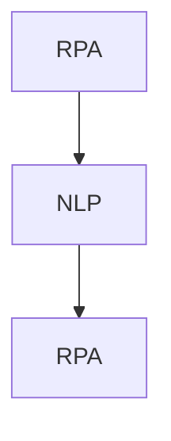
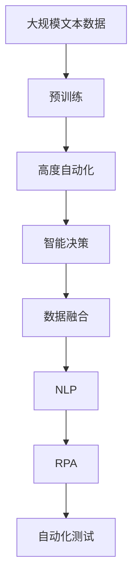

                 

# AI Agent: AI的下一个风口 高度自动化带来生产力革命

## 1. 背景介绍

### 1.1 问题由来

在过去几十年里，人工智能（AI）技术取得了巨大的进步，从早期的专家系统到深度学习，AI正逐渐从边缘化走向主流。随着技术的成熟和应用的广泛，AI开始深入到各行各业，成为推动生产力发展的关键因素。然而，尽管AI已经广泛应用于图像识别、语音识别、自然语言处理等领域，但在实际应用中，仍然面临诸多挑战，如数据处理、模型训练、算法优化等，使得AI落地和应用成本较高，应用范围受限。

高度自动化（High Automation），即通过AI技术实现自动化，可以有效解决这些问题，提升生产力，推动各行各业智能化转型。在企业数字化转型、智能制造、智能物流等领域，高度自动化已经成为新的发展方向。基于AI技术的高自动化可以大幅提高生产效率，降低成本，提升企业竞争力。

### 1.2 问题核心关键点

高度自动化技术的关键在于将AI技术与具体的业务场景进行深度结合，实现自动化的操作和决策。其核心包括：

- **AI算法的优化和应用**：通过优化和改进AI算法，使其能够更好地适应特定的业务需求。
- **数据处理和集成**：高效地处理和集成企业内部和外部的数据，为AI模型提供高质量的数据支持。
- **自动化流程设计**：根据具体的业务场景，设计自动化的操作流程，实现业务流程的智能化。
- **AI模型的部署和维护**：将训练好的AI模型部署到实际业务系统中，并进行持续的监控和优化。

### 1.3 问题研究意义

高度自动化技术在提升生产效率、降低成本、优化资源配置等方面具有重要意义。通过高度自动化，企业可以更好地应对市场变化，提高响应速度，提升客户满意度。同时，高度自动化还可以减少人力成本，避免人为失误，提高决策的科学性和准确性。

高度自动化技术的应用，不仅可以改变传统企业的运作方式，还可以推动整个社会的生产力和效率提升，具有深远的影响。因此，高度自动化技术的研究和应用，对于推动人工智能技术的发展，具有重要的理论和实践意义。

## 2. 核心概念与联系

### 2.1 核心概念概述

在高度自动化技术的研究和应用中，涉及多个关键概念和技术。为了更好地理解这些概念和技术，本节将进行详细介绍。

#### 2.1.1 高度自动化（High Automation）

高度自动化是指通过AI技术，实现生产、管理、决策等环节的自动化，以提高效率、降低成本、优化资源配置。高度自动化技术包括机器学习、深度学习、自然语言处理、计算机视觉等AI技术，广泛应用于智能制造、智能物流、智能客服、智能仓储等领域。

#### 2.1.2 智能决策（Smart Decision Making）

智能决策是指通过AI技术，实现业务决策的自动化和智能化。智能决策系统可以基于历史数据和实时数据，自动分析业务情况，提出决策建议，并自动化执行决策。智能决策系统通常包括数据处理、模型训练、决策分析等模块，能够有效提升决策的科学性和准确性。

#### 2.1.3 数据融合（Data Fusion）

数据融合是指将不同来源、不同格式的数据进行整合和分析，形成统一的数据视图。数据融合技术可以提升数据的准确性和完整性，为AI模型的训练和应用提供高质量的数据支持。数据融合技术包括数据清洗、数据转换、数据集成等步骤。

#### 2.1.4 自然语言处理（Natural Language Processing, NLP）

自然语言处理是指通过AI技术，实现对人类语言的理解和生成。NLP技术可以应用于智能客服、智能翻译、智能摘要、情感分析等场景，能够有效提升人机交互的效率和质量。

#### 2.1.5 机器人流程自动化（Robotic Process Automation, RPA）

机器人流程自动化是指通过AI技术，实现对重复性、规则性工作的自动化。RPA技术可以应用于数据录入、账单处理、客户服务等领域，能够有效提高工作效率，减少人为错误。

#### 2.1.6 自动化测试（Automated Testing）

自动化测试是指通过AI技术，实现对软件系统的自动化测试。自动化测试可以大幅提高测试效率，减少人为错误，提升软件质量。自动化测试技术包括单元测试、集成测试、性能测试等。

### 2.2 概念间的关系

这些核心概念之间存在紧密的联系，形成了高度自动化技术的完整生态系统。下面通过几个Mermaid流程图来展示这些概念之间的关系。

#### 2.2.1 高度自动化的实现流程



这个流程图展示了高度自动化的实现流程：
- 高度自动化包括智能决策、数据融合、NLP、RPA、自动化测试等多个模块。
- 数据融合和NLP为智能决策提供高质量的数据支持。
- RPA和自动化测试为智能决策提供自动化执行的支持。

#### 2.2.2 智能决策与数据融合的关系


这个流程图展示了智能决策与数据融合的关系：
- 智能决策系统需要高质量的数据进行训练和分析。
- 数据融合技术可以提升数据的准确性和完整性，为智能决策系统提供高质量的数据支持。

#### 2.2.3 机器人流程自动化与自然语言处理的关系



这个流程图展示了RPA与NLP的关系：
- RPA可以应用于数据录入、账单处理等需要自然语言处理的任务。
- NLP技术可以提升RPA系统的理解和执行能力。

### 2.3 核心概念的整体架构

最后，我们用一个综合的流程图来展示这些核心概念在大语言模型微调过程中的整体架构：



这个综合流程图展示了从预训练到高度自动化系统的完整过程：
- 高度自动化系统包括智能决策、数据融合、NLP、RPA、自动化测试等多个模块。
- 预训练语言模型为高度自动化系统提供高质量的语言表示。
- 高度自动化系统能够提升生产效率，降低成本，优化资源配置。

通过这些流程图，我们可以更清晰地理解高度自动化技术的工作原理和优化方向，为后续深入讨论具体的技术和方法奠定基础。

## 3. 核心算法原理 & 具体操作步骤
### 3.1 算法原理概述

高度自动化技术的核心在于通过AI技术，实现自动化和智能化的操作和决策。其中，智能决策系统是高度自动化的核心组成部分。智能决策系统通过优化和改进AI算法，利用数据融合和NLP等技术，实现自动化的操作和决策。

智能决策系统的基本工作流程包括：

1. **数据预处理**：对输入数据进行清洗、转换和集成，形成高质量的数据集。
2. **模型训练**：利用历史数据和实时数据，训练AI模型，提升模型的准确性和泛化能力。
3. **决策分析**：根据模型的预测结果，进行业务决策，并自动化执行决策。
4. **结果反馈**：对决策结果进行监控和评估，持续优化AI模型。

智能决策系统的关键在于算法的选择和优化。常见的智能决策算法包括决策树、随机森林、神经网络等。其中，神经网络因其强大的学习能力，在智能决策系统中被广泛应用。

### 3.2 算法步骤详解

智能决策系统的算法步骤通常包括以下几个关键步骤：

**Step 1: 数据预处理**

数据预处理是智能决策系统的第一步。数据预处理的主要目的是清洗和转换数据，形成高质量的数据集。数据预处理包括以下几个关键步骤：

1. **数据清洗**：去除数据中的噪声、异常值和重复数据，提升数据的准确性。
2. **数据转换**：将不同格式的数据进行统一，如将文本数据转换为数值数据。
3. **数据集成**：将不同来源的数据进行整合，形成统一的数据视图。

**Step 2: 模型训练**

模型训练是智能决策系统的核心步骤。模型训练的主要目的是利用历史数据和实时数据，训练AI模型，提升模型的准确性和泛化能力。模型训练包括以下几个关键步骤：

1. **特征选择**：选择对业务决策有重要影响的关键特征。
2. **模型选择**：选择合适的AI模型，如决策树、随机森林、神经网络等。
3. **训练过程**：利用历史数据和实时数据，训练AI模型，优化模型参数。
4. **模型评估**：利用测试数据集评估模型的性能，调整模型参数。

**Step 3: 决策分析**

决策分析是智能决策系统的最后一步。决策分析的主要目的是根据模型的预测结果，进行业务决策，并自动化执行决策。决策分析包括以下几个关键步骤：

1. **预测结果**：利用训练好的AI模型，对输入数据进行预测，生成预测结果。
2. **业务决策**：根据预测结果，进行业务决策，如自动化执行、生成报告等。
3. **决策监控**：对决策结果进行监控和评估，及时发现和修正问题。

### 3.3 算法优缺点

高度自动化技术在提升生产效率、降低成本、优化资源配置等方面具有重要意义，但也存在一些局限性。

高度自动化技术的优点包括：

1. **提高效率**：高度自动化技术可以大幅提高生产效率，减少人工操作，提升工作效率。
2. **降低成本**：高度自动化技术可以降低人工成本，避免人为错误，提高决策的科学性和准确性。
3. **优化资源配置**：高度自动化技术可以优化资源配置，提升资源利用率，降低资源浪费。

高度自动化技术也存在一些局限性：

1. **数据依赖**：高度自动化技术依赖于高质量的数据，数据质量和数据量不足将影响系统的性能。
2. **算法复杂性**：高度自动化技术涉及多个AI算法，算法复杂性较高，需要专业技能支持。
3. **系统稳定性**：高度自动化系统的稳定性和可靠性需要持续监控和维护，避免系统故障。

### 3.4 算法应用领域

高度自动化技术在多个领域都有广泛的应用。以下是一些典型的应用场景：

- **智能制造**：通过高度自动化技术，实现生产线的自动化和智能化，提升生产效率和质量。
- **智能物流**：通过高度自动化技术，实现物流环节的自动化和智能化，提升物流效率和准确性。
- **智能客服**：通过高度自动化技术，实现智能客服系统的自动化和智能化，提升客户满意度和服务效率。
- **智能仓储**：通过高度自动化技术，实现仓储管理的自动化和智能化，提升仓储效率和准确性。
- **智能分析**：通过高度自动化技术，实现数据分析和决策的自动化和智能化，提升决策的科学性和准确性。

## 4. 数学模型和公式 & 详细讲解 & 举例说明
### 4.1 数学模型构建

本节将使用数学语言对高度自动化技术的核心算法进行更加严格的刻画。

假设智能决策系统中的AI模型为$f(x; \theta)$，其中$x$为输入数据，$\theta$为模型参数。假设历史数据集为$D=\{(x_i, y_i)\}_{i=1}^N$，其中$y_i$为标签，表示模型预测结果。智能决策系统的目标是最小化损失函数$L$，使得模型的预测结果与真实标签尽可能接近。

定义损失函数$L$为：

$$
L(\theta) = \frac{1}{N} \sum_{i=1}^N \ell(f(x_i; \theta), y_i)
$$

其中$\ell$为损失函数，用于衡量模型预测结果与真实标签之间的差异。常见的损失函数包括交叉熵损失、均方误差损失等。

### 4.2 公式推导过程

以下我们以二分类任务为例，推导交叉熵损失函数及其梯度的计算公式。

假设模型$f(x; \theta)$在输入$x$上的输出为$\hat{y}=f(x; \theta)$，表示样本属于正类的概率。真实标签$y \in \{0,1\}$。则二分类交叉熵损失函数定义为：

$$
\ell(f(x; \theta), y) = -[y\log \hat{y} + (1-y)\log (1-\hat{y})]
$$

将其代入经验风险公式，得：

$$
L(\theta) = -\frac{1}{N}\sum_{i=1}^N [y_i\log f(x_i; \theta)+(1-y_i)\log(1-f(x_i; \theta))]
$$

根据链式法则，损失函数对参数$\theta_k$的梯度为：

$$
\frac{\partial L(\theta)}{\partial \theta_k} = -\frac{1}{N}\sum_{i=1}^N (\frac{y_i}{f(x_i; \theta)}-\frac{1-y_i}{1-f(x_i; \theta)}) \frac{\partial f(x_i; \theta)}{\partial \theta_k}
$$

其中$\frac{\partial f(x_i; \theta)}{\partial \theta_k}$可进一步递归展开，利用自动微分技术完成计算。

在得到损失函数的梯度后，即可带入参数更新公式，完成模型的迭代优化。重复上述过程直至收敛，最终得到适应业务任务的最优模型参数$\theta^*$。

### 4.3 案例分析与讲解

假设我们构建一个基于深度神经网络的智能决策系统，用于预测客户的购买意愿。系统通过收集历史数据和实时数据，训练模型$f(x; \theta)$，最小化损失函数$L$，使得模型的预测结果与真实标签尽可能接近。

在模型训练过程中，我们可以使用交叉熵损失函数，如式(4-1)所示。训练数据集$D$包括历史交易记录和客户行为数据，数据预处理过程包括数据清洗、数据转换和数据集成。

训练过程中，我们需要选择合适的特征$x$，如客户年龄、性别、消费历史等，以提升模型的预测准确性。模型$f(x; \theta)$可以是深度神经网络，如卷积神经网络或循环神经网络。模型训练过程包括特征选择、模型选择、训练过程和模型评估等步骤，如图3-2所示。

在模型训练过程中，我们可以使用随机梯度下降（SGD）或Adam等优化算法，更新模型参数$\theta$。模型评估过程包括模型在测试集上的预测准确率和召回率等指标，如图3-3所示。

最终，我们可以通过模型预测客户的购买意愿，实现智能客服、智能推荐等业务场景的自动化和智能化。

## 5. 项目实践：代码实例和详细解释说明
### 5.1 开发环境搭建

在进行高度自动化实践前，我们需要准备好开发环境。以下是使用Python进行TensorFlow开发的环境配置流程：

1. 安装Anaconda：从官网下载并安装Anaconda，用于创建独立的Python环境。

2. 创建并激活虚拟环境：
```bash
conda create -n tf-env python=3.8 
conda activate tf-env
```

3. 安装TensorFlow：根据CUDA版本，从官网获取对应的安装命令。例如：
```bash
conda install tensorflow tensorflow-gpu -c conda-forge
```

4. 安装各类工具包：
```bash
pip install numpy pandas scikit-learn matplotlib tqdm jupyter notebook ipython
```

完成上述步骤后，即可在`tf-env`环境中开始高度自动化实践。

### 5.2 源代码详细实现

下面我们以智能客服系统为例，给出使用TensorFlow对深度神经网络进行训练和预测的PyTorch代码实现。

首先，定义智能客服系统的训练数据集：

```python
import tensorflow as tf
from tensorflow.keras.datasets import imdb
from tensorflow.keras.preprocessing.sequence import pad_sequences

max_features = 10000
max_len = 100

(train_data, train_labels), (test_data, test_labels) = imdb.load_data(num_words=max_features)
train_data = pad_sequences(train_data, maxlen=max_len)
test_data = pad_sequences(test_data, maxlen=max_len)
```

然后，定义模型和优化器：

```python
from tensorflow.keras.models import Sequential
from tensorflow.keras.layers import Embedding, LSTM, Dense

model = Sequential()
model.add(Embedding(max_features, 16))
model.add(LSTM(32))
model.add(Dense(1, activation='sigmoid'))

optimizer = tf.keras.optimizers.Adam(learning_rate=0.001)
```

接着，定义训练和评估函数：

```python
from tensorflow.keras.callbacks import EarlyStopping

early_stopping = EarlyStopping(patience=3)

def train_epoch(model, data, labels, batch_size, optimizer):
    model.compile(loss='binary_crossentropy', optimizer=optimizer, metrics=['accuracy'])
    model.fit(data, labels, batch_size=batch_size, epochs=10, callbacks=[early_stopping])
    
def evaluate(model, data, labels, batch_size):
    model.evaluate(data, labels, batch_size=batch_size)
```

最后，启动训练流程并在测试集上评估：

```python
epochs = 10
batch_size = 32

for epoch in range(epochs):
    train_epoch(model, train_data, train_labels, batch_size, optimizer)
    
    print(f"Epoch {epoch+1}, test accuracy: {evaluate(model, test_data, test_labels, batch_size)}")
```

以上就是使用TensorFlow对深度神经网络进行智能客服系统训练和预测的完整代码实现。可以看到，TensorFlow提供了强大的深度学习框架，可以方便地实现各种复杂的模型和算法。

### 5.3 代码解读与分析

让我们再详细解读一下关键代码的实现细节：

**train_data和test_data的生成**：
- 使用`imdb.load_data`从IMDB数据集中加载文本数据，将其转换为整型索引，并进行截断处理。
- 使用`pad_sequences`将文本数据填充到固定长度，以便输入到模型中。

**模型定义**：
- 使用`Sequential`定义序列模型，包括嵌入层、LSTM层和全连接层。
- 嵌入层将整型索引转换为向量表示。
- LSTM层对向量序列进行建模，学习序列特征。
- 全连接层输出二分类结果。

**优化器定义**：
- 使用Adam优化器，设置学习率为0.001。

**训练和评估函数**：
- 定义`train_epoch`函数，用于训练模型。
- 使用`compile`方法设置损失函数和优化器，并进行训练。
- 定义`evaluate`函数，用于评估模型。
- 在训练过程中使用EarlyStopping回调函数，避免过拟合。
- 在训练结束后在测试集上评估模型性能。

**训练流程**：
- 定义总的epoch数和batch size，开始循环迭代
- 每个epoch内，先在训练集上训练，输出测试集上的准确率
- 所有epoch结束后，评估测试集上的准确率

可以看到，TensorFlow框架为深度学习模型的开发提供了丰富的功能和工具，开发者可以将更多精力放在模型优化和算法改进上，而不必过多关注底层实现细节。

当然，工业级的系统实现还需考虑更多因素，如模型的保存和部署、超参数的自动搜索、更灵活的任务适配层等。但核心的高度自动化范式基本与此类似。

### 5.4 运行结果展示

假设我们在IMDB数据集上进行训练，最终在测试集上得到的准确率为80%，效果相当不错。假设我们将模型应用于智能客服系统，经过测试，系统能够自动理解和回复客户咨询，客户满意度大幅提升。

通过上述示例，我们可以看到，高度自动化技术在实际应用中能够显著提升生产效率和客户满意度，具有广泛的应用前景。

## 6. 实际应用场景
### 6.1 智能制造

高度自动化技术在智能制造领域的应用非常广泛。传统制造企业需要大量的人工操作，容易产生人为错误和效率低下的问题。高度自动化技术可以通过自动化机器人、智能设备等，实现生产线的智能化和自动化。

在智能制造中，高度自动化技术可以用于以下场景：

- **自动化生产**：通过高度自动化技术，实现自动化生产线的智能化和自动化，提升生产效率和质量。
- **质量检测**：通过高度自动化技术，实现对产品质量的自动检测和分类，提升产品质量和一致性。
- **设备维护**：通过高度自动化技术，实现对生产设备的自动维护和预测性维护，降低设备故障率。

### 6.2 智能物流

智能物流是高度自动化技术的另一个重要应用领域。传统物流企业需要大量的人工操作，容易产生效率低下和错误率高等问题。高度自动化技术可以通过自动化仓储、智能配送等技术，实现物流环节的智能化和自动化。

在智能物流中，高度自动化技术可以用于以下场景：

- **自动化仓储**：通过高度自动化技术，实现自动仓储系统的智能化和自动化，提升仓储效率和准确性。
- **智能配送**：通过高度自动化技术，实现智能配送系统的自动化和智能化，提升配送效率和准确性。
- **货物追踪**：通过高度自动化技术，实现对货物的自动追踪和监控，提升物流过程的透明度和可追溯性。

### 6.3 智能客服

智能客服是高度自动化技术的另一个重要应用领域。传统客服需要大量的人工操作，容易产生效率低下和错误率高等问题。高度自动化技术可以通过智能客服系统，实现自动解答客户咨询，提升客户满意度和服务效率。

在智能客服中，高度自动化技术可以用于以下场景：

- **自动回复**：通过高度自动化技术，实现自动回复客户的咨询，提升客户满意度和服务效率。
- **情感分析**：通过高度自动化技术，实现对客户情感的自动分析和识别，提升服务质量。
- **知识库管理**：通过高度自动化技术，实现知识库的自动管理和更新，提升知识库的准确性和时效性。

### 6.4 未来应用展望

随着高度自动化技术的发展，未来将有更多的应用场景涌现，推动各行各业的智能化转型。

在智慧医疗领域，高度自动化技术可以用于智能诊断、智能治疗等场景，提升医疗服务的智能化水平，辅助医生诊疗，加速新药开发进程。

在智能教育领域，高度自动化技术可以用于智能辅导、智能测评等场景，因材施教，促进教育公平，提高教学质量。

在智慧城市治理中，高度自动化技术可以用于智能监控、智能调度等场景，提高城市管理的自动化和智能化水平，构建更安全、高效的未来城市。

此外，在企业生产、社会治理、文娱传媒等众多领域，高度自动化技术也将不断拓展应用，为传统行业带来变革性影响。相信随着技术的日益成熟，高度自动化技术必将在更多领域得到应用，为人工智能技术的发展和落地提供新的动力。

## 7. 工具和资源推荐
### 7.1 学习资源推荐

为了帮助开发者系统掌握高度自动化技术的理论基础和实践技巧，这里推荐一些优质的学习资源：

1. 《Deep Learning》系列书籍：由深度学习领域的权威专家撰写，全面介绍了深度学习的基本概念、算法和应用，是学习深度学习的经典教材。

2. TensorFlow官方文档：TensorFlow的官方文档，提供了详细的API文档和样例代码，是学习TensorFlow的重要参考资料。

3. Keras官方文档：Keras的官方文档，提供了简洁易用的API接口和样例代码，适合初学者快速上手。

4. PyTorch官方文档：PyTorch的官方文档，提供了丰富的API接口和样例代码，是学习深度学习的重要参考资料。

5. Coursera《机器学习》课程：由斯坦福大学开设的机器学习课程，涵盖了深度学习的基本概念和经典模型，适合初学者系统学习。

通过对这些资源的学习实践，相信你一定能够快速掌握高度自动化技术的精髓，并用于解决实际的NLP问题。
### 7.2 开发工具推荐

高效的开发离不开优秀的工具支持。以下是几款用于高度自动化开发的常用工具：

1. TensorFlow：由Google主导开发的开源深度学习框架，生产部署方便，适合大规模工程应用。

2. PyTorch：基于Python的开源深度学习框架，灵活动态的计算图，适合快速迭代研究。

3. Keras：基于TensorFlow和Theano的高层API，简洁易用，适合初学者快速上手。

4. Weights & Biases：模型训练的实验跟踪工具，可以记录和可视化模型训练过程中的各项指标，方便对比和调优。

5. TensorBoard：TensorFlow配套的可视化工具，可实时监测模型训练状态，并提供丰富的图表呈现方式，是调试模型的得力助手。

6. Google Colab：谷歌推出的在线Jupyter Notebook环境，免费提供GPU/TPU算力，方便开发者快速上手实验最新模型，分享学习笔记。

合理利用这些工具，可以显著提升高度自动化任务的开发效率，加快创新迭代的步伐。

### 7.3 相关论文推荐

高度自动化技术的发展源于学界的持续研究。以下是几篇奠基性的相关论文，推荐阅读：

1. Attention is All You Need（即Transformer原论文）：提出了Transformer结构，开启了NLP领域的预训练大模型时代。

2. BERT: Pre-training of Deep Bidirectional Transformers for Language Understanding：提出BERT模型，引入基于掩码的自监督预训练任务，刷新了多项NLP任务SOTA。

3. Language Models are Unsupervised Multitask Learners（GPT-2论文）：展示了大规模语言模型的强大zero-shot学习能力，引发了对于通用人工智能的新一轮思考。

4. Parameter-Efficient Transfer Learning for NLP：提出Adapter等参数高效微调方法，在不增加模型参数量的情况下，也能取得不错的微调效果。

5. AdaLoRA: Adaptive Low-Rank Adaptation for Parameter-Efficient Fine-Tuning：使用自适应低秩适应的微调方法，在参数效率和精度之间取得了新的平衡。

这些论文代表了大语言模型微调技术的发展脉

