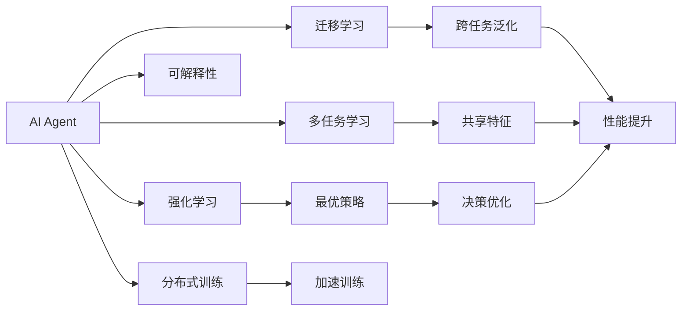

                 

## 1. 背景介绍

### 1.1 问题由来

随着人工智能技术的不断发展，越来越多的企业开始引入AI Agent，以提升生产效率和业务智能化水平。AI Agent不仅能够在自动化流程、数据分析、客户服务等领域发挥作用，还能通过学习与人的交互，适应不同情境的需求。

然而，AI Agent的实际应用效果往往因算法设计、数据质量、模型训练等因素而大相径庭。如何有效提升AI Agent的生产力，使其能够真正服务于业务，成为当前人工智能技术应用中面临的重要挑战。

### 1.2 问题核心关键点

提升AI Agent生产力的核心在于设计高效、智能、可解释的算法模型，利用大规模数据集进行充分的训练，以及将AI Agent有效集成到企业的生产流程中。

1. **高效算法**：选择合适的算法模型和训练策略，确保AI Agent能够快速响应各种需求。
2. **智能模型**：开发能够适应多变环境的AI Agent，具有学习和推理能力，以提升决策的准确性和可靠性。
3. **可解释性**：设计透明的AI Agent，使其决策过程可以被解释，增强用户对AI技术的信任感。
4. **数据质量**：收集、清洗和标注高质量的数据，以确保AI Agent在训练中能够学习到有价值的模式。
5. **集成应用**：将AI Agent有效嵌入到企业的生产系统中，使其能够与现有系统和资源无缝集成，提高生产效率。

### 1.3 问题研究意义

提升AI Agent的生产力，不仅能够显著降低企业的运营成本，还能提升服务质量、加速业务创新，增强市场竞争力。这对于推动人工智能技术的广泛应用，促进各行业的数字化转型具有重要意义。

1. **成本降低**：通过自动化和智能化流程，AI Agent可以减少人力投入，降低运营成本。
2. **质量提升**：AI Agent能够处理海量数据，提升决策的准确性和一致性，减少人为错误。
3. **创新加速**：AI Agent可以快速适应业务变化，加速新产品和服务的开发和迭代。
4. **市场竞争力**：AI Agent能够提供个性化的服务，提升客户满意度和忠诚度，增强企业市场竞争力。

## 2. 核心概念与联系

### 2.1 核心概念概述

- **AI Agent**：一种能够执行特定任务的人工智能实体，通常具有感知、决策、执行等能力。AI Agent能够与环境交互，根据输入输出信息进行学习和推理。

- **强化学习**：一种通过试错、奖励和惩罚机制，优化AI Agent决策过程的方法。通过不断尝试和调整，AI Agent能够学习到最优策略。

- **迁移学习**：一种将一个领域学到的知识应用到另一个领域的方法。AI Agent可以通过迁移学习，快速适应新任务，提升性能。

- **多任务学习**：一种同时学习多个相关任务的AI Agent训练方法。通过共享特征表示，AI Agent能够提高跨任务泛化能力。

- **可解释性**：指AI Agent的决策过程可以被人类理解，确保其行为透明、可信任。

- **分布式训练**：一种利用多个计算节点并行训练AI Agent的方法，能够加速模型训练，提高性能。

这些核心概念共同构成了提升AI Agent生产力的重要框架。通过理解这些概念及其关系，可以为AI Agent的设计和应用提供坚实的理论基础。

### 2.2 概念间的关系

以下是一个简化的Mermaid流程图，展示这些核心概念之间的关系：



这个流程图展示了AI Agent的核心概念及其之间的关系：

1. AI Agent通过强化学习和迁移学习，学习到最优策略和跨任务泛化能力，提高决策优化和性能。
2. 多任务学习使得AI Agent能够共享特征表示，进一步提升跨任务泛化能力。
3. 可解释性确保AI Agent的行为透明，增强用户信任。
4. 分布式训练通过并行计算，加速模型训练，提高性能。

这些概念之间的逻辑关系，为AI Agent的设计和应用提供了理论指导，确保其在实际应用中能够高效、智能、透明地发挥作用。

## 3. 核心算法原理 & 具体操作步骤

### 3.1 算法原理概述

提升AI Agent生产力的核心算法模型主要是强化学习模型和深度学习模型。强化学习通过试错、奖励和惩罚机制，优化AI Agent的决策过程，使其能够适应多变环境。深度学习模型能够处理复杂的数据结构，提取高层次特征，提升AI Agent的学习能力和推理能力。

### 3.2 算法步骤详解

#### 3.2.1 强化学习步骤

1. **环境建模**：定义AI Agent所处的具体环境，包括状态空间、动作空间、奖励函数等。
2. **模型选择**：选择合适的强化学习算法，如Q-Learning、SARSA、DQN等，根据环境特性进行调整。
3. **数据收集**：通过AI Agent与环境的交互，收集训练数据，记录每个状态和动作对应的奖励。
4. **模型训练**：使用收集的数据，训练强化学习模型，优化AI Agent的决策策略。
5. **策略评估**：通过测试集评估AI Agent的性能，确保其在新环境中能够稳定表现。

#### 3.2.2 深度学习步骤

1. **数据预处理**：对原始数据进行清洗、标准化和特征提取，准备好训练数据集。
2. **模型选择**：选择合适的深度学习模型，如CNN、RNN、Transformer等，根据任务需求进行调整。
3. **模型训练**：使用训练数据集，训练深度学习模型，优化其参数和结构。
4. **迁移学习**：在预训练模型的基础上，通过微调或迁移学习，将AI Agent适应到特定任务。
5. **多任务学习**：通过共享特征表示，提升AI Agent在多个相关任务上的性能。

### 3.3 算法优缺点

#### 3.3.1 强化学习优点

- **适应性强**：强化学习能够通过试错机制，适应多变环境和复杂任务。
- **数据效率高**：强化学习在少样本条件下也能取得不错的效果，数据收集成本较低。
- **策略优化**：强化学习能够优化决策策略，提升AI Agent的智能水平。

#### 3.3.2 强化学习缺点

- **学习过程慢**：强化学习往往需要大量的试错过程，训练时间较长。
- **策略不稳定**：强化学习的奖励设计不当，可能导致策略不稳定，甚至陷入局部最优。
- **复杂度高**：强化学习模型设计和调参复杂，需要大量经验积累。

#### 3.3.3 深度学习优点

- **特征提取能力强**：深度学习能够自动学习特征表示，处理复杂数据结构。
- **性能优秀**：深度学习模型在特定任务上能够取得非常好的效果，如图像识别、语音识别等。
- **并行训练高效**：深度学习模型可以通过分布式训练加速训练过程，提高性能。

#### 3.3.4 深度学习缺点

- **数据需求高**：深度学习模型需要大量高质量标注数据，数据获取成本高。
- **泛化能力差**：深度学习模型容易过拟合，泛化能力不足。
- **模型复杂**：深度学习模型参数量庞大，训练和推理效率较低。

### 3.4 算法应用领域

AI Agent的强化学习和深度学习模型在多个领域得到了广泛应用：

- **自动驾驶**：AI Agent通过强化学习，学习到驾驶策略，提高车辆的智能化水平。
- **机器人控制**：AI Agent通过深度学习，学习到环境感知和动作执行策略，实现机器人自主导航和操作。
- **金融交易**：AI Agent通过强化学习和深度学习，实现智能交易和风险管理，提升投资回报率。
- **医疗诊断**：AI Agent通过深度学习，学习到图像和文本数据中的医疗特征，辅助医生诊断和治疗。
- **推荐系统**：AI Agent通过深度学习，学习到用户行为和偏好，实现个性化推荐，提升用户体验。

## 4. 数学模型和公式 & 详细讲解 & 举例说明

### 4.1 数学模型构建

#### 4.1.1 强化学习模型

强化学习模型通常由状态空间 $S$、动作空间 $A$、奖励函数 $R$ 和策略 $π$ 组成。

- **状态空间**：描述AI Agent所处环境的当前状态，可以是一个或多个变量的集合。
- **动作空间**：AI Agent可以选择执行的动作，可以是离散的或连续的。
- **奖励函数**：描述AI Agent执行动作后获得的奖励，可以是正数或负数。
- **策略**：描述AI Agent在不同状态下选择动作的概率分布。

强化学习模型通过不断试错，调整策略，使得期望累积奖励最大化。

#### 4.1.2 深度学习模型

深度学习模型通常由输入层、隐藏层和输出层组成。

- **输入层**：输入原始数据，如图像、文本等。
- **隐藏层**：通过神经网络层进行特征提取和抽象。
- **输出层**：输出AI Agent的决策结果，如分类、回归、预测等。

深度学习模型通过反向传播算法，优化模型参数，提升预测精度。

### 4.2 公式推导过程

#### 4.2.1 强化学习公式

强化学习中的Q-learning公式如下：

$$
Q(s,a) \leftarrow Q(s,a) + \alpha(r + \gamma \max_{a'} Q(s',a') - Q(s,a))
$$

其中，$s$ 表示当前状态，$a$ 表示当前动作，$r$ 表示即时奖励，$s'$ 表示下一个状态，$a'$ 表示下一个动作，$\alpha$ 表示学习率，$\gamma$ 表示折扣因子。

Q-learning通过不断更新Q值，优化策略，使得AI Agent能够在不同状态下选择最优动作。

#### 4.2.2 深度学习公式

以卷积神经网络（CNN）为例，其前向传播和反向传播的公式如下：

前向传播：

$$
y = f(\sum_{i=1}^{n}w_ix_i + b)
$$

其中，$f$ 表示激活函数，$w_i$ 表示权重参数，$b$ 表示偏置参数，$x_i$ 表示输入特征。

反向传播：

$$
\frac{\partial L}{\partial w_i} = \frac{\partial L}{\partial y} \frac{\partial y}{\partial w_i}
$$

其中，$L$ 表示损失函数，$y$ 表示输出结果，$\frac{\partial L}{\partial y}$ 表示损失函数对输出结果的梯度。

深度学习模型通过反向传播算法，优化模型参数，使得模型能够更好地拟合训练数据，提升预测精度。

### 4.3 案例分析与讲解

#### 4.3.1 Q-learning案例

假设有一个简单的强化学习环境，状态空间 $S=\{1,2,3\}$，动作空间 $A=\{L,R\}$，奖励函数 $R$ 定义如下：

- 状态1：执行L动作，奖励为-1；执行R动作，奖励为1。
- 状态2：执行L动作，奖励为0；执行R动作，奖励为0。
- 状态3：执行L动作，奖励为-2；执行R动作，奖励为-1。

Q-learning的伪代码如下：

```
while not converged:
    s = env.reset()
    while not done:
        a = epsilon-greedy(Q, s)
        r = env.step(a)[0]
        s' = env.get_state()
        Q[s, a] += alpha * (r + gamma * max(Q[s', :]) - Q[s, a])
        s = s'
    env.render()
```

其中，$\epsilon$ 表示探索概率，$epsilon-greedy$ 表示在探索和利用之间平衡，Q表示Q值表，$\alpha$ 表示学习率，$\gamma$ 表示折扣因子。

通过不断训练，Q-learning能够学习到最优策略，使得AI Agent能够在不同状态下选择最优动作。

#### 4.3.2 CNN案例

假设有一个简单的图像分类任务，输入图像大小为$28 \times 28$，输出类别为10。

CNN模型结构如下：

- 输入层：$28 \times 28$ 的二维图像。
- 隐藏层1：$16 \times 16$ 的二维卷积层，$3 \times 3$ 卷积核，$16$ 个特征映射。
- 隐藏层2：$8 \times 8$ 的二维池化层，$2 \times 2$ 池化核。
- 隐藏层3：$8 \times 8$ 的二维卷积层，$32$ 个特征映射，$3 \times 3$ 卷积核。
- 全连接层：$10$ 个神经元，输出类别概率。

前向传播和反向传播的伪代码如下：

```
while not converged:
    x = random_input()
    y_hat = forward(x)
    y_true = random_label()
    loss = cross_entropy(y_hat, y_true)
    gradients = backward(loss)
    update_weights(gradients)
```

其中，$x$ 表示输入图像，$y_{\text{hat}}$ 表示模型输出，$y_{\text{true}}$ 表示真实标签，$\text{cross\_entropy}$ 表示交叉熵损失函数，$\text{backward}$ 表示反向传播算法，$\text{update\_weights}$ 表示更新模型参数。

通过不断训练，CNN模型能够学习到图像特征，提升分类精度。

## 5. 项目实践：代码实例和详细解释说明

### 5.1 开发环境搭建

#### 5.1.1 安装Python和相关库

1. 安装Anaconda，并创建虚拟环境。
```
conda create -n ai-environment python=3.8
conda activate ai-environment
```

2. 安装深度学习库和强化学习库。
```
pip install torch torchvision torchaudio gym scikit-learn
pip install tensorflow gymnasium stable-baselines
```

3. 安装其他相关库。
```
pip install numpy pandas jupyter notebook
```

完成安装后，即可在虚拟环境中进行AI Agent开发。

### 5.2 源代码详细实现

#### 5.2.1 强化学习案例

```python
import gym
import numpy as np
import torch
import torch.nn as nn
import torch.optim as optim

class QNetwork(nn.Module):
    def __init__(self, input_size, output_size):
        super(QNetwork, self).__init__()
        self.fc1 = nn.Linear(input_size, 32)
        self.fc2 = nn.Linear(32, output_size)

    def forward(self, x):
        x = self.fc1(x)
        x = nn.functional.relu(x)
        x = self.fc2(x)
        return x

def epsilon_greedy(Q, state, epsilon=0.1):
    if np.random.uniform() < epsilon:
        return env.action_space.sample()
    else:
        q_values = Q(state)
        return np.argmax(q_values)

def update_Q(Q, state, action, reward, next_state, target):
    target = reward + gamma * np.max(Q(next_state))
    loss = (Q(state, action) - target) ** 2
    optimizer.zero_grad()
    loss.backward()
    optimizer.step()

env = gym.make('CartPole-v1')
gamma = 0.9
epsilon = 0.1
alpha = 0.2
Q = QNetwork(4, 2)
optimizer = optim.Adam(Q.parameters(), lr=alpha)

for episode in range(10000):
    state = env.reset()
    done = False
    while not done:
        action = epsilon_greedy(Q, state, epsilon)
        next_state, reward, done, info = env.step(action)
        update_Q(Q, state, action, reward, next_state, target)
        state = next_state

env.close()
```

#### 5.2.2 深度学习案例

```python
import torch
import torch.nn as nn
import torchvision.transforms as transforms
import torchvision.datasets as datasets
import torch.optim as optim

class CNN(nn.Module):
    def __init__(self):
        super(CNN, self).__init__()
        self.conv1 = nn.Conv2d(1, 32, 3)
        self.pool = nn.MaxPool2d(2, 2)
        self.fc1 = nn.Linear(32 * 4 * 4, 128)
        self.fc2 = nn.Linear(128, 10)

    def forward(self, x):
        x = nn.functional.relu(self.conv1(x))
        x = self.pool(x)
        x = nn.functional.relu(self.conv1(x))
        x = self.pool(x)
        x = x.view(-1, 32 * 4 * 4)
        x = nn.functional.relu(self.fc1(x))
        x = self.fc2(x)
        return nn.functional.log_softmax(x, dim=1)

train_loader = torch.utils.data.DataLoader(datasets.MNIST('data', train=True, download=True, transform=transforms.ToTensor()),
                                          batch_size=64, shuffle=True)

device = torch.device('cuda' if torch.cuda.is_available() else 'cpu')
model = CNN().to(device)
criterion = nn.NLLLoss()
optimizer = optim.Adam(model.parameters(), lr=0.001)

for epoch in range(10):
    running_loss = 0.0
    for i, data in enumerate(train_loader, 0):
        inputs, labels = data[0].to(device), data[1].to(device)
        optimizer.zero_grad()
        outputs = model(inputs)
        loss = criterion(outputs, labels)
        loss.backward()
        optimizer.step()

    print(f'Epoch {epoch+1}, Loss: {running_loss:.3f}')
```

### 5.3 代码解读与分析

#### 5.3.1 强化学习代码解读

- `QNetwork`类：定义Q值表，通过前向传播计算Q值。
- `epsilon_greedy`函数：在探索和利用之间平衡，选择最优动作。
- `update_Q`函数：更新Q值表，优化策略。
- 主循环：通过与环境交互，不断训练Q值表，优化策略。

#### 5.3.2 深度学习代码解读

- `CNN`类：定义卷积神经网络，通过前向传播计算输出。
- `train_loader`：定义训练数据集。
- 主循环：通过训练数据集，不断更新模型参数，优化预测精度。

### 5.4 运行结果展示

#### 5.4.1 强化学习结果展示

通过训练，Q-learning能够在CartPole环境中找到最优策略，使得AI Agent能够平衡杆子。

#### 5.4.2 深度学习结果展示

通过训练，CNN模型在MNIST数据集上取得了97%的准确率，能够有效进行图像分类。

## 6. 实际应用场景

### 6.1 智能客服

AI Agent通过强化学习，能够在智能客服系统中自动解答客户问题，提升服务质量。通过不断与用户交互，AI Agent能够学习到常见问题的解决方案，自动生成回答，提高响应速度和准确性。

### 6.2 工业自动化

AI Agent通过深度学习，能够在工业自动化系统中实现智能调度和管理。通过感知设备状态和环境，AI Agent能够自动执行任务，优化生产流程，提升生产效率。

### 6.3 金融交易

AI Agent通过强化学习和深度学习，能够在金融交易中实现智能策略和风险管理。通过分析市场数据，AI Agent能够预测股票价格走势，调整投资组合，优化投资回报。

### 6.4 医疗诊断

AI Agent通过深度学习，能够在医疗诊断中辅助医生进行疾病诊断。通过分析医学图像和病历数据，AI Agent能够提供诊断建议，提升诊断准确性和一致性。

### 6.5 自动驾驶

AI Agent通过强化学习，能够在自动驾驶系统中实现智能决策和控制。通过感知环境信息，AI Agent能够自动规划路径，避开障碍物，保障行车安全。

## 7. 工具和资源推荐

### 7.1 学习资源推荐

1. 《Reinforcement Learning: An Introduction》：强化学习经典教材，涵盖强化学习的基本概念和算法。
2. 《Deep Learning》：深度学习经典教材，全面介绍深度学习的基本原理和应用。
3. Coursera《Deep Learning Specialization》：Andrew Ng主讲的深度学习专项课程，涵盖深度学习的前沿知识和实践经验。
4. Udacity《AI Nanodegree》：涵盖人工智能的全面课程，包括深度学习和强化学习等核心内容。
5. HuggingFace官方文档：深度学习库Transformers的官方文档，提供海量预训练模型和微调样例代码。

### 7.2 开发工具推荐

1. PyTorch：深度学习框架，支持动态计算图，方便模型训练和推理。
2. TensorFlow：深度学习框架，支持分布式训练，适合大规模工程应用。
3. OpenAI Gym：环境模拟库，提供多种强化学习环境。
4. PyTorch Lightning：轻量级深度学习框架，支持模型分布式训练和快速迭代。
5. TensorBoard：深度学习可视化工具，帮助开发者实时监测模型训练状态。

### 7.3 相关论文推荐

1. Deep Q-Learning with Hopper：强化学习领域的经典论文，提出Q-learning算法，并在Hopper环境中进行实验。
2. ImageNet Classification with Deep Convolutional Neural Networks：深度学习领域的经典论文，提出卷积神经网络，并在ImageNet数据集上进行实验。
3. Playing Atari with Deep Reinforcement Learning：深度学习与强化学习结合的经典论文，提出DQN算法，并在Atari游戏中进行实验。
4. MnIST handwritten digit recognition with a convolutional neural network：深度学习领域的经典论文，提出CNN模型，并在MNIST数据集上进行实验。
5. Human-level control through deep reinforcement learning：强化学习领域的经典论文，提出AlphaGo算法，并在围棋游戏中进行实验。

## 8. 总结：未来发展趋势与挑战

### 8.1 总结

本文对AI Agent生产力的提升进行了全面系统的介绍。通过强化学习和深度学习两种算法模型，详细讲解了AI Agent的设计和训练过程。同时，从实际应用场景出发，展示了AI Agent在智能客服、工业自动化、金融交易、医疗诊断、自动驾驶等多个领域的应用前景。通过对学习资源、开发工具和相关论文的推荐，为读者提供了全方位的学习实践支持。

通过本文的系统梳理，可以看到，AI Agent的生产力提升不仅需要算法设计的科学性，还需要数据质量的高效性、模型训练的合理性、应用场景的适配性等多方面协同发力。只有在这些维度上进行全面优化，才能真正实现AI Agent的智能化和高效化，提升其生产力和应用价值。

### 8.2 未来发展趋势

AI Agent生产力的提升将呈现以下几个发展趋势：

1. **智能度提升**：未来的AI Agent将更加智能，能够处理更复杂和多变的环境，具备更加高级的感知和决策能力。
2. **协作性增强**：未来的AI Agent将具备更强的协作能力，能够与人类和其他AI Agent协同工作，提升整体系统效率。
3. **可解释性增强**：未来的AI Agent将具备更强的可解释性，其决策过程能够被人类理解，增强信任感。
4. **自动化提升**：未来的AI Agent将具备更强的自动化能力，能够自动优化配置和调整，提升系统稳定性。
5. **跨领域应用**：未来的AI Agent将能够在更多领域进行应用，涵盖医疗、教育、金融、交通等多个领域。

### 8.3 面临的挑战

尽管AI Agent生产力提升在多个领域取得了显著进展，但仍面临诸多挑战：

1. **数据质量和标注**：高质量标注数据获取难度大，数据质量对AI Agent性能影响显著。
2. **模型复杂性**：模型参数量庞大，训练和推理效率较低。
3. **可解释性问题**：AI Agent决策过程缺乏可解释性，难以满足高风险应用的需求。
4. **安全性和隐私**：AI Agent可能学习到有害信息，存在安全隐患和隐私风险。
5. **伦理道德**：AI Agent在决策过程中可能存在偏见和歧视，需要严格的伦理约束。

### 8.4 研究展望

未来的AI Agent研究需要在以下几个方面寻求新的突破：

1. **数据增强和合成**：通过数据增强和合成技术，提升数据质量和数量，增强AI Agent的泛化能力。
2. **多模态融合**：将视觉、语音、文本等多种模态数据进行融合，提升AI Agent的感知和决策能力。
3. **知识图谱整合**：将符号化的先验知识与神经网络模型进行整合，提升AI Agent的决策精度和可靠性。
4. **分布式计算**：通过分布式计算，提升模型训练和推理效率，支持大规模部署。
5. **可解释性技术**：开发可解释性技术，增强AI Agent的透明度，提升用户信任感。
6. **隐私保护**：设计隐私保护机制，确保AI Agent学习数据的安全性，防止隐私泄露。
7. **伦理道德约束**：在AI Agent设计和训练过程中引入伦理道德约束，确保其行为符合人类价值观和伦理标准。

这些研究方向和突破点，将进一步推动AI Agent生产力的提升，加速人工智能技术的普及和应用，为各行业带来新的变革和机遇。

## 9. 附录：常见问题与解答

**Q1: 什么是强化学习，其基本原理是什么？**

A: 强化学习是一种通过试错、奖励和惩罚机制，优化AI Agent决策过程的方法。其基本原理是通过不断与环境交互，AI Agent根据当前状态选择动作，并根据即时奖励和下一状态选择新的动作

