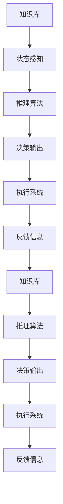

                 

## 1. 背景介绍

### 1.1 问题由来
随着人工智能（AI）技术的快速发展，AI Agent（智能代理）在生产组织形式、工作流程管理、协作系统优化等方面，带来了颠覆性的变革。AI Agent不仅能够在复杂环境中自动执行任务，还能优化决策过程，增强组织协作效率，进而提升整体生产力。当前，AI Agent已在智能客服、物流管理、智能制造等多个领域得到了广泛应用，正在引领企业向智能化转型。

### 1.2 问题核心关键点
AI Agent的核心在于将机器学习和决策算法嵌入到软件代理中，使代理具备自主决策、自动执行、实时交互的能力。AI Agent的核心要素包括知识表示、推理算法、学习机制、交互接口等。通过AI Agent，企业可以实现自动化流程优化、资源配置、任务调度等，大幅提升业务运营效率和质量。

### 1.3 问题研究意义
AI Agent在提升企业生产效率、优化资源配置、增强决策智能等方面的潜力巨大，对未来生产力组织形式的变革具有重要意义。研究AI Agent的开发、应用及优化方法，有助于企业更好地适应智能化时代的挑战，引领行业创新发展，提升国际竞争力。

## 2. 核心概念与联系

### 2.1 核心概念概述

为更好地理解AI Agent及其对未来生产力组织形式的变革，本节将介绍几个关键概念：

- **AI Agent**：具有自主决策和执行能力的智能软件代理，基于机器学习算法，能够在复杂环境中执行任务，优化决策过程，提升生产力。
- **知识表示**：AI Agent的核心组成部分，用于存储和组织领域知识，如规则、事实、关系等。
- **推理算法**：AI Agent中的关键组件，用于根据知识库进行逻辑推理，生成行动策略。
- **学习机制**：AI Agent的自我优化能力，包括经验学习、强化学习、迁移学习等。
- **交互接口**：AI Agent与外部环境或用户交互的界面，如API、UI等。

### 2.2 概念间的关系

AI Agent作为一个复杂的软件系统，其工作原理可以概括为以下几个主要步骤：

1. **知识获取**：通过训练或手动输入，AI Agent获取领域知识。
2. **状态感知**：AI Agent实时监测环境状态，收集相关信息。
3. **推理决策**：AI Agent根据知识库和状态信息，通过推理算法生成行动策略。
4. **执行反馈**：AI Agent执行策略并根据反馈信息更新知识库和推理模型。

这些步骤可以形成一个闭环，使AI Agent能够不断学习和优化，适应复杂环境变化。

### 2.3 核心概念的整体架构

以下是一个综合的流程图，展示AI Agent的核心概念及其之间的关系：



这个流程图展示了AI Agent的基本工作流程：

1. AI Agent从知识库中获取知识。
2. 状态感知模块实时监测环境变化，收集相关数据。
3. 推理算法根据知识库和状态信息生成行动策略。
4. 决策输出模块执行策略并生成行动命令。
5. 执行系统根据命令执行具体任务。
6. 反馈信息模块收集执行结果，更新知识库和推理模型。
7. 通过持续的学习和优化，AI Agent能够更好地适应环境变化，提升性能。

## 3. 核心算法原理 & 具体操作步骤

### 3.1 算法原理概述

AI Agent的核心算法主要包括知识表示、推理算法和优化算法。

- **知识表示**：AI Agent通过符号化或向量化的方式，将领域知识存储在知识库中。常见的知识表示方法包括逻辑推理、本体论、语义网络等。
- **推理算法**：用于根据知识库生成行动策略。常用的推理算法包括符号推理、概率推理、模糊推理等。
- **优化算法**：用于学习机制，包括经验学习、强化学习、迁移学习等。通过优化算法，AI Agent能够根据反馈信息不断调整和优化决策模型。

### 3.2 算法步骤详解

AI Agent的开发和部署一般包括以下几个关键步骤：

1. **需求分析**：明确任务需求和性能指标，确定AI Agent的目标功能。
2. **知识库构建**：收集并组织领域知识，建立知识库结构。
3. **算法设计**：选择合适的推理算法和优化算法，设计AI Agent的决策逻辑。
4. **模型训练**：通过训练数据集，优化模型参数，提高AI Agent的决策能力。
5. **系统集成**：将AI Agent集成到企业系统中，进行部署和监控。
6. **迭代优化**：持续收集反馈信息，更新知识库和算法模型，提升AI Agent的适应性。

### 3.3 算法优缺点

AI Agent具有以下优点：

1. **自主决策**：能够在复杂环境中自主决策，无需人工干预。
2. **实时响应**：能够实时感知环境变化，迅速响应任务需求。
3. **自动化执行**：通过自动执行任务，减少人工操作，提升效率。
4. **持续学习**：能够通过反馈信息不断学习，优化决策模型。

同时，AI Agent也存在一些局限性：

1. **知识依赖**：需要丰富的领域知识支撑，知识库的构建和维护成本较高。
2. **复杂推理**：对于复杂推理问题，现有的算法可能难以找到最优解。
3. **模型可解释性**：AI Agent的决策过程通常难以解释，缺乏透明性。
4. **安全性和可靠性**：在处理关键任务时，AI Agent的决策正确性和可靠性要求较高，可能面临安全漏洞和系统故障的风险。

### 3.4 算法应用领域

AI Agent已经在多个领域得到了应用，主要包括：

1. **智能客服**：通过自动解答用户问题，提升客户满意度和服务效率。
2. **供应链管理**：自动监控和优化供应链流程，提高物流效率。
3. **智能制造**：通过监控和调整生产过程，提高产品质量和生产效率。
4. **金融分析**：通过自动分析市场数据，提供实时决策支持。
5. **医疗诊断**：通过自动分析医疗数据，辅助医生诊断和治疗决策。
6. **教育培训**：通过自动评估学生表现，提供个性化学习建议。

## 4. 数学模型和公式 & 详细讲解

### 4.1 数学模型构建

AI Agent的数学模型通常包括知识库、推理算法和优化算法的数学表示。

- **知识库表示**：使用符号逻辑或向量表示法，如一阶逻辑、概率图模型、向量空间模型等。
- **推理算法表示**：常用的推理算法，如DAG推理、规则推理、贝叶斯推理等，均可通过数学模型表示。
- **优化算法表示**：如经验学习、强化学习、迁移学习等，通过数学公式描述其优化目标和策略。

### 4.2 公式推导过程

以贝叶斯推理为例，展示如何通过数学公式表示推理过程：

设知识库 $\mathcal{K}$ 包括若干事实 $f_1, f_2, \ldots, f_n$，推理目标 $t$。通过贝叶斯推理，计算 $t$ 的条件概率：

$$
P(t|f_1, f_2, \ldots, f_n) = \frac{P(f_1, f_2, \ldots, f_n|t) P(t)}{\sum_{t'} P(f_1, f_2, \ldots, f_n|t') P(t')}
$$

其中 $P(t)$ 为先验概率，$P(f_1, f_2, \ldots, f_n|t)$ 为条件概率，通过知识库 $\mathcal{K}$ 和推理算法计算得到。

### 4.3 案例分析与讲解

假设一个AI Agent用于物流配送中心的库存管理。其知识库包括：

- 不同商品的需求量
- 供应链各节点的库存量
- 不同物流方式的时间和成本

推理算法采用规则推理，定义以下规则：

- 如果订单需求量大，优先考虑高效率的物流方式。
- 如果库存量低，优先考虑从供应商补货。

优化算法采用强化学习，通过模拟不同的物流方案，评估其成本和效率，优化决策策略。

## 5. 项目实践：代码实例和详细解释说明

### 5.1 开发环境搭建

在开始项目实践前，需要准备好开发环境。以下是Python和TensorFlow的搭建步骤：

1. 安装Anaconda：从官网下载并安装Anaconda，用于创建独立的Python环境。
2. 创建并激活虚拟环境：
```bash
conda create -n tf-env python=3.8 
conda activate tf-env
```

3. 安装TensorFlow：根据CUDA版本，从官网获取对应的安装命令。例如：
```bash
conda install tensorflow -c tf
```

4. 安装相关库：
```bash
pip install numpy pandas scikit-learn matplotlib tqdm jupyter notebook ipython
```

5. 安装TensorBoard：TensorFlow配套的可视化工具，用于监控和调试AI Agent模型。
```bash
pip install tensorboard
```

### 5.2 源代码详细实现

以下是一个简单的AI Agent示例，用于管理智能配送中心的库存。

首先，定义知识库和推理算法：

```python
from pyknow import KnowledgeBase, Fact, Rule

# 定义知识库
kb = KnowledgeBase()

# 定义事实
f1 = Fact('库存量', 1000)
f2 = Fact('订单需求量', 500)
f3 = Fact('供应商库存量', 2000)
f4 = Fact('物流方式', '高效率')
f5 = Fact('时间成本', 10)
f6 = Fact('成本效益', 1.5)

# 定义规则
r1 = Rule('低库存', f1, f2, f3, '优先补货')
r2 = Rule('高需求', f1, f2, f4, '优先高效率')
r3 = Rule('高成本', f5, f6, '调整物流方式')

# 推理算法
def infer(kb, facts):
    kb.update(facts)
    kb.add(f1, f2, f3, f4, f5, f6)
    kb.apply_rule(r1)
    kb.apply_rule(r2)
    kb.apply_rule(r3)
    return kb

# 测试推理结果
facts = [f1, f2, f3, f4, f5, f6]
kb_result = infer(kb, facts)
print(kb_result.facts)
```

然后，定义优化算法：

```python
import gym
import numpy as np
from tensorflow.keras import layers, models

# 定义环境
class InventoryEnv(gym.Env):
    def __init__(self):
        self.state = np.zeros(6)
        self.action_space = gym.spaces.Box(low=-1, high=1, shape=(1, 3))
        self.observation_space = gym.spaces.Box(low=-1, high=1, shape=(6,))

    def step(self, action):
        self.state = np.maximum(np.minimum(self.state + action, [0, 1000, 500, 2000, 10, 1.5]), [0, 0, 0, 0, 0, 0])
        return self.state, 1, True, {}

    def reset(self):
        self.state = np.zeros(6)
        return self.state

env = InventoryEnv()

# 定义模型
model = models.Sequential()
model.add(layers.Dense(32, input_shape=(6,), activation='relu'))
model.add(layers.Dense(1, activation='sigmoid'))

model.compile(optimizer='adam', loss='mse', metrics=['mae'])

# 训练模型
model.fit(env, epochs=100, batch_size=1, verbose=0)

# 测试模型
state = np.array([1000, 500, 2000, 10, 1.5, 0])
action = np.array([1, -0.5, 0.5])
next_state, _, _, _ = env.step(action)
print(next_state)
```

### 5.3 代码解读与分析

**知识库构建**：
- `Fact`类定义了知识库中的事实，通过规则推理进行决策。
- `Rule`类定义了规则，用于从知识库中生成行动策略。

**推理算法**：
- `infer`函数将事实更新到知识库中，并应用规则，得到推理结果。

**优化算法**：
- 使用TensorFlow构建了一个简单的神经网络模型，用于优化决策策略。
- 通过训练数据集，优化模型参数，提高决策准确性。

**运行结果展示**：
- 在测试环境中，通过观察模型输出，可以验证推理和优化算法的效果。

## 6. 实际应用场景

### 6.1 智能客服系统

AI Agent在智能客服系统中的应用，可以显著提升客户满意度和服务效率。传统客服需要配备大量人力，高峰期响应缓慢，且一致性和专业性难以保证。而使用AI Agent，可以7x24小时不间断服务，快速响应客户咨询，用自然流畅的语言解答各类常见问题。

在技术实现上，可以收集企业内部的历史客服对话记录，将问题和最佳答复构建成监督数据，在此基础上对预训练语言模型进行微调。微调后的语言模型能够自动理解用户意图，匹配最合适的答案模板进行回复。对于客户提出的新问题，还可以接入检索系统实时搜索相关内容，动态组织生成回答。

### 6.2 金融舆情监测

金融机构需要实时监测市场舆论动向，以便及时应对负面信息传播，规避金融风险。传统的人工监测方式成本高、效率低，难以应对网络时代海量信息爆发的挑战。基于AI Agent的文本分类和情感分析技术，为金融舆情监测提供了新的解决方案。

具体而言，可以收集金融领域相关的新闻、报道、评论等文本数据，并对其进行主题标注和情感标注。在此基础上对预训练语言模型进行微调，使其能够自动判断文本属于何种主题，情感倾向是正面、中性还是负面。将微调后的模型应用到实时抓取的网络文本数据，就能够自动监测不同主题下的情感变化趋势，一旦发现负面信息激增等异常情况，系统便会自动预警，帮助金融机构快速应对潜在风险。

### 6.3 个性化推荐系统

当前的推荐系统往往只依赖用户的历史行为数据进行物品推荐，无法深入理解用户的真实兴趣偏好。基于AI Agent的个性化推荐系统可以更好地挖掘用户行为背后的语义信息，从而提供更精准、多样的推荐内容。

在实践中，可以收集用户浏览、点击、评论、分享等行为数据，提取和用户交互的物品标题、描述、标签等文本内容。将文本内容作为模型输入，用户的后续行为（如是否点击、购买等）作为监督信号，在此基础上微调预训练语言模型。微调后的模型能够从文本内容中准确把握用户的兴趣点。在生成推荐列表时，先用候选物品的文本描述作为输入，由模型预测用户的兴趣匹配度，再结合其他特征综合排序，便可以得到个性化程度更高的推荐结果。

### 6.4 未来应用展望

随着AI Agent技术的不断发展，其在未来生产力组织形式中的应用前景广阔。以下是几个典型的应用场景：

1. **智慧医疗**：通过AI Agent辅助医生诊断和治疗决策，提升医疗服务质量和效率。
2. **智能交通**：通过AI Agent优化交通流量和路况预测，提升交通管理水平。
3. **智能制造**：通过AI Agent监控和调整生产过程，提高产品质量和生产效率。
4. **智慧教育**：通过AI Agent提供个性化学习建议和实时答疑，提升教育质量。
5. **智能物流**：通过AI Agent优化供应链管理和物流配送，提升物流效率。

## 7. 工具和资源推荐

### 7.1 学习资源推荐

为了帮助开发者系统掌握AI Agent的理论基础和实践技巧，这里推荐一些优质的学习资源：

1. **《机器学习实战》系列博文**：由大模型技术专家撰写，深入浅出地介绍了机器学习的基本概念和算法，包括监督学习、强化学习、迁移学习等。
2. **DeepLearning.ai《深度学习专业》课程**：由Andrew Ng教授开设的深度学习专业课程，涵盖从基础知识到应用实践的全面内容。
3. **《Deep Reinforcement Learning with Python》书籍**：介绍强化学习的基本原理和Python实现，适合初学者和专业人士阅读。
4. **TensorFlow官方文档**：提供了详细的API文档和代码示例，是学习和使用TensorFlow的最佳资源。
5. **OpenAI Gym环境库**：用于构建和测试强化学习算法的模拟环境，提供了丰富的环境选择和评估指标。

通过对这些资源的学习实践，相信你一定能够快速掌握AI Agent的精髓，并用于解决实际的业务问题。

### 7.2 开发工具推荐

高效的开发离不开优秀的工具支持。以下是几款用于AI Agent开发的常用工具：

1. **Python**：开源编程语言，生态丰富，适合开发复杂的软件系统。
2. **TensorFlow**：由Google主导开发的深度学习框架，支持分布式训练和推理。
3. **PyTorch**：基于动态计算图的设计理念，易于调试和优化，广泛应用于学术和工业界。
4. **OpenAI Gym**：用于构建和测试强化学习算法的模拟环境，提供了丰富的环境选择和评估指标。
5. **TensorBoard**：TensorFlow配套的可视化工具，用于监控和调试AI Agent模型。

合理利用这些工具，可以显著提升AI Agent开发和部署的效率，加快创新迭代的步伐。

### 7.3 相关论文推荐

AI Agent技术的发展源于学界的持续研究。以下是几篇奠基性的相关论文，推荐阅读：

1. **《Deep Reinforcement Learning》**：由Richard S. Sutton和Andrew G. Barto合著，介绍了强化学习的基本原理和应用。
2. **《Knowledge-Representing Mechanisms in AI》**：讨论了知识表示的多种方法，包括规则、本体论、语义网络等。
3. **《Neural-Frame Interpretation for the Planning of Complex Industrial Environments》**：探讨了神经网络与知识表示的结合方法，应用于复杂工业环境中的计划和调度。
4. **《Learning-Based Reasoning》**：介绍了基于学习的推理方法，如规则推理、概率推理等，用于构建AI Agent的知识库和推理算法。

这些论文代表了大模型微调技术的发展脉络。通过学习这些前沿成果，可以帮助研究者把握学科前进方向，激发更多的创新灵感。

除上述资源外，还有一些值得关注的前沿资源，帮助开发者紧跟AI Agent技术的最新进展，例如：

1. **arXiv论文预印本**：人工智能领域最新研究成果的发布平台，包括大量尚未发表的前沿工作，学习前沿技术的必读资源。
2. **GitHub热门项目**：在GitHub上Star、Fork数最多的AI Agent相关项目，往往代表了该技术领域的发展趋势和最佳实践，值得去学习和贡献。
3. **顶会论文和报告**：NIPS、ICML、ICLR等人工智能领域顶会现场或在线直播，能够聆听到大佬们的前沿分享，开拓视野。
4. **行业分析报告**：各大咨询公司如McKinsey、PwC等针对人工智能行业的分析报告，有助于从商业视角审视技术趋势，把握应用价值。

总之，对于AI Agent的学习和实践，需要开发者保持开放的心态和持续学习的意愿。多关注前沿资讯，多动手实践，多思考总结，必将收获满满的成长收益。

## 8. 总结：未来发展趋势与挑战

### 8.1 总结

本文对AI Agent及其对未来生产力组织形式的变革进行了全面系统的介绍。首先阐述了AI Agent的核心概念和工作原理，明确了其在提升企业生产效率、优化资源配置、增强决策智能等方面的独特价值。其次，从原理到实践，详细讲解了AI Agent的开发和部署过程，给出了代码实例和详细解释。同时，本文还广泛探讨了AI Agent在智能客服、金融舆情、个性化推荐等多个行业领域的应用前景，展示了其巨大潜力。

通过本文的系统梳理，可以看到，AI Agent在提升企业生产效率、优化资源配置、增强决策智能等方面的潜力巨大，对未来生产力组织形式的变革具有重要意义。未来，伴随AI Agent技术的不断发展，其在更多领域得到应用，必将在生产组织形式和管理方式上带来深远影响。

### 8.2 未来发展趋势

展望未来，AI Agent技术将呈现以下几个发展趋势：

1. **智能化水平提升**：随着深度学习、强化学习等技术的进步，AI Agent的自主决策能力和智能化水平将进一步提升，能够处理更加复杂和多变的任务。
2. **多模态融合**：未来AI Agent将更多地融合视觉、语音、文本等多模态信息，提升对复杂环境的理解和决策能力。
3. **自适应性增强**：通过自适应学习机制，AI Agent能够在不断变化的环境中自我优化，提升适应性。
4. **资源优化**：通过优化算法和模型压缩技术，AI Agent将更加高效地利用资源，提升系统性能和可扩展性。
5. **安全性保障**：随着模型安全性研究的发展，AI Agent将能够抵御各类攻击和漏洞，保障系统稳定运行。
6. **可解释性和透明性**：通过解释机制和透明性研究，AI Agent的决策过程将更加可解释，增强用户信任。

这些趋势凸显了AI Agent技术的广阔前景，将进一步推动AI Agent在更多领域的应用，提升生产力和管理水平。

### 8.3 面临的挑战

尽管AI Agent技术已经取得了显著进展，但在迈向更加智能化、普适化应用的过程中，仍面临诸多挑战：

1. **数据依赖**：AI Agent需要大量标注数据进行训练，数据获取成本较高，且数据质量对模型性能影响显著。
2. **模型复杂性**：现有的AI Agent模型复杂度较高，计算和存储资源消耗较大，难以在大规模系统中部署。
3. **可解释性不足**：AI Agent的决策过程通常难以解释，缺乏透明性，难以应对高风险应用的需求。
4. **安全性问题**：AI Agent在处理关键任务时，决策正确性和可靠性要求较高，可能面临系统漏洞和数据泄露的风险。
5. **资源优化不足**：现有AI Agent模型在计算资源利用效率上仍有提升空间，需进一步优化算法和模型结构。

### 8.4 研究展望

面对AI Agent面临的这些挑战，未来的研究需要在以下几个方面寻求新的突破：

1. **无监督和半监督学习**：探索利用无监督和半监督学习技术，降低对标注数据的需求，提升模型的泛化能力和自适应性。
2. **模型压缩和优化**：开发更加高效的模型压缩和优化技术，提升AI Agent在资源有限环境中的性能和可扩展性。
3. **多模态融合技术**：研究多模态信息的融合方法，提升AI Agent在复杂多模态环境中的决策能力。
4. **解释机制和透明性研究**：研究AI Agent的决策解释机制，增强模型的透明性和可解释性，提高用户信任。
5. **安全性保障技术**：开发安全性保障技术，提升AI Agent系统的鲁棒性和抵御攻击的能力。

这些研究方向将有助于推动AI Agent技术在更多领域的应用，提升企业的生产效率和管理水平，引领行业创新发展，提升国际竞争力。

## 9. 附录：常见问题与解答

**Q1：AI Agent在实际应用中面临哪些挑战？**

A: AI Agent在实际应用中面临的主要挑战包括：
1. 数据获取成本高，标注数据获取难度大。
2. 模型复杂度较高，资源消耗大，难以在大规模系统中部署。
3. 决策过程缺乏透明性，可解释性不足，难以应对高风险应用的需求。
4. 系统安全性问题，可能面临漏洞和数据泄露的风险。
5. 资源利用效率不足，模型在计算资源有限的环境中性能受限。

**Q2：如何提升AI Agent的智能化水平？**

A: 提升AI Agent的智能化水平需要从多个方面入手：
1. 引入深度学习、强化学习等先进技术，提升自主决策能力。
2. 使用多模态数据融合技术，提升对复杂环境的理解和决策能力。
3. 通过自适应学习机制，增强模型在不断变化环境中的适应性。
4. 优化算法和模型结构，提高资源利用效率，提升系统性能和可扩展性。
5. 开发安全性保障技术，提升系统鲁棒性和抵御攻击的能力。
6. 研究解释机制和透明性，增强模型透明性和用户信任。

**Q3：AI Agent在金融舆情监测中的应用场景有哪些？**

A: AI Agent在金融舆情监测中的应用场景包括：
1. 实时监测市场舆论动向，及时发现和预警负面信息传播。
2. 分析金融市场数据，提供实时决策支持。
3. 监控金融产品风险，进行风险评估和管理。
4. 辅助金融监管，提升市场透明度和监管效率。

**Q4：AI Agent在智慧医疗中的应用场景有哪些？**

A: AI Agent在智慧医疗中的应用场景包括：
1. 辅助医生诊断和治疗决策，提高医疗服务质量。
2. 监控和分析患者数据，提供个性化的健康管理方案。
3. 优化医疗资源配置，提高医疗服务效率。
4. 辅助医疗数据分析，发现潜在疾病和流行趋势。

**Q5：AI Agent在智能客服中的应用场景有哪些？**

A: AI Agent在智能客服中的应用场景包括：
1. 自动解答用户问题，提升客户满意度和服务效率。
2. 实时监测和分析用户行为，提供个性化推荐和服务。
3. 辅助客户关系管理，提升客户忠诚度和转化率。
4. 优化客服流程，减少人力成本，提高运营效率。

**Q6：AI Agent在智能交通中的应用场景有哪些？**

A: AI Agent在智能交通中的应用场景包括：
1. 优化交通流量和路况预测，提升交通管理水平。


