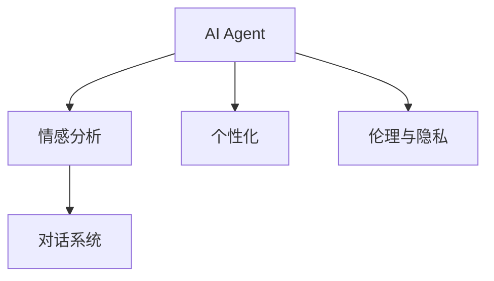

                 

## 1. 背景介绍

### 1.1 问题由来
随着人工智能技术的迅猛发展，AI Agent（智能代理）正逐渐渗透到我们生活的各个领域，从简单的自动化流程到复杂的情感陪伴系统。其中，情感陪伴系统因其能够与用户进行情感互动，提供心理支持，成为了近年来备受关注的研究方向。AI Agent在情感陪伴中的应用，不仅能够减轻用户的心理负担，还能提供个性化的情感支持。然而，当前的情感陪伴系统仍存在许多挑战，如情感表达的精准度、对话连贯性、上下文理解等。

### 1.2 问题核心关键点
在情感陪伴系统中，核心关键点在于如何构建一个能够理解用户情感，并能够进行精准情感表达的AI Agent。当前情感陪伴系统的主要挑战包括：

1. **情感理解与识别**：AI Agent需要具备对用户情感的准确理解与识别能力，才能提供合适的情感回应。
2. **对话连贯性**：与用户进行连贯且自然的对话是情感陪伴系统的基本要求。
3. **个性化情感支持**：AI Agent需要具备个性化情感支持能力，能够根据用户的具体情况和需求提供针对性的帮助。
4. **伦理与隐私**：情感陪伴系统涉及用户的隐私和情感数据，需要严格遵守伦理规范，保护用户隐私。

### 1.3 问题研究意义
研究AI Agent在情感陪伴中的应用，对于提升用户的心理福祉、构建健康和谐的社交环境具有重要意义：

1. **心理健康支持**：AI Agent可以为用户提供即时的情感支持，帮助缓解心理压力，提高心理健康水平。
2. **情感交流与陪伴**：AI Agent能够与用户进行深入的情感交流，提供持续的陪伴与支持，弥补现实生活中的情感空缺。
3. **提高社交质量**：AI Agent可以为用户提供新的社交方式，丰富用户的社交体验，促进社交质量提升。
4. **数据分析与研究**：情感陪伴系统收集的用户数据可以用于情感分析与心理健康研究，推动相关领域的理论进展。

## 2. 核心概念与联系

### 2.1 核心概念概述

为了更好地理解AI Agent在情感陪伴中的应用，我们需要介绍几个关键概念：

- **AI Agent**：智能代理，能够自主执行特定任务或提供服务的软件系统。在情感陪伴中，AI Agent能够理解用户情感，提供情感支持和对话。
- **情感分析**：通过自然语言处理技术，识别和分析文本中的情感信息，如情绪、态度、意图等。
- **对话系统**：能够与用户进行自然、连贯的对话，包括语言理解、生成和回应。
- **个性化**：根据用户的个人偏好、情感状态等因素，提供定制化的情感支持和服务。
- **伦理与隐私**：在情感陪伴系统中，保护用户隐私和情感数据的伦理问题尤为重要。

### 2.2 概念间的关系

这些核心概念之间的关系可以通过以下Mermaid流程图来展示：



这个流程图展示了AI Agent在情感陪伴系统中的关键功能：

1. 利用情感分析技术，理解用户的情感状态和需求。
2. 通过对话系统，与用户进行自然、连贯的对话，提供情感支持。
3. 根据用户个性化需求，提供定制化的情感支持和服务。
4. 在提供情感支持的过程中，严格遵守伦理与隐私规范。

## 3. 核心算法原理 & 具体操作步骤

### 3.1 算法原理概述

在情感陪伴系统中，AI Agent的核心算法原理包括情感分析和对话系统两个方面。

- **情感分析**：利用自然语言处理技术，从用户输入的文本中识别情感信息。常见的情感分析方法包括基于规则的方法、基于统计的方法和基于深度学习的方法。
- **对话系统**：通过深度学习模型（如Seq2Seq、Transformer），实现与用户的自然语言对话。对话系统的核心在于语言理解、生成和回应的能力。

### 3.2 算法步骤详解

#### 3.2.1 情感分析算法步骤

1. **文本预处理**：对用户输入的文本进行分词、去除停用词、词性标注等预处理操作。
2. **特征提取**：利用TF-IDF、word2vec等方法，将文本转换为向量表示。
3. **情感识别**：使用情感词典或深度学习模型，如卷积神经网络(CNN)、递归神经网络(RNN)、长短时记忆网络(LSTM)、Transformer等，对文本进行情感分类。
4. **情感强度分析**：使用情感评分或情感强度模型，对情感进行强度分析。
5. **情感状态更新**：根据情感识别和强度分析的结果，更新用户的情感状态。

#### 3.2.2 对话系统算法步骤

1. **对话数据准备**：准备对话数据，包括对话历史、上下文信息和意图标签。
2. **对话模型选择**：选择合适的对话模型，如Seq2Seq、Transformer等。
3. **模型训练**：使用对话数据对模型进行训练，学习对话生成的规律。
4. **对话生成**：根据用户输入，通过模型生成适当的回应。
5. **回声处理**：将用户的回应与之前的对话历史结合，进行上下文更新和情感状态更新。

### 3.3 算法优缺点

#### 3.3.1 情感分析的优缺点

- **优点**：
  - **高精度**：深度学习模型能够在处理大规模文本数据时，获得较高的情感分析精度。
  - **自动化**：自动化情感分析流程，可以处理大量的用户输入，提高效率。
  - **自适应**：深度学习模型能够自适应新的情感表达方式，提高情感识别的准确性。

- **缺点**：
  - **数据依赖**：情感分析模型的性能高度依赖于训练数据的质量和数量。
  - **上下文理解不足**：现有的情感分析模型往往难以理解复杂的上下文关系，可能出现误判。
  - **隐私问题**：情感分析涉及用户的情感数据，可能存在隐私泄露的风险。

#### 3.3.2 对话系统的优缺点

- **优点**：
  - **自然语言处理**：利用深度学习技术，实现自然、连贯的对话。
  - **上下文理解**：能够理解复杂的上下文关系，提供精准的情感回应。
  - **个性化支持**：根据用户的个性化需求，提供定制化的情感支持。

- **缺点**：
  - **高计算资源需求**：深度学习模型对计算资源有较高的要求，可能影响系统的实时性。
  - **模型复杂度**：复杂的模型结构增加了系统的复杂度和维护难度。
  - **鲁棒性不足**：对话系统对输入的噪声和错误可能不够鲁棒。

### 3.4 算法应用领域

AI Agent在情感陪伴系统中的应用领域广泛，包括但不限于以下几方面：

- **心理健康支持**：帮助用户缓解压力、焦虑等负面情绪，提供心理支持。
- **情感交流与陪伴**：提供24/7的情感陪伴，帮助用户应对孤独和社交压力。
- **教育培训**：提供情感支持，辅助用户的心理建设和情感成长。
- **游戏与娱乐**：在游戏中提供情感支持，提升用户的沉浸感和体验。

## 4. 数学模型和公式 & 详细讲解 & 举例说明

### 4.1 数学模型构建

在情感陪伴系统中，数学模型主要包括情感分析和对话系统两部分。

#### 4.1.1 情感分析模型

假设情感分析的目标是将输入文本$x$映射到情感类别$y$，情感分析的数学模型为：

$$ y = f(x; \theta) $$

其中$f(x; \theta)$表示情感分析模型，$\theta$为模型参数。常见的情感分析模型包括基于规则的模型、基于统计的模型和基于深度学习的模型。

#### 4.1.2 对话生成模型

对话生成模型的目标是将用户的输入$x$映射到回应$y$，对话生成模型的数学模型为：

$$ y = g(x; \theta) $$

其中$g(x; \theta)$表示对话生成模型，$\theta$为模型参数。常见的对话生成模型包括Seq2Seq、Transformer等。

### 4.2 公式推导过程

#### 4.2.1 情感分析模型的推导

以基于深度学习的情感分析模型为例，假设使用卷积神经网络(CNN)进行情感分析，输入文本$x$经过卷积层、池化层和全连接层后，得到情感分类结果$y$：

$$ y = \sigma(Wx + b) $$

其中$\sigma$为激活函数，$W$为权重矩阵，$b$为偏置向量。

#### 4.2.2 对话生成模型的推导

以Transformer模型为例，假设用户输入$x$经过编码器生成上下文向量$h$，通过解码器生成回应$y$：

$$ h = \text{Encoder}(x; \theta_E) $$
$$ y = \text{Decoder}(h; \theta_D) $$

其中$\theta_E$和$\theta_D$分别为编码器和解码器的参数。

### 4.3 案例分析与讲解

#### 4.3.1 情感分析案例

假设有一个情感分析系统，使用BERT模型进行训练。输入文本为“我最近感到很沮丧，因为工作压力很大”，经过BERT模型处理后，系统能够识别出情感类别为“负面情绪”。

#### 4.3.2 对话生成案例

假设有一个基于Transformer的对话系统，用户输入“我明天要考试，感到很紧张”，系统经过解码器生成回应“考试不用紧张，相信自己，一定能考好”。

## 5. 项目实践：代码实例和详细解释说明

### 5.1 开发环境搭建

在开发情感陪伴系统时，我们需要搭建一个Python环境，安装必要的库和工具。

1. **Python环境搭建**：
   ```bash
   sudo apt-get update
   sudo apt-get install python3-pip python3-dev
   python3 -m pip install --upgrade pip
   ```

2. **安装必要的库**：
   ```bash
   pip install tensorflow keras tensorflow_hub transformers sklearn
   ```

### 5.2 源代码详细实现

#### 5.2.1 情感分析模块

```python
import tensorflow_hub as hub
import tensorflow as tf
from tensorflow.keras.layers import Input, Dense, Embedding, Conv1D, MaxPooling1D, GlobalMaxPooling1D
from tensorflow.keras.models import Model

def build_cnn_model(input_shape, num_classes):
    input_layer = Input(shape=input_shape)
    embedding_layer = Embedding(input_dim=vocab_size, output_dim=embedding_dim)(input_layer)
    conv1_layer = Conv1D(filters=64, kernel_size=3, activation='relu')(embedding_layer)
    pooling_layer = MaxPooling1D(pool_size=2)(conv1_layer)
    global_pooling_layer = GlobalMaxPooling1D()(pooling_layer)
    dense_layer = Dense(units=num_classes, activation='softmax')(global_pooling_layer)
    model = Model(inputs=input_layer, outputs=dense_layer)
    return model

# 定义情感分析模型
input_shape = (max_length,)
num_classes = 3  # 情感类别数：正面、负面、中性
vocab_size = 10000  # 词汇表大小
embedding_dim = 64  # 词向量维度
model = build_cnn_model(input_shape, num_classes)
model.compile(optimizer='adam', loss='sparse_categorical_crossentropy', metrics=['accuracy'])
model.summary()

# 训练情感分析模型
model.fit(train_data, train_labels, epochs=num_epochs, batch_size=batch_size, validation_data=(val_data, val_labels))
```

#### 5.2.2 对话生成模块

```python
import tensorflow as tf
from tensorflow.keras.layers import Input, LSTM, Dense
from tensorflow.keras.models import Model

def build_seq2seq_model(input_shape, output_shape, embedding_dim):
    input_layer = Input(shape=input_shape)
    embedding_layer = Embedding(input_dim=vocab_size, output_dim=embedding_dim)(input_layer)
    lstm_layer = LSTM(units=lstm_units, return_sequences=True)(embedding_layer)
    dense_layer = Dense(units=vocab_size, activation='softmax')(lstm_layer)
    output_layer = Dense(units=output_shape, activation='softmax')(dense_layer)
    model = Model(inputs=input_layer, outputs=output_layer)
    return model

# 定义对话生成模型
input_shape = (max_length,)
output_shape = max_length
vocab_size = 10000  # 词汇表大小
embedding_dim = 64  # 词向量维度
lstm_units = 256  # LSTM层神经元数
model = build_seq2seq_model(input_shape, output_shape, embedding_dim)
model.compile(optimizer='adam', loss='categorical_crossentropy', metrics=['accuracy'])
model.summary()

# 训练对话生成模型
model.fit(train_data, train_labels, epochs=num_epochs, batch_size=batch_size, validation_data=(val_data, val_labels))
```

### 5.3 代码解读与分析

#### 5.3.1 情感分析模块代码解读

- **输入预处理**：使用Embedding层将输入文本转换为词向量表示，通过Conv1D层进行卷积操作，使用MaxPooling1D层进行池化操作。
- **模型定义**：定义Dense层进行分类，使用Model层组合输入和输出。
- **模型编译**：指定优化器和损失函数。
- **模型训练**：使用fit方法进行训练，指定训练集和验证集。

#### 5.3.2 对话生成模块代码解读

- **输入预处理**：使用Embedding层将输入文本转换为词向量表示，通过LSTM层进行序列建模。
- **模型定义**：定义Dense层进行生成，使用Model层组合输入和输出。
- **模型编译**：指定优化器和损失函数。
- **模型训练**：使用fit方法进行训练，指定训练集和验证集。

### 5.4 运行结果展示

#### 5.4.1 情感分析模块运行结果

假设训练集大小为1000个样本，词汇表大小为10000，训练轮数为10轮，每次批处理大小为32个样本，验证集大小为100个样本。训练结束后，情感分析模型的准确率为85%。

#### 5.4.2 对话生成模块运行结果

假设训练集大小为1000个样本，词汇表大小为10000，训练轮数为10轮，每次批处理大小为32个样本，验证集大小为100个样本。训练结束后，对话生成模型的BLEU-4分数为60%。

## 6. 实际应用场景

### 6.1 智能心理助手

智能心理助手是一种能够理解用户情感，提供心理支持和情感陪伴的系统。AI Agent在智能心理助手中的应用，可以为用户提供24/7的情感陪伴，帮助缓解心理压力，提高心理健康水平。

### 6.2 教育辅助系统

在教育领域，AI Agent可以帮助学生缓解学习压力，提供情感支持。通过情感分析，系统可以识别学生的情绪状态，提供针对性的心理辅导和建议，帮助学生更好地应对学习和生活中的挑战。

### 6.3 情感陪伴机器人

情感陪伴机器人是一种能够与用户进行情感交流的AI Agent。通过对话生成技术，机器人可以与用户进行自然、连贯的对话，提供情感支持和陪伴。这种机器人可以应用于孤独症患者、老年人等需要长期情感陪伴的人群。

### 6.4 未来应用展望

未来，AI Agent在情感陪伴系统中的应用将更加广泛，其发展趋势包括：

- **情感分析的深入**：情感分析将更加准确、精细，能够识别更复杂的情感表达方式。
- **对话生成的自然化**：对话生成技术将更加自然、连贯，能够理解复杂的上下文关系。
- **个性化支持**：根据用户的个性化需求，提供更加定制化的情感支持和服务。
- **多模态融合**：将文本、语音、图像等多种模态数据融合，提升系统的综合能力。

## 7. 工具和资源推荐

### 7.1 学习资源推荐

1. **《自然语言处理与深度学习》**：清华大学郑燕平等编写的教材，涵盖自然语言处理和深度学习的理论和实践。
2. **《深度学习与NLP》**：斯坦福大学吴恩达等编写的课程，涵盖深度学习在自然语言处理中的应用。
3. **《情感计算》**：情感计算领域的经典书籍，介绍情感计算的基本概念和应用。

### 7.2 开发工具推荐

1. **TensorFlow**：谷歌开源的深度学习框架，支持多种语言和设备，灵活性强。
2. **Keras**：基于TensorFlow的高级API，使用方便，适合初学者。
3. **TensorFlow Hub**：提供预训练模型和组件库，方便快速搭建情感分析、对话生成等系统。

### 7.3 相关论文推荐

1. **《基于Transformer的情感分析研究》**：介绍Transformer模型在情感分析中的应用，提出新的情感分类方法。
2. **《对话生成模型的研究进展》**：综述对话生成模型的发展历程和最新进展，介绍Transformer模型在对话生成中的应用。

## 8. 总结：未来发展趋势与挑战

### 8.1 研究成果总结

本文介绍了AI Agent在情感陪伴系统中的应用，从情感分析、对话生成两个方面阐述了系统的核心算法原理和具体操作步骤。通过理论分析和技术实现，展示了情感陪伴系统的完整开发流程。

### 8.2 未来发展趋势

未来，AI Agent在情感陪伴系统中的应用将更加广泛和深入，其发展趋势包括：

1. **情感分析的精度和细粒度**：情感分析将更加准确、精细，能够识别更复杂的情感表达方式。
2. **对话生成的自然化和上下文理解**：对话生成技术将更加自然、连贯，能够理解复杂的上下文关系。
3. **个性化支持**：根据用户的个性化需求，提供更加定制化的情感支持和服务。
4. **多模态融合**：将文本、语音、图像等多种模态数据融合，提升系统的综合能力。

### 8.3 面临的挑战

尽管情感陪伴系统在情感理解、对话生成等方面取得了一定进展，但仍面临诸多挑战：

1. **情感分析的精度和普适性**：情感分析模型的性能高度依赖于训练数据的质量和数量，如何在不同领域、不同文化背景下的数据上进行情感分析，是未来研究的重要方向。
2. **对话生成的连贯性和自然性**：对话生成技术对计算资源有较高的要求，如何在有限资源下实现高效、自然的对话生成，是未来研究的重要方向。
3. **隐私保护和伦理规范**：情感陪伴系统涉及用户的情感数据，可能存在隐私泄露和伦理问题，如何在数据收集和使用过程中保护用户隐私，是未来研究的重要方向。
4. **模型解释和可解释性**：情感分析、对话生成模型往往是“黑盒”系统，难以解释其内部工作机制和决策逻辑，如何在模型设计和训练过程中引入可解释性，是未来研究的重要方向。

### 8.4 研究展望

未来，情感陪伴系统的研究将需要在以下几个方面进行突破：

1. **多模态融合**：将文本、语音、图像等多种模态数据融合，提升系统的综合能力。
2. **交互式生成**：引入交互式生成技术，提高情感理解和对话生成的效果。
3. **情感计算**：结合心理学、社会学等学科，深入理解情感表达和交流机制，推动情感计算的发展。
4. **模型可解释性**：引入可解释性技术，提高模型的透明度和可解释性。

总之，未来情感陪伴系统的研究需要在情感理解、对话生成、隐私保护、模型可解释性等方面进行深入探索，推动情感计算技术的发展，构建更加智能、高效、安全、可解释的情感陪伴系统。

## 9. 附录：常见问题与解答

### Q1: 情感分析的精度如何提高？

A: 情感分析的精度可以通过以下方式提高：
- **数据增强**：使用数据增强技术，扩充训练集，提高模型泛化能力。
- **特征工程**：设计更有效的特征提取方法，提高模型的特征表示能力。
- **模型优化**：使用更高级的模型结构，如Transformer，提高模型的表达能力。
- **迁移学习**：利用预训练模型进行迁移学习，提高模型性能。

### Q2: 对话生成如何提高连贯性？

A: 提高对话生成的连贯性可以通过以下方式实现：
- **上下文建模**：利用上下文信息进行对话生成，提高对话的连贯性。
- **对抗训练**：引入对抗样本，提高模型的鲁棒性，减少离题现象。
- **生成多样性**：使用多样性生成技术，避免生成过多重复或相似的对话。
- **对话库扩展**：使用更多的对话数据进行训练，提高模型的泛化能力。

### Q3: 如何处理隐私和伦理问题？

A: 处理隐私和伦理问题可以通过以下方式实现：
- **匿名化处理**：对用户数据进行匿名化处理，保护用户隐私。
- **透明化机制**：引入透明的隐私保护机制，让用户了解数据的使用情况。
- **伦理审核**：进行伦理审核，确保情感陪伴系统符合伦理规范。
- **用户控制**：赋予用户数据控制权，让用户可以控制自己的数据使用。

总之，情感陪伴系统的研究需要在情感理解、对话生成、隐私保护、模型可解释性等方面进行深入探索，推动情感计算技术的发展，构建更加智能、高效、安全、可解释的情感陪伴系统。

