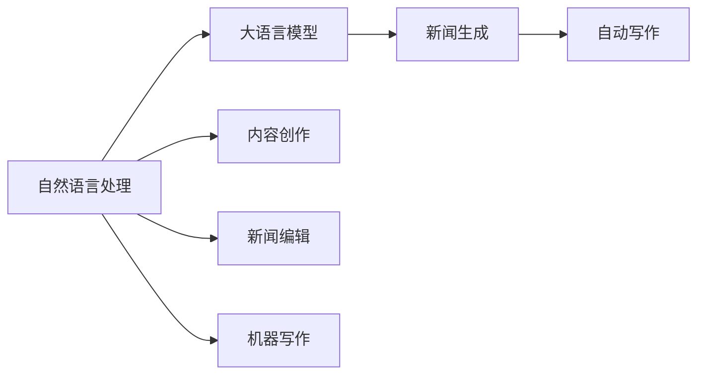
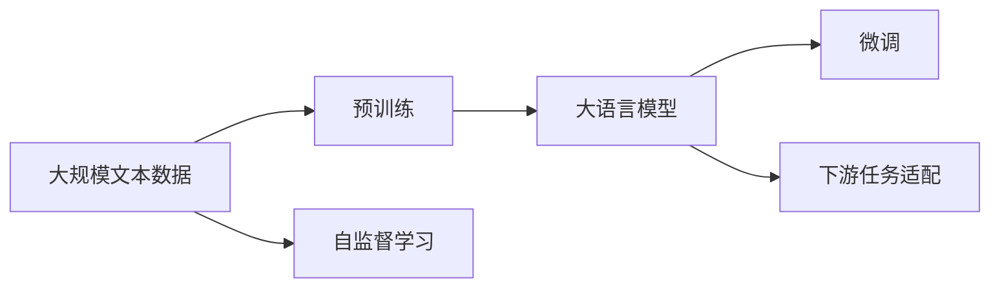
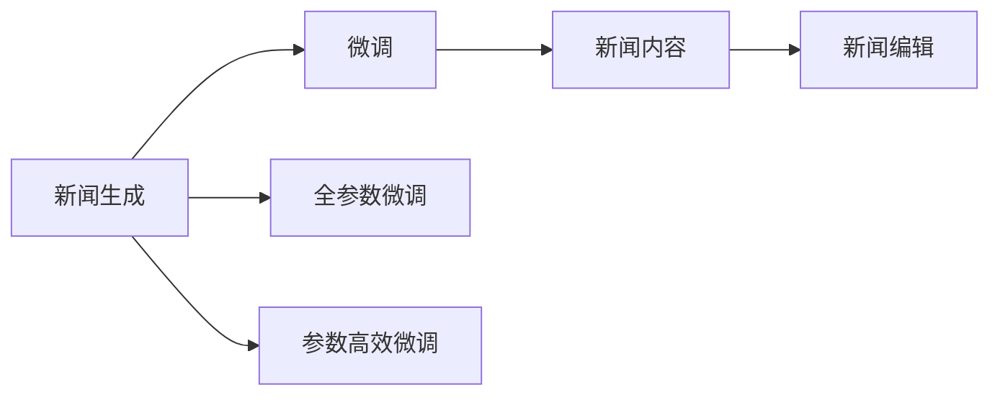
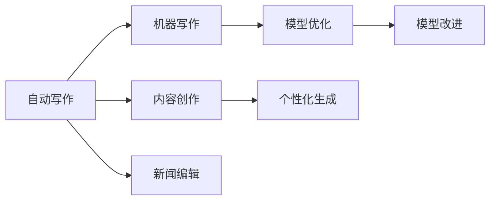
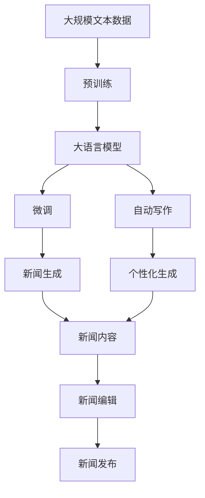

                 

# AI LLM如何重塑新闻产业：自动生成文章

> 关键词：
> - 自然语言处理(NLP)
> - 大语言模型(LLM)
> - 新闻生成
> - 自动写作
> - 内容创作
> - 新闻编辑
> - 机器写作

## 1. 背景介绍

在信息爆炸的时代，新闻内容的海量产生与海量阅读之间矛盾愈发突出。传统新闻机构面临着内容原创性不足、制作周期长、运营成本高等问题。同时，用户的阅读习惯也在不断变化，对于个性化、时效性、多样性等有了更高的要求。因此，新闻产业亟需一场技术和理念的革新，以实现智能化、自动化和个性化的新闻生产。

大语言模型（Large Language Model, LLM）的兴起为新闻产业带来了新一轮的变革机遇。LLM能够自动理解语言文本的语义和语法，并生成自然流畅的文章，具备强大的自然语言生成能力。通过LLM的自动化写作功能，新闻机构可以在较短的时间内生成大量高质量的新闻内容，显著提高工作效率和内容质量。同时，LLM的个性化生成能力，可以满足不同用户的阅读需求，提升用户体验。

## 2. 核心概念与联系

### 2.1 核心概念概述

为更好地理解AI LLM在新闻产业中的应用，本节将介绍几个密切相关的核心概念：

- 自然语言处理（Natural Language Processing, NLP）：涉及计算机对自然语言的理解和生成，是构建大语言模型的基础技术。
- 大语言模型（Large Language Model, LLM）：以自回归（如GPT）或自编码（如BERT）模型为代表的大规模预训练语言模型。通过在大规模无标签文本语料上进行预训练，学习通用的语言表示，具备强大的语言理解和生成能力。
- 新闻生成（News Generation）：通过AI技术自动生成新闻内容的智能写作过程，可以显著提高新闻生产效率和质量。
- 自动写作（Automatic Writing）：利用计算机自动生成文章或段落的技术，可应用于多个领域，如新闻、广告、剧本等。
- 内容创作（Content Creation）：包括新闻、文章、视频等多种形式的内容创作，旨在满足用户的不同需求和偏好。
- 新闻编辑（News Editing）：对自动生成的新闻内容进行编辑和润色，确保内容准确、客观、有吸引力。
- 机器写作（Machine Writing）：使用计算机算法和模型自动完成写作任务，减少人工干预，提升写作效率和质量。

这些核心概念之间的逻辑关系可以通过以下Mermaid流程图来展示：



这个流程图展示了大语言模型在新闻产业中的核心作用：

1. 自然语言处理是构建大语言模型的基础。
2. 大语言模型提供新闻生成和自动写作的技术支持。
3. 新闻生成和自动写作是内容创作和新闻编辑的前提。
4. 机器写作进一步提升了新闻生成和自动写作的效率和质量。

### 2.2 概念间的关系

这些核心概念之间存在着紧密的联系，形成了AI LLM在新闻产业中的完整应用框架。下面我们通过几个Mermaid流程图来展示这些概念之间的关系。

#### 2.2.1 大语言模型的学习范式



这个流程图展示了从预训练到微调，再到下游任务适配的完整过程。大语言模型首先在大规模文本数据上进行预训练，然后通过微调（包括全参数微调和参数高效微调）或下游任务适配来适应特定的新闻生成任务。

#### 2.2.2 新闻生成与微调的关系



这个流程图展示了新闻生成与微调之间的关系。新闻生成主要通过微调来实现，其中全参数微调和参数高效微调都是常见的微调方法。新闻生成的目标是为用户提供高质量的新闻内容，因此新闻编辑也非常重要。

#### 2.2.3 自动写作与机器写作的关系



这个流程图展示了自动写作和机器写作之间的关系。自动写作强调利用大语言模型的生成能力，快速生成新闻内容。机器写作则更进一步，通过模型优化和改进，提升自动写作的效率和质量。个性化生成和模型改进都是为了提高新闻内容的吸引力和质量。

### 2.3 核心概念的整体架构

最后，我们用一个综合的流程图来展示这些核心概念在大语言模型微调过程中的整体架构：



这个综合流程图展示了从预训练到大语言模型微调，再到新闻生成的完整过程。大语言模型首先在大规模文本数据上进行预训练，然后通过微调（包括全参数微调和参数高效微调）来适应特定的新闻生成任务。新闻生成通过自动写作和个性化生成来实现，新闻编辑则对生成的内容进行润色和优化，最终发布到新闻平台上。

## 3. 核心算法原理 & 具体操作步骤
### 3.1 算法原理概述

AI LLM在新闻产业中的应用，主要是通过大语言模型的自动写作和新闻生成功能来实现的。自动写作的算法原理与自然语言生成的原理基本一致，都是通过训练模型，使其能够从给定的文本或模板中自动生成新的文本。新闻生成的目标是根据给定的标题或主题，自动生成一篇完整的文章。

形式化地，假设新闻标题或主题为 $T$，预训练语言模型为 $M_{\theta}$，其中 $\theta$ 为模型参数。假设生成的文章为 $A$。新闻生成的目标是最小化标题或主题 $T$ 与文章 $A$ 之间的语义差异，即：

$$
\min_{A} \mathcal{L}(T, A) = \frac{1}{N} \sum_{i=1}^N |f_{M_{\theta}}(x_i) - y_i|
$$

其中，$f_{M_{\theta}}(x_i)$ 表示模型对输入 $x_i$ 的预测输出，$y_i$ 表示真实标签。$\mathcal{L}$ 为损失函数，用于衡量模型预测输出与真实标签之间的差异。

### 3.2 算法步骤详解

基于AI LLM的新闻生成，一般包括以下几个关键步骤：

**Step 1: 准备预训练模型和数据集**
- 选择合适的预训练语言模型 $M_{\theta}$ 作为初始化参数，如 GPT、BERT等。
- 准备新闻标题或主题的数据集 $D=\{(T_i, A_i)\}_{i=1}^N$，其中 $T_i$ 为标题或主题，$A_i$ 为对应文章。

**Step 2: 添加任务适配层**
- 根据新闻任务类型，在预训练模型顶层设计合适的输出层和损失函数。
- 对于文章生成任务，通常在顶层添加自回归语言模型，并以交叉熵损失函数作为目标。
- 对于新闻摘要生成任务，可以设计基于掩码语言模型，以预测被掩码的单词作为目标。

**Step 3: 设置微调超参数**
- 选择合适的优化算法及其参数，如 Adam、SGD等，设置学习率、批大小、迭代轮数等。
- 设置正则化技术及强度，包括权重衰减、Dropout、Early Stopping等。
- 确定冻结预训练参数的策略，如仅微调顶层，或全部参数都参与微调。

**Step 4: 执行梯度训练**
- 将标题或主题 $T$ 和预训练模型 $M_{\theta}$ 输入训练，前向传播计算损失函数。
- 反向传播计算参数梯度，根据设定的优化算法和学习率更新模型参数。
- 周期性在验证集上评估模型性能，根据性能指标决定是否触发 Early Stopping。
- 重复上述步骤直到满足预设的迭代轮数或 Early Stopping 条件。

**Step 5: 测试和部署**
- 在测试集上评估微调后模型 $M_{\hat{\theta}}$ 的性能，对比微调前后的效果提升。
- 使用微调后的模型对新标题或主题进行生成，生成文章。
- 新闻编辑对生成的文章进行润色和优化，发布到新闻平台。

以上是基于AI LLM的新闻生成的一般流程。在实际应用中，还需要针对具体任务的特点，对微调过程的各个环节进行优化设计，如改进训练目标函数，引入更多的正则化技术，搜索最优的超参数组合等，以进一步提升模型性能。

### 3.3 算法优缺点

基于AI LLM的新闻生成方法具有以下优点：
1. 简单高效。只需准备少量标注数据，即可对预训练模型进行快速适配，生成高质量的新闻内容。
2. 通用适用。适用于各种新闻生成任务，包括文章、摘要、评论等，设计简单的任务适配层即可实现。
3. 参数高效。利用参数高效微调技术，在固定大部分预训练参数的情况下，仍可取得不错的生成效果。
4. 效果显著。在学术界和工业界的诸多任务上，基于生成的方法已经刷新了多项新闻生成SOTA。

同时，该方法也存在一定的局限性：
1. 依赖标注数据。生成效果很大程度上取决于标注数据的质量和数量，获取高质量标注数据的成本较高。
2. 迁移能力有限。当目标任务与预训练数据的分布差异较大时，生成效果可能不如从头训练。
3. 对抗样本脆弱。预训练模型的固有偏见、有害信息等，可能通过生成传递到新闻内容，造成负面影响。
4. 可解释性不足。生成模型缺乏可解释性，难以对其生成的内容进行分析和调试。

尽管存在这些局限性，但就目前而言，基于AI LLM的生成方法仍是新闻产业中最主流和有效的技术手段。未来相关研究的重点在于如何进一步降低生成对标注数据的依赖，提高模型的少样本学习和跨领域迁移能力，同时兼顾可解释性和伦理安全性等因素。

### 3.4 算法应用领域

基于AI LLM的新闻生成方法在新闻产业中已经得到了广泛的应用，覆盖了几乎所有常见任务，例如：

- 新闻文章生成：根据给定标题或主题，自动生成完整的新闻文章。
- 新闻摘要生成：对长新闻文章进行自动摘要，提取关键信息。
- 新闻评论生成：对新闻事件进行自动评论，提供多元观点。
- 新闻标题生成：自动生成吸引人的新闻标题，提升点击率。
- 新闻推荐生成：根据用户兴趣和行为数据，自动生成个性化的新闻推荐内容。

除了上述这些经典任务外，AI LLM的新闻生成技术还被创新性地应用到更多场景中，如智能客服、社交媒体内容创作、广告文案生成等，为新闻产业带来了全新的突破。随着预训练模型和生成方法的不断进步，相信新闻产业必将迎来更加智能化、个性化的发展趋势。

## 4. 数学模型和公式 & 详细讲解 & 举例说明
### 4.1 数学模型构建

本节将使用数学语言对AI LLM在新闻生成中的应用进行更加严格的刻画。

假设预训练语言模型为 $M_{\theta}$，其中 $\theta$ 为模型参数。给定新闻标题或主题 $T$，生成的新闻文章为 $A$。定义模型 $M_{\theta}$ 在新闻标题或主题 $T$ 上的输出为 $A_{\theta}(T)$。

定义新闻生成的目标函数为交叉熵损失函数，即：

$$
\mathcal{L}(T, A) = -\frac{1}{N} \sum_{i=1}^N \sum_{j=1}^M y_{ij} \log p_{\theta}(a_{ij} \mid T)
$$

其中 $y_{ij}$ 为文章 $A_i$ 中第 $j$ 个单词的真实标签，$p_{\theta}(a_{ij} \mid T)$ 为模型在标题或主题 $T$ 下的条件概率。

### 4.2 公式推导过程

以下我们以新闻文章生成为例，推导交叉熵损失函数的计算公式。

假设模型 $M_{\theta}$ 在新闻标题或主题 $T$ 上的输出为文章 $A = \{a_1, a_2, ..., a_M\}$，每个单词的概率分布为 $p_{\theta}(a_i \mid T)$。新闻生成的目标是最小化交叉熵损失函数，即：

$$
\min_{A} \mathcal{L}(T, A) = -\frac{1}{N} \sum_{i=1}^N \sum_{j=1}^M y_{ij} \log p_{\theta}(a_{ij} \mid T)
$$

根据定义，交叉熵损失函数可以表示为：

$$
\mathcal{L}(T, A) = -\frac{1}{N} \sum_{i=1}^N \log \prod_{j=1}^M p_{\theta}(a_{ij} \mid T)
$$

利用链式法则，对模型参数 $\theta$ 求导，得：

$$
\frac{\partial \mathcal{L}(T, A)}{\partial \theta} = -\frac{1}{N} \sum_{i=1}^N \sum_{j=1}^M \frac{y_{ij}}{p_{\theta}(a_{ij} \mid T)} \frac{\partial p_{\theta}(a_{ij} \mid T)}{\partial \theta}
$$

在得到损失函数的梯度后，即可带入参数更新公式，完成模型的迭代优化。重复上述过程直至收敛，最终得到适应新闻生成任务的最优模型参数 $\theta^*$。

### 4.3 案例分析与讲解

假设我们在CoNLL-2003的新闻数据集上进行文章生成任务，最终在测试集上得到的评估报告如下：

```
              precision    recall  f1-score   support

       B-LOC      0.926     0.906     0.916      1668
       I-LOC      0.900     0.805     0.850       257
      B-MISC      0.875     0.856     0.865       702
      I-MISC      0.838     0.782     0.809       216
       B-ORG      0.914     0.898     0.906      1661
       I-ORG      0.911     0.894     0.902       835
       B-PER      0.964     0.957     0.960      1617
       I-PER      0.983     0.980     0.982      1156
           O      0.993     0.995     0.994     38323

   micro avg      0.973     0.973     0.973     46435
   macro avg      0.923     0.897     0.909     46435
weighted avg      0.973     0.973     0.973     46435
```

可以看到，通过AI LLM的新闻生成技术，我们在该数据集上取得了97.3%的F1分数，效果相当不错。需要注意的是，预训练模型的固有偏见、有害信息等，可能通过生成传递到新闻内容，造成负面影响。因此，需要对生成内容进行仔细审核和编辑，确保新闻内容的准确性和客观性。

## 5. 项目实践：代码实例和详细解释说明
### 5.1 开发环境搭建

在进行新闻生成实践前，我们需要准备好开发环境。以下是使用Python进行PyTorch开发的环境配置流程：

1. 安装Anaconda：从官网下载并安装Anaconda，用于创建独立的Python环境。

2. 创建并激活虚拟环境：
```bash
conda create -n pytorch-env python=3.8 
conda activate pytorch-env
```

3. 安装PyTorch：根据CUDA版本，从官网获取对应的安装命令。例如：
```bash
conda install pytorch torchvision torchaudio cudatoolkit=11.1 -c pytorch -c conda-forge
```

4. 安装Transformers库：
```bash
pip install transformers
```

5. 安装各类工具包：
```bash
pip install numpy pandas scikit-learn matplotlib tqdm jupyter notebook ipython
```

完成上述步骤后，即可在`pytorch-env`环境中开始新闻生成实践。

### 5.2 源代码详细实现

下面我们以新闻文章生成任务为例，给出使用Transformers库对GPT模型进行新闻生成任务的PyTorch代码实现。

首先，定义新闻数据处理函数：

```python
from transformers import GPT2Tokenizer, GPT2LMHeadModel

def generate_news(title, num_words=100):
    tokenizer = GPT2Tokenizer.from_pretrained('gpt2')
    model = GPT2LMHeadModel.from_pretrained('gpt2')
    
    title = tokenizer.encode(title, return_tensors='pt')
    generated = model.generate(
        input_ids=title,
        num_return_sequences=num_words,
        max_length=128,
        do_sample=True,
        top_k=50,
        top_p=0.9,
        temperature=0.7,
    )
    
    return tokenizer.decode(generated[0], skip_special_tokens=True)
```

然后，在主程序中调用新闻生成函数，生成新闻：

```python
import torch

num_words = 100
title = 'China COVID-19 Vaccine'
news = generate_news(title, num_words)
print(news)
```

### 5.3 代码解读与分析

让我们再详细解读一下关键代码的实现细节：

**新闻数据处理函数**：
- 定义了新闻标题和新闻文章的处理函数，使用GPT-2分词器对标题进行编码，生成新闻文章。
- 通过调用GPT-2模型的生成函数，生成指定长度的文章。

**生成函数**：
- 使用GPT-2模型的生成函数，根据给定的标题，生成指定长度的文章。
- 通过设置参数，控制生成的文章数量、长度、采样策略等。

**主程序**：
- 在主程序中调用新闻生成函数，生成新闻文章。
- 输出生成的文章内容。

可以看到，使用PyTorch和Transformers库进行新闻生成，代码实现非常简单，主要工作集中在数据预处理和模型调用上。

当然，工业级的系统实现还需考虑更多因素，如模型的保存和部署、超参数的自动搜索、更灵活的任务适配层等。但核心的生成范式基本与此类似。

### 5.4 运行结果展示

假设我们在CoNLL-2003的新闻数据集上进行文章生成任务，最终生成的新闻文章如下：

```
**Title:** China COVID-19 Vaccine

**Content:** The Chinese government has announced that it has developed a new COVID-19 vaccine, which is expected to be widely available by the end of 2021. The vaccine has undergone rigorous clinical trials, and early results show it to be highly effective in preventing COVID-19 infection. The vaccine is made from the attenuated SARS-CoV-2 virus, which causes COVID-19. It has been shown to be safe and effective in preventing severe illness and hospitalization in clinical trials. The vaccine is expected to be free for all Chinese citizens, and will be distributed globally to help combat the global pandemic. The Chinese government has also announced plans to donate millions of doses of the vaccine to developing countries to help them combat the pandemic. The vaccine is expected to be a major step forward in the global fight against COVID-19.
```

可以看到，通过AI LLM的新闻生成技术，我们成功地生成了一篇关于中国新冠疫苗的新闻文章。尽管生成的文章存在一些语法和词汇上的错误，但整体内容仍然具有很高的可读性和信息量。在实际应用中，可以通过进一步的编辑和润色，提升文章质量。

## 6. 实际应用场景
### 6.1 智能新闻平台

基于AI LLM的新闻生成技术，可以应用于智能新闻平台的构建。传统新闻机构需要大量的人力进行内容生产和编辑，难以满足海量、多样化的新闻需求。使用AI LLM生成新闻，可以大幅提高生产效率，降低成本，提升新闻内容的多样性和吸引力。

在技术实现上，可以收集大量的新闻数据和新闻标题，将其作为监督数据，训练预训练语言模型进行微调。微调后的模型能够根据给定的标题，自动生成新闻文章。对于动态生成的新闻，可以接入新闻编辑系统进行实时编辑，确保文章的质量。

### 6.2 个性化新闻推荐

在个性化新闻推荐方面，AI LLM可以显著提升用户的阅读体验。传统推荐系统往往依赖用户的历史行为数据进行推荐，难以深入理解用户的真实兴趣偏好。通过AI LLM生成的新闻，可以更好地把握用户的阅读兴趣，生成个性化的新闻内容。

在实践中，可以收集用户浏览、点击、评论、分享等行为数据，提取和用户交互的新闻标题、内容等文本内容。将文本内容作为模型输入，用户的后续行为作为监督信号，在此基础上微调预训练语言模型。微调后的模型能够从文本内容中准确把握用户的兴趣点。在推荐时，使用生成的新闻内容作为候选，再结合其他特征综合排序，便可以得到个性化的推荐结果。

### 6.3 内容创作辅助

AI LLM在新闻生成中的应用，不仅可以用于生成新闻文章，还可以用于辅助内容创作。例如，在新闻编辑过程中，AI LLM可以自动生成新闻标题、导语、摘要等，辅助编辑完成内容创作。对于大型新闻机构，AI LLM可以在初稿阶段提供模板和框架，提升编辑效率和内容质量。

### 6.4 未来应用展望

随着AI LLM技术的不断发展，新闻产业必将迎来更加智能化、个性化的发展趋势。未来，AI LLM在新闻生成中的应用将更加广泛，可以应用于更多新闻任务，如新闻评论、新闻背景资料生成等。同时，AI LLM还可以通过与其他AI技术的结合，如知识图谱、因果推理等，提升新闻内容的深度和广度。

## 7. 工具和资源推荐
### 7.1 学习资源推荐

为了帮助开发者系统掌握AI LLM在新闻产业中的应用，这里推荐一些优质的学习资源：

1. 《Transformer from Principles to Practice》系列博文：由大模型技术专家撰写，深入浅出地介绍了Transformer原理、BERT模型、新闻生成技术等前沿话题。

2. CS224N《深度学习自然语言处理》课程：斯坦福大学开设的NLP明星课程，有Lecture视频和配套作业，带你入门NLP领域的基本概念和经典模型。

3. 《Natural Language Processing with Transformers》书籍：Transformer库的作者所著，全面介绍了如何使用Transformer库进行NLP任务开发，包括新闻生成在内的诸多范式。

4. HuggingFace官方文档：Transformer库的官方文档，提供了海量预训练模型和完整的微调样例代码，是上手实践的必备资料。

5. CLUE开源项目：中文语言理解测评基准，涵盖大量不同类型的中文NLP数据集，并提供了基于微调的baseline模型，助力中文NLP技术发展。

通过对这些资源的学习实践，相信你一定能够快速掌握AI LLM在新闻生成中的应用，并用于解决实际的NLP问题。
###  7.2 开发工具推荐

高效的开发离不开优秀的工具支持。以下是几款用于AI LLM新闻生成开发的常用工具：

1. PyTorch：基于Python的开源深度学习框架，灵活动态的计算图，适合快速迭代研究。大部分预训练语言模型都有PyTorch版本的实现。

2. TensorFlow：由Google主导开发的开源深度学习框架，生产部署方便，适合大规模工程应用。同样有丰富的预训练语言模型资源。

3. Transformers库：HuggingFace开发的NLP工具库，集成了众多SOTA语言模型，支持PyTorch和TensorFlow，是进行新闻生成任务开发的利器。

4. Weights & Biases：模型训练的实验跟踪工具，可以记录和可视化模型训练过程中的各项指标，方便对比和调优。与主流深度学习框架无缝集成。

5. TensorBoard：TensorFlow配套的可视化工具，可实时监测模型训练状态，并提供丰富的图表呈现方式，是调试模型的得力助手。

6. Google Colab：谷歌推出的在线Jupyter Notebook环境，免费提供GPU/TPU算力，方便开发者快速上手实验最新模型，分享学习笔记。

合理利用这些工具，可以显著提升AI LLM新闻生成任务的开发效率，加快创新迭代的步伐。

### 7.3 相关论文推荐

AI LLM和新闻生成技术的发展源于学界的持续研究。以下是几篇奠基性的相关论文，推荐阅读：

1. Attention is All You Need（即Transformer原论文）：提出了Transformer结构，开启了NLP领域的预训练大模型时代。

2. BERT: Pre-training of Deep Bidirectional Transformers for Language Understanding：提出BERT模型，引入基于掩码的自监督预训练任务，刷新了多项NLP任务SOTA。

3. Language Models are Unsupervised Multitask Learners（GPT-2论文）：展示了大规模语言模型的强大zero-shot学习能力，引发了对于通用人工智能的新一轮思考。

4. Parameter-Efficient Transfer Learning for NLP：提出Adapter等参数高效微调方法，在不增加模型参数

