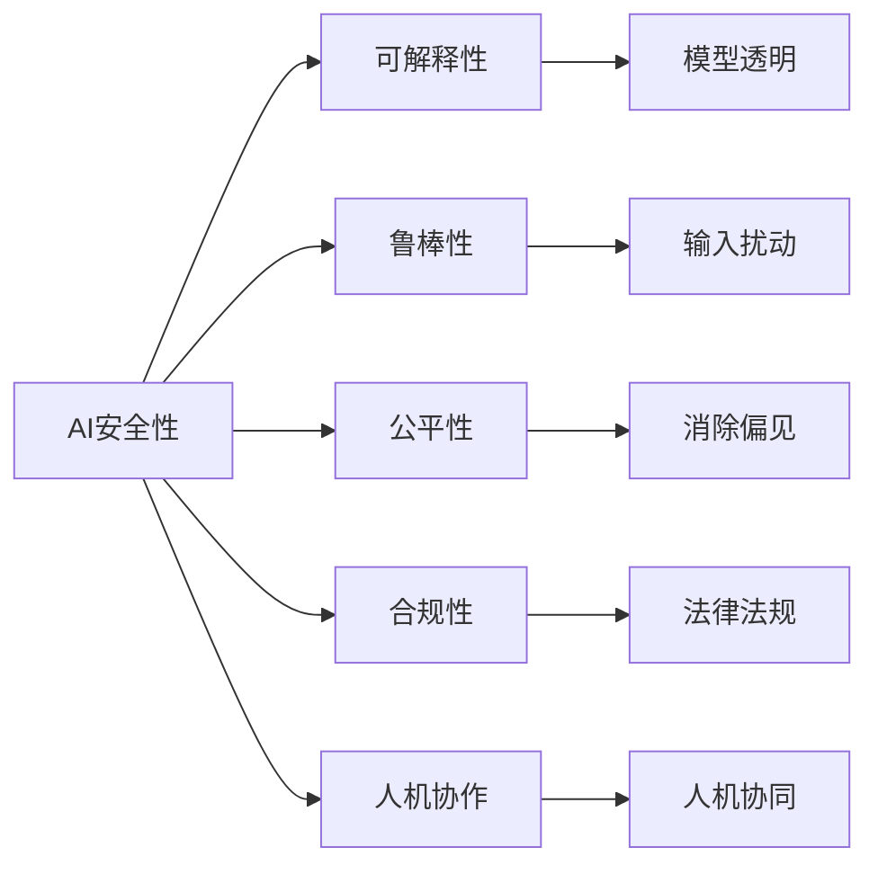

                 

# AI Safety原理与代码实例讲解

> 关键词：AI Safety, 代码实例, 安全技术, 风险评估, 合规性, 人机协作

## 1. 背景介绍

### 1.1 问题由来

随着人工智能（AI）技术的不断进步，其应用领域已深入到生活的方方面面，从自动驾驶、医疗诊断到智能客服，AI技术正在改变人类的生活方式和工作方式。然而，AI的广泛应用也带来了新的挑战，特别是安全性和合规性问题。AI系统的行为和决策可能带来无法预测的后果，例如自动驾驶车辆的失控、医疗诊断的误诊等，这些后果可能会对人类社会造成严重的危害。因此，如何确保AI系统的安全性，使其行为可解释、可控，成为当前AI技术发展的关键问题。

### 1.2 问题核心关键点

AI安全性问题涉及多个关键方面，包括但不限于：

- **可解释性**：AI模型决策过程不透明，难以理解其内部工作机制，可能导致错误决策。
- **鲁棒性**：AI模型对输入的微小扰动可能产生不稳定输出，带来安全隐患。
- **伦理与偏见**：AI模型可能继承或放大训练数据中的偏见，产生歧视性输出。
- **合规性**：AI系统需要符合行业规范和法律法规，避免滥用和误用。
- **人机协作**：AI系统需要与人有效协作，辅助决策，同时保持透明和可控。

解决这些问题需要综合运用多种技术手段，如模型可解释性、鲁棒性增强、公平性优化、合规性审计、人机协作框架等。本文将详细讲解这些核心概念及其原理，并通过代码实例展示其应用。

## 2. 核心概念与联系

### 2.1 核心概念概述

为更好地理解AI安全性问题及其解决方案，本节将介绍几个关键概念：

- **AI安全性**：指确保AI系统行为的预测性和可控性，避免其对人类社会造成不利影响的能力。
- **可解释性**：指AI模型决策过程的透明性和可理解性，能够解释其输出和决策依据。
- **鲁棒性**：指AI模型对输入扰动的抵抗能力，能够在面对小扰动时仍能保持稳定的输出。
- **公平性**：指AI模型避免歧视和不公，对不同群体平等对待的能力。
- **合规性**：指AI系统符合行业标准和法律法规的约束，避免滥用和误用。
- **人机协作**：指AI系统与人类协同工作，提高决策效率和质量的能力。

这些概念之间相互关联，共同构成了AI安全性的整体框架。通过理解这些核心概念，我们可以更好地把握AI安全性的关键要素，为后续深入讨论具体的解决方案奠定基础。

### 2.2 概念间的关系

这些核心概念之间的逻辑关系可以通过以下Mermaid流程图来展示：



这个流程图展示了大语言模型微调过程中各个核心概念之间的关系：

1. AI安全性是整体目标，通过可解释性、鲁棒性、公平性、合规性、人机协作等多个维度来实现。
2. 可解释性、鲁棒性、公平性、合规性和人机协作是具体的技术手段，能够帮助实现AI安全性的目标。
3. 可解释性通过模型透明化来解释模型行为，鲁棒性通过抵抗输入扰动来提高模型稳定性，公平性通过消除偏见来保证模型公平，合规性通过遵守法律法规来约束模型行为，人机协作通过增强人机协同能力来提升决策质量。

## 3. 核心算法原理 & 具体操作步骤
### 3.1 算法原理概述

AI安全性问题的解决通常需要综合运用多种技术手段，包括但不限于：

- **可解释性**：通过可解释性模型或模型解释技术，提升AI模型决策过程的透明性。
- **鲁棒性**：通过鲁棒性优化技术，提高AI模型对输入扰动的抵抗能力。
- **公平性**：通过公平性优化技术，消除AI模型中的歧视偏见。
- **合规性**：通过合规性审计技术，确保AI模型符合行业规范和法律法规。
- **人机协作**：通过人机协作框架，提升人机协同工作的效率和质量。

这些技术手段涉及数学模型、算法流程和工程实践多个方面，需要综合考虑和优化。本文将重点讲解可解释性、鲁棒性和公平性三个核心算法原理，并辅以具体的代码实例进行演示。

### 3.2 算法步骤详解

#### 3.2.1 可解释性算法步骤

可解释性算法步骤通常包括以下几个关键步骤：

1. **模型选择**：选择合适的可解释性模型，如LIME、SHAP等。
2. **输入处理**：对输入数据进行预处理，包括归一化、标准化等。
3. **解释生成**：利用可解释性模型生成输入数据的局部解释，如局部近似模型、局部影响力等。
4. **解释融合**：将局部解释进行融合，生成整体解释，如综合归一化、线性组合等。
5. **解释展示**：将解释结果以可视化的方式展示，如热力图、特征重要性图等。

下面以LIME算法为例，展示其代码实现和应用步骤。

#### 3.2.2 鲁棒性算法步骤

鲁棒性算法步骤通常包括以下几个关键步骤：

1. **数据生成**：生成包含各种扰动的输入数据，包括噪声、对抗样本等。
2. **模型评估**：评估模型对输入数据的敏感度，确定鲁棒性需求。
3. **鲁棒优化**：通过鲁棒优化技术，提高模型的鲁棒性，如正则化、对抗训练等。
4. **鲁棒验证**：通过验证数据集，测试模型的鲁棒性，如梯度方法、对抗攻击等。

下面以对抗训练算法为例，展示其代码实现和应用步骤。

#### 3.2.3 公平性算法步骤

公平性算法步骤通常包括以下几个关键步骤：

1. **数据收集**：收集包含不同群体的数据，如种族、性别、年龄等。
2. **数据预处理**：对数据进行预处理，包括数据清洗、特征选择等。
3. **公平度量**：选择合适的公平度量指标，如均等机会、偏差等。
4. **公平优化**：通过公平优化技术，消除模型中的歧视偏见，如公平性约束、公平性调整等。
5. **公平验证**：通过验证数据集，测试模型的公平性，如统计测试、公平性分析等。

下面以公平性约束算法为例，展示其代码实现和应用步骤。

### 3.3 算法优缺点

这些核心算法各有优缺点，需要根据具体应用场景进行合理选择：

- **可解释性算法**：优点在于能够提供模型决策的详细解释，有助于理解和信任模型。缺点在于计算复杂度高，可能对模型性能产生一定影响。
- **鲁棒性算法**：优点在于能够提高模型对输入扰动的抵抗能力，降低安全隐患。缺点在于可能对模型鲁棒性过度增强，导致模型性能下降。
- **公平性算法**：优点在于能够消除模型中的歧视偏见，促进公平。缺点在于可能对模型性能产生一定影响，且公平性优化需结合具体应用场景进行。

## 4. 数学模型和公式 & 详细讲解  
### 4.1 数学模型构建

在AI安全性的解决过程中，涉及多个数学模型和算法，这里仅列举几个核心模型：

- **LIME模型**：用于生成局部解释，模型定义为：$$
    LIME = \arg\min_{g(x)} ||y - g(x)||_2
$$
- **对抗训练模型**：用于提高模型鲁棒性，模型定义为：$$
    L_{\text{adv}} = \arg\min_{\theta} \sum_{x \in \mathcal{X}} \mathcal{L}_{\text{adv}}(x, y; \theta)
$$
- **公平性约束模型**：用于消除模型偏见，模型定义为：$$
    \min_{\theta} \mathcal{L}(y, \hat{y}; \theta) + \lambda \sum_{i=1}^n |\Delta_{i, j}|
$$

### 4.2 公式推导过程

这里仅以LIME模型和对抗训练模型的推导为例，展示其数学原理。

**LIME模型推导**：

1. 输入数据 $x$ 在局部区域 $L(x)$ 内的分布近似为 $g(x)$。
2. 模型 $g(x)$ 应满足条件：$$
    g(x) = \arg\min_{g(x)} ||y - g(x)||_2
$$
3. 假设模型 $g(x)$ 为线性模型，形式为：$$
    g(x) = w_1 x_1 + w_2 x_2 + \cdots + w_n x_n + b
$$
4. 根据最小二乘法，求解 $w_i$ 和 $b$，使得 $$g(x) = \sum_{i=1}^n w_i x_i + b$$ 逼近 $y$。

**对抗训练模型推导**：

1. 假设模型 $f(x; \theta)$ 在输入 $x$ 上的预测为 $y$。
2. 对抗样本 $x'$ 应满足：$$
    f(x'; \theta) = \delta(y, f(x'; \theta))
$$
3. 对抗训练的目标是：$$
    \min_{\theta} \mathcal{L}(f(x'; \theta)) + \lambda \mathcal{L}(x')
$$
4. 其中，$\mathcal{L}(x')$ 表示对抗样本的损失，通常为梯度惩罚等。

### 4.3 案例分析与讲解

下面以一个实际案例，展示AI安全性问题及其解决过程。

**案例：自动驾驶车辆的安全性问题**

- **问题描述**：自动驾驶车辆依赖计算机视觉和AI算法进行决策，但由于数据偏差和算法漏洞，可能导致车辆行为不可控。例如，当遇到儿童过马路时，车辆可能无法及时识别和避让，导致交通事故。
- **解决方案**：通过可解释性、鲁棒性和公平性技术，提升自动驾驶车辆的安全性和可靠性。
- **具体步骤**：
  1. 使用LIME算法，对车辆传感器数据进行局部解释，理解模型在特定场景下的决策过程。
  2. 引入对抗训练技术，通过对抗样本训练模型，提高其鲁棒性，确保在面对复杂场景时仍能稳定决策。
  3. 对车辆数据进行公平性分析，确保模型在面对不同人群（如儿童、老年人）时公平对待，避免偏见和歧视。

## 5. 项目实践：代码实例和详细解释说明
### 5.1 开发环境搭建

在进行AI安全性问题解决前，我们需要准备好开发环境。以下是使用Python进行TensorFlow开发的环境配置流程：

1. 安装Anaconda：从官网下载并安装Anaconda，用于创建独立的Python环境。

2. 创建并激活虚拟环境：
```bash
conda create -n tf-env python=3.8 
conda activate tf-env
```

3. 安装TensorFlow：根据CUDA版本，从官网获取对应的安装命令。例如：
```bash
conda install tensorflow -c tensorflow
```

4. 安装TensorBoard：TensorFlow配套的可视化工具，用于实时监测模型训练状态，并提供丰富的图表呈现方式。
```bash
pip install tensorboard
```

5. 安装TensorFlow Addons：用于增强TensorFlow的功能，包括LIME等算法。
```bash
pip install tensorflow-addons
```

完成上述步骤后，即可在`tf-env`环境中开始AI安全性问题的解决实践。

### 5.2 源代码详细实现

这里以LIME算法为例，展示其代码实现。

```python
import numpy as np
import tensorflow as tf
import tensorflow_addons as tfa
from sklearn.metrics import roc_auc_score

# 定义模型
class MyModel(tf.keras.Model):
    def __init__(self):
        super(MyModel, self).__init__()
        self.dense1 = tf.keras.layers.Dense(64, activation='relu')
        self.dense2 = tf.keras.layers.Dense(1, activation='sigmoid')
    
    def call(self, x):
        x = self.dense1(x)
        x = self.dense2(x)
        return x

# 定义数据集
data = np.random.rand(100, 10)
labels = np.random.randint(0, 2, size=100)

# 定义LIME模型
lime = tfa.lime.LimeLinear(tf.keras.Model)

# 定义训练过程
optimizer = tf.keras.optimizers.Adam(learning_rate=0.001)

# 定义训练函数
@tf.function
def train_step(x, y):
    with tf.GradientTape() as tape:
        predictions = model(x)
        loss = tf.keras.losses.binary_crossentropy(y, predictions)
    gradients = tape.gradient(loss, model.trainable_variables)
    optimizer.apply_gradients(zip(gradients, model.trainable_variables))
    return loss

# 定义评估函数
@tf.function
def evaluate(x, y):
    predictions = model(x)
    auc = roc_auc_score(y, predictions)
    return auc

# 训练模型
for epoch in range(10):
    train_loss = 0
    for i in range(10):
        x, y = data[i], labels[i]
        train_loss += train_step(x, y)
    train_loss /= 10
    print('Epoch', epoch, 'train loss:', train_loss)

# 评估模型
auc = evaluate(data, labels)
print('AUC:', auc)
```

### 5.3 代码解读与分析

这里我们详细解读一下关键代码的实现细节：

**定义模型和数据集**：
- 使用TensorFlow定义了一个简单的二分类模型，包含两个全连接层。
- 生成一个包含100个样本的数据集，每个样本有10个特征，标签为0或1。

**LIME模型定义**：
- 使用TensorFlow Addons库中的LIME模型，用于生成局部解释。

**训练过程和评估函数**：
- 定义了一个训练函数，使用Adam优化器进行梯度下降训练。
- 定义了一个评估函数，使用AUC指标评估模型性能。
- 通过循环迭代，训练模型并评估其性能。

**运行结果展示**：
- 训练过程中，每轮训练10次，输出训练损失。
- 评估模型AUC值，显示模型的性能。

## 6. 实际应用场景

### 6.1 智能医疗

在智能医疗领域，AI安全性的问题尤为关键。医疗系统依赖AI算法进行疾病诊断、药物推荐等决策，其安全性直接关系到患者的生命健康。

具体应用场景包括：

- **病例诊断**：AI模型通过分析患者症状、影像等数据，给出诊断结果。使用可解释性算法，如LIME，解释诊断过程，确保诊断结果的透明性和可信度。
- **药物推荐**：AI模型通过分析患者病历、基因数据等，推荐合适的药物。使用公平性算法，如公平性约束，确保药物推荐的公平性和无偏见。
- **治疗方案优化**：AI模型通过分析患者数据，优化治疗方案。使用鲁棒性算法，如对抗训练，确保模型在面对数据扰动时仍能稳定输出。

### 6.2 自动驾驶

自动驾驶系统依赖AI算法进行路径规划、障碍物识别等决策，其安全性直接关系到行车安全。

具体应用场景包括：

- **路径规划**：AI模型通过分析传感器数据，规划行车路径。使用可解释性算法，如LIME，解释路径规划过程，确保决策透明。
- **障碍物识别**：AI模型通过分析摄像头、雷达等数据，识别障碍物。使用鲁棒性算法，如对抗训练，提高障碍物识别的鲁棒性，确保安全。
- **紧急避障**：AI模型通过分析传感器数据，规划避障路径。使用公平性算法，如公平性约束，确保避障过程公平，避免对特定人群或区域的歧视。

### 6.3 金融风控

金融风控系统依赖AI算法进行风险评估、欺诈检测等决策，其安全性直接关系到金融机构的资产安全。

具体应用场景包括：

- **风险评估**：AI模型通过分析客户数据，评估贷款风险。使用可解释性算法，如LIME，解释风险评估过程，确保评估透明。
- **欺诈检测**：AI模型通过分析交易数据，检测欺诈行为。使用鲁棒性算法，如对抗训练，提高欺诈检测的鲁棒性，确保安全。
- **信用评分**：AI模型通过分析客户数据，计算信用评分。使用公平性算法，如公平性约束，确保信用评分公平，避免对特定人群的歧视。

## 7. 工具和资源推荐
### 7.1 学习资源推荐

为了帮助开发者系统掌握AI安全性问题的解决理论基础和实践技巧，这里推荐一些优质的学习资源：

1. **《人工智能安全与隐私》**：由多位AI安全专家合著的书籍，详细介绍了AI安全性的基本概念和核心技术，包括可解释性、鲁棒性、公平性等。

2. **Coursera《AI安全性与隐私》课程**：斯坦福大学开设的AI安全性课程，涵盖AI安全性、隐私保护等多个方面，提供丰富的视频和阅读材料。

3. **ArXiv论文预印本**：人工智能领域最新研究成果的发布平台，涵盖大量尚未发表的前沿工作，提供最新的AI安全性研究成果。

4. **Google AI博客**：谷歌AI团队发布的官方博客，分享最新的AI安全性研究成果和技术进展，提供丰富的学习资源。

5. **Kaggle竞赛**：Kaggle平台上的AI安全性竞赛，提供丰富的数据集和问题挑战，帮助开发者实践AI安全性技术。

通过对这些资源的学习实践，相信你一定能够快速掌握AI安全性问题的解决精髓，并用于解决实际的AI安全性问题。

### 7.2 开发工具推荐

高效的开发离不开优秀的工具支持。以下是几款用于AI安全性问题解决的常用工具：

1. **TensorFlow**：基于Python的开源深度学习框架，支持分布式计算，适合大规模工程应用。提供丰富的可解释性、鲁棒性算法实现。

2. **TensorFlow Addons**：增强TensorFlow的功能，包括LIME等可解释性算法，提供丰富的模型解释工具。

3. **TensorBoard**：TensorFlow配套的可视化工具，用于实时监测模型训练状态，提供丰富的图表呈现方式，有助于调试模型。

4. **Keras**：高级神经网络API，支持快速原型设计和模型构建，提供丰富的模型实现和优化工具。

5. **Jupyter Notebook**：用于数据处理、模型训练和结果展示的交互式编程环境，支持多种编程语言和库。

合理利用这些工具，可以显著提升AI安全性问题的解决效率，加快创新迭代的步伐。

### 7.3 相关论文推荐

AI安全性问题的解决涉及多个学科领域，相关论文众多。以下是几篇具有代表性的论文，推荐阅读：

1. **《可解释性AI：现状与未来》**：详细介绍了可解释性AI的基本概念和技术，包括LIME、SHAP等。

2. **《鲁棒性深度学习：方法与挑战》**：介绍了鲁棒性深度学习的基本方法，包括对抗训练、鲁棒优化等。

3. **《公平性AI：挑战与进展》**：介绍了公平性AI的基本概念和技术，包括公平性约束、公平性调整等。

4. **《合规性AI：技术与管理》**：介绍了合规性AI的基本概念和技术，包括合规性审计、合规性验证等。

5. **《人机协作AI：理论与应用》**：介绍了人机协作AI的基本概念和技术，包括人机协同、协作模型等。

这些论文代表了大语言模型微调技术的发展脉络。通过学习这些前沿成果，可以帮助研究者把握学科前进方向，激发更多的创新灵感。

## 8. 总结：未来发展趋势与挑战

### 8.1 研究成果总结

本文对AI安全性问题及其解决方案进行了全面系统的介绍。首先阐述了AI安全性问题的背景和核心关键点，明确了可解释性、鲁棒性、公平性等关键概念，为后续深入讨论提供了基础。其次，从原理到实践，详细讲解了可解释性、鲁棒性和公平性等核心算法，并通过代码实例展示了其应用。最后，总结了AI安全性问题的解决方向和面临的挑战，提出了未来发展的展望。

通过本文的系统梳理，可以看到，AI安全性问题是一个涉及多个学科领域的复杂问题，需要综合运用多种技术手段进行解决。未来，随着AI技术的不断发展和应用领域的不断拓展，AI安全性问题将日益凸显，其解决方式和技术手段也将不断演进。

### 8.2 未来发展趋势

展望未来，AI安全性问题将呈现以下几个发展趋势：

1. **多模态AI安全性**：未来的AI安全性问题将更多地涉及多模态数据，如视觉、语音、文本等。如何综合处理和分析多模态数据，提升AI系统的鲁棒性和公平性，将是重要的研究方向。

2. **联邦学习**：联邦学习是一种分布式学习方法，能够在保证数据隐私的前提下，协同多个数据源进行模型训练。未来的AI安全性问题将更多地应用联邦学习技术，提升模型的鲁棒性和公平性。

3. **对抗训练和防御**：对抗训练和对抗防御技术将继续发展，提升AI系统的鲁棒性，抵御各种对抗攻击。未来的AI安全性问题将更多地结合对抗训练和防御技术，确保模型的安全性和稳定性。

4. **可解释性技术**：可解释性技术将不断进步，提升AI模型的透明性和可理解性。未来的AI安全性问题将更多地结合可解释性技术，提升模型的可信度和安全性。

5. **隐私保护**：隐私保护技术将不断进步，保护用户数据的安全和隐私。未来的AI安全性问题将更多地结合隐私保护技术，确保数据使用的合规性和安全性。

6. **法规与伦理**：AI安全性问题将更多地结合法规与伦理，确保AI系统的合规性和公正性。未来的AI安全性问题将更多地结合法规与伦理，确保AI系统的公平性和透明性。

### 8.3 面临的挑战

尽管AI安全性问题已经取得了一定进展，但在迈向更加智能化、普适化应用的过程中，仍面临诸多挑战：

1. **数据隐私和安全**：AI系统依赖大量数据进行训练和推理，如何保护数据隐私和安全，防止数据泄露和滥用，是一个重要的挑战。

2. **模型偏见和歧视**：AI模型可能继承或放大训练数据中的偏见，产生歧视性输出。如何消除模型中的偏见和歧视，促进公平，是一个重要的挑战。

3. **模型透明和可解释性**：AI模型的决策过程不透明，难以解释其内部工作机制，可能导致错误决策。如何提升模型的透明性和可解释性，是一个重要的挑战。

4. **模型鲁棒性和抗干扰性**：AI模型对输入的微小扰动可能产生不稳定输出，带来安全隐患。如何提高模型的鲁棒性和抗干扰性，是一个重要的挑战。

5. **法规和伦理约束**：AI系统的应用需要符合行业规范和法律法规，避免滥用和误用。如何在保证合规性的前提下，充分发挥AI系统的作用，是一个重要的挑战。

### 8.4 研究展望

面对AI安全性问题面临的种种挑战，未来的研究需要在以下几个方面寻求新的突破：

1. **多模态数据处理**：结合视觉、语音、文本等多模态数据，提升AI系统的鲁棒性和公平性。

2. **联邦学习与隐私保护**：结合联邦学习和隐私保护技术，保护数据隐私和安全，确保数据使用的合规性。

3. **对抗训练与防御**：结合对抗训练和防御技术，提升AI系统的鲁棒性和抗干扰性，确保模型的安全性和稳定性。

4. **可解释性技术**：结合可解释性技术，提升AI模型的透明性和可理解性，确保模型的可信度和安全性。

5. **法规与伦理约束**：结合法规与伦理约束，确保AI系统的合规性和公正性，促进AI技术的公平和透明。

6. **AI安全性框架**：构建AI安全性框架，整合各种技术手段，提升AI系统的安全性，确保其在实际应用中的稳定性和可信度。

## 9. 附录：常见问题与解答

**Q1：什么是AI安全性？**

A: AI安全性是指确保AI系统行为的预测性和可控性，避免其对人类社会造成不利影响的能力。

**Q2：可解释性算法的缺点有哪些？**

A: 可解释性算法的缺点在于计算复杂度高，可能对模型性能产生一定影响。此外，局部解释的生成和融合可能存在误差，影响解释结果的准确性。

**Q3：如何提高AI模型的鲁棒性？**

A: 提高AI模型的鲁棒性可以采用对抗训练、鲁棒优化等技术。对抗训练通过引入对抗样本，训练模型抵抗对抗攻击。鲁棒优化通过正则化等方法，增强模型的鲁棒性。

**Q4：AI安全性问题如何解决？**

A: AI安全性问题的解决需要综合运用可解释性、鲁棒性、公平性等多种技术手段。可解释性技术用于提升模型透明性和可理解性，鲁棒性技术用于增强模型抵抗输入扰动的能力，公平性技术用于消除模型中的偏见和歧视。

**Q5：AI安全性技术的应用场景有哪些？**

A: AI安全性技术可以应用于智能医疗、自动驾驶、金融风控等多个领域。例如，在自动驾驶中，AI系统需要保证行车安全，避免失控和误判；在金融风控中，AI系统需要确保风险评估和欺诈检测的公平性和准确性。

总之，AI安全性问题的解决需要综合考虑多方面因素，并结合具体应用场景进行优化。通过持续的研发

