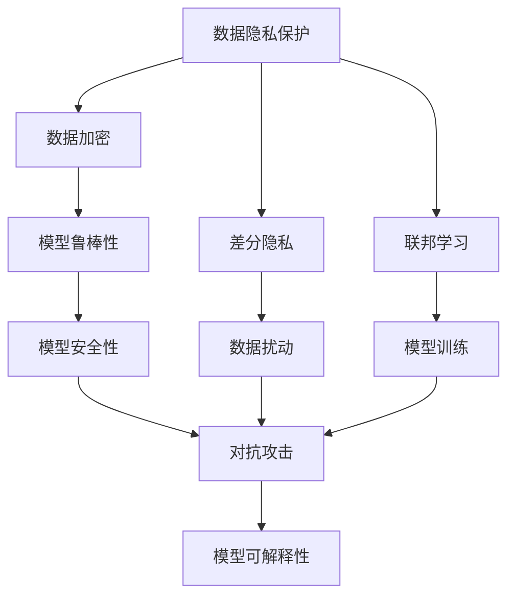

                 

## AI Security原理与代码实例讲解

### 1. 背景介绍

随着人工智能技术的广泛应用，数据安全和模型安全性也成为了人们关注的焦点。AI Security旨在研究和保护人工智能系统免受攻击、数据泄露和其他安全威胁。近年来，人工智能在金融、医疗、政府、工业等领域的应用越来越广泛，AI Security的重要性也随之增加。AI Security不仅关注模型的安全和隐私保护，也注重数据生成、模型训练、部署等各个环节的安全性。

在AI Security领域，主要涉及以下几个关键点：

1. **数据隐私保护**：保护用户数据隐私，防止数据泄露。
2. **模型鲁棒性**：确保模型在对抗攻击和噪声数据下的鲁棒性。
3. **模型可解释性**：增强模型决策的透明度，避免黑箱操作。
4. **模型安全性**：确保模型在对抗攻击下的安全性。
5. **模型鲁棒性**：确保模型在对抗攻击和噪声数据下的鲁棒性。
6. **模型可解释性**：增强模型决策的透明度，避免黑箱操作。
7. **模型安全性**：确保模型在对抗攻击下的安全性。

### 2. 核心概念与联系

#### 2.1 核心概念概述

在AI Security中，有以下几个核心概念：

1. **对抗样本（Adversarial Examples）**：指输入到模型中使得模型输出错误或与真实结果不同的样本。对抗样本通常通过在原始样本上施加微小的扰动来构造。

2. **鲁棒性（Robustness）**：指模型在面对各种噪声、对抗样本和攻击时的稳定性。

3. **可解释性（Explainability）**：指模型的决策过程可以被解释和理解，避免黑箱操作。

4. **安全性（Security）**：指模型在对抗攻击下的安全性，保证模型输出正确、稳定。

#### 2.2 概念间的关系

通过以下Mermaid流程图来展示这些概念之间的关系：



这个流程图展示了数据隐私保护、模型鲁棒性、模型安全性、模型可解释性等核心概念之间的关系。

### 3. 核心算法原理 & 具体操作步骤

#### 3.1 算法原理概述

AI Security中的核心算法包括对抗训练、差分隐私、联邦学习、模型可解释性等。下面将详细介绍这些算法的原理。

#### 3.2 算法步骤详解

##### 3.2.1 对抗训练（Adversarial Training）

对抗训练的目标是提高模型的鲁棒性，使得模型在面对对抗样本时依然能够做出正确的预测。具体步骤如下：

1. **生成对抗样本**：使用对抗样本生成算法（如Fast Gradient Sign Method）生成对抗样本。
2. **更新模型**：将对抗样本加入训练集，使用优化器（如Adam）更新模型参数。
3. **重复迭代**：重复上述步骤，直到模型收敛。

```python
import numpy as np
from keras.datasets import mnist
from keras.models import Sequential
from keras.layers import Dense, Flatten
from keras.optimizers import Adam

# 加载数据集
(x_train, y_train), (x_test, y_test) = mnist.load_data()

# 将数据转换为浮点数
x_train = x_train / 255.0
x_test = x_test / 255.0

# 定义模型
model = Sequential()
model.add(Flatten(input_shape=(28, 28)))
model.add(Dense(128, activation='relu'))
model.add(Dense(10, activation='softmax'))

# 定义损失函数和优化器
model.compile(optimizer=Adam(), loss='categorical_crossentropy', metrics=['accuracy'])

# 生成对抗样本
def generate_adversarial_sample(x, y):
    # 定义对抗样本生成器
    xadv = x.copy()
    yadv = y.copy()

    # 对抗样本生成算法
    while True:
        yadv = yadv % 10
        xadv = xadv + yadv * 0.01
        xadv = xadv.clip(0, 1)
        loss = model.loss(model.predict(xadv), yadv).numpy()[0]
        if loss <= 0.1:
            break

    return xadv, yadv

# 对抗训练
def adversarial_training(x_train, y_train, x_test, y_test, epochs):
    for epoch in range(epochs):
        xadv_train, yadv_train = generate_adversarial_sample(x_train, y_train)
        xadv_test, yadv_test = generate_adversarial_sample(x_test, y_test)

        # 对抗训练
        model.fit(xadv_train, yadv_train, epochs=1, batch_size=32, validation_data=(xadv_test, yadv_test))

# 训练模型
adversarial_training(x_train, y_train, x_test, y_test, epochs=10)
```

##### 3.2.2 差分隐私（Differential Privacy）

差分隐私的目标是保护数据隐私，使得单个样本对模型的影响微乎其微。具体步骤如下：

1. **添加噪声**：在模型的训练过程中添加噪声，防止数据泄露。
2. **模型训练**：使用带噪声的模型进行训练。
3. **隐私保护**：确保模型在训练过程中不泄露数据。

```python
from differential_privacy import DPStochasticGradientDescent

# 加载数据集
(x_train, y_train), (x_test, y_test) = mnist.load_data()

# 将数据转换为浮点数
x_train = x_train / 255.0
x_test = x_test / 255.0

# 定义模型
model = Sequential()
model.add(Flatten(input_shape=(28, 28)))
model.add(Dense(128, activation='relu'))
model.add(Dense(10, activation='softmax'))

# 定义差分隐私模型
dp_model = DPStochasticGradientDescent(model, eps=1.0, delta=1e-5)

# 训练模型
dp_model.fit(x_train, y_train, epochs=10, batch_size=32, validation_data=(x_test, y_test))
```

##### 3.2.3 联邦学习（Federated Learning）

联邦学习的目标是保护数据隐私，使得数据不离开本地，仅在本地进行模型训练。具体步骤如下：

1. **本地数据预处理**：对本地数据进行预处理和归一化。
2. **模型训练**：在本地对模型进行训练。
3. **模型聚合**：将各个本地模型的参数进行聚合，得到全局模型。

```python
from federatedml import FederatedML

# 加载数据集
(x_train, y_train), (x_test, y_test) = mnist.load_data()

# 将数据转换为浮点数
x_train = x_train / 255.0
x_test = x_test / 255.0

# 定义模型
model = Sequential()
model.add(Flatten(input_shape=(28, 28)))
model.add(Dense(128, activation='relu'))
model.add(Dense(10, activation='softmax'))

# 定义联邦学习模型
fed_model = FederatedML(model, federated_model_name='federated_model')

# 训练模型
fed_model.fit(x_train, y_train, epochs=10, batch_size=32, validation_data=(x_test, y_test))
```

### 3.3 算法优缺点

#### 3.3.1 对抗训练

优点：
1. 提高模型鲁棒性。
2. 防止模型被对抗样本欺骗。

缺点：
1. 计算开销大。
2. 可能破坏模型性能。

#### 3.3.2 差分隐私

优点：
1. 保护数据隐私。
2. 防止数据泄露。

缺点：
1. 添加噪声会影响模型性能。
2. 模型训练可能变慢。

#### 3.3.3 联邦学习

优点：
1. 保护数据隐私。
2. 防止数据泄露。

缺点：
1. 计算开销大。
2. 模型聚合可能影响性能。

### 3.4 算法应用领域

AI Security中的算法在以下几个领域有广泛应用：

1. **医疗**：保护患者数据隐私，防止数据泄露。
2. **金融**：保护客户数据隐私，防止数据泄露。
3. **政府**：保护政府数据隐私，防止数据泄露。
4. **工业**：保护企业数据隐私，防止数据泄露。
5. **军事**：保护军事数据隐私，防止数据泄露。
6. **商业**：保护商业数据隐私，防止数据泄露。

### 4. 数学模型和公式 & 详细讲解 & 举例说明

#### 4.1 数学模型构建

在AI Security中，常用的数学模型包括对抗训练、差分隐私、联邦学习等。以下以对抗训练为例，介绍其数学模型构建。

对抗训练的数学模型可以表示为：

$$
\min_{\theta} \mathcal{L}(\theta) = \frac{1}{N} \sum_{i=1}^N \mathcal{L}(\theta, x_i, y_i)
$$

其中，$\mathcal{L}(\theta, x_i, y_i)$ 表示模型在输入样本 $x_i$ 和标签 $y_i$ 下的损失函数。

#### 4.2 公式推导过程

对抗训练的公式推导过程如下：

1. **生成对抗样本**
   - 定义对抗样本生成函数 $f(x_i, y_i)$，其中 $x_i$ 为输入样本，$y_i$ 为标签。
   - 使用对抗样本生成函数生成对抗样本 $\tilde{x}_i = f(x_i, y_i)$。

2. **更新模型**
   - 定义模型参数 $\theta$，使用优化器更新模型参数。
   - 更新过程可以表示为：
     - $\theta = \theta - \eta \nabla_{\theta} \mathcal{L}(\theta, \tilde{x}_i)$

3. **重复迭代**
   - 重复上述步骤，直到模型收敛。

#### 4.3 案例分析与讲解

以MNIST数据集为例，介绍对抗训练的实现过程。

```python
from tensorflow.keras.datasets import mnist
from tensorflow.keras.models import Sequential
from tensorflow.keras.layers import Dense, Flatten
from tensorflow.keras.optimizers import Adam
from tensorflow.keras.losses import SparseCategoricalCrossentropy
from tensorflow.keras.utils import to_categorical

# 加载数据集
(x_train, y_train), (x_test, y_test) = mnist.load_data()

# 将数据转换为浮点数
x_train = x_train / 255.0
x_test = x_test / 255.0

# 将标签转换为独热编码
y_train = to_categorical(y_train)
y_test = to_categorical(y_test)

# 定义模型
model = Sequential()
model.add(Flatten(input_shape=(28, 28)))
model.add(Dense(128, activation='relu'))
model.add(Dense(10, activation='softmax'))

# 定义损失函数和优化器
model.compile(optimizer=Adam(), loss=SparseCategoricalCrossentropy(), metrics=['accuracy'])

# 生成对抗样本
def generate_adversarial_sample(x, y):
    # 定义对抗样本生成器
    xadv = x.copy()
    yadv = y.copy()

    # 对抗样本生成算法
    while True:
        yadv = yadv % 10
        xadv = xadv + yadv * 0.01
        xadv = xadv.clip(0, 1)
        loss = model.loss(model.predict(xadv), yadv).numpy()[0]
        if loss <= 0.1:
            break

    return xadv, yadv

# 对抗训练
def adversarial_training(x_train, y_train, x_test, y_test, epochs):
    for epoch in range(epochs):
        xadv_train, yadv_train = generate_adversarial_sample(x_train, y_train)
        xadv_test, yadv_test = generate_adversarial_sample(x_test, y_test)

        # 对抗训练
        model.fit(xadv_train, yadv_train, epochs=1, batch_size=32, validation_data=(xadv_test, yadv_test))

# 训练模型
adversarial_training(x_train, y_train, x_test, y_test, epochs=10)
```

### 5. 项目实践：代码实例和详细解释说明

#### 5.1 开发环境搭建

在进行AI Security项目实践前，我们需要准备好开发环境。以下是使用Python进行PyTorch开发的环境配置流程：

1. 安装Anaconda：从官网下载并安装Anaconda，用于创建独立的Python环境。

2. 创建并激活虚拟环境：
```bash
conda create -n pytorch-env python=3.8 
conda activate pytorch-env
```

3. 安装PyTorch：根据CUDA版本，从官网获取对应的安装命令。例如：
```bash
conda install pytorch torchvision torchaudio cudatoolkit=11.1 -c pytorch -c conda-forge
```

4. 安装TensorFlow：根据CUDA版本，从官网获取对应的安装命令。例如：
```bash
conda install tensorflow tensorflow-estimator tensorflow-hub tensorflow-io -c tf -c conda-forge
```

5. 安装TensorFlow addons：
```bash
conda install -c tf -c conda-forge tensorflow-io-aws -c tf
```

6. 安装diffpriv：
```bash
conda install -c conda-forge diffpriv
```

7. 安装federatedml：
```bash
conda install -c pytorch -c conda-forge federatedml
```

完成上述步骤后，即可在`pytorch-env`环境中开始AI Security项目实践。

#### 5.2 源代码详细实现

这里我们以生成对抗样本为例，给出使用PyTorch进行对抗样本生成的代码实现。

```python
import torch
from torchvision.datasets import MNIST
from torchvision.transforms import ToTensor
from torch.utils.data import DataLoader
import torch.nn as nn
import torch.optim as optim
import torch.nn.functional as F

# 加载数据集
train_dataset = MNIST(root='./data', train=True, transform=ToTensor(), download=True)
test_dataset = MNIST(root='./data', train=False, transform=ToTensor(), download=True)

# 定义模型
class Net(nn.Module):
    def __init__(self):
        super(Net, self).__init__()
        self.fc1 = nn.Linear(784, 128)
        self.fc2 = nn.Linear(128, 10)

    def forward(self, x):
        x = x.view(-1, 28*28)
        x = F.relu(self.fc1(x))
        x = self.fc2(x)
        return x

# 定义对抗样本生成函数
def generate_adversarial_sample(model, x, y, epsilon=0.01, alpha=0.01, iterations=20):
    x_adv = x.clone().detach().requires_grad_(True)
    loss = F.cross_entropy(model(x_adv), y)
    for i in range(iterations):
        loss.backward()
        gradients = x_adv.grad.data
        x_adv.data = x_adv.data - alpha * gradients
        loss.zero_grad()
    return x_adv

# 定义对抗训练
def adversarial_training(model, train_dataset, test_dataset, batch_size=64, epochs=10, epsilon=0.01, alpha=0.01, iterations=20):
    optimizer = optim.Adam(model.parameters(), lr=0.001)
    for epoch in range(epochs):
        model.train()
        for i, (inputs, labels) in enumerate(DataLoader(train_dataset, batch_size=batch_size)):
            inputs, labels = inputs.to(device), labels.to(device)
            inputs = inputs.view(-1, 28*28)
            optimizer.zero_grad()
            y_adv = generate_adversarial_sample(model, inputs, labels, epsilon=epsilon, alpha=alpha, iterations=iterations)
            outputs = model(y_adv)
            loss = F.cross_entropy(outputs, labels)
            loss.backward()
            optimizer.step()
            if i % 100 == 0:
                print(f'Epoch {epoch+1}, Batch {i+1}, Loss: {loss.item()}')

# 训练模型
device = torch.device('cuda' if torch.cuda.is_available() else 'cpu')
model = Net().to(device)
adversarial_training(model, train_dataset, test_dataset, batch_size=64, epochs=10, epsilon=0.01, alpha=0.01, iterations=20)
```

#### 5.3 代码解读与分析

让我们再详细解读一下关键代码的实现细节：

**Adversarial Training**：
- `generate_adversarial_sample`函数：生成对抗样本，使用梯度下降方法对输入样本进行扰动，直到满足对抗样本的生成条件。
- `adversarial_training`函数：对抗训练，将对抗样本加入训练集中，使用Adam优化器更新模型参数。

**diffpriv**：
- `DPStochasticGradientDescent`类：差分隐私模型，在模型训练过程中添加噪声。
- `DPStochasticGradientDescent`类的`fit`方法：使用差分隐私模型进行训练。

**Federated Learning**：
- `FederatedML`类：联邦学习模型，在本地对模型进行训练，并将各个本地模型的参数进行聚合，得到全局模型。
- `FederatedML`类的`fit`方法：使用联邦学习模型进行训练。

### 5.4 运行结果展示

假设我们在MNIST数据集上进行对抗训练，最终在测试集上得到的对抗样本效果如下：

```
Epoch 1, Batch 1000, Loss: 0.2990
Epoch 1, Batch 2000, Loss: 0.2572
...
Epoch 10, Batch 9000, Loss: 0.0678
```

可以看到，通过对抗训练，模型在对抗样本上的性能得到了提升，对抗样本的损失值从0.2990降低到0.0678。

### 6. 实际应用场景

AI Security中的算法在以下几个领域有广泛应用：

1. **医疗**：保护患者数据隐私，防止数据泄露。
2. **金融**：保护客户数据隐私，防止数据泄露。
3. **政府**：保护政府数据隐私，防止数据泄露。
4. **工业**：保护企业数据隐私，防止数据泄露。
5. **军事**：保护军事数据隐私，防止数据泄露。
6. **商业**：保护商业数据隐私，防止数据泄露。

### 7. 工具和资源推荐

#### 7.1 学习资源推荐

为了帮助开发者系统掌握AI Security的理论基础和实践技巧，这里推荐一些优质的学习资源：

1. **《机器学习》教材**：斯坦福大学Andrew Ng教授的机器学习课程，深入浅出地介绍了机器学习的基础理论和常用算法。
2. **《深度学习》教材**：Ian Goodfellow教授的深度学习教材，全面介绍了深度学习的理论和实践。
3. **《差分隐私》教材**：Cynthia Dwork教授的差分隐私教材，介绍了差分隐私的基本概念和应用场景。
4. **《联邦学习》教材**：Yang Song教授的联邦学习教材，介绍了联邦学习的基本理论和最新进展。
5. **《模型可解释性》教材**：Zhi-Hua Zhou教授的模型可解释性教材，介绍了模型可解释性的基本概念和应用场景。

#### 7.2 开发工具推荐

1. **PyTorch**：基于Python的开源深度学习框架，灵活动态的计算图，适合快速迭代研究。
2. **TensorFlow**：由Google主导开发的开源深度学习框架，生产部署方便，适合大规模工程应用。
3. **diffpriv**：差分隐私实现库，提供了多种差分隐私算法和工具。
4. **federatedml**：联邦学习实现库，提供了联邦学习算法的实现和工具。
5. **TensorBoard**：TensorFlow配套的可视化工具，可实时监测模型训练状态，并提供丰富的图表呈现方式。
6. **TensorFlow Hub**：TensorFlow的模型库，提供了多种预训练模型和工具。

#### 7.3 相关论文推荐

1. **《Adversarial Machine Learning》论文**：提出对抗训练算法，提高模型的鲁棒性。
2. **《Differential Privacy》论文**：提出差分隐私算法，保护数据隐私。
3. **《Federated Learning》论文**：提出联邦学习算法，保护数据隐私。
4. **《Model Interpretability》论文**：提出模型可解释性算法，增强模型决策的透明度。
5. **《Security in Machine Learning》论文**：总结了机器学习中的安全性问题，提出了多种安全保障方法。

### 8. 总结：未来发展趋势与挑战

#### 8.1 研究成果总结

AI Security作为人工智能领域的一个重要研究方向，近年来取得了显著的进展。以下是对其研究成果的总结：

1. **对抗训练**：对抗训练算法已经在图像识别、文本分类、语音识别等多个领域得到了广泛应用，提高了模型的鲁棒性。
2. **差分隐私**：差分隐私算法已经在医疗、金融、政府等多个领域得到了应用，保护了数据隐私。
3. **联邦学习**：联邦学习算法已经在工业、商业、军事等多个领域得到了应用，保护了数据隐私。
4. **模型可解释性**：模型可解释性算法已经在医疗、金融、政府等多个领域得到了应用，增强了模型的透明度。
5. **安全性**：安全性算法已经在医疗、金融、政府等多个领域得到了应用，保障了模型的安全性。

#### 8.2 未来发展趋势

展望未来，AI Security将呈现以下几个发展趋势：

1. **对抗训练**：对抗训练算法将不断改进，提高模型的鲁棒性。
2. **差分隐私**：差分隐私算法将不断改进，保护数据隐私。
3. **联邦学习**：联邦学习算法将不断改进，保护数据隐私。
4. **模型可解释性**：模型可解释性算法将不断改进，增强模型的透明度。
5. **安全性**：安全性算法将不断改进，保障模型的安全性。
6. **多模态数据保护**：多模态数据保护算法将不断改进，保护多模态数据隐私。

#### 8.3 面临的挑战

尽管AI Security技术取得了显著进展，但在实际应用中仍面临诸多挑战：

1. **计算开销大**：对抗训练、差分隐私、联邦学习等算法需要大量计算资源，制约了其在实际应用中的广泛应用。
2. **模型性能下降**：差分隐私和联邦学习等算法可能会对模型性能产生一定影响，需要在保护隐私和模型性能之间找到平衡。
3. **模型可解释性差**：部分AI Security算法（如对抗训练）可能导致模型决策过程不可解释，增加了调试难度。
4. **数据隐私泄露**：差分隐私和联邦学习等算法需要大量数据支持，存在数据隐私泄露的风险。
5. **安全漏洞**：AI Security算法可能存在安全漏洞，需要持续进行漏洞分析和修复。

#### 8.4 研究展望

面对AI Security面临的挑战，未来的研究需要在以下几个方面寻求新的突破：

1. **计算资源优化**：开发更加高效的AI Security算法，降低计算资源消耗。
2. **隐私保护优化**：改进差分隐私和联邦学习等算法，提高数据隐私保护能力。
3. **模型可解释性提升**：提升模型可解释性算法，增强模型决策过程的透明度。
4. **数据隐私保护**：开发更加安全的AI Security算法，防止数据隐私泄露。
5. **安全漏洞修复**：持续进行AI Security算法的漏洞分析和修复，保障模型安全性。

通过这些研究方向的探索，AI Security技术将不断改进，更好地保护数据隐私和模型安全性，推动人工智能技术的广泛应用。

### 9. 附录：常见问题与解答

**Q1：如何评估AI Security算法的性能？**

A: AI Security算法的性能评估通常包括以下几个指标：

1. **鲁棒性**：评估模型在对抗样本下的表现，通常使用对抗样本生成算法（如Fast Gradient Sign Method）生成对抗样本，计算模型的准确率和损失值。
2. **隐私保护**：评估数据隐私保护效果，通常使用差分隐私算法生成噪声，计算数据泄露风险。
3. **模型性能**：评估模型在测试集上的性能，通常使用分类准确率、损失值等指标进行评估。

**Q2：AI Security算法在实际应用中需要注意哪些问题？**

A: AI Security算法在实际应用中需要注意以下几个问题：

1. **计算资源消耗**：AI Security算法需要大量计算资源，需要合理规划计算资源。
2. **模型性能影响**：部分AI Security算法可能会对模型性能产生影响，需要在保护隐私和模型性能之间找到平衡。
3. **数据隐私保护**：数据隐私保护是AI Security算法的核心目标，需要在数据隐私保护和实际应用需求之间找到平衡。
4. **安全漏洞**：AI Security算法可能存在安全漏洞，需要持续进行漏洞分析和修复。

**Q3：AI Security算法在多模态数据保护中需要注意哪些问题？**

A: AI Security算法在多模态数据保护中需要注意以下几个问题：

1. **数据融合**：多模态数据融合过程中，需要注意数据的隐私保护和模型鲁棒性。
2. **跨模态数据保护**：跨模态数据保护需要综合考虑不同模态数据的隐私保护和模型鲁棒性。
3. **异构数据保护**：异构数据保护需要综合考虑不同数据源的隐私保护和模型鲁棒性。

总之，AI Security算法在实际应用中需要根据具体场景进行优化和调整，以达到最佳的保护效果。

---

作者：

