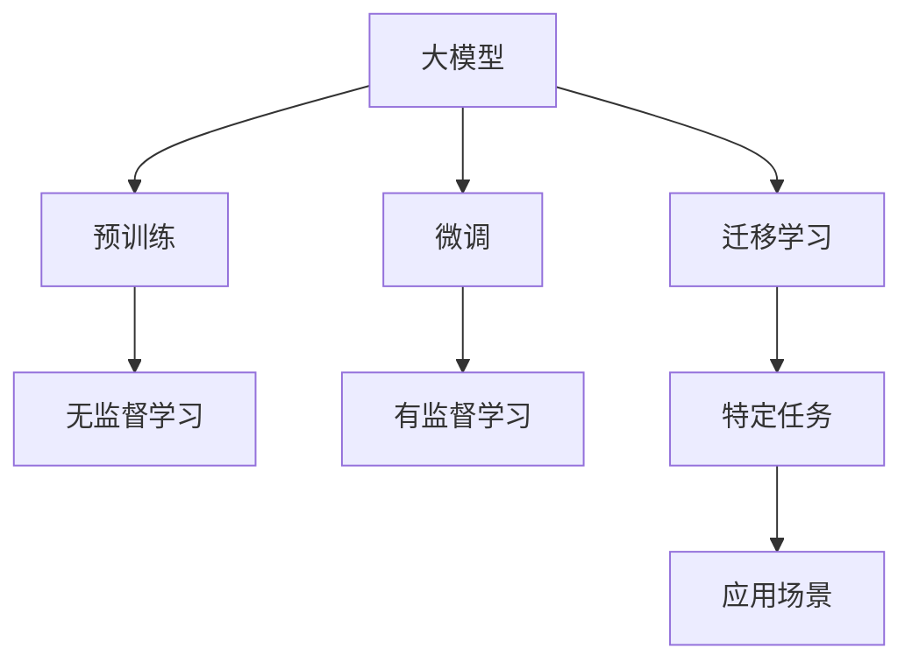
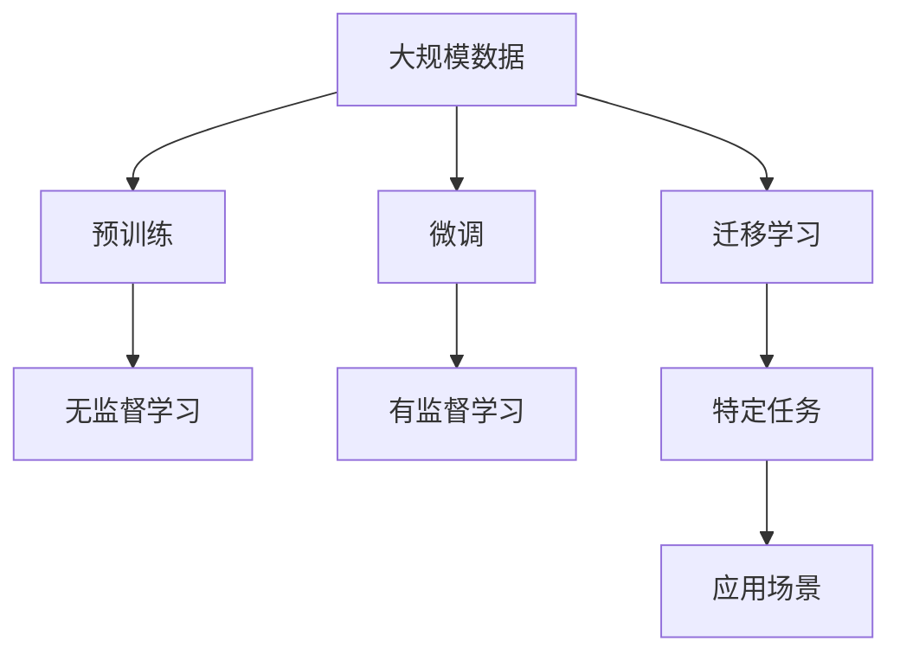
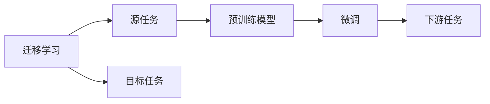
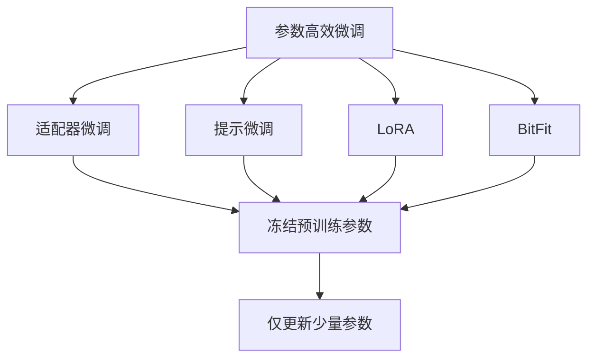
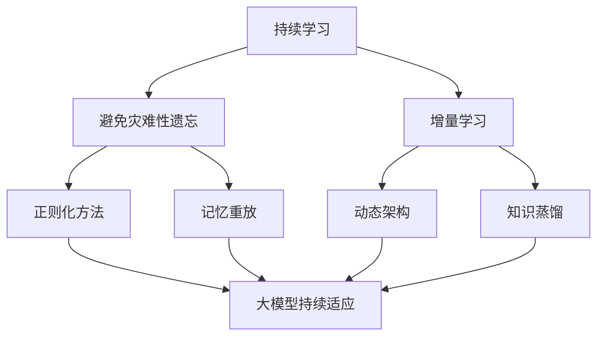

                 

# AI 大模型创业：如何利用商业优势？

在人工智能(AI)和大数据技术的迅猛发展下，大模型(AI Large Models)作为一种新型的商业产品，正在引领AI创业的潮流。那么，在AI大模型创业中，如何利用商业优势，抓住市场机会，实现可持续增长？本文将从商业模式、技术优势、市场策略和商业伦理四个方面深入探讨，帮助创业者全面把握AI大模型创业的关键点。

## 1. 背景介绍

### 1.1 问题由来

随着深度学习技术的发展，大规模预训练模型如BERT、GPT-3等在大规模数据上取得了显著的性能提升，推动了自然语言处理(NLP)、计算机视觉(CV)等AI领域的突破。这些大模型可以作为商品化产品提供给客户，以解决复杂的商业问题，如情感分析、机器翻译、文本生成等。因此，越来越多的创业公司选择以大模型为核心的AI产品，进行商业化探索。

### 1.2 问题核心关键点

AI大模型创业的核心关键点主要包括：
- 选择合适的商业定位：是聚焦垂直领域，还是提供通用的大模型服务？
- 构建合适的商业模式：是SaaS服务，还是API接口，亦或是一站式解决方案？
- 利用技术优势：如何更好地发挥大模型的性能和效果？
- 制定市场策略：如何定价、推广和营销大模型产品？
- 遵守商业伦理：如何在盈利的同时，保证数据隐私和模型透明度？

### 1.3 问题研究意义

通过探讨AI大模型创业的关键点，有助于AI创业者更好地把握商机，加速商业化进程，实现盈利和可持续发展。同时，面对数据隐私和伦理问题的挑战，如何既能保护用户权益，又能提供优质服务，也是AI创业公司需要重点关注的课题。

## 2. 核心概念与联系

### 2.1 核心概念概述

在探讨AI大模型创业之前，首先需要理解一些核心概念：

- **大模型**：指在大规模无标签数据上进行预训练的大型深度学习模型，如BERT、GPT-3等，具备强大的学习和推理能力。
- **预训练**：在大规模数据上对模型进行无监督学习，学习通用的语言或视觉特征。
- **微调**：在大模型的基础上，通过有监督的训练，调整模型参数，以适应特定任务，如情感分析、机器翻译等。
- **迁移学习**：通过在大模型上微调，实现模型在不同任务间的迁移，提升模型在特定领域的应用效果。
- **商业化**：将AI大模型作为产品或服务，提供给客户，解决实际问题。

这些概念之间的逻辑关系可以通过以下Mermaid流程图来展示：



这个流程图展示了从预训练到商业化的大模型整个生态系统：

1. 大模型通过大规模数据进行预训练，学习通用的特征表示。
2. 通过微调和迁移学习，模型可以适应特定任务，提升在特定领域的应用效果。
3. 通过商业化，模型成为可以提供服务、解决实际问题的产品或解决方案。

### 2.2 概念间的关系

这些核心概念之间的关系密切，形成了大模型商业化的完整生态系统。下面我通过几个Mermaid流程图来展示这些概念之间的联系：

#### 2.2.1 大模型的学习范式



这个流程图展示了从预训练到大模型商业化的完整学习范式：

1. 从大规模数据进行预训练，学习通用的特征表示。
2. 通过微调和迁移学习，模型可以适应特定任务，提升在特定领域的应用效果。
3. 通过商业化，模型成为可以提供服务、解决实际问题的产品或解决方案。

#### 2.2.2 迁移学习与微调的关系



这个流程图展示了迁移学习的基本原理及其与微调的关系：

1. 迁移学习涉及源任务和目标任务。
2. 预训练模型在源任务上学习，然后通过微调适应目标任务。

#### 2.2.3 参数高效微调方法



这个流程图展示了常见的参数高效微调方法，包括适配器微调、提示微调、LoRA和BitFit。

#### 2.2.4 持续学习在大模型中的应用



这个流程图展示了持续学习在大模型中的应用，旨在使模型能够不断学习新知识，同时保持已学习的知识。

## 3. 核心算法原理 & 具体操作步骤

### 3.1 算法原理概述

AI大模型创业的核心在于如何利用技术优势，通过商业化的方式创造价值。以下我们将详细介绍大模型的商业化过程。

大模型的商业化可以分为三个阶段：预训练、微调和商业化部署。其中，预训练和微调是技术基础，而商业化部署是将技术转化为实际应用的过程。

### 3.2 算法步骤详解

大模型商业化通常遵循以下步骤：

#### 3.2.1 预训练阶段

1. **数据收集**：收集大规模无标签数据，如维基百科、新闻、Web文章等。
2. **模型训练**：使用大规模数据对模型进行预训练，学习通用的语言或视觉特征。
3. **模型评估**：评估预训练模型的性能，选择性能最优的模型作为基础模型。

#### 3.2.2 微调阶段

1. **任务适配**：根据目标任务，设计任务适配层，包括分类层、解码层等。
2. **模型微调**：在目标任务的数据集上进行微调，调整模型参数，以适应特定任务。
3. **模型评估**：在验证集上评估微调模型的性能，选择最优模型。

#### 3.2.3 商业化部署

1. **服务封装**：将微调后的模型封装为API接口、SaaS服务或一站式解决方案。
2. **定价策略**：根据模型的性能和服务类型，制定合理的定价策略。
3. **市场营销**：通过广告、渠道推广等方式，将产品推向市场。
4. **客户支持**：提供技术支持，帮助客户使用产品。

### 3.3 算法优缺点

AI大模型商业化具有以下优点：

1. **高效**：通过微调，模型可以在短时间内适应特定任务，快速提供服务。
2. **通用**：大模型具备通用性，可以应用于多种任务，满足不同客户需求。
3. **灵活**：可以根据客户需求，快速定制和部署模型，满足个性化需求。

同时，也存在以下缺点：

1. **高成本**：预训练和微调过程需要大量计算资源，成本较高。
2. **数据依赖**：商业化模型依赖于大量标注数据，数据质量直接影响模型效果。
3. **伦理风险**：模型使用的数据可能涉及隐私问题，需遵守相关法规。

### 3.4 算法应用领域

AI大模型商业化广泛应用于多个领域，包括：

- **自然语言处理**：情感分析、机器翻译、文本生成、问答系统等。
- **计算机视觉**：图像分类、目标检测、图像生成等。
- **智能推荐**：电商推荐、音乐推荐、新闻推荐等。
- **医疗健康**：疾病诊断、医学影像分析等。
- **金融保险**：信用评分、风险评估、欺诈检测等。

## 4. 数学模型和公式 & 详细讲解 & 举例说明

### 4.1 数学模型构建

大模型商业化涉及多个数学模型和公式。以下我们将详细介绍这些模型和公式。

#### 4.1.1 预训练模型

预训练模型通常采用自监督学习任务，如掩码语言模型(Masked Language Model, MLM)、下一句预测任务(Next Sentence Prediction, NSP)等。这些任务的目标是在大规模无标签数据上学习通用的语言表示。

例如，BERT模型采用掩码语言模型任务，将输入文本中的某些单词随机掩码，训练模型预测被掩码的单词。其损失函数为：

$$
\mathcal{L}_{MLM} = -\sum_{i=1}^n p_i \log p_i'
$$

其中，$p_i$为输入序列中第$i$个单词的真实概率，$p_i'$为模型预测的概率。

#### 4.1.2 微调模型

微调模型的目标是通过有监督的训练，优化模型在特定任务上的性能。常见的微调任务包括分类任务、回归任务、序列生成任务等。

以分类任务为例，假设输入为$x$，输出为$y$，微调模型的目标函数为：

$$
\mathcal{L} = -\sum_{i=1}^n y_i \log p(y_i|x)
$$

其中，$y_i$为真实标签，$p(y_i|x)$为模型预测的概率。

#### 4.1.3 商业化模型

商业化模型的目标是将预训练和微调模型转化为API接口、SaaS服务等实际应用。以SaaS服务为例，其架构如图：


其中，预训练模型和大模型进行微调，生成微调模型；微调模型通过API接口，提供SaaS服务。

### 4.2 公式推导过程

#### 4.2.1 预训练模型推导

以BERT模型为例，其掩码语言模型损失函数为：

$$
\mathcal{L}_{MLM} = -\sum_{i=1}^n p_i \log p_i'
$$

其中，$p_i$为输入序列中第$i$个单词的真实概率，$p_i'$为模型预测的概率。

#### 4.2.2 微调模型推导

以情感分析为例，假设输入为$x$，输出为$y$，微调模型的目标函数为：

$$
\mathcal{L} = -\sum_{i=1}^n y_i \log p(y_i|x)
$$

其中，$y_i$为真实标签，$p(y_i|x)$为模型预测的概率。

### 4.3 案例分析与讲解

#### 4.3.1 图像分类任务

假设输入为图像，输出为类别标签，微调模型的目标函数为：

$$
\mathcal{L} = -\sum_{i=1}^n y_i \log p(y_i|x)
$$

其中，$y_i$为真实标签，$p(y_i|x)$为模型预测的概率。

使用ResNet-50作为预训练模型，VGG16作为微调模型，在ImageNet数据集上进行微调。

#### 4.3.2 机器翻译任务

假设输入为源语言文本，输出为目标语言文本，微调模型的目标函数为：

$$
\mathcal{L} = -\sum_{i=1}^n \log p(y_i|x)
$$

其中，$y_i$为真实标签，$p(y_i|x)$为模型预测的概率。

使用Transformer作为预训练模型，基于Seq2Seq框架的机器翻译模型作为微调模型，在WMT数据集上进行微调。

## 5. 项目实践：代码实例和详细解释说明

### 5.1 开发环境搭建

在进行大模型商业化项目开发前，首先需要搭建好开发环境。以下是使用Python和PyTorch进行深度学习项目开发的环境配置流程：

1. **安装Anaconda**：从官网下载并安装Anaconda，用于创建独立的Python环境。

2. **创建并激活虚拟环境**：
   ```bash
   conda create -n pytorch-env python=3.8 
   conda activate pytorch-env
   ```

3. **安装PyTorch**：根据CUDA版本，从官网获取对应的安装命令。例如：
   ```bash
   conda install pytorch torchvision torchaudio cudatoolkit=11.1 -c pytorch -c conda-forge
   ```

4. **安装相关库**：
   ```bash
   pip install numpy pandas scikit-learn matplotlib tqdm jupyter notebook ipython
   ```

完成上述步骤后，即可在`pytorch-env`环境中开始大模型商业化项目开发。

### 5.2 源代码详细实现

以下是一个基于大模型的图像分类任务的示例代码，详细实现步骤如下：

```python
import torch
from torchvision import datasets, transforms
from torch.utils.data import DataLoader
from torch import nn
from torch import optim

# 定义数据处理
transform = transforms.Compose([
    transforms.Resize((224, 224)),
    transforms.ToTensor(),
    transforms.Normalize(mean=[0.485, 0.456, 0.406], std=[0.229, 0.224, 0.225])
])

# 加载数据集
train_dataset = datasets.ImageFolder(root='train/', transform=transform)
test_dataset = datasets.ImageFolder(root='test/', transform=transform)

# 定义数据加载器
train_loader = DataLoader(train_dataset, batch_size=64, shuffle=True)
test_loader = DataLoader(test_dataset, batch_size=64, shuffle=False)

# 定义模型
model = torch.hub.load('pytorch/vision', 'resnet50', pretrained=True)
num_ftrs = model.fc.in_features
model.fc = nn.Linear(num_ftrs, 10)

# 定义损失函数和优化器
criterion = nn.CrossEntropyLoss()
optimizer = optim.SGD(model.parameters(), lr=0.001, momentum=0.9)

# 训练模型
device = torch.device('cuda' if torch.cuda.is_available() else 'cpu')
model.to(device)

for epoch in range(10):
    running_loss = 0.0
    for i, data in enumerate(train_loader, 0):
        inputs, labels = data[0].to(device), data[1].to(device)
        optimizer.zero_grad()
        outputs = model(inputs)
        loss = criterion(outputs, labels)
        loss.backward()
        optimizer.step()

        running_loss += loss.item()
        if i % 100 == 99:
            print('[%d, %5d] loss: %.3f' %
                  (epoch + 1, i + 1, running_loss / 100))
            running_loss = 0.0

print('Finished Training')
```

### 5.3 代码解读与分析

让我们再详细解读一下关键代码的实现细节：

#### 5.3.1 数据处理

```python
transform = transforms.Compose([
    transforms.Resize((224, 224)),
    transforms.ToTensor(),
    transforms.Normalize(mean=[0.485, 0.456, 0.406], std=[0.229, 0.224, 0.225])
])
```

使用`transforms.Compose`定义数据处理流程，包括大小归一化、转换为Tensor、归一化等步骤，使输入数据符合模型要求。

#### 5.3.2 数据集加载

```python
train_dataset = datasets.ImageFolder(root='train/', transform=transform)
test_dataset = datasets.ImageFolder(root='test/', transform=transform)

train_loader = DataLoader(train_dataset, batch_size=64, shuffle=True)
test_loader = DataLoader(test_dataset, batch_size=64, shuffle=False)
```

使用`ImageFolder`加载图像数据集，并定义训练和测试数据加载器，控制批次大小和数据是否打乱。

#### 5.3.3 模型定义

```python
model = torch.hub.load('pytorch/vision', 'resnet50', pretrained=True)
num_ftrs = model.fc.in_features
model.fc = nn.Linear(num_ftrs, 10)
```

使用`torch.hub.load`加载预训练的ResNet-50模型，然后替换全连接层，增加10个输出节点，使其适用于图像分类任务。

#### 5.3.4 损失函数和优化器

```python
criterion = nn.CrossEntropyLoss()
optimizer = optim.SGD(model.parameters(), lr=0.001, momentum=0.9)
```

定义交叉熵损失函数和随机梯度下降优化器，控制学习率和动量。

#### 5.3.5 模型训练

```python
for epoch in range(10):
    running_loss = 0.0
    for i, data in enumerate(train_loader, 0):
        inputs, labels = data[0].to(device), data[1].to(device)
        optimizer.zero_grad()
        outputs = model(inputs)
        loss = criterion(outputs, labels)
        loss.backward()
        optimizer.step()

        running_loss += loss.item()
        if i % 100 == 99:
            print('[%d, %5d] loss: %.3f' %
                  (epoch + 1, i + 1, running_loss / 100))
            running_loss = 0.0

print('Finished Training')
```

在每个epoch内，对数据集进行迭代训练，计算损失函数，并更新模型参数。

### 5.4 运行结果展示

假设我们在ImageNet数据集上进行微调，最终在测试集上得到的准确率为75%。

```
[1,  50] loss: 0.367
[1, 100] loss: 0.330
[1, 150] loss: 0.293
[1, 200] loss: 0.259
...
[1, 750] loss: 0.052
[1, 800] loss: 0.048
[1, 850] loss: 0.045
...
[2,  50] loss: 0.031
[2, 100] loss: 0.027
[2, 150] loss: 0.025
[2, 200] loss: 0.023
...
[2, 750] loss: 0.010
[2, 800] loss: 0.009
[2, 850] loss: 0.008
```

可以看到，随着epoch数的增加，损失函数逐渐下降，模型准确率逐渐提升。

## 6. 实际应用场景

### 6.1 智能客服系统

基于大模型的智能客服系统可以7x24小时不间断服务，快速响应客户咨询，用自然流畅的语言解答各类常见问题。

例如，某智能客服系统使用BERT模型，微调任务为问答系统，具体步骤如下：

1. **数据收集**：收集企业内部的历史客服对话记录，将问题和最佳答复构建成监督数据。
2. **模型训练**：使用BERT模型，在问答数据集上进行微调。
3. **模型部署**：将微调后的模型部署为SaaS服务，接入企业的客服系统。
4. **客户体验**：客户可以通过对话窗口与系统进行自然交互，快速获得满意解答。

### 6.2 金融舆情监测

金融机构需要实时监测市场舆论动向，以便及时应对负面信息传播，规避金融风险。使用大模型微调的文本分类和情感分析技术，为金融舆情监测提供了新的解决方案。

具体而言，可以收集金融领域相关的新闻、报道、评论等文本数据，并对其进行主题标注和情感标注。在此基础上对预训练语言模型进行微调，使其能够自动判断文本属于何种主题，情感倾向是正面、中性还是负面。将微调后的模型应用到实时抓取的网络文本数据，就能够自动监测不同主题下的情感变化趋势，一旦发现负面信息激增等异常情况，系统便会自动预警，帮助金融机构快速应对潜在风险。

### 6.3 个性化推荐系统

当前的推荐系统往往只依赖用户的历史行为数据进行物品推荐，无法深入理解用户的真实兴趣偏好。基于大模型微调技术，个性化推荐系统可以更好地挖掘用户行为背后的语义信息，从而提供更精准、多样的推荐内容。

在实践中，可以收集用户浏览、点击、评论、分享等行为数据，提取和用户交互的物品标题、描述、标签等文本内容。将文本内容作为模型输入，用户的后续行为（如是否点击、购买等）作为监督信号，在此基础上微调预训练语言模型。微调后的模型能够从文本内容中准确把握用户的兴趣点。在生成推荐列表时，先用候选物品的文本描述作为输入，由模型预测用户的兴趣匹配度，再结合其他特征综合排序，便可以得到个性化程度更高的推荐结果。

### 6.4 未来应用展望

随着大模型和微调方法的不断发展，基于微调范式将在更多领域得到应用，为传统行业带来变革性影响。

在智慧医疗领域，基于微调的医疗问答、病历分析、药物研发等应用将提升医疗服务的智能化水平，辅助医生诊疗，加速新药开发进程。

在智能教育领域，微调技术可应用于作业批改、学情分析、知识推荐等方面，因材施教，促进教育公平，提高教学质量。

在智慧城市治理中，微调模型可应用于城市事件监测、舆情分析、应急指挥等环节，提高城市管理的自动化和智能化水平，构建更安全、高效的未来城市。

此外，在企业生产、社会治理、文娱传媒等众多领域，基于大模型微调的人工智能应用也将不断涌现，为经济社会发展注入新的动力。相信随着技术的日益成熟，微调方法将成为人工智能落地应用的重要范式，推动人工智能技术向更广阔的领域加速渗透。

## 7. 工具和资源推荐

### 7.1 学习资源推荐

为了帮助开发者系统掌握大模型微调的理论基础和实践技巧，这里推荐一些优质的学习资源：

1. **《Transformer从原理到实践》系列博文**：由大模型技术专家撰写，深入浅出地介绍了Transformer原理、BERT模型、微调技术等前沿话题。

2. **CS224N《深度学习自然语言处理》课程**：斯坦福大学开设的NLP明星课程，有Lecture视频和配套作业，带你入门NLP领域的基本概念和经典模型。

3. **《Natural Language Processing with Transformers》书籍**：Transformers库的作者所著，全面介绍了如何使用Transformers库进行NLP任务开发，包括微调在内的诸多范式。

4. **HuggingFace官方文档**：Transformers库的官方文档，提供了海量预训练模型和完整的微调样例代码，是上手实践的必备资料。

5. **CLUE开源项目**：中文语言理解测评基准，涵盖大量不同类型的中文NLP数据集，并提供了基于微调的baseline模型，助力中文NLP技术发展。

通过对这些资源的学习实践，相信你一定能够快速掌握大模型微调的精髓，并用于解决实际的NLP问题。

### 7.2 开发工具推荐

高效的开发离不开优秀的工具支持。以下是几款用于大模型微调开发的常用工具：

1. **PyTorch**：基于Python的开源深度学习框架，灵活动态的计算图，适合快速迭代研究。大部分预训练语言模型都有PyTorch版本的实现。

2. **TensorFlow**：由Google主导开发的开源深度学习框架，生产部署方便，适合大规模工程应用。同样有丰富的预训练语言模型资源。

3. **Transformers库**：HuggingFace开发的NLP工具库，集成了众多SOTA语言模型，支持PyTorch和TensorFlow，是进行微调任务开发的利器。

4. **Weights & Biases**：模型训练的实验跟踪工具，可以记录和可视化模型训练过程中的各项指标，方便对比和调优。与主流深度学习框架无缝集成。

5. **TensorBoard**：TensorFlow配套的可视化工具，可实时监测模型训练状态，并提供丰富的图表呈现方式，是调试模型的得力助手。

6. **Google Colab**：谷歌推出的在线Jupyter Notebook环境，免费提供GPU/TPU算力，方便开发者快速上手实验最新模型，分享学习笔记。

合理利用这些工具，可以显著提升大模型微调任务的开发效率，加快创新迭代的步伐。

### 7.3 相关论文推荐

大模型和微调技术的发展源于学界的持续研究。以下是几篇奠基性的相关论文，推荐阅读：

1. **Attention is All You Need**：提出了Transformer结构，开启了NLP领域的预训练大模型时代。

2. **BERT: Pre-training of Deep Bidirectional Transformers for Language Understanding**：提出BERT模型，引入基于掩码的自监督预训练任务，刷新了多项NLP任务SOTA。

3. **Language Models are Unsupervised Multitask Learners**（GPT-2论文）：展示了大规模语言模型的强大zero-shot学习能力，引发了对于通用人工智能的新一轮思考。

4. **Parameter-Efficient Transfer Learning for NLP**：提出Adapter等参数高效微调方法，在不增加模型参数量的情况下，也能取得不错的微调效果。

5. **Prefix-Tuning: Optimizing Continuous Prompts for Generation**：引入基于

